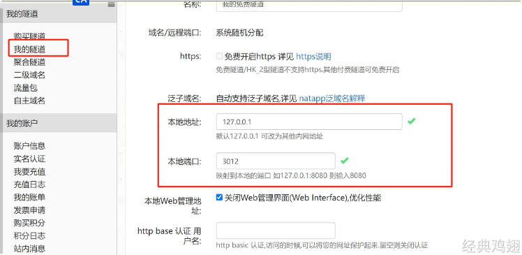

不同电脑下载地址：[https://natapp.cn/#download](https://natapp.cn/#download)  
内网穿透使用指南：

[https://natapp.cn/article/natapp_newbie](https://natapp.cn/article/natapp_newbie)

windows 启动方式：

```java
start natapp -authtoken=xxxx
```

配置内网穿透



