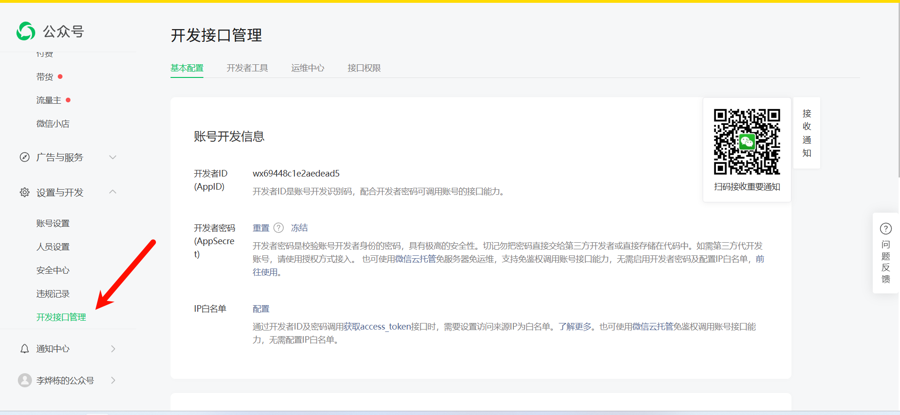
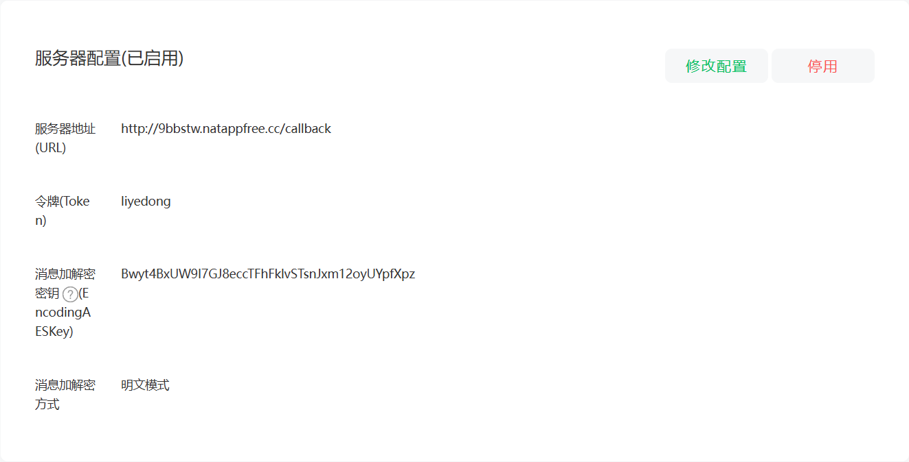
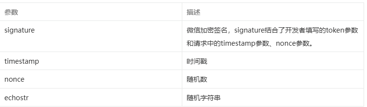
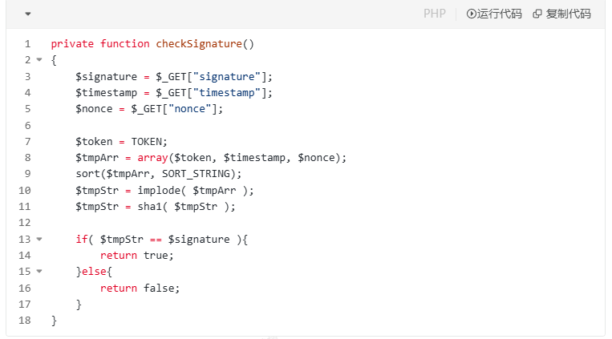
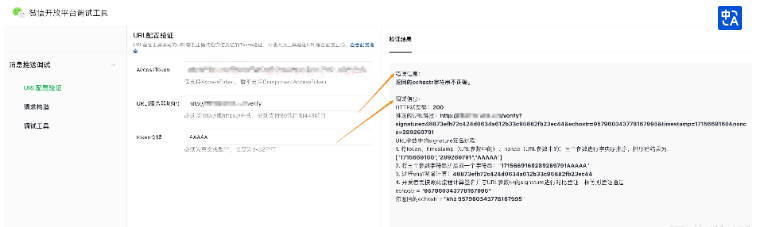

配合视频食用

[feat：微信初步引入](https://gitcode.net/jingdianjichi/jc-club/-/commit/9566ae8544bc9dffa9d5ff5506bb7efd834b6a44)

[feat：微信回调消息](https://gitcode.net/jingdianjichi/jc-club/-/commit/63e2f87fd69847642b412c1b550be2fc843c49d0)

## <font style="color:rgb(34, 34, 34);">接入概述</font>
<font style="color:rgb(34, 34, 34);">接入微信公众平台开发，开发者需要按照如下步骤完成：</font>

[https://developers.weixin.qq.com/doc/subscription/guide/dev/push/](https://developers.weixin.qq.com/doc/subscription/guide/dev/push/)

<font style="color:rgb(34, 34, 34);">1、填写服务器配置</font>

<font style="color:rgb(34, 34, 34);">2、验证服务器地址的有效性</font>

<font style="color:rgb(34, 34, 34);">3、依据接口文档实现业务逻辑</font>

<font style="color:rgb(34, 34, 34);">下面详细介绍这3个步骤。（如你已有小程序，并且已开通</font>[小程序云开发](https://developers.weixin.qq.com/miniprogram/dev/wxcloud/basis/getting-started.html)<font style="color:rgb(34, 34, 34);">，也可以使用</font><font style="color:rgb(34, 34, 34);"> </font>[公众号环境共享](https://developers.weixin.qq.com/miniprogram/dev/wxcloud/basis/web.html)<font style="color:rgb(34, 34, 34);"> </font><font style="color:rgb(34, 34, 34);">能力，在公众号中使用云开发。）</font>

## <font style="color:rgb(34, 34, 34);">第一步：填写服务器配置</font>
<font style="color:rgb(34, 34, 34);">登录微信公众平台官网后，在公众平台官网的开发-基本设置页面，勾选协议成为开发者，点击“修改配置”按钮，填写服务器地址（URL）、Token和EncodingAESKey，其中URL是开发者用来接收微信消息和事件的接口URL。Token可由开发者可以任意填写，用作生成签名（该Token会和接口URL中包含的Token进行比对，从而验证安全性）。EncodingAESKey由开发者手动填写或随机生成，将用作消息体加解密密钥。</font>

<font style="color:rgb(34, 34, 34);">同时，开发者可选择消息加解密方式：明文模式、兼容模式和安全模式。模式的选择与服务器配置在提交后都会立即生效，请开发者谨慎填写及选择。加解密方式的默认状态为明文模式，选择兼容模式和安全模式需要提前配置好相关加解密代码，</font>[详情请参考消息体签名及加解密部分的文档](https://developers.weixin.qq.com/doc/offiaccount/Message_Management/Message_encryption_and_decryption_instructions.html)<font style="color:rgb(34, 34, 34);"> 。</font>





## <font style="color:rgb(34, 34, 34);">第二步：验证消息的确来自微信服务器</font>
<font style="color:rgb(34, 34, 34);">开发者提交信息后，微信服务器将发送GET请求到填写的服务器地址URL上，GET请求携带参数如下表所示：</font>



<font style="color:rgb(34, 34, 34);">开发者通过检验signature对请求进行校验（下面有校验方式）。若确认此次GET请求来自微信服务器，请原样返回echostr参数内容，则接入生效，成为开发者成功，否则接入失败。加密/校验流程如下：</font>

<font style="color:rgb(34, 34, 34);">1）将token、timestamp、nonce三个参数进行字典序排序</font>

<font style="color:rgb(34, 34, 34);">2）将三个参数字符串拼接成一个字符串进行sha1加密</font>

<font style="color:rgb(34, 34, 34);">3）开发者获得加密后的字符串可与signature对比，标识该请求来源于微信</font>

<font style="color:rgb(34, 34, 34);">检验signature的PHP示例代码：</font>



<font style="color:rgb(34, 34, 34);">PHP示例代码下载：</font>[下载](https://res.wx.qq.com/op_res/-serEQ6xSDVIjfoOHcX78T1JAYX-pM_fghzfiNYoD8uHVd3fOeC0PC_pvlg4-kmP)<font style="color:rgb(34, 34, 34);"> 为了便于开发者调试，我们提供了</font>[URL验证工具](https://developers.weixin.qq.com/apiExplorer?type=messagePush)<font style="color:rgb(34, 34, 34);">供开发者使用。</font>



<font style="color:rgb(34, 34, 34);"> 开发者需填写</font>[AccessToken](https://developers.weixin.qq.com/doc/offiaccount/Basic_Information/Get_access_token.html)<font style="color:rgb(34, 34, 34);">、URL地址、Token，点击“检查参数并发起验证”后，调试工具会发送GET请求到URL所指的服务器，并返回相关调试信息。</font>

## <font style="color:rgb(34, 34, 34);">第三步：依据接口文档实现业务逻辑</font>
<font style="color:rgb(34, 34, 34);">验证URL有效性成功后即接入生效，成为开发者。你可以在公众平台网站中申请微信认证，认证成功后，将获得更多接口权限，满足更多业务需求。</font>

<font style="color:rgb(34, 34, 34);">成为开发者后，用户每次向公众号发送消息、或者产生自定义菜单、或产生微信支付订单等情况时，开发者填写的服务器配置URL将得到微信服务器推送过来的消息和事件，开发者可以依据自身业务逻辑进行响应，如回复消息。</font>

<font style="color:rgb(34, 34, 34);">公众号调用各接口时，一般会获得正确的结果，具体结果可见对应接口的说明。返回错误时，可根据返回码来查询错误原因。</font>[全局返回码说明](https://developers.weixin.qq.com/doc/offiaccount/Getting_Started/Global_Return_Code.html)

<font style="color:rgb(34, 34, 34);">用户向公众号发送消息时，公众号方收到的消息发送者是一个OpenID，是使用用户微信号加密后的结果，每个用户对每个公众号有一个唯一的OpenID。</font>

<font style="color:rgb(34, 34, 34);">此外，由于开发者经常有需在多个平台（移动应用、网站、公众账号）之间共通用户账号，统一账号体系的需求，微信开放平台（</font>[open.weixin.qq.com](http://open.weixin.qq.com/)<font style="color:rgb(34, 34, 34);">）提供了UnionID机制。开发者可通过OpenID来获取用户基本信息，而如果开发者拥有多个应用（移动应用、网站应用和公众账号，公众账号只有在被绑定到微信开放平台账号下后，才会获取UnionID），可通过获取用户基本信息中的UnionID来区分用户的唯一性，因为只要是同一个微信开放平台账号下的移动应用、网站应用和公众账号，用户的UnionID是唯一的。换句话说，同一用户，对同一个微信开放平台账号下的不同应用，UnionID是相同的。详情请在微信开放平台的资源中心-移动应用开发-微信登录-授权关系接口调用指引-获取用户个人信息（UnionID机制）中查看。</font>

<font style="color:rgb(34, 34, 34);">另请注意，微信公众号接口必须以http://或https://开头，分别支持80端口和443端口。</font>

<font style="color:rgb(34, 34, 34);">Golang实现</font>

```java
package util

import (
	"crypto/sha1"
	"encoding/hex"
	"sort"
	"strings"
)

// CheckSignature 微信公众号签名检查
func CheckSignature(signature, timestamp, nonce, token string) bool {
	arr := []string{timestamp, nonce, token}
	// 字典序排序
	sort.Strings(arr)

	n := len(timestamp) + len(nonce) + len(token)
	var b strings.Builder
	b.Grow(n)
	for i := 0; i < len(arr); i++ {
		b.WriteString(arr[i])
	}

	return Sha1(b.String()) == signature
}

// 进行Sha1编码
func Sha1(str string) string {
	h := sha1.New()
	h.Write([]byte(str))
	return hex.EncodeToString(h.Sum(nil))
}

```

```java
package main

import (
    "encoding/xml"
    "fmt"
    "log"
    "time"

    "github.com/gin-gonic/gin"
    "weixin-demo-golang/util"
)

const Token = "liyedong"

func main() {
    router := gin.Default()

    router.GET("/wx", WXCheckSignature)
    router.POST("/wx", WXMsgReceive)

    log.Fatalln(router.Run(":80"))
}

// WXCheckSignature 微信接入校验
func WXCheckSignature(c *gin.Context) {
    signature := c.Query("signature")
    timestamp := c.Query("timestamp")
    nonce := c.Query("nonce")
    echostr := c.Query("echostr")

    ok := util.CheckSignature(signature, timestamp, nonce, Token)
    if !ok {
        log.Println("[微信接入] - 微信公众号接入校验失败!")
        return
    }

    log.Println("[微信接入] - 微信公众号接入校验成功!")
    _, _ = c.Writer.WriteString(echostr)
}

// WXTextMsg 微信文本消息结构体
type WXTextMsg struct {
    ToUserName   string
    FromUserName string
    CreateTime   int64
    MsgType      string
    Content      string
    MsgId        int64
}

// WXMsgReceive 微信消息接收
func WXMsgReceive(c *gin.Context) {
    var textMsg WXTextMsg
    err := c.ShouldBindXML(&textMsg)
    if err != nil {
        log.Printf("[消息接收] - XML数据包解析失败: %v\n", err)
        return
    }

    log.Printf("[消息接收] - 收到消息, 消息类型为: %s, 消息内容为: %s\n", textMsg.MsgType, textMsg.Content)

    WXMsgReply(c, textMsg.ToUserName, textMsg.FromUserName)
}

// WXRepTextMsg 微信回复文本消息结构体
type WXRepTextMsg struct {
    ToUserName   string
    FromUserName string
    CreateTime   int64
    MsgType      string
    Content      string
    // 若不标记XMLName, 则解析后的xml名为该结构体的名称
    XMLName xml.Name `xml:"xml"`
}

// WXMsgReply 微信消息回复
func WXMsgReply(c *gin.Context, fromUser, toUser string) {
    repTextMsg := WXRepTextMsg{
        ToUserName:   toUser,
        FromUserName: fromUser,
        CreateTime:   time.Now().Unix(),
        MsgType:      "text",
        Content:      fmt.Sprintf("[消息回复] - %s", time.Now().Format("2006-01-02 15:04:05")),
    }

    msg, err := xml.Marshal(&repTextMsg)
    if err != nil {
        log.Printf("[消息回复] - 将对象进行XML编码出错: %v\n", err)
        return
    }
    _, _ = c.Writer.Write(msg)
}

```

## <font style="color:rgb(34, 34, 34);">Java实现</font>
```java
package com.jingdianjichi.wx.controller;

import com.jingdianjichi.wx.utils.MessageUtil;
import com.jingdianjichi.wx.utils.SHA1;
import lombok.RequiredArgsConstructor;
import lombok.extern.slf4j.Slf4j;
import org.springframework.web.bind.annotation.*;

import java.util.Map;

@RestController
@Slf4j
public class CallBackController {

    private static final String token = "adwidhaidwoaid";

    @RequestMapping("/test")
    public String test() {
        return "hello world";
    }

    /**
     * 回调消息校验
     */
    @GetMapping("callback")
    public String callback(@RequestParam("signature") String signature,
                           @RequestParam("timestamp") String timestamp,
                           @RequestParam("nonce") String nonce,
                           @RequestParam("echostr") String echostr) {
        log.info("get验签请求参数：signature:{}，timestamp:{}，nonce:{}，echostr:{}",
                signature, timestamp, nonce, echostr);
        String shaStr = SHA1.getSHA1(token, timestamp, nonce, "");
        if (signature.equals(shaStr)) {
            return echostr;
        }
        return "unknown";
    }

    @PostMapping(value = "callback", produces = "application/xml;charset=UTF-8")
    public String callback(
            @RequestBody String requestBody,
            @RequestParam("signature") String signature,
            @RequestParam("timestamp") String timestamp,
            @RequestParam("nonce") String nonce,
            @RequestParam(value = "msg_signature", required = false) String msgSignature) {
        log.info("接收到微信消息：requestBody：{}", requestBody);
        Map<String, String> messageMap = MessageUtil.parseXml(requestBody);
        String fromUserName = messageMap.get("FromUserName");
        String toUserName = messageMap.get("ToUserName");
        String content = "<xml>\n" +
                "  <ToUserName><![CDATA["+fromUserName+"]]></ToUserName>\n" +
                "  <FromUserName><![CDATA["+toUserName+"]]></FromUserName>\n" +
                "  <CreateTime>12345678</CreateTime>\n" +
                "  <MsgType><![CDATA[text]]></MsgType>\n" +
                "  <Content><![CDATA[我叫经典鸡翅]]></Content>\n" +
                "</xml>";
        return content;
    }


}

```

### messageUtil
```java
package com.jingdianjichi.wx.utils;

import org.dom4j.Document;
import org.dom4j.Element;
import org.dom4j.io.SAXReader;

import java.io.ByteArrayInputStream;
import java.io.InputStream;
import java.nio.charset.StandardCharsets;
import java.util.HashMap;
import java.util.List;
import java.util.Map;

public class MessageUtil {

    /**
     * 解析微信发来的请求（XML）.
     *
     * @param msg 消息
     * @return map
     */
    public static Map<String, String> parseXml(final String msg) {
        // 将解析结果存储在HashMap中
        Map<String, String> map = new HashMap<String, String>();

        // 从request中取得输入流
        try (InputStream inputStream = new ByteArrayInputStream(msg.getBytes(StandardCharsets.UTF_8.name()))) {
            // 读取输入流
            SAXReader reader = new SAXReader();
            Document document = reader.read(inputStream);
            // 得到xml根元素
            Element root = document.getRootElement();
            // 得到根元素的所有子节点
            List<Element> elementList = root.elements();

            // 遍历所有子节点
            for (Element e : elementList) {
                map.put(e.getName(), e.getText());
            }
        } catch (Exception e) {
            e.printStackTrace();
        }

        return map;
    }

}

```

### sha1 摘要工具
```java
package com.jingdianjichi.wx.utils;

import lombok.extern.slf4j.Slf4j;

import java.security.MessageDigest;
import java.util.Arrays;

/**
 * sha1生成签名工具
 *
 * @author: ChickenWing
 * @date: 2023/11/5
 */
@Slf4j
public class SHA1 {

    /**
     * 用SHA1算法生成安全签名
     *
     * @param token     票据
     * @param timestamp 时间戳
     * @param nonce     随机字符串
     * @param encrypt   密文
     * @return 安全签名
     */
    public static String getSHA1(String token, String timestamp, String nonce, String encrypt) {
        try {
            String[] array = new String[]{token, timestamp, nonce, encrypt};
            StringBuffer sb = new StringBuffer();
            // 字符串排序
            Arrays.sort(array);
            for (int i = 0; i < 4; i++) {
                sb.append(array[i]);
            }
            String str = sb.toString();
            // SHA1签名生成
            MessageDigest md = MessageDigest.getInstance("SHA-1");
            md.update(str.getBytes());
            byte[] digest = md.digest();

            StringBuffer hexStr = new StringBuffer();
            String shaHex = "";
            for (int i = 0; i < digest.length; i++) {
                shaHex = Integer.toHexString(digest[i] & 0xFF);
                if (shaHex.length() < 2) {
                    hexStr.append(0);
                }
                hexStr.append(shaHex);
            }
            return hexStr.toString();
        } catch (Exception e) {
            log.error("sha加密生成签名失败:", e);
            return null;
        }
    }
}
```

