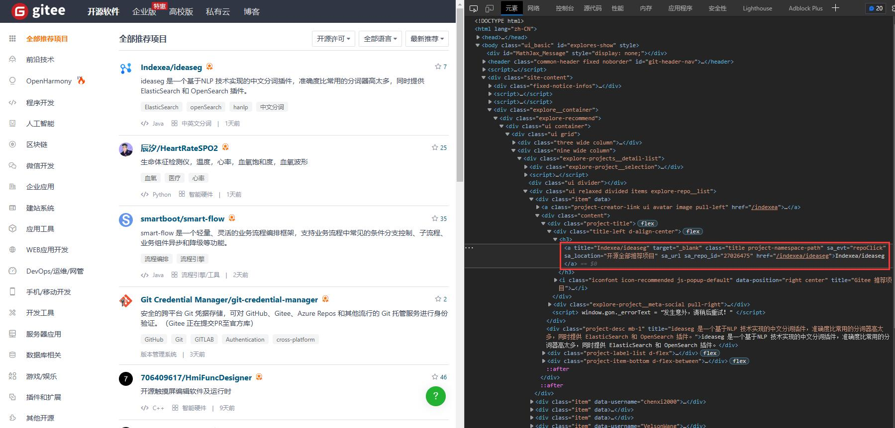

## 🌏 安装
  


## <font style="color:rgb(28, 30, 33);">✅</font><font style="color:rgb(28, 30, 33);">️️ 运行环境</font>
<font style="color:rgb(28, 30, 33);">操作系统：Windows、Linux 和 Mac。</font>

<font style="color:rgb(28, 30, 33);">python 版本：3.6 及以上</font>

<font style="color:rgb(28, 30, 33);">支持浏览器：Chromium 内核（如 Chrome 和 Edge）</font>

---

## <font style="color:rgb(28, 30, 33);">✅</font><font style="color:rgb(28, 30, 33);">️️ 安装</font>
<font style="color:rgb(28, 30, 33);">请使用 pip 安装 DrissionPage：</font>

```shell
pip install DrissionPage
```

---

## <font style="color:rgb(28, 30, 33);">✅</font><font style="color:rgb(28, 30, 33);">️️ 升级</font>
### <font style="color:rgb(28, 30, 33);">📌</font><font style="color:rgb(28, 30, 33);"> 升级最新稳定版</font>
```shell
pip install DrissionPage --upgrade
```

---

### <font style="color:rgb(28, 30, 33);">📌</font><font style="color:rgb(28, 30, 33);"> 指定版本升级</font>
```shell
pip install DrissionPage==4.0.0b17
```

## 🌏 导入
  


<font style="color:rgb(28, 30, 33);">DrissionPage 提供的功能放在以下几个路径：</font>

+ `<font style="color:rgb(28, 30, 33);">from DrissionPage import ****</font>`<font style="color:rgb(28, 30, 33);">：浏览器类、配置类、页面类</font>
+ `<font style="color:rgb(28, 30, 33);">from DrissionPage.errors import ****</font>`<font style="color:rgb(28, 30, 33);">：异常</font>
+ `<font style="color:rgb(28, 30, 33);">from DrissionPage.common import ****</font>`<font style="color:rgb(28, 30, 33);">：辅助工具</font>
+ `<font style="color:rgb(28, 30, 33);">from DrissionPage.items import ****</font>`<font style="color:rgb(28, 30, 33);">：衍生对象，用于类型判断</font>

## <font style="color:rgb(28, 30, 33);">✅</font><font style="color:rgb(28, 30, 33);">️ 浏览器类</font>
### <font style="color:rgb(28, 30, 33);">📌</font><font style="color:rgb(28, 30, 33);"> </font>`<font style="color:rgb(28, 30, 33);">Chromium</font>`
<font style="color:rgb(28, 30, 33);">浏览器类用于连接浏览器、管理标签页及其它和浏览器总体有关的操作。</font>

<font style="color:rgb(28, 30, 33);">浏览器类相当于总管，它可以作为浏览器入口，使用它产生 Tab 对象去操控每个标签页。</font>

```python
from DrissionPage import Chromium
```

---

## <font style="color:rgb(28, 30, 33);">✅</font><font style="color:rgb(28, 30, 33);">️ 页面类</font>
### <font style="color:rgb(28, 30, 33);">📌</font><font style="color:rgb(28, 30, 33);"> </font>`<font style="color:rgb(28, 30, 33);">ChromiumPage</font>`
`<font style="color:rgb(28, 30, 33);">ChromiumPage</font>`<font style="color:rgb(28, 30, 33);">是将浏览器对象和第一个标签页对象封装在一起，用于控制浏览器。</font>

`<font style="color:rgb(28, 30, 33);">ChromiumPage</font>`<font style="color:rgb(28, 30, 33);">只是简化了操作，使用效果和直接使用</font>`<font style="color:rgb(28, 30, 33);">Chromium</font>`<font style="color:rgb(28, 30, 33);">对象基本一致。</font>

<font style="color:rgb(28, 30, 33);">唯一区别是，</font>`<font style="color:rgb(28, 30, 33);">ChromiumPage</font>`<font style="color:rgb(28, 30, 33);">生成的标签页对象是</font>`<font style="color:rgb(28, 30, 33);">ChromiumTab</font>`<font style="color:rgb(28, 30, 33);">，不能切换模式。</font>

```python
from DrissionPage import ChromiumPage
```

---

### <font style="color:rgb(28, 30, 33);">📌</font><font style="color:rgb(28, 30, 33);"> </font>`<font style="color:rgb(28, 30, 33);">WebPage</font>`
`<font style="color:rgb(28, 30, 33);">WebPage</font>`<font style="color:rgb(28, 30, 33);">与</font>`<font style="color:rgb(28, 30, 33);">ChromiumPage</font>`<font style="color:rgb(28, 30, 33);">相似，不过其自身及其产生的 Tab 对象可切换模式，既可控制浏览器，也可收发数据包。</font>

```python
from DrissionPage import WebPage
```

---

### <font style="color:rgb(28, 30, 33);">📌</font><font style="color:rgb(28, 30, 33);"> </font>`<font style="color:rgb(28, 30, 33);">SessionPage</font>`
`<font style="color:rgb(28, 30, 33);">SessionPage</font>`<font style="color:rgb(28, 30, 33);">用于收发数据包，是对 requests 和 lxml 进行封装实现的。</font>

<font style="color:rgb(28, 30, 33);">它把网络连接和结果解析封装成页面。操作逻辑和其它页面一致。</font>

```python
from DrissionPage import SessionPage
```

---

## <font style="color:rgb(28, 30, 33);">✅</font><font style="color:rgb(28, 30, 33);">️ 配置工具</font>
### <font style="color:rgb(28, 30, 33);">📌</font><font style="color:rgb(28, 30, 33);"> </font>`<font style="color:rgb(28, 30, 33);">ChromiumOptions</font>`
`<font style="color:rgb(28, 30, 33);">ChromiumOptions</font>`<font style="color:rgb(28, 30, 33);">类用于设置浏览器启动参数。</font>

<font style="color:rgb(28, 30, 33);">这些参数只有在启动浏览器时有用，接管已存在的浏览器时是不生效的。</font>

```python
from DrissionPage import ChromiumOptions
```

---

### <font style="color:rgb(28, 30, 33);">📌</font><font style="color:rgb(28, 30, 33);"> </font>`<font style="color:rgb(28, 30, 33);">SessionOptions</font>`
`<font style="color:rgb(28, 30, 33);">SessionOptions</font>`<font style="color:rgb(28, 30, 33);">类用于设置</font>`<font style="color:rgb(28, 30, 33);">Session</font>`<font style="color:rgb(28, 30, 33);">对象启动参数。</font>

<font style="color:rgb(28, 30, 33);">用于配置</font>`<font style="color:rgb(28, 30, 33);">SessionPage</font>`<font style="color:rgb(28, 30, 33);">或</font>`<font style="color:rgb(28, 30, 33);">WebPage</font>`<font style="color:rgb(28, 30, 33);">的 s 模式的连接参数。</font>

```python
from DrissionPage import SessionOptions
```

---

### <font style="color:rgb(28, 30, 33);">📌</font><font style="color:rgb(28, 30, 33);"> </font>`<font style="color:rgb(28, 30, 33);">Settings</font>`
`<font style="color:rgb(28, 30, 33);">Settings</font>`<font style="color:rgb(28, 30, 33);">用于设置全局运行配置，如找不到元素时是否抛出异常等。</font>

```python
from DrissionPage.common import Settings
```

---

## <font style="color:rgb(28, 30, 33);">✅</font><font style="color:rgb(28, 30, 33);">️ 辅助工具</font>
### <font style="color:rgb(28, 30, 33);">📌</font><font style="color:rgb(28, 30, 33);"> </font>`<font style="color:rgb(28, 30, 33);">Keys</font>`
<font style="color:rgb(28, 30, 33);">键盘按键类，用于键入 ctrl、alt 等按键。</font>

```python
from DrissionPage.common import Keys
```

---

### <font style="color:rgb(28, 30, 33);">📌</font><font style="color:rgb(28, 30, 33);"> </font>`<font style="color:rgb(28, 30, 33);">By</font>`
<font style="color:rgb(28, 30, 33);">与 selenium 一致的</font>`<font style="color:rgb(28, 30, 33);">By</font>`<font style="color:rgb(28, 30, 33);">类，便于项目迁移。</font>

```python
from DrissionPage.common import By
```

---

### <font style="color:rgb(28, 30, 33);">📌</font><font style="color:rgb(28, 30, 33);"> 其它工具</font>
<font style="color:rgb(28, 30, 33);">这些工具都在</font>`<font style="color:rgb(28, 30, 33);">DrissionPage.common</font>`<font style="color:rgb(28, 30, 33);">路径中。</font>

+ `<font style="color:rgb(28, 30, 33);">wait_until</font>`<font style="color:rgb(28, 30, 33);">：可等待传入的方法结果为真</font>
+ `<font style="color:rgb(28, 30, 33);">make_session_ele</font>`<font style="color:rgb(28, 30, 33);">：从 html 文本生成</font>`<font style="color:rgb(28, 30, 33);">ChromiumElement</font>`<font style="color:rgb(28, 30, 33);">对象</font>
+ `<font style="color:rgb(28, 30, 33);">configs_to_here</font>`<font style="color:rgb(28, 30, 33);">：把配置文件复制到当前路径</font>
+ `<font style="color:rgb(28, 30, 33);">get_blob</font>`<font style="color:rgb(28, 30, 33);">：获取指定的 blob 资源</font>
+ `<font style="color:rgb(28, 30, 33);">tree</font>`<font style="color:rgb(28, 30, 33);">：用于打印页面对象或元素对象结构</font>
+ `<font style="color:rgb(28, 30, 33);">from_selenium</font>`<font style="color:rgb(28, 30, 33);">：用于对接 selenium 代码</font>
+ `<font style="color:rgb(28, 30, 33);">from_playwright</font>`<font style="color:rgb(28, 30, 33);">：用于对接 playwright 代码</font>

```python
from DrissionPage.common import wait_until
from DrissionPage.common import make_session_ele
from DrissionPage.common import configs_to_here
```

---

## <font style="color:rgb(28, 30, 33);">✅</font><font style="color:rgb(28, 30, 33);">️ 异常</font>
<font style="color:rgb(28, 30, 33);">异常放在</font>`<font style="color:rgb(28, 30, 33);">DrissionPage.errors</font>`<font style="color:rgb(28, 30, 33);">路径。</font>

<font style="color:rgb(28, 30, 33);">全部异常详见进阶使用章节。</font>

```python
from DrissionPage.errors import ElementNotFoundError
```

---

## <font style="color:rgb(28, 30, 33);">✅</font><font style="color:rgb(28, 30, 33);">️ 衍生对象类型</font>
<font style="color:rgb(28, 30, 33);">Tab、Element 等被其它对象生成的对象，开发过程中需要类型判断时需要导入这些类型。</font>

<font style="color:rgb(28, 30, 33);">可在</font>`<font style="color:rgb(28, 30, 33);">DrissionPage.items</font>`<font style="color:rgb(28, 30, 33);">路径导入。</font>

```python
from DrissionPage.items import SessionElement
from DrissionPage.items import ChromiumElement
from DrissionPage.items import ShadowRoot
from DrissionPage.items import NoneElement
from DrissionPage.items import ChromiumTab
from DrissionPage.items import MixTab
from DrissionPage.items import ChromiumFrame
```

## 🌸特性、优势介绍
## ⭐ 与 requests 对比  

<font style="color:rgb(28, 30, 33);">以下代码实现一模一样的功能，对比两者的代码量：</font>

<font style="color:rgb(28, 30, 33);">🔸</font><font style="color:rgb(28, 30, 33);"> 获取元素内容</font>

```python
url = 'https://baike.baidu.com/item/python'

# 使用 requests：
import requests
from lxml import etree
headers = {'User-Agent':'Mozilla/5.0 (Windows NT 6.3; Win64; x64) AppleWebKit/537.36 (KHTML, like Gecko) Chrome/41.0.2272.118 Safari/537.36'}
response = requests.get(url, headers = headers)
html = etree.HTML(response.text)
element = html.xpath('//h1')[0]
title = element.text

# 使用 DrissionPage：
from DrissionPage import SessionPage
page = SessionPage()
page.get(url)
title = page('tag:h1').text
```

Tips

DrissionPage 自带默认 headers

<font style="color:rgb(28, 30, 33);">🔸</font><font style="color:rgb(28, 30, 33);"> 下载文件</font>

```python
url = 'https://www.baidu.com/img/flexible/logo/pc/result.png'
save_path = r'C:\download'

# 使用 requests：
import requests
r = requests.get(url)
with open(f'{save_path}\\img.png', 'wb') as fd:
   for chunk in r.iter_content():
       fd.write(chunk)

# 使用 DrissionPage：
from DrissionPage import SessionPage
page = SessionPage()
page.download(url, save_path, 'img')  # 支持重命名，处理文件名冲突
```

## ⭐ 与 selenium 对比
  


<font style="color:rgb(28, 30, 33);">以下代码实现一模一样的功能，对比两者的代码量：</font>

<font style="color:rgb(28, 30, 33);">🔸</font><font style="color:rgb(28, 30, 33);"> 用显性等待方式查找第一个文本包含 some text 的元素。</font>

```python
# 使用 selenium：
element = WebDriverWait(driver).until(ec.presence_of_element_located((By.XPATH, '//*[contains(text(), "some text")]')))

# 使用 DrissionPage：
element = tab('some text')
```

<font style="color:rgb(28, 30, 33);">🔸</font><font style="color:rgb(28, 30, 33);"> 跳转到一个标签页</font>

```python
# 使用 selenium：
driver.switch_to.window(driver.window_handles[0])

# 使用 DrissionPage：
tab = browser.latest_tab
```

<font style="color:rgb(28, 30, 33);">🔸</font><font style="color:rgb(28, 30, 33);"> 按文本选择下拉列表</font>

```python
# 使用 selenium：
from selenium.webdriver.support.select import Select
select_element = Select(element)
select_element.select_by_visible_text('text')

# 使用 DrissionPage：
element.select('text')
```

<font style="color:rgb(28, 30, 33);">🔸</font><font style="color:rgb(28, 30, 33);"> 拖拽一个元素</font>

```python
# 使用 selenium：
ActionChains(driver).drag_and_drop(ele1, ele2).perform()

# 使用 DrissionPage：
ele1.drag_to(ele2)
```

<font style="color:rgb(28, 30, 33);">🔸</font><font style="color:rgb(28, 30, 33);"> 滚动窗口到底部（保持水平滚动条不变）</font>

```python
# 使用 selenium：
driver.execute_script("window.scrollTo(document.documentElement.scrollLeft, document.body.scrollHeight);")

# 使用 DrissionPage：
tab.scroll.to_bottom()
```

<font style="color:rgb(28, 30, 33);">🔸</font><font style="color:rgb(28, 30, 33);"> 设置 headless 模式</font>

```python
# 使用 selenium：
options = webdriver.ChromeOptions()
options.add_argument("--headless")

# 使用 DrissionPage：
options = ChromiumOptions().headless()
```

<font style="color:rgb(28, 30, 33);">🔸</font><font style="color:rgb(28, 30, 33);"> 获取伪元素内容</font>

```python
# 使用 selenium：
text = webdriver.execute_script('return window.getComputedStyle(arguments[0], "::after").getPropertyValue("content");', element)

# 使用 DrissionPage：
text = element.pseudo.after
```

<font style="color:rgb(28, 30, 33);">🔸</font><font style="color:rgb(28, 30, 33);"> 获取 shadow-root</font>

<font style="color:rgb(28, 30, 33);">新版 selenium 已可直接获取 shadow-root，但生成的 ShadowRoot 对象功能实在是太少了。</font>

```python
# 使用 selenium：
shadow_element = webdriver.execute_script('return arguments[0].shadowRoot', element)

# 使用 DrissionPage：
shadow_element = element.sr
```

<font style="color:rgb(28, 30, 33);">🔸</font><font style="color:rgb(28, 30, 33);"> 用 xpath 直接获取属性或文本节点（返回文本）</font>

```python
# 使用 selenium：
相当复杂

# 使用 DrissionPage：
class_name = element('xpath://div[@id="div_id"]/@class')
text = element('xpath://div[@id="div_id"]/text()[2]')
```

## ⭐ 模式切换
  


<font style="color:rgb(28, 30, 33);">用浏览器登录网站，然后切换到 requests 读取网页。两者会共享登录信息。</font>

```python
from DrissionPage import Chromium

# 创建页面对象
tab = Chromium().latest_tab  
# 访问个人中心页面（未登录，重定向到登录页面）
tab.get('https://gitee.com/profile')  

# 输入账号密码登录
tab.ele('@id:user_login').input('您的用户名')  
tab.ele('@id:user_password').input('您的密码\n')
tab.wait.load_start()

# 切换到 s 模式
tab.change_mode()  
# 登录后 session 模式的输出
print('登录后title：', tab.title, '\n')
```

**<font style="color:rgb(28, 30, 33);">输出：</font>**

```shell
登录后title： 个人资料 - 码云 Gitee.com
```

## ⭐ 获取元素属性
  


```python
foot = tab.ele('#footer-left')  # 用 id 查找元素
first_col = foot.ele('css:>div')  # 使用 css selector 在元素的下级中查找元素（第一个）
lnk = first_col.ele('text:命令学')  # 使用文本内容查找元素
text = lnk.text  # 获取元素文本
href = lnk.attr('href')  # 获取元素属性值

print(text, href, '\n')

# 简洁模式串联查找
text = tab('@id:footer-left')('css:>div')('text:命令学').text
print(text)
```

**<font style="color:rgb(28, 30, 33);">输出：</font>**

```shell
Git 命令学习 https://oschina.gitee.io/learn-git-branching/

Git 命令学习
```

## ⭐ 下载文件
  


<font style="color:rgb(28, 30, 33);">DrissionPage 带一个简便易用的下载器，一行即可实现下载功能。</font>

```python
from DrissionPage import SessionPage

url = 'https://www.baidu.com/img/flexible/logo/pc/result.png'
save_path = r'C:\download'

page = SessionPage()
page.download(url, save_path)
```

## ☀️ 基本概念
  


<font style="color:rgb(28, 30, 33);">本节讲解 DrissionPage 的一些基本概念。了解它大概的构成。</font>

<font style="color:rgb(28, 30, 33);">如果您觉得有点懵，可直接跳过本节。</font>

## <font style="color:rgb(28, 30, 33);">✅</font><font style="color:rgb(28, 30, 33);">️️ 网页自动化</font>
<font style="color:rgb(28, 30, 33);">网页自动化的形式通常有两种，它们各有优劣：</font>

+ <font style="color:rgb(28, 30, 33);">直接向服务器发送数据包，获取需要的数据</font>
+ <font style="color:rgb(28, 30, 33);">控制浏览器跟网页进行交互</font>

<font style="color:rgb(28, 30, 33);">前者轻量级，速度快，便于多线程、分布式部署，如 requests 库。但当数据包构成复杂，甚至加入加密技术时，开发过程烧脑程度直线上升。</font>

<font style="color:rgb(28, 30, 33);">鉴于此，DrissionPage 以页面为单位将两者整合，对 Chromium 协议 和 requests 进行了重新封装，实现两种模式的互通，并加入常用的页面和元素控制功能，可大幅降低开发难度和代码量。  
</font><font style="color:rgb(28, 30, 33);">用于操作浏览器的对象叫 Driver，requests 用于管理连接的对象叫 Session，Drission 就是它们两者的合体。Page 表示以页面为单位使用。</font>

<font style="color:rgb(28, 30, 33);">在旧版本，本库是通过对 selenium 和 requests 的重新封装实现的。  
</font><font style="color:rgb(28, 30, 33);">从 3.0 版开始，作者另起炉灶，自行实现了 selenium 全部功能，从而摆脱了对 selenium 的依赖，功能更多更强，运行效率更高，开发更灵活。 4.0 则在 3.0 经验的基础上对整个项目底层进行了重构，逻辑更合理。</font>

<font style="color:rgb(28, 30, 33);">如果您想了解旧版，请查阅“旧版使用方法”章节。</font>

---

## <font style="color:rgb(28, 30, 33);">✅</font><font style="color:rgb(28, 30, 33);">️️ 基本使用逻辑</font>
<font style="color:rgb(28, 30, 33);">无论是控制浏览器，还是收发数据包，其操作逻辑是一致的。</font>

<font style="color:rgb(28, 30, 33);">即先创建页面对象，然后从页面对象中获取元素对象，通过对元素对象的读取或操作，实现数据的获取或页面的控制。</font>

<font style="color:rgb(28, 30, 33);">因此，最主要的对象就是两种：页面对象，及其生成的元素对象。</font>

---

## <font style="color:rgb(28, 30, 33);">✅</font><font style="color:rgb(28, 30, 33);">️️ 主要对象</font>
### <font style="color:rgb(28, 30, 33);">📌</font><font style="color:rgb(28, 30, 33);"> 浏览器和标签页对象</font>
+ `<font style="color:rgb(28, 30, 33);">Chromium</font>`<font style="color:rgb(28, 30, 33);">：浏览器对象，用于连接浏览器、管理标签页及其它和浏览器总体有关的操作</font>
+ `<font style="color:rgb(28, 30, 33);">MixTab</font>`<font style="color:rgb(28, 30, 33);">：浏览器标签页对象，由</font>`<font style="color:rgb(28, 30, 33);">Chromium</font>`<font style="color:rgb(28, 30, 33);">对象产生，一个对象控制一个实际的标签页</font>
+ `<font style="color:rgb(28, 30, 33);">ChromiumTab</font>`<font style="color:rgb(28, 30, 33);">：和</font>`<font style="color:rgb(28, 30, 33);">MixTab</font>`<font style="color:rgb(28, 30, 33);">一样也是标签页对象，由</font>`<font style="color:rgb(28, 30, 33);">ChromiumPage</font>`<font style="color:rgb(28, 30, 33);">对象产生，不可切换收发数据包模式</font>

### <font style="color:rgb(28, 30, 33);">📌</font><font style="color:rgb(28, 30, 33);"> 元素对象</font>
+ `<font style="color:rgb(28, 30, 33);">ChromiumElement</font>`<font style="color:rgb(28, 30, 33);">：浏览器元素对象</font>
+ `<font style="color:rgb(28, 30, 33);">SessionElement</font>`<font style="color:rgb(28, 30, 33);">：静态元素对象</font>
+ `<font style="color:rgb(28, 30, 33);">ChromiumFrame</font>`<font style="color:rgb(28, 30, 33);">：</font>`<font style="color:rgb(28, 30, 33);"><iframe></font>`<font style="color:rgb(28, 30, 33);">元素对象，兼有标签页对象和元素特性</font>
+ `<font style="color:rgb(28, 30, 33);">ShadowRoot</font>`<font style="color:rgb(28, 30, 33);">：shadow-root 元素对象</font>

### <font style="color:rgb(28, 30, 33);">📌</font><font style="color:rgb(28, 30, 33);"> Page 对象</font>
+ `<font style="color:rgb(28, 30, 33);">ChromiumPage</font>`<font style="color:rgb(28, 30, 33);">：能管理浏览器本身的标签页对象，可用作程序入口</font>
+ `<font style="color:rgb(28, 30, 33);">WebPage</font>`<font style="color:rgb(28, 30, 33);">：类似于</font>`<font style="color:rgb(28, 30, 33);">ChromiumPage</font>`<font style="color:rgb(28, 30, 33);">，整合浏览器控制和收发数据包于一体的页面对象</font>
+ `<font style="color:rgb(28, 30, 33);">SessionPage</font>`<font style="color:rgb(28, 30, 33);">：单纯用于收发数据包的页面对象，可单独使用</font>

### <font style="color:rgb(28, 30, 33);">📌</font><font style="color:rgb(28, 30, 33);"> 称呼</font>
<font style="color:rgb(28, 30, 33);">文档里经常用到这几个称呼：</font>

+ `<font style="color:rgb(28, 30, 33);">MixTab</font>`<font style="color:rgb(28, 30, 33);">、</font>`<font style="color:rgb(28, 30, 33);">ChromiumTab</font>`<font style="color:rgb(28, 30, 33);">统称为 Tab 对象</font>
+ `<font style="color:rgb(28, 30, 33);">ChromiumPage</font>`<font style="color:rgb(28, 30, 33);">、</font>`<font style="color:rgb(28, 30, 33);">WebPage</font>`<font style="color:rgb(28, 30, 33);">和</font>`<font style="color:rgb(28, 30, 33);">SessionPage</font>`<font style="color:rgb(28, 30, 33);">统称为 Page 对象</font>
+ <font style="color:rgb(28, 30, 33);">Page 对象、Tab 对象和</font>`<font style="color:rgb(28, 30, 33);">ChromiumFrame</font>`<font style="color:rgb(28, 30, 33);">统称为页面对象</font>

---

## <font style="color:rgb(28, 30, 33);">✅</font><font style="color:rgb(28, 30, 33);">️️ 对象关系图</font>
<font style="color:rgb(28, 30, 33);">下图列出本库中要用到的各种对象的生成关系。</font>

```plain
├─ SessionPage
|     └─ SessionElement
|           └─ SessionElement
├─ Chrmoium
|     └─ MixTab
|           ├─ ChromiumElement
|           |    ├─ ChromiumElement
|           |    ├─ ChromiumFrame
|           |    └─ SessionElement
|           ├─ SessionElement
|           |    └─ SessionElement
|           ├─ ChromiumFrame
|           |    ├─ ChromiumElement
|           |    ├─ ChromiumFrame
|           |    └─ SessionElement
|           └─ ShadowRoot
|                ├─ ChromiumElement
|                ├─ ChromiumFrame
|                └─ SessionElement
├─ SessionOptions
└─ ChrmoiumOptions
```

---

## <font style="color:rgb(28, 30, 33);">✅</font><font style="color:rgb(28, 30, 33);">️️ 工作模式</font>
`<font style="color:rgb(28, 30, 33);">MixTab</font>`<font style="color:rgb(28, 30, 33);">和</font>`<font style="color:rgb(28, 30, 33);">WebPage</font>`<font style="color:rgb(28, 30, 33);">既可控制浏览器，也可用数据包方式访问网络数据。 它们有两种工作方式：d 模式和 s 模式。  
</font><font style="color:rgb(28, 30, 33);">页面对象可以在这两种模式间切换，两种模式拥有一致的使用方法，但任一时间只能处于其中一种模式。</font>

### <font style="color:rgb(28, 30, 33);">📌</font><font style="color:rgb(28, 30, 33);"> d 模式</font>
<font style="color:rgb(28, 30, 33);">d 模式既表示 Driver，还有 Dynamic 的意思。  
</font><font style="color:rgb(28, 30, 33);">d 模式用于控制浏览器，不仅可以读取浏览器获取到的信息，还能对页面进行操作，如点击、填写、开关标签页、改变元素属性、执行 js 脚本等等。  
</font><font style="color:rgb(28, 30, 33);">d 模式功能强大，但运行速度受浏览器制约非常缓慢，而且需要占用大量内存。</font>

---

### <font style="color:rgb(28, 30, 33);">📌</font><font style="color:rgb(28, 30, 33);"> s 模式</font>
<font style="color:rgb(28, 30, 33);">s 模式既表示 Session，还有 speed、silence 的意思。  
</font><font style="color:rgb(28, 30, 33);">s 模式的运行速度比 d 模式快几个数量级，但只能基于数据包进行读取或发送，不能对页面进行操作，不能运行 js。  
</font><font style="color:rgb(28, 30, 33);">爬取数据时，如网站数据包较为简单，应首选 s 模式。</font>

---

### <font style="color:rgb(28, 30, 33);">📌</font><font style="color:rgb(28, 30, 33);"> 模式切换</font>
`<font style="color:rgb(28, 30, 33);">MixTab</font>`<font style="color:rgb(28, 30, 33);">和</font>`<font style="color:rgb(28, 30, 33);">WebPage</font>`<font style="color:rgb(28, 30, 33);">对象可以在 d 模式和 s 模式之间切换，这通常用于以下情况：</font>

+ <font style="color:rgb(28, 30, 33);">当登录验证很严格，难以解构，如有验证码的时候，用浏览器处理登录，然后转换成 s 模式爬取数据。既避免了处理烧脑的 js，又能享受 s 模式的速度。</font>
+ <font style="color:rgb(28, 30, 33);">页面数据由 js 产生，且页面结构极其复杂，可以用 d 模式读取页面元素，然后把元素转成 s 模式的元素进行分析。可以极大地提高 d 模式的处理速度。</font>

---

## <font style="color:rgb(28, 30, 33);">✅</font><font style="color:rgb(28, 30, 33);">️️ 配置管理</font>
<font style="color:rgb(28, 30, 33);">无论 requests 还是浏览器，都通常需要一些配置信息才能正常工作，如长长的</font>`<font style="color:rgb(28, 30, 33);">user_agent</font>`<font style="color:rgb(28, 30, 33);">、浏览器 exe 文件路径、浏览器配置等。 这些代码往往是繁琐而重复的，不利于代码的简洁。  
</font><font style="color:rgb(28, 30, 33);">因此，DrissionPage 使用配置文件记录常用配置信息，程序会自动读取默认配置文件里的内容。 所以，在示例中，通常看不见配置信息的代码。</font>

<font style="color:rgb(28, 30, 33);">这个功能支持用户保存不同的配置文件，按情况调研，也可以支持直接把配置写在代码里面，屏蔽读取配置文件。</font>

Tips

当需要打包程序时，必需把配置写到代码里，或打包后手动复制配置文件到运行路径，否则会报错。详见相关章节。

### <font style="color:rgb(28, 30, 33);">📌</font><font style="color:rgb(28, 30, 33);"> </font>`<font style="color:rgb(28, 30, 33);">SessionOptions</font>`
<font style="color:rgb(28, 30, 33);">用于</font>`<font style="color:rgb(28, 30, 33);">SessionPage</font>`<font style="color:rgb(28, 30, 33);">和</font>`<font style="color:rgb(28, 30, 33);">WebPage</font>`<font style="color:rgb(28, 30, 33);"> </font><font style="color:rgb(28, 30, 33);">s 模式的配置对象。</font>

---

### <font style="color:rgb(28, 30, 33);">📌</font><font style="color:rgb(28, 30, 33);"> </font>`<font style="color:rgb(28, 30, 33);">ChromiumOptions</font>`
<font style="color:rgb(28, 30, 33);">用于用于浏览器的配置对象。</font>

---

## <font style="color:rgb(28, 30, 33);">✅</font><font style="color:rgb(28, 30, 33);">️️ 定位符</font>
<font style="color:rgb(28, 30, 33);">定位符用于定位页面中的元素，是本库一大特色，能够用非常简明的方式来获取元素，简洁易用。 可读性和易用性高于 xpath 等其它方式，并且兼容 xpath、css selector、selenium 定位符。</font>

<font style="color:rgb(28, 30, 33);">以下是一组对比：</font>

<font style="color:rgb(28, 30, 33);">定位文本包含</font>`<font style="color:rgb(28, 30, 33);">'abc'</font>`<font style="color:rgb(28, 30, 33);">的元素：</font>

```python
# DrissionPage
ele = tab('abc')

# selenium
ele = driver.find_element(By.XPATH, '//*[contains(text(), "abc"]')
```

<font style="color:rgb(28, 30, 33);">定位 class 为</font>`<font style="color:rgb(28, 30, 33);">'abc'</font>`<font style="color:rgb(28, 30, 33);">的元素：</font>

```python
# DrissionPage
ele = tab('.abc')

# selenium
ele = driver.find_element(By.CLASS_NAME, 'abc')
```

<font style="color:rgb(28, 30, 33);">定位 ele 元素的兄弟元素：</font>

```python
# DrissionPage
ele1 = ele.next()  # 获取后一个元素
ele1 = ele.prev(index=2)  # 获取前面第二个元素

# selenium
ele1 = ele.find_element(By.XPATH, './/following-sibling::*')  # 获取有i一个元素
ele1 = ele.find_element(By.XPATH, './/preceding-sibling::*[2]')  # 获取前面第二个元素
```

<font style="color:rgb(28, 30, 33);">显然，本库的定位语句更简洁易懂，还有很多灵活好用的方法，详见 “查找元素” 章节。</font>

## ❓ 常见问题
  


<font style="color:rgb(28, 30, 33);">本页收集一些用户使用过程中的常见问题。</font>

<font style="color:rgb(28, 30, 33);">欢迎各位开发者添砖加瓦，您可提交 issues、PR，也可以写成博客文章，链接发给本库作者，直接链接到文章。</font>

## <font style="color:rgb(28, 30, 33);">❔</font><font style="color:rgb(28, 30, 33);"> 如何在无界面 Linux 使用</font>
<font style="color:rgb(28, 30, 33);">CentOS 请参考这篇文章：</font>[<font style="color:rgb(28, 30, 33);">linux 部署说明</font>](https://blog.csdn.net/sinat_39327967/article/details/132181129?spm=1001.2014.3001.5501)

<font style="color:rgb(28, 30, 33);">Ubuntu 请参考这篇文章：</font>[<font style="color:rgb(28, 30, 33);">DrissionPage在UbuntuLinux的使用</font>](https://zhuanlan.zhihu.com/p/674687748)

---

## <font style="color:rgb(28, 30, 33);">❔</font><font style="color:rgb(28, 30, 33);"> 为什么浏览器不能退出无头模式？</font>
为什么设置过无头后，下次运行即使不设置`headless()`，浏览器依然进入无头状态？

<font style="color:rgb(28, 30, 33);">因为上一次打开的浏览器没有关闭，只是因为开了无头不可见，程序继续接管了它。</font>

<font style="color:rgb(28, 30, 33);">如果要关闭浏览器，可在程序结束时使用</font>`<font style="color:rgb(28, 30, 33);">Chromium</font>`<font style="color:rgb(28, 30, 33);">对象的</font>`<font style="color:rgb(28, 30, 33);">quit()</font>`<font style="color:rgb(28, 30, 33);">语句。</font>

<font style="color:rgb(28, 30, 33);">也可以设置</font>`<font style="color:rgb(28, 30, 33);">co.headless(False)</font>`<font style="color:rgb(28, 30, 33);">，程序会自动关闭之前的无头浏览器再启动新的。</font>

<font style="color:rgb(28, 30, 33);">另请注意，</font>`<font style="color:rgb(28, 30, 33);">tab.close()</font>`<font style="color:rgb(28, 30, 33);">的功能是关闭当前标签页，而不是关闭浏览器，除非浏览器只有一个标签页。</font>

---

## <font style="color:rgb(28, 30, 33);">❔</font><font style="color:rgb(28, 30, 33);"> 如何禁用保存密码、恢复页面等提示气泡？</font>
<font style="color:rgb(28, 30, 33);">浏览器提示气泡出现时可以手动关闭，不关闭也不影响自动操作，在代码中阻止其显示也是可以的。 加一些浏览器配置代码即可禁止相应的气泡显示，需要添加下面这样的代码：</font>

```python
co = ChromiumOptions()

# 阻止“自动保存密码”的提示气泡
co.set_pref('credentials_enable_service', False)

# 阻止“要恢复页面吗？Chrome未正确关闭”的提示气泡
co.set_argument('--hide-crash-restore-bubble')
```

---

## <font style="color:rgb(28, 30, 33);">❔</font><font style="color:rgb(28, 30, 33);"> 点击报错“该元素没有位置及大小”怎么办？</font>
<font style="color:rgb(28, 30, 33);">没有位置及大小是正常的，很多元素都没有位置和大小。</font>

<font style="color:rgb(28, 30, 33);">这个时候你要检查是否页面中有同名元素，定位符没写准确拿到了另一个。</font>

<font style="color:rgb(28, 30, 33);">如果要点击的元素就是没有位置的，可以强制使用 js 点击，用法是</font><font style="color:rgb(28, 30, 33);"> </font>`<font style="color:rgb(28, 30, 33);">.click(by_js=True)</font>`<font style="color:rgb(28, 30, 33);">，可以简写为</font><font style="color:rgb(28, 30, 33);"> </font>`<font style="color:rgb(28, 30, 33);">.click('js')</font>`<font style="color:rgb(28, 30, 33);">。</font>

---

## <font style="color:rgb(28, 30, 33);">❔</font><font style="color:rgb(28, 30, 33);"> 如何使用启动参数、用户配置、实验项等功能？</font>
**<font style="color:rgb(28, 30, 33);">arguments 启动参数</font>**

+ <font style="color:rgb(28, 30, 33);">使用参考：</font>[<font style="color:rgb(28, 30, 33);">https://DrissionPage.cn/ChromiumPage/browser_opt#-set_argument</font>](https://drissionpage.cn/ChromiumPage/browser_opt#-set_argument)
+ <font style="color:rgb(28, 30, 33);">参数详见：</font>[<font style="color:rgb(28, 30, 33);">https://peter.sh/experiments/chromium-command-line-switches/</font>](https://peter.sh/experiments/chromium-command-line-switches/)

**<font style="color:rgb(28, 30, 33);">prefs 用户配置</font>**

+ <font style="color:rgb(28, 30, 33);">使用参考：</font>[<font style="color:rgb(28, 30, 33);">https://DrissionPage.cn/ChromiumPage/browser_opt#-set_pref</font>](https://drissionpage.cn/ChromiumPage/browser_opt#-set_pref)
+ <font style="color:rgb(28, 30, 33);">参数详见：</font>[<font style="color:rgb(28, 30, 33);">https://src.chromium.org/viewvc/chrome/trunk/src/chrome/common/pref_names.cc</font>](https://src.chromium.org/viewvc/chrome/trunk/src/chrome/common/pref_names.cc)

**<font style="color:rgb(28, 30, 33);">flags 实验项</font>**

+ <font style="color:rgb(28, 30, 33);">使用参考：</font>[<font style="color:rgb(28, 30, 33);">https://DrissionPage.cn/ChromiumPage/browser_opt#-set_flag</font>](https://drissionpage.cn/ChromiumPage/browser_opt#-set_flag)
+ <font style="color:rgb(28, 30, 33);">参数详见：chrome://flags</font>

注意

外部链接仅供参考，请谨慎使用任何高级功能，仅在确保一切都可以掌控时才可使用，因为使用这些功能可能会导致浏览器数据丢失或安全和隐私受到威胁。

## <font style="color:rgb(28, 30, 33);">❔</font><font style="color:rgb(28, 30, 33);"> 如何匹配特殊字符（如</font>`<font style="color:rgb(28, 30, 33);">'&nbsp;'</font>`<font style="color:rgb(28, 30, 33);">）文本？</font>
<font style="color:rgb(28, 30, 33);">需先将特殊字符转为十六进制形式，详见《查找元素》中《语法速查表》一节。</font>


## 🚪入门
## 🗺️ 操控浏览器
  


<font style="color:rgb(28, 30, 33);">现在，我们通过一些例子，来直观感受一下 DrissionPage 的工作方式。</font>

<font style="color:rgb(28, 30, 33);">本示例演示使用</font>`<font style="color:rgb(28, 30, 33);">ChromiumPage</font>`<font style="color:rgb(28, 30, 33);">控制浏览器登录 gitee 网站。</font>

### <font style="color:rgb(28, 30, 33);">✅</font><font style="color:rgb(28, 30, 33);">️️ 页面分析</font>
<font style="color:rgb(28, 30, 33);">网址：</font>[<font style="color:rgb(28, 30, 33);">https://gitee.com/login</font>](https://gitee.com/login)

<font style="color:rgb(28, 30, 33);">打开网址，按</font>`<font style="color:rgb(28, 30, 33);">F12</font>`<font style="color:rgb(28, 30, 33);">，我们可以看到页面 html 如下：</font>


<font style="color:rgb(28, 30, 33);">用户名输入框</font>`<font style="color:rgb(28, 30, 33);">id</font>`<font style="color:rgb(28, 30, 33);">为</font>`<font style="color:rgb(28, 30, 33);">'user_login'</font>`<font style="color:rgb(28, 30, 33);">，密码输入框</font>`<font style="color:rgb(28, 30, 33);">id</font>`<font style="color:rgb(28, 30, 33);">为</font>`<font style="color:rgb(28, 30, 33);">'user_password'</font>`<font style="color:rgb(28, 30, 33);">，登录按钮</font>`<font style="color:rgb(28, 30, 33);">value</font>`<font style="color:rgb(28, 30, 33);">为</font>`<font style="color:rgb(28, 30, 33);">'登 录'</font>`<font style="color:rgb(28, 30, 33);">。</font>

<font style="color:rgb(28, 30, 33);">我们可以用这三个属性定位这三个元素，然后对其输入数据和点击。</font>

---

### <font style="color:rgb(28, 30, 33);">✅</font><font style="color:rgb(28, 30, 33);">️️ 示例代码</font>
<font style="color:rgb(28, 30, 33);">您可以把以下代码复制到编辑器，把账号和密码改为您自己的，可直接执行看到运行结果。</font>

```python
from DrissionPage import Chromium

# 启动或接管浏览器，并创建标签页对象
tab = Chromium().latest_tab
# 跳转到登录页面
tab.get('https://gitee.com/login')

# 定位到账号文本框，获取文本框元素
ele = tab.ele('#user_login')
# 输入对文本框输入账号
ele.input('您的账号')
# 定位到密码文本框并输入密码
tab.ele('#user_password').input('您的密码')
# 点击登录按钮
tab.ele('@value=登 录').click()
```

---

### <font style="color:rgb(28, 30, 33);">✅</font><font style="color:rgb(28, 30, 33);">️️ 示例详解</font>
<font style="color:rgb(28, 30, 33);">我们逐行解读代码：</font>

```python
from DrissionPage import Chromium
```

<font style="color:rgb(28, 30, 33);">↑ 首先，我们导入用于控制浏览器的类</font>`<font style="color:rgb(28, 30, 33);">Chromium</font>`<font style="color:rgb(28, 30, 33);">。</font>

```python
tab = Chromium().latest_tab
```

<font style="color:rgb(28, 30, 33);">↑ 接下来，我们创建一个</font>`<font style="color:rgb(28, 30, 33);">Chromium</font>`<font style="color:rgb(28, 30, 33);">对象，用于连接浏览器，并用</font>`<font style="color:rgb(28, 30, 33);">latest_tab</font>`<font style="color:rgb(28, 30, 33);">获取一个标签页对象。</font>

```python
tab.get('https://gitee.com/login')
```

<font style="color:rgb(28, 30, 33);">↑</font><font style="color:rgb(28, 30, 33);"> </font>`<font style="color:rgb(28, 30, 33);">get()</font>`<font style="color:rgb(28, 30, 33);">方法用于访问参数中的网址。它会等待页面完全加载，再继续执行后面的代码。 您也可以修改等待策略，如等待 DOM 加载而不等待资源下载，就停止加载，这将在后面的章节说明。</font>

```python
ele = tab.ele('#user_login')
```

<font style="color:rgb(28, 30, 33);">↑</font><font style="color:rgb(28, 30, 33);"> </font>`<font style="color:rgb(28, 30, 33);">ele()</font>`<font style="color:rgb(28, 30, 33);">方法用于查找元素，它返回一个</font>`<font style="color:rgb(28, 30, 33);">ChromiumElement</font>`<font style="color:rgb(28, 30, 33);">对象，用于操作元素。</font>

`<font style="color:rgb(28, 30, 33);">'#user_login'</font>`<font style="color:rgb(28, 30, 33);">是定位符文本，</font>`<font style="color:rgb(28, 30, 33);">#</font>`<font style="color:rgb(28, 30, 33);">意思是按</font>`<font style="color:rgb(28, 30, 33);">id</font>`<font style="color:rgb(28, 30, 33);">属性查找元素。</font>

<font style="color:rgb(28, 30, 33);">值得一提的是，</font>`<font style="color:rgb(28, 30, 33);">ele()</font>`<font style="color:rgb(28, 30, 33);">内置了等待，如果元素未加载，它会执行等待，直到元素出现或到达时限。默认超时时间 10 秒。</font>

```python
ele.input('您的账号')
```

<font style="color:rgb(28, 30, 33);">↑</font><font style="color:rgb(28, 30, 33);"> </font>`<font style="color:rgb(28, 30, 33);">input()</font>`<font style="color:rgb(28, 30, 33);">方法用于对元素输入文本。</font>

```python
tab.ele('#user_password').input('您的密码')
```

<font style="color:rgb(28, 30, 33);">↑ 我们也可以进行链式操作，获取元素后直接输入文本。</font>

```python
tab.ele('@value=登 录').click()
```

<font style="color:rgb(28, 30, 33);">↑ 输入账号密码后，以相同的方法获取按钮元素，并对其执行点击操作。</font>

<font style="color:rgb(28, 30, 33);">不同的是，这次通过其</font>`<font style="color:rgb(28, 30, 33);">value</font>`<font style="color:rgb(28, 30, 33);">属性作为查找条件。</font>`<font style="color:rgb(28, 30, 33);">@</font>`<font style="color:rgb(28, 30, 33);">表示按属性名查找。</font>

<font style="color:rgb(28, 30, 33);">到这里，我们已完成了自动登录 gitee 网站的操作。</font>

## 🗺️ 收发数据包
<font style="color:rgb(28, 30, 33);">  
</font>

<font style="color:rgb(28, 30, 33);">本示例演示用</font>`<font style="color:rgb(28, 30, 33);">SessionPage</font>`<font style="color:rgb(28, 30, 33);">已收发数据包的方式采集 gitee 网站数据。</font>

<font style="color:rgb(28, 30, 33);">本示例不使用浏览器。</font>

### <font style="color:rgb(28, 30, 33);">✅</font><font style="color:rgb(28, 30, 33);">️️ 页面分析</font>
<font style="color:rgb(28, 30, 33);">网址：</font>[<font style="color:rgb(28, 30, 33);">https://gitee.com/explore/all</font>](https://gitee.com/explore/all)

<font style="color:rgb(28, 30, 33);">这个示例的目标，要获取所有库的名称和链接，为避免对网站造成压力，我们只采集 3 页。</font>

<font style="color:rgb(28, 30, 33);">打开网址，按</font>`<font style="color:rgb(28, 30, 33);">F12</font>`<font style="color:rgb(28, 30, 33);">，我们可以看到页面 html 如下：</font>



<font style="color:rgb(28, 30, 33);">从 html 代码中可以看到，所有开源项目的标题都是</font>`<font style="color:rgb(28, 30, 33);">class</font>`<font style="color:rgb(28, 30, 33);">属性为</font>`<font style="color:rgb(28, 30, 33);">'title project-namespace-path'</font>`<font style="color:rgb(28, 30, 33);">的</font>`<font style="color:rgb(28, 30, 33);"><a></font>`<font style="color:rgb(28, 30, 33);">元素。我们可以遍历这些</font>`<font style="color:rgb(28, 30, 33);"><a></font>`<font style="color:rgb(28, 30, 33);">元素，获取它们的信息。</font>

<font style="color:rgb(28, 30, 33);">同时，我们观察到，列表页网址是以页数为参数访问的，如第一页 url 为</font>`<font style="color:rgb(28, 30, 33);">https://gitee.com/explore/all?page=1</font>`<font style="color:rgb(28, 30, 33);">，页数就是</font>`<font style="color:rgb(28, 30, 33);">page</font>`<font style="color:rgb(28, 30, 33);">参数。因此我们可以通过修改这个参数访问不同的页面。</font>

---

### <font style="color:rgb(28, 30, 33);">✅</font><font style="color:rgb(28, 30, 33);">️️ 示例代码</font>
<font style="color:rgb(28, 30, 33);">以下代码可直接运行并查看结果：</font>

```python
from DrissionPage import SessionPage

# 创建页面对象
page = SessionPage()

# 爬取3页
for i in range(1, 4):
    # 访问某一页的网页
    page.get(f'https://gitee.com/explore/all?page={i}')
    # 获取所有开源库<a>元素列表
    links = page.eles('.title project-namespace-path')
    # 遍历所有<a>元素
    for link in links:
        # 打印链接信息
        print(link.text, link.link)
```

**<font style="color:rgb(28, 30, 33);">输出：</font>**

```shell
小熊派开源社区/BearPi-HM_Nano https://gitee.com/bearpi/bearpi-hm_nano
明月心/PaddleSegSharp https://gitee.com/raoyutian/PaddleSegSharp
RockChin/QChatGPT https://gitee.com/RockChin/QChatGPT
TopIAM/eiam https://gitee.com/topiam/eiam

以下省略。。。
```

---

### <font style="color:rgb(28, 30, 33);">✅</font><font style="color:rgb(28, 30, 33);">️️ 示例详解</font>
<font style="color:rgb(28, 30, 33);">我们逐行解读代码：</font>

```python
from DrissionPage import SessionPage
```

<font style="color:rgb(28, 30, 33);">↑ 首先，我们导入用于收发数据包的页面类</font>`<font style="color:rgb(28, 30, 33);">SessionPage</font>`<font style="color:rgb(28, 30, 33);">。</font>

```python
page = SessionPage()
```

<font style="color:rgb(28, 30, 33);">↑ 接下来，我们创建一个</font>`<font style="color:rgb(28, 30, 33);">SessionPage</font>`<font style="color:rgb(28, 30, 33);">对象。</font>

```python
for i in ranage(1, 4):
    page.get(f'https://gitee.com/explore/all?page={i}')
```

<font style="color:rgb(28, 30, 33);">↑ 然后我们循环 3 次，以构造每页的 url，每次都用</font>`<font style="color:rgb(28, 30, 33);">get()</font>`<font style="color:rgb(28, 30, 33);">方法访问该页网址。</font>

```python
links = page.eles('.title project-namespace-path')
```

<font style="color:rgb(28, 30, 33);">↑ 访问网址后，我们用页面对象的</font>`<font style="color:rgb(28, 30, 33);">eles()</font>`<font style="color:rgb(28, 30, 33);">获取页面中所有</font>`<font style="color:rgb(28, 30, 33);">class</font>`<font style="color:rgb(28, 30, 33);">属性为</font>`<font style="color:rgb(28, 30, 33);">'title project-namespace-path'</font>`<font style="color:rgb(28, 30, 33);">的元素对象。</font>

`<font style="color:rgb(28, 30, 33);">eles()</font>`<font style="color:rgb(28, 30, 33);">方法用于查找多个符合条件的元素，返回由它们组成的</font>`<font style="color:rgb(28, 30, 33);">list</font>`<font style="color:rgb(28, 30, 33);">。</font>

<font style="color:rgb(28, 30, 33);">这里查找的条件是</font>`<font style="color:rgb(28, 30, 33);">class</font>`<font style="color:rgb(28, 30, 33);">属性，</font>`<font style="color:rgb(28, 30, 33);">.</font>`<font style="color:rgb(28, 30, 33);">表示按</font>`<font style="color:rgb(28, 30, 33);">class</font>`<font style="color:rgb(28, 30, 33);">属性查找元素。</font>

```python
for link in links:
        print(link.text, link.link)
```

<font style="color:rgb(28, 30, 33);">↑ 最后，我们遍历获取到的元素列表，获取每个元素的属性并打印出来。</font>

`<font style="color:rgb(28, 30, 33);">.text</font>`<font style="color:rgb(28, 30, 33);">获取元素的文本，</font>`<font style="color:rgb(28, 30, 33);">.link</font>`<font style="color:rgb(28, 30, 33);">获取元素的</font>`<font style="color:rgb(28, 30, 33);">href</font>`<font style="color:rgb(28, 30, 33);">或</font>`<font style="color:rgb(28, 30, 33);">src</font>`<font style="color:rgb(28, 30, 33);">属性。</font>

## 🗺️ 模式切换
<font style="color:rgb(28, 30, 33);">  
</font>

<font style="color:rgb(28, 30, 33);">这个示例演示标签页对象如何切换控制浏览器和收发数据包两种模式。</font>

<font style="color:rgb(28, 30, 33);">通常，切换模式是用来应付登录检查很严格的网站，可以用浏览器处理登录，再转换模式用收发数据包的形式来采集数据。 但是这种场景需要有对应的账号，不便于演示。演示使用浏览器在 gitee 搜索，然后转换到收发数据包的模式来读取数据。 虽然此示例现实使用意义不大，但可以了解其工作模式。</font>

### <font style="color:rgb(28, 30, 33);">✅</font><font style="color:rgb(28, 30, 33);">️️ 页面分析</font>
<font style="color:rgb(28, 30, 33);">网址：</font>[<font style="color:rgb(28, 30, 33);">https://gitee.com/explore</font>](https://gitee.com/explore)

<font style="color:rgb(28, 30, 33);">打开网址，按</font>`<font style="color:rgb(28, 30, 33);">F12</font>`<font style="color:rgb(28, 30, 33);">，我们可以看到页面 html 如下：</font>


<font style="color:rgb(28, 30, 33);">输入框</font>`<font style="color:rgb(28, 30, 33);"><input></font>`<font style="color:rgb(28, 30, 33);">元素</font>`<font style="color:rgb(28, 30, 33);">id</font>`<font style="color:rgb(28, 30, 33);">属性为</font>`<font style="color:rgb(28, 30, 33);">'q'</font>`<font style="color:rgb(28, 30, 33);">，搜索按钮</font>`<font style="color:rgb(28, 30, 33);"><button></font>`<font style="color:rgb(28, 30, 33);">元素</font>`<font style="color:rgb(28, 30, 33);">文本</font>`<font style="color:rgb(28, 30, 33);">包含</font>`<font style="color:rgb(28, 30, 33);">'搜索'</font>`<font style="color:rgb(28, 30, 33);">文本，可用来作条件查找元素。</font>

<font style="color:rgb(28, 30, 33);">输入关键词搜索后，再查看页面 html：</font>


<font style="color:rgb(28, 30, 33);">通过分析 html 代码，我们可以看出，每个结果的标题都存在</font>`<font style="color:rgb(28, 30, 33);">id</font>`<font style="color:rgb(28, 30, 33);">为</font>`<font style="color:rgb(28, 30, 33);">'hits-list'</font>`<font style="color:rgb(28, 30, 33);">里面，</font>`<font style="color:rgb(28, 30, 33);">class</font>`<font style="color:rgb(28, 30, 33);">为</font>`<font style="color:rgb(28, 30, 33);">'item'</font>`<font style="color:rgb(28, 30, 33);">的元素中。因此，我们可以获取页面中所有这些元素，再遍历获取其信息。</font>

---

### <font style="color:rgb(28, 30, 33);">✅</font><font style="color:rgb(28, 30, 33);">️️ 示例代码</font>
<font style="color:rgb(28, 30, 33);">您可以直接运行以下代码：</font>

```python
from DrissionPage import Chromium

# 连接浏览器并获取一个MixTab对象
tab = Chromium().latest_tab
# 访问网址
tab.get('https://gitee.com/explore/all')
# 切换到收发数据包模式
tab.change_mode()
# 获取所有行元素
items = tab.ele('.ui relaxed divided items explore-repo__list').eles('.item')
# 遍历获取到的元素
for item in items:
    # 打印元素文本
    print(item('t:h3').text)
    print(item('.project-desc mb-1').text)
    print()
```

**<font style="color:rgb(28, 30, 33);">输出：</font>**

```shell
dromara/Sa-Token
一个轻量级 Java 权限认证框...

lengleng/pig
基于Spring Boot 3.3...

...
```

---

### <font style="color:rgb(28, 30, 33);">✅</font><font style="color:rgb(28, 30, 33);">️️ 示例详解</font>
<font style="color:rgb(28, 30, 33);">我们逐行解读代码：</font>

```python
from DrissionPage import Chromium
```

<font style="color:rgb(28, 30, 33);">↑ 首先，我们导入用于控制浏览器的类</font>`<font style="color:rgb(28, 30, 33);">Chromium</font>`<font style="color:rgb(28, 30, 33);">。</font>

```python
tab = Chromium().latest_tab
```

<font style="color:rgb(28, 30, 33);">↑ 接下来，们创建一个</font>`<font style="color:rgb(28, 30, 33);">Chromium</font>`<font style="color:rgb(28, 30, 33);">对象，用于连接浏览器，并用</font>`<font style="color:rgb(28, 30, 33);">latest_tab</font>`<font style="color:rgb(28, 30, 33);">获取一个可切换模式的标签页对象。</font>

```python
tab.get('https://gitee.com/explore')
```

<font style="color:rgb(28, 30, 33);">↑ 然后控制浏览器访问 gitee。</font>

```python
tab.change_mode()
```

<font style="color:rgb(28, 30, 33);">↑</font><font style="color:rgb(28, 30, 33);"> </font>`<font style="color:rgb(28, 30, 33);">change_mode()</font>`<font style="color:rgb(28, 30, 33);">方法用于切换工作模式，从当前控制浏览器的模式切换到收发数据包模式。</font>

<font style="color:rgb(28, 30, 33);">切换的时候程序会在新模式重新访问当前 url。</font>

```python
items = tab('#hits-list').eles('.item')
```

<font style="color:rgb(28, 30, 33);">↑ 切换后，我们可以用与控制浏览器一致的语法，获取页面元素，这获取页面中所有结果行素，它返回这些元素对象组成的列表。</font>

```python
for item in items:
    print(item('.title').text)
    print(item('.desc').text)
    print()
```

<font style="color:rgb(28, 30, 33);">↑ 最后，我们遍历这些元素，并逐个打印它们包含的文本。</font>

