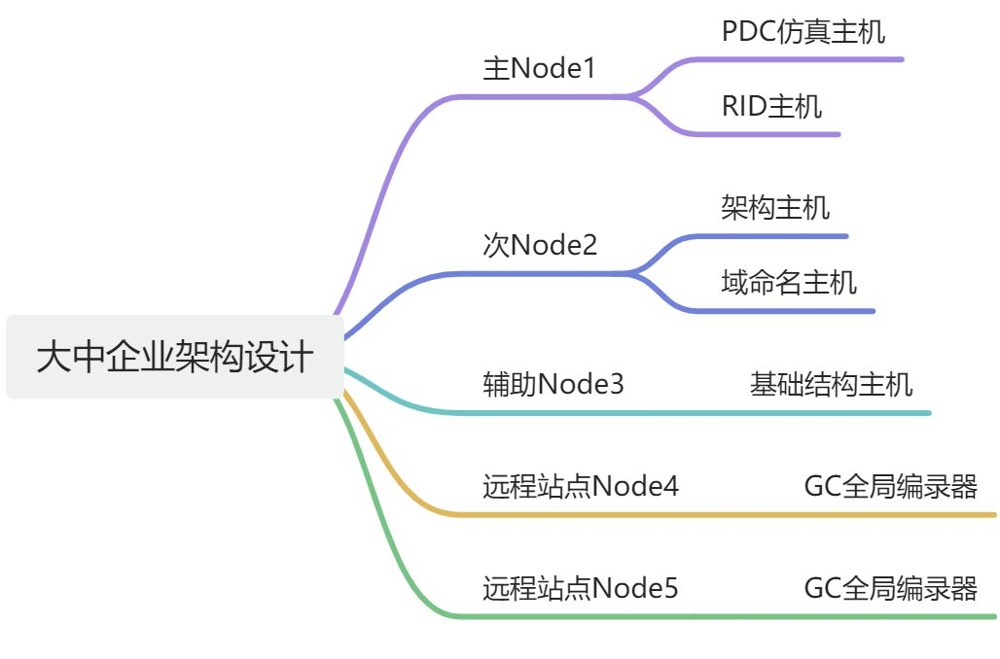

Active Directory (AD) 域的设计和 FSMO（Flexible Single Master Operation）角色的分布是确保AD环境高效、安全运行的关键。在最佳实践中，节点（域控制器）的数量和角色的分配取决于企业的规模、地域分布和业务需求。接下来，我将详细讨论 **AD域的最佳实践设计**，包括几个节点的推荐方案、各节点的 FSMO 角色分配、用途设计以及域的配置要求。

### 1. **节点数量和角色分布的最佳实践**
#### 1.1 **中小型企业的单域环境（2-3个节点）**
对于中小型企业来说，通常有一个单域环境，域控制器的数量取决于可用性需求和负载分布。

##### **节点设计**：
+ **2个节点（域控制器）**：基础的高可用性设计，确保一个域控制器宕机时另一个可以继续提供服务。
+ **3个节点（域控制器）**：增加冗余，保证更高的可用性，特别是在多地域或有分支机构的情况下。

##### **FSMO角色分布**：
+ **节点1**：
    - **PDC仿真主机**：主时间源，负责密码更改、账户锁定等操作。
    - **RID主机**：分配SID中的RID部分。
    - **GC全局编录器：跨域查询和身份验证。**
+ **节点2**：
    - **架构主机**：管理架构更改，通常变化较少。
    - **域命名主机**：管理域的添加和删除操作。
    - **GC全局编录器：跨域查询和身份验证。**
+ **节点3**：
    - **基础结构主机**：负责跨域的对象名称解析（如果没有全局编录，不建议与GC服务器同机）。
    - **GC全局编录器：跨域查询和身份验证。**

##### 配置需求
| 节点 | 操作系统 | 配置 | 角色 |
| --- | --- | --- | --- |
| zzad-app01 | winserver2008R2 | 4C16G 100g | **PDC仿真主机、RID主机、GC全局编录器** |
| zzad-app02 | winserver2008R2 | 4C16G 100G | **架构主机、域命名主机、GC全局编录器** |
| zzad-app03 | winserver2008R2 | 4C16G 100g | **基础结构主机、GC全局编录器** |

##### **设计说明**：
##### **主节点1**处理高负载的角色，例如 PDC仿真主机和 RID主机，因为它们经常进行更频繁的操作。
##### **节点2**放置架构主机和域命名主机，它们的变动较少，因此将这些角色放在次要节点上以减少影响。
##### **节点3**充当基础设施主机或全局编录（GC）服务器，根据是否使用GC调整角色配置。
#### 1.2 **大中型企业的多域环境（5个及以上节点）**
对于大中型企业，尤其是跨地域的组织，多个域控制器分布在不同的站点，以提高可用性和负载分布。

##### **节点设计**：
+ **5个或更多节点**：为了提高性能和容错性，通常会设计多个域控制器。
    - **2-3个主站点的域控制器**
    - **1-2个远程站点的域控制器**

##### **FSMO角色分布**：
+ **节点1（主域控制器）**：
    - **PDC仿真主机**：主时间源，负责密码管理、账户锁定等。应放在主站点的高性能域控制器上。
    - **RID主机**：负责为域内所有域控制器分配RID池，以创建唯一的SID。
+ **节点2（次级域控制器）**：
    - **架构主机**：森林范围的角色，负责架构的更改。放置在主站点的次要域控制器上。
    - **域命名主机**：管理域和应用程序分区的添加与删除。
+ **节点3（辅助域控制器）**：
    - **基础结构主机**：通常与全局编录服务器分开运行，处理跨域的对象名称解析和更新。适合在非全局编录（GC）的域控制器上配置。
+ **节点4和5（远程站点域控制器）**：
    - 这些域控制器可以配置为全局编录（GC）服务器，并且在地理上分布在其他站点，以处理远程位置的身份验证请求，并减少WAN带宽负载。

##### **设计说明**：
+ **PDC仿真主机和 RID主机**应当放置在核心站点的主域控制器上，保证这些关键角色的高可用性和性能。
+ **架构主机和域命名主机**可以放在较少使用的域控制器上，因为这些角色的使用频率低，且变动较少。
+ **基础结构主机**根据网络拓扑的设计，在跨域环境下应该避免与全局编录共存，除非每个域控制器都是全局编录服务器。

---

### 2. **FSMO角色用途设计**
+ **PDC仿真主机**：主要提供时间同步服务，并处理密码更改和账户锁定问题。它还在与 NT 4.0 域的兼容模式中充当主域控制器。因此，建议将其放置在性能较好的主域控制器上。
+ **RID主机**：负责为域内的所有域控制器分配 RID 池。若域控制器上的 RID 用尽，将无法创建新的对象。因此，RID主机的可用性至关重要，建议与 PDC 仿真主机放置在同一节点。
+ **架构主机**：架构主机负责AD架构的修改，这些修改通常比较少见。因此，架构主机可以放置在较少使用的域控制器上，建议与域命名主机一起放置。
+ **域命名主机**：负责域和应用程序分区的管理。类似于架构主机，域命名主机的操作也比较少，因此可以与架构主机一起放在次要节点上。
+ **基础结构主机**：基础结构主机在多域环境下负责跨域的对象名称解析，尤其是引用其他域的对象时。它不应与全局编录服务器共存，除非所有的域控制器都是全局编录服务器。

---

在 Active Directory 中，FSMO（Flexible Single Master Operation）角色可以简写为以下形式：

+ **PDC仿真主机**：**PDC**（Primary Domain Controller Emulator）
+ **RID主机**：**RID**（Relative Identifier Master）
+ **架构主机**：**Schema Master**
+ **域命名主机**：**Domain Naming Master**
+ **基础结构主机**：**Infrastructure Master**

### 3. **域配置要求**
#### **域控制器配置要求**：
+ **全局编录（GC）**：应确保在每个站点至少有一个域控制器配置为全局编录服务器，以提高跨域资源访问的效率。
+ **站点和服务配置**：合理配置站点和子网，以确保AD复制流量的优化。通过正确配置站点，可以减少广域网流量，并加快身份验证过程。
+ **域和信任关系**：如果是多域环境，域之间的信任关系应该设置为双向信任，以便于跨域资源访问。默认情况下，同一森林内的域之间是自动信任的。
+ **时间同步**：PDC仿真主机应配置为与可靠的外部时间源进行同步，确保整个域的时间一致性。所有其他域控制器则应与PDC仿真主机同步。
+ **组策略配置**：组策略应通过域级别和组织单元（OU）级别配置，以控制用户和计算机的设置。可以根据不同部门和站点的需求创建多个OU，灵活管理权限和策略。
+ **备份和恢复计划**：定期备份域控制器的系统状态，特别是 FSMO 角色所在的域控制器，以确保在出现故障时能够快速恢复。

---

4. 全局编录 (Global Catalog, GC)  

**全局编录服务器** 是一个特殊的域控制器，存储了整个 AD 森林中所有对象的部分属性，并允许快速查找这些对象。GC 服务器的作用是使用户能够搜索和访问跨域的资源，而不需要知道资源位于哪个域。

#### **全局编录的作用**：
1. **跨域查询**：GC 服务器存储了整个森林中每个对象的一部分属性（例如对象的名字、类型等）。这允许用户跨域搜索，如搜索不同域中的用户或组。
2. **身份验证**：当用户登录到 AD 时，GC 服务器帮助验证用户是否属于某个组，尤其是跨域的组成员身份验证。

**全局编录服务器** 通常是多个域控制器的一部分，并在整个AD森林中共享部分对象数据，确保可以快速地在不同域中查找对象。

#### **基础结构主机 (Infrastructure Master)**
**基础结构主机** 的主要作用是在多域环境中，当对象引用其他域的对象时（例如用户属于其他域中的组），它负责跨域更新这些对象的名称或位置。当对象在其他域中更改时，基础结构主机确保这些更改能被正确地更新和反映在当前域中。

#### **为什么基础结构主机不应该与全局编录 (GC) 服务器共存？**
在多域环境中，如果基础结构主机和 GC 服务器共存在同一个域控制器上，并且该服务器是该域的唯一基础结构主机，那么基础结构主机将无法正确执行它的跨域更新功能。这是因为全局编录服务器已经存储了所有域的部分对象信息，基础结构主机不会意识到跨域对象的变化，因为 GC 服务器上已经包含了跨域的所有数据。

#### **总结来说**：
+ **基础结构主机**负责更新对象引用的跨域变化（尤其是非 GC 服务器的跨域对象变化）。
+ **全局编录服务器** 存储了整个 AD 森林中每个对象的一部分信息，允许快速跨域搜索。

如果基础结构主机和全局编录服务器共存于同一个服务器上，在多域环境中，基础结构主机会认为它已经可以从 GC 得到所有的信息，导致无法正确地更新引用的跨域对象。因此，**在多域环境下，基础结构主机应尽量不与 GC 服务器放在同一个域控制器上**，以确保基础结构主机的功能不会受到 GC 的影响。

#### **全局编录（GC）和基础结构主机的配置实践**：
+ **全局编录服务器** 通常设置在各个站点的域控制器上，以确保跨域搜索和身份验证的高效。
+ **基础结构主机** 应避免和 GC 服务器放在同一个域控制器上，除非这个域只有一个域控制器，或者所有域控制器都是 GC 服务器。

#### **典型场景**：
+ **单域环境**：因为没有跨域对象引用的问题，基础结构主机和 GC 服务器可以共存。
+ **多域环境**：为了确保基础结构主机能够正确更新跨域对象引用，不建议基础结构主机和 GC 服务器在同一台域控制器上运行。

### 总结
AD域设计中，FSMO角色的分布应根据组织的规模、地理分布和业务需求来确定。在小型环境中，可以集中分配角色，而在大中型企业中，角色应合理分散，以确保高可用性和灵活的管理。每个节点的设计应根据其具体的功能和负载进行配置，并确保有足够的冗余和备份机制来应对可能的故障。通过优化全局编录、站点配置和信任关系，可以保证 AD 环境的高效和稳定运行。

