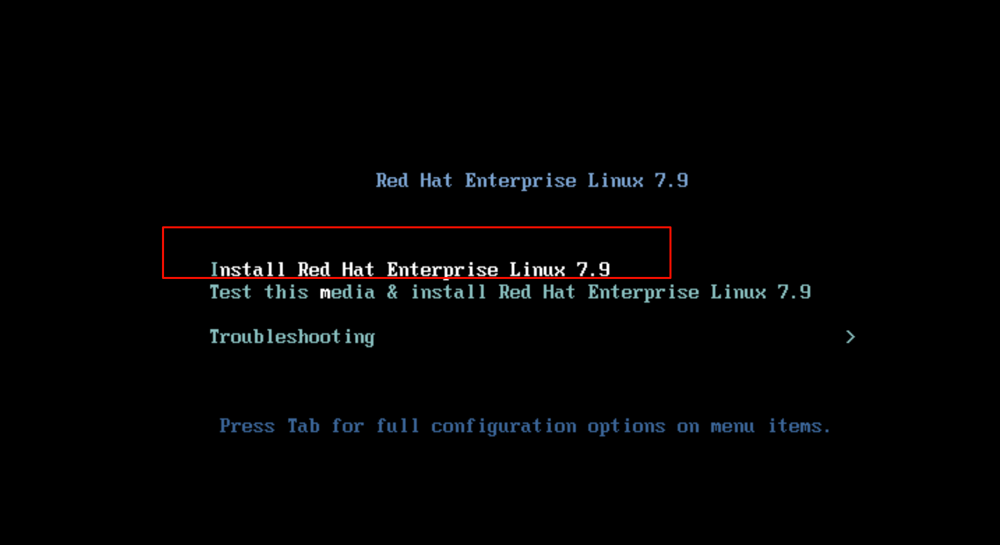
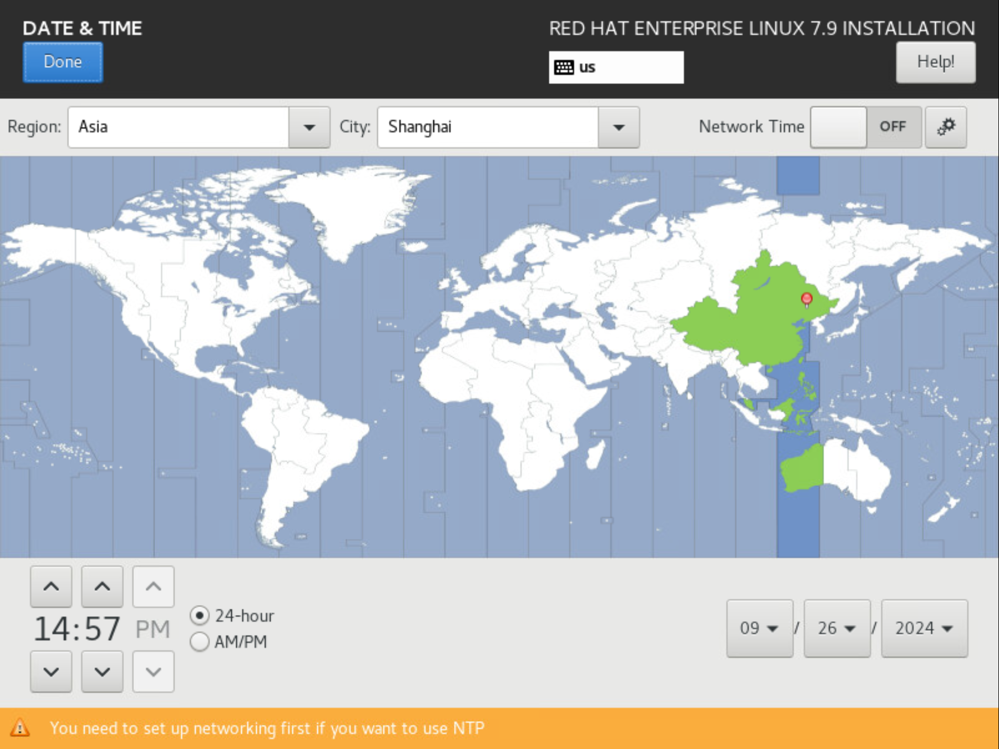
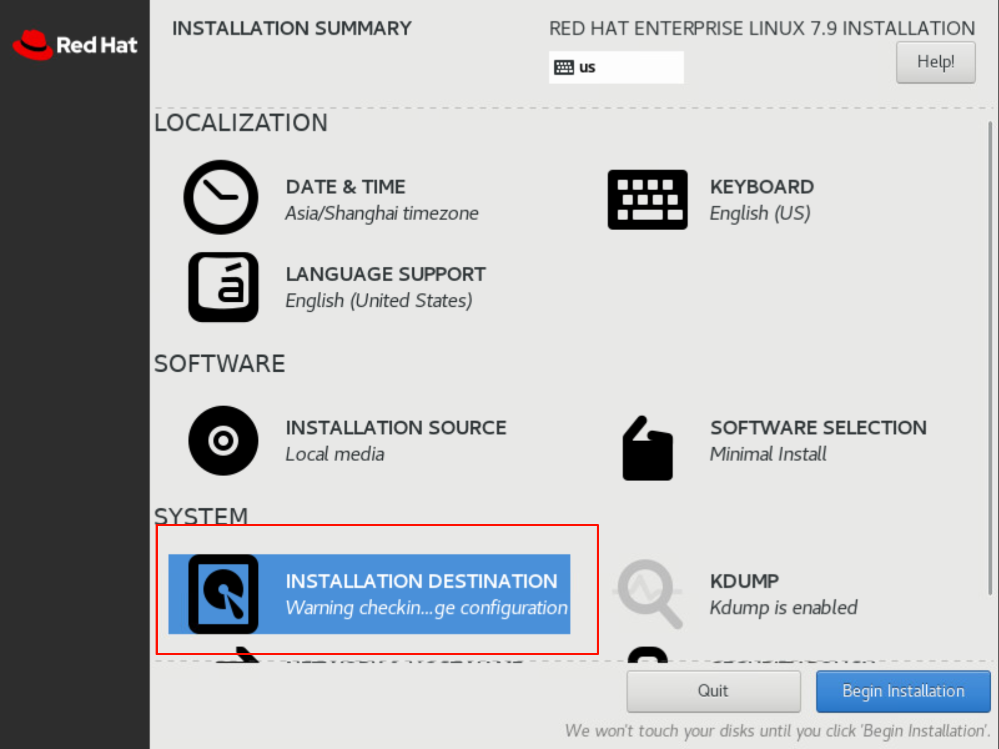
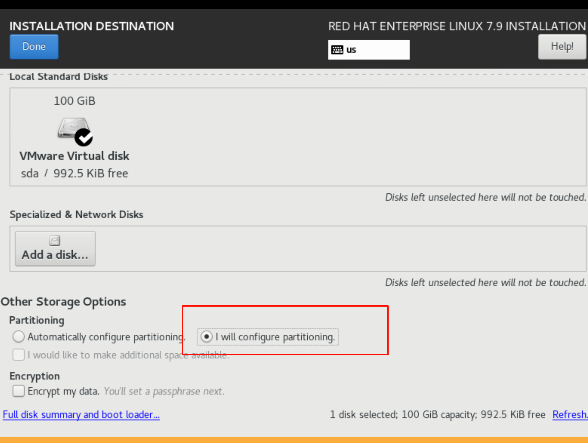
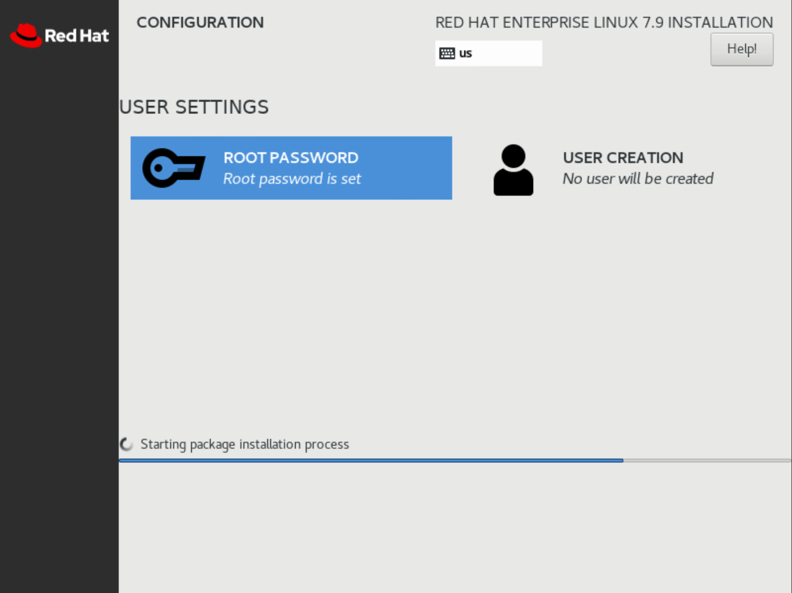

## 系统安装
### 将所有空间挂给根目录
## 
## 
## 
## 
## 
## 
## 
## 
## 
## 
## RHEL7
```shell
#!/bin/bash
# 增加日志审计
cat <<EOF > /etc/rsyslog.d/commands_histroy.conf
local6.* /var/log/commands_histroy.log;
EOF
# 定义 shell 行为
cat <<EOF > /etc/profile.d/customer.sh
export PS1="[\u@\`hostname -I\`\`hostname\` \W]\\$ "
export HISTTIMEFORMAT="\`whoami\` \`tty|cut -d '/' -f3,4\` \$(w -uh>\$HOME/.cache_tty;grep \"\`tty|cut -d '/' -f3,4\`\" \$HOME/.cache_tty|awk '{print \$3}') %F %T "
export PROMPT_COMMAND='RETRN_VAL=\$?;logger -p local6.debug "\$(whoami) [\$\$]: \$(history 1 | sed "s/^[ ]*[0-9]\+[ ]*//" ) [\$RETRN_VAL]"'
export HISTSIZE=1000
export HISTFILESIZE=5000
#export TMOUT=600 #去除注释开启会话510分钟超时
#readonly TMOUT PS1 HISTTIMEFORMAT PROMPT_COMMAND HISTSIZE HISTFILESIZE #去除注释开启会话510分钟超时
readonly HISTTIMEFORMAT PROMPT_COMMAND HISTSIZE HISTFILESIZE
EOF

systemctl restart rsyslog.service
# 配置 I/O 调度算法（针对虚拟化）
sed -i '/^GRUB_CMDLINE_LINUX=/s/\(.*\)rhgb/\1elevator=noop rhgb/' /etc/default/grub

## 执行以下命令生效配置(需重启) ##
## BIOS ##
grub2-mkconfig >/boot/grub2/grub.cfg
hostnamectl --static set-hostname Rhel-7.9
sed -i 's/^SELINUX=.*/SELINUX=disabled/' /etc/selinux/config
systemctl stop firewalld
systemctl disable firewalld
rm -rf /etc/yum.repos.d/*

# 配置 yum 源
cat <<EOF > /etc/yum.repos.d/kehua.repo
[base]
name=base
baseurl=http://repo7.kehua.com/repo/base
enabled=1
gpgcheck=0

[epel]
name=epel
baseurl=http://repo7.kehua.com/repo/epel
enabled=1
gpgcheck=0

[extras]
name=extras
baseurl=http://repo7.kehua.com/repo/extras
enabled=1
gpgcheck=0

[updates]
name=updates
baseurl=http://repo7.kehua.com/repo/updates
enabled=1
gpgcheck=0
EOF
yum makecache

# 安装所需的软件包
yum install chrony vim -y
yum install bash* -y

# 配置 chrony 时间同步
cat <<EOF > /etc/chrony.conf
server ntp.kehua.com iburst
driftfile /var/lib/chrony/drift
makestep 1.0 3
rtcsync
logdir /var/log/chrony
EOF

cat <<EOF > /etc/yum.repos.d/cdrom.bak
[CDROM]
name=isofile
baseurl=file:///mnt/cdrom
enabled=1
gpgcheck=0
EOF
systemctl start chronyd
systemctl enable chronyd
yum install net-tools -y

# 检查并删除虚拟网卡 virbr0
if ip link show virbr0 &> /dev/null; then
    ifconfig virbr0 down
    brctl delbr virbr0
    nmcli device delete virbr0-nic
    systemctl mask libvirtd.service
    systemctl disable libvirtd.service
else
    echo "virbr0 device not found."
fi

# 关闭 Swap
sed -i '/ swap /s/^/#/' /etc/fstab
swapoff -a

# 配置 Ulimit
cat <<EOF >> /etc/security/limits.conf
* soft nofile 65535
* hard nofile 65535
EOF

# 更新网络配置 UUID
#sed -i "s/^UUID=.*/UUID=$(uuidgen)/" /etc/sysconfig/network-scripts/ifcfg-e*

# 添加用户和组
# 创建只读组
# groupadd readonly

# 创建 khadmin 用户，UID 和 GID 与 root 相同
#useradd -u 0 -g 0 -o -m khadmin
#echo "khadmin:P@ssw0rd" | chpasswd  # 设置 khadmin 用户密码
# useradd -s /usr/bin/lshell -G readonly khread1
# echo "khread1:P@ssw0rd" | chpasswd  # 设置 khread1 用户密码
# useradd -s /usr/bin/lshell -G readonly khread2
# echo "khread2:P@ssw0rd" | chpasswd  # 设置 khread2 用户密码


# 重启系统以应用配置
reboot

```


## RHEL8
```shell
#!/bin/bash
# 增加日志审计
cat <<EOF > /etc/rsyslog.d/commands_histroy.conf
local6.* /var/log/commands_histroy.log;
EOF
# 定义 shell 行为
cat <<EOF > /etc/profile.d/customer.sh
#export PS1="[\u@\`hostname -I\`\`hostname\` \W]\\$ "
export HISTTIMEFORMAT="\`whoami\` \`tty|cut -d '/' -f3,4\` \$(w -uh>\$HOME/.cache_tty;grep \"\`tty|cut -d '/' -f3,4\`\" \$HOME/.cache_tty|awk '{print \$3}') %F %T "
export PROMPT_COMMAND='RETRN_VAL=\$?;logger -p local6.debug "\$(whoami) [\$\$]: \$(history 1 | sed "s/^[ ]*[0-9]\+[ ]*//" ) [\$RETRN_VAL]"'
export HISTSIZE=1000
export HISTFILESIZE=5000
#export TMOUT=600 
#readonly TMOUT PS1 HISTTIMEFORMAT PROMPT_COMMAND HISTSIZE HISTFILESIZE
readonly HISTTIMEFORMAT PROMPT_COMMAND HISTSIZE HISTFILESIZE
EOF
systemctl restart rsyslog.service
#配置I/O调度算法（针对虚拟化）
sed -i '/^GRUB_CMDLINE_LINUX=/s/\(.*\)rhgb/\1elevator=none rhgb/' /etc/default/grub

## 执行以下命令生效配置(需重启) ##
## BIOS ##
grub2-mkconfig /boot/efi/EFI/redhat/grub.cfg
hostnamectl --static set-hostname Rhel-8.10
sed -i 's/^SELINUX=.*/SELINUX=disabled/' /etc/selinux/config
systemctl stop firewalld
systemctl disable firewalld
rm -rf /etc/yum.repos.d/*
cat <<EOF > /etc/yum.repos.d/kehua.repo
[baseos]
name=baseos
baseurl=http://repo8.kehua.com/rockrepo/baseos
enabled=1 
gpgcheck=0
 
 

[AppStream]
name=AppStream
baseurl=http://repo8.kehua.com/rockrepo/appstream
enabled=1
gpgcheck=0
EOF
yum makecache
# 安装所需的软件包
yum install chrony vim -y
yum install bash* -y
# 配置 chrony 时间同步
cat <<EOF > /etc/chrony.conf
server ntp.kehua.com iburst
driftfile /var/lib/chrony/drift
makestep 1.0 3
rtcsync
logdir /var/log/chrony
EOF

systemctl start chronyd
systemctl enable chronyd
yum install net-tools -y

# 检查并删除虚拟网卡 virbr0
if ip link show virbr0 &> /dev/null; then
    ifconfig virbr0 down
    brctl delbr virbr0
    nmcli device delete virbr0-nic
    systemctl mask libvirtd.service
    systemctl disable libvirtd.service
else
    echo "virbr0 device not found."
fi

# 关闭 Swap
sed -i '/ swap /s/^/#/' /etc/fstab
swapoff -a

# 配置 Ulimit
cat <<EOF >> /etc/security/limits.conf
* soft nofile 65535
* hard nofile 65535
EOF

# 更新网络配置 UUID
sed -i "s/^UUID=.*/UUID=$(uuidgen)/" /etc/sysconfig/network-scripts/ifcfg-e*

# 添加用户和组
# 创建只读组
# groupadd readonly

# 创建 khadmin 用户，UID 和 GID 与 root 相同
#useradd -u 0 -g 0 -o -m khadmin
#echo "khadmin:P@ssw0rd" | chpasswd  # 设置 khadmin 用户密码
# useradd -s /usr/bin/lshell -G readonly khread1
# echo "khread1:P@ssw0rd" | chpasswd  # 设置 khread1 用户密码
# useradd -s /usr/bin/lshell -G readonly khread2
# echo "khread2:P@ssw0rd" | chpasswd  # 设置 khread2 用户密码


# 重启系统以应用配置
reboot

```

## RHEL9
```shell

```

## 安装vmtool
```shell
mount /dev/sr0 /mnt
cd /mnt
tar -zxvf VMwareTools-*.tar.gz -C /tmp
yum update
yum install net-tools
cd /tmp/vmware-tools-distrib
./vmware-install.pl
一直按回车，直至安装成功
```


## 安装lshell（管理用户只能使用某些命令）
```shell
#python3.11安装最新版本
pip download wheel -i https://pypi.tuna.tsinghua.edu.cn/simple
#传入需要安装的机器
yum install python3.11 python3.11-pip -y
pip3 install *.wheel
wget https://github.com/ghantoos/lshell/archive/refs/tags/0.10.tar.gz
tar -xzvf lshell-0.10.tar.gz
cd lshell-0.10/
python3.12 setup.py sdist bdist_wheel
dnf install python3.12 python3.12-setuptools python3.12-pip -y
python3.12 -m pip install .
cp etc/lshell.conf /etc/

#编译成二进制安装
python3.12 -m pip install pyinstaller
git clone https://github.com/ghantoos/lshell.git
cd lshell
pyinstaller --onefile --paths=. bin/lshell
./dist/lshell --help
#然后拷贝到机器上

#python2安装0.9.18版本
wget https://github.com/ghantoos/lshell/releases/download/0.9.18/lshell_0.9.18.tar.gz
python setup.py install --no-compile --install-scripts=/usr/bin/

```

```shell
#配置只读用户，并且设置可以提权，避免查看文件权限不足
#追加插入以下内容
tee /etc/lshell.conf << 'EOF' 
[global]
logpath         : /var/log/lshell/
loglevel        : 2
[default]
allowed         : ['ls','echo','ll','vim','tail','sleep','touch','mkdir']
forbidden       : [';','&', '|','`','>','<', '$(','${']
warning_counter : 2
aliases         : {'ll':'ls -l'}
prompt          : "\033[91m%u\033[97m@\033[96m%h\033[0m"
strict          : 0
[grp:readonly]
allowed         : ['head', 'tail', 'grep', 'find','stat', 'wc','view','ls','echo','cd','ll','less','more','cat','view','tail', 'grep','wc']
forbidden       : [';', '&', '|','`','>','<', '$(', '${']
warning_counter : 2
sudo_commands   : ['head', 'tail', 'grep', 'find','stat', 'wc','view','ls','echo','cd','ll','less','more','cat','view','tail', 'grep','wc']
aliases         : {'ll':'ls -l', 'vim':'rvim'}
path            : ['/*']
strict          : 0
EOF
#配置sudo免密
tee -a /etc/sudoers<< 'EOF'
%readonly       ALL=(ALL)       NOPASSWD: ALL
EOF
echo '%readonly   ALL=(ALL)  NOPASSWD: ALL' > /etc/sudoers.d/readonly
chmod 440 /etc/sudoers.d/readonly

tee /usr/bin/lshell << 'EOF'
#!/bin/bash
/usr/bin/lshell_cli --config /etc/lshell.conf
EOF
chmod +x /usr/bin/lshell
```


# 
## 
