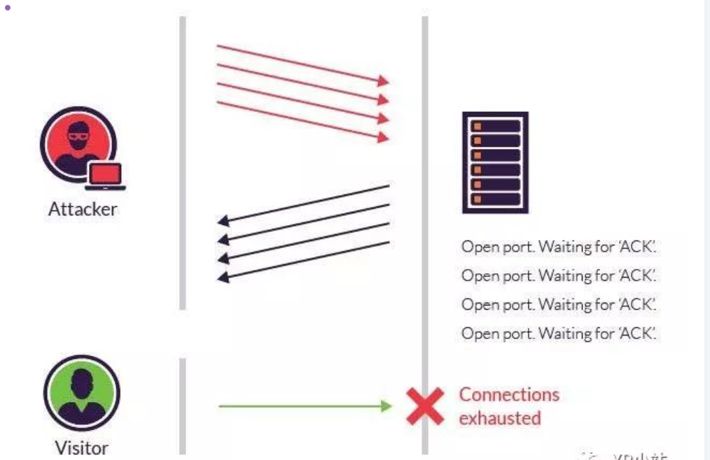

### **<font style="color:rgb(0, 0, 0);">前提</font>**
<font style="color:rgb(51, 51, 51);">当你在 linux上运行 </font>`<font style="color:rgb(10, 191, 91);background-color:rgb(243, 245, 249);">dmesg -T</font>`<font style="color:rgb(51, 51, 51);"> 命令，看到下面输出，可能会猜测遭受到 </font>`<font style="color:rgb(10, 191, 91);background-color:rgb(243, 245, 249);">SYN</font>`<font style="color:rgb(51, 51, 51);"> 洪水攻击。</font>

```plain
[Mon Mar 24 13:35:42 2025] TCP: TCP: Possible SYN flooding on port 53. Sending cookies.  Check SNMP counters.

```

<font style="color:rgb(51, 51, 51);">上图只是可能遭受到 </font>`<font style="color:rgb(10, 191, 91);background-color:rgb(243, 245, 249);">SYN</font>`<font style="color:rgb(51, 51, 51);"> 洪水攻击，但不一定是被攻击了。后面讲述如何判定这个问题？</font>

### **<font style="color:rgb(0, 0, 0);">简述 TCP SYN flood 攻击原理</font>**
<font style="color:rgb(0, 82, 217);">TCP</font><font style="color:rgb(51, 51, 51);"> 协议要经过三次握手才能建立连接：</font>

<font style="color:rgb(51, 51, 51);">于是出现了对于握手过程进行的攻击。攻击者发送大量的 </font>`<font style="color:rgb(10, 191, 91);background-color:rgb(243, 245, 249);">SYN</font>`<font style="color:rgb(51, 51, 51);"> 包，服务器回应 </font>`<font style="color:rgb(10, 191, 91);background-color:rgb(243, 245, 249);">(SYN+ACK)</font>`<font style="color:rgb(51, 51, 51);"> 包，但是攻击者不回应 </font>`<font style="color:rgb(10, 191, 91);background-color:rgb(243, 245, 249);">ACK</font>`<font style="color:rgb(51, 51, 51);"> 包，这样的话，服务器不知道 </font>`<font style="color:rgb(10, 191, 91);background-color:rgb(243, 245, 249);">(SYN+ACK)</font>`<font style="color:rgb(51, 51, 51);"> 是否发送成功，默认情况下会重试5次</font>`<font style="color:rgb(10, 191, 91);background-color:rgb(243, 245, 249);">（tcp_syn_retries）</font>`<font style="color:rgb(51, 51, 51);">。这样的话，对于服务器的内存，带宽都有很大的消耗。见下图：</font>



### **<font style="color:rgb(0, 0, 0);">判断方法</font>**
+ <font style="color:rgb(51, 51, 51);">查看所有TCP连接数，按状态统计并排序</font>

```javascript
$ netstat -ant | awk '/^tcp/{print $NF}' | sort -n | uniq -c  | sort -nr

4913 TIME_WAIT
1726 ESTABLISHED
  87 FIN_WAIT2
  23 LISTEN
  23 FIN_WAIT1
   7 LAST_ACK
   3 SYN_SENT
   1 CLOSING
```

<font style="color:rgb(51, 51, 51);">从上面看，</font>`<font style="color:rgb(10, 191, 91);background-color:rgb(243, 245, 249);">SYN_SENT</font>`<font style="color:rgb(51, 51, 51);"> 数值很小，排除洪水攻击，可能是 </font>`<font style="color:rgb(10, 191, 91);background-color:rgb(243, 245, 249);">并发连接过多</font>`<font style="color:rgb(51, 51, 51);">。</font>

+ <font style="color:rgb(51, 51, 51);">查看网络连接打开的文件数</font>

```javascript
$ lsof -ni | wc -l
2207


```

+ <font style="color:rgb(51, 51, 51);">查看 </font>`<font style="color:rgb(10, 191, 91);background-color:rgb(243, 245, 249);">SOCKET</font>`<font style="color:rgb(51, 51, 51);"> 状态，以及数量 </font>

```javascript
$ cat /proc/net/sockstat

sockets: used 2273
TCP: inuse 1636 orphan 1039 tw 8795 alloc 3115 mem 873
UDP: inuse 2 mem 2
```

+ <font style="color:rgb(51, 51, 51);">查看内核参数 </font>`<font style="color:rgb(10, 191, 91);background-color:rgb(243, 245, 249);">net.ipv4.tcp_max_syn_backlog</font>`

`<font style="color:rgb(10, 191, 91);background-color:rgb(243, 245, 249);">net.ipv4.tcp_max_syn_backlog</font>`<font style="color:rgb(51, 51, 51);"> 半连接队列长度（默认为1024），加大SYN队列长度可以容纳更多等待连接的网络连接数，具体多少数值受限于内存</font>

```javascript
$ sysctl -a | grep tcp_max_syn_backlog

net.ipv4.tcp_max_syn_backlog = 2048
```

<font style="color:rgb(51, 51, 51);">查看内核参数 </font>`<font style="color:rgb(10, 191, 91);background-color:rgb(243, 245, 249);">net.ipv4.tcp_synack_retries</font>`

`<font style="color:rgb(10, 191, 91);background-color:rgb(243, 245, 249);">net.ipv4.tcp_synack_retries</font>`<font style="color:rgb(51, 51, 51);"> 表示回应第二个握手包（SYN+ACK包）给客户端IP后，如果收不到第三次握手包（ACK包），进行重试的次数（默认为5）。</font>

```javascript
$ sysctl -a | grep tcp_synack_retries

net.ipv4.tcp_synack_retries = 5
```

`<font style="color:rgb(10, 191, 91);background-color:rgb(243, 245, 249);">结论</font>`<font style="color:rgb(51, 51, 51);">：tcp_max_syn_backlog（2048） 小于 2207（lsof -ni | wc -l），可能网络连接数不够了。</font>

### **<font style="color:rgb(0, 0, 0);">优化方法</font>**
```javascript
# 编辑 /etc/sysctl.conf 配置文件，修改参数
$ vim /etc/sysctl.conf

# 当出现SYN等待队列溢出时，启用cookies来处理，可防范少量SYN攻击，默认为0
net.ipv4.tcp_syncookies = 1

# SYN队列的长度，默认为1024
net.ipv4.tcp_max_syn_backlog = 4096

# 允许将TIME-WAIT sockets重新用于新的TCP连接，默认为0，表示关闭
net.ipv4.tcp_tw_reuse = 0

# 开启TCP连接中TIME-WAIT sockets的快速回收，默认为0，表示关闭
net.ipv4.tcp_tw_recycle = 1

# 如果套接字由本端要求关闭，这个参数决定了它保持在FIN-WAIT-2状态的时间，默认60
net.ipv4.tcp_fin_timeout = 30

# 当keepalive起用的时候，TCP发送keepalive消息的频度。缺省是2小时（7200）
net.ipv4.tcp_keepalive_time = 1200

# 用于向外连接的端口范围。缺省情况下很小：32768到61000
net.ipv4.ip_local_port_range = 1024 65000

# 同时保持TIME_WAIT套接字的最大数量，如果超过这个数字，TIME_WAIT套接字将立刻被清除并打印警告信息。默认为180000
net.ipv4.tcp_max_tw_buckets = 5000

# 生效配置
$ sysctl -p
```

### **<font style="color:rgb(0, 0, 0);">TCP SYN flood 攻击防御方法</font>**
<font style="color:rgb(51, 51, 51);">下面列举部分方法，方法可以同时使用，也可以单独使用：</font>

+ <font style="color:rgb(51, 51, 51);">方法一：限制 SYN 并发数 $ iptables -A INPUT -p tcp --syn -m limit --limit 1/s -j ACCEPT --limit 1/s</font>
+ <font style="color:rgb(51, 51, 51);">方法二：优化系统内核参数，具体可以参考上面 </font>`<font style="color:rgb(10, 191, 91);background-color:rgb(243, 245, 249);">优化方法</font>`
+ <font style="color:rgb(51, 51, 51);">方法三：网站上 </font>`<font style="color:rgb(10, 191, 91);background-color:rgb(243, 245, 249);">CDN</font>`<font style="color:rgb(51, 51, 51);">，隐藏源站 IP，让 </font>`<font style="color:rgb(10, 191, 91);background-color:rgb(243, 245, 249);">CDN</font>`<font style="color:rgb(51, 51, 51);"> 抵抗攻击</font>
+ <font style="color:rgb(51, 51, 51);">方法四：购买 </font>`<font style="color:rgb(10, 191, 91);background-color:rgb(243, 245, 249);">高防IP</font>`

