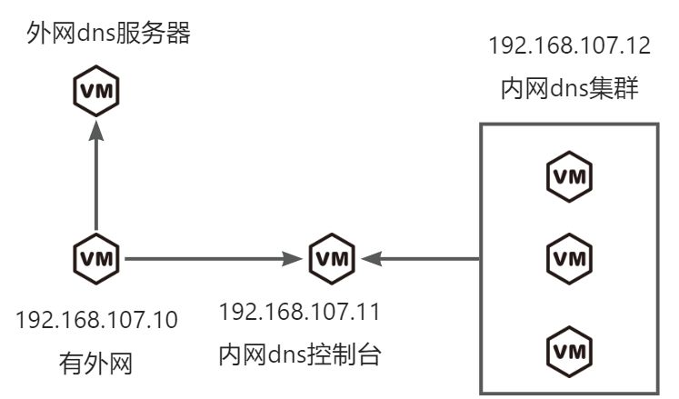
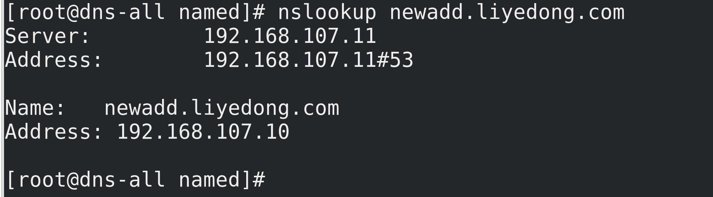
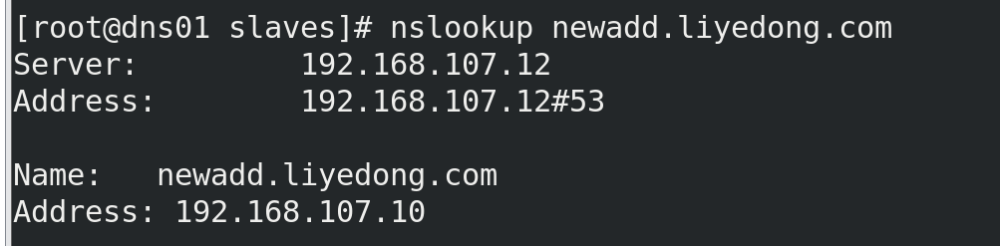

# RHEL8搭建dns服务
# 架构设计


# 测试环境规划
| 主机名 | ip | 操作系统 | dns |
| --- | --- | --- | --- |
| dns-out.liyedong.com | 192.168.107.10 | RHEL8 | 223.5.5.5 223.6.6.6 |
| dns-all.liyedong.com | 192.168.107.11 | RHEL8 | 192.168.107.11 |
| dns01.liyedong.com | 192.168.107.12 | RHEL8 | 192.168.107.12 |


# 安装软件包.
每个节点都执行

```bash
dnf update
dnf install bind bind-utils -y
```

# 配置
## dns-out.liyedong.com配置
```bash
vim /etc/named.conf
options {
    listen-on port 53 { 127.0.0.1; 192.168.107.10; };
    directory "/var/named";
    allow-query     { any; };
    dump-file       "/var/named/data/cache_dump.db";
    statistics-file "/var/named/data/named_stats.txt";
    memstatistics-file "/var/named/data/named_mem_stats.txt";
    recursion no;  # 不处理内部解析请求
    forwarders { 223.5.5.5;223.6.6.6; };  # 阿里云的公共 DNS 服务器
    forward only;  # 仅转发请求，不处理其他解析
};
logging {
        channel default_debug {
                file "data/named.run";
                severity dynamic;
        };
};
zone "." IN {
        type hint;
        file "named.ca";
};
#include "/etc/named.rfc1912.zones";
#include "/etc/named.root.key";
```

```bash
systemctl start named
systemctl enable named
```

## dns-all.liyedong.com配置
```bash
vim /etc/named.conf
options {
    listen-on port 53 { 127.0.0.1; 192.168.107.11; };
    directory "/var/named";
    allow-query     { any; };
    forwarders { 192.168.107.10; };
    recursion yes;
};

zone "liyedong.com" IN {
    type master;
    file "liyedong.com.zone";
};

logging {
        channel default_debug {
                file "data/named.run";
                severity dynamic;
        };
};
#include "/etc/named.rfc1912.zones";
#include "/etc/named.root.key";
```

```bash
vim /var/named/liyedong.com.zone
$TTL 86400
@   IN  SOA  dns-all.liyedong.com. admin.liyedong.com. (
          2024073012 ; Serial
          3600       ; Refresh
          1800       ; Retry
          1209600    ; Expire
          86400 )    ; Minimum TTL
;各个从节点同步host
@   IN  NS   dns01.liyedong.com.
@   IN  NS   dns-all.liyedong.com.
; 地址记录
dns-out   IN  A    192.168.107.10
dns-all   IN  A    192.168.107.11
dns01     IN  A    192.168.107.12
esxi01    IN  A    192.168.107.10
lydtest   IN  A    192.168.107.10
lydpp     IN  A    192.168.107.10
```


```bash
systemctl start named
systemctl enable named
```

## dns01.liyedong.com配置
```bash
options {
    listen-on port 53 { 127.0.0.1; 192.168.107.12; };
    directory "/var/named";
    allow-query     { any; };
    recursion yes;
};

zone "liyedong.com" IN {
    type slave;
    file "slaves/liyedong.com.zone";
    masters { 192.168.107.11; };  # 从内网 DNS 总控制台同步
};
logging {
        channel default_debug {
                file "data/named.run";
                severity dynamic;
        };
};

#include "/etc/named.rfc1912.zones";
#include "/etc/named.root.key";

```

```bash
systemctl start named
systemctl enable named
```

# 测试
在dns-all这台虚拟机上执行

```bash
vim /var/named/liyedong.com.zone
$TTL 86400
@   IN  SOA  dns-all.liyedong.com. admin.liyedong.com. (
          2024073013 ; Serial   #修改一次这个序列号才会更新
          3600       ; Refresh
          1800       ; Retry
          1209600    ; Expire
          86400 )    ; Minimum TTL
;各个从节点同步host
@   IN  NS   dns01.liyedong.com.
@   IN  NS   dns-all.liyedong.com.
; 地址记录
dns-out   IN  A    192.168.107.10
dns-all   IN  A    192.168.107.11
dns01     IN  A    192.168.107.12
esxi01    IN  A    192.168.107.10
lydtest   IN  A    192.168.107.10
lydpp     IN  A    192.168.107.10
newadd    IN  A    192.168.107.10   #新增
```

```bash
rndc reload  #更新节点
nslookup newadd.liyedong.com
```



在dns01这台虚拟机上执行

```bash
nslookup newadd.liyedong.com
```



