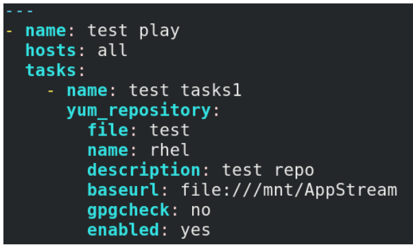
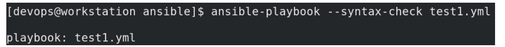
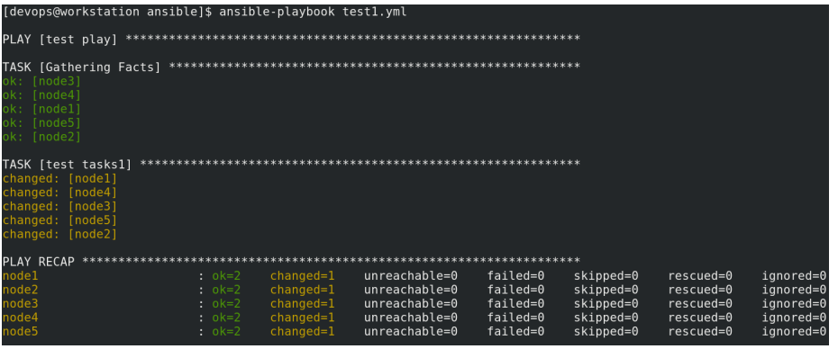
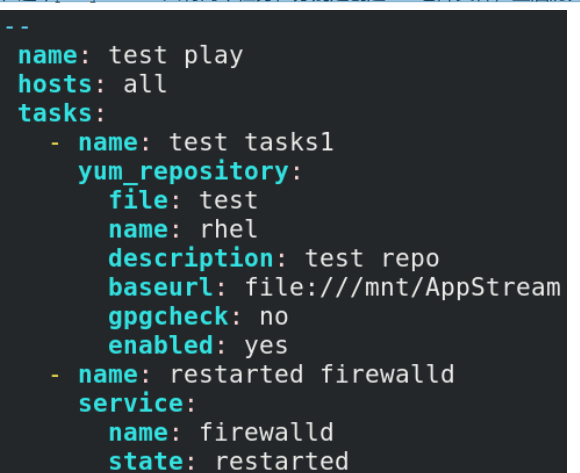
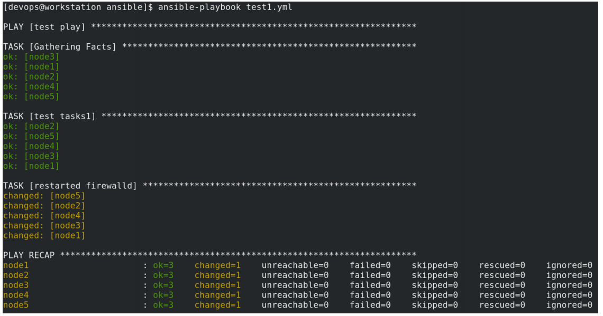
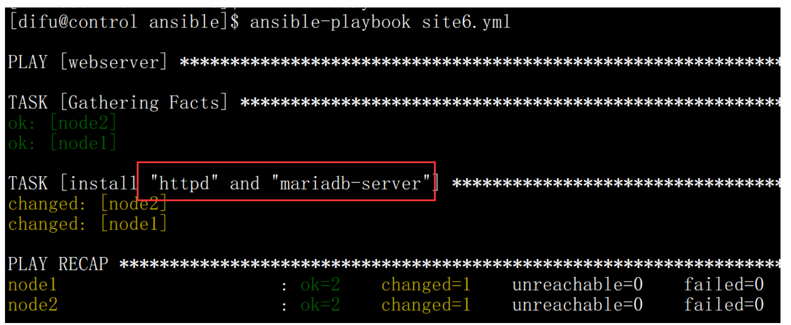
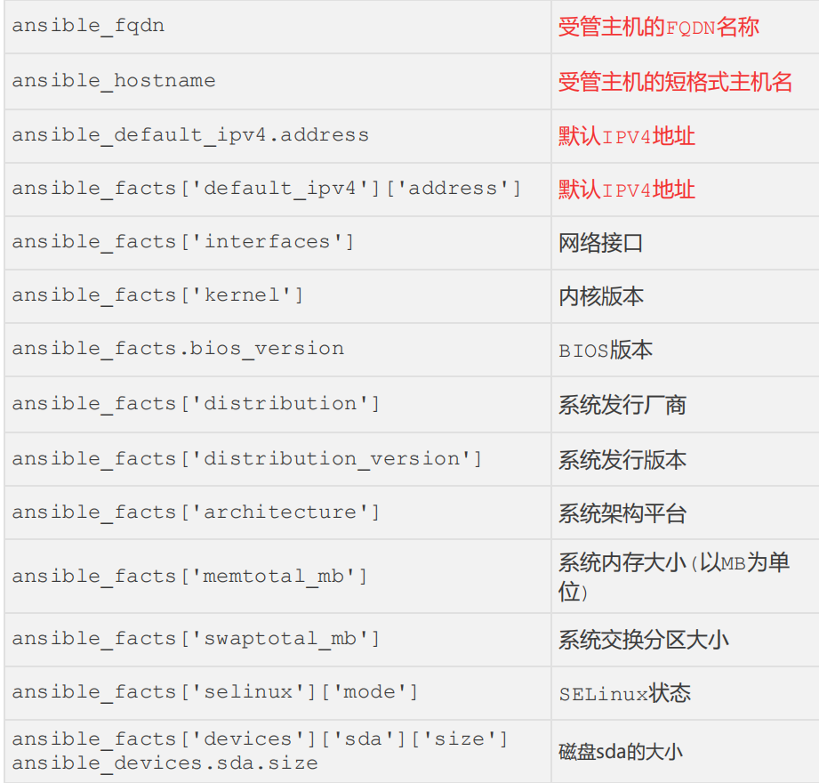

# 部署ansible


```shell
yum install -y ansible-core
yum install -y ansible-navigator
ansible-navigator images
```


# 配置文件
**<font style="color:rgb(0,0,0);">管理配置文件 </font>**

<font style="color:rgb(0,0,0);">ansible</font><font style="color:rgb(0,0,0);">的配置文件名为</font>**<font style="color:rgb(0,0,0);">ansible.cfg</font>**<font style="color:rgb(0,0,0);">,RHEL8</font><font style="color:rgb(0,0,0);">版本默认位于</font>**<font style="color:rgb(0,0,0);">/etc/ansible/ansible.cfg </font>**<font style="color:rgb(0,0,0);">。此 </font>

<font style="color:rgb(0,0,0);">文件定义了连接受管主机的方法、权限以及受管主机清单文件等信息。 </font>

<font style="color:rgb(0,0,0);">在RHEL9中，需要使用命令来初始化一个配置文件 </font>

<font style="color:rgb(0,0,0);">ansible-config init > ansible.cfg</font>

**<font style="color:rgb(0,0,0);">1.ansible.cfg</font>****<font style="color:rgb(0,0,0);">的读取顺序 </font>**

**<font style="color:rgb(0,0,0);">ansible.cfg</font>**<font style="color:rgb(0,0,0);">可能会位于多个地方，</font><font style="color:rgb(0,0,0);">ansible</font><font style="color:rgb(0,0,0);">会在以下位置按顺序读取</font>**<font style="color:rgb(0,0,0);">ansible.cfg</font>**<font style="color:rgb(0,0,0);">文件： </font>

<font style="color:rgb(0,0,0);">1. </font><font style="color:rgb(0,0,0);">使用</font>**<font style="color:rgb(0,0,0);">-c </font>**<font style="color:rgb(0,0,0);">或</font>**<font style="color:rgb(0,0,0);">--config </font>**<font style="color:rgb(0,0,0);">指定配置文件的路径 </font>

<font style="color:rgb(0,0,0);">2. </font><font style="color:rgb(0,0,0);">使用环境变量</font>**<font style="color:rgb(0,0,0);">ANSIBLE_CONFIG </font>**

<font style="color:rgb(0,0,0);">3. </font><font style="color:rgb(0,0,0);">当前目录下的</font><font style="color:rgb(0,0,0);">ansible.cfg</font><font style="color:rgb(0,0,0);">文件 </font>

<font style="color:rgb(0,0,0);">4. </font><font style="color:rgb(0,0,0);">当前用户家目录下的</font><font style="color:rgb(0,0,0);">ansible.cfg</font><font style="color:rgb(0,0,0);">文件 </font>

<font style="color:rgb(0,0,0);">5. </font><font style="color:rgb(0,0,0);">默认配置文件</font>**<font style="color:rgb(0,0,0);">/etc/ansible/ansible.cfg </font>**

<font style="color:rgb(0,0,0);">可以使用 ansible --version 查看当前所使用的配置文件</font>

```shell
 [devops@workstation ~]$ ansible --version
```

**<font style="color:rgb(0,0,0);">2.ansible.cfg参数配置</font>**

**<font style="color:rgb(0,0,0);">ansible.cfg</font>**<font style="color:rgb(0,0,0);">使用分段式配置，每个段使用</font><font style="color:rgb(0,0,0);">"[]"</font><font style="color:rgb(0,0,0);">包含，每个段下方使用</font><font style="color:rgb(0,0,0);">key=value</font><font style="color:rgb(0,0,0);">方式定义 </font>

<font style="color:rgb(0,0,0);">ansible</font><font style="color:rgb(0,0,0);">工作方式。 </font>

<font style="color:rgb(0,0,0);">主要的配置段有</font>**<font style="color:rgb(0,0,0);">[defaults]</font>**<font style="color:rgb(0,0,0);">和</font>**<font style="color:rgb(0,0,0);">[privilege_escalation] </font>**

**<font style="color:rgb(0,0,0);">[defaults] </font>**<font style="color:rgb(0,0,0);">用来定义通用默认配置 </font>

**<font style="color:rgb(0,0,0);">[privilege_escalation] </font>**<font style="color:rgb(0,0,0);">用于定义在受管主机上的提权配置 </font>

**<font style="color:rgb(0,0,0);">[defaults]</font>****<font style="color:rgb(0,0,0);">中的配置参数 </font>**

<font style="color:rgb(0,0,0);">1</font>**<font style="color:rgb(223,64,42);">.inventory = /etc/ansible/hosts </font>**

<font style="color:rgb(0,0,0);">定义</font><font style="color:rgb(0,0,0);">inventory</font><font style="color:rgb(0,0,0);">主机清单文件的位置，默认清单文件是</font><font style="color:rgb(0,0,0);">/etc/ansible/hosts </font>

<font style="color:rgb(0,0,0);">2.</font>**<font style="color:rgb(223,64,42);">forks = 5 </font>**

<font style="color:rgb(0,0,0);">与受管主机通信时的并行的进程数，默认是</font><font style="color:rgb(0,0,0);">5 </font>

<font style="color:rgb(0,0,0);">3.</font>**<font style="color:rgb(223,64,42);">remote_user = root </font>**

<font style="color:rgb(0,0,0);">设置受管主机的用户，默认是</font><font style="color:rgb(0,0,0);">root,</font><font style="color:rgb(0,0,0);">如果未设置则是以控制节点当前用户身份 </font>

<font style="color:rgb(0,0,0);">4.</font>**<font style="color:rgb(223,64,42);">ask_pass = True </font>**

<font style="color:rgb(0,0,0);">在连接受管主机是是否要输入密码</font><font style="color:rgb(0,0,0);">,</font><font style="color:rgb(0,0,0);">默认是需要的。配置好</font><font style="color:rgb(0,0,0);">SSH</font><font style="color:rgb(0,0,0);">公钥认证则可以自动连接，无需密码。 </font>

**<font style="color:rgb(223,64,42);">[privilege_escalation]</font>****<font style="color:rgb(0,0,0);">中的配置参数 </font>**

**<font style="color:rgb(223,64,42);">become=True </font>**<font style="color:rgb(0,0,0);">在受管主机是否进行提权 </font>

**<font style="color:rgb(223,64,42);">become_method=sudo </font>**<font style="color:rgb(0,0,0);">提权方式为</font><font style="color:rgb(0,0,0);">sudo </font><font style="color:rgb(0,0,0);">，默认是</font><font style="color:rgb(0,0,0);">su </font>

**<font style="color:rgb(223,64,42);">become_user=root </font>**<font style="color:rgb(0,0,0);">提权后的用户 </font>

**<font style="color:rgb(223,64,42);">become_ask_pass=False </font>**<font style="color:rgb(0,0,0);">提权时是否需要密码 </font>

**<font style="color:rgb(0,0,0);">ansible.cfg 配置文件示例</font>**

```shell
[defaults]
inventory=~/ansible/inventory
remote_user=alice
[privilege_escalation]
become=True
become_method=sudo
become_user=root
become_ask_pass=False
```

**<font style="color:rgb(0,0,0);">inventory主机清单文件 </font>**

<font style="color:rgb(0,0,0);">inventory</font><font style="color:rgb(0,0,0);">文件位置是在</font><font style="color:rgb(0,0,0);">ansible.cfg</font><font style="color:rgb(0,0,0);">中定义的 </font>

<font style="color:rgb(0,0,0);">inventory</font><font style="color:rgb(0,0,0);">文件就是受管主机的清单，定义了哪些主机将被</font><font style="color:rgb(0,0,0);">ansible</font><font style="color:rgb(0,0,0);">管理。 </font>

<font style="color:rgb(0,0,0);">这些主机列表可以进行分组，也可以使用变量来定义主机和主机组。 </font>

**<font style="color:rgb(0,0,0);">inventory </font>****<font style="color:rgb(0,0,0);">文件的内置变量 </font>**

<font style="color:rgb(0,0,0);">ansible_ssh_host # </font><font style="color:rgb(0,0,0);">要连接的主机名 </font><font style="color:rgb(0,0,0);">ansible_ssh_port # </font><font style="color:rgb(0,0,0);">端口号，默认</font><font style="color:rgb(0,0,0);">22 </font>

<font style="color:rgb(0,0,0);">ansible_ssh_user # ssh</font><font style="color:rgb(0,0,0);">连接时默认使用的用户名 </font><font style="color:rgb(0,0,0);">ansible_ssh_pass # ssh</font><font style="color:rgb(0,0,0);">连接时的密码 </font>

<font style="color:rgb(0,0,0);">ansible_sudo_pass # </font><font style="color:rgb(0,0,0);">使用</font><font style="color:rgb(0,0,0);">sudo</font><font style="color:rgb(0,0,0);">连接用户时的密码 </font><font style="color:rgb(0,0,0);">ansible_ssh_private_key_file # </font><font style="color:rgb(0,0,0);">秘 </font>

<font style="color:rgb(0,0,0);">钥文件如果不想使用</font><font style="color:rgb(0,0,0);">sshagent</font><font style="color:rgb(0,0,0);">管理时可以使用此选项 </font><font style="color:rgb(0,0,0);">ansible_shell_type # shell</font><font style="color:rgb(0,0,0);">类型，默 </font>

<font style="color:rgb(0,0,0);">认</font><font style="color:rgb(0,0,0);">sh ansible_connection # SSH</font><font style="color:rgb(0,0,0);">连接类型：</font><font style="color:rgb(0,0,0);">local</font><font style="color:rgb(0,0,0);">、</font><font style="color:rgb(0,0,0);">ssh</font><font style="color:rgb(0,0,0);">、</font><font style="color:rgb(0,0,0);">paramiko</font><font style="color:rgb(0,0,0);">在</font><font style="color:rgb(0,0,0);">ansible 1.2</font><font style="color:rgb(0,0,0);">之前默 </font>

<font style="color:rgb(0,0,0);">认</font><font style="color:rgb(0,0,0);">paramiko ansible_python_interpreter # </font><font style="color:rgb(0,0,0);">用来指定</font><font style="color:rgb(0,0,0);">Python</font><font style="color:rgb(0,0,0);">解释器的路径，同样可以指定 </font>

<font style="color:rgb(0,0,0);">ruby</font><font style="color:rgb(0,0,0);">、</font><font style="color:rgb(0,0,0);">Perl</font><font style="color:rgb(0,0,0);">的路径 </font>

**<font style="color:rgb(0,0,0);">inventory </font>****<font style="color:rgb(0,0,0);">文件的写法 </font>**

**<font style="color:rgb(0,0,0);">可以写主机名或</font>****<font style="color:rgb(0,0,0);">ip</font>****<font style="color:rgb(0,0,0);">地址： </font>**

```shell
$ vim inventory 
```

<font style="color:rgb(0,0,0);">192.168.10.12 </font>

<font style="color:rgb(0,0,0);">node1.example.com </font>

<font style="color:rgb(0,0,0);">node2.example.com </font>

**<font style="color:rgb(0,0,0);">指定主机范围：</font>**

```shell
$ vim inventory 
```

<font style="color:rgb(0,0,0);">192.168.10.[11:20] </font>**<font style="color:rgb(0,0,0);">表示</font>****<font style="color:rgb(0,0,0);">192.168.10.11-192.168.10.20 </font>****<font style="color:rgb(0,0,0);">的主机 </font>**

<font style="color:rgb(0,0,0);">192.168.[0:3].[1:254] </font>**<font style="color:rgb(0,0,0);">表示</font>****<font style="color:rgb(0,0,0);">192.168.0.1-192.168.3.254</font>****<font style="color:rgb(0,0,0);">网络内的主机 </font>**

<font style="color:rgb(0,0,0);">node[1:30].example.com </font>**<font style="color:rgb(0,0,0);">表示node1.example.com-node30.example.com网络内的主机</font>**

**<font style="color:rgb(0,0,0);">定义主机组： </font>**

<font style="color:rgb(0,0,0);">可以使用分组的方法来指定受管主机，这样就可以针对具体的组来执行</font><font style="color:rgb(0,0,0);">ansible</font><font style="color:rgb(0,0,0);">指令。 </font>

<font style="color:rgb(0,0,0);">1. </font><font style="color:rgb(0,0,0);">一个主机可以属于多个组 </font>

<font style="color:rgb(0,0,0);">2. </font><font style="color:rgb(0,0,0);">组可以嵌套 </font>

<font style="color:rgb(0,0,0);">3. 组使用[]来定义</font>

<font style="color:rgb(0,0,0);">4.嵌套组使用:children来标识</font>

```shell
[dev]
node1
[test]
node2
[prod]
node3
node4
[balancers:children]
dev
test
prod
```

**<font style="color:rgb(0,0,0);">默认组： </font>**

**<font style="color:rgb(0,0,0);">在</font>****<font style="color:rgb(0,0,0);">inventory</font>****<font style="color:rgb(0,0,0);">中默认就存在两个组，分别是</font>****<font style="color:rgb(0,0,0);">all</font>****<font style="color:rgb(0,0,0);">和</font>****<font style="color:rgb(0,0,0);">ungrouped </font>**

**<font style="color:rgb(0,0,0);">all: </font>**<font style="color:rgb(0,0,0);">表示</font><font style="color:rgb(0,0,0);">inventory</font><font style="color:rgb(0,0,0);">中的所有主机</font>**<font style="color:rgb(0,0,0);">ungrouped: </font>**<font style="color:rgb(0,0,0);">表示不在任何组中的主机 </font>

**<font style="color:rgb(0,0,0);">列出</font>****<font style="color:rgb(0,0,0);">inventory</font>****<font style="color:rgb(0,0,0);">中的主机 </font>**

<font style="color:rgb(0,0,0);">1.</font><font style="color:rgb(0,0,0);">列出所有的主机 </font>

```shell
$ ansible all --list-hosts
```

<font style="color:rgb(0,0,0);">2.</font><font style="color:rgb(0,0,0);">列出</font><font style="color:rgb(0,0,0);">dbserver</font><font style="color:rgb(0,0,0);">组中的主机 </font>

```shell
$ ansible prod --list-hosts
```

<font style="color:rgb(0,0,0);">3.</font><font style="color:rgb(0,0,0);">列出</font><font style="color:rgb(0,0,0);">dev</font><font style="color:rgb(0,0,0);">组中的主机 </font>

```shell
$ ansible dev --list-hosts
```

**<font style="color:rgb(0,0,0);">测试所有受管主机的连通性 </font>**

```shell
[devops@workstation ansible]$ ansible all -m ping
```

# 即时命令和文档查看
## **<font style="color:rgb(0,0,0);">运行Ad-hoc命令</font>**
**<font style="color:rgb(0,0,0);">ansible</font>****<font style="color:rgb(0,0,0);">执行有两种方式，一种是</font>****<font style="color:rgb(0,0,0);">ad-hoc</font>****<font style="color:rgb(0,0,0);">，另一种是</font>****<font style="color:rgb(0,0,0);">playbooks </font>**

**<font style="color:rgb(0,0,0);">什么是ad-hoc命令 </font>**

<font style="color:rgb(0,0,0);">ad-hoc</font><font style="color:rgb(0,0,0);">表示即时的意思 </font>

<font style="color:rgb(0,0,0);">如果我们敲入一些命令去比较快的完成一些事情</font><font style="color:rgb(0,0,0);">,</font><font style="color:rgb(0,0,0);">而不需要将这些执行的命令特别保存下来</font><font style="color:rgb(0,0,0);">, </font><font style="color:rgb(0,0,0);">这样的命 </font>

<font style="color:rgb(0,0,0);">令就叫做</font><font style="color:rgb(0,0,0);"> ad-hoc </font><font style="color:rgb(0,0,0);">命令。 </font>

**<font style="color:rgb(0,0,0);">ansible运行ad-hoc 命令 </font>**

```shell
#ansible webservers -m ping 
```

**<font style="color:rgb(0,0,0);">ansible</font>****<font style="color:rgb(0,0,0);">语法格式 </font>**

<font style="color:rgb(0,0,0);">#ansible </font><font style="color:rgb(0,0,0);">受管主机 </font><font style="color:rgb(0,0,0);">-m </font><font style="color:rgb(0,0,0);">模块名称 </font><font style="color:rgb(0,0,0);">-a '</font><font style="color:rgb(0,0,0);">模块参数</font><font style="color:rgb(0,0,0);">' </font>

<font style="color:rgb(0,0,0);">-i </font><font style="color:rgb(0,0,0);">指定</font><font style="color:rgb(0,0,0);">inventory</font><font style="color:rgb(0,0,0);">文件，默认是读取</font><font style="color:rgb(0,0,0);">ansible.cfg</font><font style="color:rgb(0,0,0);">中定义的</font><font style="color:rgb(0,0,0);">inventory</font><font style="color:rgb(0,0,0);">文件 </font>

<font style="color:rgb(0,0,0);">-m </font><font style="color:rgb(0,0,0);">指定模块名称，默认是</font><font style="color:rgb(0,0,0);">command</font><font style="color:rgb(0,0,0);">模块 </font>

<font style="color:rgb(0,0,0);">-a </font><font style="color:rgb(0,0,0);">传递参数给模块 </font>

<font style="color:rgb(0,0,0);">受管主机必须是已经在inventory文件中定义的主机，可以写主机名也可以写主机组名。</font>

```shell
[devops@workstation ansible]# ansible all -a 'hostname'
```

**<font style="color:rgb(0,0,0);">ansible </font>****<font style="color:rgb(0,0,0);">命令其他选项 </font>**

<font style="color:rgb(0,0,0);">-u </font><font style="color:rgb(0,0,0);">指定</font><font style="color:rgb(0,0,0);">remote_user </font>

<font style="color:rgb(0,0,0);">-b </font><font style="color:rgb(0,0,0);">提权 </font>

<font style="color:rgb(0,0,0);">--become-user=USER </font><font style="color:rgb(0,0,0);">提权的用户 </font>

<font style="color:rgb(0,0,0);">--become-method=sudo 提权的方法（可以是su,sudo）</font>

**<font style="color:rgb(0,0,0);">ansible模块 </font>**

<font style="color:rgb(0,0,0);">ansible</font><font style="color:rgb(0,0,0);">是基于模块工作的，所有批量操作的操作都是有各个模块完成。在</font><font style="color:rgb(0,0,0);">ansible</font><font style="color:rgb(0,0,0);">中有大量的模块 </font>

<font style="color:rgb(0,0,0);">可有使用，官方模块列表： </font>

<font style="color:rgb(3,102,214);">https://docs.ansible.com/ansible/latest/modules/modules_by_category.html</font>

**<font style="color:rgb(0,0,0);">ansible模块的幂等性 </font>**

<font style="color:rgb(0,0,0);">ansible</font><font style="color:rgb(0,0,0);">绝大多数模块都天然具有</font>**<font style="color:rgb(0,0,0);">幂等性</font>**<font style="color:rgb(0,0,0);">，只有极少数模块模块不具备</font>**<font style="color:rgb(0,0,0);">幂等性</font>**<font style="color:rgb(0,0,0);">。所谓的</font>**<font style="color:rgb(0,0,0);">幂等性</font>**<font style="color:rgb(0,0,0);">是指多 </font>

<font style="color:rgb(0,0,0);">次执行同一个操作不会影响最终结果。例如，</font><font style="color:rgb(0,0,0);">ansible</font><font style="color:rgb(0,0,0);">的</font><font style="color:rgb(0,0,0);">ansible.builtin.yum</font><font style="color:rgb(0,0,0);">模块安装</font><font style="color:rgb(0,0,0);">rpm</font><font style="color:rgb(0,0,0);">包 </font>

<font style="color:rgb(0,0,0);">时，如果待安装的包已经安装过了，则再次或多次执行安装操作都不会真正的执行下去。再例如， </font>

<font style="color:rgb(0,0,0);">ansible.builtin.copy</font><font style="color:rgb(0,0,0);">模块拷贝文件时，如果目标主机上已经有了完全相同的文件，则多次执行 </font>

<font style="color:rgb(0,0,0);">ansible.builtin.copy</font><font style="color:rgb(0,0,0);">模块不会真正的拷贝。</font><font style="color:rgb(0,0,0);">ansible</font><font style="color:rgb(0,0,0);">具有幂等性的模块在执行时，都会自动判 </font>

<font style="color:rgb(0,0,0);">断是否要执行。 </font>

## **<font style="color:rgb(0,0,0);">获取模块帮助 </font>**
<font style="color:rgb(0,0,0);">可以使用</font><font style="color:rgb(0,0,0);">ansible-doc</font><font style="color:rgb(0,0,0);">获取模块名称和模块的使用帮助。 </font>

```shell
[devops@workstation ~]$ ansible-doc -l 
```

<font style="color:rgb(0,0,0);">获取相应模块的使用帮助信息 </font>

<font style="color:rgb(0,0,0);"># ansible-doc Module_Name </font>

```shell
[difu@control ~]$ ansible-doc yum
```

## **<font style="color:rgb(0,0,0);">常用模块 </font>**
<font style="color:rgb(0,0,0);">1.</font>**<font style="color:rgb(0,0,0);">ansible.builtin.</font>****<font style="color:rgb(0,0,0);">command </font>**<font style="color:rgb(0,0,0);">模块 </font>

<font style="color:rgb(0,0,0);">ansible.builtin.command </font><font style="color:rgb(0,0,0);">模块是</font><font style="color:rgb(0,0,0);">ansible </font><font style="color:rgb(0,0,0);">的默认模块，</font><font style="color:rgb(0,0,0);">ansible.builtin.command </font><font style="color:rgb(0,0,0);">模块 </font>

<font style="color:rgb(0,0,0);">可以在受管主机上执行</font><font style="color:rgb(0,0,0);">Linux</font><font style="color:rgb(0,0,0);">命令，但是</font><font style="color:rgb(0,0,0);">ansible.builtin.command</font><font style="color:rgb(0,0,0);">模块</font><font style="color:rgb(223,64,42);">不能使用重定向、管道和 </font>

<font style="color:rgb(223,64,42);">变量 </font>

**<font style="color:rgb(0,0,0);">command</font>****<font style="color:rgb(0,0,0);">模块使用 </font>**

```shell
[devops@workstation ansible]$ ansible all -m command -a 'cat /etc/redhat-release'
```

<font style="color:rgb(0,0,0);">2.</font>**<font style="color:rgb(0,0,0);">ansible.builtin.</font>****<font style="color:rgb(0,0,0);">shell </font>**<font style="color:rgb(0,0,0);">模块 </font>

<font style="color:rgb(0,0,0);">ansible.builtin.shell</font><font style="color:rgb(0,0,0);">模块作用就是在受管主机上执行</font><font style="color:rgb(0,0,0);">shell</font><font style="color:rgb(0,0,0);">命令，其用法和 </font>

<font style="color:rgb(0,0,0);">ansible.builtin.command</font><font style="color:rgb(0,0,0);">模块一样， </font>

<font style="color:rgb(0,0,0);">但是</font><font style="color:rgb(0,0,0);">ansible.builtin.shell</font><font style="color:rgb(0,0,0);">模块支持管道符、重定向等操作。</font><font style="color:rgb(223,64,42);">(</font><font style="color:rgb(223,64,42);">不支持受管主机上的别名命令</font><font style="color:rgb(223,64,42);">) </font>

**<font style="color:rgb(0,0,0);">shell</font>****<font style="color:rgb(0,0,0);">模块使用 </font>**

```shell
[devops@workstation ansible]$ ansible all -m shell -a 'echo Hello >> test'
```

<font style="color:rgb(0,0,0);">command和shell 模块不支持幂等性，即这两个模块每次都会重复执行</font>

<font style="color:rgb(0,0,0);">3.</font>**<font style="color:rgb(243,50,50);">ansible.builtin.file </font>**<font style="color:rgb(0,0,0);">模块 </font>

<font style="color:rgb(0,0,0);">ansible.builtin.file</font><font style="color:rgb(0,0,0);">模块是一个常用的模块，用于管理目录或文件的属性，也可以创建文件和 </font>

<font style="color:rgb(0,0,0);">目录 </font>

<font style="color:rgb(0,0,0);">ansible.builtin.file</font><font style="color:rgb(0,0,0);">模块支持很多的参数，主要有： </font>

<font style="color:rgb(0,0,0);">path: </font><font style="color:rgb(0,0,0);">执行需要操作的文件或目录，也可以使用</font><font style="color:rgb(0,0,0);">dest</font><font style="color:rgb(0,0,0);">来代替</font><font style="color:rgb(0,0,0);">path </font>

<font style="color:rgb(0,0,0);">group: </font><font style="color:rgb(0,0,0);">设置文件或目录的属组 </font>

<font style="color:rgb(0,0,0);">owner: </font><font style="color:rgb(0,0,0);">设置文件或目录的属主 </font>

<font style="color:rgb(0,0,0);">mode: </font><font style="color:rgb(0,0,0);">设置文件或目录的权限，可以使用</font><font style="color:rgb(0,0,0);">0744</font><font style="color:rgb(0,0,0);">这种格式，也可以使用</font><font style="color:rgb(0,0,0);">'u=rwx,g=r,o=r' </font>

<font style="color:rgb(0,0,0);">或</font><font style="color:rgb(0,0,0);">'u+wx,g+x' </font>

<font style="color:rgb(0,0,0);">recurse: </font><font style="color:rgb(0,0,0);">是否递归修改文件的属性，默认为</font><font style="color:rgb(0,0,0);">"no" </font>

<font style="color:rgb(0,0,0);">src: </font><font style="color:rgb(0,0,0);">创建链接文件时，指明源文件的路径 </font>

<font style="color:rgb(0,0,0);">setype: </font><font style="color:rgb(0,0,0);">设置</font><font style="color:rgb(0,0,0);">selinux</font><font style="color:rgb(0,0,0);">的类型 </font>

<font style="color:rgb(0,0,0);">state: </font><font style="color:rgb(0,0,0);">设定文件或目录的状态，其值有： </font>

<font style="color:rgb(0,0,0);">directory: </font><font style="color:rgb(0,0,0);">如果</font><font style="color:rgb(0,0,0);">path</font><font style="color:rgb(0,0,0);">中的目录不存在则递归创建 </font>

<font style="color:rgb(0,0,0);">touch: </font><font style="color:rgb(0,0,0);">创建文件 </font>

<font style="color:rgb(0,0,0);">link: </font><font style="color:rgb(0,0,0);">设置软连接 </font>

<font style="color:rgb(0,0,0);">absent: </font><font style="color:rgb(0,0,0);">将目录或文件递归删除 </font>

**<font style="color:rgb(0,0,0);">ansible.builtin.file</font>****<font style="color:rgb(0,0,0);">模块使用 </font>**

<font style="color:rgb(0,0,0);">1.递归创建目录，并设置权限和属主、属组</font>

```shell
[devops@workstation ansible]$ ansible dev -m file -a 'path=/server/tools group=root owner=root mode=0770 state=directory'
```

<font style="color:rgb(0,0,0);">2.</font><font style="color:rgb(0,0,0);">在</font><font style="color:rgb(0,0,0);">/server/tools</font><font style="color:rgb(0,0,0);">目录下创建一个</font><font style="color:rgb(0,0,0);">test</font><font style="color:rgb(0,0,0);">的文件</font><font style="color:rgb(0,0,0);"> (/server/tools </font><font style="color:rgb(0,0,0);">这个目录必须已存在</font><font style="color:rgb(0,0,0);">) </font>

```shell
[devops@workstation ansible]$ ansible dev -m file -a 'path=/server/tools/test state=touch'
```

<font style="color:rgb(0,0,0);">4.</font>**<font style="color:rgb(0,0,0);">ansible.builtin.</font>****<font style="color:rgb(0,0,0);">user </font>**<font style="color:rgb(0,0,0);">模块 </font>

<font style="color:rgb(0,0,0);">ansible.builtin.user</font><font style="color:rgb(0,0,0);">模块可以用来添加、删除、修改用户，设置用户密码 </font>

<font style="color:rgb(0,0,0);">ansible.builtin.user</font><font style="color:rgb(0,0,0);">模块的主要参数： </font>

<font style="color:rgb(0,0,0);">name: </font><font style="color:rgb(0,0,0);">要操作的用户名 </font>

<font style="color:rgb(0,0,0);">state: </font><font style="color:rgb(0,0,0);">设置用户的状态，删除或创建用户，其值有</font><font style="color:rgb(0,0,0);">"present" </font><font style="color:rgb(0,0,0);">和</font><font style="color:rgb(0,0,0);">"absent",present</font><font style="color:rgb(0,0,0);">表示创 </font>

<font style="color:rgb(0,0,0);">建，默认值，</font><font style="color:rgb(0,0,0);">absent</font><font style="color:rgb(0,0,0);">表示删除 </font>

<font style="color:rgb(0,0,0);">group: </font><font style="color:rgb(0,0,0);">设置用户的基本组 </font>

<font style="color:rgb(0,0,0);">groups: </font><font style="color:rgb(0,0,0);">设置用户的附加组 </font>

<font style="color:rgb(0,0,0);">uid: </font><font style="color:rgb(0,0,0);">设置用户的</font><font style="color:rgb(0,0,0);">uid </font>

<font style="color:rgb(0,0,0);">home: </font><font style="color:rgb(0,0,0);">设置用户的家目录 </font>

<font style="color:rgb(0,0,0);">shell: </font><font style="color:rgb(0,0,0);">设置用户的默认</font><font style="color:rgb(0,0,0);">shell </font>

<font style="color:rgb(57,57,57);">password: </font><font style="color:rgb(57,57,57);">设置用户的密码，此处的密码必须是一个密文。在</font><font style="color:rgb(57,57,57);">playbook</font><font style="color:rgb(57,57,57);">中可以使用 </font>

<font style="color:rgb(57,57,57);">password: "{{ your_passwd | password_hash('sha512') }}"</font><font style="color:rgb(57,57,57);">这种方式设置密码。 </font>

**<font style="color:rgb(0,0,0);">ansible.builtin.user</font>****<font style="color:rgb(0,0,0);">模块使用 </font>**

```shell
[devops@workstation ansible]$ ansible dev -m user -a 'name=www uid=2000 
shell=/sbin/nologin'
```

<font style="color:rgb(0,0,0);">5.</font>**<font style="color:rgb(0,0,0);">ansible.builtin.</font>****<font style="color:rgb(0,0,0);">group </font>****<font style="color:rgb(0,0,0);">模</font>**<font style="color:rgb(0,0,0);">块 </font>

<font style="color:rgb(0,0,0);">ansible.builtin.group</font><font style="color:rgb(0,0,0);">模块用来创建或删除组 </font>

<font style="color:rgb(0,0,0);">ansible.builtin.group</font><font style="color:rgb(0,0,0);">模块常用的参数： </font>

<font style="color:rgb(0,0,0);">name: </font><font style="color:rgb(0,0,0);">组的名称 </font>

<font style="color:rgb(0,0,0);">gid: </font><font style="color:rgb(0,0,0);">设置组的</font><font style="color:rgb(0,0,0);">GID </font>

<font style="color:rgb(0,0,0);">state: </font><font style="color:rgb(0,0,0);">设置组的状态，默认是</font><font style="color:rgb(0,0,0);">present, absent</font><font style="color:rgb(0,0,0);">表示删除 </font>

**<font style="color:rgb(0,0,0);">ansible.builtin.group</font>****<font style="color:rgb(0,0,0);">模块使用 </font>**

```shell
[devops@workstation ansible]$ ansible dev -m group -a 'name=apache 
gid=800'
```

<font style="color:rgb(0,0,0);">6.</font>**<font style="color:rgb(0,0,0);">ansible.builtin.</font>****<font style="color:rgb(0,0,0);">script</font>**<font style="color:rgb(0,0,0);">模块 </font>

<font style="color:rgb(0,0,0);">ansible.builtin.script</font><font style="color:rgb(0,0,0);">模块用于在受管主机上执行脚本。</font><font style="color:rgb(0,0,0);"> ansible </font><font style="color:rgb(0,0,0);">会将本地脚本传到受管主 </font>

<font style="color:rgb(0,0,0);">机上，然后在受管主机上执行脚本，在执行脚本时，使用的是受管主机的</font><font style="color:rgb(0,0,0);">shell</font><font style="color:rgb(0,0,0);">环境。 </font>

**<font style="color:rgb(0,0,0);">ansible.builtin.</font>****<font style="color:rgb(0,0,0);">script</font>**<font style="color:rgb(0,0,0);">模块</font><font style="color:rgb(0,0,0);">主要参数： </font>

<font style="color:rgb(0,0,0);">chdir: </font><font style="color:rgb(0,0,0);">在受管主机上先切换到此目录下，再执行脚本 </font>

<font style="color:rgb(0,0,0);">creates: </font><font style="color:rgb(0,0,0);">当这个文件存在时，不执行脚本 </font>

<font style="color:rgb(0,0,0);">removes: </font><font style="color:rgb(0,0,0);">当这个文件不存在时，执行脚本 </font>

**<font style="color:rgb(0,0,0);">ansible.builtin.script</font>****<font style="color:rgb(0,0,0);">模块使用 </font>**

```shell
[devops@workstation ansible]$ ansible dev -m script -a 'creates=/tmp/a.txt 
test.sh'
```

```shell
[difu@control ansible]$ ansible all -m script -a 'creates=/etc/fstab 
test.sh' 
```

<font style="color:rgb(57,57,57);">/etc/fstab这个文件存在，所以脚本不会被执行</font>

<font style="color:rgb(0,0,0);">7.</font>**<font style="color:rgb(0,0,0);">ansible.builtin.</font>****<font style="color:rgb(0,0,0);">yum_repository</font>****<font style="color:rgb(0,0,0);">模块 </font>**

<font style="color:rgb(0,0,0);">ansible.builtin.yum_repository</font><font style="color:rgb(0,0,0);">模块可以实现为远程主机配置一个完整的</font><font style="color:rgb(0,0,0);">YUM</font><font style="color:rgb(0,0,0);">源 </font>

<font style="color:rgb(0,0,0);">主要参数： </font>

<font style="color:rgb(0,0,0);">file: </font><font style="color:rgb(0,0,0);">配置文件的名字。不需要</font><font style="color:rgb(0,0,0);">".repo" </font>

<font style="color:rgb(0,0,0);">name: </font><font style="color:rgb(0,0,0);">仓库</font><font style="color:rgb(0,0,0);">id </font>

<font style="color:rgb(0,0,0);">description</font><font style="color:rgb(0,0,0);">： 仓库描述 </font>

<font style="color:rgb(0,0,0);">baseurl: </font><font style="color:rgb(0,0,0);">仓库地址 </font>

<font style="color:rgb(0,0,0);">gpgcheck: 是否校验密钥</font>

<font style="color:rgb(0,0,0);">enabled: </font><font style="color:rgb(0,0,0);">是否激活仓库，默认是</font><font style="color:rgb(0,0,0);">yes </font>

<font style="color:rgb(0,0,0);">state: repo</font><font style="color:rgb(0,0,0);">文件的状态，默认是</font><font style="color:rgb(0,0,0);">present </font>

**<font style="color:rgb(0,0,0);">ansible.builtin.</font>****<font style="color:rgb(0,0,0);">yum_repository</font>****<font style="color:rgb(0,0,0);">模块使用 </font>**

```shell
[devops@workstation ansible]$ ansible dev -m yum_repository -a "file=Base 
name=B description='base repo' baseurl=file:///mnt/BaseOS gpgcheck=no"
```

**<font style="color:rgb(0,0,0);">8. </font>****<font style="color:rgb(0,0,0);">ansible.builtin.</font>****<font style="color:rgb(0,0,0);">yum</font>****<font style="color:rgb(0,0,0);">模块 </font>**

<font style="color:rgb(0,0,0);">ansible.builtin.yum</font><font style="color:rgb(0,0,0);">模块用于安装、删除、更新软件包 </font>

<font style="color:rgb(0,0,0);">主要的参数有： </font>

<font style="color:rgb(0,0,0);">name: </font><font style="color:rgb(0,0,0);">软件包的名字，可以使用</font><font style="color:rgb(0,0,0);">"*"</font><font style="color:rgb(0,0,0);">进行通配 </font>

<font style="color:rgb(0,0,0);">list: </font><font style="color:rgb(0,0,0);">列出软件包 </font>

<font style="color:rgb(0,0,0);">state: </font><font style="color:rgb(0,0,0);">状态 ，可以写的值有： </font>

<font style="color:rgb(0,0,0);">present</font><font style="color:rgb(0,0,0);">和</font><font style="color:rgb(0,0,0);">installed </font><font style="color:rgb(0,0,0);">都表示安装包，</font><font style="color:rgb(0,0,0);">present</font><font style="color:rgb(0,0,0);">是默认值 </font>

<font style="color:rgb(0,0,0);">latest </font><font style="color:rgb(0,0,0);">表示安装最新版本的包 </font>

<font style="color:rgb(0,0,0);">absent/removed </font><font style="color:rgb(0,0,0);">表示删除包 </font>

<font style="color:rgb(0,0,0);">使用</font><font style="color:rgb(0,0,0);">ansible.builtin.yum</font><font style="color:rgb(0,0,0);">模块安装</font><font style="color:rgb(0,0,0);">vim </font>

```shell
[devops@workstation ansible]$ ansible dev -m yum -a 'name=httpd 
state=latest'
```

<font style="color:rgb(0,0,0);">安装包组 </font>

```shell
[devops@workstation ansible]$ ansible dev -m yum -a 'name="@Development 
Tools" state=latest'
```

**<font style="color:rgb(0,0,0);">9.</font>****<font style="color:rgb(0,0,0);">ansible.builtin.</font>****<font style="color:rgb(0,0,0);">service </font>****<font style="color:rgb(0,0,0);">模块 </font>**

<font style="color:rgb(0,0,0);">ansible.builtin.service</font><font style="color:rgb(0,0,0);">模块用于服务管理和控制 </font>

<font style="color:rgb(0,0,0);">主要参数： </font>

<font style="color:rgb(0,0,0);">name: </font><font style="color:rgb(0,0,0);">服务名称 </font>

<font style="color:rgb(0,0,0);">enabled: </font><font style="color:rgb(0,0,0);">设置服务是否开机自启，默认是</font><font style="color:rgb(0,0,0);">no </font>

<font style="color:rgb(0,0,0);">state: </font><font style="color:rgb(0,0,0);">设置服务的状态。状态有： </font>

<font style="color:rgb(0,0,0);">started(</font><font style="color:rgb(0,0,0);">启动</font><font style="color:rgb(0,0,0);">) </font>

<font style="color:rgb(0,0,0);">stopped(</font><font style="color:rgb(0,0,0);">停止</font><font style="color:rgb(0,0,0);">) </font>

<font style="color:rgb(0,0,0);">restarted(重启)reloaded(重新加载配置)</font>

<font style="color:rgb(0,0,0);">重启</font><font style="color:rgb(0,0,0);">sshd</font><font style="color:rgb(0,0,0);">服务 </font>

```shell
[devops@workstation ansible]$ ansible all -m service -a 'name=sshd 
state=restarted'
```

**<font style="color:rgb(0,0,0);">10. </font>****<font style="color:rgb(0,0,0);">ansible.builtin.</font>****<font style="color:rgb(0,0,0);">copy</font>****<font style="color:rgb(0,0,0);">模块 </font>**

<font style="color:rgb(0,0,0);">ansible.builtin.copy</font><font style="color:rgb(0,0,0);">模块用于将文件拷贝到远程主机上 </font>

<font style="color:rgb(0,0,0);">ansible.builtin.copy</font><font style="color:rgb(0,0,0);">模块的主要参数： </font>

<font style="color:rgb(0,0,0);">src: </font><font style="color:rgb(0,0,0);">指定拷贝的源文件的路径，如果拷贝的目录后面有</font><font style="color:rgb(0,0,0);">"/"</font><font style="color:rgb(0,0,0);">，则只把目录中的内容拷贝至远端， </font>

<font style="color:rgb(0,0,0);">目录后面没有</font><font style="color:rgb(0,0,0);">"/",</font><font style="color:rgb(0,0,0);">则把目录自身拷贝至远端。 </font>

<font style="color:rgb(0,0,0);">dest: </font><font style="color:rgb(0,0,0);">指定拷贝的目标路径 </font>

<font style="color:rgb(0,0,0);">content: </font><font style="color:rgb(0,0,0);">将给定的字符串内容保存至远程主机上</font><font style="color:rgb(0,0,0);">,content</font><font style="color:rgb(0,0,0);">会替代</font><font style="color:rgb(0,0,0);">src</font><font style="color:rgb(0,0,0);">参数 </font>

<font style="color:rgb(0,0,0);">backup: </font><font style="color:rgb(0,0,0);">是否对目标文件进行备份，默认是</font><font style="color:rgb(0,0,0);">no </font>

<font style="color:rgb(0,0,0);">owner: </font><font style="color:rgb(0,0,0);">设置目标文件的属主 </font>

<font style="color:rgb(0,0,0);">group: </font><font style="color:rgb(0,0,0);">设置目标文件的属组 </font>

<font style="color:rgb(0,0,0);">mode: </font><font style="color:rgb(0,0,0);">设置目标文件的权限 </font>

```shell
[devops@workstation ansible]$ ansible all -m copy -a 'src=test.txt 
dest=/etc/motd mode=644'
```

<font style="color:rgb(0,0,0);">更多模块使用方法可以访问官方文档： </font>

<font style="color:rgb(0,0,0);">https://docs.ansible.com/ansible/latest/plugins/module.html</font>

# playbook编写
**<font style="color:rgb(0,0,0);">创建并运行playbook </font>**

**<font style="color:rgb(0,0,0);">playbook(剧本) </font>**

<font style="color:rgb(0,0,0);">playbook</font><font style="color:rgb(0,0,0);">是</font><font style="color:rgb(0,0,0);">ansible</font><font style="color:rgb(0,0,0);">一系列模块和命令的集合，使用</font><font style="color:rgb(0,0,0);">YAML</font><font style="color:rgb(0,0,0);">语言编写，可以编排有序的执行过程（就像电影会根据剧本向前发展）， </font>

<font style="color:rgb(0,0,0);">适合复杂的部署流程。 </font>

**<font style="color:rgb(0,0,0);">YAML的语法格式 </font>**

<font style="color:rgb(0,0,0);">1. </font><font style="color:rgb(0,0,0);">以</font><font style="color:rgb(0,0,0);">"---"</font><font style="color:rgb(0,0,0);">开头，表明这是一个</font><font style="color:rgb(0,0,0);">yaml</font><font style="color:rgb(0,0,0);">的文件。非必需，不写也没有影响 </font>

<font style="color:rgb(0,0,0);">2. </font><font style="color:rgb(0,0,0);">以</font><font style="color:rgb(0,0,0);">"#"</font><font style="color:rgb(0,0,0);">作为注释 </font>

<font style="color:rgb(0,0,0);">3. </font><font style="color:rgb(243,50,50);">同样层级关系的 必须 保持同样的 </font>**<font style="color:rgb(243,50,50);">缩进宽度 </font>**

<font style="color:rgb(0,0,0);">模块中的参数，只需要比当前模块有更多缩进即可。 </font>

<font style="color:rgb(0,0,0);">无需与其他模块中的参数竖直对齐。 </font>

<font style="color:rgb(0,0,0);">同一tasks中的模块必须要竖直对齐 </font>

<font style="color:rgb(0,0,0);">4. </font><font style="color:rgb(0,0,0);">区分大小写 </font>

<font style="color:rgb(0,0,0);">5. </font><font style="color:rgb(0,0,0);">使用</font><font style="color:rgb(0,0,0);">"- "(</font><font style="color:rgb(0,0,0);">一个减号和一个空格</font><font style="color:rgb(0,0,0);">)</font><font style="color:rgb(0,0,0);">作为一个列表项 </font>

<font style="color:rgb(0,0,0);">- </font><font style="color:rgb(0,0,0);">一年级 </font>

<font style="color:rgb(0,0,0);">- </font><font style="color:rgb(0,0,0);">二年级 </font>

<font style="color:rgb(0,0,0);">- </font><font style="color:rgb(0,0,0);">三年级 </font>

<font style="color:rgb(0,0,0);">6. </font><font style="color:rgb(0,0,0);">使用</font><font style="color:rgb(0,0,0);">key: value(</font>**<font style="color:rgb(223,64,42);">冒号</font>****<font style="color:rgb(223,64,42);">+</font>****<font style="color:rgb(223,64,42);">空格</font>**<font style="color:rgb(0,0,0);">)</font><font style="color:rgb(0,0,0);">作为一个字典，字典一般是列表项的属性 </font>

**<font style="color:rgb(0,0,0);">playbook</font>****<font style="color:rgb(0,0,0);">的组成 </font>**

<font style="color:rgb(0,0,0);">1. </font><font style="color:rgb(0,0,0);">一个</font><font style="color:rgb(0,0,0);">playbook</font><font style="color:rgb(0,0,0);">是由一个</font><font style="color:rgb(0,0,0);">play</font><font style="color:rgb(0,0,0);">或多个</font><font style="color:rgb(0,0,0);">plays</font><font style="color:rgb(0,0,0);">组成 </font>

<font style="color:rgb(0,0,0);">2. </font><font style="color:rgb(0,0,0);">每一个</font><font style="color:rgb(0,0,0);">plays</font><font style="color:rgb(0,0,0);">是由</font><font style="color:rgb(0,0,0);"> "name"</font><font style="color:rgb(0,0,0);">、</font><font style="color:rgb(0,0,0);"> "hosts"</font><font style="color:rgb(0,0,0);">、</font><font style="color:rgb(0,0,0);"> "tasks" </font><font style="color:rgb(0,0,0);">等多个项组成，其中必须包含</font><font style="color:rgb(0,0,0);">"hosts"</font><font style="color:rgb(0,0,0);">和</font><font style="color:rgb(0,0,0);">"tasks" </font><font style="color:rgb(0,0,0);">这个两个项。 </font>

<font style="color:rgb(0,0,0);">hosts: </font><font style="color:rgb(0,0,0);">指定受管主机 </font>

<font style="color:rgb(0,0,0);">tasks: 定义将要在受管主机上运行的任务列表,一般是由多个模块构成</font>

```shell
 ---
 - name: 任务一
   hosts: webservers
   tasks:
     - name: 复制文件
       ansible.builtin.copy:
         src: testpage
         dest: /var/www/html/index.html
         group: apache
         owner: apache
         mode: 0660
     - name: 重启httpd
       ansible.builtin.service:
         name: httpd
         state: restarted
    
 - name: 任务二
   hosts: dbserver
   tasks:
     - name: 重启服务
       ansible.builtin.service:
         name: mariadb
         state: restarted
```

<font style="color:rgb(0,0,0);">上面这个</font><font style="color:rgb(0,0,0);">playbook</font><font style="color:rgb(0,0,0);">是由两个</font><font style="color:rgb(0,0,0);">plays</font><font style="color:rgb(0,0,0);">组成，分别是对两个主机组执行任务。 </font>

<font style="color:rgb(0,0,0);">playbook</font><font style="color:rgb(0,0,0);">中的缩进： </font>

<font style="color:rgb(0,0,0);">1.</font><font style="color:rgb(0,0,0);">同级的对象须有相同的缩进 </font>

<font style="color:rgb(0,0,0);">2.子对象必须比父对象有更多的缩进</font>

**<font style="color:rgb(0,0,0);">创建一个</font>****<font style="color:rgb(0,0,0);">playbook</font>****<font style="color:rgb(0,0,0);">文件 </font>**

<font style="color:rgb(0,0,0);">playboobk</font><font style="color:rgb(0,0,0);">文件通常会以</font><font style="color:rgb(0,0,0);">".yml"</font><font style="color:rgb(0,0,0);">作或</font><font style="color:rgb(0,0,0);">".yaml"</font><font style="color:rgb(0,0,0);">为后缀 </font>

<font style="color:rgb(0,0,0);">为了在使用</font><font style="color:rgb(0,0,0);">vim</font><font style="color:rgb(0,0,0);">编辑</font><font style="color:rgb(0,0,0);">playbook</font><font style="color:rgb(0,0,0);">时候方便，在家目录下修改下</font><font style="color:rgb(0,0,0);">vim</font><font style="color:rgb(0,0,0);">的默认配置 </font>

<font style="color:rgb(0,0,0);">在当前用户家目录下编辑</font><font style="color:rgb(0,0,0);">~/.vimrc </font>

<font style="color:rgb(0,0,0);">添加一行配置"</font><font style="color:rgb(223,64,42);">autocmd filetype yaml setlocal ai ts=2 sw=2 et</font><font style="color:rgb(0,0,0);">"</font>

```shell
[difu@control ~]$ vim ~/.vimrc
autocmd filetype yaml setlocal ai ts=2 sw=2 et
```

<font style="color:rgb(0,0,0);">创建</font><font style="color:rgb(0,0,0);">playbook </font>

<font style="color:rgb(0,0,0);">注意：</font><font style="color:rgb(0,0,0);"> tasks</font><font style="color:rgb(0,0,0);">下每个</font><font style="color:rgb(0,0,0);">name</font><font style="color:rgb(0,0,0);">中只能有一个任务 </font>

<font style="color:rgb(0,0,0);">[difu@control ansible]$ vim test1.yml </font>

<font style="color:rgb(0,0,0);">下图为</font><font style="color:rgb(0,0,0);"> RHCE8</font><font style="color:rgb(0,0,0);">范例 </font>

<font style="color:rgb(0,0,0);">在RHCE9中，yum_repository模块名添加 ansible.builtin. 即可</font>



<font style="color:rgb(0,0,0);">这个</font><font style="color:rgb(0,0,0);">playbook</font><font style="color:rgb(0,0,0);">只有一个任务，在</font><font style="color:rgb(0,0,0);">RHCE9</font><font style="color:rgb(0,0,0);">中需要使用</font><font style="color:rgb(0,0,0);">ansible.builtin.yum_rpeository</font><font style="color:rgb(0,0,0);">模块， </font>

**<font style="color:rgb(0,0,0);">检查</font>****<font style="color:rgb(0,0,0);">playbook</font>****<font style="color:rgb(0,0,0);">文件语法 </font>**

<font style="color:rgb(0,0,0);">使用</font><font style="color:rgb(0,0,0);">--syntax-check</font><font style="color:rgb(0,0,0);">选项检测语法，如果有语法上的错误，则会给出相应的提示。 </font>

<font style="color:rgb(0,0,0);">以下为RHCE8中执行命令方式，在RHCE9中仍然适用。 </font>

```shell
[devops@workstation ansible]$ ansible-playbook --syntax-check test1.yml
```



<font style="color:rgb(0,0,0);">RHCE9方式： </font>

```shell
[devops@workstation ansible]$ ansible-navigator run --syntax-check test1.yml -m stdout 
```

<font style="color:rgb(0,0,0);">注意：在RHEL9中，以下操作仍然适用。 </font>

**<font style="color:rgb(0,0,0);">运行</font>****<font style="color:rgb(0,0,0);">playbook </font>**

<font style="color:rgb(0,0,0);">使用</font><font style="color:rgb(0,0,0);">ansible-playbook</font><font style="color:rgb(0,0,0);">运行</font><font style="color:rgb(0,0,0);">playbook </font>

<font style="color:rgb(0,0,0);">ansible-playbook</font><font style="color:rgb(0,0,0);">常用的选项 </font>

<font style="color:rgb(0,0,0);">--syntax-check </font><font style="color:rgb(0,0,0);">检查</font><font style="color:rgb(0,0,0);">playbook</font><font style="color:rgb(0,0,0);">的语法 </font>

<font style="color:rgb(0,0,0);">--list-tasks </font><font style="color:rgb(0,0,0);">列出将要被执行的</font><font style="color:rgb(0,0,0);">tasks </font>

<font style="color:rgb(0,0,0);">-C </font><font style="color:rgb(0,0,0);">模拟运行</font><font style="color:rgb(0,0,0);">playbook </font>

<font style="color:rgb(0,0,0);">-v /-vv / -vvv </font><font style="color:rgb(0,0,0);">显示运行</font><font style="color:rgb(0,0,0);">playbook</font><font style="color:rgb(0,0,0);">的详细过程 </font>

<font style="color:rgb(223,64,42);">playbook</font><font style="color:rgb(223,64,42);">执行是从上至下依次顺序执行，当某个任务在某个主机上执行错误或失败时，后续所有的任务都不再执行。 </font>

```shell
[devops@workstation ansible]$ ansible-playbook test1.yml 
```

<font style="color:rgb(223,64,42);">执行结果</font>



<font style="color:rgb(0,0,0);">在</font><font style="color:rgb(0,0,0);">test1.yml</font><font style="color:rgb(0,0,0);">上继续扩充 </font>

<font style="color:rgb(0,0,0);">现在这个playbook一共有两个任务，分别是创建YUM仓库文件，重启防火墙.</font>

	

<font style="color:rgb(223,64,42);">执行结果</font>



**<font style="color:rgb(0,0,0);">定义</font>****<font style="color:rgb(0,0,0);">tasks</font>****<font style="color:rgb(0,0,0);">的一些细节 </font>**

<font style="color:rgb(0,0,0);">1.</font><font style="color:rgb(0,0,0);">一个</font><font style="color:rgb(0,0,0);">tasks</font><font style="color:rgb(0,0,0);">包含一个或多个任务，每个任务是由</font><font style="color:rgb(0,0,0);">ansible</font><font style="color:rgb(0,0,0);">对应的模块来完成 </font>

<font style="color:rgb(0,0,0);">2.</font><font style="color:rgb(0,0,0);">每个任务都可以加上</font><font style="color:rgb(0,0,0);">name</font><font style="color:rgb(0,0,0);">项，</font><font style="color:rgb(0,0,0);">name</font><font style="color:rgb(0,0,0);">只是一个描述任务的语句，可以定义在任何地方</font><font style="color:rgb(0,0,0);">(</font><font style="color:rgb(0,0,0);">也可以省略不写</font><font style="color:rgb(0,0,0);">) </font>

<font style="color:rgb(0,0,0);">3.tasks中还可以通过include和import来导入其他的playbook文件</font>

# <font style="color:rgb(0,0,0);">使用</font>**<font style="color:rgb(0,0,0);">ansible vault加密</font>**
**<font style="color:rgb(0,0,0);">为什么要加密 </font>**

<font style="color:rgb(0,0,0);">在</font><font style="color:rgb(0,0,0);">playbook</font><font style="color:rgb(0,0,0);">或主机清单中，通常会为了配置方便，可能会把密码或密钥等敏感数据以明文的方式存储 </font>

<font style="color:rgb(0,0,0);">在</font><font style="color:rgb(0,0,0);">playbook</font><font style="color:rgb(0,0,0);">或</font><font style="color:rgb(0,0,0);">inventory</font><font style="color:rgb(0,0,0);">文件中，很明显这样是不安全的，</font><font style="color:rgb(0,0,0);">ansible</font><font style="color:rgb(0,0,0);">已经考虑到这个情况，可以使 </font>

<font style="color:rgb(0,0,0);">用</font><font style="color:rgb(0,0,0);">ansible-vault</font><font style="color:rgb(0,0,0);">对敏感数据进行加密。 </font>

**<font style="color:rgb(0,0,0);">ansible-valut </font>**

<font style="color:rgb(0,0,0);">ansible-vault</font><font style="color:rgb(0,0,0);">可以用来创建、编辑、加密、解密和查看文件。</font><font style="color:rgb(0,0,0);">ansible-vault</font><font style="color:rgb(0,0,0);">可以对</font><font style="color:rgb(0,0,0);">ansible</font><font style="color:rgb(0,0,0);">中 </font>

<font style="color:rgb(0,0,0);">的任何文件进行加密，包括playbook文件，inventory文件，变量文件，tasks文件，roles中的文件。</font>

**<font style="color:rgb(0,0,0);">使用ansible-vault加密文件</font>**

**<font style="color:rgb(0,0,0);">加密</font>****<font style="color:rgb(0,0,0);">inventory</font>****<font style="color:rgb(0,0,0);">文件 </font>**

<font style="color:rgb(0,0,0);">对已存在的文件进行加密</font>

```shell
[devops@workstation ansible]$ ansible-vault encrypt inventory
 New Vault password: （设置密码）
 Confirm New Vault password: （确认密码）
 Encryption successful
```

<font style="color:rgb(0,0,0);">加密之后，inventory文件就变成密文了</font>

```shell
[devops@workstation ansible]$ cat inventory
$ANSIBLE_VAULT;1.1;AES256
30636162333430613664393161663662613934313563323736383066316135346236376664313664
 3932366563326634383737353161386534386462643733380a663834303238373637376434396135
 66643535383535383963373233316362633630306535333332373438376162303661356463633866
 3935653939363132310a376132326437396364313932396238623832383261613862633135356464
 39636630346530396130303062316433643436343863626534353537353563313134386436373564
 64303234363638336333346631626531386339643364623735376639326566633537646234393866
 66393439373861393832616537323733643133643836346562666466336664363765316331663138
 63323365366465623363353438323662386163373961646631346164633234363438353831663465
 6233
```

<font style="color:rgb(0,0,0);">运行ad-hoc命令或playbook 就会出错，因为无法读取inventory文件</font>

```shell
 [devops@workstation ansible]$ ansible all -m ping
 [WARNING]: * Failed to parse /home/devops/ansible/inventory with yaml plugin: Attempting
 [WARNING]: * Failed to parse /home/devops/ansible/inventory with ini plugin: Attempting 
 [WARNING]: Unable to parse /home/devops/ansible/inventory as an inventory source
 [WARNING]: No inventory was parsed, only implicit localhost is available
 [WARNING]: provided hosts list is empty, only localhost is available. Note that the impli
```

<font style="color:rgb(0,0,0);">需要加上--ask-vault-pass ，提示输入密码才能运行</font>

```shell
 [devops@workstation ansible]$ ansible dev -m ping --ask-vault-pass
 Vault password: (输入密码)
 node1 | SUCCESS => {
 "ansible_facts": {
 "discovered_interpreter_python": "/usr/libexec/platform-python"
 },
 "changed": false,
 "ping": "pong"
 }
```

**<font style="color:rgb(0,0,0);">创建一个加密的playbook</font>**

<font style="color:rgb(0,0,0);">创建一个新文件并进行加密</font>

```shell
[devops@workstation ansible]$ ansible-vault create site.yml
 New Vault password: （设置密码）
 Confirm New Vault password: （确认密码）

 ---
 - name: test
 hosts: all
 tasks:
 - name: test1
 ansible.builtin.service:
 name: firewalld
 state: stopped
```

**<font style="color:rgb(0,0,0);">查看加密后的密文</font>**

```shell
 [devops@workstation ansible]$ cat site.yml
 $ANSIBLE_VAULT;1.1;AES256
 32393938626532336437303434336132313261313437353730333732343935663437633731613266
 3039353439663130626436373466623362383966626338640a623366323439663537613239646239
 37323461356162643165653864633236623738626233313563373930373864333964633761613132
 3534343361373938340a633031623364653935613936343864363430653064346437356364626533
 61353134356131643037613565313466623639316130653862396165376466643830643063353437
 62346439333835353762366533323961373038656164353761326662303231353130616564306236
 63326363623261386664323762613263343565323064626135336465636462353433623930353865
 62633432323536303932336364643135653032646566343738393764393661323438396662653765
 31646462656238653038633939393862663631343032336432383230396564353562
```

**<font style="color:rgb(0,0,0);">解密被加密的文件</font>**

```shell
[devops@workstation ansible]$ ansible-vault decrypt inventory
 Vault password:
  Decryption successful
```

**<font style="color:rgb(0,0,0);">执行加密的</font>****<font style="color:rgb(0,0,0);">playbook </font>**

<font style="color:rgb(0,0,0);">直接执行会提示错误，需要加--ask-vault-pass</font>

```shell
[devops@workstation ansible]$ ansible-playbook site.yml
 ERROR! Attempting to decrypt but no vault secrets found
```

```shell
[devops@workstation ansible]$ ansible-playbook site.yml --ask-vault-pass
 Vault password: （输入密码）

 PLAY [test] *****************************************************************************

 TASK [Gathering Facts] ******************************************************************
 ok: [node1]
 ok: [node4]
 ok: [node3]
 ok: [node2]
 ok: [node5]

 TASK [test1] ****************************************************************************
 changed: [node3]
 changed: [node5]
 changed: [node2]
 changed: [node1]
 changed: [node4]

 PLAY RECAP ******************************************************************************
 node1 : ok=2 changed=1 unreachable=0 failed=0 skipped=0
 node2 : ok=2 changed=1 unreachable=0 failed=0 skipped=0
 node3 : ok=2 changed=1 unreachable=0 failed=0 skipped=0
 node4 : ok=2 changed=1 unreachable=0 failed=0 skipped=0
 node5 : ok=2 changed=1 unreachable=0 failed=0 skipped=0
```

<font style="color:rgb(0,0,0);">--ask-vault-pass </font><font style="color:rgb(0,0,0);">是一种交互式的询问密码，也可以使用非交互式的，将密码保存到文件中，然 </font>

<font style="color:rgb(0,0,0);">后指明密码文件的位置 </font>

<font style="color:rgb(0,0,0);">--vault-password-file 用来指明密码文件</font>

```shell
[devops@workstation ansible]$ echo redhat > pass.txt
[devops@workstation ansible]$ ansible-playbook site.yml --vault-password-file=pass.txt
```

**<font style="color:rgb(0,0,0);">编辑已加密的playbook</font>**

```shell
 [devops@workstation ansible]$ ansible-vault edit site.yml
```

**<font style="color:rgb(0,0,0);">查看已加密的文件</font>**

```shell
[devops@workstation ansible]$ ansible-vault view site.yml
 Vault password: （输入密码）
 ---
 - name: test
 hosts: all
 tasks:
 - name: test1
 ansible.builtin.service:
 name: firewalld
 state: stopped
```

**<font style="color:rgb(0,0,0);">修改加密的密码</font>**

```shell
[devops@workstation ansible]$ ansible-vault rekey site.yml
Vault password: （输入旧密码）
 New Vault password: （输入新密码）
 Confirm New Vault password: （确认新密码）
 Rekey successful
```

**<font style="color:rgb(0,0,0);">解密文件</font>**

```shell
[devops@workstation ansible]$ ansible-vault decrypt site.yml
 Vault password: （输入密码）
  Decryption successful
```

# **<font style="color:rgb(0,0,0);">变量的定义和引用</font>**
<font style="color:rgb(0,0,0);">Ansible</font><font style="color:rgb(0,0,0);">支持变量功能，能将</font><font style="color:rgb(0,0,0);">value(</font><font style="color:rgb(0,0,0);">值</font><font style="color:rgb(0,0,0);">)</font><font style="color:rgb(0,0,0);">存储到变量中，这样就能在</font><font style="color:rgb(0,0,0);">Ansible</font><font style="color:rgb(0,0,0);">项目中重复使用 </font>

<font style="color:rgb(0,0,0);">了。这样就可以简化项目的创建和维护，减少错误率。 </font>

<font style="color:rgb(0,0,0);">变量提供了一种方便的方法来管理</font><font style="color:rgb(0,0,0);">ansible</font><font style="color:rgb(0,0,0);">项目中给定环境的</font><font style="color:rgb(223,64,42);">动态值</font><font style="color:rgb(0,0,0);">。 变量可以是要创建的用 </font>

<font style="color:rgb(0,0,0);">户，要安装的包，要启动的服务，要删除的文件，要从互联网下载的文件等等。</font>

**<font style="color:rgb(0,0,0);">变量名称规范 </font>**

<font style="color:rgb(0,0,0);">变量名由必须以字母开头的字符串组成，并且只能包含字母，数字和</font><font style="color:rgb(223,64,42);">下划线 </font>

<font style="color:rgb(0,0,0);">例如： </font><font style="color:rgb(0,0,0);">file_name </font>

<font style="color:rgb(0,0,0);">ipaddress_1 </font>

<font style="color:rgb(0,0,0);">webport </font>

<font style="color:rgb(0,0,0);">错误的变量名：</font><font style="color:rgb(0,0,0);"> file-name </font>

<font style="color:rgb(0,0,0);">1_port </font>

<font style="color:rgb(0,0,0);">web.port </font>

**<font style="color:rgb(0,0,0);">变量的作用域 </font>**

<font style="color:rgb(0,0,0);">根据变量的作用域可以分为四种变量 </font>

<font style="color:rgb(0,0,0);">1. </font><font style="color:rgb(0,0,0);">全局变量 </font>

<font style="color:rgb(0,0,0);">2. play </font><font style="color:rgb(0,0,0);">变量 </font>

<font style="color:rgb(0,0,0);">3. task </font><font style="color:rgb(0,0,0);">变量 </font>

<font style="color:rgb(0,0,0);">4. host </font><font style="color:rgb(0,0,0);">变量 </font>

<font style="color:rgb(0,0,0);">全局变量： 作用于全局范围，一般在</font><font style="color:rgb(0,0,0);">ansible</font><font style="color:rgb(0,0,0);">配置和</font><font style="color:rgb(0,0,0);">ansible</font><font style="color:rgb(0,0,0);">命令行中定义，命令行中定义的变量 </font>

<font style="color:rgb(0,0,0);">优先级最高。 </font>

<font style="color:rgb(0,0,0);">play </font><font style="color:rgb(0,0,0);">变量： 作用于整个</font><font style="color:rgb(0,0,0);">play </font>

<font style="color:rgb(0,0,0);">task </font><font style="color:rgb(0,0,0);">变量： 只对当前的</font><font style="color:rgb(0,0,0);">task</font><font style="color:rgb(0,0,0);">生效 </font>

<font style="color:rgb(0,0,0);">host 变量： 只对某些主机生效</font>

**<font style="color:rgb(0,0,0);">变量定义和引用 </font>**

<font style="color:rgb(0,0,0);">变量的位置：</font><font style="color:rgb(0,0,0);"> inventory</font><font style="color:rgb(0,0,0);">文件中、</font><font style="color:rgb(0,0,0);">playbook</font><font style="color:rgb(0,0,0);">中、单独的变量文件 </font>

**<font style="color:rgb(0,0,0);">在</font>****<font style="color:rgb(0,0,0);">playbook</font>****<font style="color:rgb(0,0,0);">中使用</font>****<font style="color:rgb(0,0,0);">vars</font>****<font style="color:rgb(0,0,0);">来定义变量 </font>**

<font style="color:rgb(0,0,0);">a: httpd </font>

<font style="color:rgb(0,0,0);">变量是使用键值对方式来定义，</font>**<font style="color:rgb(0,0,0);">变量名： 变量的值 </font>**

<font style="color:rgb(0,0,0);">在playbook中定义并使用变量</font>

```shell
---
 - hosts: webserver
 vars:
 - web_package: httpd
 - db_package: mariadb-server 
 tasks:
 - name: install "{{ web_package }}" and "{{ db_package }}"
 ansible.builtin.yum:
 name:
 - "{{ web_package }}"
 - "{{ db_package }}"
 state: latest
```

<font style="color:rgb(0,0,0);">执行结果</font>



**<font style="color:rgb(0,0,0);">变量定义和使用细节 </font>**

<font style="color:rgb(0,0,0);">1.</font><font style="color:rgb(0,0,0);">变量必须被定义之后才能使用 </font>

<font style="color:rgb(0,0,0);">2.vars </font><font style="color:rgb(0,0,0);">和</font><font style="color:rgb(0,0,0);">hosts,tasks</font><font style="color:rgb(0,0,0);">是同一个层级，需要和</font><font style="color:rgb(0,0,0);">hosts,tasks</font><font style="color:rgb(0,0,0);">保持对齐 </font>

<font style="color:rgb(0,0,0);">3.</font><font style="color:rgb(0,0,0);">使用变量时用</font><font style="color:rgb(0,0,0);">"{{ </font><font style="color:rgb(0,0,0);">变量</font><font style="color:rgb(0,0,0);"> }}" </font><font style="color:rgb(0,0,0);">，</font><font style="color:rgb(0,0,0);">"</font><font style="color:rgb(0,0,0);">变量</font><font style="color:rgb(0,0,0);">" </font><font style="color:rgb(0,0,0);">前后必须要有空格 </font>

<font style="color:rgb(0,0,0);">4.变量名称要避免重复</font>

**<font style="color:rgb(0,0,0);">变量文件 </font>**

<font style="color:rgb(0,0,0);">当</font><font style="color:rgb(0,0,0);">plays</font><font style="color:rgb(0,0,0);">越来越复杂的时候，这时候再在一个</font><font style="color:rgb(0,0,0);">playbook</font><font style="color:rgb(0,0,0);">中定义非常多的变量就会变得很繁琐，在 </font>

<font style="color:rgb(0,0,0);">ansible</font><font style="color:rgb(0,0,0);">中可以某个文件定义变量，然后在</font><font style="color:rgb(0,0,0);">playbook</font><font style="color:rgb(0,0,0);">中引用这个变量文件。 </font>

<font style="color:rgb(0,0,0);">变量文件可以在任何目录中，但必须是以</font><font style="color:rgb(0,0,0);">"yml"</font><font style="color:rgb(0,0,0);">或</font><font style="color:rgb(0,0,0);">"yaml"</font><font style="color:rgb(0,0,0);">为后缀的文件 </font>

**<font style="color:rgb(0,0,0);">变量文件的引用 </font>**

<font style="color:rgb(0,0,0);">在playbook中使用"</font><font style="color:rgb(243,50,50);">vars_files</font><font style="color:rgb(0,0,0);">" 来引入变量文件</font>

```shell
---
 - name: test plays
 hosts: all
 vars_files:
 - /home/difu/ansible/vars1.yml
 - /home/difu/ansible/vars2.yml
```

<font style="color:rgb(0,0,0);">变量文件中的内容</font>

```shell
[difu@control ansible]$ cat vars1.yml 
 httpd_srv: httpd
 firewalld_srv: firewalld
 [difu@control ansible]$ cat vars2.yml 
 firewall_role: http
```

<font style="color:rgb(0,0,0);">完整的playbook</font>

```shell
---
 - name: test plays
 hosts: all
 vars_files:
 - /home/difu/ansible/vars1.yml
 - /home/difu/ansible/vars2.yml
 tasks:
 - name: started and enabled "{{ httpd_srv }}"
 service:
 name: "{{ httpd_srv }}"
 state: started
 enabled: yes
 - name: started and enabled "{{ firewalld_srv }}"
 service:
 name: "{{ firewalld_srv }}"
 state: started
 enabled: yes
 - name: permit "{{ firewall_role }}"
 firewalld:
 service: "{{ firewall_role }}"
 state: enabled
 permanent: yes
 immediate: yes
```

**<font style="color:rgb(0,0,0);">group</font>****<font style="color:rgb(0,0,0);">变量和</font>****<font style="color:rgb(0,0,0);">host</font>****<font style="color:rgb(0,0,0);">变量 </font>**

<font style="color:rgb(0,0,0);">group</font><font style="color:rgb(0,0,0);">变量和</font><font style="color:rgb(0,0,0);">host</font><font style="color:rgb(0,0,0);">变量只是限定了变量的使用范围，没有其他意义 </font>

<font style="color:rgb(0,0,0);">host</font><font style="color:rgb(0,0,0);">变量：仅对指定的某个主机生效</font><font style="color:rgb(0,0,0);">(</font><font style="color:rgb(0,0,0);">给某个主机定制的变量</font><font style="color:rgb(0,0,0);">) </font>

<font style="color:rgb(0,0,0);">group</font><font style="color:rgb(0,0,0);">变量： 仅对某个组生效</font><font style="color:rgb(0,0,0);">(</font><font style="color:rgb(0,0,0);">就是给某个组内的主机创建的变量，只有这个组内的主机才能使用</font><font style="color:rgb(0,0,0);">) </font>

**<font style="color:rgb(0,0,0);">group</font>****<font style="color:rgb(0,0,0);">变量和</font>****<font style="color:rgb(0,0,0);">host</font>****<font style="color:rgb(0,0,0);">变量的位置 </font>**

<font style="color:rgb(0,0,0);">1.在inventory 文件中定义</font>

```shell
[webserver]
 node1 a=tom 主机变量
 node2 a=jerry 主机变量
 [dbserver]
 node3
 node4
 [dbserver:vars] 组变量
 a=devops
```

<font style="color:rgb(0,0,0);">在playbook中使用</font>

```shell
 ---
 - name: create user
 hosts: all
 tasks:
 - name: add user
 ansible.builtin.user:
 name: "{{ a }}"
```

**<font style="color:rgb(0,0,0);">执行结果 </font>**

<font style="color:rgb(0,0,0);">在node1中添加了用户tom,在node2中添加了用户jerry,在node3和node4中添加了用户devops</font>

```shell
PLAY [create user] **********************************************************************

 TASK [Gathering Facts] ******************************************************************
 ok: [node2]
ok: [node1]
ok: [node3]
 ok: [node4]

 TASK [add user] *************************************************************************
 changed: [node4] => {"changed": true, "comment": "", "create_home": true, "group": 1002,
 changed: [node3] => {"changed": true, "comment": "", "create_home": true, "group": 1002,
 changed: [node2] => {"changed": true, "comment": "", "create_home": true, "group": 5001,
 changed: [node1] => {"changed": true, "comment": "", "create_home": true, "group": 5001,

 PLAY RECAP ******************************************************************************
 node1 : ok=2 changed=1 unreachable=0 failed=0 
 node2 : ok=2 changed=1 unreachable=0 failed=0 
 node3 : ok=2 changed=1 unreachable=0 failed=0 
 node4 : ok=2 changed=1 unreachable=0 failed=0
```

<font style="color:rgb(0,0,0);">2.</font><font style="color:rgb(0,0,0);">在指定的目录中定义 </font>

<font style="color:rgb(0,0,0);">在</font><font style="color:rgb(0,0,0);">inventory</font><font style="color:rgb(0,0,0);">中定义主机变量和组变量使得</font><font style="color:rgb(0,0,0);">inventory</font><font style="color:rgb(0,0,0);">文件管理更加复杂了，因此可以将主机变量和 </font>

<font style="color:rgb(0,0,0);">组变量在特定的文件中定义。</font>

**<font style="color:rgb(0,0,0);">将变量定义在</font>****<font style="color:rgb(243,50,50);">host_vars</font>****<font style="color:rgb(0,0,0);">和</font>****<font style="color:rgb(243,50,50);">group_vars</font>****<font style="color:rgb(0,0,0);">目录中 </font>**

<font style="color:rgb(0,0,0);">host_vars</font><font style="color:rgb(0,0,0);">目录用于保存主机变量文件，</font><font style="color:rgb(243,50,50);">文件名以主机名称命名 </font>

<font style="color:rgb(0,0,0);">group_vars</font><font style="color:rgb(0,0,0);">目录用于保存组变量文件，</font><font style="color:rgb(243,50,50);">文件名以主机组命名 </font>

<font style="color:rgb(0,0,0);">注意：</font><font style="color:rgb(223,64,42);">1.</font><font style="color:rgb(223,64,42);">目录名称必须是</font><font style="color:rgb(223,64,42);">host_vars</font><font style="color:rgb(223,64,42);">和</font><font style="color:rgb(223,64,42);">group_vars </font>

<font style="color:rgb(223,64,42);">2.host_vars</font><font style="color:rgb(223,64,42);">和</font><font style="color:rgb(223,64,42);">group_vars</font><font style="color:rgb(223,64,42);">中文件必须是以</font><font style="color:rgb(223,64,42);">inventory</font><font style="color:rgb(223,64,42);">中定义的主机名或组名来命令的 </font>

<font style="color:rgb(223,64,42);">3. 在playbook中可以直接使用主机变量或主机组变量，不需要引入变量文件</font>

```shell
[difu@control ansible]$ tree /home/difu/ansible/
 /home/difu/ansible/
 ├── ansible.cfg
 ├── group_vars
 │ ├── dbserver
 │ └── webserver
 ├── host_vars
 │ ├── node1
 │ └── node2
 ├── inventory
 └── test.yml

 [difu@control ansible]$ cat host_vars/node1
 user: bob
 [difu@control ansible]$ cat host_vars/node2
 user: jerry
 [difu@control ansible]$ cat group_vars/webserver 
 package: httpd
 [difu@control ansible]$ cat group_vars/dbserver 
 user: mysql
```

<font style="color:rgb(0,0,0);">在playbook中使用主机变量和组变量</font>

```shell
 [difu@control ansible]$ vim site1.yml
 ---
 - name: 测试变量
 hosts: webserver
 tasks:
 - name: 创建用户
 ansible.builtin.user:
 name: "{{ user }}"
 - name: 安装 "{{ package }}"
 ansible.builtin.yum:
 name: "{{ package }}"
 state: latest

 [difu@control ansible]$ ansible-playbook site1.yml 

PLAY [测试变量] ************************************************************************

 TASK [Gathering Facts] ******************************************************************
 ok: [node2]
 ok: [node1]

 TASK [创建用户] *************************************************************************
 changed: [node1]
 changed: [node2]

 TASK [安装 "httpd"] *********************************************************************
 changed: [node1]
 changed: [node2]

 PLAY RECAP ******************************************************************************
 node1 : ok=3 changed=2 unreachable=0 failed=0 
 node2 : ok=3 changed=2 unreachable=0 failed=0
```

**<font style="color:rgb(0,0,0);">内置变量 </font>**

<font style="color:rgb(0,0,0);">ansible</font><font style="color:rgb(0,0,0);">中有一些内置变量，这些变量无需被定义，可以直接拿来使用 </font>

<font style="color:rgb(0,0,0);">常见的内置变量： </font>

<font style="color:rgb(0,0,0);">ansible_version: </font>

<font style="color:rgb(0,0,0);">hostvars: </font>

<font style="color:rgb(0,0,0);">inventory_dir: </font>

<font style="color:rgb(243,50,50);">inventory_hostname</font><font style="color:rgb(0,0,0);">: </font>

<font style="color:rgb(0,0,0);">groups: </font>

<font style="color:rgb(0,0,0);">group_name: </font>

**<font style="color:rgb(0,0,0);">注册变量 </font>**

<font style="color:rgb(0,0,0);">ansible </font><font style="color:rgb(0,0,0);">中模块在执行后都会返回很多信息，默认情况下这些信息都不会输出到屏幕，我们可以 </font>

<font style="color:rgb(0,0,0);">将这些输出信息注册到一个变量中，然后通过变量来获取这些信息。注册的变量可以给其他的</font><font style="color:rgb(0,0,0);">task</font><font style="color:rgb(0,0,0);">使 </font>

<font style="color:rgb(0,0,0);">用。</font>

```shell
 ---
 - hosts: node1
 tasks:
 - name: test shell
 ansible.builtin.shell:
 echo 'Hello World'
 register: a
 - name: print echo_result
 ansible.builtin.debug:
 var: a
```

<font style="color:rgb(0,0,0);">这里用到了两个模块，</font><font style="color:rgb(0,0,0);">debug</font><font style="color:rgb(0,0,0);">和</font><font style="color:rgb(0,0,0);">register </font>

**<font style="color:rgb(0,0,0);">debug</font>****<font style="color:rgb(0,0,0);">模块 </font>**

<font style="color:rgb(0,0,0);">debug</font><font style="color:rgb(0,0,0);">是一个调试模块，用于打印输出信息，常用参数有： </font>

<font style="color:rgb(0,0,0);">msg: </font><font style="color:rgb(0,0,0);">自定义输出信息 </font>

<font style="color:rgb(0,0,0);">var: </font><font style="color:rgb(0,0,0);">将任务执行的结果注册为变量传递给</font><font style="color:rgb(0,0,0);">debug, debug</font><font style="color:rgb(0,0,0);">将结果输出出来 </font>

**<font style="color:rgb(0,0,0);">register</font>****<font style="color:rgb(0,0,0);">模块 </font>**

<font style="color:rgb(0,0,0);">register用于将任务的执行结果注册为变量，通常和debug模块一起使用debug和register模块使用示例</font>

```shell
 [difu@control ansible]$ vim site2.yaml
 ---
 - name: 测试debug
 hosts: node1
 tasks:
 - name: 使用shell模块输出时间
 ansible.builtin.shell:
 date
 register: c
 - name: use debug
 ansible.builtin.debug:
 var: c

 [difu@control ansible]$ ansible-playbook site2.yaml 

 PLAY [测试debug] ************************************************************************

 TASK [Gathering Facts] ******************************************************************
 ok: [node1]

 TASK [使用shell模块输出时间] *************************************************************
 changed: [node1]

 TASK [debug] ****************************************************************************
 ok: [node1] => {
"c": {
 "changed": true,
 "cmd": "date",
 "delta": "0:00:00.004983",
 "end": "2019-05-26 15:10:41.329427",
 "failed": false,
 "rc": 0,
 "start": "2019-05-26 15:10:41.324444",
 "stderr": "",
 "stderr_lines": [],
 "stdout": "Sun May 26 15:10:41 CST 2019",
 "stdout_lines": [
 "Sun May 26 15:10:41 CST 2019"
 ]
 }
 }

 PLAY RECAP ******************************************************************************
 node1 : ok=3 changed=1 unreachable=0 failed=0
```

<font style="color:rgb(0,0,0);">从注册变量输出的信息可以发现，返回的信息是</font><font style="color:rgb(0,0,0);">json </font><font style="color:rgb(0,0,0);">格式的，包含了很多键值对，那么就可以获 </font>

<font style="color:rgb(0,0,0);">取某个指定的值。</font>

```shell
---
 - name: test debug
 hosts: node1
 tasks:
 - name: test shell
 ansible.builtin.shell:
 date
 register: c
 - name: print c.stdout
 ansible.builtin.debug:
 var: c.stdout
```

<font style="color:rgb(0,0,0);">执行结果</font>

```shell
PLAY [test debug] ********************************************************************

 TASK [Gathering Facts] ****************************************************************

 TASK [test shell] *********************************************************************
 changed: [node1]

 TASK [print c.stdout] *****************************************************************
 ok: [node1] => {
 "c.stdout": "Sun May 26 15:10:41 CST 2019"
 }

 PLAY RECAP ****************************************************************************
 node1 : ok=3 changed=1 unreachable=0 failed=0
```

<font style="color:rgb(0,0,0);">不同的模块，输出的信息也各不一样。将模块输出信息注册为变量，不仅可以输出某些指定的值，还 </font>

<font style="color:rgb(0,0,0);">可以通过这些值进行判断。 </font>

# **<font style="color:rgb(0,0,0);">管理Facts </font>**
<font style="color:rgb(0,0,0);">ansible facts </font><font style="color:rgb(0,0,0);">是受管主机上通过</font><font style="color:rgb(0,0,0);">ansible</font><font style="color:rgb(0,0,0);">自动发现的一系列变量。</font><font style="color:rgb(0,0,0);">ansible facts</font><font style="color:rgb(0,0,0);">包含了受管 </font>

<font style="color:rgb(0,0,0);">主机的详细信息</font><font style="color:rgb(0,0,0);">,</font><font style="color:rgb(0,0,0);">如主机名，</font><font style="color:rgb(0,0,0);">ip</font><font style="color:rgb(0,0,0);">地址，系统版本，磁盘分区信息，</font><font style="color:rgb(0,0,0);">CPU</font><font style="color:rgb(0,0,0);">信息等。这些信息可以在 </font>

<font style="color:rgb(0,0,0);">playbook</font><font style="color:rgb(0,0,0);">中直接使用 </font>

## **<font style="color:rgb(0,0,0);">setup模块 </font>**
<font style="color:rgb(0,0,0);">在执行</font><font style="color:rgb(0,0,0);">playbook</font><font style="color:rgb(0,0,0);">时候，</font><font style="color:rgb(0,0,0);">ansible</font><font style="color:rgb(0,0,0);">会自动执行第一个</font><font style="color:rgb(0,0,0);">task </font><font style="color:rgb(0,0,0);">运行</font><font style="color:rgb(0,0,0);">setup</font><font style="color:rgb(0,0,0);">模块，用于收集</font><font style="color:rgb(0,0,0);">facts</font><font style="color:rgb(0,0,0);">信息。 </font>

<font style="color:rgb(0,0,0);">setup模块的作用就是收集受管主机的各种信息，也可以通过ad-hoc方式来运行setup模块。</font>

<font style="color:rgb(0,0,0);">查看node1所有facts</font>

```shell
[difu@control ansible]$ ansible node1 -m setup
```

<font style="color:rgb(0,0,0);">在</font><font style="color:rgb(0,0,0);">playbook</font><font style="color:rgb(0,0,0);">中，执行的第一个</font><font style="color:rgb(0,0,0);">task</font><font style="color:rgb(0,0,0);">就是运行</font><font style="color:rgb(0,0,0);">setup</font><font style="color:rgb(0,0,0);">模块，收集</font><font style="color:rgb(0,0,0);">facts</font><font style="color:rgb(0,0,0);">。这个</font><font style="color:rgb(0,0,0);">task</font><font style="color:rgb(0,0,0);">是自动执行，不需 </font>

<font style="color:rgb(0,0,0);">要在</font><font style="color:rgb(0,0,0);">playbook</font><font style="color:rgb(0,0,0);">中定义。 </font>

<font style="color:rgb(0,0,0);">可以使用</font>**<font style="color:rgb(0,0,0);">gather_facts</font>**<font style="color:rgb(0,0,0);">参数来关闭这个task任务。</font>

```shell
[difu@control ansible]$ ansible-playbook site1.yml
```

## **<font style="color:rgb(0,0,0);">关闭facts</font>**
```shell
---
 - name: 测试变量
 hosts: webserver
 gather_facts: no
 tasks:
 - name: 创建用户
 ansible.builtin.user:
 name: "{{ user }}"
 - name: 安装 "{{ package }}"
 ansible.builtin.yum:
 name: "{{ package }}"
 state: latest

 [difu@control ansible]$ ansible-playbook site1.yml 

 PLAY [测试变量] *******************************************************************

 TASK [创建用户] *******************************************************************
 ok: [node1]
 ok: [node2]

 TASK [安装 "httpd"] ***************************************************************
 ok: [node2]
 ok: [node1]

 PLAY RECAP ************************************************************************
 node1 : ok=2 changed=0 unreachable=0 failed=0 
 node2 : ok=2 changed=0 unreachable=0 failed=0
```

**<font style="color:rgb(0,0,0);">也可以在ansible.cfg中添加如下配置</font>**

```shell
[defaults]
gathering = explicit
```

<font style="color:rgb(0,0,0);">explicit表示默认不收集</font>

**<font style="color:rgb(0,0,0);">使用debug模块输出指定的facts信息</font>**

<font style="color:rgb(0,0,0);">facts信息是由多级信息构成，可以通过使用"[]" 或"."来获取子属性</font>

```shell
---
 - name: 使用debug输出指定的facts信息
 hosts: webserver
 tasks:
 - ansible.builtin.debug:
 msg: ip地址： {{ ansible_default_ipv4.address }}
 - ansible.builtin.debug:
 msg: 主机名： {{ ansible_fqdn }}
 - ansible.builtin.debug:
 msg: 内核： {{ ansible_kernel }}

 [difu@control ansible]$ ansible-playbook site3.yml
```

**<font style="color:rgb(0,0,0);">常用的facts变量 （可以通过setup模块查询）</font>**



**<font style="color:rgb(0,0,0);">自定义facts变量 </font>**

<font style="color:rgb(57,57,57);">除了默认的</font><font style="color:rgb(57,57,57);">facts</font><font style="color:rgb(57,57,57);">信息可以被</font><font style="color:rgb(57,57,57);">setup</font><font style="color:rgb(57,57,57);">模块收集，我们也可以自定义</font><font style="color:rgb(57,57,57);">facts</font><font style="color:rgb(57,57,57);">信息 </font>

<font style="color:rgb(57,57,57);">ansible </font><font style="color:rgb(57,57,57);">默认会到</font><font style="color:rgb(57,57,57);"> /etc/ansible/facts.d</font><font style="color:rgb(57,57,57);">目录下搜索以</font><font style="color:rgb(57,57,57);"> .fact</font><font style="color:rgb(57,57,57);">结尾的文件，并将文件中的数 </font>

<font style="color:rgb(57,57,57);">据收集到</font><font style="color:rgb(57,57,57);">facts</font><font style="color:rgb(57,57,57);">中。 </font>

<font style="color:rgb(57,57,57);">自定义一个facts</font>

```shell
 root@control ~]# mkdir -p /etc/ansible/facts.d
 [root@control ~]# vim /etc/ansible/facts.d/my.fact
 [info]
 name=redhat
 age=28
```

<font style="color:rgb(0,0,0);">为受管主机添加自定义facts信息 </font>

<font style="color:rgb(57,57,57);">custom.fact文件内容如下：</font>

```shell
[info]
 package = httpd
 service = httpd
 state = started
```

<font style="color:rgb(57,57,57);">然后我们编写一个playbook文件名为setup_facts.yml内容如下</font>

```shell
 ---
 - name: Install remote facts
 hosts: node1
 vars:
 - remote_dir: /etc/ansible/facts.d
 - facts_file: /home/devops/ansible/facts.d/custom.fact
 tasks:
 - name: Create the remote directory
 ansible.builtin.file:
 state: directory
 recurse: yes 递归目录上的文件属性
 path: "{{ remote_dir }}"
 - name: Install the new facts
 ansible.builtin.copy:
 src: "{{ facts_file }}"
 dest: "{{ remote_dir }}"
```

<font style="color:rgb(57,57,57);">执行该</font><font style="color:rgb(57,57,57);">playbook</font><font style="color:rgb(57,57,57);">，完成</font><font style="color:rgb(57,57,57);">facts</font><font style="color:rgb(57,57,57);">的推送： </font><font style="color:rgb(57,57,57);">ansible-playbook setup_facts.yml </font>

<font style="color:rgb(57,57,57);">此时，我们可以在被控端看到新的</font><font style="color:rgb(57,57,57);">facts</font><font style="color:rgb(57,57,57);">已经生成： </font>

```shell
# ansible test -m setup 
192.168.0.187 | SUCCESS => { "ansible_facts": { 
...output omitted... 
"ansible_local": { 
"custom": {
"info": { 
"package": "httpd", 
"service": "httpd", 
"state": "started" 
} 
} 
}, 
...output omitted... 
}
```

# **<font style="color:rgb(0,0,0);">task 任务控制</font>**
## **<font style="color:rgb(0,0,0);">Ansible循环 </font>**
<font style="color:rgb(0,0,0);">在</font><font style="color:rgb(0,0,0);">playbook</font><font style="color:rgb(0,0,0);">中可以使用循环语句来完成重复性的动作。 </font>

<font style="color:rgb(0,0,0);">使用</font><font style="color:rgb(243,50,50);">loop </font><font style="color:rgb(0,0,0);">关键词来定义循环项目，使用 </font><font style="color:rgb(243,50,50);">item</font><font style="color:rgb(0,0,0);">来调用循环。</font>

<font style="color:rgb(0,0,0);">例如要启动多个服务的时候，不使用循环的话，就得写多次task,这样就会有很多重复的操作。</font>

```shell
---
- hosts: all
 tasks:
 - name: ssh is running
 ansible.builtin.service:
 name: sshd
 state: started
 - name: httpd is running
 ansible.builtin.service:
 name: httpd
 state: started
```

<font style="color:rgb(0,0,0);">使用loop来循环</font>

```shell
---
- hosts: all
 tasks:
 - name: ssh and httpd is running
 ansible.builtin.service:
 name: "{{ item }}"
 state: started
 loop:
 - sshd
 - httpd
```

<font style="color:rgb(57,57,57);">使用</font><font style="color:rgb(57,57,57);">loop</font><font style="color:rgb(57,57,57);">关键词来定义循环 </font>

<font style="color:rgb(57,57,57);">每个循环项目以</font><font style="color:rgb(57,57,57);">“- ” </font><font style="color:rgb(57,57,57);">开始 </font>

<font style="color:rgb(57,57,57);">使用 item 关键词来调用循环</font>

**<font style="color:rgb(0,0,0);">循环一个列表</font>**

```shell
---
- hosts: all
 tasks:
 - name: create users
 ansible.builtin.user:
 name: "{{ item.username }}"
 groups: "{{ item.groupname }}"
 state: present
 loop:
 - username: tom
 groupname: root
 - username: jerry
 groupname: wheel
```

**<font style="color:rgb(0,0,0);">循环一个变量 </font>**

<font style="color:rgb(57,57,57);">先定义一个组的变量，变量名称为userlist</font>

```shell
[root@workstation ansible]# vim group_vars/all.yml
userlist:
 - username: myth
 group: developer
 - username: william
 group: manager
```

<font style="color:rgb(57,57,57);">开始循环这个变量</font>

```shell
[root@workstation ansible]# vim site1.yml
---
- name: test loop
 hosts: web
 tasks:
 - name: add group
 ansible.builtin.group:
 name: "{{ item.group }}"
 loop: "{{ userlist }}"
 - name: add user
 ansible.builtin.user:
 name: "{{ item.username }}"
 groups: "{{ item.group }}"
 loop: "{{ userlist }}"
```

## **<font style="color:rgb(0,0,0);">Ansible条件判断 </font>**
<font style="color:rgb(0,0,0);">在</font><font style="color:rgb(0,0,0);">playbook</font><font style="color:rgb(0,0,0);">中使用</font><font style="color:rgb(0,0,0);">"when"</font><font style="color:rgb(0,0,0);">来实现条件判断，即通过测试条件来决定任务是否会被执行，一般是只有测试条件成立时任 </font>

<font style="color:rgb(0,0,0);">务才会被执行。这样可以避免很多</font><font style="color:rgb(0,0,0);">task</font><font style="color:rgb(0,0,0);">意外的失败，还可以提高代码的执行效率。 </font>

<font style="color:rgb(0,0,0);">例如只在某个指定内核版本的机器上安装apache</font>

```shell
---
- name: 测试条件判断
 hosts: all
 tasks:
 - name: 安装 apache
 ansible.builtin.yum:
 name: httpd
 state: latest
 when: ansible_kernel == "3.10.0-862.el7.x86_64"
```

**<font style="color:rgb(0,0,0);">when</font>****<font style="color:rgb(0,0,0);">的位置和作用 </font>**

<font style="color:rgb(57,57,57);">when </font><font style="color:rgb(57,57,57);">判断的对象是</font><font style="color:rgb(57,57,57);">task,</font><font style="color:rgb(57,57,57);">所以</font><font style="color:rgb(57,57,57);">when</font><font style="color:rgb(57,57,57);">必须和</font><font style="color:rgb(57,57,57);">task</font><font style="color:rgb(57,57,57);">任务保持对齐。 </font>

<font style="color:rgb(57,57,57);">when </font><font style="color:rgb(57,57,57);">条件判断的结果决定了它所在的</font><font style="color:rgb(57,57,57);">task</font><font style="color:rgb(57,57,57);">任务是否执行，对之后的</font><font style="color:rgb(57,57,57);">task</font><font style="color:rgb(57,57,57);">任务执行无影响。 </font>

<font style="color:rgb(57,57,57);">在</font><font style="color:rgb(57,57,57);">when</font><font style="color:rgb(57,57,57);">中引用变量时不需要加</font><font style="color:rgb(57,57,57);">"{{ }}" </font>

<font style="color:rgb(57,57,57);">when </font><font style="color:rgb(57,57,57);">支持逻辑组合</font><font style="color:rgb(57,57,57);"> or</font><font style="color:rgb(57,57,57);">，</font><font style="color:rgb(57,57,57);">not </font>

**<font style="color:rgb(0,0,0);">when </font>****<font style="color:rgb(0,0,0);">条件的写法 </font>**

**<font style="color:rgb(0,0,0);">1. </font>****<font style="color:rgb(0,0,0);">判断变量的值 </font>**

<font style="color:rgb(0,0,0);">可以 使用</font><font style="color:rgb(0,0,0);">">" "<" ">=" "<=" "==" "!=" </font><font style="color:rgb(0,0,0);">这些符号来判断变量的值。 </font>

<font style="color:rgb(0,0,0);">示例：判断目标主机的swap大小，如果大于2048Mb 则输出swap分区大小</font>

```shell
---
- name: 测试条件判断
 hosts: all
 tasks:
 - ansible.builtin.debug:
 msg: "{{ ansible_swaptotal_mb }}"
 when: ansible_swaptotal_mb > 2048
[difu@control ansible]$ ansible-playbook site.yml
PLAY [测试条件判断]
****************************************************************
*********************************
TASK [Gathering Facts]
****************************************************************
************************
ok: [node2]
ok: [node1]
ok: [node3]
ok: [node4]
TASK [debug]
****************************************************************
**********************************
skipping: [node4]
ok: [node3] => {
 "msg": 2547
}
skipping: [node1]
skipping: [node2]
PLAY RECAP
****************************************************************
************************************
node1 : ok=1 changed=0 unreachable=0 
failed=0 
node2 : ok=1 changed=0 unreachable=0 
failed=0 
node3 : ok=2 changed=0 unreachable=0 
failed=0 
node4 : ok=1 changed=0 unreachable=0 
failed=0
```

**<font style="color:rgb(0,0,0);">2. </font>****<font style="color:rgb(0,0,0);">判断变量是否存在 </font>**

<font style="color:rgb(0,0,0);">使用</font><font style="color:rgb(0,0,0);">"is defined" </font><font style="color:rgb(0,0,0);">和</font><font style="color:rgb(0,0,0);"> "is undefined" </font><font style="color:rgb(0,0,0);">来判断变量是否存在 </font>

<font style="color:rgb(0,0,0);">示例： 判断目标主机上是否存在sdb磁盘，如果存在则输出sdb磁盘的大小</font>

```shell
- name: 测试条件判断
 hosts: all
 tasks:
 - ansible.builtin.debug:
 msg: "{{ ansible_devices.sdb.size}}"
 when: ansible_devices.sdb is defined
[difu@control ansible]$ ansible-playbook site.yml
PLAY [测试条件判断]
****************************************************************
*********************************
TASK [Gathering Facts]
****************************************************************
************************
ok: [node2]
ok: [node4]
ok: [node3]
ok: [node1]
TASK [debug]
****************************************************************
**********************************
skipping: [node3]
skipping: [node4]
skipping: [node1]
ok: [node2] => {
 "msg": "40.00 GB"
}
PLAY RECAP
****************************************************************
************************************
node1 : ok=1 changed=0 unreachable=0 
failed=0 
node2 : ok=2 changed=0 unreachable=0 
failed=0 
node3 : ok=1 changed=0 unreachable=0 
failed=0 
node4 : ok=1 changed=0 unreachable=0 
failed=0
```

**<font style="color:rgb(0,0,0);">3. </font>****<font style="color:rgb(0,0,0);">判断变量是否在指定的列表中 </font>**

<font style="color:rgb(57,57,57);">使用 “in” 来判断</font>

```shell
---
- name: test when
 hosts: node1
 vars:
 system_support:
 - RedHat
 - CentOS
 tasks:
 - name: install httpd
 ansible.builtin.yum:
 name: httpd
 state: latest
 when: ansible_distribution in system_support
```

**<font style="color:rgb(0,0,0);">handler触发器 </font>**

<font style="color:rgb(0,0,0);">当我们修改了某些应用服务的配置文件，需要重启服务才能使配置生效，这时就需要使用触发器了。在</font><font style="color:rgb(0,0,0);">task</font><font style="color:rgb(0,0,0);">任务中定义 </font>

<font style="color:rgb(0,0,0);">notify,</font><font style="color:rgb(0,0,0);">当任务被改变时就会触发</font><font style="color:rgb(0,0,0);">notify,notify</font><font style="color:rgb(0,0,0);">将定义好的信息传递给</font><font style="color:rgb(0,0,0);">handler</font><font style="color:rgb(0,0,0);">，</font><font style="color:rgb(0,0,0);">handler</font><font style="color:rgb(0,0,0);">则根据</font><font style="color:rgb(0,0,0);">notify</font><font style="color:rgb(0,0,0);">传递的信息 </font>

<font style="color:rgb(0,0,0);">执行相应的任务。 </font>

<font style="color:rgb(57,57,57);">handler </font><font style="color:rgb(57,57,57);">仅会在所有的</font><font style="color:rgb(57,57,57);">tasks</font><font style="color:rgb(57,57,57);">结束后运行一次 </font>

<font style="color:rgb(57,57,57);">只有</font><font style="color:rgb(57,57,57);">task</font><font style="color:rgb(57,57,57);">任务发生改变时才会触发</font><font style="color:rgb(57,57,57);">notify</font><font style="color:rgb(57,57,57);">，进而触发</font><font style="color:rgb(57,57,57);">handler </font>

<font style="color:rgb(223,64,42);">handler </font><font style="color:rgb(223,64,42);">的</font><font style="color:rgb(223,64,42);">name </font><font style="color:rgb(223,64,42);">和</font><font style="color:rgb(223,64,42);">notify </font><font style="color:rgb(223,64,42);">中定义的</font><font style="color:rgb(223,64,42);">name</font><font style="color:rgb(223,64,42);">必须保持一致 </font>

<font style="color:rgb(57,57,57);">handler</font><font style="color:rgb(57,57,57);">可以理解成一种特殊的</font><font style="color:rgb(57,57,57);">task</font><font style="color:rgb(57,57,57);">任务，使用</font><font style="color:rgb(57,57,57);">handlers</font><font style="color:rgb(57,57,57);">来定义，和</font><font style="color:rgb(57,57,57);">tasks</font><font style="color:rgb(57,57,57);">保持对齐，</font><font style="color:rgb(57,57,57);">handlers</font><font style="color:rgb(57,57,57);">放在</font><font style="color:rgb(57,57,57);">playbook</font><font style="color:rgb(57,57,57);">的最 </font>

<font style="color:rgb(57,57,57);">后 </font>

<font style="color:rgb(0,0,0);">可以在</font><font style="color:rgb(0,0,0);">playbook</font><font style="color:rgb(0,0,0);">中定义强制执行</font><font style="color:rgb(0,0,0);">handler </font>

**<font style="color:rgb(0,0,0);">force_handlers: yes</font>**

```shell
- name: test handler
 hosts: web
 tasks:
 - name: install httpd
 ansible.builtin.yum:
 name: httpd
 state: latest
 - name: copy config file
 ansible.builtin.copy:
 src: files/vhost.conf
 dest: /etc/httpd/conf.d/vhost.conf
 notify: restart httpd
 - name: start httpd
 ansible.builtin.service:
 name: httpd
 state: started
 handlers: 
 - name: restart httpd
 ansible.builtin.service:
 name: httpd
 state: restarted
```

<font style="color:rgb(0,0,0);">正常执行时，handler没有被触发</font>

```shell
[root@workstation ansible]# ansible-navigator run site5.yml -m stdout
PLAY [test handler]
*****************************************************************************************
***************
TASK [Gathering Facts]
*****************************************************************************************
*************
ok: [node2]
ok: [node1]
TASK [install httpd]
*****************************************************************************************
***************
ok: [node1]
ok: [node2]
TASK [copy config file]
*****************************************************************************************
************
ok: [node1]
ok: [node2]
TASK [start httpd]
*****************************************************************************************
*****************
ok: [node2]
ok: [node1]
PLAY RECAP
*****************************************************************************************
*************************
node1 : ok=4 changed=0 unreachable=0 failed=0 skipped=0 
rescued=0 ignored=0 
node2 : ok=4 changed=0 unreachable=0 failed=0 skipped=0 
rescued=0 ignored=0
```

<font style="color:rgb(0,0,0);">修改了被copy的文件之后，再次执行会发现handler被触发了。</font>

```shell
[root@workstation ansible]# ansible-navigator run site5.yml -m stdout
PLAY [test handler]
************************************************************************
********************************
TASK [Gathering Facts]
************************************************************************
******************************
ok: [node2]
ok: [node1]
TASK [install httpd]
************************************************************************
********************************
ok: [node1]
ok: [node2]
TASK [copy config file]
************************************************************************
*****************************
changed: [node1]
changed: [node2]
TASK [start httpd]
************************************************************************
**********************************
changed: [node1]
changed: [node2]
RUNNING HANDLER [restart httpd]
************************************************************************
*********************
changed: [node1]
changed: [node2]
PLAY RECAP
************************************************************************
******************************************
node1 : ok=5 changed=3 unreachable=0 
failed=0 skipped=0 rescued=0 ignored=0 
node2 : ok=5 changed=3 unreachable=0 
failed=0 skipped=0 rescued=0 ignored=0
```

**<font style="color:rgb(0,0,0);">异常处理 </font>**

**<font style="color:rgb(0,0,0);">1. 忽略错误 </font>**

<font style="color:rgb(0,0,0);">playbook</font><font style="color:rgb(0,0,0);">在执行</font><font style="color:rgb(0,0,0);">tasks</font><font style="color:rgb(0,0,0);">任务时，如果某个任务出错就会直接退出，后面的任务也不会执行，对于某些任务即使报错还 </font>

<font style="color:rgb(0,0,0);">要继续执行后面的任务就需要对这个任务进行错误忽略。 </font>

<font style="color:rgb(0,0,0);">在任务中定义</font>**<font style="color:rgb(0,0,0);">ignore_errors: yes </font>**<font style="color:rgb(0,0,0);">可以来忽略错误。 </font>

**<font style="color:rgb(0,0,0);">2. block块 </font>**

<font style="color:rgb(0,0,0);">在</font><font style="color:rgb(0,0,0);">Ansible</font><font style="color:rgb(0,0,0);">中可以使用</font><font style="color:rgb(0,0,0);">block</font><font style="color:rgb(0,0,0);">将多个任务定义成一个块，一个</font><font style="color:rgb(0,0,0);">block</font><font style="color:rgb(0,0,0);">块可以看成是一个组或一个整体，我们可以对整个 </font>

<font style="color:rgb(0,0,0);">block</font><font style="color:rgb(0,0,0);">块进行条件判断，当条件成立时，块中所有的任务都会被执行。 </font>

<font style="color:rgb(0,0,0);">block</font><font style="color:rgb(0,0,0);">还可以配合</font><font style="color:rgb(0,0,0);">rescue</font><font style="color:rgb(0,0,0);">和</font><font style="color:rgb(0,0,0);">always</font><font style="color:rgb(0,0,0);">使用，</font><font style="color:rgb(0,0,0);">rescue</font><font style="color:rgb(0,0,0);">可以对</font><font style="color:rgb(0,0,0);">block</font><font style="color:rgb(0,0,0);">中的任务进行错误捕捉，当</font><font style="color:rgb(0,0,0);">block</font><font style="color:rgb(0,0,0);">中的任何一个任务 </font>

<font style="color:rgb(0,0,0);">出错时，都会执行rescue中的任务。always是无论block块中的任务是否执行成功，都会执行always中的任务。</font>

```shell
---
- hosts: web
 vars:
 web_pkg: http
 db_pkg:
 - mariadb-server
 - mariadb
 tasks:
 - block:
 - name: install "{{ web_pkg }}"
 ansible.builtin.yum:
 name: "{{ web_pkg }}"
 state: latest
 rescue:
 - name: install dbpkg
 ansible.builtin.yum:
 name: "{{ db_pkg }}"
 state: latest
```

<font style="color:rgb(0,0,0);">执行结果： 可以看到block中的任务执行失败了，所以执行了rescue 中的任务。</font>

```shell
PLAY [web]
***************************************************************
*****************************************************
TASK [Gathering Facts]
***************************************************************
*****************************************
ok: [node2]
ok: [node1]
TASK [install "http"]
***************************************************************
******************************************
fatal: [node1]: FAILED! => {"changed": false, "msg": "No
package matching 'http' found available, installed or updated",
"rc": 126, "results": ["No package matching 'http' found
available, installed or updated"]}
fatal: [node2]: FAILED! => {"changed": false, "msg": "No
package matching 'http' found available, installed or updated",
"rc": 126, "results": ["No package matching 'http' found
available, installed or updated"]}
TASK [install dbpkg]
***************************************************************
***************
changed: [node1]
changed: [node2]
PLAY RECAP
***************************************************************
*****************************************************
node1 : ok=2 changed=1 unreachable=0
failed=0 skipped=0 rescued=1 ignored=0 
node2 : ok=2 changed=1 unreachable=0
failed=0 skipped=0 rescued=1 ignored=0
```

**<font style="color:rgb(0,0,0);">对</font>****<font style="color:rgb(0,0,0);">block</font>****<font style="color:rgb(0,0,0);">块进行判断</font>****<font style="color:rgb(0,0,0);"> (</font>****<font style="color:rgb(0,0,0);">需要完成内容集合部分的学习</font>****<font style="color:rgb(0,0,0);">) </font>**

**<font style="color:rgb(0,0,0);">需求：如果存在磁盘vdb,则在vdb上创建一个4GB分区，如果空间不够4GB，则创建1GB分区。</font>**

```shell
- hosts: all
 tasks:
 - block:
 - name: create 4GiB part
 community.general.parted:
 device: /dev/vdb
 number: 2
 part_end: 6GiB
 part_start: 2GiB
 state: present
 rescue:
 - name: create 1 GiB part
 community.general.parted:
 device: /dev/vdb
 number: 2
 part_end: 3GiB
 part_start: 2GiB
 state: present
 when: ansible_devices.vdb is defined
```

**<font style="color:rgb(0,0,0);">执行结果</font>**

```shell
PLAY [all]
***************************************************************
*****************************************************
TASK [Gathering Facts]
***************************************************************
*****************************************
ok: [node4]
ok: [node2]
ok: [node3]
ok: [node1]
TASK [create 4GiB part]
***************************************************************
****************************************
skipping: [node1]
skipping: [node2]
fatal: [node3]: FAILED! => {"changed": false, "err": "Error:
The location 6GiB is outside of the device /dev/vdb.\n", "msg":
"Error while running parted script: /usr/sbin/parted -s -m -a
optimal /dev/vdb -- unit KiB mkpart primary 2GiB 6GiB", "out":
"", "rc": 1}
changed: [node4]
TASK [create 1 GiB part]
***************************************************************
***************************************
changed: [node3]
PLAY RECAP
***************************************************************
*****************************************************
node1 : ok=1 changed=0 unreachable=0
failed=0 skipped=1 rescued=0 ignored=0 
node2 : ok=1 changed=0 unreachable=0
failed=0 skipped=1 rescued=0 ignored=0 
node3 : ok=2 changed=1 unreachable=0
failed=0 skipped=0 rescued=1 ignored=0 
node4 : ok=2 changed=1 unreachable=0
failed=0 skipped=0 rescued=0 ignored=0
```

# **<font style="color:rgb(0,0,0);">roles结构</font>**
<font style="color:rgb(0,0,0);">roles </font><font style="color:rgb(0,0,0);">其实就是</font><font style="color:rgb(223,64,42);">变量</font><font style="color:rgb(0,0,0);">文件、</font><font style="color:rgb(223,64,42);">模板</font><font style="color:rgb(0,0,0);">文件、</font><font style="color:rgb(223,64,42);">handlers</font><font style="color:rgb(0,0,0);">文件、</font><font style="color:rgb(223,64,42);">tasks</font><font style="color:rgb(0,0,0);">文件的一 </font>

<font style="color:rgb(0,0,0);">个集合，我们将各个文件放在</font><font style="color:rgb(0,0,0);">roles</font><font style="color:rgb(0,0,0);">的指定目录下，使用一个主</font><font style="color:rgb(0,0,0);">playbook</font><font style="color:rgb(0,0,0);">来调 </font>

<font style="color:rgb(0,0,0);">用这些文件，这样可以使得整个</font><font style="color:rgb(0,0,0);">playbook</font><font style="color:rgb(0,0,0);">具有</font><font style="color:rgb(223,64,42);">可移植性和重复性</font><font style="color:rgb(0,0,0);">。 </font>

<font style="color:rgb(0,0,0);">roles 有一个标准的目录结构：</font>

```shell
[root@workstation ansible]# tree lamp
lamp
├── defaults
│ └── main.yml
├── files
├── handlers
│ └── main.yml
├── meta
│ └── main.yml
├── README.md
├── tasks
│ └── main.yml
├── templates
├── tests
│ ├── inventory
│ └── test.yml
└── vars
└── main.yml
```

<font style="color:rgb(0,0,0);">各个目录文件的作用： </font>

**<font style="color:rgb(0,0,0);">defaults/main.yml</font>**<font style="color:rgb(0,0,0);">: </font><font style="color:rgb(0,0,0);">用于存放</font><font style="color:rgb(0,0,0);">roles</font><font style="color:rgb(0,0,0);">中的默认变量，此文件中的变量</font><font style="color:rgb(223,64,42);">优先 </font>

<font style="color:rgb(223,64,42);">级最低 </font>

**<font style="color:rgb(0,0,0);">files: </font>**<font style="color:rgb(0,0,0);">用于存放需要拷贝的文件 </font>

**<font style="color:rgb(0,0,0);">handlers/mail.yml: </font>**<font style="color:rgb(0,0,0);">用于存放</font><font style="color:rgb(0,0,0);">handler</font><font style="color:rgb(0,0,0);">任务，当</font><font style="color:rgb(0,0,0);">roles</font><font style="color:rgb(0,0,0);">中需要调用 </font>

<font style="color:rgb(0,0,0);">handler</font><font style="color:rgb(0,0,0);">时就会在此文件中查找相应的</font><font style="color:rgb(0,0,0);">handler</font><font style="color:rgb(0,0,0);">（触发）</font><font style="color:rgb(0,0,0);">. </font>

**<font style="color:rgb(0,0,0);">meta/main.yml: </font>**<font style="color:rgb(0,0,0);">用于存放</font><font style="color:rgb(0,0,0);">roles</font><font style="color:rgb(0,0,0);">的元数据，如作者、角色的作用描述以及</font><font style="color:rgb(223,64,42);">角 </font>

<font style="color:rgb(223,64,42);">色的依赖关系</font><font style="color:rgb(0,0,0);">. </font>

**<font style="color:rgb(0,0,0);">tasks/main.yml: </font>**<font style="color:rgb(0,0,0);">用于存放角色需要执行的主要任务，也可以在</font><font style="color:rgb(0,0,0);">main.yml </font>

<font style="color:rgb(0,0,0);">中导入其他的task­­­­incloud，import.</font>

**<font style="color:rgb(223,64,42);">templetes</font>****<font style="color:rgb(0,0,0);">: </font>**<font style="color:rgb(0,0,0);">用于存放</font><font style="color:rgb(0,0,0);">jinja2</font><font style="color:rgb(0,0,0);">模板文件，文件以</font><font style="color:rgb(0,0,0);">".j2"</font><font style="color:rgb(0,0,0);">作为后缀的文件</font><font style="color:rgb(0,0,0);">. </font>

**<font style="color:rgb(0,0,0);">tests: </font>**<font style="color:rgb(0,0,0);">用于存放测试</font><font style="color:rgb(0,0,0);">role</font><font style="color:rgb(0,0,0);">自身的</font><font style="color:rgb(0,0,0);">playbook</font><font style="color:rgb(0,0,0);">和主机列表文件</font><font style="color:rgb(0,0,0);">. </font>

**<font style="color:rgb(0,0,0);">vars/main.yml: </font>**<font style="color:rgb(0,0,0);">用于存放roles中所用到的变量，</font><font style="color:rgb(223,64,42);">优先级很高.</font>

**<font style="color:rgb(0,0,0);">创建</font>****<font style="color:rgb(0,0,0);">roles </font>**

<font style="color:rgb(0,0,0);">1. </font><font style="color:rgb(0,0,0);">可以手动创建</font><font style="color:rgb(0,0,0);">roles</font><font style="color:rgb(0,0,0);">相关的目录和文件 </font>

<font style="color:rgb(0,0,0);">2. </font><font style="color:rgb(0,0,0);">可以使用</font><font style="color:rgb(0,0,0);">ansible­galaxy </font><font style="color:rgb(0,0,0);">来创建</font><font style="color:rgb(0,0,0);">roles </font>

<font style="color:rgb(0,0,0);">使用</font>**<font style="color:rgb(0,0,0);">ansible­galaxy init roles_NAME</font>**<font style="color:rgb(0,0,0);">来自动初始化一个角色</font>

```shell
[root@workstation ansible]# ansible­galaxy init lamp
```

**<font style="color:rgb(0,0,0);">roles</font>****<font style="color:rgb(0,0,0);">的引用和执行 </font>**

**<font style="color:rgb(0,0,0);">在</font>****<font style="color:rgb(0,0,0);">playbook</font>****<font style="color:rgb(0,0,0);">中使用</font>****<font style="color:rgb(0,0,0);">roles </font>**

<font style="color:rgb(0,0,0);">在playbook中使用roles关键词来引入roles</font>

```shell
---
- name: test
hosts: all
roles:
- apache
```

<font style="color:rgb(0,0,0);">或者是</font>

```shell
---
- name: test
hosts: all
roles:
- role: roleB
- role: /root/roleC
```

<font style="color:rgb(0,0,0);">playbook</font><font style="color:rgb(0,0,0);">在加载</font><font style="color:rgb(0,0,0);">roles</font><font style="color:rgb(0,0,0);">时按以下路径先后顺寻进行搜索 </font>

<font style="color:rgb(0,0,0);">1. playbook</font><font style="color:rgb(0,0,0);">运行的当前目录 </font>

<font style="color:rgb(0,0,0);">2. playbook</font><font style="color:rgb(0,0,0);">运行目录下的</font><font style="color:rgb(0,0,0);">roles</font><font style="color:rgb(0,0,0);">目录 </font>

<font style="color:rgb(0,0,0);">3. </font><font style="color:rgb(0,0,0);">当前用户家目录下的</font><font style="color:rgb(0,0,0);">.ansible/roles</font><font style="color:rgb(0,0,0);">目录 </font>

<font style="color:rgb(0,0,0);">4. </font><font style="color:rgb(0,0,0);">系统</font><font style="color:rgb(0,0,0);">roles</font><font style="color:rgb(0,0,0);">路径</font><font style="color:rgb(0,0,0);">/usr/share/ansible/roles </font>

<font style="color:rgb(0,0,0);">5.ansible.cfg中定义的roles_path路径，默认是/etc/ansible/roles</font>

**<font style="color:rgb(0,0,0);">在</font>****<font style="color:rgb(0,0,0);">tasks</font>****<font style="color:rgb(0,0,0);">中使用</font>****<font style="color:rgb(0,0,0);">roles </font>**

<font style="color:rgb(0,0,0);">在tasks中使用include_role或import_role来引入roles</font>

```shell
---
- name: test
hosts: all
tasks:
- name: test task1
debug:
msg: 'test task1'
- name: import role
include_role:
name: roleC
```

**<font style="color:rgb(0,0,0);">playbook</font>****<font style="color:rgb(0,0,0);">执行顺序 </font>**

<font style="color:rgb(0,0,0);">在默认情况下，</font><font style="color:rgb(0,0,0);">playbook</font><font style="color:rgb(0,0,0);">会按先后顺序执行</font><font style="color:rgb(0,0,0);">tasks,</font><font style="color:rgb(0,0,0);">但是如果在</font><font style="color:rgb(0,0,0);">playbook</font><font style="color:rgb(0,0,0);">中 </font>

<font style="color:rgb(0,0,0);">使用了</font><font style="color:rgb(223,64,42);">roles</font><font style="color:rgb(0,0,0);">，则会优先执行roles部分，再执行</font><font style="color:rgb(223,64,42);">tasks</font><font style="color:rgb(0,0,0);">.</font>

```shell
---
- name: test
hosts: servera
gather_facts: no
tasks:
- name: test task1
debug:
msg: 'test task1'
roles:
- role: roleC
```

```shell
PLAY [test]
****************************************************************
************************************
TASK [roleC : debug]
****************************************************************
***************************
ok: [servera] => {
"msg": "Hello world"
}
TASK [test task1]
****************************************************************
*****************************
ok: [servera] => {
"msg": "test task1"
}
```

<font style="color:rgb(0,0,0);">可以看到，虽然把</font><font style="color:rgb(0,0,0);">tasks</font><font style="color:rgb(0,0,0);">定义在</font><font style="color:rgb(0,0,0);">roles</font><font style="color:rgb(0,0,0);">的前面，但是执行的时候是先执行的 </font>

<font style="color:rgb(223,64,42);">roles</font><font style="color:rgb(0,0,0);">。想要规范</font><font style="color:rgb(0,0,0);">tasks</font><font style="color:rgb(0,0,0);">和</font><font style="color:rgb(0,0,0);">roles</font><font style="color:rgb(0,0,0);">的执行顺序，可以使用</font>**<font style="color:rgb(0,0,0);">pre_tasks</font>**<font style="color:rgb(0,0,0);">和 </font>

**<font style="color:rgb(0,0,0);">post_tasks</font>****<font style="color:rgb(0,0,0);">。 </font>**

<font style="color:rgb(0,0,0);">pre_tasks: </font><font style="color:rgb(0,0,0);">最优先被执行 </font>

<font style="color:rgb(0,0,0);">post_tasks: </font><font style="color:rgb(0,0,0);">最后被执行 </font>

**<font style="color:rgb(0,0,0);">playbook</font>****<font style="color:rgb(0,0,0);">的任务执行顺序： </font>**

<font style="color:rgb(0,0,0);">1. pre_tasks</font><font style="color:rgb(0,0,0);">中定义的任务 </font>

<font style="color:rgb(0,0,0);">2. roles</font><font style="color:rgb(0,0,0);">中任务 </font>

<font style="color:rgb(0,0,0);">3. tasks</font><font style="color:rgb(0,0,0);">中的任务 </font>

<font style="color:rgb(0,0,0);">4. post_tasks</font><font style="color:rgb(0,0,0);">中的任务 </font>

**<font style="color:rgb(0,0,0);">roles</font>****<font style="color:rgb(0,0,0);">的依赖 </font>**

<font style="color:rgb(0,0,0);">当一个</font><font style="color:rgb(0,0,0);">roles</font><font style="color:rgb(0,0,0);">在运行时需要依赖另一个</font><font style="color:rgb(0,0,0);">rolers</font><font style="color:rgb(0,0,0);">时候，就需要在</font><font style="color:rgb(0,0,0);">roles</font><font style="color:rgb(0,0,0);">的 </font>

<font style="color:rgb(0,0,0);">meta/main.yml</font><font style="color:rgb(0,0,0);">中定义好依赖关系。 </font>

<font style="color:rgb(0,0,0);">在meta/main.yml中使用dependencies关键词来定义所依赖的roles</font>

```shell
dependencies:
- roleB
- roleC
```

**<font style="color:rgb(0,0,0);">在使用</font>****<font style="color:rgb(0,0,0);">roles</font>****<font style="color:rgb(0,0,0);">依赖时注意： </font>**

<font style="color:rgb(0,0,0);">1. </font><font style="color:rgb(0,0,0);">如果</font><font style="color:rgb(0,0,0);">roleA</font><font style="color:rgb(0,0,0);">依赖</font><font style="color:rgb(0,0,0);">roleB,</font><font style="color:rgb(0,0,0);">必须是在</font><font style="color:rgb(0,0,0);">roleA</font><font style="color:rgb(0,0,0);">的</font><font style="color:rgb(0,0,0);">meta/main.yml</font><font style="color:rgb(0,0,0);">中配置依赖 </font>

<font style="color:rgb(0,0,0);">2. </font><font style="color:rgb(0,0,0);">在</font><font style="color:rgb(0,0,0);">meta/main.yml</font><font style="color:rgb(0,0,0);">中使用</font><font style="color:rgb(0,0,0);">dependencies</font><font style="color:rgb(0,0,0);">来引入被依赖的</font><font style="color:rgb(0,0,0);">role </font>

<font style="color:rgb(0,0,0);">3. </font><font style="color:rgb(0,0,0);">可以以列表方式引入多个</font><font style="color:rgb(0,0,0);">role </font>

<font style="color:rgb(0,0,0);">4. </font><font style="color:rgb(0,0,0);">被引入的</font><font style="color:rgb(0,0,0);">role</font><font style="color:rgb(0,0,0);">会优先执行 </font>

**<font style="color:rgb(0,0,0);">使用</font>****<font style="color:rgb(0,0,0);">ansible galaxy </font>****<font style="color:rgb(0,0,0);">部署角色 </font>**

<font style="color:rgb(0,0,0);">ansible galaxy </font><font style="color:rgb(0,0,0);">是</font><font style="color:rgb(0,0,0);">ansible</font><font style="color:rgb(0,0,0);">的社区中心，用于共享</font><font style="color:rgb(0,0,0);">ansible </font><font style="color:rgb(0,0,0);">角色，我 </font>

<font style="color:rgb(0,0,0);">们可以使用</font><font style="color:rgb(0,0,0);">ansible­galaxy</font><font style="color:rgb(0,0,0);">来下载别人共享的角色。默认是从 </font>

<font style="color:rgb(0,56,132);">galaxy.ansible.com </font><font style="color:rgb(0,0,0);">下载。 </font>

**<font style="color:rgb(0,0,0);">ansible­galaxy</font>****<font style="color:rgb(0,0,0);">使用 </font>**

<font style="color:rgb(0,0,0);">1.搜索角色</font>

```shell
# ansible-galaxy search 'roels_name'
```

<font style="color:rgb(0,0,0);">2. </font><font style="color:rgb(0,0,0);">获取角色信息 </font>

```shell
# ansible­-galaxy info roels_name 
```

<font style="color:rgb(0,0,0);">3. </font><font style="color:rgb(0,0,0);">安装角色 </font>

```shell
# ansible­-galaxy install roels_name ­p roles/ 
```

<font style="color:rgb(0,0,0);">­p </font><font style="color:rgb(0,0,0);">指定安装路径 </font>

<font style="color:rgb(0,0,0);">4. </font><font style="color:rgb(0,0,0);">从指定文件中安装角色 </font>

```shell
# ansible­galaxy install roels_name ­p roles/ ­r require.yml
```

<font style="color:rgb(0,0,0);">把安装请求信息写入到yml文件中，可以指定请求的位置、角色版本、请求 </font>

<font style="color:rgb(0,0,0);">方法等信息。 </font>

<font style="color:rgb(0,0,0);">require.yml </font><font style="color:rgb(0,0,0);">文件内容 </font>

```shell
- src: git@workstation.lab.example.com:student/bash_env 
scm: git 
version: master 
name: student.bash_env 
- src: file:///opt/local/roles/myroles.tar 
name: myrole 
```

<font style="color:rgb(0,0,0);">所请求文件中的</font><font style="color:rgb(0,0,0);">src</font><font style="color:rgb(0,0,0);">路径是存储</font><font style="color:rgb(0,0,0);">roles</font><font style="color:rgb(0,0,0);">的</font><font style="color:rgb(0,0,0);">URL </font>

**<font style="color:rgb(0,0,0);">使用</font>****<font style="color:rgb(0,0,0);">rhel­system roles </font>**

<font style="color:rgb(0,0,0);">rhel­system roles </font><font style="color:rgb(0,0,0);">是为了帮助</font><font style="color:rgb(0,0,0);">it</font><font style="color:rgb(0,0,0);">用户更好的管理</font><font style="color:rgb(0,0,0);">RHEL</font><font style="color:rgb(0,0,0);">系统而引入的 </font>

<font style="color:rgb(0,0,0);">一个系统角色</font><font style="color:rgb(0,0,0);">. </font>

**<font style="color:rgb(0,0,0);">安装</font>****<font style="color:rgb(0,0,0);">rhel­system roles </font>**

```shell
# yum -y install rhel-system-roles 
```

<font style="color:rgb(0,0,0);">安装好之后，相关的角色都是在</font><font style="color:rgb(0,0,0);">/usr/share/ansible/roles</font><font style="color:rgb(0,0,0);">目录下 </font>

```shell
[student@workstation ~]$ ls -l /usr/share/ansible/roles/ 
total 0 
lrwxrwxrwx. 1 root root 23 Sep 26 18:22 linux­system­roles.kdump 
­> rhel­system­roles.kdump 
lrwxrwxrwx. 1 root root 25 Sep 26 18:22 linux­system
roles.network ­> rhel­system­roles.network 
lrwxrwxrwx. 1 root root 25 Sep 26 18:22 linux­system
roles.postfix ­> rhel­system­roles.postfix 
lrwxrwxrwx. 1 root root 25 Sep 26 18:22 linux­system
roles.selinux ­> rhel­system­roles.selinux 
lrwxrwxrwx. 1 root root 26 Sep 26 18:22 linux­system
roles.timesync ­> rhel­system­roles.timesync 
drwxr­xr­x. 8 root root 142 Sep 26 18:22 rhel­system­roles.kdump 
drwxr­xr­x. 8 root root 177 Sep 26 18:22 rhel­system
roles.network 
drwxr­xr­x. 6 root root 95 Sep 26 18:22 rhel­system
roles.postfixdrwxr­xr­x. 7 root root 120 Sep 26 18:22 rhel­system
roles.selinux 
drwxr­xr­x. 10 root root 169 Sep 26 18:22 rhel­system
roles.timesync 
```

<font style="color:rgb(0,0,0);">rhel­system roles</font><font style="color:rgb(0,0,0);">提供了五种</font><font style="color:rgb(0,0,0);">ansible </font><font style="color:rgb(0,0,0);">角色，分别是 </font>

<font style="color:rgb(0,0,0);">kdump,network,postfix,selinux,timesync </font>

<font style="color:rgb(0,0,0);">各个角色的使用方法可以参照</font><font style="color:rgb(0,0,0);">/usr/share/doc/rhel­system­roles­ </font>

<font style="color:rgb(0,0,0);">1.0 </font><font style="color:rgb(0,0,0);">目录下的各个</font><font style="color:rgb(0,0,0);">playbook</font><font style="color:rgb(0,0,0);">示例。 </font>

<font style="color:rgb(0,0,0);">使用rhel­system­roles.timesync </font>

```yaml
---
- name: time sync 
hosts: all 
vars: 
timesync_ntp_servers: 
- hostname: 172.25.0.254 
iburst: yes 
roles: 
- rhel-system-roles.timesync
```

# 常用文件操作模块
<font style="color:rgb(0,0,0);">常见的文件操作模块有copy、file、fetch、blockinfile、lineinfile 等</font>

<font style="color:rgb(57,57,57);">copy</font><font style="color:rgb(57,57,57);">模块和</font><font style="color:rgb(57,57,57);">fetch</font><font style="color:rgb(57,57,57);">模块类似，</font><font style="color:rgb(57,57,57);">copy</font><font style="color:rgb(57,57,57);">模块是将文件从</font><font style="color:rgb(57,57,57);">ansible </font><font style="color:rgb(57,57,57);">主机拷贝到受管主机上。 </font>

<font style="color:rgb(57,57,57);">fetch</font><font style="color:rgb(57,57,57);">模块是将文件从受管主机上拉取到</font><font style="color:rgb(57,57,57);">ansible</font><font style="color:rgb(57,57,57);">主机。 </font>

<font style="color:rgb(57,57,57);">file</font><font style="color:rgb(57,57,57);">模块主要是用来操作文件的，例如创建删除文件、修改文件权限等。 </font>

<font style="color:rgb(57,57,57);">blockinfile </font><font style="color:rgb(57,57,57);">模块用来向文件中写入文本，这段文本是被标记过的。 </font>

<font style="color:rgb(0,0,0);">常用参数： </font>

<font style="color:rgb(0,0,0);">path: </font><font style="color:rgb(0,0,0);">指定要操作的文件 </font>

<font style="color:rgb(0,0,0);">block: </font><font style="color:rgb(0,0,0);">指定需要写入的文本，</font><font style="color:rgb(0,0,0);">block</font><font style="color:rgb(0,0,0);">可以用</font><font style="color:rgb(0,0,0);">content</font><font style="color:rgb(0,0,0);">代替。 使用</font><font style="color:rgb(0,0,0);">"|" </font><font style="color:rgb(0,0,0);">可以将文本分行写 </font>

<font style="color:rgb(0,0,0);">入。（默认所有文本都是一行） </font>

<font style="color:rgb(0,0,0);">marker: </font><font style="color:rgb(0,0,0);">指定标记，在写入文本时，这一段文本默认会有两个标记，一个是起始标记 </font><font style="color:rgb(57,57,57);"># </font>

<font style="color:rgb(57,57,57);">BEGIN ANSIBLE MANAGED BLOCK</font><font style="color:rgb(0,0,0);">，一个是结束标记</font><font style="color:rgb(57,57,57);"># END ANSIBLE MANAGED BLOCK</font><font style="color:rgb(57,57,57);">，也可以 </font>

<font style="color:rgb(57,57,57);">自定义，如</font><font style="color:rgb(57,57,57);">marker=#test </font>

```yaml
# BEGIN ANSIBLE MANAGED BLOCK 
test world 
# END ANSIBLE MANAGED BLOCK 
```

<font style="color:rgb(0,0,0);">state: </font><font style="color:rgb(0,0,0);">默认值是</font><font style="color:rgb(0,0,0);">present,</font><font style="color:rgb(0,0,0);">表示写入文本，如果值是</font><font style="color:rgb(0,0,0);">absent</font><font style="color:rgb(0,0,0);">，则表示删除相应的文本 </font>

<font style="color:rgb(0,0,0);">backup: </font><font style="color:rgb(0,0,0);">修改文件前是否备份 </font>

<font style="color:rgb(0,0,0);">create: </font><font style="color:rgb(0,0,0);">文件不存在是否创建，默认是</font><font style="color:rgb(0,0,0);">no </font>

```yaml
--- 
- hosts: node1 
 tasks: 
 - name: blockinfile 
 ansible.builtin.blockinfile: 
 path: /tmp/test2 
 block: | 
 first line 
 second line 
 create: yes 
# BEGIN ANSIBLE MANAGED BLOCK 
first line 
second line 
# END ANSIBLE MANAGED BLOCK
```

<font style="color:rgb(57,57,57);">lineinfile </font><font style="color:rgb(57,57,57);">模块用于向文件中写入一行文本，如果写入的文本已经存在于文件中了，则不会写 </font>

<font style="color:rgb(57,57,57);">入，也可以用来替换已有的文本 </font>

<font style="color:rgb(0,0,0);">常用的参数： </font>

<font style="color:rgb(0,0,0);">path: </font><font style="color:rgb(0,0,0);">指定要操作的文件 </font>

<font style="color:rgb(0,0,0);">line: </font><font style="color:rgb(0,0,0);">要写入的文本内容 </font>

<font style="color:rgb(0,0,0);">state: </font><font style="color:rgb(0,0,0);">默认值是</font><font style="color:rgb(0,0,0);">present,</font><font style="color:rgb(0,0,0);">表示写入，</font><font style="color:rgb(0,0,0);">absent</font><font style="color:rgb(0,0,0);">则表示删除相应的内容 </font>

<font style="color:rgb(0,0,0);">backup: </font><font style="color:rgb(0,0,0);">修改前是否备份文件 </font>

<font style="color:rgb(0,0,0);">create: </font><font style="color:rgb(0,0,0);">如果文件不存在是否创建 </font>

<font style="color:rgb(57,57,57);">replace </font><font style="color:rgb(57,57,57);">模块可以根据我们指定的正则表达式替换文件中的字符串，文件中所有被匹配到的字符串 </font>

<font style="color:rgb(57,57,57);">都会被替换。 </font><font style="color:rgb(57,57,57);">replace </font><font style="color:rgb(57,57,57);">模块和</font><font style="color:rgb(57,57,57);"> lineinfile</font><font style="color:rgb(57,57,57);">、</font><font style="color:rgb(57,57,57);">blockinfile </font><font style="color:rgb(57,57,57);">两个模块不同，它并不是 </font>

<font style="color:rgb(57,57,57);">Ansible </font><font style="color:rgb(57,57,57);">的核心模块，而是由社区维护。 </font>

<font style="color:rgb(0,0,0);">常用的参数： </font>

<font style="color:rgb(0,0,0);">path: </font><font style="color:rgb(0,0,0);">必须指定的参数，指定要操作的文件 </font>

<font style="color:rgb(0,0,0);">regexp: </font><font style="color:rgb(0,0,0);">必须指定的参数，指定一个正则表达式，文件中与正则表达式匹配的字符串将 </font>

<font style="color:rgb(0,0,0);">会被替换。 </font>

<font style="color:rgb(0,0,0);">replace</font><font style="color:rgb(0,0,0);">：替换</font><font style="color:rgb(0,0,0);">regexp</font><font style="color:rgb(0,0,0);">参数指定的正则表达式匹配的字符串，如果没有</font><font style="color:rgb(0,0,0);">replace</font><font style="color:rgb(0,0,0);">参数， </font>

<font style="color:rgb(0,0,0);">则删除匹配的所有字符串。 </font>

**<font style="color:rgb(0,0,0);">练习： </font>**

<font style="color:rgb(0,0,0);">1.</font><font style="color:rgb(0,0,0);">在</font><font style="color:rgb(0,0,0);">dev</font><font style="color:rgb(0,0,0);">组的主机上创建一个目录</font><font style="color:rgb(0,0,0);">/webdev </font>

<font style="color:rgb(0,0,0);">2.</font><font style="color:rgb(0,0,0);">此目录的属组是</font><font style="color:rgb(0,0,0);">webdev </font>

<font style="color:rgb(0,0,0);">3.</font><font style="color:rgb(0,0,0);">此目录的权限为 属主</font><font style="color:rgb(0,0,0);">:rwx </font><font style="color:rgb(0,0,0);">， 属组：</font><font style="color:rgb(0,0,0);">rwx, others: r-x </font>

<font style="color:rgb(0,0,0);">4.</font><font style="color:rgb(0,0,0);">为此目录设置</font><font style="color:rgb(0,0,0);">sgid</font><font style="color:rgb(0,0,0);">权限 </font>

<font style="color:rgb(0,0,0);">5.</font><font style="color:rgb(0,0,0);">用符号链接将</font><font style="color:rgb(0,0,0);">/var/www/html/webdev </font><font style="color:rgb(0,0,0);">链接到</font><font style="color:rgb(0,0,0);">/webdev </font>

<font style="color:rgb(0,0,0);">6.</font><font style="color:rgb(0,0,0);">创建一个文件</font><font style="color:rgb(0,0,0);">/webdev/index.html ,</font><font style="color:rgb(0,0,0);">并写入一行文本</font><font style="color:rgb(0,0,0);">"Development" </font>

<font style="color:rgb(0,0,0);">7.在dev 主机组中主机上浏览此目录将生成以下输出：</font>**<font style="color:rgb(0,0,0);">Development</font>**

```yaml
---
- name: create web directory
 hosts: web
 tasks:
 - name: add webdev group
 ansible.builtin.group:
 name: webdev
 - name: create dir /webdev
 ansible.builtin.file:
 path: /webdev
 group: webdev
 mode: '2775'
 state: directory
 - name: create link dir
 ansible.builtin.file:
 path: /var/www/html/webdev
 src: /webdev
 state: link
 - name: linein file
 ansible.builtin.copy:
 dest: /webdev/index.html
 content: "Development"
```

# **<font style="color:rgb(0,0,0);">使用Jinja2模板部署自定义文件 </font>**
<font style="color:rgb(0,0,0);">jinja2 是在python中被广泛使用的一个模板引擎，ansible 可以通过jinja2模板来实现动 态表达式和变量引用。 </font>

<font style="color:rgb(0,0,0);">template模块使用来复制模板到受管主机的，template 使用jinja2模板语言，会对模板文件 中的变量进行替换。 </font>

<font style="color:rgb(0,0,0);">template </font><font style="color:rgb(0,0,0);">模块使用： </font>

<font style="color:rgb(0,0,0);">常用参数： </font>

<font style="color:rgb(0,0,0);">src: </font><font style="color:rgb(0,0,0);">模板文件的路径 </font>

<font style="color:rgb(0,0,0);">dest: </font><font style="color:rgb(0,0,0);">拷贝到受管主机上的文件路径 </font>

<font style="color:rgb(0,0,0);">group: </font><font style="color:rgb(0,0,0);">文件的属组 </font>

<font style="color:rgb(0,0,0);">owner: </font><font style="color:rgb(0,0,0);">文件的属主 </font>

<font style="color:rgb(0,0,0);">mode: </font><font style="color:rgb(0,0,0);">文件的权限，支持数字法和字符法 </font>

<font style="color:rgb(0,0,0);">template</font><font style="color:rgb(0,0,0);">使用示例： </font>

<font style="color:rgb(0,0,0);">需求：在目标主机上生成一个文件</font><font style="color:rgb(0,0,0);">/tmp/host.txt, </font><font style="color:rgb(0,0,0);">文件中包含目标主机的</font><font style="color:rgb(0,0,0);">ip</font><font style="color:rgb(0,0,0);">主机名。</font>

<font style="color:rgb(0,0,0);">1.创建一个模板文件 </font>

```yaml
IP: {{ ansible_default_ipv4.address }} 
HOSTNAME: {{ ansible_fqdn }} 
```

<font style="color:rgb(0,0,0);">2. </font><font style="color:rgb(0,0,0);">使用</font><font style="color:rgb(0,0,0);">template </font><font style="color:rgb(0,0,0);">模块 </font>

```yaml
--- 
- hosts: all 
 tasks: 
 - ansible.builtin.template: 
 src: host 
 dest: /tmp/host.txt 
```

<font style="color:rgb(0,0,0);">执行后在各个受管主机得到结果： </font>

```yaml
[root@workstation ansible]# ansible all -m shell -a 'cat /tmp/host.txt' 
node1 | CHANGED | rc=0 >> 
IP: 172.16.1.11 
HOSTNAME: node1 
node4 | CHANGED | rc=0 >> 
IP: 172.16.1.14 
HOSTNAME: node4 
node2 | CHANGED | rc=0 >> 
IP: 172.16.1.12 
HOSTNAME: node2 
node3 | CHANGED | rc=0 >> 
IP: 172.16.1.13 
HOSTNAME: node3 
```

**<font style="color:rgb(57,57,57);">jinja2 </font>****<font style="color:rgb(57,57,57);">模板语法 </font>**

<font style="color:rgb(57,57,57);">jinja2</font><font style="color:rgb(57,57,57);">模板语法非常灵活，可以使用变量、表达式、</font><font style="color:rgb(57,57,57);">if</font><font style="color:rgb(57,57,57);">控制语句、</font><font style="color:rgb(57,57,57);">for</font><font style="color:rgb(57,57,57);">循环等。 </font>

<font style="color:rgb(57,57,57);">基本语法格式： </font>

<font style="color:rgb(57,57,57);">1.</font><font style="color:rgb(57,57,57);">使用双花括号</font><font style="color:rgb(57,57,57);">"{{ }}" </font><font style="color:rgb(57,57,57);">来装载变量 </font>

<font style="color:rgb(57,57,57);">2.</font><font style="color:rgb(57,57,57);">使用</font><font style="color:rgb(57,57,57);"> </font><font style="color:rgb(57,57,57);">来装载控制语句 </font>

**<font style="color:rgb(57,57,57);">jinja2</font>****<font style="color:rgb(57,57,57);">中的</font>****<font style="color:rgb(57,57,57);">if</font>****<font style="color:rgb(57,57,57);">判断 </font>**

**<font style="color:rgb(57,57,57);">语法格式： </font>**

<font style="color:rgb(57,57,57);">1.单条件判断</font>

```yaml
 
操作1 
操作2 
... 
 
2.双条件判断 
 
操作1 
操作2 
... 
 
操作3 
操作4 
... 
 
3.多条件判断 
 
操作1 
... 
 
操作2 
 
操作3 
... 
 
```

**<font style="color:rgb(0,0,0);">判断表达式 </font>**

<font style="color:rgb(0,0,0);">if的判断条件就是一个表达式，这个表达式可以是字符比较，文件测试或者变量测试 </font>

<font style="color:rgb(0,0,0);">示例1： 在受管主机上生成一个文件/tmp/diskinfo.txt , 显示vdb的大小，如果没有相应的磁盘则显示 </font>

<font style="color:rgb(0,0,0);">为NONE </font>

<font style="color:rgb(0,0,0);">1.j2模板 </font>

```yaml
 
vdb_size: {{ ansible_devices.vdb.size }} 
 
vdb_size: NONE 
 
```

<font style="color:rgb(0,0,0);">2. 将模板发送各个受管主机上</font>

```yaml
--- 
- hosts: all 
 tasks: 
 - ansible.builtin.template: 
 src: diskinfo.j2 
 dest: /tmp/diskinfo.txt 
```

<font style="color:rgb(0,0,0);">在受管主机上生成的文件 </font>

```yaml
[root@workstation ansible]# ansible all -m shell -a 'cat 
/tmp/diskinfo.txt' 
node1 | CHANGED | rc=0 >> 
vdb_size: NONE 
node2 | CHANGED | rc=0 >> 
vdb_size: NONE 
node3 | CHANGED | rc=0 >> 
vdb_size: 5.00 GB 
node4 | CHANGED | rc=0 >> 
vdb_size: 10.00 GB 
```

**<font style="color:rgb(0,0,0);">jinja2</font>****<font style="color:rgb(0,0,0);">中的</font>****<font style="color:rgb(0,0,0);">for</font>****<font style="color:rgb(0,0,0);">循环 </font>**

**<font style="color:rgb(0,0,0);">for</font>****<font style="color:rgb(0,0,0);">循环语法格式： </font>**

```yaml
 
{{ 变量 }} 
 
```

<font style="color:rgb(0,0,0);">变量的可迭代对象可以是一个列表、字典、已存在的变量 </font>

<font style="color:rgb(0,0,0);">列表：</font><font style="color:rgb(0,0,0);"> ['</font><font style="color:rgb(0,0,0);">值</font><font style="color:rgb(0,0,0);">1'</font><font style="color:rgb(0,0,0);">，</font><font style="color:rgb(0,0,0);">'</font><font style="color:rgb(0,0,0);">值</font><font style="color:rgb(0,0,0);">2'</font><font style="color:rgb(0,0,0);">，</font><font style="color:rgb(0,0,0);">...] </font><font style="color:rgb(0,0,0);">或</font><font style="color:rgb(0,0,0);"> '</font><font style="color:rgb(0,0,0);">值</font><font style="color:rgb(0,0,0);">1'</font><font style="color:rgb(0,0,0);">，</font><font style="color:rgb(0,0,0);">'</font><font style="color:rgb(0,0,0);">值</font><font style="color:rgb(0,0,0);">2'</font><font style="color:rgb(0,0,0);">，</font><font style="color:rgb(0,0,0);">... </font>

<font style="color:rgb(0,0,0);">字典：</font><font style="color:rgb(0,0,0);"> {'key1':'value1','key2':'value2',...} </font>

<font style="color:rgb(0,0,0);">示例</font><font style="color:rgb(0,0,0);">1</font><font style="color:rgb(0,0,0);">： 循环列表 </font>

<font style="color:rgb(0,0,0);">j2</font><font style="color:rgb(0,0,0);">模板： </font>

```yaml
 
hostname: {{ host }} 
 
```

<font style="color:rgb(0,0,0);">得到结果：</font>

```yaml
hostname: node1.com 
hostname: node2.com 
hostname: node3.com 
hostname: node4.com 
```

<font style="color:rgb(0,0,0);">示例二： 循环字典 </font>

<font style="color:rgb(0,0,0);">使用字典的时候，必须使用</font><font style="color:rgb(0,0,0);">itertiems()</font><font style="color:rgb(0,0,0);">或</font><font style="color:rgb(0,0,0);">items() </font><font style="color:rgb(0,0,0);">函数对字典进行处理。 </font>

<font style="color:rgb(0,0,0);">j2</font><font style="color:rgb(0,0,0);">模板： </font>

```yaml
{% for key,value in {'name':'bob','age':21,'job':'student'}.iteritems() % 
{{ key }}:{{ value }} 
 
```

<font style="color:rgb(0,0,0);">得到的结果： </font>

```yaml
job:student 
age:21 
name:bob 
```

<font style="color:rgb(243,50,50);">示例三： 循环一个变量 </font>

<font style="color:rgb(0,0,0);">j2</font><font style="color:rgb(0,0,0);">模板： </font>

```yaml
 
{{ host }} 
 
```

<font style="color:rgb(0,0,0);">注：</font><font style="color:rgb(0,0,0);">groups </font><font style="color:rgb(0,0,0);">是</font><font style="color:rgb(0,0,0);">ansible</font><font style="color:rgb(0,0,0);">的默认变量，其中包含所有的组和组内的主机，字典格式 </font>

<font style="color:rgb(0,0,0);">得到的结果： </font>

```yaml
node3 
node4 
node1 
node2 
```

**<font style="color:rgb(0,0,0);">循环示例练习： </font>**

**<font style="color:rgb(0,0,0);">需求： </font>**

<font style="color:rgb(0,0,0);">在所有受管主机上修改</font><font style="color:rgb(0,0,0);">/etc/hosts</font><font style="color:rgb(0,0,0);">文件，最终所有受管主机上的</font><font style="color:rgb(0,0,0);">/etc/hosts </font>

<font style="color:rgb(0,0,0);">文件内容格式如下：</font>

```yaml
127.0.0.1 localhost localhost.localdomain localhost4 
localhost4.localdomain4 
::1 localhost localhost.localdomain localhost6 
localhost6.localdomain6 
172.16.1.11 node1 
172.16.1.12 node2 
172.16.1.13 node3 
172.16.1.14 node4 
```

<font style="color:rgb(0,0,0);">j2</font><font style="color:rgb(0,0,0);">模板： </font>

```yaml
127.0.0.1 localhost localhost.localdomain localhost4 
localhost4.localdomain4 
::1 localhost localhost.localdomain localhost6 
localhost6.localdomain6 
 
{{ hostvars[host].ansible_default_ipv4.address }} {{ 
hostvars[host].ansible_fqdn }} 

```

