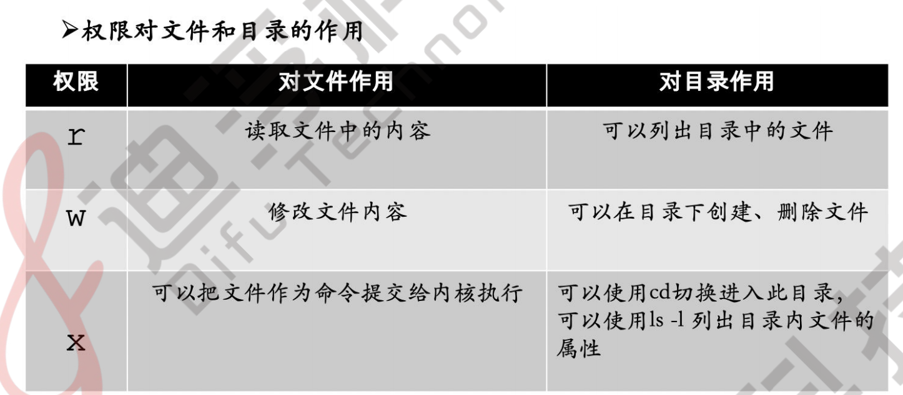

# 文件目录 
# Tab补全篇
shell Tab补全依赖包bash-completion-2.11-4.el9.noarch(最小安装没有)

```shell
[root@localhost ~]# rpm -qa | grep bash
bash-5.1.8-4.el9.x86_64
bash-completion-2.11-4.el9.noarch
```

# 转义字符"\"
## 分行(提高可读性)
```shell
mkdir test \
test2 \
test3 
```

## 创建一个有空格的文件夹
```shell
mkdir c\ d
```

# cd命令
```shell
[root@RHEL9 /]# cd var （改变目录位置至当前目录下的var子目录下）
[root@RHEL9 var]# cd .. （改变当前位置至当前目录的父目录）
[root@RHEL9 var]# cd . （切换到当前目前）
[root@RHEL9 /]# cd （改变目录位置至用户登录时的工作目录）
[root@RHEL9 ~]# cd ~ （改变目录位置至用户登录时的工作目录（用户的家目录）
[root@RHEL9 ~]# cd ../etc （改变目录位置至当前目录的父目录下的etc的子目录下）
[root@RHEL9 etc]# cd /var/www （利用绝对路径表示改变目录到 /var/www目录下）
[root@RHEL9 etc]# cd - （返回上一次切换前的目录，相当于撤销）
```

# ls命令
<font style="color:rgb(0,0,0);">ls</font><font style="color:rgb(0,0,0);">命令用来</font><font style="color:rgb(243,50,50);">列出文件或目录信息。 </font>

<font style="color:rgb(0,0,0);">用法：</font><font style="color:rgb(0,0,0);">ls [</font><font style="color:rgb(0,0,0);">参数</font><font style="color:rgb(0,0,0);">] </font><font style="color:rgb(0,0,0);">目录名或文件名 </font>

**<font style="color:rgb(0,0,0);">---</font>****<font style="color:rgb(0,0,0);">列出文件或目录信息</font>****<font style="color:rgb(0,0,0);">--- </font>**

```shell
[root@RHEL9 /]# ls 
afs boot etc lib media opt root sbin sys usr 
bin dev home lib64 mnt proc run srv tmp var 
```

**<font style="color:rgb(0,0,0);">---</font>****<font style="color:rgb(0,0,0);">显示所有文件</font>****<font style="color:rgb(0,0,0);">--- </font>****<font style="color:rgb(243,50,50);">-a</font>**<font style="color:rgb(0,0,0);">：显示所有内容，包括以</font><font style="color:rgb(0,0,0);">“</font>**<font style="color:rgb(243,50,50);">.</font>**<font style="color:rgb(0,0,0);">”</font><font style="color:rgb(0,0,0);">开头的隐藏文件。 </font>

```shell
[root@RHEL9 /]# ls -a 
. afs boot etc lib media opt root sbin sys usr 
.. bin dev home lib64 mnt proc run srv tmp var 
```

**<font style="color:rgb(0,0,0);">---</font>****<font style="color:rgb(0,0,0);">显示目录下所有的子目录及文件</font>****<font style="color:rgb(0,0,0);">--- </font>****<font style="color:rgb(243,50,50);">-A</font>**<font style="color:rgb(0,0,0);">：显示所有的内容，包括以</font><font style="color:rgb(0,0,0);">“</font>**<font style="color:rgb(243,50,50);">.</font>**<font style="color:rgb(0,0,0);">”</font><font style="color:rgb(0,0,0);">开头的隐藏文件。但不显 </font>

<font style="color:rgb(0,0,0);">示</font><font style="color:rgb(0,0,0);">“</font>**<font style="color:rgb(0,0,0);">.</font>**<font style="color:rgb(0,0,0);">”</font><font style="color:rgb(0,0,0);">和</font><font style="color:rgb(0,0,0);">“</font>**<font style="color:rgb(0,0,0);">..</font>**<font style="color:rgb(0,0,0);">”</font><font style="color:rgb(0,0,0);">。 </font>

```shell
[root@RHEL9 /]# ls -A 
.123 bin dev home lib64 mnt proc run srv tmp var 
afs boot etc lib media opt root sbin sys usr 
```

**<font style="color:rgb(243,50,50);">---</font>****<font style="color:rgb(243,50,50);">以长格式形式显示文件</font>****<font style="color:rgb(243,50,50);">--- </font>**

**<font style="color:rgb(243,50,50);">-l</font>**<font style="color:rgb(0,0,0);">：以长格式形式显示文件的详细信息。 </font>

```shell
[root@RHEL9 time]# ll 
total 0 
-rw-r--r--. 1 root root 0 May 12 23:52 00 
-rw-r--r--. 1 root root 0 May 12 23:51 01 
-rw-r--r--. 1 root root 0 May 12 23:52 02
```


<font style="color:rgb(0,0,0);">1.</font><font style="color:rgb(0,0,0);">文件类型 </font>

**<font style="color:rgb(243,50,50);">- </font>**<font style="color:rgb(0,0,0);">普通文件 </font>

**<font style="color:rgb(243,50,50);">d </font>**<font style="color:rgb(0,0,0);">目录 </font>

**<font style="color:rgb(243,50,50);">l </font>**<font style="color:rgb(0,0,0);">链接文件 </font>

<font style="color:rgb(0,0,0);">2.</font><font style="color:rgb(0,0,0);">权限位，三位一组，共三组，分别是文件的</font><font style="color:rgb(243,50,50);">属主</font><font style="color:rgb(0,0,0);">、</font><font style="color:rgb(243,50,50);">属组</font><font style="color:rgb(0,0,0);">、</font><font style="color:rgb(243,50,50);">others</font><font style="color:rgb(0,0,0);">的权限 </font>

**<font style="color:rgb(0,0,0);">r</font>**<font style="color:rgb(0,0,0);">：</font><font style="color:rgb(243,50,50);">读</font><font style="color:rgb(0,0,0);">权限 </font>**<font style="color:rgb(0,0,0);">w</font>**<font style="color:rgb(0,0,0);">：</font><font style="color:rgb(243,50,50);">写</font><font style="color:rgb(0,0,0);">权限 </font>**<font style="color:rgb(0,0,0);">x</font>**<font style="color:rgb(0,0,0);">：</font><font style="color:rgb(243,50,50);">执行</font><font style="color:rgb(0,0,0);">权限 </font>

<font style="color:rgb(0,0,0);">左三位：</font><font style="color:rgb(0,0,0);">owner</font><font style="color:rgb(0,0,0);">的权限（</font><font style="color:rgb(243,50,50);">属主</font><font style="color:rgb(0,0,0);">） </font>

<font style="color:rgb(0,0,0);">中三位：</font><font style="color:rgb(0,0,0);">group</font><font style="color:rgb(0,0,0);">的权限（</font><font style="color:rgb(243,50,50);">属组</font><font style="color:rgb(0,0,0);">） </font>

<font style="color:rgb(0,0,0);">右三位：其他人的权限（</font><font style="color:rgb(243,50,50);">others</font><font style="color:rgb(0,0,0);">）</font><font style="color:rgb(0,0,0);">3.</font><font style="color:rgb(0,0,0);">文件硬链接次数 </font>

<font style="color:rgb(0,0,0);">4.</font><font style="color:rgb(0,0,0);">属主：属于的用户 </font>

<font style="color:rgb(0,0,0);">5.</font><font style="color:rgb(0,0,0);">属组：属于的组 </font>

<font style="color:rgb(0,0,0);">6.</font><font style="color:rgb(0,0,0);">文件或目录大小 </font>

<font style="color:rgb(0,0,0);">7.</font><font style="color:rgb(0,0,0);">最后一次被修改的时间 </font>

<font style="color:rgb(0,0,0);">8.文件或目录名</font>

**<font style="color:rgb(0,0,0);">--</font>****<font style="color:rgb(0,0,0);">以</font>****<font style="color:rgb(0,0,0);">K</font>****<font style="color:rgb(0,0,0);">，</font>****<font style="color:rgb(0,0,0);">M</font>****<font style="color:rgb(0,0,0);">，</font>****<font style="color:rgb(0,0,0);">G</font>****<font style="color:rgb(0,0,0);">单位显示文件大小</font>****<font style="color:rgb(0,0,0);">--- </font>**

**<font style="color:rgb(243,50,50);">-h</font>**<font style="color:rgb(0,0,0);">：以</font><font style="color:rgb(0,0,0);">K</font><font style="color:rgb(0,0,0);">，</font><font style="color:rgb(0,0,0);">M</font><font style="color:rgb(0,0,0);">，</font><font style="color:rgb(0,0,0);">G</font><font style="color:rgb(0,0,0);">单位显示文件大小 </font>

```shell
[root@RHEL9 time]# ll -h 
total 84K 
-rw-r--r--. 1 root root 28K May 14 13:08 1.txt 
-rw-r--r--. 1 root root 55K May 14 13:13 2.txt
```

**<font style="color:rgb(0,0,0);">---</font>****<font style="color:rgb(0,0,0);">仅显示目录名称</font>****<font style="color:rgb(0,0,0);">--- </font>**

**<font style="color:rgb(243,50,50);">-d</font>**<font style="color:rgb(0,0,0);">：如果目标是目录，则只显示其目录名称。 </font>

<font style="color:rgb(0,0,0);">而不是显示其下的各个文件，与</font><font style="color:rgb(243,50,50);">-l</font><font style="color:rgb(0,0,0);">搭配使用可以得到详细的目录信息。 </font>

```shell
[root@RHEL9 /]# ls -d /root 
/root 
```

**<font style="color:rgb(0,0,0);">---</font>****<font style="color:rgb(0,0,0);">按文件的修改时间排序</font>****<font style="color:rgb(0,0,0);">--- </font>**

**<font style="color:rgb(243,50,50);">-c</font>**<font style="color:rgb(0,0,0);">：按文件的修改时间排序。 </font>

```shell
[root@RHEL9 time]# ls 
00 01 02 
[root@RHEL9 time]# ls -c 
00 02 01
```

# file命令
```shell
echo "liyedong" > test.txt
mv test.txt test.png
file test.png
```

**<font style="color:rgb(0,0,0);">---</font>****<font style="color:rgb(0,0,0);">查看文件类型</font>****<font style="color:rgb(0,0,0);">--- </font>**

<font style="color:rgb(0,0,0);">file</font><font style="color:rgb(0,0,0);">命令查看文件类型 </font>

```shell
[root@RHEL9 time]# file 1.txt 
1.txt: ASCII text, with very long lines 
[root@RHEL9 time]# file difu 
difu: directory
```

# “ > ”指令 与“ >> ”指令 
**<font style="color:rgb(243,50,50);">> </font>**<font style="color:rgb(0,0,0);">： 输出重定向（覆盖重定向） </font>

**<font style="color:rgb(243,50,50);">>> </font>**<font style="color:rgb(0,0,0);">： 追加重定向（写入重定向）</font>

# <font style="color:rgb(0,0,0);">cat命令</font>
<font style="color:rgb(0,0,0);">cat</font><font style="color:rgb(0,0,0);">命令主要用于</font><font style="color:rgb(243,50,50);">滚屏显示文件内容</font><font style="color:rgb(0,0,0);">或是</font><font style="color:rgb(243,50,50);">将多个文件合并成一个文件</font><font style="color:rgb(0,0,0);">。 </font>

<font style="color:rgb(0,0,0);">用法：cat [参数] 文件名</font>

**<font style="color:rgb(0,0,0);">---cat</font>****<font style="color:rgb(0,0,0);">命令滚屏显示文件内容</font>****<font style="color:rgb(0,0,0);">--- </font>**

<font style="color:rgb(0,0,0);">cat</font><font style="color:rgb(0,0,0);">命令的常用参数选项如下： </font>**<font style="color:rgb(243,50,50);">-b</font>**<font style="color:rgb(0,0,0);">：对输出内容中的</font><font style="color:rgb(243,50,50);">非空行</font><font style="color:rgb(0,0,0);">标注行号。 </font>

```shell
[root@RHEL9 /]# cat -b cat.txt 
```

_<font style="color:rgb(0,0,0);">1 -b：对输出内容中的非空行标注行号</font>_

_<font style="color:rgb(0,0,0);">2 -n</font>__<font style="color:rgb(0,0,0);">：对输出内容中的所有行标注行号。 </font>_

**<font style="color:rgb(243,50,50);">-n</font>**<font style="color:rgb(0,0,0);">：对输出内容中的</font><font style="color:rgb(243,50,50);">所有行</font><font style="color:rgb(0,0,0);">标注行号。 </font>

```shell
[root@RHEL9 /]# cat -n cat.txt 
1 -b：对输出内容中的非空行标注行号。 
2 
3 
4 -n：对输出内容中的所有行标注行号。
```

<font style="color:rgb(0,0,0);">通常使用cat命令查看文件内容，但是</font><font style="color:rgb(243,50,50);">cat命令</font><font style="color:rgb(0,0,0);">的输出内容</font><font style="color:rgb(243,50,50);">不能分页显示</font><font style="color:rgb(0,0,0);">。（要查看超过一屏的文 件内容，需要用到</font><font style="color:rgb(243,50,50);">more</font><font style="color:rgb(0,0,0);">或</font><font style="color:rgb(243,50,50);">less</font><font style="color:rgb(0,0,0);">等其他命令） </font>

<font style="color:rgb(0,0,0);">cat</font><font style="color:rgb(0,0,0);">命令中没有指定参数，则</font><font style="color:rgb(0,0,0);">cat</font><font style="color:rgb(0,0,0);">会直接显示文件原本的内容 </font>

```shell
[root@RHEL9 /]# cat /var/www/html/index.html 
（查看/var/www/html目录下的index.html文件 内容） 
```

<font style="color:rgb(0,0,0);">Test</font>

**<font style="color:rgb(0,0,0);">---cat</font>****<font style="color:rgb(0,0,0);">命令将多个文件文件合并成一个文件</font>****<font style="color:rgb(0,0,0);">--- </font>**

<font style="color:rgb(0,0,0);">利用</font><font style="color:rgb(0,0,0);">cat</font><font style="color:rgb(0,0,0);">命令还可以</font><font style="color:rgb(243,50,50);">合并多个文件</font><font style="color:rgb(0,0,0);">。 </font>

```shell
[root@RHEL9/]# cat file1
123
[root@RHEL9 /]# cat file2
456
[root@RHEL9 /]# cat file3 （file3已经存在，且原文件内容为 789）
789
[root@RHEL9 /]# cat file2 file1 > file3 （此命令会覆盖file3原文件内容）
[root@RHEL9 /]# cat file3
456
123
cat file2 file1 > file3 命令会把file2和file1文件的内容合并为file3。
file2文件的内容在file1文件的内容前面（按顺序位置决定），且此命令会覆盖掉file3原文件
内容。
[root@RHEL9 /]# cat file1
123
[root@RHEL9 /]# cat file2
456
[root@RHEL9 /]# cat file3 （file3已经存在，且原文件内容为 789）
789
[root@RHEL9 /]# cat file2 file1 >> file3 （此命令会将file2和file3文件的内容附加到file3
的后面）
[root@RHEL9 /]# cat file3
789
456
123
cat file2 file1>>file3 
命令会把file2和file1的文件内容附加到file3文件原有内容的后面
```

# more命令
<font style="color:rgb(0,0,0);">可以一页一页地</font><font style="color:rgb(243,50,50);">分屏显示文件的内容</font><font style="color:rgb(0,0,0);">。</font><font style="color:rgb(0,0,0);">more</font><font style="color:rgb(0,0,0);">命令通常用于分屏显示文件内容。 </font>

<font style="color:rgb(0,0,0);">执行</font><font style="color:rgb(0,0,0);">more</font><font style="color:rgb(0,0,0);">命令后，进入</font><font style="color:rgb(0,0,0);">more</font><font style="color:rgb(0,0,0);">状态。 </font>

<font style="color:rgb(0,0,0);">按</font><font style="color:rgb(0,0,0);">“</font><font style="color:rgb(243,50,50);">Enter</font><font style="color:rgb(0,0,0);">”</font><font style="color:rgb(0,0,0);">键可以</font><font style="color:rgb(243,50,50);">向下移动一行</font><font style="color:rgb(0,0,0);">。 </font>

<font style="color:rgb(0,0,0);">按</font><font style="color:rgb(0,0,0);">“</font><font style="color:rgb(243,50,50);">Space</font><font style="color:rgb(0,0,0);">”</font><font style="color:rgb(0,0,0);">键可以</font><font style="color:rgb(243,50,50);">向下移动一页</font><font style="color:rgb(0,0,0);">。 </font>

<font style="color:rgb(0,0,0);">按</font><font style="color:rgb(0,0,0);">“</font><font style="color:rgb(243,50,50);">Q</font><font style="color:rgb(0,0,0);">”</font><font style="color:rgb(0,0,0);">键可以</font><font style="color:rgb(243,50,50);">退出</font><font style="color:rgb(243,50,50);">more</font><font style="color:rgb(243,50,50);">命令</font><font style="color:rgb(0,0,0);">。 </font>

<font style="color:rgb(0,0,0);">用法：</font><font style="color:rgb(0,0,0);">more [</font><font style="color:rgb(0,0,0);">参数</font><font style="color:rgb(0,0,0);">] </font><font style="color:rgb(0,0,0);">文件名 </font>

**<font style="color:rgb(0,0,0);">---</font>****<font style="color:rgb(0,0,0);">指定分页显示时每页的行数</font>****<font style="color:rgb(0,0,0);">--- </font>**

**<font style="color:rgb(243,50,50);">-</font>**<font style="color:rgb(243,50,50);">num</font><font style="color:rgb(0,0,0);">：</font><font style="color:rgb(243,50,50);">num</font><font style="color:rgb(243,50,50);">代表的是数字</font><font style="color:rgb(0,0,0);">，用来指定分页显示时</font><font style="color:rgb(243,50,50);">每页的行数</font><font style="color:rgb(0,0,0);">。 </font>

```shell
[root@RHEL9 /]# cat test （原文件内容）
1
2
3
4
5
6
[root@RHEL9 /]# more -2 test （以每页2行显示文件内容）
1
2
--More--(33%) （已经显示文件内容的占比，6行文件以2行每页显示，第一页占比33%）
```

**<font style="color:rgb(0,0,0);">---</font>****<font style="color:rgb(0,0,0);">指定从文件的第</font>****<font style="color:rgb(0,0,0);">num</font>****<font style="color:rgb(0,0,0);">行开始显示</font>****<font style="color:rgb(0,0,0);">--- </font>**

**<font style="color:rgb(243,50,50);">+</font>**<font style="color:rgb(243,50,50);">num</font><font style="color:rgb(0,0,0);">：</font><font style="color:rgb(0,0,0);">num</font><font style="color:rgb(0,0,0);">代表的是数字，用来指定</font><font style="color:rgb(243,50,50);">从指定文件的第</font><font style="color:rgb(243,50,50);">num</font><font style="color:rgb(243,50,50);">行开始显示。 </font>

```shell
[root@RHEL9 /]# cat test （原文件内容） 
1 
2 
3 
4 
[root@RHEL9 /]# more +3 test （从第三行开始显示文件内容） 
3 
4 
```

# less命令
<font style="color:rgb(0,0,0);">less</font><font style="color:rgb(0,0,0);">命令是</font><font style="color:rgb(0,0,0);">more</font><font style="color:rgb(0,0,0);">命令的改进版，比</font><font style="color:rgb(0,0,0);">more</font><font style="color:rgb(0,0,0);">命令的功能强大。 </font>

<font style="color:rgb(0,0,0);">less</font><font style="color:rgb(0,0,0);">命令可以向下、向上翻页，甚至可以前后左右移动。执行</font><font style="color:rgb(0,0,0);">less</font><font style="color:rgb(0,0,0);">命令后，进入了</font><font style="color:rgb(0,0,0);">less</font><font style="color:rgb(0,0,0);">状态。 </font>

<font style="color:rgb(0,0,0);">按</font><font style="color:rgb(0,0,0);">“</font><font style="color:rgb(243,50,50);">Enter</font><font style="color:rgb(0,0,0);">”</font><font style="color:rgb(0,0,0);">键可以</font><font style="color:rgb(243,50,50);">向下移动一行 </font>

<font style="color:rgb(0,0,0);">按</font><font style="color:rgb(0,0,0);">“</font><font style="color:rgb(243,50,50);">Space</font><font style="color:rgb(0,0,0);">”</font><font style="color:rgb(0,0,0);">键可以</font><font style="color:rgb(243,50,50);">向下移动一页 </font>

<font style="color:rgb(0,0,0);">按</font><font style="color:rgb(0,0,0);">“</font><font style="color:rgb(243,50,50);">B</font><font style="color:rgb(0,0,0);">”</font><font style="color:rgb(0,0,0);">键可以</font><font style="color:rgb(243,50,50);">向上移动一页</font><font style="color:rgb(0,0,0);">，也可以用光标键向前、后、左、右移动。 </font>

<font style="color:rgb(0,0,0);">按</font><font style="color:rgb(0,0,0);">“</font><font style="color:rgb(243,50,50);">Q</font><font style="color:rgb(0,0,0);">”</font><font style="color:rgb(0,0,0);">键可以</font><font style="color:rgb(243,50,50);">退出</font><font style="color:rgb(243,50,50);">less</font><font style="color:rgb(243,50,50);">命令</font><font style="color:rgb(0,0,0);">。 </font>

<font style="color:rgb(0,0,0);">less</font><font style="color:rgb(0,0,0);">命令支持在文本文件中快速查找 </font>

```shell
[root@RHEL9 /]# less file1 
1 
2 
3 
4 
/3 （直接按下 / 键盘，进入快速查找模式，类似于Windows系统的Ctrl+F。输入查找的关键 
字，回车查找） 
```

<font style="color:rgb(0,0,0);">less命令的用法与more命令基本相同</font>

# <font style="color:rgb(0,0,0);">head命令</font>
<font style="color:rgb(0,0,0);">head</font><font style="color:rgb(0,0,0);">命令用于显示文件的</font><font style="color:rgb(243,50,50);">开头</font><font style="color:rgb(0,0,0);">部分，</font><font style="color:rgb(243,50,50);">默认情况</font><font style="color:rgb(0,0,0);">下只显示文件的</font><font style="color:rgb(243,50,50);">前</font><font style="color:rgb(243,50,50);">10</font><font style="color:rgb(243,50,50);">行内容</font><font style="color:rgb(0,0,0);">。 </font>

<font style="color:rgb(0,0,0);">用法：</font><font style="color:rgb(0,0,0);">head [</font><font style="color:rgb(0,0,0);">参数</font><font style="color:rgb(0,0,0);">] </font><font style="color:rgb(0,0,0);">文件名 </font>

**<font style="color:rgb(0,0,0);">---</font>****<font style="color:rgb(0,0,0);">显示指定文件的前</font>****<font style="color:rgb(0,0,0);">num</font>****<font style="color:rgb(0,0,0);">行</font>****<font style="color:rgb(0,0,0);">--- </font>**

**<font style="color:rgb(243,50,50);">-n</font>**<font style="color:rgb(243,50,50);"> num</font><font style="color:rgb(0,0,0);">：显示指定文件的</font><font style="color:rgb(243,50,50);">前</font><font style="color:rgb(243,50,50);">num</font><font style="color:rgb(243,50,50);">行 </font>

```shell
[root@RHEL9 /]# head file1 （head不加参数显示原文件前十行内容） 
123 
456 
789 
012 
[root@RHEL9 /]# head -n 3 file1 （-n 3 只显示文件的前3行内容） 
123 
456 
789 
```

**<font style="color:rgb(0,0,0);">---</font>****<font style="color:rgb(0,0,0);">显示指定文件的前</font>****<font style="color:rgb(0,0,0);">num</font>****<font style="color:rgb(0,0,0);">个字符</font>****<font style="color:rgb(0,0,0);">--- </font>**

**<font style="color:rgb(243,50,50);">-c </font>**<font style="color:rgb(243,50,50);">num</font><font style="color:rgb(0,0,0);">：显示指定文件的</font><font style="color:rgb(243,50,50);">前</font><font style="color:rgb(243,50,50);">num</font><font style="color:rgb(243,50,50);">个字符 </font>

```shell
[root@RHEL9 /]# head file2 （head不加参数显示文件前十行内容） 
123456 
[root@RHEL9 /]# head -c 5 file2 （-c 5 只显示文件的前5个字符内容） 
12345 
```

# **tail命令 **
<font style="color:rgb(0,0,0);">tail</font><font style="color:rgb(0,0,0);">命令用于显示文件的</font><font style="color:rgb(243,50,50);">末尾</font><font style="color:rgb(0,0,0);">部分，</font><font style="color:rgb(243,50,50);">默认情况</font><font style="color:rgb(0,0,0);">下只显示文件的</font><font style="color:rgb(243,50,50);">末尾</font><font style="color:rgb(243,50,50);">10</font><font style="color:rgb(243,50,50);">行内容</font><font style="color:rgb(0,0,0);">。 </font>

<font style="color:rgb(0,0,0);">用法：</font><font style="color:rgb(0,0,0);">tail [</font><font style="color:rgb(0,0,0);">参数</font><font style="color:rgb(0,0,0);">] </font><font style="color:rgb(0,0,0);">文件名 </font>

**<font style="color:rgb(0,0,0);">---</font>****<font style="color:rgb(0,0,0);">显示指定文件的末尾</font>****<font style="color:rgb(0,0,0);">num</font>****<font style="color:rgb(0,0,0);">行</font>****<font style="color:rgb(0,0,0);">--- </font>**

**<font style="color:rgb(0,145,255);">-n </font>**<font style="color:rgb(243,50,50);">num</font><font style="color:rgb(0,0,0);">：显示指定文件的末尾</font><font style="color:rgb(0,0,0);">num</font><font style="color:rgb(0,0,0);">行 </font>

```shell
[root@RHEL9 /]# tail -n 2 file1 
```

_<font style="color:rgb(0,0,0);">4 </font>_

_<font style="color:rgb(0,0,0);">5 </font>_

**<font style="color:rgb(0,0,0);">---</font>****<font style="color:rgb(0,0,0);">持续刷新文件内容</font>****<font style="color:rgb(0,0,0);">--- </font>**

**<font style="color:rgb(243,50,50);">-f </font>**<font style="color:rgb(0,0,0);">：持续刷新文件内容。 </font>

```shell
[root@RHEL9 /]# tail -f /var/log/cron 
...... 
Jan 23 00:23:01 ansible CROND[4710]: (root) CMD (logger "EX200 in progress") 
Jan 23 00:24:01 ansible CROND[4743]: (root) CMD (logger "EX200 in progress")
```

# mkdir命令
<font style="color:rgb(0,0,0);">mkdir</font><font style="color:rgb(0,0,0);">命令用于创建一个目录。 </font>

<font style="color:rgb(0,0,0);">用法：</font><font style="color:rgb(0,0,0);">mkdir [</font><font style="color:rgb(0,0,0);">参数</font><font style="color:rgb(0,0,0);">] </font><font style="color:rgb(0,0,0);">目录名 </font>

**<font style="color:rgb(0,0,0);">---</font>****<font style="color:rgb(0,0,0);">创建目录</font>****<font style="color:rgb(0,0,0);">--- </font>**

<font style="color:rgb(0,0,0);">mkdir</font><font style="color:rgb(0,0,0);">命令用于创建一个目录。 </font>

```shell
[root@RHEL9 /]# ls -d dir1/ 
dir1/ 
```

**<font style="color:rgb(0,0,0);">---</font>****<font style="color:rgb(0,0,0);">递归创建目录</font>****<font style="color:rgb(0,0,0);">--- </font>**

**<font style="color:rgb(243,50,50);">-p</font>**<font style="color:rgb(0,0,0);">：创建目录时，若父目录不存在，则同 时创建该目录与该目录的父目录。 </font>

```shell
[root@RHEL9 /]# mkdir -p /D1/D2/D3/D4 
[root@RHEL9 /]# tree /D1 
/D1 
└── D2 
└── D3 
└── D4 
```

# rmdir命令
<font style="color:rgb(0,0,0);">rmdir</font><font style="color:rgb(0,0,0);">命令用于删除空目录 </font>

<font style="color:rgb(0,0,0);">用法：</font><font style="color:rgb(0,0,0);">rmdir [</font><font style="color:rgb(0,0,0);">参数</font><font style="color:rgb(0,0,0);">] </font><font style="color:rgb(0,0,0);">目录名 </font>

**<font style="color:rgb(0,0,0);">---</font>****<font style="color:rgb(0,0,0);">删除空目录</font>****<font style="color:rgb(0,0,0);">--- </font>**

```shell
[root@RHEL9 /]# rmdir D1 
rmdir: failed to remove 'D1': Directory not empty 
[root@RHEL9 /]# rmdir D1/D2/D3/D4/ 
[root@RHEL9 /]# tree D1/ 
D1/ 
└── D2 
└── D3 
```

**<font style="color:rgb(0,0,0);">---</font>****<font style="color:rgb(0,0,0);">递归删除目录</font>****<font style="color:rgb(0,0,0);">--- </font>**

**<font style="color:rgb(243,50,50);">-p</font>**<font style="color:rgb(0,0,0);">：删除目录时，一同删除目录，但是父目录中除了要删除的目录之外必须已经没有其他目录及文 件。 </font>

```shell
[root@RHEL9 /]# tree D1 
D1 
└── D1.11 directory, 0 files 
[root@RHEL9 /]# rmdir -p D1/D1.1/ 
[root@RHEL9 /]# ls -d D1 
ls: cannot access 'D1': No such file or directory
```

# cp命令
<font style="color:rgb(0,0,0);">cp</font><font style="color:rgb(0,0,0);">命令主要用于文件或者目录的复制。 </font>

<font style="color:rgb(0,0,0);">用法：cp [选项] 源文件 目标文件</font>


**<font style="color:rgb(0,0,0);">---</font>****<font style="color:rgb(0,0,0);">递归复制目录</font>****<font style="color:rgb(0,0,0);">--- </font>**

**<font style="color:rgb(243,50,50);">-r</font>**<font style="color:rgb(0,0,0);">：递归复制目录（将目录下所有内容一起复制） </font>

```shell
[root@RHEL9 ~]# cp /var/www / 
cp: -r not specified; omitting directory '/var/www' 
[root@RHEL9 ~]# cp -r /var/www / 
[root@RHEL9 ~]# ls -d /www 
/www
```

**<font style="color:rgb(0,0,0);">---</font>****<font style="color:rgb(0,0,0);">保留源文件的相关属性</font>****<font style="color:rgb(0,0,0);">--- </font>**

**<font style="color:rgb(243,50,50);">-p</font>**<font style="color:rgb(0,0,0);">：保留源文件的相关属性 </font>

```shell
[root@RHEL9 ansible]# ll 
total 0 
-rw-rw-r--. 1 ansible ansible 0 Jan 31 12:30 file 
[root@RHEL9 ansible]# cp file / 
[root@RHEL9 ansible]# ll /file 
-rw-r--r--. 1 root root 0 Jan 31 12:32 /file 
[root@RHEL9 ansible]# cp -p file / 
cp: overwrite '/file'? y 
[root@RHEL9 ansible]# ll /file 
-rw-rw-r--. 1 ansible ansible 0 Jan 31 12:30 /file 
```

**<font style="color:rgb(243,50,50);">-a</font>**<font style="color:rgb(0,0,0);">：等同于同时使用以上选项</font>

# <font style="color:rgb(0,0,0);">mv命令</font>
<font style="color:rgb(0,0,0);">mv</font><font style="color:rgb(0,0,0);">命令主要用于文件或者目录的</font><font style="color:rgb(243,50,50);">移动</font><font style="color:rgb(0,0,0);">或</font><font style="color:rgb(243,50,50);">改名 </font>

<font style="color:rgb(0,0,0);">用法：mv [参数] 源文件或目录 目标文件或目录</font>

<font style="color:rgb(0,0,0);"># mv 源文件 目标 </font>


**<font style="color:rgb(0,0,0);">---</font>****<font style="color:rgb(0,0,0);">目标文件或目录存在，提示是否覆盖</font>****<font style="color:rgb(0,0,0);">--- </font>**

**<font style="color:rgb(243,50,50);">-i</font>**<font style="color:rgb(0,0,0);">：如果目标文件或者目录存在，则提示是否覆盖目标文件或者目录 </font>

```shell
[root@RHEL9 time]# mv 1.txt / 
mv: overwrite '/1.txt'? y 
[root@RHEL9 time]# mv -i 1.txt / 
mv: overwrite '/1.txt'? y
```

**<font style="color:rgb(0,0,0);">---强制移动或者覆盖---</font>**

**<font style="color:rgb(243,50,50);">-f</font>**<font style="color:rgb(0,0,0);">：无论目标文件或者目录是否存在，直接覆盖目标文件或者目录。 </font>

```shell
[root@RHEL9 time]# mv -f 1.txt / 
[root@RHEL9 time] 
```

**<font style="color:rgb(0,0,0);">---</font>****<font style="color:rgb(0,0,0);">同时移动多个目录</font>****<font style="color:rgb(0,0,0);">--- </font>**

**<font style="color:rgb(243,50,50);">-t</font>**<font style="color:rgb(0,0,0);">：将多个目录</font><font style="color:rgb(0,0,0);">mv</font><font style="color:rgb(0,0,0);">到一个目录中 </font>

```shell
[root@RHEL9 time]# mv D1 D2 D3 -t / 
[root@RHEL9 time]# ls -d /D* 
/D1 /D2 /D3 
```

<font style="color:rgb(243,50,50);">注意：参数 </font>**<font style="color:rgb(243,50,50);">-t </font>**<font style="color:rgb(243,50,50);">后面必须要紧跟</font><font style="color:rgb(243,50,50);">mv</font><font style="color:rgb(243,50,50);">之后的目标目录 </font>

<font style="color:rgb(0,0,0);">第二种写法： </font>

```shell
[root@RHEL9 time]# mv -t / D1 D2 D3 
[root@RHEL9 time]# ls -d /D*
/D1 /D2 /D3
```

# rm命令
<font style="color:rgb(0,0,0);">rm</font><font style="color:rgb(0,0,0);">命令主要用于删除文件或者目录 </font>

<font style="color:rgb(0,0,0);">用法：rm [参数] 文件或目录名 rm -rf /</font>


**<font style="color:rgb(0,0,0);">---</font>****<font style="color:rgb(0,0,0);">递归删除</font>****<font style="color:rgb(0,0,0);">--- </font>**

**<font style="color:rgb(243,50,50);">-r</font>**<font style="color:rgb(0,0,0);">：递归删除目录与目录中的所有文件 </font>

```shell
[root@RHEL9 time]# rm -r A 
rm: descend into directory 'A'? y 
rm: descend into directory 'A/B'? y 
rm: remove directory 'A/B/C'? y 
rm: remove regular empty file 'A/B/fileC'? y 
rm: remove directory 'A/B'? y 
rm: remove regular empty file 'A/fileB'? y 
rm: remove directory 'A'? y 
[root@RHEL9 time]#
```

**<font style="color:rgb(0,0,0);">---</font>****<font style="color:rgb(0,0,0);">强制删除</font>****<font style="color:rgb(0,0,0);">--- </font>**

**<font style="color:rgb(243,50,50);">-f</font>**<font style="color:rgb(0,0,0);">：强制删除且不提示 </font>

```shell
[root@RHEL9 time]# rm -f 2.txt 
[root@RHEL9 time]# 
```

# touch命令
<font style="color:rgb(0,0,0);">touch</font><font style="color:rgb(0,0,0);">命令用于建立文件 </font>

<font style="color:rgb(0,0,0);">用法：touch [参数] 文件或目录名</font>

**<font style="color:rgb(0,0,0);">---</font>****<font style="color:rgb(0,0,0);">创建文件</font>****<font style="color:rgb(0,0,0);">--- </font>**

```shell
[root@RHEL9 time]# touch file 
[root@RHEL9 time]# ll file 
-rw-r--r--. 1 root root 0 Jan 31 17:18 file 
```

**<font style="color:rgb(0,0,0);">---刷新时间--- </font>**

**<font style="color:rgb(243,50,50);">-m</font>**<font style="color:rgb(0,0,0);">：仅把文件或目录的存取时间改为当前时间 </font>

```shell
[root@RHEL9 time]# ll 
total 0 
drwxr-xr-x. 2 root root 18 Jan 31 17:19 difu 
[root@RHEL9 time]# touch -m difu/ 
[root@RHEL9 time]# ll 
total 0 
drwxr-xr-x. 2 root root 18 Jan 31 17:20 difu
```

# find命令
**<font style="color:rgb(0,0,0);">find</font>****<font style="color:rgb(0,0,0);">命令用于文件查找 </font>**

<font style="color:rgb(0,0,0);">用法：find [路径] [匹配表达式]</font>


**<font style="color:rgb(0,0,0);">---</font>****<font style="color:rgb(0,0,0);">查找指定文件</font>****<font style="color:rgb(0,0,0);">--- </font>**

**<font style="color:rgb(243,50,50);">-name </font>****<font style="color:rgb(243,50,50);">文件名</font>**<font style="color:rgb(0,0,0);">：查找指定的文件名称 </font>

```shell
[root@RHEL9 time]# ls 
ABC difu file 
[root@RHEL9 time]# find / -name ABC 
/time/ABC 
```

**<font style="color:rgb(0,0,0);">---</font>****<font style="color:rgb(0,0,0);">查找属于指定用户文件</font>****<font style="color:rgb(0,0,0);">--- </font>**

**<font style="color:rgb(243,50,50);">-user </font>****<font style="color:rgb(243,50,50);">用户名</font>**<font style="color:rgb(0,0,0);">：查找属于指定用户的文件 </font>

```shell
[root@RHEL9 time]# ll
total 0 
-rw-r--r--. 1 RHEL RHEL 0 Jan 31 17:22 ABC 
drwxr-xr-x. 2 root root 18 Jan 31 17:22 difu 
-rw-r--r--. 1 root root 0 Jan 31 17:22 file 
[root@RHEL9 time]# find / -user RHEL 
...... 
/time/ABC 
......
```

**<font style="color:rgb(0,0,0);">---</font>****<font style="color:rgb(0,0,0);">查找属于指定组文件</font>****<font style="color:rgb(0,0,0);">--- </font>**

**<font style="color:rgb(243,50,50);">-group </font>****<font style="color:rgb(243,50,50);">组名</font>**<font style="color:rgb(0,0,0);">：查找属于指定组的文件 </font>

```shell
[root@RHEL9 time]# ll 
total 0 
-rw-r--r--. 1 RHEL RHEL 0 Jan 31 17:22 ABC 
drwxr-xr-x. 2 root root 18 Jan 31 17:22 difu 
-rw-r--r--. 1 root root 0 Jan 31 17:22 file 
[root@RHEL9 time]# find / -group RHEL 
...... 
/time/ABC 
...... 
```

**<font style="color:rgb(0,0,0);">---查找指定大小范围文件--- </font>**

**<font style="color:rgb(243,50,50);">-size +n / -n</font>**<font style="color:rgb(0,0,0);">：查找大于或者小于指定大小的文件 </font>

```shell
[root@RHEL9 time]# find / -size +500M 
...... 
/mnt/images/install.img 
[root@RHEL9 time]# ll -h /mnt/images/install.img 
-r--r--r--. 1 root root 583M Oct 9 2020 /mnt/images/install.img 
[root@RHEL9 time]# find / -size -5 
...... 
/1.txt 
[root@RHEL9 time]# ll -h /1.txt 
-rw-r--r--. 1 root root 0 Jan 11 17:38 /1.txt
```

# 通配符
<font style="color:rgb(0,0,0);">文件通配在</font><font style="color:rgb(0,0,0);">ls</font><font style="color:rgb(0,0,0);">，</font><font style="color:rgb(0,0,0);">cp</font><font style="color:rgb(0,0,0);">，</font><font style="color:rgb(0,0,0);">rm</font><font style="color:rgb(0,0,0);">等文件管理命令会经常用到 </font>

<font style="color:rgb(0,0,0);">使用通配符符来表示某一类文件</font>

| 通配符号 | 含义 |
| --- | --- |
| **<font style="color:rgb(243,50,50);">* </font>** | 表示任意长度的任意字符 |
| **<font style="color:rgb(243,50,50);">？</font>** | 表示单个任意字符 |
| **<font style="color:rgb(243,50,50);">[ ] </font>** | <font style="color:rgb(57,57,57);">表示集合范围内的任意单个字符[0-9]表示任意单个数字，[a-z]表示任意单个</font><font style="color:rgb(243,50,50);">小写</font><font style="color:rgb(57,57,57);">字母</font> |
| **<font style="color:rgb(243,50,50);">[^]</font>** | <font style="color:rgb(57,57,57);">表示不在集合范围内的单个字符 </font><br/><font style="color:rgb(57,57,57);">[^a-z]表示除小写字母以外的其他字符</font> |
| **<font style="color:rgb(243,50,50);">{ } </font>** | <font style="color:rgb(57,57,57);">展开{ }中的内容</font> |


例子

查找归simone所有的所有文件并将其副本放入/root/found目录


```shell
'[commond]'===$[commond]
mkdir -p /root/found
cp -a `find / -user simone` /root/found
或者
cp -a $(find / -user simone) /root/found
```

# **<font style="color:rgb(243,50,50);">tar文件归档打包工具</font>**
<font style="color:rgb(0,0,0);">将多个文件或者目录打包成一个文件 </font>

<font style="color:rgb(0,0,0);">用法：tar [选项] 归档后的文件 被归档的文件</font>


**<font style="color:rgb(0,0,0);">---创建归档文件---</font>**

```shell
[root@RHEL9 time]# tar -cf file.tar file1 file2 file3
[root@RHEL9 time]# ls
file1 file2 file3 file.tar tar
```

**<font style="color:rgb(0,0,0);">---提取归档文件---</font>**

```shell
[root@RHEL9 time]# tar -xvf file.tar -C tar/
file1
file2
file3
[root@RHEL9 time]# tree tar/
tar/
├── file1
├── file2
└── file3
0 directories, 3 files
```

**<font style="color:rgb(243,50,50);">归档并压缩</font>**

<font style="color:rgb(0,0,0);">tar </font><font style="color:rgb(0,0,0);">本身不具备压缩功能，可以通过调用其它压缩工具进行压缩 </font>

<font style="color:rgb(0,0,0);">用法：tar [选项] 压缩文件 源文件</font>

<font style="color:rgb(0,0,0);">linux</font><font style="color:rgb(0,0,0);">下常用的压缩工具：</font><font style="color:rgb(0,0,0);">gzip bzip2 </font>

<font style="color:rgb(0,0,0);">创建的归档名称可以自定义，可通过</font><font style="color:rgb(243,50,50);">file命令</font><font style="color:rgb(0,0,0);">查看归档类型。</font>


**<font style="color:rgb(0,0,0);">---</font>****<font style="color:rgb(0,0,0);">创建与提取</font>****<font style="color:rgb(0,0,0);">gzip</font>****<font style="color:rgb(0,0,0);">压缩格式</font>****<font style="color:rgb(0,0,0);">--- </font>**

**<font style="color:rgb(243,50,50);">-z(</font>****<font style="color:rgb(243,50,50);">小写</font>****<font style="color:rgb(243,50,50);">)</font>**<font style="color:rgb(0,0,0);">：使用</font><font style="color:rgb(0,0,0);">gzip</font><font style="color:rgb(0,0,0);">压缩 </font>

```shell
[root@RHEL9 time]# tar -czvf file.tar.gzip file1 file2 file3 
file1 
file2 
file3 
[root@RHEL9 time]# ls 
file1 file2 file3 file.tar.gzip 
-x：提取gzip压缩文件 
[root@RHEL9 time]# ls 
file.tar.gzip 
[root@RHEL9 time]# tar -xzvf file.tar.gzip 
file1 
file2 
file3 
[root@RHEL9 time]# ls 
file1 file2 file3 file.tar.gzip
```

**<font style="color:rgb(0,0,0);">---创建与提取bzip2压缩格式--- </font>**

**<font style="color:rgb(243,50,50);">-j(小写)</font>**<font style="color:rgb(0,0,0);">：使用bzip2压缩 </font>

```shell
[root@RHEL9 time]# tar -cjvf file.tar.bzip2 file1 file2 file3 
file1 
file2 
file3 
[root@RHEL9 time]# ls
file1 file2 file3 file.tar.bzip2
```

**<font style="color:rgb(243,50,50);">-x</font>**<font style="color:rgb(0,0,0);">：提取bzip2压缩文件</font>

```shell
[root@RHEL9 time]# ls
file.tar.bzip2
[root@RHEL9 time]# tar -xjvf file.tar.bzip2
file1
file2
file3
[root@RHEL9 time]# ls
file1 file2 file3 file.tar.bzip2
```

**<font style="color:rgb(0,0,0);">---</font>****<font style="color:rgb(0,0,0);">创建与提取</font>****<font style="color:rgb(0,0,0);">xz</font>****<font style="color:rgb(0,0,0);">压缩格式</font>****<font style="color:rgb(0,0,0);">--- </font>**

**<font style="color:rgb(243,50,50);">-J</font>****<font style="color:rgb(243,50,50);">（大写）</font>**<font style="color:rgb(0,0,0);">：使用</font><font style="color:rgb(0,0,0);">xz</font><font style="color:rgb(0,0,0);">压缩 </font>

```shell
[root@RHEL9 time]# tar -cJvf file.tar.xz file1 file2 file3 
file1 
file2 
file3 
[root@RHEL9 time]# ls 
file1 file2 file3 file.tar.xz 
```

**<font style="color:rgb(243,50,50);">-x</font>**<font style="color:rgb(0,0,0);">：提取</font><font style="color:rgb(0,0,0);">xz</font><font style="color:rgb(0,0,0);">压缩文件 </font>

```shell
[root@RHEL9 time]# ls 
file.tar.xz 
[root@RHEL9 time]# tar -xJvf file.tar.xz 
file1 
file2 
file3 
[root@RHEL9 time]# ls 
file1 file2 file3 file.tar.xz
```

### **<font style="color:rgb(57,57,57);">总结：</font>**
<font style="color:rgb(223,64,42);">tar -czvf [</font><font style="color:rgb(223,64,42);">创建归档并</font><font style="color:rgb(223,64,42);">gzip</font><font style="color:rgb(223,64,42);">压缩</font><font style="color:rgb(223,64,42);">] </font>

<font style="color:rgb(223,64,42);">tar -xzvf [</font><font style="color:rgb(223,64,42);">提取</font><font style="color:rgb(223,64,42);">gzip</font><font style="color:rgb(223,64,42);">压缩的归档文件</font><font style="color:rgb(223,64,42);">] </font>

<font style="color:rgb(223,64,42);">tar -cjvf [</font><font style="color:rgb(223,64,42);">创建归档并使用</font><font style="color:rgb(223,64,42);">bzip2</font><font style="color:rgb(223,64,42);">压缩</font><font style="color:rgb(223,64,42);">] </font>

<font style="color:rgb(223,64,42);">tar -cJvf [</font><font style="color:rgb(223,64,42);">创建归档并使用</font><font style="color:rgb(223,64,42);">xz</font><font style="color:rgb(223,64,42);">压缩</font><font style="color:rgb(223,64,42);">] </font>

<font style="color:rgb(223,64,42);">gzip ==== z </font>

<font style="color:rgb(223,64,42);">bzip2 ==== j </font>

<font style="color:rgb(223,64,42);">xz ===== J </font>

<font style="color:rgb(223,64,42);">zip ====== zip</font>

```shell
[root@difu1909 ~]# tar -czvf /home/ahdifu/local.tar.gzip /home/myth/
```

<font style="color:rgb(0,0,0);">[归档后的目标路径] [文件源路径]</font>

**<font style="color:rgb(243,50,50);">其它一些常用的压缩文件工具</font>**

<font style="color:rgb(0,0,0);">zip工具</font>

**<font style="color:rgb(0,0,0);">---</font>****<font style="color:rgb(0,0,0);">创建与提取</font>****<font style="color:rgb(0,0,0);">zip</font>****<font style="color:rgb(0,0,0);">压缩格式</font>****<font style="color:rgb(0,0,0);">--- </font>**

**<font style="color:rgb(243,50,50);">zip</font>**<font style="color:rgb(0,0,0);">：使用</font><font style="color:rgb(0,0,0);">zip</font><font style="color:rgb(0,0,0);">压缩 </font>

```shell
[root@RHEL9 time]# zip file.zip file1 file2 file3 
adding: file1 (stored 0%) 
adding: file2 (stored 0%) 
adding: file3 (stored 0%) 
[root@RHEL9 time]# ls 
file1 file2 file3 file.zip 
```

**<font style="color:rgb(243,50,50);">unzip</font>**<font style="color:rgb(0,0,0);">：提取</font><font style="color:rgb(0,0,0);">zip</font><font style="color:rgb(0,0,0);">压缩文件 </font>

```shell
[root@RHEL9 time]# ls 
file.zip 
[root@RHEL9 time]# unzip file.zip 
Archive: file.zip 
extracting: file1 
extracting: file2 
extracting: file3 
[root@RHEL9 time]# ls 
file1 file2 file3 file.zip 
```

<font style="color:rgb(0,0,0);">一些命令的组合使用： </font>

```shell
ls -ld ==== ll -d 
echo ahdifu > 1.txt 
echo ahdifu >> 1.txt 
rm -rf /time/*.* 
rm -rf /time/* 
rm -rf /time/*.t?? 
a.txt bc.att cd..txt aaa.ttt
cp -a `find / -name *.txt` /time
find / -name *.txt -exec cp -a {} /time/ \;
-exec ：把查找到的内容交给exec后面的命令执行
```

# **<font style="color:rgb(0,0,0);">配置主机名 </font>**
```shell
# hostnamectl set-hostname HOST_NAME 
[root@ahdifu ~]# hostnamectl set-hostname Ahdifu 
exit 或者使用 exec bash退出再次登录shell 
[root@Ahdifu ~]#
```

# **<font style="color:rgb(0,0,0);">正确的关机方法</font>**
<font style="color:rgb(0,0,0);">重启主机：</font><font style="color:rgb(0,0,0);">reboot </font>

<font style="color:rgb(0,0,0);">其它一些关机命令：</font><font style="color:rgb(0,0,0);">halt</font><font style="color:rgb(0,0,0);">、</font><font style="color:rgb(0,0,0);">poweroff</font><font style="color:rgb(0,0,0);">、</font><font style="color:rgb(0,0,0);">shutdown </font>

<font style="color:rgb(0,0,0);">shutdown作用：关机，重启，定时关机 </font>

<font style="color:rgb(0,0,0);">语法：shutdown [选项]</font>


```shell
# shutdown -h +10 10分钟之后关机
# shutdown -h 23:30 指定具体的时间点进行关机
# shutdown -h now 立即关机
# shutdown -r now 立即重启
# shutdown -r +10 10 分钟以后重启
# shutdown -r 22:22 22:22 以后重启

init：服务等级，Linux中一共有7个等级，目前先了解常用的4个等级
init 0 关机
init 3 纯命令行模式
init 5 含有图形界面的模式
init 6 重启
```

# 用户管理
**<font style="color:rgb(0,0,0);">管理用户 </font>**

<font style="color:rgb(57,57,57);">useradd </font><font style="color:rgb(57,57,57);">， </font><font style="color:rgb(57,57,57);">userdel </font><font style="color:rgb(57,57,57);">， </font><font style="color:rgb(57,57,57);">usermod , passwd , id ,w,who, chage </font>

<font style="color:rgb(57,57,57);">添加用户：</font><font style="color:rgb(57,57,57);">useradd </font>

<font style="color:rgb(57,57,57);">1.useradd [</font><font style="color:rgb(57,57,57);">选项</font><font style="color:rgb(57,57,57);">] username </font>

<font style="color:rgb(57,57,57);">常见选项： </font>

<font style="color:rgb(223,64,42);">-u </font><font style="color:rgb(57,57,57);">指定 </font><font style="color:rgb(57,57,57);">UID </font>

<font style="color:rgb(223,64,42);">-g </font><font style="color:rgb(57,57,57);">指定基本组（组 ID/组名）</font>

<font style="color:rgb(223,64,42);">-G </font><font style="color:rgb(57,57,57);">指定附加组 （组 </font><font style="color:rgb(57,57,57);">ID/</font><font style="color:rgb(57,57,57);">组名） </font>

<font style="color:rgb(57,57,57);">-c </font><font style="color:rgb(57,57,57);">添加描述 </font>

<font style="color:rgb(57,57,57);">-d </font><font style="color:rgb(57,57,57);">指定用户家目录 </font>

<font style="color:rgb(223,64,42);">-s </font><font style="color:rgb(57,57,57);">指定默认登录 </font><font style="color:rgb(57,57,57);">shell </font>

<font style="color:rgb(57,57,57);">-e </font><font style="color:rgb(57,57,57);">指定账户过期日期</font><font style="color:rgb(57,57,57);">,</font><font style="color:rgb(57,57,57);">格式 </font><font style="color:rgb(57,57,57);">YY-MM-DD </font>

<font style="color:rgb(57,57,57);">-M </font><font style="color:rgb(57,57,57);">不创建家目录 </font>

<font style="color:rgb(57,57,57);">-r 添加为系统用户（不可以为纯数字）</font>

<font style="color:rgb(57,57,57);">用户家目录文件是由</font><font style="color:rgb(57,57,57);">/etc/skel </font><font style="color:rgb(57,57,57);">目录中复制而来 </font>

<font style="color:rgb(57,57,57);">新建用户默认属性变量文件：/etc/login.defs</font>

```shell
[root@df_rhel ~]# useradd yukang
[root@df_rhel ~]# cat /etc/passwd
yukang:x:1001:1001::/home/yukang:/bin/bash
[root@df_rhel ~]# id yukang
uid=1001(yukang) gid=1001(yukang) groups=1001(yukang)
创建一个用户名为 ansible 且 uid 为 2000：
[root@df_rhel ~]# useradd -u 2000 ansible
[root@df_rhel ~]# id ansible
uid=2000(ansible) gid=2000(ansible) groups=2000(ansible)
创建用户时候，会同时创建相同名字的用户组，默认只有基本组
[root@df_rhel ~]# useradd -u 1500 test01 -g difushare
[root@df_rhel ~]# id test01
uid=1500(test01) gid=2001(difushare) groups=2001(difushare)
[root@df_rhel ~]# useradd user01 -G difushare
[root@df_rhel ~]# id user01
uid=2001(user01) gid=2002(user01) groups=2002(user01),2001(difushare)
[root@df_rhel ~]# useradd -u 3000 -s /sbin/nologin -M web
[root@df_rhel ~]# id web
uid=3000(web) gid=3000(web) groups=3000(web)
[root@df_rhel ~]# cd /home/
[root@df_rhel ~]# su - web
su: warning: cannot change directory to /home/web: No such file or directory
This account is currently not available. 
[root@Myth_RHEL ~]# useradd -s /bin/false user4
```

<font style="color:rgb(57,57,57);">删除用户</font><font style="color:rgb(57,57,57);">: userdel </font>

<font style="color:rgb(57,57,57);">2.userdel </font>

<font style="color:rgb(57,57,57);">[</font><font style="color:rgb(57,57,57);">选项</font><font style="color:rgb(57,57,57);">] </font>

<font style="color:rgb(57,57,57);">username </font>

<font style="color:rgb(57,57,57);">-f </font><font style="color:rgb(57,57,57);">强制删除 </font>

<font style="color:rgb(57,57,57);">-r </font><font style="color:rgb(57,57,57);">删除用户时同时删除用户家目录 </font>

```shell
[root@df_rhel /]# cd /home/ 
[root@df_rhel home]# ls 
ansible myth test01 test02 user01 
[root@df_rhel home]# userdel test01 
[root@df_rhel home]# ls 
ansible myth test01 test02 user01 
[root@df_rhel home]# cat /etc/passwd 
myth:x:1000:1000:myth:/home/myth:/bin/bash 
ansible:x:2000:2000::/home/ansible:/bin/bash 
test02:x:1600:1600::/home/test02:/bin/bash 
user01:x:2001:2002::/home/user01:/bin/bash 
web:x:3000:3000::/home/web:/sbin/nologin 
[root@df_rhel ~]# cd /var/spool/mail/ 
[root@df_rhel mail]# ls 
ansible myth rpc test01 test02 user01 web 
```

<font style="color:rgb(57,57,57);">直接使用 </font><font style="color:rgb(57,57,57);">userdel </font><font style="color:rgb(57,57,57);">不加参数删除用户，可以删除用户，但是不删除用 </font>

<font style="color:rgb(57,57,57);">户的家目录和邮件目录 </font>

```shell
[root@df_rhel home]# userdel user01 
[root@df_rhel home]# useradd user01 
useradd: warning: the home directory already exists. 
Not copying any file from skel directory into it. 
Creating mailbox file: File exists
[root@df_rhel home]# userdel -rf user01
[root@df_rhel home]# ls
ansible myth test02
```

**<font style="color:rgb(0,0,0);">管理组 </font>**

<font style="color:rgb(57,57,57);">groupadd: </font><font style="color:rgb(57,57,57);">添加组 </font>

**<font style="color:rgb(57,57,57);">-g </font>****<font style="color:rgb(57,57,57);">指定 </font>****<font style="color:rgb(57,57,57);">GID </font>**

<font style="color:rgb(57,57,57);">[root@df_rhel ~]# groupadd -g 2019 difutech </font>

<font style="color:rgb(0,0,0);">[root@df_rhel ~]# cat /etc/group [</font><font style="color:rgb(0,0,0);">查看创建的组及组 </font><font style="color:rgb(0,0,0);">ID] </font>

<font style="color:rgb(57,57,57);">groupdel : </font><font style="color:rgb(57,57,57);">删除组 </font>

<font style="color:rgb(57,57,57);">查看账户属性信息</font><font style="color:rgb(57,57,57);">: id </font>

<font style="color:rgb(57,57,57);">3.id username </font>

<font style="color:rgb(57,57,57);">-u </font><font style="color:rgb(57,57,57);">显示 </font><font style="color:rgb(57,57,57);">UID </font>

<font style="color:rgb(57,57,57);">-g </font><font style="color:rgb(57,57,57);">显示基本组 </font><font style="color:rgb(57,57,57);">GID </font>

<font style="color:rgb(57,57,57);">-G </font><font style="color:rgb(57,57,57);">显示附加组 </font><font style="color:rgb(57,57,57);">GID </font>

<font style="color:rgb(57,57,57);">-n </font><font style="color:rgb(57,57,57);">和 </font><font style="color:rgb(57,57,57);">u,g,G </font><font style="color:rgb(57,57,57);">一起使用，显示具体名称，不显示 </font><font style="color:rgb(57,57,57);">id, </font>

```shell
[root@df_rhel ~]# id myth 
uid=1000(myth) gid=1000(myth) groups=1000(myth) 
[root@df_rhel ~]# id -nu myth 
myth 
[root@df_rhel ~]# id -ng myth 
myth 
[root@df_rhel ~]# id -nG myth 
myth
```

<font style="color:rgb(57,57,57);">查看用户信息： </font><font style="color:rgb(57,57,57);">w/who </font>

<font style="color:rgb(57,57,57);">w:</font><font style="color:rgb(57,57,57);">查看当前登录系统的所有系统信息 </font>

<font style="color:rgb(57,57,57);">who:</font><font style="color:rgb(57,57,57);">查看当前登录用户 </font>

<font style="color:rgb(57,57,57);">修改账号属性：</font><font style="color:rgb(57,57,57);">usermod </font>

<font style="color:rgb(57,57,57);">5.usermod [</font><font style="color:rgb(57,57,57);">选项</font><font style="color:rgb(57,57,57);">] username </font>

<font style="color:rgb(57,57,57);">-u </font><font style="color:rgb(57,57,57);">修改 </font><font style="color:rgb(57,57,57);">uid </font>

<font style="color:rgb(57,57,57);">-g </font><font style="color:rgb(57,57,57);">修改基本组 </font>

<font style="color:rgb(57,57,57);">-G </font><font style="color:rgb(57,57,57);">修改附加组 </font>

<font style="color:rgb(57,57,57);">--</font><font style="color:rgb(57,57,57);">会覆盖原有的附加组 </font>

<font style="color:rgb(57,57,57);">-a -G </font><font style="color:rgb(57,57,57);">添加附加组 </font><font style="color:rgb(57,57,57);">--</font><font style="color:rgb(57,57,57);">不会覆盖 </font>

<font style="color:rgb(57,57,57);">-s </font><font style="color:rgb(57,57,57);">修改登录 </font><font style="color:rgb(57,57,57);">shell </font>

**<font style="color:rgb(57,57,57);">-u </font>****<font style="color:rgb(57,57,57);">修改 </font>****<font style="color:rgb(57,57,57);">uid </font>**

```shell
[root@df_rhel ~]# id myth 
uid=1000(myth) gid=1000(myth) groups=1000(myth) 
[root@df_rhel ~]# usermod -u 1111 myth 
[root@df_rhel ~]# id myth 
uid=1111(myth) gid=1000(myth) groups=1000(myth) 
```

**<font style="color:rgb(57,57,57);">-g </font>****<font style="color:rgb(57,57,57);">修改基本组 </font>**

```shell
[root@df_rhel ~]# usermod -g difushare myth 
[root@df_rhel ~]# id myth 
uid=1111(myth) gid=2001(difushare) groups=2001(difushare),1000(myth) 
[root@df_rhel ~]# 
```

**<font style="color:rgb(57,57,57);">-G </font>****<font style="color:rgb(57,57,57);">修改附加组 </font>**

```shell
[root@df_rhel ~]# id myth 
uid=1111(myth) gid=1000(myth) groups=1000(myth),2001(difushare)
[root@df_rhel ~]# usermod -G difustudent myth 
[root@df_rhel ~]# id myth 
uid=1111(myth) gid=1000(myth) groups=1000(myth),3001(difustudent) 
```

<font style="color:rgb(57,57,57);">思考题： </font>

```shell
[root@df_rhel ~]# usermod -G myth myth 
[root@df_rhel ~]# id myth 
uid=1111(myth) gid=2001(difushare) groups= 
```

**<font style="color:rgb(57,57,57);">-s </font>****<font style="color:rgb(57,57,57);">修改登录 </font>****<font style="color:rgb(57,57,57);">shell </font>**

```shell
[root@df_rhel ~]# usermod -s /sbin/nologin ansible 
[root@df_rhel ~]# su - ansible 
This account is currently not available. 
```

<font style="color:rgb(57,57,57);">修改用户密码 ： </font><font style="color:rgb(57,57,57);">passwd </font>

<font style="color:rgb(57,57,57);">6.passwd username : </font>

<font style="color:rgb(57,57,57);">--stdin </font><font style="color:rgb(57,57,57);">从标准输入读取密码 </font>

```shell
#echo “password” | passwd --stdin username --使用标准输入更改密码 不适合debian和ubuntu
echo "root:password" | chpasswd #适合大部分发行版
```

<font style="color:rgb(57,57,57);">切换用户 </font><font style="color:rgb(57,57,57);">: su </font>

<font style="color:rgb(57,57,57);">7.su </font><font style="color:rgb(57,57,57);">切换用户 </font>

<font style="color:rgb(0,0,0);">---“su ”</font><font style="color:rgb(0,0,0);">与 </font><font style="color:rgb(0,0,0);">“su - ” </font><font style="color:rgb(0,0,0);">的区别 </font>

<font style="color:rgb(57,57,57);">su username</font><font style="color:rgb(57,57,57);">：不会切换用户环境 </font>

<font style="color:rgb(57,57,57);">su </font><font style="color:rgb(223,64,42);">- </font><font style="color:rgb(57,57,57);">username</font><font style="color:rgb(57,57,57);">：切换用户环境，相当于用户正常登陆 </font>

```shell
[root@df_rhel ~]# su myth 
[myth@df_rhel root]$ exit 
exit
[root@df_rhel ~]# su - myth 
Last login: Sat May 11 09:53:01 EDT 2019 on pts/1 
[myth@df_rhel ~]$ 
```


<font style="color:rgb(0,0,0);">---</font><font style="color:rgb(0,0,0);">管理员与非管理员之间的切换 </font>

```shell
[root@df_rhel ~]# su - myth 
Last login: Sat May 11 09:50:32 EDT 2019 on pts/1 
[myth@df_rhel ~]$ su - difu 
Password: 
Last login: Sat May 11 09:50:48 EDT 2019 on pts/1 
[difu@df_rhel ~]$ su - root 
Password: 
Last login: Sat May 11 09:11:31 EDT 2019 from 192.168.200.222 on pts/1 
[root@df_rhel ~]# 
```

<font style="color:rgb(0,0,0);">从 </font><font style="color:rgb(0,0,0);">root </font><font style="color:rgb(0,0,0);">用户切换到其他用户是不需要密码验证，从普通用户切换到任何用户都 </font>

<font style="color:rgb(0,0,0);">需要密码验证</font>

# <font style="color:rgb(0,0,0);">文件权限管理</font>
**<font style="color:rgb(0,0,0);">权限管理 </font>**

<font style="color:rgb(57,57,57);">普通权限：read ，write ，execute</font>



<font style="color:rgb(0,0,0);">查看文件权限属性： </font>

```shell
[myth@df_rhel ~]$ ls -l file.txt 
-rw-rw-r--. 1 myth myth 0 May 11 10:00 file.txt 
或 
[myth@df_rhel ~]$ ll file.txt 
-rw-rw-r--. 1 myth myth 0 May 11 10:00 file.txt 
```

<font style="color:rgb(57,57,57);">查看目录的权限属性： </font>

```shell
[myth@df_rhel ~]$ ll -d dir
drwxrwxr-x. 2 myth myth 6 May 11 10:01 dir
111 111 000
```

<font style="color:rgb(57,57,57);">文件权限应用： </font>

```shell
[difu@df_rhel tmp]$ ll file.txt 
-rw-rw-r--. 1 myth myth 4 May 11 10:06 file.txt 
[difu@df_rhel tmp]$ cat file.txt 
123 
[difu@df_rhel tmp]$ echo 456 > file.txt 
-bash: file.txt: Permission denied 
```

<font style="color:rgb(57,57,57);">file.txt 该文件的属主和属组都是 myth，因此 difu 这个用户对该文 </font>

<font style="color:rgb(57,57,57);">件的身份就属于 others，只有读（r）的权限，因此不能写入数据</font>

<font style="color:rgb(57,57,57);">目录权限应用： </font>

```shell
[myth@df_rhel home]$ ll 
total 0 
drwx------. 3 ansible ansible 78 May 11 08:03 ansible 
drwx------. 5 difu difu 128 May 11 09:50 difu 
drwx------. 6 myth myth 139 May 11 10:05 myth
drwx------. 3 test02 test02 78 May 11 08:12 test02
[myth@df_rhel home]$ cd difu
-bash: cd: difu: Permission denied
[myth@df_rhel home]$ cd myth
[myth@df_rhel ~]$ pwd
/home/myth
```

<font style="color:rgb(57,57,57);">权限修改： </font>

<font style="color:rgb(57,57,57);">chown : 修改文件或目录属主/属组 </font>

**<font style="color:rgb(57,57,57);">#chown username filename --修改属主 </font>**

```shell
[root@df_rhel tmp]# ll file.txt 
-rw-rw-r--. 1 myth myth 4 May 11 10:06 file.txt 
[root@df_rhel tmp]# chown difu file.txt 
[root@df_rhel tmp]# ll file.txt 
-rw-rw-r--. 1 difu myth 4 May 11 10:06 file.txt 
[root@df_rhel tmp]# su - difu 
[difu@df_rhel tmp]$ echo 456 > file.txt 
[difu@df_rhel tmp]$ cat file.txt
456
[difu@df_rhel tmp]$ su - myth
Password:
Last login: Sat May 11 10:10:38 EDT 2019 on pts/1
[myth@df_rhel tmp]$ ll
total 4
-rw-rw-r--. 1 difu myth 4 May 11 10:18 file.txt
[myth@df_rhel tmp]$ echo 123 >> file.txt
[myth@df_rhel tmp]$ cat file.txt
456
123
```

**<font style="color:rgb(57,57,57);">#chown :grpname filename --修改属组 </font>**

```shell
[root@df_rhel tmp]# chown :difu file.txt 
[root@df_rhel tmp]# ll file.txt 
-rw-rw-r--. 1 difu difu 8 May 11 10:20 file.txt
```

**<font style="color:rgb(57,57,57);">#chown username:grpname filename --修改属主和属组 </font>**

```shell
[root@df_rhel tmp]# chown myth:myth file.txt 
[root@df_rhel tmp]# ll file.txt 
-rw-rw-r--. 1 myth myth 8 May 11 10:20 file.txt 
```

<font style="color:rgb(57,57,57);">-R 递归修改 </font>

```shell
[root@df_rhel tmp]# ll dirall/ 
total 0 
drwxrwxr-x. 2 difu difu 6 May 11 10:26 dir01 
drwxrwxr-x. 2 difu difu 6 May 11 10:26 dir02 
drwxrwxr-x. 2 difu difu 6 May 11 10:26 dir03 
[root@df_rhel tmp]# ll -d dirall/ 
drwxrwxr-x. 5 difu difu 45 May 11 10:26 dirall/ 
[root@df_rhel tmp]# chown -R myth:myth dirall 
[root@df_rhel tmp]# ll dirall/ 
total 0 
drwxrwxr-x. 2 myth myth 6 May 11 10:26 dir01 
drwxrwxr-x. 2 myth myth 6 May 11 10:26 dir02 
drwxrwxr-x. 2 myth myth 6 May 11 10:26 dir03
[root@df_rhel tmp]# ll -d dirall/
drwxrwxr-x. 5 myth myth 45 May 11 10:26 dirall/

```

<font style="color:rgb(57,57,57);">chgrp : 修改文件或目录属组 </font>

**<font style="color:rgb(57,57,57);">#chgrp grpname filename </font>**

<font style="color:rgb(57,57,57);">-R 递归修改 </font>

```shell
[root@df_rhel tmp]# ll 
total 4 
drwxrwxr-x. 5 myth myth 45 May 11 10:26 dirall 
-rw-rw-r--. 1 myth myth 8 May 11 10:20 file.txt 
[root@df_rhel tmp]# chgrp difu ./* 
[root@df_rhel tmp]# ll 
total 4 
drwxrwxr-x. 5 myth difu 45 May 11 10:26 dirall 
-rw-rw-r--. 1 myth difu 8 May 11 10:20 file.txt
```

<font style="color:rgb(57,57,57);">chmod : 修改文件/目录权限 </font>

<font style="color:rgb(57,57,57);">选项： -R 递归修改</font>

<font style="color:rgb(0,32,96);">#chmod u+r 文件 为属主增加读的权限 </font>

<font style="color:rgb(0,32,96);">#chmod o=rx 文件 将其他人的权限设置为读和执行 </font>

<font style="color:rgb(0,32,96);">#chmod a=r 文件 将属主的权限设置为只读 </font>

<font style="color:rgb(0,32,96);">#chmod g-x 文件 减去属组执行的权限 </font>

<font style="color:rgb(0,0,0);">•</font><font style="color:rgb(255,0,0);">权限位是由 rwx 组成，没有权限可以不写或用“-”填充</font>

**<font style="color:rgb(0,32,96);">chmod u </font>**

```shell
[root@df_rhel tmp]# chmod u+x file.txt 
[root@df_rhel tmp]# ll file.txt 
-rwxrw-r--. 1 myth difu 8 May 11 10:20 file.txt 
[root@df_rhel tmp]# chmod u-w file.txt 
[root@df_rhel tmp]# ll file.txt 
-r-xrw-r--. 1 myth difu 8 May 11 10:20 file.txt
```

**<font style="color:rgb(0,32,96);">chmod o </font>**

```shell
[root@df_rhel tmp]# chmod o=rwx file.txt 
[root@df_rhel tmp]# ll file.txt 
-r-xrw-rwx. 1 myth difu 8 May 11 10:20 file.txt 
```

**<font style="color:rgb(0,32,96);">chmod g </font>**

```shell
[root@df_rhel tmp]# chmod -R g=--- dirall/ 
[root@df_rhel tmp]# ll dirall/ 
total 0 
drwx---r-x. 2 myth myth 6 May 11 10:26 dir01 
drwx---r-x. 2 myth myth 6 May 11 10:26 dir02 
drwx---r-x. 2 myth myth 6 May 11 10:26 dir03 
[root@df_rhel tmp]# ll -d dirall 
drwx---r-x. 5 myth difu 45 May 11 10:26 dirall
```

<font style="color:rgb(57,57,57);">分别修改三类用户的权限 </font>

<font style="color:rgb(57,57,57);">三类用户： </font>

<font style="color:rgb(57,57,57);">u:属主</font>

<font style="color:rgb(57,57,57);">g:属组 </font>

<font style="color:rgb(57,57,57);">o:其它用户 </font>

<font style="color:rgb(57,57,57);">a:所有用户 </font>

<font style="color:rgb(57,57,57);">使用‘+’ ‘-’ ‘=’ 设置各类用户的权限 </font>

<font style="color:rgb(57,57,57);">#chmod u+x filename </font>

<font style="color:rgb(57,57,57);">#chmod o-w filename </font>

<font style="color:rgb(57,57,57);">#chmod a+x filename </font>

<font style="color:rgb(57,57,57);">#chmod o=r-x filename </font>

<font style="color:rgb(57,57,57);">没有权限直接接补为-</font>

## <font style="color:rgb(57,57,57);">文件访问控制列表 </font>
<font style="color:rgb(57,57,57);">setfacl : 文件系统访问控制列表，针对具体用户设定权限，而非 </font>

<font style="color:rgb(57,57,57);">u,g,o 三类用户 </font>

<font style="color:rgb(57,57,57);">-m 设定权限 </font>

<font style="color:rgb(57,57,57);">-x 取消权限 </font>

**<font style="color:rgb(57,57,57);">#setfacl -m u:username:rw- filename --设定用户 acl </font>**

```shell
[root@df_rhel public]# ll 
total 0 
-rw-rw-r--. 1 root root 0 May 11 10:50 file01.txt 
-rw-r--r--. 1 root root 0 May 11 10:50 file02.txt 
[root@df_rhel public]# setfacl -m u:myth:rw file01.txt
[root@df_rhel public]# ll
total 0
-rw-rw-r--+ 1 root root 0 May 11 10:50 file01.txt -rw-r--r--. 1 root root 0 May 11 10:50 file02.txt
[root@df_rhel public]# getfacl file01.txt
# file: file01.txt
# owner: root
# group: root
user::rw- user:myth:rw- group::rw- mask::rw- other::r--
[root@df_rhel public]# su - myth
Last login: Sat May 11 10:56:33 EDT 2019 on pts/1
[myth@df_rhel ~]$ cd /home/public/
[myth@df_rhel public]$ echo 123 >> file01.txt
[myth@df_rhel public]$ cat file01.txt
123
```

**<font style="color:rgb(57,57,57);">#setfacl -m g:grpname:r-x filename --设定组 acl </font>**

```shell
[root@df_rhel public]# setfacl -m g:difu:rw file02.txt 
[root@df_rhel public]# getfacl file02.txt 
# file: file02.txt 
# owner: root 
# group: root 
user::rw- 
group::r-- 
group:difu:rw- 
mask::rw- 
other::r-- 
```

**<font style="color:rgb(57,57,57);">#setfacl -x username filename -- 取消用户 acl </font>**

```shell
[root@df_rhel public]# setfacl -x myth file01.txt 
[root@df_rhel public]# getfacl file01.txt 
# file: file01.txt 
# owner: root 
# group: root 
user::rw- 
group::rw- 
mask::rw-
other::r--
[root@myth myth]# setfacl -x g:difu 2.txt --取消属组的特殊权限
```

<font style="color:rgb(57,57,57);">#getfacl filename </font>

<font style="color:rgb(57,57,57);">--获取文件的 acl</font>

## **<font style="color:rgb(0,0,0);">特殊权限 </font>**
```shell
rwsrwsrwt
rwSrwSrwT
s对于属主:代表特殊权限，表示以root用户执行 数值表示为 4
s对于属组：该目录下创建文件的属组将自动和目录属组一致
t:在 others 设置，在公共目录（用户都具有写权限的目录）中，用户 
只能删除自己拥有的文件。 
大写表示没有x执行权限
```

:::color2
<font style="color:rgb(57,57,57);">SUID 权限： </font>

<font style="color:rgb(57,57,57);">在 user 位设置，以文件的属主身份而非当前操作者的身份操作文件。 </font>

<font style="color:rgb(57,57,57);">对目录无影响。 </font>

<font style="color:rgb(57,57,57);">数值表示为 4 </font>

<font style="color:rgb(57,57,57);">表现为 s 或 S，s 表示含有 x 权限，S 则表示没有 x 权限 </font>

<font style="color:rgb(57,57,57);">如 passwd 命令就含有 s 权限，当普通用户执行 passwd 修改密码 </font>

<font style="color:rgb(57,57,57);">时会获得 root 权限，以 root 身份将密码写入 shadow 文件中 </font>

<font style="color:rgb(57,57,57);"></font>

<font style="color:rgb(57,57,57);">SGID 权限： </font>

<font style="color:rgb(57,57,57);">在 group 位设置，以文件属组的身份操作文件。对于目录，用户在 </font>

<font style="color:rgb(57,57,57);">该目录下创建文件的属组将自动和目录属组一致。 </font>

<font style="color:rgb(57,57,57);">数值表示为 2</font>

<font style="color:rgb(57,57,57);"></font>

<font style="color:rgb(57,57,57);">Sticky 权限： </font>

<font style="color:rgb(57,57,57);">在 others 设置，在公共目录（用户都具有写权限的目录）中，用户 </font>

<font style="color:rgb(57,57,57);">只能删除自己拥有的文件。 </font>

:::

<font style="color:rgb(57,57,57);">数值表示为 1 </font>

```shell
chmod u+s filename 
chmod g+s filename 
chmod o+t filename 
chmod 4755 filename # -> rwsrwxrwt
chmod 2755 filename # -> rwxrwsrwx
chmod 1755 filename # -> rwxrwxrwt
chmod 7755 filename # -> rwsrwsrwt
```

### 练习


```shell
mkdir -p /home/contrib
groupadd manager
chown :manager /home/contrib
chmod 2770 /home/contrib
```

## <font style="color:rgb(57,57,57);">MODE:八进制权限模型 </font>
```shell
--- --- --- 
rwx r-x r-x 
111 101 101 = 755 
--- 0 
--x 1 
-w- 2 
-wx 3 
r-- 4 
r-x 5 
rw- 6 
rwx 7
```

## <font style="color:rgb(57,57,57);">默认权限 umask </font>
```shell
umask
0022
0666-0022 -->644 rw-r--r--
0777-0022 -->755 rwxr-xr-x

```

:::color2
文件默认权限=666-umask 

文件默认没有执行权限，若通过掩码计算的默认权限中有执行权限，默认权限将自动加 1 

目录默认权限=777-umask 

root 用户默认 umask 值位 0022 

普通用户默认 umask 值位 0002 (用户的基本组名必须和用户名相 同) 

:::

### <font style="color:rgb(57,57,57);">umask 设定 </font>
:::color2
<font style="color:rgb(57,57,57);">在 bash 全局配置文件/etc/profile 设定 ，对所有用户生效 </font>

<font style="color:rgb(57,57,57);">在~/.bash_profile 中设定，对当前用户生效</font>

:::

```shell
vim /etc/profile
vim ~/.bash_profile

直接在空语句加入
umask 0002
source /etc/profile
source ~/bash_profile
mkdir test
touch test.txt
ls -l
```

### 练习


```shell
0666 - 0020 = 0646
vim ~/.bash_profile
umask 0646
source ~/bash_profile
```


```shell
----w-r--
```


```shell
su - daffy
vim /home/daffy/.bash_profile
umask 0027
source /home/daffy/.bash_profile
mkdir test
touch test.txt
ls -l
```

# history命令
<font style="color:rgb(0,0,0);">命令历史： </font>

<font style="color:rgb(0,0,0);">命令历史：系统默认会记录最近所输入的命令 </font>

<font style="color:rgb(0,0,0);">history</font><font style="color:rgb(0,0,0);">命令可以查看命令历史 </font>

<font style="color:rgb(0,0,0);">使用方法： </font>

<font style="color:rgb(0,0,0);"># history [</font><font style="color:rgb(0,0,0);">选项</font><font style="color:rgb(0,0,0);">] </font>

<font style="color:rgb(0,0,0);">常用选项： </font>

<font style="color:rgb(0,0,0);">-c </font><font style="color:rgb(0,0,0);">清空缓冲区命令历史 </font>

<font style="color:rgb(0,0,0);">-w </font><font style="color:rgb(0,0,0);">把缓冲区的命令写入到文件中 </font>

<font style="color:rgb(0,0,0);">-d 10 </font><font style="color:rgb(0,0,0);">删除命令历史中的第</font><font style="color:rgb(0,0,0);">10</font><font style="color:rgb(0,0,0);">条记录 </font>

<font style="color:rgb(0,0,0);">其他 </font>

<font style="color:rgb(0,0,0);">命令历史文件： </font><font style="color:rgb(0,0,0);">~/.bash_history </font>

<font style="color:rgb(0,0,0);">调用历史命令</font>


```shell
[root@difu ~]# ls -l /etc/passwd
-rw-r--r--. 1 root root 2303 2月 22 09:27 /etc/passwd
[root@difu ~]# !!
ls -l /etc/passwd
-rw-r--r--. 1 root root 2303 2月 22 09:27 /etc/passwd
[root@difu ~]# systemctl restart sshd
[root@difu ~]# !sys
systemctl restart sshd！！
```

<font style="color:rgb(0,0,0);">命令别名和命令替换： </font>

<font style="color:rgb(0,0,0);">命令替换：把命令的执行结果传递给前面的命令 </font>

<font style="color:rgb(0,0,0);">命令替换方式： </font>

<font style="color:rgb(0,0,0);">使用</font>**<font style="color:rgb(223,64,42);">` `</font>**<font style="color:rgb(0,0,0);"> , </font>

<font style="color:rgb(0,0,0);">#</font><font style="color:rgb(0,0,0);">命令</font><font style="color:rgb(0,0,0);">1 `</font><font style="color:rgb(0,0,0);">命令</font><font style="color:rgb(0,0,0);">2` </font>

```shell
[root@df_rhel ~]# ls -l `which ps` 
-rwxr-xr-x. 1 root root 100120 Sep 22 2017 /usr/bin/ps 
```

<font style="color:rgb(0,0,0);">2. </font><font style="color:rgb(0,0,0);">使用</font><font style="color:rgb(0,0,0);">$() </font>

<font style="color:rgb(0,0,0);">#</font><font style="color:rgb(0,0,0);">命令</font><font style="color:rgb(0,0,0);">1 $(</font><font style="color:rgb(0,0,0);">命令</font><font style="color:rgb(0,0,0);">2) </font>

```shell
[root@df_rhel ~]# touch $(date +%Y%m%d) 
[root@df_rhel ~]# ls 
20190515 
```

<font style="color:rgb(223,64,42);">把</font><font style="color:rgb(223,64,42);">``</font><font style="color:rgb(223,64,42);">或</font><font style="color:rgb(223,64,42);">$()</font><font style="color:rgb(223,64,42);">中的内容当作命令执行，然后引用执行的结果 </font>

<font style="color:rgb(0,0,0);">命令别名：把一条命令定义为一个命令，当运行这个别名就相当于运行整条命令</font>


```shell
[root@df_rhel ~]# vim /etc/sysconfig/network-scripts/ifcfg-ens33
[root@df_rhel ~]# alias veth='vim /etc/sysconfig/network-scripts/ifcfgens33'
[root@df_rhel ~]# veth
```

<font style="color:rgb(0,0,0);">管道和重定向： </font>

<font style="color:rgb(0,0,0);">I/O</font><font style="color:rgb(0,0,0);">重定向 </font>

```shell
[root@difu tmp]# echo Hello 
Hello 
[root@difu tmp]# echo Hello > file1
[root@difu tmp]# cat file1
Hello
[root@difu tmp]# ls
centos difu file1 redhat
[root@difu tmp]# ls >> file1 [追加重定向]
[root@difu tmp]# cat file1
Hello
centos
difu
file1
redhat
[root@difu tmp]#

```

<font style="color:rgb(0,0,0);">管道： </font>

<font style="color:rgb(0,0,0);">将前一条命令的标准输出作为后一条命令的标准输入 </font>

<font style="color:rgb(0,0,0);">管道的操作符是</font><font style="color:rgb(0,0,0);">“|” </font>

<font style="color:rgb(0,0,0);">注意：</font><font style="color:rgb(0,0,0);">1.</font><font style="color:rgb(0,0,0);">管道命令只处理前一个命令正确输出，不处理错误输出 </font>

<font style="color:rgb(0,0,0);">2.管道右边命令，必须能够接收标准输入流命令才行</font>


```shell
[root@df_rhel ~]# echo ahdifu.com | passwd --stdin myth
[root@df_rhel ~]# ls /etc/ | more
[root@df_rhel ~]# ls /etc/ | wc -l
```

**<font style="color:rgb(0,0,0);">文本文件：ascii格式的文件，Linux下很多文件都是文本文件</font>**

# **<font style="color:rgb(0,0,0);">使用VIM编辑文本： </font>**
<font style="color:rgb(0,0,0);">vi</font><font style="color:rgb(0,0,0);">：</font><font style="color:rgb(0,0,0);">Visual Interface </font><font style="color:rgb(0,0,0);">可视化文本编辑器 </font>

<font style="color:rgb(0,0,0);">vim</font><font style="color:rgb(0,0,0);">：</font><font style="color:rgb(0,0,0);">vi</font><font style="color:rgb(0,0,0);">的增强版 </font>

<font style="color:rgb(0,0,0);">vim</font><font style="color:rgb(0,0,0);">语法格式 </font>

<font style="color:rgb(0,0,0);">#vim [</font><font style="color:rgb(0,0,0);">选项</font><font style="color:rgb(0,0,0);">] </font><font style="color:rgb(0,0,0);">文件 </font>

<font style="color:rgb(223,64,42);">如果文件不存在，</font><font style="color:rgb(223,64,42);">vim</font><font style="color:rgb(223,64,42);">将新建一个文件 </font>

**<font style="color:rgb(0,0,0);">vim</font>****<font style="color:rgb(0,0,0);">模式： </font>**

<font style="color:rgb(0,0,0);">命令模式：此状态下敲击键盘动作会被</font><font style="color:rgb(0,0,0);">vim</font><font style="color:rgb(0,0,0);">识别为命令，而非输入字符 </font>

<font style="color:rgb(0,0,0);">输入模式：常规的文本编辑 </font>

<font style="color:rgb(0,0,0);">末行模式：也叫底线模式，此模式下可以输入单个或多个字符命令</font><font style="color:rgb(0,0,0);">VIM </font><font style="color:rgb(0,0,0);">打开文件： </font>

<font style="color:rgb(223,64,42);">#vim file </font>

<font style="color:rgb(0,0,0);">#vim +10 file: </font><font style="color:rgb(0,0,0);">打开文件并使光标处于第</font><font style="color:rgb(0,0,0);">10</font><font style="color:rgb(0,0,0);">行 </font>

<font style="color:rgb(0,0,0);">#vim + file: </font><font style="color:rgb(0,0,0);">打开文件并使光标处于最后一行 </font>

<font style="color:rgb(0,0,0);">#vim +/abc file: 打开文件并使光标处于第一次匹配到abc的行</font><font style="color:rgb(0,0,0);">vim保存关闭文件</font>

<font style="color:rgb(0,0,0);">vim从命令模式进入编辑模式</font>

<font style="color:rgb(0,0,0);">光标移动</font><font style="color:rgb(0,0,0);">在末行模式下，光标行间跳转 </font>

<font style="color:rgb(0,0,0);">输入“:行号” --> 回车</font><font style="color:rgb(0,0,0);">删除字符或行</font><font style="color:rgb(0,0,0);">复制和粘贴 复制和粘贴</font><font style="color:rgb(0,0,0);">撤销和恢复撤销</font><font style="color:rgb(0,0,0);">字符替换</font>

<font style="color:rgb(0,0,0);">字符查找</font>

**<font style="color:rgb(0,0,0);">末行模式下字符查找和替换 </font>**

<font style="color:rgb(223,64,42);">:</font><font style="color:rgb(223,64,42);">起始行，结束行</font><font style="color:rgb(223,64,42);">s/pattern/string/gi </font>

<font style="color:rgb(0,0,0);">不指定起始和结束行则默认是只搜索替换光标所在行 </font>

<font style="color:rgb(0,0,0);">s </font><font style="color:rgb(0,0,0);">表示查找 </font>

<font style="color:rgb(0,0,0);">/ </font><font style="color:rgb(0,0,0);">是分割符，也可以用其他符号，前后保持一致即可 </font>

<font style="color:rgb(0,0,0);">pattern </font><font style="color:rgb(0,0,0);">是要搜索的字符，支持正则 </font>

<font style="color:rgb(0,0,0);">string </font><font style="color:rgb(0,0,0);">是替换的字符 </font>

<font style="color:rgb(0,0,0);">g </font><font style="color:rgb(0,0,0);">表示全局</font><font style="color:rgb(0,0,0);">,</font><font style="color:rgb(0,0,0);">默认是只替换一行里面第一次被匹配到的字符 </font>

<font style="color:rgb(0,0,0);">i </font><font style="color:rgb(0,0,0);">表示忽略大小写 </font>

<font style="color:rgb(0,0,0);">例如： </font>

<font style="color:rgb(0,0,0);">用</font><font style="color:rgb(0,0,0);">vim</font><font style="color:rgb(0,0,0);">把</font><font style="color:rgb(0,0,0);">/etc/passwd</font><font style="color:rgb(0,0,0);">中的</font><font style="color:rgb(0,0,0);">/bin/nologin</font><font style="color:rgb(0,0,0);">替换成</font><font style="color:rgb(0,0,0);">/bin/bash </font>

<font style="color:rgb(0,0,0);">:%s#/sbin/nologin#/bin/bash#gi </font>

<font style="color:rgb(223,64,42);">% </font><font style="color:rgb(223,64,42);">表示全文 </font>

<font style="color:rgb(0,0,0);">末行模式下配置其他特性</font><font style="color:rgb(0,0,0);">vim</font><font style="color:rgb(0,0,0);">参数配置 </font>

<font style="color:rgb(0,0,0);">vim的配置位于/etc/vimrc，用于配置vim相关功能</font>

# **<font style="color:rgb(0,0,0);">字符过滤</font>**
<font style="color:rgb(0,0,0);">grep:</font><font style="color:rgb(0,0,0);">对文本内容进行关键词搜索匹配 </font>

<font style="color:rgb(223,64,42);">语法格式 </font>

<font style="color:rgb(0,0,0);">#grep [</font><font style="color:rgb(0,0,0);">选项</font><font style="color:rgb(0,0,0);">] ‘</font><font style="color:rgb(0,0,0);">搜索的字符</font><font style="color:rgb(0,0,0);">’</font><font style="color:rgb(0,0,0);">文件 </font>

```shell
[root@df_rhel ~]# grep myth /etc/passwd 
myth:x:1111:100 
```

<font style="color:rgb(0,0,0);">grep常用选项</font>

## **<font style="color:rgb(0,0,0);">正则表达式 </font>**
<font style="color:rgb(0,0,0);">正则表达式是一种模式匹配语言，用一些简单的符号来描述一个复杂的规则。 </font>

<font style="color:rgb(0,0,0);">正则表达式常用符号</font><font style="color:rgb(0,0,0);">例如： </font>

<font style="color:rgb(0,0,0);">1.</font><font style="color:rgb(0,0,0);">把</font><font style="color:rgb(0,0,0);">/etc/ssh/sshd_config</font><font style="color:rgb(0,0,0);">文件中有效配置</font><font style="color:rgb(0,0,0);">(</font><font style="color:rgb(0,0,0);">去除空行和以</font><font style="color:rgb(0,0,0);">#</font><font style="color:rgb(0,0,0);">开头的行</font><font style="color:rgb(0,0,0);">) </font>

```shell
[root@ahdifu ~]#grep -v ^# /etc/ssh/sshd_config | grep -v ^$ 
HostKey /etc/ssh/ssh_host_rsa_key 
HostKey /etc/ssh/ssh_host_ecdsa_key 
HostKey /etc/ssh/ssh_host_ed25519_key 
SyslogFacility AUTHPRIV 
…… 
```

<font style="color:rgb(0,0,0);">2.</font><font style="color:rgb(0,0,0);">过滤出</font><font style="color:rgb(0,0,0);">/proc/meminfo</font><font style="color:rgb(0,0,0);">中以</font><font style="color:rgb(0,0,0);">“S”</font><font style="color:rgb(0,0,0);">开头的行 </font>

```shell
[root@ahdifu ~]# grep ^S /proc/meminfo 
SwapCached: 0 kB 
SwapTotal: 2097148 kB 
SwapFree: 2097148 kB 
Shmem: 10556 kB 
Slab: 105428 kB 
SReclaimable: 48412 kB 
SUnreclaim: 57016 kB
```

# **<font style="color:rgb(0,0,0);">文本统计 </font>**
**<font style="color:rgb(0,0,0);">wc </font>**<font style="color:rgb(0,0,0);">统计文件的行数，词数和字符数 </font>

<font style="color:rgb(247,117,103);">语法格式 </font>

<font style="color:rgb(0,0,0);">#wc [</font><font style="color:rgb(0,0,0);">选项</font><font style="color:rgb(0,0,0);">] </font><font style="color:rgb(0,0,0);">文件 </font>

<font style="color:rgb(0,0,0);">默认统计行数、词数和字符数 </font>

<font style="color:rgb(247,117,103);">选项： </font>

<font style="color:rgb(0,0,0);">-l </font><font style="color:rgb(0,0,0);">只统计行数 </font>

<font style="color:rgb(0,0,0);">-w </font><font style="color:rgb(0,0,0);">只统计词数 </font>

<font style="color:rgb(0,0,0);">-c </font><font style="color:rgb(0,0,0);">只统计字符数 </font>

<font style="color:rgb(0,0,0);">-L </font><font style="color:rgb(0,0,0);">统计最长行的字符数 </font>

```shell
[root@df_rhel ~]# wc /etc/passwd 
46 87 2366 /etc/passwd 
```

<font style="color:rgb(0,0,0);">行数 词数 字符数 </font>

<font style="color:rgb(0,0,0);">统计</font><font style="color:rgb(0,0,0);">/etc</font><font style="color:rgb(0,0,0);">目录下的文件和目录数量 </font>

```shell
[root@df_rhel ~]# ls /etc/ | wc -l 
274
```

# 网络管理
## 网卡配置文件
<font style="color:rgb(57,57,57);">网卡和配置文件一起形成网络功能，同一个网卡可以有多个配置，但只能有一个处于活动 </font>

<font style="color:rgb(57,57,57);">状态。 </font>

<font style="color:rgb(0,0,0);">网卡配置文件存放的位置： </font>

<font style="color:rgb(0,0,0);">Red Hat Enterprise Linux 8 版本 </font>

```shell
[root@myth ~]# cd /etc/sysconfig/network-scripts/ 
```

<font style="color:rgb(0,0,0);">Red Hat Enterprise Linux 9 版本 </font>

```shell
[root@myth ~]# cd /etc/NetworkManager/system-connections/ 
```

<font style="color:rgb(0,0,0);">⾃红帽企业 Linux 9 起，⽹络配置存储在 /etc/NetworkManager/system-connections/ ⽬录中。 </font>

<font style="color:rgb(0,0,0);">此新配置位置使⽤密钥⽂件格式，⽽不是 ifcfg 格式。 </font>

<font style="color:rgb(0,0,0);">不过，以前存储在 /etc/ sysconfig/network-scripts/ 的配置将继续有效。 </font>

<font style="color:rgb(0,0,0);">/etc/NetworkManager/system-connections/ ⽬录存储通过 </font>

```shell
nmcli con mod name 
```

<font style="color:rgb(0,0,0);">命令进⾏的任 何更改。</font>


## **<font style="color:rgb(0,0,0);">网卡管理</font>**
<font style="color:rgb(57,57,57);">网卡接口： </font>

<font style="color:rgb(57,57,57);">ifconfig 显示当前活动的网卡 windows下的 ipconfig </font>

<font style="color:rgb(57,57,57);">-a 显示所有状态的网卡 </font>

<font style="color:rgb(57,57,57);">命名规则： </font>

<font style="color:rgb(57,57,57);">eno16777736 </font>

<font style="color:rgb(57,57,57);">ens160 </font>

<font style="color:rgb(57,57,57);">以太网(ethernet): en </font>

<font style="color:rgb(57,57,57);">WLAN接口: wl </font>

<font style="color:rgb(57,57,57);">板载: o </font>

<font style="color:rgb(57,57,57);">热插拔: s </font>

<font style="color:rgb(57,57,57);">PCI插槽上的: p</font>

<font style="color:rgb(57,57,57);"></font>

## **<font style="color:rgb(0,0,0);">配置文件管理 </font>**
<font style="color:rgb(57,57,57);">修改网络配置文件的方法：</font>

### **<font style="color:rgb(0,0,0);">1.图形界面修改</font>**


### **<font style="color:rgb(0,0,0);">2.直接编辑网卡配置文件 </font>**
<font style="color:rgb(243,50,50);">/etc/NetworkManager/system-connections/</font><font style="color:rgb(57,57,57);"> 此目录下都是跟网络功能相关的配置的文 </font>

<font style="color:rgb(57,57,57);">件 </font>

<font style="color:rgb(223,64,42);">#vim </font><font style="color:rgb(243,50,50);">/etc/NetworkManager/system-connections/test.nmconnection </font><font style="color:rgb(57,57,57);">--编辑网卡的配 </font>

<font style="color:rgb(57,57,57);">置文件</font>


<font style="color:rgb(57,57,57);">直接编辑网卡配置文件需要 使⽤ nmcli 命令来激活新⽹络地址 </font>

```shell
nmcli con reload #需要先加载配置文件，不然更新不会生效
nmcli con up <profile-name> #更新配置文件后，重新连接eth0的配置文件

```

### **<font style="color:rgb(0,0,0);">3.使用 nmcli 配置网络: </font>**
```shell
network manager command-line interface 
```

<font style="color:rgb(0,0,0);">网络管理器(NetworManager)是检测网络、自动连接网络的程序 </font>

<font style="color:rgb(0,0,0);">启动：systemctl start NetworkManger </font>

<font style="color:rgb(0,0,0);">关闭：systemctl stop NetworkManager </font>

<font style="color:rgb(0,0,0);">开机启动：systemctl enable NetworkManger </font>

<font style="color:rgb(0,0,0);">查看是否开机启动：systemctl is-enabled NetworkManager </font>

<font style="color:rgb(0,0,0);">禁用开机启动：systemctl disable NetworkManager </font>

**<font style="color:rgb(0,0,0);">连接配置名称：con-name （eth0）</font>**

**<font style="color:rgb(0,0,0);">硬件设备名称：if-name （ens33）</font>**

<font style="color:rgb(57,57,57);">查看所有网卡的连接： </font>

```shell
#nmcli connection show 
#nmcli device status 
[root@myth ~]# nmcli device status (查看网卡硬件设备信息) 
[root@myth ~]# nmcli connection show --active 
NAME UUID TYPE DEVICE 
ens33 96bd750e-9395-4d8d-bd48-449cab8a17d1 802-3-ethernet ens33 
virbr0 c4fda5cb-64bd-40d4-a12d-6707425d893c bridge virbr0 
[root@myth ~]# nmcli connection show ens33 
```

<font style="color:rgb(57,57,57);">显示所有设备状态信息： </font>

```shell
#nmcli device status 
[root@myth ~]# nmcli device status （查看网卡链接状态） 
DEVICE TYPE STATE CONNECTION 
virbr0 bridge connected virbr0 
ens33 ethernet connected ens33 
lo loopback unmanaged -- 
virbr0-nic tun unmanaged - 
```

<font style="color:rgb(57,57,57);">创建网络连接 </font>

<font style="color:rgb(57,57,57);">创建一个文件名为eth01，并且与物理网卡名为ens38绑定 </font>

```shell
# nmcli connection add type ethernet con-name eth01 ifname ens38 
```

<font style="color:rgb(57,57,57);">再次创建一个文件名为eth0，同样与物理网卡名为ens38绑定，并且设置ip地址及网关 </font>

```shell
#nmcli connection add type ethernet con-name eth1 ifname ens38 ipv4.addresses 
192.168.200.248/24 ipv4.gateway 192.168.200.254 ipv4.dns 202.102.192.68 
autoconnect yes ipv4.method manual 
[root@myth network-scripts]# nmcli connection show 
NAME UUID TYPE DEVICE 
ens33 96bd750e-9395-4d8d-bd48-449cab8a17d1 802-3-ethernet ens33 
eth0 d789dfee-4d28-4055-9de9-a4e4c5ebc779 802-3-ethernet ens38 
virbr0 c4fda5cb-64bd-40d4-a12d-6707425d893c bridge virbr0 
eth01 11fd8563-4e6b-4697-b97d-95657b0cc207 802-3-ethernet --
```

<font style="color:rgb(57,57,57);">查看接口地址 </font>

```shell
[root@myth network-scripts]# ip addr 
5: ens38: <BROADCAST,MULTICAST,UP,LOWER_UP> mtu 1500 qdisc pfifo_fast state UP qlen 
1000 
link/ether 00:0c:29:74:87:8e brd ff:ff:ff:ff:ff:ff 
inet 192.168.200.124/24 brd 192.168.200.255 scope global ens38 
valid_lft forever preferred_lft forever 
inet6 fe80::56a7:ee0f:5828:b48b/64 scope link 
valid_lft forever preferred_lft forever 
[root@myth network-scripts]# nmcli connection show eth0 
IP4.ADDRESS[1]: 192.168.200.124/24 
IP4.GATEWAY: 192.168.200.254 
IP6.ADDRESS[1]: fe80::56a7:ee0f:5828:b48b/64N 
IP6.GATEWAY: 
```

<font style="color:rgb(57,57,57);">修改某个连接的配置 </font>

```shell
# nmcli connection modify eth0 ipv4.addresses 192.168.200.125/24 ipv4.dns 8.8.8.8 
ipv4.gateway 192.168.200.254 ipv4.method manual 
[root@myth network-scripts]# nmcli connection show eth0 
IP4.ADDRESS[1]: 192.168.200.125/24 
IP4.GATEWAY: 192.168.200.254 
IP4.DNS[1]: 8.8.8.8 
IP6.ADDRESS[1]: fe80::56a7:ee0f:5828:b48b/64 
IP6.GATEWAY: 
```

<font style="color:rgb(57,57,57);">增加某个值 </font>

```shell
# nmcli connection modify eth0 +ipv4.dns 4.4.4.4 
[root@myth network-scripts]# systemctl restart network 
[root@myth network-scripts]# nmcli connection show eth0 | grep IP4
IP4.ADDRESS[1]: 192.168.200.125/24 
IP4.GATEWAY: 192.168.200.254
IP4.DNS[1]: 8.8.8.8
IP4.DNS[2]: 4.4.4.4
IP6.ADDRESS[1]: fe80::56a7:ee0f:5828:b48b/64
IP6.GATEWAY:
```

<font style="color:rgb(57,57,57);">【注：激活接口地址的几种方式】</font>

<font style="color:rgb(57,57,57);">重新链接eth0网卡</font>

```shell
# nmcli connection reload 
# nmcli connection up eth0
```

<font style="color:rgb(57,57,57);">删除某个连接</font>

```shell
#nmcli connection delete eth0
[root@myth network-scripts]# nmcli connection delete eth01
Connection 'eth01' (11fd8563-4e6b-4697-b97d-95657b0cc207) successfully deleted.
```

<font style="color:rgb(57,57,57);">断开某个连接</font>

```shell
#nmcli connection down eth0
[root@myth network-scripts]# nmcli connection show
NAME UUID TYPE DEVICE
ens33 96bd750e-9395-4d8d-bd48-449cab8a17d1 802-3-ethernet ens33
eth0 d789dfee-4d28-4055-9de9-a4e4c5ebc779 802-3-ethernet ens38
virbr0 c4fda5cb-64bd-40d4-a12d-6707425d893c bridge virbr0
[root@myth network-scripts]# nmcli connection down eth0
Connection 'eth0' successfully deactivated (D-Bus active path:
/org/freedesktop/NetworkManager/ActiveConnection/23)
[root@myth network-scripts]# nmcli connection show
NAME UUID TYPE DEVICE
ens33 96bd750e-9395-4d8d-bd48-449cab8a17d1 802-3-ethernet ens33
virbr0 c4fda5cb-64bd-40d4-a12d-6707425d893c bridge virbr0
eth0 d789dfee-4d28-4055-9de9-a4e4c5ebc779 802-3-ethernet --
```

<font style="color:rgb(57,57,57);">激活某个连接</font>

```shell
#nmcli connection up eth0
[root@myth network-scripts]# nmcli connection up eth0
Connection successfully activated (D-Bus active path:
/org/freedesktop/NetworkManager/ActiveConnection/24)
[root@myth network-scripts]# nmcli connection show
NAME UUID TYPE DEVICE
ens33 96bd750e-9395-4d8d-bd48-449cab8a17d1 802-3-ethernet ens33
eth0 d789dfee-4d28-4055-9de9-a4e4c5ebc779 802-3-ethernet ens38
virbr0 c4fda5cb-64bd-40d4-a12d-6707425d893c bridge virbr0

```

<font style="color:rgb(0,0,0);">网卡配置文件的断开与连接 </font>

<font style="color:rgb(0,0,0);">断开： nmcli </font><font style="color:rgb(223,64,42);">connection </font><font style="color:rgb(0,0,0);">down ens161 </font>

<font style="color:rgb(0,0,0);">连接：nmcli </font><font style="color:rgb(223,64,42);">connection </font><font style="color:rgb(0,0,0);">up ens161 </font>

<font style="color:rgb(0,0,0);">网卡设备的断开与连接 </font>

<font style="color:rgb(0,0,0);">断开：nmcli </font><font style="color:rgb(223,64,42);">device disconnect ens160 </font>

<font style="color:rgb(0,0,0);">连接：nmcli </font><font style="color:rgb(223,64,42);">device connect ens160 </font>

<font style="color:rgb(57,57,57);">断开设备连接 </font>

```shell
# nmcli device disconnect ensxxx 
[root@myth network-scripts]# nmcli device disconnect ens38 
Device 'ens38' successfully disconnected. 
打开设备连接 
# nmcli device connect ensxxx 
[root@myth network-scripts]# nmcli device connect ens38 
Device 'ens38' successfully activated with 'd789dfee-4d28-4055-9de9- 
a4e4c5ebc779'.
```

<font style="color:rgb(0,0,0);">其他网络信息配置：</font>

**<font style="color:rgb(0,0,0);">主机名修改 </font>**

<font style="color:rgb(57,57,57);">1.通过修改/etc/hostname 文件 </font>

<font style="color:rgb(57,57,57);">修改后重启系统生效 </font>

<font style="color:rgb(0,0,0);">查看当前主机名： </font>

```shell
[root@yukang ~]# cat /etc/hostname 
yukang 
```

<font style="color:rgb(0,0,0);">可以通过vim编辑，编辑后，重启生效 </font>

<font style="color:rgb(57,57,57);">2.使用hostnamectl修改 </font>

```shell
hostnamectl hostname HOSTNAME 
获取主机名 #hostname
```

**<font style="color:rgb(0,0,0);">配置本地名称解析 </font>**

<font style="color:rgb(57,57,57);">修改/etc/hosts 文件 </font>

<font style="color:rgb(57,57,57);">格式： </font>

<font style="color:rgb(57,57,57);">ip 主机名 别名 </font>

```shell
192.168.10.20 qm.com qm 
```

<font style="color:rgb(57,57,57);">DNS解析配置文件 </font>

<font style="color:rgb(57,57,57);">文件 </font><font style="color:rgb(223,64,42);">/etc/resolv.conf </font>

```shell
nameservcer 192.168.10.1
```

**<font style="color:rgb(0,0,0);">网络端口侦听和网络连接信息查看： </font>**

<font style="color:rgb(57,57,57);">1.netstat </font>

<font style="color:rgb(57,57,57);">-r 显示路由信息 </font>

<font style="color:rgb(57,57,57);">-t 显示TCP连接 </font>

<font style="color:rgb(57,57,57);">-u 显示UDP连接 </font>

<font style="color:rgb(57,57,57);">-n 以数字方式显示端口和ip </font>

<font style="color:rgb(57,57,57);">-l 显示listen状态的连接 </font>

<font style="color:rgb(57,57,57);">-p 显示监听套接字的进程名和PID </font>

<font style="color:rgb(57,57,57);">-a all</font>

<font style="color:rgb(57,57,57);">-tunalp </font>

```shell
netstat -tunalp | grep telnet 
```

<font style="color:rgb(57,57,57);">2.ss </font>

<font style="color:rgb(57,57,57);">选项同netstat </font>

```shell
ss -tunalp | grep sshd
```

# 软件管理
**<font style="color:rgb(0,0,0);">什么是软件？ </font>**

<font style="color:rgb(0,0,0);">软件：</font><font style="color:rgb(57,57,57);">Software</font><font style="color:rgb(0,0,0);">是一系列按照特定顺序组织的计算机数据和</font><font style="color:rgb(57,57,57);">指令</font><font style="color:rgb(0,0,0);">的集合。一般来讲软件被划分为</font><font style="color:rgb(57,57,57);">系统 </font>

<font style="color:rgb(57,57,57);">软件</font><font style="color:rgb(0,0,0);">、应用软件和介于这两者之间的</font><font style="color:rgb(57,57,57);">中间件</font><font style="color:rgb(0,0,0);">。 </font>

<font style="color:rgb(0,0,0);">.exe </font>

<font style="color:rgb(0,0,0);">不同的系统平台指令不同，因此软件也不同，所以在不同类别的系统中，软件并不能通用，比如微软 </font>

<font style="color:rgb(0,0,0);">系统中的exe安装包，一般无法在linux系统中安装 </font>

<font style="color:rgb(0,0,0);">在Linux界有两大常见的软件安装方式：DPKG、RPM </font>

<font style="color:rgb(0,0,0);">dpkg最早由debian linux社区开发，B2D和ubuntu主要用这种安装方式 </font>

<font style="color:rgb(0,0,0);">rpm最早是由red hat研发，Fedora、CentOS、SuSE等知名的开发商都是用该种方式</font>

**<font style="color:rgb(0,0,0);">RPM介绍： </font>**

<font style="color:rgb(51,51,51);">RedHat Package Manager 是以一种数据库记录的方式来将所需要的软件安装到 Linux 系 </font>

<font style="color:rgb(51,51,51);">统的一套管理机制。 </font>

**<font style="color:rgb(0,0,0);">特性： </font>**

<font style="color:rgb(79,79,79);">在通用平台上将软件编译好，打包成为 RPM 机制的包 [安装环境已定制化]。记录并检查软件安装的</font><font style="color:rgb(223,64,42);">依 </font>

<font style="color:rgb(223,64,42);">赖包</font><font style="color:rgb(79,79,79);">，安装的时候就将该软件的信息整个写入 RPM 的数据库中，供后续查询、升级和卸载。</font>

<font style="color:rgb(0,0,0);">RPM软件包文件采用的软件名称组合 </font>

<font style="color:rgb(0,0,0);">name-version-release.architecture的命名方式进行命名 </font>

<font style="color:rgb(223,64,42);">httpd-2.4.6-88.el7.x86_64.rpm </font><font style="color:rgb(57,57,57);">[</font><font style="color:rgb(51,51,51);">软件名-版本号-编译次数.发行商版本.处理器平台</font><font style="color:rgb(57,57,57);">] </font>

<font style="color:rgb(0,0,0);">name：描述其内容的一个或多个单词 （httpd） </font>

<font style="color:rgb(0,0,0);">version： 软件的原始版本号 （2.4.6） </font>

<font style="color:rgb(0,0,0);">release：在原始的发行版本号基础上，被新的软件开发商编译的次数及新的命名（88.el7） </font>

<font style="color:rgb(0,0,0);">arch：该软件可运行的处理机器架构 (x86_64);"noarch"表示不限定架构 </font>

<font style="color:rgb(0,0,0);">（目前常见的几种处理器硬件架构：x86、arm、PowerPC）</font>

**<font style="color:rgb(0,0,0);">RPM使用： </font>**

**<font style="color:rgb(0,0,0);">安装包下载： </font>**

<font style="color:rgb(0,0,0);">本地软件包： </font>

```shell
[root@df_rhel ~]# mount /dev/sr0 /media/ 
[root@df_rhel ~]# cd /media/Packages/ 
[root@df_rhel Packages]# ls | wc -l 
51 
```

<font style="color:rgb(0,0,0);"></font>

<font style="color:rgb(0,0,0);">网络软件包： </font>

<font style="color:rgb(3,102,214);">http://rpm.pbone.net/ </font>

<font style="color:rgb(3,102,214);">http://rpmfind.net</font>

<font style="color:rgb(0,0,0);">wget </font>

<font style="color:rgb(0,0,0);">ftp://ftp.pbone.net/mirror/archive.fedoraproject.org/fedora/linux/updates/27/armhfp/Packag </font>

<font style="color:rgb(0,0,0);">es/c/cowsay-3.04-8.fc27.noarch.rpm</font>

<font style="color:rgb(0,0,0);">软件安装： </font>

<font style="color:rgb(223,64,42);">#rpm -ivh package_name </font><font style="color:rgb(51,51,51);">--可以同时安装多个软件，软件包可以下载到本地，也可以是 </font>

<font style="color:rgb(51,51,51);">通过网络安装 </font>

<font style="color:rgb(79,79,79);">-i:install </font>

<font style="color:rgb(79,79,79);">-v:显示指令的执行过程 </font>

<font style="color:rgb(79,79,79);">-h:显示安装进度 </font>

<font style="color:rgb(79,79,79);">--nodeps 忽略包依赖关系 </font>

<font style="color:rgb(79,79,79);">--force 强制安装，实现降级或重装 </font>

<font style="color:rgb(79,79,79);">--replacepkgs 替换原有安装</font>

**<font style="color:rgb(0,0,0);">查询 </font>**

<font style="color:rgb(223,64,42);">#rpm -q PACKGE_NAME </font><font style="color:rgb(57,57,57);">查询包是否安装 </font>

**<font style="color:rgb(243,50,50);">-qa 查询所有已安装的包 </font>**

```shell
[root@df_rhel ~]# rpm -qa cowsay
cowsay-3.04-12.fc30.noarch
[root@df_rhel ~]# rpm -qa telnet
telnet-0.17-64.el7.x86_64
```

<font style="color:rgb(57,57,57);">-qi 查询指定包的说明信息 （已安装的包） </font>

```shell
[root@df_rhel ~]# rpm -qi cowsay 
Name : cowsay 
Version : 3.04 
Release : 12.fc30 
Architecture: noarch 
Install Date: Sat 18 May 2019 11:34:15 AM EDT 
Group : Unspecified 
Size : 78106 
License : GPLv3+ 
Signature : RSA/SHA256, Thu 07 Feb 2019 12:39:22 AM EST, Key ID ef3c111fcfc659b9 
Source RPM : cowsay-3.04-12.fc30.src.rpm 
........
```

**<font style="color:rgb(243,50,50);">-ql 查询指定包安装后生成的文件列表 </font>**

```shell
[root@df_rhel ~]# rpm -ql telnet 
/usr/bin/telnet 
/usr/share/doc/telnet-0.17 
/usr/share/doc/telnet-0.17/README 
/usr/share/man/man1/telnet.1.gz 
```

<font style="color:rgb(243,50,50);">-qc </font><font style="color:rgb(57,57,57);">查询指定包安装后的配置文件 </font>

```shell
[root@df_rhel ~]# rpm -qc httpd 
```

<font style="color:rgb(57,57,57);">-qd 查询指定包安装后的帮助文件 </font>

```shell
[root@df_rhel ~]# rpm -qd cowsay 
/usr/share/doc/cowsay/ChangeLog 
/usr/share/doc/cowsay/LICENSE 
/usr/share/doc/cowsay/README 
/usr/share/man/man1/cowsay.1.gz 
/usr/share/man/man1/cowthink.1.gz
```

<font style="color:rgb(57,57,57);">-qf /path/file 查询指定的文件是由哪个包安装产生的 </font>

```shell
[root@df_rhel ~]# rpm -qf /usr/share/doc/cowsay/ChangeLog 
cowsay-3.04-12.fc30.noarch
```

<font style="color:rgb(57,57,57);">-qpi 查询未安装包的信息 </font>

```shell
[root@df_rhel ~]# rpm -qpi cowsay-3.04-12.fc30.noarch.rpm 
```

<font style="color:rgb(57,57,57);">-qpl 查询未安装包在安装后生成的文件列表 </font>

```shell
[root@df_rhel ~]# rpm -qpl cowsay-3.04-12.fc30.noarch.rpm
```

<font style="color:rgb(57,57,57);">RPM默认的文件安装路径： </font>

<font style="color:rgb(57,57,57);">/usr/bin 一些可执行文件 </font>

<font style="color:rgb(57,57,57);">/usr/lib 一些程序使用的动态函数库 </font>

<font style="color:rgb(243,50,50);">/usr/share/doc </font><font style="color:rgb(57,57,57);">一些基本的软件使用手册与帮助文档 </font>

<font style="color:rgb(57,57,57);">/usr/share/man 一些man page文件 </font>

**<font style="color:rgb(0,0,0);">升级 </font>**

<font style="color:rgb(223,64,42);">#rpm -Uvh </font><font style="color:rgb(57,57,57);">如果有旧版版则升级，否则安装 </font>

<font style="color:rgb(223,64,42);">#rpm -Fvh </font><font style="color:rgb(57,57,57);">如果有旧版本则升级，否则退出 </font>

```shell
[root@df_rhel ~]# rpm -qa telnet 
[root@df_rhel ~]# rpm -Fvh telnet-0.17-64.el7.x86_64.rpm 
warning: telnet-0.17-64.el7.x86_64.rpm: Header V3 RSA/SHA256 Signature, key ID f4a80eb5: 
NOKEY 
[root@df_rhel ~]# rpm -Uvh telnet-0.17-64.el7.x86_64.rpm 
warning: telnet-0.17-64.el7.x86_64.rpm: Header V3 RSA/SHA256 Signature, key ID f4a80eb5: 
NOKEY 
Preparing... ################################# [100%] 
Updating / installing... 
1:telnet-1:0.17-64.el7 ################################# [100%] 
```

**<font style="color:rgb(0,0,0);">卸载 </font>**

<font style="color:rgb(223,64,42);">#rpm -e PACKGE_NAME </font>

```shell
[root@df_rhel ~]# rpm -e telnet
[root@df_rhel ~]# rpm -qa telnet
```

**<font style="color:rgb(0,0,0);">重建rpm数据库 </font>**

<font style="color:rgb(223,64,42);">#rpm --rebuilddb </font><font style="color:rgb(57,57,57);">重建数据库 </font>

<font style="color:rgb(223,64,42);">#rpm --initdb </font><font style="color:rgb(57,57,57);">初始化数据库，没有则建立 </font>

<font style="color:rgb(0,0,0);">如何查看当前系统版本及升级系统版本 </font>

**<font style="color:rgb(0,0,0);">RHEL7.5： </font>**

<font style="color:rgb(0,0,0);">[root@df_rhel ~]#</font>**<font style="color:rgb(223,64,42);"> uname -a </font>**

<font style="color:rgb(0,0,0);">Linux df_rhel </font><font style="color:rgb(223,64,42);">3.10.0-862.el7.x86_64</font><font style="color:rgb(0,0,0);"> #1 SMP Wed Mar 21 18:14:51 EDT 2018 x86_64 x86_64 </font>

<font style="color:rgb(0,0,0);">x86_64 GNU/Linux </font>

**<font style="color:rgb(0,0,0);">RHEL8.0： </font>**

<font style="color:rgb(0,0,0);">[root@myth_8 ~]# uname -a </font>

<font style="color:rgb(0,0,0);">Linux myth_8.0 </font><font style="color:rgb(223,64,42);">4.18.0-80.el8.x86_64</font><font style="color:rgb(0,0,0);"> #1 SMP Wed Mar 13 12:02:46 UTC 2019 x86_64 x86_64 </font>

<font style="color:rgb(0,0,0);">x86_64 GNU/Linux </font>

**<font style="color:rgb(0,0,0);">RHEL7.5： </font>**

<font style="color:rgb(0,0,0);">[root@df_rhel ~]# </font>**<font style="color:rgb(223,64,42);">more /etc/os-release </font>**

<font style="color:rgb(0,0,0);">NAME="</font><font style="color:rgb(223,64,42);">Red Hat Enterprise Linux Serve</font><font style="color:rgb(0,0,0);">r" </font>

<font style="color:rgb(0,0,0);">VERSION="</font><font style="color:rgb(223,64,42);">7.5 (Maipo)</font><font style="color:rgb(0,0,0);">" </font>

<font style="color:rgb(0,0,0);">ID="</font><font style="color:rgb(223,64,42);">rhel</font><font style="color:rgb(0,0,0);">" </font>

<font style="color:rgb(0,0,0);">ID_LIKE="fedora" </font>

<font style="color:rgb(0,0,0);">VARIANT="Server" </font>

<font style="color:rgb(0,0,0);">VARIANT_ID="server" </font>

<font style="color:rgb(0,0,0);">VERSION_ID="7.5" </font>

<font style="color:rgb(0,0,0);">PRETTY_NAME="Red Hat Enterprise Linux Server 7.5 (Maipo)" </font>

<font style="color:rgb(0,0,0);">ANSI_COLOR="0;31" </font>

<font style="color:rgb(0,0,0);">CPE_NAME="cpe:/o:redhat:enterprise_linux:7.5:GA:server" </font>

<font style="color:rgb(0,0,0);">HOME_URL="https://www.redhat.com/" </font>

<font style="color:rgb(0,0,0);">BUG_REPORT_URL="https://bugzilla.redhat.com/" </font>

<font style="color:rgb(0,0,0);">REDHAT_BUGZILLA_PRODUCT="Red Hat Enterprise Linux 7" </font>

<font style="color:rgb(0,0,0);">REDHAT_BUGZILLA_PRODUCT_VERSION=7.5</font>

<font style="color:rgb(0,0,0);">REDHAT_SUPPORT_PRODUCT="Red Hat Enterprise Linux" </font>

<font style="color:rgb(0,0,0);">REDHAT_SUPPORT_PRODUCT_VERSION="7.5" </font>

**<font style="color:rgb(0,0,0);">RHEL8.0： </font>**

<font style="color:rgb(0,0,0);">[root@myth_8 ~]# cat /etc/os-release </font>

<font style="color:rgb(0,0,0);">NAME="Red Hat Enterprise Linux" </font>

<font style="color:rgb(0,0,0);">VERSION="8.0 (Ootpa)" </font>

<font style="color:rgb(0,0,0);">ID="rhel" </font>

<font style="color:rgb(0,0,0);">ID_LIKE="fedora" </font>

<font style="color:rgb(0,0,0);">VERSION_ID="8.0" </font>

<font style="color:rgb(0,0,0);">PLATFORM_ID="platform:el8" </font>

<font style="color:rgb(0,0,0);">PRETTY_NAME="Red Hat Enterprise Linux 8.0 (Ootpa)" </font>

<font style="color:rgb(0,0,0);">ANSI_COLOR="0;31" </font>

<font style="color:rgb(0,0,0);">CPE_NAME="cpe:/o:redhat:enterprise_linux:8.0:GA" </font>

<font style="color:rgb(0,0,0);">HOME_URL="https://www.redhat.com/" </font>

<font style="color:rgb(0,0,0);">BUG_REPORT_URL="https://bugzilla.redhat.com/" </font>

<font style="color:rgb(0,0,0);">REDHAT_BUGZILLA_PRODUCT="Red Hat Enterprise Linux 8" </font>

<font style="color:rgb(0,0,0);">REDHAT_BUGZILLA_PRODUCT_VERSION=8.0 </font>

<font style="color:rgb(0,0,0);">REDHAT_SUPPORT_PRODUCT="Red Hat Enterprise Linux" </font>

<font style="color:rgb(0,0,0);">REDHAT_SUPPORT_PRODUCT_VERSION="8.0" </font>

**<font style="color:rgb(0,0,0);">RHEL7.5： </font>**

<font style="color:rgb(0,0,0);">[root@df_rhel ~]# </font>**<font style="color:rgb(223,64,42);">rpm -qa kernel </font>**

<font style="color:rgb(0,0,0);">kernel-</font><font style="color:rgb(223,64,42);">3.10.0</font><font style="color:rgb(0,0,0);">-862.el7.x86_64 </font>

**<font style="color:rgb(0,0,0);">RHEL8.0： </font>**

<font style="color:rgb(0,0,0);">[root@myth_8 ~]# </font><font style="color:rgb(223,64,42);">rpm -qa kernel </font>

<font style="color:rgb(0,0,0);">kernel-</font><font style="color:rgb(223,64,42);">4.18.0</font><font style="color:rgb(0,0,0);">-80.el8.x86_64 </font>

<font style="color:rgb(0,0,0);">升级内核： </font>

<font style="color:rgb(0,0,0);">[root@df_rhel ~]# rpm -ivh kernel-4.18.0-80.el8.x86_64.rpm </font>

## <font style="color:rgb(0,0,0);">拥有红帽订阅，通过互联网连接到红帽</font>
<font style="color:rgb(0,0,0);">注册 </font>

<font style="color:rgb(0,0,0);">subscription-manager register --username ahdifu </font>

<font style="color:rgb(0,0,0);">列出可用的订阅 </font>

<font style="color:rgb(0,0,0);">subscription-manager list --available </font>

<font style="color:rgb(0,0,0);">列出可用仓库 </font>

<font style="color:rgb(0,0,0);">subscription-manager repos </font>

<font style="color:rgb(0,0,0);">启用目标软件仓库 </font>

<font style="color:rgb(0,0,0);">subscription-manager repos --enable <仓库全名></font>

## **<font style="color:rgb(0,0,0);">DNF介绍 </font>**
<font style="color:rgb(0,0,0);">使⽤ DNF 管理软件包 </font>

<font style="color:rgb(0,0,0);">DNF (Dandi</font><font style="color:rgb(0,0,0);">fi</font><font style="color:rgb(0,0,0);">ed YUM) 取代了 YUM，作为红帽企业 Linux 9 中的软件包管理器。 </font>

<font style="color:rgb(0,0,0);">DNF 命令在功能上与 YUM 命令相同。出于兼容性考虑，YUM 命令依然作为 DNF 的符号链接⽽存 </font>

<font style="color:rgb(0,0,0);">在： </font>

<font style="color:rgb(0,0,0);">使⽤ DNF 查找软件 </font>

<font style="color:rgb(0,0,0);">dnf help 命令显⽰⽤法信息。 dnf list 命令显⽰已安装和可⽤的软件包。 </font>

<font style="color:rgb(0,0,0);">dnf search KEYWORD 命令仅列出按照名称和摘要字段中找到的关键字找到的软件包。 </font>

<font style="color:rgb(0,0,0);">若要搜索 名称、摘要和描述字段中包含“web server”的软件包，可使⽤ search all </font>

<font style="color:rgb(0,0,0);">dnf info PACKAGENAME 命令返回与软件包相关的详细信息，包括安装所需的磁盘空间。 </font>

<font style="color:rgb(0,0,0);">dnf provides PATHNAME 命令显示与指定路径名匹配的软件包（路径名通常包含通配符） </font>

<font style="color:rgb(0,0,0);">使⽤ DNF 安装和删除软件 </font>

<font style="color:rgb(0,0,0);">dnf install PACKAGENAME 命令获取并安装软件包，包括所有依赖项。 </font>

<font style="color:rgb(0,0,0);">dnf update PACKAGENAME 命令获取并安装指定软件包的较新版本，包括所有依赖项。 </font>

<font style="color:rgb(0,0,0);">通常，该 过程会尝试适当保留配置⽂件，但在某些情况下，如果打包商认为旧名称在更新后 </font>

<font style="color:rgb(0,0,0);">将无法使用，则 可能对这些⽂件进⾏重命名。 </font>

<font style="color:rgb(0,0,0);">如果未指定 PACKAGENAME，它将安装所有相关更新。 </font>

<font style="color:rgb(0,0,0);">使⽤ dnf list kernel 命令可列出所有已安装和可⽤的内核。 </font>

<font style="color:rgb(0,0,0);">dnf remove PACKAGENAME 命令可删除安装的软件包，包括所有受⽀持的软件包。 </font>

<font style="color:rgb(0,0,0);">使⽤ DNF 安装和删除软件组 </font>

<font style="color:rgb(0,0,0);">dnf 命令也具有组的概念，即针对特定⽬的⽽⼀起安装的相关软件集合。 </font>

<font style="color:rgb(0,0,0);">dnf group list 命令可显⽰已安装和可⽤的组的名称。 </font>

<font style="color:rgb(0,0,0);">dnf group info 命令显⽰与组相关的信息。</font>

<font style="color:rgb(0,0,0);">dnf group install 命令将安装⼀个组，同时安装其必选和默认的软件包，以及它们依赖的软件 包。 </font>

<font style="color:rgb(0,0,0);">dnf group install "RPM Development Tools" -y</font>

<font style="color:rgb(0,0,0);">启⽤红帽软件存储库 </font>

<font style="color:rgb(0,0,0);">在许多情况下，系统可以访问诸多红帽存储库。 </font>

<font style="color:rgb(0,0,0);">dnf repolist all 命令可列出所有可⽤的存储 库及其状态 </font>

<font style="color:rgb(0,0,0);">dnf config-manager 命令可以启⽤或禁⽤存储库。 </font>

<font style="color:rgb(0,0,0);">例如，以下命令可启⽤ rhel-9-server- debug-rpms 存储库： </font>

<font style="color:rgb(0,0,0);">dnf config-manager --enable rhel-9-server-debug-rpms </font>

<font style="color:rgb(0,0,0);">添加 DNF 存储库 </font>

<font style="color:rgb(0,0,0);">dnf config-manager 命令还可以向计算机添加存储库。 </font>

<font style="color:rgb(0,0,0);">以下命令使⽤现有存储库的 URL 来创建 .repo ⽂件。 </font>

<font style="color:rgb(0,0,0);">dnf config-manager --add</font>

<font style="color:rgb(0,0,0);">repo="https://dl.fedoraproject.org/pub/epel/9/Everything/x86_64/" </font>

**<font style="color:rgb(0,0,0);">配置本地存储库 </font>**

<font style="color:rgb(57,57,57);">配置文件 </font><font style="color:rgb(223,64,42);">/etc/yum.repos.d/*.repo </font><font style="color:rgb(57,57,57);">，该目录下所有以.repo结尾的文件都是有效配置文件 </font>

<font style="color:rgb(57,57,57);">配置文件主要参数： </font>

<font style="color:rgb(223,64,42);">[rhel9] </font><font style="color:rgb(0,0,0);">--仓库id </font>

<font style="color:rgb(223,64,42);">name=rhel </font><font style="color:rgb(0,0,0);">--仓库名称或者描述</font>

<font style="color:rgb(223,64,42);">baseurl=file:///media </font><font style="color:rgb(0,0,0);">--仓库地址 ，可以是本地目录也可以是网络上的路径file表示使用本地路 </font>

<font style="color:rgb(0,0,0);">径， </font>

<font style="color:rgb(0,0,0);">http和ftp表示使用网络路径 </font>

<font style="color:rgb(223,64,42);">gpgcheck=0 </font><font style="color:rgb(0,0,0);">--是否校验仓库内软件包，0不校验，1校验，如果校验需要指明校验密钥 </font>

<font style="color:rgb(223,64,42);">enabled=1 </font><font style="color:rgb(0,0,0);">--是否启用该yum仓库,0不启用，1启用 </font>

**<font style="color:rgb(223,64,42);">priority=1 </font>****<font style="color:rgb(0,0,0);">（只有一个仓库可以不用设置） </font>**

<font style="color:rgb(0,0,0);">--设置仓库优先级，数字越小越优 </font>

**<font style="color:rgb(0,0,0);">RedHat Enterprise Linux 8 中的 yum 技术 </font>**

<font style="color:rgb(79,79,79);">Yellow dog Update Modified （yellow dog是Linux的一个发行版本） </font>

<font style="color:rgb(79,79,79);">YUM是Fedora、RedHat、CentOS中的前端软件包管理器，使用Python编写 </font>

<font style="color:rgb(57,57,57);">YUM原理： </font>

<font style="color:rgb(57,57,57);">使用一个仓库管理所有应用程序，通过程序间关系计算出软件的</font><font style="color:rgb(223,64,42);">依赖关系</font><font style="color:rgb(57,57,57);">进行软件安装、 </font>

<font style="color:rgb(57,57,57);">升级、删除、查询等操作。 </font>

<font style="color:rgb(57,57,57);">通过一个或多个配置文件来描述仓库的网络地址，通过http或ftp协议从仓库获得信息，下 </font>

<font style="color:rgb(57,57,57);">载相关软件包 </font>

**<font style="color:rgb(0,0,0);">YUM基本操作： </font>**

**<font style="color:rgb(0,0,0);">配置本地YUM源 </font>**

<font style="color:rgb(57,57,57);">配置文件 </font><font style="color:rgb(223,64,42);">/etc/yum.repos.d/*.repo </font><font style="color:rgb(57,57,57);">，该目录下所有以.repo结尾的文件都是yum的有效配 </font>

<font style="color:rgb(57,57,57);">置文件 </font>

<font style="color:rgb(57,57,57);">配置文件主要参数： </font>

<font style="color:rgb(223,64,42);">[rhel8] </font>

<font style="color:rgb(0,0,0);">--仓库id </font>

<font style="color:rgb(223,64,42);">name=rhel </font>

<font style="color:rgb(0,0,0);">--仓库名称 </font>

<font style="color:rgb(223,64,42);">baseurl=file:///media </font>

<font style="color:rgb(0,0,0);">--仓库地址 ，可以是本地目录也可以是网络上的路径file表示使用本地路径，http和ftp表示使用网络 </font>

<font style="color:rgb(0,0,0);">路径</font>

<font style="color:rgb(223,64,42);">gpgcheck=0 </font>

<font style="color:rgb(0,0,0);">--是否校验仓库内软件包，0不校验，1校验，如果校验需要指明校验密钥 </font>

<font style="color:rgb(223,64,42);">enabled=1 </font>

<font style="color:rgb(0,0,0);">--是否启用该yum仓库,0不启用，1启用 </font>

**<font style="color:rgb(223,64,42);">priority=1 </font>****<font style="color:rgb(0,0,0);">（只有一个仓库可以不用设置） </font>**

<font style="color:rgb(0,0,0);">--设置仓库优先级，数字越小越优 </font>

<font style="color:rgb(223,64,42);">#yum list </font><font style="color:rgb(0,0,0);">查看仓库软件列表 </font>

<font style="color:rgb(223,64,42);">#yum makecache </font><font style="color:rgb(0,0,0);">生成软件仓库缓存 </font>

<font style="color:rgb(223,64,42);">yum-config-manager --add-repo="file:///media" </font>

<font style="color:rgb(0,0,0);">to register. </font>

<font style="color:rgb(0,0,0);">adding repo from: file:///media </font>

<font style="color:rgb(0,0,0);">[media] </font>

<font style="color:rgb(0,0,0);">name=added from: file:///media </font>

<font style="color:rgb(0,0,0);">baseurl=file:///media </font>

<font style="color:rgb(0,0,0);">enabled=1 </font>

<font style="color:rgb(57,57,57);">配置网络yum源： </font>

<font style="color:rgb(57,57,57);">本地yum源可能有局限性，当本地的yum源无法满足软件安装需求的时候，可以选择网络 </font>

<font style="color:rgb(57,57,57);">yum源，前提是主机必须能访问外网 </font>

<font style="color:rgb(3,102,214);">https://opsx.alibaba.com/</font>

```shell
rhel8
yum install -y https://mirrors.aliyun.com/epel/epel-release-latest-8.noarch.rpm
sed -i 's|^#baseurl=https://download.example/pub|baseurl=https://mirrors.aliyun.com|' /etc/yum.repos.d/epel*
sed -i 's|^metalink|#metalink|' /etc/yum.repos.d/epel*
rhel7
wget -O /etc/yum.repos.d/epel.repo https://mirrors.aliyun.com/repo/epel-7.repo

```

<font style="color:rgb(57,57,57);">yum代理： </font>

<font style="color:rgb(0,0,0);">如果主机不方便访问外部网络，可以通过内部可上网的主机做代理 </font>

```shell
proxy=https://www.ahdifu.com:8080 前面为代理地址或域名，后面为端口 
proxy_username=myth 代理服务器的用户名 
proxy_password=ahdifu.com 代理服务器的密码 
```

**<font style="color:rgb(0,0,0);">YUM使用： </font>**

<font style="color:rgb(57,57,57);">yum安装软件 </font>

<font style="color:rgb(223,64,42);">#yum -y install PACKGE_NAME ---y 自动应答yes </font>

```shell
[root@df_rhel ~]# yum -y install sl 
```

<font style="color:rgb(223,64,42);">#yum -y groupinstall PACKGE_GROUP_NAME </font>

```shell
[root@df_rhel ~]# yum -y groupinstall “KDE Desktop” 
```

<font style="color:rgb(57,57,57);">yum查询</font>

<font style="color:rgb(223,64,42);">#yum list 列出yum仓库中的软件列表 </font>

<font style="color:rgb(223,64,42);">#yum list installed 列出已安装的 </font>

<font style="color:rgb(0,0,0);">[root@df_rhel ~]# yum list installed | wc -l </font>

<font style="color:rgb(223,64,42);">#yum list updates 列出可以升级的 </font>

<font style="color:rgb(223,64,42);">#yum grouplist 列出包组 </font>

<font style="color:rgb(223,64,42);">#yum info PACKGE_NAME 查看软件包信息 </font>

```shell
[root@df_rhel ~]# yum info cowsay 
Loaded plugins: langpacks, product-id, search-disabled-repos, subscription- 
: manager 
This system is not registered with an entitlement server. You can use subscription-manager to 
register. 
Installed Packages [该软件是已经安装好的] 
Name : cowsay [软件的名称] 
Arch : noarch [软件的编译架构] 
Version : 3.04 [软件的源版本] 
Release : 12.fc30 [发布的版本] 
Size : 76 k [软件的总大小] 
Repo : installed 
Summary : Configurable speaking/thinking cow 
URL : https://github.com/tnalpgge/rank-amateur-cowsay 
License : GPLv3+ [授权] 
....... 
```

<font style="color:rgb(57,57,57);">yum卸载软件 </font>

<font style="color:rgb(223,64,42);">#yum remove | erase PACKGE_NAME </font>

```shell
[root@df_rhel ~]# yum -y remove sl
```

<font style="color:rgb(57,57,57);">yum升级软件 </font>

<font style="color:rgb(223,64,42);">#yum update</font>

**<font style="color:rgb(0,0,0);">YUM缓存 </font>**

<font style="color:rgb(223,64,42);">生成缓存 #yum makecache </font>

<font style="color:rgb(223,64,42);">清空缓存 #yum clean all</font>

## <font style="color:rgb(223,64,42);">rpm网站</font>
[http://rpmfind.net](http://rpmfind.net)

[http://rpm.pbone.net](http://rpm.pbone.net)

## 破解root密码
选择第二个


按e


按回车


```shell
mount -o remount,rw /sysroot
chroot /sysroot
echo 123456 | passwd --stdin root
touch /.autorelabel
exit
reboot
```

# 磁盘管理
**<font style="color:rgb(0,0,0);">磁盘接口类型： </font>**

<font style="color:rgb(57,57,57);">IDE/ATA: </font><font style="color:rgb(57,57,57);">并行接口，</font><font style="color:rgb(68,68,68);">133MB/s </font>

<font style="color:rgb(57,57,57);">SATA:</font><font style="color:rgb(57,57,57);">串口，最高可实现 </font><font style="color:rgb(57,57,57);">600MB/S </font><font style="color:rgb(57,57,57);">传输速率 </font>

<font style="color:rgb(57,57,57);">SCSI</font><font style="color:rgb(57,57,57);">：并行接口，小型计算机系统接口 </font>

<font style="color:rgb(57,57,57);">SAS</font><font style="color:rgb(57,57,57);">：串行连接的 </font><font style="color:rgb(57,57,57);">SCSI </font>

<font style="color:rgb(57,57,57);">FC</font><font style="color:rgb(57,57,57);">：光纤通道 </font>

<font style="color:rgb(57,57,57);">SSD:</font><font style="color:rgb(57,57,57);">固态存储单元 </font>

<font style="color:rgb(57,57,57);">USB:</font>

**<font style="color:rgb(0,0,0);">磁盘设备文件命名： </font>**

<font style="color:rgb(223,64,42);">ATA,IDE: /dev/hda,/dev/hdb... </font>

<font style="color:rgb(223,64,42);">SCSI,SATA,USB</font><font style="color:rgb(223,64,42);">，</font><font style="color:rgb(223,64,42);">SAS:/dev/sda,/dev/sdb... </font>

<font style="color:rgb(57,57,57);">不同磁盘设备文件命名</font><font style="color:rgb(57,57,57);">: </font>

<font style="color:rgb(57,57,57);">a-z </font>

<font style="color:rgb(57,57,57);">同一磁盘不同分区：/dev/sda1，/dev/sda5</font>

## **<font style="color:rgb(0,0,0);">磁盘查看：</font>**
```shell
fdisk -l
Disk /dev/sda: 17.2 GB, 17179869184 bytes, 33554432 sectors
Units = sectors of 1 * 512 = 512 bytes
Sector size (logical/physical): 512 bytes / 512 bytes
I/O size (minimum/optimal): 512 bytes / 512 bytes
Disk label type: dos
Disk identifier: 0x0007e81b
Device Boot Start End Blocks Id System
/dev/sda1 * 2048 2099199 1048576 83 Linux
/dev/sda2 2099200 33554431 15727616 8e Linux LVM
Disk /dev/mapper/rhel-root: 14.4 GB, 14382268416 bytes, 28090368 sectors
Units = sectors of 1 * 512 = 512 bytes
Sector size (logical/physical): 512 bytes / 512 bytes
I/O size (minimum/optimal): 512 bytes / 512 bytes
Disk /dev/mapper/rhel-swap: 1719 MB, 1719664640 bytes, 3358720 sectors
Units = sectors of 1 * 512 = 512 bytes
Sector size (logical/physical): 512 bytes / 512 bytes
I/O size (minimum/optimal): 512 bytes / 512 bytes
```

```shell
lsblk
NAME MAJ:MIN RM SIZE RO TYPE MOUNTPOINT
sda 8:0 0 16G 0 disk
├─sda1 8:1 0 1G 0 part /boot
└─sda2 8:2 0 15G 0 part
├─rhel-root 253:0 0 13.4G 0 lvm /
└─rhel-swap 253:1 0 1.6G 0 lvm [SWAP]
sr0 11:0 1 4.3G 0 rom /media
```

<font style="color:rgb(57,57,57);">--</font><font style="color:rgb(57,57,57);">虚拟机不重启识别新添加磁盘： </font>

```shell
echo "- - -" >/sys/class/scsi_host/host0/scan
echo "- - -" | tee /sys/class/scsi_host/host*/scan
```

## **<font style="color:rgb(0,0,0);">分区： </font>**
**<font style="color:rgb(0,0,0);">分区的好处： </font>**

<font style="color:rgb(68,68,68);">优化 I/O 性能 </font>

<font style="color:rgb(68,68,68);">实现磁盘空间配额限制 </font>

<font style="color:rgb(68,68,68);">提高修复速度 </font>

<font style="color:rgb(68,68,68);">隔离系统和程序 </font>

<font style="color:rgb(68,68,68);">使用不同的文件系统</font>

**<font style="color:rgb(68,68,68);">分区方式： </font>**

**<font style="color:rgb(57,57,57);">MBR</font>****<font style="color:rgb(57,57,57);">： </font>****<font style="color:rgb(68,68,68);">Master </font>**

**<font style="color:rgb(68,68,68);">Boot Record </font>**<font style="color:rgb(68,68,68);">主引导记录分区表 </font>

<font style="color:rgb(223,64,42);">使用 32 表示扇区数，分区不超过 2T </font>**<font style="color:rgb(223,64,42);">主分区+扩展分区 < = 4  </font>**

<font style="color:rgb(223,64,42);">按柱面分区</font>

**<font style="color:rgb(57,57,57);">GPT </font>****<font style="color:rgb(57,57,57);">：</font>****<font style="color:rgb(68,68,68);">GUID patition table </font>**<font style="color:rgb(68,68,68);">全局唯一标识分区表 </font>

<font style="color:rgb(68,68,68);">最大支持 </font><font style="color:rgb(68,68,68);">128 </font><font style="color:rgb(68,68,68);">个主分区 </font>

**<font style="color:rgb(68,68,68);">主分区：</font>**<font style="color:rgb(68,68,68);">也称为主磁盘分区，和扩展分区、逻辑分区一样，是一种分区类型。</font><font style="color:rgb(223,64,42);">主分区中不能 再划分其它类型的分区 </font>

**<font style="color:rgb(57,57,57);">扩展分区：</font>**<font style="color:rgb(57,57,57);">主分区以外分区，</font><font style="color:rgb(223,64,42);">不能直接使用</font><font style="color:rgb(57,57,57);">，必须在扩展分区中划分若干逻辑分区,每块磁盘最多只可以划分</font><font style="color:rgb(223,64,42);">一个</font><font style="color:rgb(57,57,57);">扩展分区</font>

**<font style="color:rgb(57,57,57);">逻辑分区：</font>**<font style="color:rgb(57,57,57);">从扩展分区中划分，可以直接使用</font>


**<font style="color:rgb(57,57,57);">分区编号 </font>**

<font style="color:rgb(57,57,57);">主分区和扩展分区的分区编号为 </font><font style="color:rgb(57,57,57);">1-4 </font>

<font style="color:rgb(57,57,57);">逻辑分区的分区编号从 5 开始</font>

## <font style="color:rgb(57,57,57);">使用 fdisk 进行分区操作</font>
<font style="color:rgb(57,57,57);">fdisk 默认是 MBR 分区方式，可以使用 parted 进行 GPT 分区</font>

```shell
[root@myth ~]# fdisk /dev/sda
Command (m for help): h 获取帮助
h: unknown command
Command action
a toggle a bootable flag
b edit bsd disklabel
c toggle the dos compatibility flag
d delete a partition 删除分区
g create a new empty GPT partition table
G create an IRIX (SGI) partition table
l list known partition types 列出分区类型
m print this menu
n add a new partition 添加新分区
o create a new empty DOS partition table
p print the partition table 打印分区表
q quit without saving changes 不保存退出
s create a new empty Sun disklabel
t change a partition‘s system id 修改分区类型
u change display/entry units
v verify the partition table
w write table to disk and exit 保存分区信息并退出
x extra functionality (experts only)
```

<font style="color:rgb(223,64,42);">#fdisk /dev/sdb </font>

<font style="color:rgb(57,57,57);">p: </font><font style="color:rgb(57,57,57);">显示当前硬件的分区 </font>

<font style="color:rgb(57,57,57);">n: </font><font style="color:rgb(57,57,57);">创建新分区 </font>

<font style="color:rgb(57,57,57);">e: </font><font style="color:rgb(57,57,57);">扩展分区 </font>

<font style="color:rgb(57,57,57);">p: </font><font style="color:rgb(57,57,57);">主分区 </font>

<font style="color:rgb(57,57,57);">l: </font><font style="color:rgb(57,57,57);">逻辑分区 </font>

<font style="color:rgb(57,57,57);">d: </font><font style="color:rgb(57,57,57);">删除一个分区 </font>

<font style="color:rgb(57,57,57);">t: </font><font style="color:rgb(57,57,57);">修改分区类型 </font>

<font style="color:rgb(57,57,57);">l: </font><font style="color:rgb(57,57,57);">显示所支持的所有类型 </font>

<font style="color:rgb(57,57,57);">w: </font><font style="color:rgb(57,57,57);">保存退出 </font>

<font style="color:rgb(57,57,57);">q: 不保存退出</font>

```shell
Command (m for help): n --新建分区
Partition type:
p primary (0 primary, 0 extended, 4 free)
e extended
Select (default p): p --创建主分区
Partition number (1-4, default 1): --分区编号，默认为 1
First sector (2048-41943039, default 2048): --分区的起始扇区
Using default value 2048
Last sector, +sectors or +size{K,M,G} (2048-41943039, default
41943039): +5G [结束扇区，可直接写+size{K,M,G}]
Partition 1 of type Linux and of size 5 GiB is set
Command (m for help): n --添加新分区
Partition type:
p primary (1 primary, 0 extended, 3 free)
e extended
Select (default p): e --创建扩展分区
Partition number (2-4, default 2):
First sector (10487808-41943039, default 10487808):
Using default value 10487808
Last sector, +sectors or +size{K,M,G} (10487808-41943039, default
41943039): [结束扇区不写，直接回车表示将剩余所有空间都这个分区]
Using default value 41943039
Partition 2 of type Extended and of size 15 GiB is set
Command (m for help): n --添加新分区
Partition type:
p primary (1 primary, 1 extended, 2 free)
l logical (numbered from 5) [这里只有主分区和逻辑分区可以选了，而且
逻辑分区的分区编号无需设置，默认为 5]
Select (default p): l --创建逻辑分区
Adding logical partition 5
First sector (10489856-41943039, default 10489856):


[root@difu1909 ~]# ls /dev/sdb*
/dev/sdb /dev/sdb1 /dev/sdb2 /dev/sdb5

#partprobe 刷新分区
[root@difu1909 ~]# partprobe /dev/sdb
```

## **<font style="color:rgb(0,0,0);">创建文件系统： </font>**
<font style="color:rgb(57,57,57);">什么是文件系统</font><font style="color:rgb(57,57,57);">: </font>

<font style="color:rgb(57,57,57);">文件系统是一种存储和组织计算机数据的方法，文件系统种类有很多，每一种文件系统的结 </font>

<font style="color:rgb(57,57,57);">构、逻辑、大小、安全性、存取效率都不一样。</font>


```shell
#mkfs -t ext4 -m 3 -b size=1024 /dev/sdb1 
-t 指定文件系统类型 
-m 指定管理块所占百分比，默认 5% 
-b 指定块大小，默认 4096byte 
-f 强行指定文件系统类型
[root@difu1909 ~]# mkfs.xfs /dev/sdb5
meta-data=/dev/sdb5 isize=512 agcount=4, agsize=655360 blks
= sectsz=512 attr=2, projid32bit=1
= crc=1 finobt=0, sparse=0
data = bsize=4096 blocks=2621440, imaxpct=25
= sunit=0 swidth=0 blks
naming =version 2 bsize=4096 ascii-ci=0 ftype=1
log =internal log bsize=4096 blocks=2560, version=2
= sectsz=512 sunit=0 blks, lazy-count=1
realtime =none extsz=4096 blocks=0, rtextents=0
[root@difu1909 ~]# mkfs.ext4 /dev/sdb5
[root@difu1909 ~]# mkfs.xfs /dev/sdb5
mkfs.xfs: /dev/sdb5 appears to contain an existing filesystem
(ext4).
mkfs.xfs: Use the -f option to force overwrite.
[root@difu1909 ~]# mkfs.xfs -f /dev/sdb5
meta-data=/dev/sdb5 isize=512 agcount=4, agsize=655360 blks
= sectsz=512 attr=2, projid32bit=1
= crc=1 finobt=0, sparse=0
data = bsize=4096 blocks=2621440, imaxpct=25
= sunit=0 swidth=0 blks
naming =version 2 bsize=4096 ascii-ci=0 ftype=1
log =internal log bsize=4096 blocks=2560, version=2
= sectsz=512 sunit=0 blks, lazy-count=1
realtime =none extsz=4096 blocks=0, rtextents=0

```

## blkid 查看文件系统和属性
```shell
[root@difu1909 ~]# blkid /dev/sdb5
/dev/sdb5: UUID="06a7f9e8-e6bb-431f-af49-0332c45323b9" TYPE="xfs"
```

## 创建交换分区
<font style="color:rgb(57,57,57);">创建分区：</font>

<font style="color:rgb(57,57,57);">[创建 sdb6，步骤省略]</font>

```shell
修改分区类型标记
[root@difu1909 ~]# fdisk /dev/sdb
Welcome to fdisk (util-linux 2.23.2).
Changes will remain in memory only, until you decide to write them.
Be careful before using the write command.
Command (m for help): t
Partition number (1,2,5,6, default 6):
Hex code (type L to list all codes): 82 #代表swap分区，具体信息可以使用L查看
Changed type of partition 'Linux' to 'Linux swap / Solaris'
Command (m for help): p
Disk /dev/sdb: 21.5 GB, 21474836480 bytes, 41943040 sectors
Units = sectors of 1 * 512 = 512 bytes
Sector size (logical/physical): 512 bytes / 512 bytes
I/O size (minimum/optimal): 512 bytes / 512 bytes
Disk label type: dos
Disk identifier: 0xa4a00952
Device Boot Start End Blocks Id System
/dev/sdb1 2048 1026047 512000 83 Linux
/dev/sdb2 1026048 41943039 20458496 5 Extended
/dev/sdb5 1028096 21999615 10485760 83 Linux
/dev/sdb6 22001664 23640063 819200 82 Linux swap / Solaris
```

### <font style="color:rgb(57,57,57);">查看交换分区 </font>
<font style="color:rgb(223,64,42);">#swapon -s </font>

```shell
[root@difu1909 ~]# swapon -s 
Filename Type Size Used Priority 
/dev/dm-1 partition 2047996 0 -2 
```

### <font style="color:rgb(57,57,57);">创建 swap 分区 </font>
<font style="color:rgb(223,64,42);">#mkswap /dev/sda6 </font>

```shell
[root@difu1909 ~]# mkswap /dev/sdb6 
Setting up swapspace version 1, size = 819196 KiB 
no label, UUID=9bb41238-7931-4cca-98dc-dbcbe6bf008d 
```

### <font style="color:rgb(57,57,57);">启用交换分区 </font>
<font style="color:rgb(223,64,42);">#swapon /dev/sda6 </font>

```shell
[root@difu1909 ~]# swapon /dev/sdb6 
[root@difu1909 ~]# swapon -s 
Filename Type Size Used Priority 
/dev/dm-1 partition 2047996 0 -2 
/dev/sdb6 partition 819196 0 -3 
```

### <font style="color:rgb(57,57,57);">关闭交换分区 </font>
<font style="color:rgb(223,64,42);">#swapoff /dev/sda6</font>

## **<font style="color:rgb(0,0,0);">磁盘挂载</font>**
### **<font style="color:rgb(0,0,0);">临时挂载</font>**
<font style="color:rgb(57,57,57);">挂载设备其实就是给设备提供一个访问入口 </font>

<font style="color:rgb(57,57,57);">#mount </font><font style="color:rgb(57,57,57);">设备名 挂载点 </font>

<font style="color:rgb(57,57,57);">设备名： </font>

<font style="color:rgb(57,57,57);">UUID</font>

```shell
[root@difu1909 ~]# mkdir /home/ahdifu/mountdir
[root@difu1909 ~]# mount /dev/sdb5 /home/ahdifu/mountdir/

[root@difu1909 ~]# blkid /dev/sdb5
/dev/sdb5: UUID="76ddc841-77d6-4e6a-8f5f-03c9fedf42b3" TYPE="xfs"
[root@difu1909 ~]# umount /dev/sdb5
[root@difu1909 ~]# mount
UUID="76ddc841-77d6-4e6a-8f5f-03c9fedf42b3" /home/ahdifu/mountdir/
[root@difu1909 ~]# df
Filesystem 1K-blocks Used Available Use% Mounted on
/dev/mapper/rhel-root 18397184 4101352 14295832 23% /
devtmpfs 914800 0 914800 0% /dev
tmpfs 931612 0 931612 0% /dev/shm
tmpfs 931612 10192 921420 2% /run
tmpfs 931612 0 931612 0% /sys/fs/cgroup
/dev/sda1 508580 220368 288212 44% /boot
tmpfs 186324 0 186324 0% /run/user/0
/dev/sdb5 10475520 32992 10442528 1% /home/ahdifu/mountdir
```

<font style="color:rgb(57,57,57);">挂载点： </font>

<font style="color:rgb(57,57,57);">1.</font><font style="color:rgb(57,57,57);">目录必须存在，且未被其他进程使用 </font>

<font style="color:rgb(57,57,57);">2.目录中原有文件会暂时隐藏</font>

<font style="color:rgb(57,57,57);"></font>

<font style="color:rgb(57,57,57);">#mount </font><font style="color:rgb(57,57,57);">显示当前系统已经挂载的设备和挂载点 </font>

<font style="color:rgb(223,64,42);">#mount [options] [-o options] DEVICE MOUNT_POINT </font>

<font style="color:rgb(57,57,57);">-a </font><font style="color:rgb(57,57,57);">挂载</font><font style="color:rgb(57,57,57);">/etc/fstab </font><font style="color:rgb(57,57,57);">中定义的所有文件系统</font><font style="color:rgb(57,57,57);">[</font><font style="color:rgb(57,57,57);">重新读下</font><font style="color:rgb(57,57,57);">/etc/fstab </font><font style="color:rgb(57,57,57);">文件</font><font style="color:rgb(57,57,57);">] </font>

<font style="color:rgb(57,57,57);">-r </font><font style="color:rgb(57,57,57);">只读挂载 </font>

<font style="color:rgb(57,57,57);">-w </font><font style="color:rgb(57,57,57);">读写挂载 </font>

<font style="color:rgb(57,57,57);">-o </font><font style="color:rgb(57,57,57);">额外指定挂载选项 </font>

<font style="color:rgb(57,57,57);">remount </font><font style="color:rgb(57,57,57);">重新挂载 </font>

<font style="color:rgb(57,57,57);">ro </font>

<font style="color:rgb(57,57,57);">rw </font>

### **<font style="color:rgb(0,0,0);">永久挂载 </font>**
**<font style="color:rgb(0,0,0);">开机自动挂载，需要把挂载信息写入到挂载表中 </font>****<font style="color:rgb(0,0,0);">/etc/fstab </font>**

<font style="color:rgb(57,57,57);">fstab </font><font style="color:rgb(57,57,57);">中参数格式 </font>

<font style="color:rgb(57,57,57);">/dev/mapper/rhel-root / xfs defaults 0 0 </font>

<font style="color:rgb(57,57,57);">设备 挂载点 挂载类型 挂载参数 是否备份 检查顺序</font>

**<font style="color:rgb(57,57,57);">挂载类型： </font>**

<font style="color:rgb(57,57,57);">ext2,ext3,ext4,xfs,iso9660,nfs,smbfs,swap,auto </font>

**<font style="color:rgb(57,57,57);">挂载参数： </font>**

<font style="color:rgb(57,57,57);">defaults </font>

**<font style="color:rgb(57,57,57);">是否备份</font>****<font style="color:rgb(57,57,57);">: </font>**

<font style="color:rgb(57,57,57);">0:</font><font style="color:rgb(57,57,57);">不备份 </font>

<font style="color:rgb(57,57,57);">1:</font><font style="color:rgb(57,57,57);">使用 </font><font style="color:rgb(57,57,57);">dump </font><font style="color:rgb(57,57,57);">工具制作备份 </font>

**<font style="color:rgb(57,57,57);">检查顺序</font>**<font style="color:rgb(57,57,57);">：</font><font style="color:rgb(57,57,57);">0|1|2 </font>

<font style="color:rgb(57,57,57);">1</font><font style="color:rgb(57,57,57);">：优先检查 </font>

<font style="color:rgb(57,57,57);">0：不检查</font>

<font style="color:rgb(0,0,0);">挂载普通分区： </font>

```shell
[root@difu1909 ~]# vim /etc/fstab 
/dev/sdb5/ /home/ahdifu/mountdir/ xfs defaults 0 0 
[root@difu1909 ~]# mount -a [正常没有任何输出信息] 
[root@difu1909 ~]# mount -a 
mount: wrong fs type, bad option, bad superblock on /dev/sdb5, 
missing codepage or helper program, or other error 
In some cases useful info is found in syslog - try 
dmesg | tail or so. 
```

<font style="color:rgb(57,57,57);">挂载 </font><font style="color:rgb(57,57,57);">swap </font><font style="color:rgb(57,57,57);">分区： </font>

```shell
[root@difu1909 ~]# vim /etc/fstab 
/dev/sdb6 swap swap defaults 0 0 
[root@difu1909 ~]# mount -a 
```


### <font style="color:rgb(57,57,57);">卸载挂载设备 </font>
<font style="color:rgb(223,64,42);">#umount DEVICE / #umount MOUNT_POINT </font>

<font style="color:rgb(57,57,57);">卸载设备时，挂载点下文件不能被其他进程占用 </font>

<font style="color:rgb(223,64,42);">#fuser /PATH </font><font style="color:rgb(57,57,57);">查看目录</font><font style="color:rgb(57,57,57);">/</font><font style="color:rgb(57,57,57);">文件当前被那些进程使用 </font>

<font style="color:rgb(57,57,57);">-v </font><font style="color:rgb(57,57,57);">详细显示 </font>

<font style="color:rgb(57,57,57);">-km </font><font style="color:rgb(57,57,57);">结束使用目录</font><font style="color:rgb(57,57,57);">/</font><font style="color:rgb(57,57,57);">文件的进程 </font>

```shell
[root@difu1909 ~]# cd /home/ahdifu/mountdir/
[root@difu1909 mountdir]# umount /dev/sdb5 
umount: /home/ahdifu/mountdir: target is busy. 
(In some cases useful info about processes that use 
the device is found by lsof(8) or fuser(1)) 
[root@difu1909 ~]# cd /home/ahdifu/mountdir/ 
[root@difu1909 mountdir]# fuser -v /home/ahdifu/mountdir/ 
USER PID ACCESS COMMAND 
/home/ahdifu/mountdir: 
root kernel mount /home/ahdifu/mountdir 
root 2872 ..c.. bash 
[root@difu1909 mountdir]# ps 
PID TTY TIME CMD 
2872 pts/0 00:00:00 bash 
2930 pts/0 00:00:00 ps
```

**<font style="color:rgb(0,0,0);">查看磁盘分区使用情况 </font>**

<font style="color:rgb(223,64,42);">#df </font>

<font style="color:rgb(57,57,57);">-h </font><font style="color:rgb(57,57,57);">以标准单位显示 </font>

<font style="color:rgb(57,57,57);">-l </font><font style="color:rgb(57,57,57);">不换行显示 </font>

<font style="color:rgb(57,57,57);">-T </font><font style="color:rgb(57,57,57);">显示文件系统类型 </font>

```shell
[root@difu1909 mountdir]# df -Th 
Filesystem Type Size Used Avail Use% Mounted on 
/dev/mapper/rhel-root xfs 18G 4.0G 14G 23% / 
devtmpfs devtmpfs 894M 0 894M 0% /dev 
tmpfs tmpfs 910M 0 910M 0% /dev/shm 
tmpfs tmpfs 910M 10M 900M 2% /run 
tmpfs tmpfs 910M 0 910M 0% /sys/fs/cgroup 
/dev/sda1 xfs 497M 216M 282M 44% /boot 
/dev/sdb5 xfs 10G 33M 10G 1% /home/ahdifu/mountdir 
tmpfs tmpfs 182M 0 182M 0% /run/user/0 
```

<font style="color:rgb(57,57,57);">查看目录文件大小 </font>

<font style="color:rgb(223,64,42);">#du </font>

<font style="color:rgb(57,57,57);">-s </font><font style="color:rgb(57,57,57);">查看目录大小 </font>

<font style="color:rgb(57,57,57);">-h </font><font style="color:rgb(57,57,57);">标准单位显示 </font>

```shell
[root@difu1909 mountdir]# du -sh /home/ahdifu/ 
24M /home/ahdifu/
```

### 自动挂载:autofs
<font style="color:rgb(57,57,57);">autofs </font><font style="color:rgb(57,57,57);">服务程序是一种 </font><font style="color:rgb(57,57,57);">Linux </font><font style="color:rgb(57,57,57);">系统守护进程，当检测到用户试图访问一个尚未挂载的文 </font>

<font style="color:rgb(57,57,57);">件系统时，将自动挂载该文件系统 </font>

<font style="color:rgb(57,57,57);">将挂载信息填入</font><font style="color:rgb(57,57,57);">/etc/fstab </font><font style="color:rgb(57,57,57);">文件后，每次开机的时候，无论挂载需求是否需要，设备将 </font>

<font style="color:rgb(57,57,57);">会被自动挂载，而 </font><font style="color:rgb(57,57,57);">autofs </font><font style="color:rgb(57,57,57);">服务程序则是在用户需要使用该文件系统时才去动态挂载，从 </font>

<font style="color:rgb(57,57,57);">而节约了网络资源和服务器的硬件资源。 </font>

<font style="color:rgb(57,57,57);">autofs 多用于 NFS 和 samba 这种基于网络的挂载。</font>

<font style="color:rgb(57,57,57);">1</font><font style="color:rgb(57,57,57);">、安装服务程序 </font>

```shell
[root@myth ~]# yum -y install autofs 
[root@myth ~]# rpm -qc autofs 
/etc/auto.master 
/etc/auto.misc 
/etc/auto.net 
/etc/auto.smb 
/etc/autofs.conf 
/etc/autofs_ldap_auth.conf 
/etc/sysconfig/autofs 
/usr/lib/systemd/system/autofs.service 
```

<font style="color:rgb(57,57,57);">2</font><font style="color:rgb(57,57,57);">、编辑主配置文件 </font>

```shell
[root@myth ~]# vim /etc/auto.master 
# 
# Sample auto.master file 
# This is a 'master' automounter map and it has the following format: 
# mount-point [map-type[,format]:]map [options] 
# For details of the format look at auto.master(5). 
# 
/misc /etc/auto.misc 
# 
/home/myth/auto_dir /etc/auto.sdc 
# NOTE: mounts done from a hosts map will be mounted with the 
# "nosuid" and "nodev" options unless the "suid" and "dev" 
# options are explicitly given. 
/home/myth/auto_dir 自动挂载点的目标位置 
/etc/auto.sdc 定义子配置文件 
```

<font style="color:rgb(57,57,57);">3</font><font style="color:rgb(57,57,57);">、编辑子配置文件： </font>

```shell
[root@myth ~]# vim /etc/auto.sdc
* 挂载点目录（这里表示可以任意常见文件名作为挂载点目录） 
-fstype=xfs 挂载的类型 
:/dev/sdc5 需要挂载的设备
```

<font style="color:rgb(57,57,57);">4</font><font style="color:rgb(57,57,57);">、开启并重启 </font><font style="color:rgb(57,57,57);">autofs </font><font style="color:rgb(57,57,57);">服务 </font>

```shell
[root@myth ~]# systemctl enable autofs.service 
[root@myth ~]# systemctl restart autofs.service
```

<font style="color:rgb(57,57,57);">查看当前的设备挂载状态： </font>

```shell
[root@myth ~]# df -Th 
```

<font style="color:rgb(57,57,57);">创建标签，激活本地挂载 </font>

```shell
[root@myth ~]# cd /home/myth/auto_dir/ 
[root@myth auto_dir]# touch 111 
[root@myth auto_dir]# cd 111 
[root@myth 111]# ll 
total 4 
drwxr-xr-x. 2 root root 6 May 25 20:16 123 
-rw-r--r--. 1 root root 10 May 25 20:23 1.txt 
```

<font style="color:rgb(57,57,57);">再次查看设备挂载状态： </font>

```shell
[root@myth 111]# df -Th 
Filesystem Type Size Used Avail Use% Mounted on 
/dev/mapper/rhel-root xfs 20G 3.5G 16G 18% / 
devtmpfs devtmpfs 1.9G 0 1.9G 0% /dev 
tmpfs tmpfs 1.9G 0 1.9G 0% /dev/shm 
tmpfs tmpfs 1.9G 13M 1.9G 1% /run 
tmpfs tmpfs 1.9G 0 1.9G 0% /sys/fs/cgroup 
/dev/sda1 xfs 497M 145M 353M 30% /boot 
tmpfs tmpfs 378M 36K 378M 1% /run/user/0 
/dev/sr0 iso9660 4.4G 4.4G 0 100% /run/media/root/RHEL-7.5 Server.x86_64 
/dev/sdc5 xfs 5.0G 33M 5.0G 1% /home/myth/auto_dir/111
```

## LVM**<font style="color:rgb(0,0,0);">(Logical Volume Manager)</font>**逻辑卷管理
**<font style="color:rgb(0,0,0);">逻辑卷基本组成： </font>**

**<font style="color:rgb(57,57,57);">PV</font>**<font style="color:rgb(57,57,57);">(Physical Volume): </font>

<font style="color:rgb(57,57,57);">物理卷，物理磁盘上的分区，是 </font><font style="color:rgb(57,57,57);">LVM </font><font style="color:rgb(57,57,57);">的基本存储逻辑块 </font>

<font style="color:rgb(57,57,57);">包括很多默认 </font><font style="color:rgb(57,57,57);">4MB </font><font style="color:rgb(57,57,57);">大小的 </font><font style="color:rgb(57,57,57);">PE</font><font style="color:rgb(57,57,57);">（</font><font style="color:rgb(57,57,57);">physical extent</font><font style="color:rgb(57,57,57);">，物理单元） </font>

**<font style="color:rgb(57,57,57);">VG</font>**<font style="color:rgb(57,57,57);">(Volume Group): </font>

<font style="color:rgb(57,57,57);">卷组，由一个或多个 </font><font style="color:rgb(57,57,57);">PV </font><font style="color:rgb(57,57,57);">组成的存储池 </font>

**<font style="color:rgb(57,57,57);">LV</font>**<font style="color:rgb(57,57,57);">(Logical Volume): </font>

<font style="color:rgb(57,57,57);">逻辑卷，建立在 </font><font style="color:rgb(57,57,57);">VG </font><font style="color:rgb(57,57,57);">之上的逻辑分区 </font>

<font style="color:rgb(57,57,57);">PE(Physical Extend): </font>

<font style="color:rgb(57,57,57);">物理块，</font><font style="color:rgb(57,57,57);">LVM </font><font style="color:rgb(57,57,57);">中的最小存储单元，在创建 </font><font style="color:rgb(57,57,57);">VG </font><font style="color:rgb(57,57,57);">时可以定义 </font><font style="color:rgb(57,57,57);">PE </font><font style="color:rgb(57,57,57);">块大小，默认是 </font><font style="color:rgb(57,57,57);">4M </font>

<font style="color:rgb(57,57,57);">LE:(Logical Extend): </font>

<font style="color:rgb(57,57,57);">逻辑块，逻辑卷中可以被寻址的基本单位，在同一卷组中，LE 和 PE 大小相同且一一对应。</font>

**<font style="color:rgb(57,57,57);">PV、VG、LV 关系如下：</font>**


**<font style="color:rgb(0,0,0);">创建一个逻辑卷的步骤： </font>**

**<font style="color:rgb(57,57,57);">1.</font>****<font style="color:rgb(57,57,57);">使用分区工具创建一个普通的分区，并修改分区类型为 </font>****<font style="color:rgb(57,57,57);">8e </font>**

**<font style="color:rgb(57,57,57);">2.将已划分好的分区创建为物理卷(PV)</font>**

<font style="color:rgb(223,64,42);">#pvcreate /dev/sdb5 </font>

```shell
[root@myth ~]# pvcreate /dev/sdb5 
Physical volume "/dev/sdb5" successfully created. 
```

**<font style="color:rgb(57,57,57);">3.</font>****<font style="color:rgb(57,57,57);">创建卷组，并将物理卷加入到卷组中 </font>**

<font style="color:rgb(223,64,42);">#vgcreate VG_NAME /dev/sdb5 </font>

```shell
[root@myth ~]# vgcreate df_vg1 /dev/sdb5 
Volume group "df_vg1" successfully created 
```

<font style="color:rgb(57,57,57);">VG_NAME </font><font style="color:rgb(57,57,57);">是卷组的名字，自己定义。 </font>

<font style="color:rgb(57,57,57);">默认 </font><font style="color:rgb(57,57,57);">PE </font><font style="color:rgb(57,57,57);">大小是 </font><font style="color:rgb(57,57,57);">4M</font><font style="color:rgb(57,57,57);">，可以使用</font><font style="color:rgb(57,57,57);">-s </font><font style="color:rgb(57,57,57);">进行指定 </font>

<font style="color:rgb(223,64,42);">#vgcreate VG_NAME -s 32M /dev/sdb1 </font>

**<font style="color:rgb(57,57,57);">4.</font>****<font style="color:rgb(57,57,57);">创建逻辑卷 </font>**

<font style="color:rgb(223,64,42);">#lvcreate -n LV_NAME -L 5G VG_NAME PV_NAME[</font><font style="color:rgb(223,64,42);">可选</font><font style="color:rgb(223,64,42);">] </font>

```shell
[root@myth ~]# lvcreate -n df_lv01 -L 3G df_vg1 
Logical volume "df_lv01" created. 
```

<font style="color:rgb(57,57,57);">-n </font><font style="color:rgb(57,57,57);">指定逻辑卷名称，</font><font style="color:rgb(57,57,57);">LV_NAME </font><font style="color:rgb(57,57,57);">是逻辑卷的名称，自行定义 </font>

<font style="color:rgb(57,57,57);">逻辑卷大小：使用</font><font style="color:rgb(57,57,57);">-L </font><font style="color:rgb(57,57,57);">或</font><font style="color:rgb(57,57,57);">-l </font><font style="color:rgb(57,57,57);">指定大小 </font>

<font style="color:rgb(57,57,57);">-L </font><font style="color:rgb(57,57,57);">直接指定逻辑卷具体大小 </font>

<font style="color:rgb(223,64,42);">#lvcreate -n LV_NAME -L 5G VG_NAME </font>

<font style="color:rgb(57,57,57);">-l </font><font style="color:rgb(57,57,57);">指定 </font><font style="color:rgb(57,57,57);">PE </font><font style="color:rgb(57,57,57);">个数 </font>

<font style="color:rgb(223,64,42);">#lvcreate -n LV_NAME -l 100 VG_NAME</font>

**<font style="color:rgb(57,57,57);">5.</font>****<font style="color:rgb(57,57,57);">格式化逻辑卷并进行挂载 </font>**

<font style="color:rgb(223,64,42);">#mkfs -t xfs /dev/VG_NAME/LV_NAME </font>

```shell
[root@myth ~]# mkfs.xfs /dev/mapper/df_vg1-df_lv01 
meta-data=/dev/mapper/df_vg1-df_lv01 isize=512 agcount=4, agsize=196608 blks 
= sectsz=512 attr=2, projid32bit=1 
= crc=1 finobt=0, sparse=0 
data = bsize=4096 blocks=786432, imaxpct=25 
= sunit=0 swidth=0 blks 
naming =version 2 bsize=4096 ascii-ci=0 ftype=1 
log =internal log bsize=4096 blocks=2560, version=2 
= sectsz=512 sunit=0 blks, lazy-count=1 
realtime =none extsz=4096 blocks=0, rtextents=0 
#mount /dev/VG_NAME/LV_NAME /MOUNT_POINT 
[root@myth ~]# mkdir /home/myth/lv_dir 
[root@myth ~]# mount /dev/df_vg1/df_lv01 /home/myth/lv_dir/
```

**<font style="color:rgb(0,0,0);">逻辑卷的管理： </font>**

**<font style="color:rgb(0,0,0);">逻辑卷信息查看： </font>**

**<font style="color:rgb(57,57,57);">查看 </font>****<font style="color:rgb(57,57,57);">pv </font>**

<font style="color:rgb(223,64,42);">#pvs </font>

```shell
[root@myth ~]# pvs 
PV VG Fmt Attr PSize PFree 
/dev/sda2 rhel lvm2 a-- 
/dev/sdb5 df_vg1 lvm2 a-- <2.00g 
```

<font style="color:rgb(223,64,42);">#pvdisplay </font>

```shell
[root@myth ~]# pvdisplay 
--- Physical volume --- 
PV Name /dev/sdb5 
VG Name df_vg1 
PV Size 5.00 GiB / not usable 4.00 MiB 
Allocatable yes 
PE Size 4.00 MiB 
Total PE 1279 
Free PE 511 
Allocated PE 768 
PV UUID 5v8Jxd-375L-nv2Q-wnAN-naG7-Fcs6-52Mdbv 
```

<font style="color:rgb(223,64,42);"># pvscan </font>

<font style="color:rgb(0,0,0);">[root@myth ~]# pvscan </font>

```shell
PV /dev/sdb5 VG df_vg1 lvm2 [ 
PV /dev/sdb6 VG df_vg1 lvm2 [ 
PV /dev/sda2 VG rhel lvm2 [ 
PV /dev/sdc lvm2 [10.00 GiB] 
Total: 4 [38.50 GiB] / in use: 3 [28.50 GiB] / in no VG: 1 [10.00 GiB] 
```

**<font style="color:rgb(57,57,57);">查看 </font>****<font style="color:rgb(57,57,57);">vg </font>**

<font style="color:rgb(223,64,42);">#vgs </font>

```shell
[root@myth ~]# vgs 
VG #PV #LV #SN Attr VSize VFree 
df_vg1 1 1 0 wz--n- <2.00g 
rhel 1 2 0 wz--n- 
#vgdisplay 
```

<font style="color:rgb(223,64,42);">#vgdisplay</font>

```shell
[root@myth ~]# vgdisplay 
--- Volume group --- 
VG Name df_vg1 
System ID 
Format lvm2 
Metadata Areas 1
Metadata Sequence No 2
VG Access read/write
VG Status resizable
MAX LV 0
Cur LV 1
Open LV 1
Max PV 0
Cur PV 1
Act PV 1
VG Size
PE Size 4.00 MiB
Total PE 1279
Alloc PE / Size 768 / 3.00 GiB
Free PE / Size 511 /
VG UUID rdROCY-Ivvb-jZmg-6sZx-0gts-c99A-SS46hj
```

**<font style="color:rgb(57,57,57);">查看 </font>****<font style="color:rgb(57,57,57);">lv </font>**

<font style="color:rgb(223,64,42);">#lvs </font>

```shell
[root@myth ~]# lvs 
LV VG Attr LSize Pool Origin Data% Meta% Move Log Cpy%Sync Convert 
df_lv01 df_vg1 -wi-ao---- 3.00g 
root rhel -wi-ao---- 19.31g 
swap rhel -wi-ao---- 200.00m 
```

<font style="color:rgb(223,64,42);">#lvdisplay </font>

```shell
[root@myth ~]# lvdisplay 
--- Logical volume --- 
LV Path /dev/df_vg1/df_lv01 
LV Name df_lv01 
VG Name df_vg1 
LV UUID dnfZk5-ptIu-sND3-c0BQ-NHQb-2ewC-x1OHGo 
LV Write Access read/write 
LV Creation host, time myth, 2019-05-24 16:07:21 -0400 
LV Status available 
# open 1 
LV Size 3.00 GiB 
Current LE 768 
Segments 1 
Allocation inherit 
Read ahead sectors auto 
- currently set to 8192 
Block device 253:2
```

**<font style="color:rgb(0,0,0);">逻辑卷扩展： </font>**

**<font style="color:rgb(0,0,0);">扩展卷组： </font>**

<font style="color:rgb(57,57,57);">1.</font><font style="color:rgb(57,57,57);">创建新的物理卷 </font>

<font style="color:rgb(57,57,57);">2.</font><font style="color:rgb(57,57,57);">向卷组中添加新的物理卷 </font>

<font style="color:rgb(223,64,42);">#vgextend VG_NAME /dev/sdb3 </font>

**<font style="color:rgb(57,57,57);">[root@myth ~]# vgextend df_vg1 /dev/sdb6 </font>**

<font style="color:rgb(57,57,57);">Volume group "df_vg1" successfully extended </font>

**<font style="color:rgb(0,0,0);">扩展逻辑卷： </font>**

**<font style="color:rgb(0,0,0);">1.</font>****<font style="color:rgb(0,0,0);">扩展逻辑卷（卷组 </font>****<font style="color:rgb(0,0,0);">VG </font>****<font style="color:rgb(0,0,0);">中需要有足够的空间） </font>**

<font style="color:rgb(223,64,42);">#lvextend -r -L +2G /dev/VG_NAME/LV_NAME </font>

```shell
[root@myth ~]# lvextend -L +2G /dev/mapper/df_vg1-df_lv01 
Size of logical volume df_vg1/df_lv01 changed from 3.00 GiB (768 extents) 
to 5.00 GiB (1280 extents). 
Logical volume df_vg1/df_lv01 successfully resized. 
-L 10G 将 lv 大小正好调整到 10G 
-L +10G 将 lv 增加 10G 
-l 100 将 lv 大小正好调整为 100 个 PE 大小 
-l +100 
-l +50%FREE 向 lv 中增加卷组剩余空间的 50% 
使用-r 选项可以一并扩展文件系统 
```

**<font style="color:rgb(0,0,0);">2. </font>****<font style="color:rgb(0,0,0);">扩展文件系统 </font>**

<font style="color:rgb(223,64,42);">ext4 </font><font style="color:rgb(223,64,42);">文件系统扩展 </font>

<font style="color:rgb(223,64,42);">#resize2fs /dev/VG_NAME/LV_NAME </font>

<font style="color:rgb(223,64,42);">xfs </font><font style="color:rgb(223,64,42);">文件系统扩展 </font>

<font style="color:rgb(223,64,42);">#xfs_growfs /dev/VG_NAME/LV_NAME </font>

```shell
[root@myth ~]# xfs_growfs /dev/mapper/df_vg1-df_lv01 
meta-data=/dev/mapper/df_vg1-df_lv01 isize=512 agcount=4, agsize=196608 blks 
= sectsz=512 attr=2, projid32bit=1 
= crc=1 finobt=0 spinodes=0 
data = bsize=4096 blocks=786432, imaxpct=25 
= sunit=0 swidth=0 blks 
naming =version 2 bsize=4096 ascii-ci=0 ftype=1 
log =internal bsize=4096 blocks=2560, version=2 
= sectsz=512 sunit=0 blks, lazy-count=1 
realtime =none extsz=4096 blocks=0, rtextents=0 
data blocks changed from 786432 to 1310720 
[root@myth ~]# df -Th 
Filesystem Type Size Used Avail Use% Mounted on 
/dev/mapper/rhel-root xfs 20G 3.4G 16G 18% /
devtmpfs devtmpfs 1.9G 0 1.9G 0% /dev
tmpfs tmpfs 1.9G 0 1.9G 0% /dev/shm
tmpfs tmpfs 1.9G 13M 1.9G 1% /run
tmpfs tmpfs 1.9G 0 1.9G 0% /sys/fs/cgroup
/dev/sda1 xfs 497M 145M 353M 30% /boot
tmpfs tmpfs 378M 36K 378M 1% /run/user/0
/dev/sr0 iso9660 4.4G 4.4G 0 100% /run/media/root/RHEL-7.5 Server.x86_64
/dev/mapper/df_vg1-df_lv01 xfs 5.0G 33M 5.0G 1% /home/myth/lv_dir
```

**<font style="color:rgb(0,0,0);">逻辑卷缩减： </font>**

**<font style="color:rgb(0,0,0);">缩减卷组： </font>**

<font style="color:rgb(223,64,42);">#pvmove /dev/sdb3 </font>

<font style="color:rgb(223,64,42);">#vgreduce VG_NAME /dev/sdb3 </font>

**<font style="color:rgb(0,0,0);">缩减逻辑卷： </font>**

**<font style="color:rgb(57,57,57);">1.</font>****<font style="color:rgb(57,57,57);">卸载文件系统 </font>**

**<font style="color:rgb(57,57,57);">2.</font>****<font style="color:rgb(57,57,57);">对文件系统进行检查 </font>**

<font style="color:rgb(223,64,42);">#e2fsck -f /dev/vg_name/lv_name </font>

**<font style="color:rgb(57,57,57);">3.</font>****<font style="color:rgb(57,57,57);">缩减文件系统 </font>**

<font style="color:rgb(223,64,42);">#resize2fs /dev/vg_name/lv_name 2G </font>

**<font style="color:rgb(57,57,57);">4.</font>****<font style="color:rgb(57,57,57);">缩减 </font>****<font style="color:rgb(57,57,57);">lv </font>**

<font style="color:rgb(223,64,42);">#lvreduce -L -1G /dev/vg_name/lv_name </font>

**<font style="color:rgb(57,57,57);">5.</font>****<font style="color:rgb(57,57,57);">重新挂载文件系统 </font>**

<font style="color:rgb(57,57,57);">注意：</font><font style="color:rgb(57,57,57);">xfs </font><font style="color:rgb(57,57,57);">文件系统不支持缩减 </font>

**<font style="color:rgb(0,0,0);">实施高级存储功能 </font>**

**<font style="color:rgb(0,0,0);">stratis： </font>**

<font style="color:rgb(0,0,0);">近年来出现了新一代的存储管理解决方案，称为卷管理文件系统，它可以在创建文件系统及 调整其大小时以动态、透明的方式来管理卷层。目前常见主流的一些存储技术有 LVM、 </font>

<font style="color:rgb(0,0,0);">Stratis</font><font style="color:rgb(0,0,0);">、</font><font style="color:rgb(0,0,0);">VDO</font><font style="color:rgb(0,0,0);">、</font><font style="color:rgb(0,0,0);">Gluster</font><font style="color:rgb(0,0,0);">、</font><font style="color:rgb(0,0,0);">Ceph </font><font style="color:rgb(0,0,0);">等。 </font>

<font style="color:rgb(0,0,0);">Stratis </font><font style="color:rgb(0,0,0);">是一个卷管理文件系统 </font><font style="color:rgb(0,0,0);">volume-managing filesystem</font><font style="color:rgb(0,0,0);">（</font><font style="color:rgb(0,0,0);">VMF</font><font style="color:rgb(0,0,0);">），类似于 </font><font style="color:rgb(0,0,0);">ZFS </font>

<font style="color:rgb(0,0,0);">（动态文件系统）和 </font><font style="color:rgb(0,0,0);">Btrfs</font><font style="color:rgb(0,0,0);">。它使用了存储</font><font style="color:rgb(0,0,0);">“</font><font style="color:rgb(0,0,0);">池</font><font style="color:rgb(0,0,0);">”</font><font style="color:rgb(0,0,0);">的核心思想，该思想被各种独立卷管理器 </font>

<font style="color:rgb(0,0,0);">采用。使用一个或多个硬盘（或分区）创建存储池，然后在存储池中创建卷 </font><font style="color:rgb(0,0,0);">volume</font><font style="color:rgb(0,0,0);">。与使 </font>

<font style="color:rgb(0,0,0);">用 </font><font style="color:rgb(0,0,0);">fdisk </font><font style="color:rgb(0,0,0);">或 </font><font style="color:rgb(0,0,0);">GParted </font><font style="color:rgb(0,0,0);">执行的传统硬盘分区不同，存储池中的卷分布无需用户指定。 </font>

**<font style="color:rgb(0,0,0);">Stratis </font>****<font style="color:rgb(0,0,0);">架构： </font>**

<font style="color:rgb(0,0,0);">Stratis 将磁盘设备放置于一个精简配置的共享池中，stratis 文件系统没有固定大小， 也不会预分配未使用的块空间。一个共享池中可以创建多个文件系统，文件系统类型为 xfs。 </font>

<font style="color:rgb(0,0,0);">因为在上文中提到，stratis 基于 xfs，默认为 xfs 系统。</font>


<font style="color:rgb(0,0,0);">这幅图中我们可以看到，几个硬盘转变为一个池，池化，而文件系统大小从池中来获取。 </font>

<font style="color:rgb(0,0,0);">那么 </font><font style="color:rgb(0,0,0);">Stratis </font><font style="color:rgb(0,0,0);">的优点是什么呢？ </font>

<font style="color:rgb(0,0,0);">stratis 注重文件系统的精简分配，可以实现我们用一个文件系统的时候不用指定任何大小。 </font>

<font style="color:rgb(0,0,0);">没有限制，精简分配。 </font>

<font style="color:rgb(0,0,0);">例如如图，我们把几块盘做成一个池，称之为池化。 </font>

<font style="color:rgb(0,0,0);">最大就是池的大小，也就是几块硬盘合起来之后的大小，只需要将池子创建出来，文件系统 </font>

<font style="color:rgb(0,0,0);">不需要指定大小，需要多大的空间，直接从池子里面取。 </font>

**<font style="color:rgb(0,0,0);">接下来，我们开始管理精简配置的文件系统： </font>**

```shell
安装软件包 
[root@RHEL8 ~]# yum -y install stratis-cli.noarch stratisd.x86_64 
激活服务 
[root@RHEL8 ~]# systemctl start stratisd.service 
[root@RHEL8 ~]# systemctl enable stratisd.service 
[root@RHEL8 ~]# stratis pool create pool01 /dev/sda #创建池，先以一 
块盘为例子。 
[root@RHEL8 ~]# stratis pool list 
Name 
Total Physical 
pool01 100 GiB / 45.66 MiB / 99.96 GiB 
[root@RHEL8 ~]# stratis blockdev list pool01 
Pool Name Device Node Physical Size Tier 
pool01 
/dev/sda 
100 GiB Data
```

<font style="color:rgb(0,0,0);">#这两句命令的意思都是查看精简池的信息，但是因为是一块硬盘，所以显示的不是很明显，下面实验会看出来差别。 </font>

```shell
[root@RHEL8 ~]# stratis pool add-data pool01 /dev/sdb #往精简池里面添加一块盘，
增加池的容量。 
[root@RHEL8 ~]# stratis pool list 
Name 
Total Physical 
pool01 190 GiB / 56.09 MiB / 189.95 GiB 
root@RHEL8 ~]# stratis blockdev list pool01 
Pool Name Device Node Physical Size Tier 
pool01 
/dev/sda 
100 GiB Data 
pool01 
/dev/sdb 
90 GiB Data 
```

<font style="color:rgb(0,0,0);">#</font><font style="color:rgb(0,0,0);">这个时候就能看到，</font><font style="color:rgb(0,0,0);">list </font><font style="color:rgb(0,0,0);">是查看硬盘合起来后的精简池信息，而 </font><font style="color:rgb(0,0,0);">stratis blockdev </font>

<font style="color:rgb(0,0,0);">list pool01 </font><font style="color:rgb(0,0,0);">是查看精简池中的硬盘。 </font>

<font style="color:rgb(0,0,0);">此刻磁盘的池已经创建完成，接下来就是创建文件系统 </font>

**<font style="color:rgb(0,0,0);">创建文件系统 </font>**

```shell
[root@RHEL8 ~]# stratis filesystem create pool01 fs01 #创建文件系统， 
```

<font style="color:rgb(0,0,0);">用 </font><font style="color:rgb(0,0,0);">pool01 </font><font style="color:rgb(0,0,0);">这个池来创建 </font>

```shell
[root@RHEL8 ~]# stratis filesystem list 
Pool Name 
Name 
Used 
Created 
Device 
UUID 
pool01 fs01 546 MiB Sep 19 2020 00:02 /stratis/pool01/fs01 0e06bfdb2f7c4d0e8c2552873c3500f9 
```

<font style="color:rgb(0,0,0);">#</font><font style="color:rgb(0,0,0);">可以发现，这个文件系统的大小，位置，</font><font style="color:rgb(0,0,0);">uuid </font><font style="color:rgb(0,0,0);">都已经自动创建成功，与 </font><font style="color:rgb(0,0,0);">lvm </font><font style="color:rgb(0,0,0);">相比节省了 </font>

<font style="color:rgb(0,0,0);">很多步骤。可以直接进行挂载，不需要再进行格式化，因为 </font><font style="color:rgb(0,0,0);">stratis </font><font style="color:rgb(0,0,0);">基于 </font><font style="color:rgb(0,0,0);">xfs</font><font style="color:rgb(0,0,0);">，所以文件 </font>

<font style="color:rgb(0,0,0);">系统默认为 </font><font style="color:rgb(0,0,0);">xfs </font>

```shell
[root@RHEL8 ~]# mount /stratis/pool01/fs01 /data 
[root@guochanghe ~]# df -TH 
```

<font style="color:rgb(0,0,0);">文件系统 类型 容量 已用 可用 已用</font><font style="color:rgb(0,0,0);">% </font><font style="color:rgb(0,0,0);">挂载点 </font>

```shell
[root@RHEL8 ~]# df -h 
Filesystem Size Used Avail Use% Mounted on 
devtmpfs 866M 0 866M 0% /dev 
tmpfs 896M 0 896M 0% /dev/shm 
tmpfs 896M 9.8M 886M 2% /run 
tmpfs 896M 0 896M 0% /sys/fs/cgroup 
/dev/mapper/rhel-root 37G 4.9G 33G 14% / 
/dev/sda1 1014M 240M 775M 24% /boot
tmpfs 179M 1.2M 178M 1% /run/user/42
tmpfs 179M 4.6M 175M 3% /run/user/0
/dev/sr0 fd8.9G 8.9G 0 100% /media
/dev/mapper/stratis-1-219148f13a5b45239f9a22523dc6041f-thin-fs-d925f3ac6ca3477cadc7f7d
a5d8705b9 1.0T 7.2G 1017G 1% /data [root@RHEL8 ~]#
```

**<font style="color:rgb(0,0,0);">创建快照 </font>**

<font style="color:rgb(0,0,0);">在创建快照之前要先把挂载给卸载掉 </font>

```shell
[root@RHEL8 ~]# stratis filesystem snapshot pool01 fs01 snap01 #创 
建快照 
```

```shell
[root@RHEL8 ~]# stratis filesystem list pool01 
Pool Name Name Used Created Device UUID 
pool01 fs01 546 MiB Sep 19 2020 00:02 /stratis/pool01/fs01 
0e06bfdb2f7c4d0e8c2552873c3500f9 
pool01 
snap01 546 MiB Sep 19 2020 
00:06 /stratis/pool01/snap01 3d181b5b95414b03bad283f711667968 
```

<font style="color:rgb(0,0,0);">#可以看到 这个快照和源文件有着同等的大小，甚至有着自己的路径。但是，stratis 和 lvm 快照的最大区别就是，lvm 的快照和源文件有一定的关系，而 stratis 的快照做好之 后，和之前的源文件就没有任何关系了。 </font>

<font style="color:rgb(0,0,0);">接下来进行恢复快照 </font>

```shell
[root@RHEL8 ~]# stratis filesystem destroy pool01 fs01 #删除原文件系 
统 
[root@RHEL8 ~]# stratis filesystem list pool01 
Pool Name Name Used Created Device UUID 
pool01 snap01 546 MiB Sep 19 2020 
00:06 /stratis/pool01/snap01 3d181b5b95414b03bad283f711667968 
```

<font style="color:rgb(0,0,0);">#</font><font style="color:rgb(0,0,0);">查看，可以发现 </font><font style="color:rgb(0,0,0);">fs01 </font><font style="color:rgb(0,0,0);">没了 </font>

```shell
[root@RHEL8 ~]# stratis filesystem snapshot pool01 snap01 fs01 # 
```

<font style="color:rgb(0,0,0);">根据快照再创建出原文件系统 </font>

```shell
[root@RHEL8 ~]# stratis filesystem list pool01 
Pool Name Name Used Created Device UUID 
pool01 snap01 546 MiB Sep 19 2020 
00:06 /stratis/pool01/snap01 3d181b5b95414b03bad283f711667968
pool01 fs01 546 MiB Sep 19 2020
00:10 /stratis/pool01/fs01 4b309323e618460c9ec84bd37790176a
```

<font style="color:rgb(0,0,0);">#</font><font style="color:rgb(0,0,0);">查看文件系统的信息。发现 </font><font style="color:rgb(0,0,0);">fs01 </font><font style="color:rgb(0,0,0);">回来了而且与原来没差别 </font>

<font style="color:rgb(0,0,0);">至此完成了恢复快照</font>

**<font style="color:rgb(0,0,0);">Vdo </font>****<font style="color:rgb(0,0,0);">高级存储功能： </font>**

<font style="color:rgb(0,0,0);">红帽企业 Linux8 使用 vdo 功能，可以优化块设备上数据空间占用问题，它可以减少块设备上的磁盘使用空间，同时最大限度减少数据重复，从而节省磁盘空间，甚至提高数据的吞吐量。 </font>

<font style="color:rgb(0,0,0);">Vdo </font><font style="color:rgb(0,0,0);">包含两个模块：</font><font style="color:rgb(0,0,0);">Kvdo </font><font style="color:rgb(0,0,0);">用于控制数据压缩，</font><font style="color:rgb(0,0,0);">uds </font><font style="color:rgb(0,0,0);">用于重复数据的删除。 </font>

<font style="color:rgb(0,0,0);">vdo 层位于现在块设备（RAID 或者本地磁盘）之上，存储层（如 LVM 和文件系统）位于vdo 之上。 </font>

<font style="color:rgb(0,0,0);">下图显示了 KVM 虚拟机架构中，vdo 所在的位置。</font>


<font style="color:rgb(0,0,0);">对于 </font><font style="color:rgb(0,0,0);">Vdo </font><font style="color:rgb(0,0,0);">的重删压缩，是什么一个意思呢？ </font>

<font style="color:rgb(0,0,0);">比如 挂载到/data 上，这个目录上如果有重复的数据，那么 vdo 就可以对这个目录上重复的数据进行删除重复和压缩的。这个功能是默认的 </font>

<font style="color:rgb(0,0,0);">关于 </font><font style="color:rgb(0,0,0);">vdo </font><font style="color:rgb(0,0,0);">的特性说明： </font>

<font style="color:rgb(0,0,0);">1、利用 vdo 创建的逻辑设备成为 vdo 卷，vdo 卷与磁盘类似，可以将这些卷格式化为所需要的文件系统类型。此外,还可以将 vdo 卷用作 LVM 物理卷。 </font>

<font style="color:rgb(0,0,0);">2、在创建 vdo 卷时, 可以指定块设备，以及 vdo 向用户显示的逻辑设备的名称。也可以指定 vdo 卷的逻辑大小，vdo 卷的逻辑大小可以大于实际块设备的物理大小。 </font>

<font style="color:rgb(0,0,0);">3、如果未指定逻辑大小， 则 vdo 会将实际物理大小视为卷的逻辑大小，这种方式有利于提高性能，但是会降低存储空间的使用效率，应视情况而定。由于 vdo 卷采用了精简配置, </font>

<font style="color:rgb(0,0,0);">因此用户只能看到正在使用的逻辑空间，而无法了解实际可用的物理空间。 </font>

<font style="color:rgb(0,0,0);">4、vdo 卷的逻辑大小超过实际物理大小， 应使用 vdostatus -verbose 命令查看实际使用情况。</font>

**<font style="color:rgb(0,0,0);">配置过程： </font>**

<font style="color:rgb(0,0,0);">首先安装 </font><font style="color:rgb(0,0,0);">vdo </font><font style="color:rgb(0,0,0);">的软件包 </font>

```shell
[root@RHEL8 ~]# yum -y install vdo kmod-kvdo #RHEL8 系统中默认已安装 
```

<font style="color:rgb(0,0,0);">创建 vdo 卷</font>

```shell
[root@RHEL8 ~]# vdo create --name=vdo0 --device /dev/sdc
--vdoLogicalSize=20G #创建一个 20G 的 VDO 卷
Creating VDO vdo0
The VDO volume can address 76 GB in 38 data slabs, each 2 GB.
It can grow to address at mostof physical storage in 8192 slabs.
If a larger maximum size might be needed, use bigger slabs.
Starting VDO vdo0
Starting compression on VDO vdo0
VDO instance 0 volume is ready at /dev/mapper/vdo0
[root@RHEL8 ~]# vdo list 查看 vdo 卷
vdo0
[root@RHEL8 ~]# vdostats --human-readable #用 vdostatus 来查看卷的状
态
Device Size Used Available Use% Space
saving%
/dev/mapper/vdo0 80.0G 4.1G 75.9G 5%
N/A
[root@RHEL8 ~]# mkfs.xfs -K /dev/mapper/vdo0 #将 vdo 格式化为 xfs 文件
系统
meta-data=/dev/mapper/vdo0 isize=512 agcount=4,
agsize=1310720 blks
= sectsz=4096 attr=2,
projid32bit=1
= crc=1 finobt=1, sparse=1,
rmapbt=0
= reflink=1
data = bsize=4096 blocks=5242880,
imaxpct=25
= sunit=0 swidth=0 blks
naming =version 2 bsize=4096 ascii-ci=0, ftype=1
log =internal log bsize=4096 blocks=2560,
version=2
= sectsz=4096 sunit=1 blks,
lazy-count=1
realtime =none extsz=4096 blocks=0, rtextents=0

```

#mkfs.xfs -K 选项可以防止文件系统中未使用的块被立即丢弃，这样可以让命令更快的

返回

```shell
[root@RHEL8 ~]# udevadm settle #注册新的设备节点
[root@RHEL8 /]# mkdir /vdofile
[root@RHEL8 /]# mount /dev/mapper/vdo0 /vdofile/ #挂载在 file01 目录
上
[root@RHEL8 /]# df -h
Filesystem Size Used Avail Use% Mounted on
devtmpfs 1.9G 0 1.9G 0% /dev
tmpfs 1.9G 0 1.9G 0% /dev/shm
tmpfs 1.9G 9.7M 1.9G 1% /run
tmpfs 1.9G 0 1.9G 0% /sys/fs/cgroup
/dev/mapper/rhel-root 50G 33G 18G 65% /
/dev/mapper/rhel-home 46G 354M 45G 1% /home
/dev/nvme0n1p1 1014M 229M 786M 23% /boot
tmpfs 376M 1.2M 375M 1% /run/user/42
tmpfs 376M 4.0K 376M 1% /run/user/0
/dev/mapper/vdo0 20G 176M 20G 1% /vdofile
```

<font style="color:rgb(0,0,0);">#这个是逻辑上的空间</font>

<font style="color:rgb(0,0,0);">现在进行重复数据删除和压缩的功能 </font>

<font style="color:rgb(0,0,0);">使用 </font><font style="color:rgb(0,0,0);">dd </font><font style="color:rgb(0,0,0);">创建一个文件 </font>

```shell
[root@RHEL8 ~]# dd if=/dev/urandom of=/root/vdofile bs=1M count=2048
或者使用 Xftp 上传一个文件
[root@RHEL8 vdofile]# ls
rhel3-workstation-vda-10G-8.0-20190521.qcow2
[root@RHEL8 vdofile]# ll -h
rhel3-workstation-vda-10G-8.0-20190521.qcow2
-rw-r--r-- 1 root root 2.1G Sep 19 00:43
rhel3-workstation-vda-10G-8.0-20190521.qcow2
[root@RHEL8 vdofile]# vdostats --human-readable
Device Size Used Available Use% Space
saving%
/dev/mapper/vdo0 80.0G 9.0G 71.0G 11%
1%
#上传第一个文件后的物理空间
[root@RHEL8 vdofile]# df -Th /vdofile/
Filesystem Type Size Used Avail Use% Mounted on
/dev/mapper/vdo0 xfs 20G 2.3G 18G 12% /vdofile
[root@RHEL8 vdofile]# mv
rhel3-workstation-vda-10G-8.0-20190521.qcow2
rhel-workstation-bak.qcow2
[root@RHEL8 vdofile]# ls
rhel-workstation-bak.qcow2
#改个名字，使用 Xftp 再进行上传一次相等的数据。
[root@RHEL8 vdofile]# ls
rhel3-workstation-vda-10G-8.0-20190521.qcow2 rhel-workstation-ba
k.qcow2
[root@RHEL8 vdofile]# df -Th /vdofile/
Filesystem Type Size Used Avail Use% Mounted on
/dev/mapper/vdo0 xfs 20G 4.3G 16G 22% /vdofile
#可以看到，两个文件都占用了逻辑空间。
[root@RHEL8 vdofile]# vdostats --human-readable
Device Size Used Available Use% Space
saving%
/dev/mapper/vdo0 80.0G 9.0G 71.0G 11% 42%
#但是可以看到，物理空间几乎没有变化。
vdo 的重复删除，其实有点类似于百度网盘，传进来之后进行计算，如果重复了就删除。
Vdo 的永久挂载
vdo 的永久挂载，其实和普通的永久挂载不一样。需要在 defaults 后面加
上 ,x-systemd.requires=vdo.service
挂载选项 ,x-systemd.requires=vdo.service 意思为可延迟挂在文件系统，直到
vdo.service 启动为止。
[root@RHEL8 ~]# vim /etc/fstab
/dev/mapper/vdo0 /vdofile xfs
defaults,x-systemd.requires=vdo.service 0 0
[root@RHEL8 ~]# mount -a
[root@RHEL8 ~]# df -Th
Filesystem Type Size Used Avail Use% Mounted on
devtmpfs devtmpfs 1.9G 0 1.9G 0% /dev
tmpfs tmpfs 1.9G 0 1.9G 0% /dev/shm
tmpfs tmpfs 1.9G 9.7M 1.9G 1% /run
tmpfs tmpfs 1.9G 0 1.9G 0%
/sys/fs/cgroup
/dev/mapper/rhel-root xfs 50G 33G 18G 65% /
/dev/mapper/rhel-home xfs 46G 354M 45G 1% /home
/dev/nvme0n1p1 xfs 1014M 229M 786M 23% /boot
tmpfs tmpfs 376M 1.2M 375M 1% /run/user/42
tmpfs tmpfs 376M 4.0K 376M 1% /run/user/0
/dev/mapper/vdo0 xfs 20G 6.4G 14G 32% /vdofile
可以正常挂载，重启测试
[root@RHEL8 ~]# reboot
```

# NFS网络文件系统
<font style="color:rgb(0,0,0);">概述： </font>

<font style="color:rgb(0,0,0);">nfs</font><font style="color:rgb(0,0,0);">（</font><font style="color:rgb(0,0,0);">Network File System</font><font style="color:rgb(0,0,0);">）：网络文件共享系统，架构方式为</font><font style="color:rgb(0,0,0);">c/s</font><font style="color:rgb(0,0,0);">架构。 </font>

<font style="color:rgb(0,0,0);">由</font><font style="color:rgb(0,0,0);">SUN</font><font style="color:rgb(0,0,0);">公司研发的</font><font style="color:rgb(0,0,0);">unix</font><font style="color:rgb(0,0,0);">表示层协议</font><font style="color:rgb(0,0,0);">(presentation layer protocol)</font><font style="color:rgb(0,0,0);">，能让使用者访问网络上别 </font>

<font style="color:rgb(0,0,0);">处的文件就像在使用自己的计算机一样</font><font style="color:rgb(0,0,0);">.nfs</font><font style="color:rgb(0,0,0);">也是一个非常稳定，可移植的网络文件系统 </font>

<font style="color:rgb(0,0,0);">特点： </font>

<font style="color:rgb(0,0,0);">1</font><font style="color:rgb(0,0,0);">）提供透明问访问以及文件传输 </font>

<font style="color:rgb(0,0,0);">2</font><font style="color:rgb(0,0,0);">）容易扩充新的资源或软件，不需要改变现有的工作环境 </font>

<font style="color:rgb(0,0,0);">3</font><font style="color:rgb(0,0,0);">）高性能，可灵活配置 </font>

<font style="color:rgb(0,0,0);">作用：通过网络让不同的机器系统之间可以彼此共享文件和目录 </font>

<font style="color:rgb(0,0,0);">原理： </font>

<font style="color:rgb(0,0,0);">nfs</font><font style="color:rgb(0,0,0);">是网络文件共享，那么</font><font style="color:rgb(0,0,0);">nfs</font><font style="color:rgb(0,0,0);">是通过</font><font style="color:rgb(0,0,0);">network</font><font style="color:rgb(0,0,0);">来进行</font><font style="color:rgb(0,0,0);">server</font><font style="color:rgb(0,0,0);">与</font><font style="color:rgb(0,0,0);">client</font><font style="color:rgb(0,0,0);">之间的数据传输。也就需要相 </font>

<font style="color:rgb(0,0,0);">对应的端口。而这个端口是由</font><font style="color:rgb(0,0,0);">RPC(Remote Procedure Call)</font><font style="color:rgb(0,0,0);">来管理和调用的，</font><font style="color:rgb(0,0,0);">RPC</font><font style="color:rgb(0,0,0);">使得</font><font style="color:rgb(0,0,0);">client</font><font style="color:rgb(0,0,0);">可以调 </font>

<font style="color:rgb(0,0,0);">用</font><font style="color:rgb(0,0,0);">server</font><font style="color:rgb(0,0,0);">的函数。 </font>

<font style="color:rgb(0,0,0);">由于有 </font><font style="color:rgb(0,0,0);">VFS </font><font style="color:rgb(0,0,0);">的存在，</font><font style="color:rgb(0,0,0);">client</font><font style="color:rgb(0,0,0);">可以像使用其它普通文件系统一样使用 </font><font style="color:rgb(0,0,0);">NFS </font><font style="color:rgb(0,0,0);">。经过</font><font style="color:rgb(0,0,0);">os</font><font style="color:rgb(0,0,0);">的内核，将 </font><font style="color:rgb(0,0,0);">NFS </font>

<font style="color:rgb(0,0,0);">的调用请求通过 </font><font style="color:rgb(0,0,0);">TCP/IP </font><font style="color:rgb(0,0,0);">发送至</font><font style="color:rgb(0,0,0);">server</font><font style="color:rgb(0,0,0);">的 </font><font style="color:rgb(0,0,0);">NFS </font><font style="color:rgb(0,0,0);">服务。</font><font style="color:rgb(0,0,0);">NFS</font><font style="color:rgb(0,0,0);">服务端执行相关的操作，并将操作结果返回 </font>

<font style="color:rgb(0,0,0);">给</font><font style="color:rgb(0,0,0);">client</font><font style="color:rgb(0,0,0);">。 </font>

<font style="color:rgb(0,0,0);">而</font><font style="color:rgb(0,0,0);">nfs</font><font style="color:rgb(0,0,0);">的功能有很多，所有不同的功能就需要使用不同的端口，因此</font><font style="color:rgb(0,0,0);">nfs</font><font style="color:rgb(0,0,0);">无法固定端口，但</font><font style="color:rgb(0,0,0);">RPC</font><font style="color:rgb(0,0,0);">会去记 </font>

<font style="color:rgb(0,0,0);">录端口信息。结果</font><font style="color:rgb(0,0,0);">server</font><font style="color:rgb(0,0,0);">和</font><font style="color:rgb(0,0,0);">client</font><font style="color:rgb(0,0,0);">通过</font><font style="color:rgb(0,0,0);">RPC</font><font style="color:rgb(0,0,0);">来沟通端口信息 </font>

**<font style="color:rgb(0,0,0);">ps</font>**<font style="color:rgb(0,0,0);">：</font><font style="color:rgb(0,0,0);">VFS</font><font style="color:rgb(0,0,0);">（</font><font style="color:rgb(0,0,0);">virtual File System</font><font style="color:rgb(0,0,0);">）的作用就是采用标准的</font><font style="color:rgb(0,0,0);">Unix</font><font style="color:rgb(0,0,0);">系统调用读写位于不同物理介质上的不 </font>

<font style="color:rgb(0,0,0);">同文件系统</font><font style="color:rgb(0,0,0);">,</font><font style="color:rgb(0,0,0);">即为各类文件系统提供了一个统一的操作界面和应用编程接口。（</font><font style="color:rgb(0,0,0);">sun</font><font style="color:rgb(0,0,0);">公司研发） </font>

<font style="color:rgb(0,0,0);">RPC（Remote Procedure Call）远程过程调用。作用：对数据进行处理后显示或打印</font>


<font style="color:rgb(0,0,0);">相关进程： </font>

<font style="color:rgb(0,0,0);">rpc.nfsd</font><font style="color:rgb(0,0,0);">：最主要的</font><font style="color:rgb(0,0,0);">NFS</font><font style="color:rgb(0,0,0);">进程，管理客户端是否可登录 </font>

<font style="color:rgb(0,0,0);">rpc.mountd</font><font style="color:rgb(0,0,0);">：挂载和卸载</font><font style="color:rgb(0,0,0);">NFS</font><font style="color:rgb(0,0,0);">文件系统，包括权限管理 </font>

<font style="color:rgb(0,0,0);">rpc.lockd</font><font style="color:rgb(0,0,0);">：管理文件锁，避免同时写出错（非必要） </font>

<font style="color:rgb(0,0,0);">rpc.statd</font><font style="color:rgb(0,0,0);">：检查文件一致性，可修复文件（非必要）</font><font style="color:rgb(0,0,0);">nfs</font><font style="color:rgb(0,0,0);">配置文件 </font>

<font style="color:rgb(0,0,0);">默认文件路径：/etc/exports</font>

<font style="color:rgb(0,0,0);">nfs</font><font style="color:rgb(0,0,0);">常用命令 </font>

<font style="color:rgb(0,0,0);">exportfs: </font><font style="color:rgb(0,0,0);">管理</font><font style="color:rgb(0,0,0);">nfs</font><font style="color:rgb(0,0,0);">导出的文件系统 </font>

<font style="color:rgb(0,0,0);">语法： </font><font style="color:rgb(0,0,0);">exporfs [</font><font style="color:rgb(0,0,0);">参数</font><font style="color:rgb(0,0,0);">] </font>

<font style="color:rgb(0,0,0);">常用参数： </font>

<font style="color:rgb(0,0,0);">1</font><font style="color:rgb(0,0,0);">） </font><font style="color:rgb(0,0,0);">­v </font><font style="color:rgb(0,0,0);">显示</font><font style="color:rgb(0,0,0);">nfs</font><font style="color:rgb(0,0,0);">共享信息 </font>

<font style="color:rgb(0,0,0);">2</font><font style="color:rgb(0,0,0);">） </font><font style="color:rgb(0,0,0);">­r </font><font style="color:rgb(0,0,0);">重新读取</font><font style="color:rgb(0,0,0);">/etc/exports </font>

<font style="color:rgb(0,0,0);">3</font><font style="color:rgb(0,0,0);">） </font><font style="color:rgb(0,0,0);">­i [</font><font style="color:rgb(0,0,0);">文件路径</font><font style="color:rgb(0,0,0);">] </font><font style="color:rgb(0,0,0);">指定配置文件 </font>

<font style="color:rgb(0,0,0);">4</font><font style="color:rgb(0,0,0);">） </font><font style="color:rgb(0,0,0);">­a </font><font style="color:rgb(0,0,0);">输出所有共享 </font>

<font style="color:rgb(0,0,0);">5</font><font style="color:rgb(0,0,0);">） </font><font style="color:rgb(0,0,0);">­u </font><font style="color:rgb(0,0,0);">停止或卸载共享 </font>

<font style="color:rgb(0,0,0);">showmount </font><font style="color:rgb(0,0,0);">查看远程</font><font style="color:rgb(0,0,0);">nfs</font><font style="color:rgb(0,0,0);">共享 </font>

<font style="color:rgb(0,0,0);">语法： </font><font style="color:rgb(0,0,0);">showmount [</font><font style="color:rgb(0,0,0);">参数</font><font style="color:rgb(0,0,0);">] </font>

<font style="color:rgb(0,0,0);">常用参数： </font>

<font style="color:rgb(0,0,0);">­a </font><font style="color:rgb(0,0,0);">以</font><font style="color:rgb(0,0,0);">host</font><font style="color:rgb(0,0,0);">： </font><font style="color:rgb(0,0,0);">dir</font><font style="color:rgb(0,0,0);">的格式来实现服务端信息 </font>

<font style="color:rgb(0,0,0);">­d </font><font style="color:rgb(0,0,0);">只显示挂在目录名 </font>

<font style="color:rgb(0,0,0);">­e </font><font style="color:rgb(0,0,0);">显示</font><font style="color:rgb(0,0,0);">nfs</font><font style="color:rgb(0,0,0);">服务端的输出信息 </font>

<font style="color:rgb(0,0,0);">mount </font><font style="color:rgb(0,0,0);">挂载命令 </font>

<font style="color:rgb(0,0,0);">临时挂载： </font><font style="color:rgb(0,0,0);">mount ­t nfs 127.0.0.1</font><font style="color:rgb(0,0,0);">：</font><font style="color:rgb(0,0,0);">/nfs /root/nfs </font>

<font style="color:rgb(0,0,0);">永久挂载： </font><font style="color:rgb(0,0,0);">vim /etc/fstab </font>

<font style="color:rgb(0,0,0);">127.0.0.1</font><font style="color:rgb(0,0,0);">：</font><font style="color:rgb(0,0,0);">/nfs /root/nfs nfs defaults</font><font style="color:rgb(0,0,0);">，</font><font style="color:rgb(0,0,0);">_netdev 0 0 </font>

<font style="color:rgb(0,0,0);">操作配置：</font>

**<font style="color:rgb(0,0,0);">服务端（</font>****<font style="color:rgb(0,0,0);">server</font>****<font style="color:rgb(0,0,0);">） </font>**

<font style="color:rgb(0,0,0);">1</font><font style="color:rgb(0,0,0);">）添加一块</font><font style="color:rgb(0,0,0);">1T</font><font style="color:rgb(0,0,0);">的硬盘 </font>

<font style="color:rgb(0,0,0);">[root@node1 ~]# lsblk</font>

<font style="color:rgb(0,0,0);">2</font><font style="color:rgb(0,0,0);">）给这个</font><font style="color:rgb(0,0,0);">1T</font><font style="color:rgb(0,0,0);">硬盘做</font><font style="color:rgb(0,0,0);">lvm </font>

<font style="color:rgb(0,0,0);">[root@node1 ~]# fdisk /dev/sdb</font>

<font style="color:rgb(0,0,0);">查看分区情况 </font>

<font style="color:rgb(0,0,0);">[root@node1 ~]# lsblk </font>

<font style="color:rgb(0,0,0);">NAME MAJ:MIN RM SIZE RO TYPE MOUNTPOINT </font>

<font style="color:rgb(0,0,0);">sdb 8:16 0 1T 0 disk </font>

<font style="color:rgb(243,50,50);">└─sdb1 8:17 0 1024G 0 part </font>

<font style="color:rgb(0,0,0);">sr0 11:0 1 8.8G 0 rom /run/media/root/RHEL­8­3­0­BaseOS­x86 </font>

<font style="color:rgb(0,0,0);">nvme0n1 259:0 0 100G 0 disk </font>

<font style="color:rgb(0,0,0);">├─nvme0n1p1 259:1 0 300M 0 part /boot </font>

<font style="color:rgb(0,0,0);">└─nvme0n1p2 259:2 0 99.7G 0 part </font>

<font style="color:rgb(0,0,0);">├─rhel­root 253:0 0 91.7G 0 lvm / </font>

<font style="color:rgb(0,0,0);">├─rhel­swap 253:1 0 4G 0 lvm [SWAP] </font>

<font style="color:rgb(0,0,0);">└─rhel­home 253:2 0 4G 0 lvm /home </font>

<font style="color:rgb(0,0,0);">创建</font><font style="color:rgb(0,0,0);">pv</font><font style="color:rgb(0,0,0);">物理卷 </font>

<font style="color:rgb(0,0,0);">[root@node1 ~]# pvcreate /dev/sdb1 </font>

<font style="color:rgb(0,0,0);">Physical volume "/dev/sdb1" </font><font style="color:rgb(243,50,50);">successfully </font><font style="color:rgb(0,0,0);">created. </font>

<font style="color:rgb(0,0,0);">查看</font><font style="color:rgb(0,0,0);">pv </font>

<font style="color:rgb(0,0,0);">[root@node1 ~]# pvs </font><font style="color:rgb(0,0,0);">或</font><font style="color:rgb(0,0,0);">pvdisplay </font>

<font style="color:rgb(0,0,0);">PV VG Fmt Attr PSize PFree </font>

<font style="color:rgb(0,0,0);">/dev/nvme0n1p2 rhel lvm2 a­­ 99.70g 4.00m</font>

<font style="color:rgb(0,0,0);">/dev/sdb1 lvm2 ­­­ <1024.00g <1024.00g </font>

<font style="color:rgb(0,0,0);">创建</font><font style="color:rgb(0,0,0);">vg</font><font style="color:rgb(0,0,0);">卷组 </font>

<font style="color:rgb(0,0,0);">[root@node1 ~]# vgcreate vg0 /dev/sdb1 </font>

<font style="color:rgb(0,0,0);">Volume group "vg0" </font><font style="color:rgb(243,50,50);">successfully </font><font style="color:rgb(0,0,0);">created </font>

<font style="color:rgb(0,0,0);">查看</font><font style="color:rgb(0,0,0);">vg </font>

<font style="color:rgb(0,0,0);">[root@node1 ~]# vgs </font><font style="color:rgb(0,0,0);">或</font><font style="color:rgb(0,0,0);">vgdisplay </font>

<font style="color:rgb(0,0,0);">VG #PV #LV #SN Attr VSize VFree </font>

<font style="color:rgb(0,0,0);">rhel 1 3 0 wz­­n­ 99.70g 4.00m </font>

<font style="color:rgb(243,50,50);">vg0 1 0 0 wz­­n­ <1024.00g <1024.00g </font>

<font style="color:rgb(0,0,0);">创建</font><font style="color:rgb(0,0,0);">lv</font><font style="color:rgb(0,0,0);">逻辑卷 </font>

<font style="color:rgb(0,0,0);">[root@node1 ~]# lvcreate ­n lv0 ­l 262143 vg0 </font>

<font style="color:rgb(0,0,0);">Logical volume "lv0" </font><font style="color:rgb(243,50,50);">created</font><font style="color:rgb(0,0,0);">. </font>

<font style="color:rgb(0,0,0);">查看</font><font style="color:rgb(0,0,0);">lv </font>

<font style="color:rgb(0,0,0);">[root@node1 ~]# lvs </font><font style="color:rgb(0,0,0);">或 </font><font style="color:rgb(0,0,0);">lvdisplay </font>

<font style="color:rgb(0,0,0);">LV VG Attr LSize Pool Origin Data% Meta% Move Log Cpy%Sync </font>

<font style="color:rgb(0,0,0);">Convert </font>

<font style="color:rgb(0,0,0);">home rhel ­wi­ao­­­­ 4.00g </font>

<font style="color:rgb(0,0,0);">root rhel ­wi­ao­­­­ <91.70g </font>

<font style="color:rgb(0,0,0);">swap rhel ­wi­ao­­­­ 4.00g </font>

<font style="color:rgb(243,50,50);">lv0 vg0 ­wi­a­­­­­ <1024.00g </font>

<font style="color:rgb(0,0,0);">创建文件系统 </font>

<font style="color:rgb(0,0,0);">[root@node1 ~]# mkfs.xfs /dev/vg0/lv0 </font>

<font style="color:rgb(0,0,0);">meta­data=/dev/vg0/lv0 isize=512 agcount=4, agsize=67108608 blks </font>

<font style="color:rgb(0,0,0);">= sectsz=512 attr=2, projid32bit=1 </font>

<font style="color:rgb(0,0,0);">= crc=1 finobt=1, sparse=1, rmapbt=0 </font>

<font style="color:rgb(0,0,0);">= reflink=1 </font>

<font style="color:rgb(0,0,0);">data = bsize=4096 blocks=268434432, imaxpct=25 </font>

<font style="color:rgb(0,0,0);">= sunit=0 swidth=0 blks </font>

<font style="color:rgb(0,0,0);">naming =version 2 bsize=4096 ascii­ci=0, ftype=1 </font>

<font style="color:rgb(0,0,0);">log =internal log bsize=4096 blocks=131071, version=2 </font>

<font style="color:rgb(0,0,0);">= sectsz=512 sunit=0 blks, lazy­count=1 </font>

<font style="color:rgb(0,0,0);">realtime =none extsz=4096 blocks=0, rtextents=0 </font>

<font style="color:rgb(0,0,0);">查看是否创建了文件系统 </font>

<font style="color:rgb(0,0,0);">[root@node1 ~]# blkid /dev/mapper/vg0­lv0 </font>

<font style="color:rgb(0,0,0);">/dev/mapper/vg0­lv0: </font><font style="color:rgb(243,50,50);">UUID="b79a3fef­6c2b­4be6­a688­8da1a2e9a1df" </font>

<font style="color:rgb(0,0,0);">BLOCK_SIZE="512" TYPE="xfs"</font>

<font style="color:rgb(0,0,0);">挂载（永久） </font>

<font style="color:rgb(0,0,0);">[</font><font style="color:rgb(0,0,0);">root@node1 ~]# vim /etc/fstab </font>

<font style="color:rgb(0,0,0);">UUID=b79a3fef­6c2b­4be6­a688­8da1a2e9a1df /nfs xfs defaults 0 0 </font>

<font style="color:rgb(0,0,0);">[root@node1 ~]# mount ­-a </font>

<font style="color:rgb(0,0,0);">验证 </font>

<font style="color:rgb(0,0,0);">[root@node1 ~]# df ­Th</font>


<font style="color:rgb(0,0,0);">3</font><font style="color:rgb(0,0,0);">）修改</font><font style="color:rgb(0,0,0);">nfs</font><font style="color:rgb(0,0,0);">配置文件 </font>

<font style="color:rgb(0,0,0);">查看</font><font style="color:rgb(0,0,0);">nfs</font><font style="color:rgb(0,0,0);">服务是否安装 </font>

<font style="color:rgb(0,0,0);">[root@node1 ~]# rpm ­qa | grep nfs </font>

<font style="color:rgb(243,50,50);">nfs­utils­2.3.3­35.el8.x86_64 </font>

<font style="color:rgb(243,50,50);">修改</font><font style="color:rgb(243,50,50);">nfs</font><font style="color:rgb(243,50,50);">配置文件 </font>

<font style="color:rgb(0,0,0);">[root@node1 ~]# vim /etc/exports </font>

<font style="color:rgb(0,0,0);">/nfs 172.25.250.0/24(rw,sync,no_root_squash) </font>

<font style="color:rgb(0,0,0);">/nfs </font><font style="color:rgb(0,0,0);">指明要共享的目录 </font>

<font style="color:rgb(0,0,0);">172.25.250..0/24 </font><font style="color:rgb(0,0,0);">要共享的网络范围（可以是网段） </font>

<font style="color:rgb(0,0,0);">（</font><font style="color:rgb(0,0,0);">rw,sync,no_root_squash</font><font style="color:rgb(0,0,0);">） 共享权限 </font>

<font style="color:rgb(0,0,0);">确定</font><font style="color:rgb(0,0,0);">nfs</font><font style="color:rgb(0,0,0);">服务是否开启（</font><font style="color:rgb(0,0,0);">nfs­utils</font><font style="color:rgb(0,0,0);">和</font><font style="color:rgb(0,0,0);">nfs­server</font><font style="color:rgb(0,0,0);">） </font>

<font style="color:rgb(0,0,0);">[root@node1 ~]# systemctl status nfs­utils.service </font>

<font style="color:rgb(0,0,0);">[root@node1 ~]# systemctl status nfs­server.service</font>

<font style="color:rgb(0,0,0);">管理nfs导出文件系统</font>

<font style="color:rgb(0,0,0);">[root@node1 ~]# exportfs ­arv </font>

<font style="color:rgb(0,0,0);">exporting 172.25.250.0/24:/nfs </font>

<font style="color:rgb(0,0,0);">防火墙放行策略 </font>

<font style="color:rgb(0,0,0);">[root@node1 ~]# systemctl status firewalld.service</font>


```shell
[root@liyedong /]# firewall-cmd --permanent --add-service=nfs
success
[root@liyedong /]# firewall-cmd --permanent --add-service=rpc-bind 
success
[root@liyedong /]# firewall-cmd --permanent --add-service=mountd 
success
[root@liyedong /]# firewall-cmd --reload 
success
```

<font style="color:rgb(0,0,0);">客户端（</font><font style="color:rgb(0,0,0);">clinet</font><font style="color:rgb(0,0,0);">） </font>

<font style="color:rgb(0,0,0);">[root@node2 ~]# showmount ­e 172.25.250.10 </font>

<font style="color:rgb(0,0,0);">Export list for 172.25.250.10: </font>

<font style="color:rgb(0,0,0);">/nfs 172.25.250.0/24 </font>

<font style="color:rgb(0,0,0);">挂载（临时） </font>

<font style="color:rgb(0,0,0);">[root@node2 ~]# mount ­t nfs 172.25.250.10:/nfs /root/nfs_client/ </font>

<font style="color:rgb(0,0,0);">永久： </font>

```shell
[root@node2 ~]# vim /etc/fstab 
172.25.250.10:/nfs /root/nfs_client nfs defaults,_netdev 0 0 
```


<font style="color:rgb(0,0,0);">_netdev </font><font style="color:rgb(0,0,0);">当网络启动时，才进行挂载 </font>

<font style="color:rgb(0,0,0);">验证： </font>

<font style="color:rgb(0,0,0);">[root@node2 ~]# df ­Th</font>


<font style="color:rgb(0,0,0);">验证： </font>

<font style="color:rgb(0,0,0);">在服务端上创建一个目录，客户端是否能同步</font>

# <font style="color:rgb(34,34,34);">Apache httpd 服务</font>
**<font style="color:rgb(0,0,0);">HTTP </font>****<font style="color:rgb(0,0,0);">协议 </font>**

<font style="color:rgb(57,57,57);">HTTP: Hyper Text Transport Protocol </font><font style="color:rgb(57,57,57);">超文本传输协议，是互联网中最为常见的 </font>

<font style="color:rgb(57,57,57);">一种协议，最重要的应用就是 </font><font style="color:rgb(57,57,57);">web </font><font style="color:rgb(57,57,57);">服务，</font><font style="color:rgb(57,57,57);">http </font><font style="color:rgb(57,57,57);">主要功能就是接收和发布 </font><font style="color:rgb(57,57,57);">HTML </font><font style="color:rgb(57,57,57);">页面。 </font>

<font style="color:rgb(57,57,57);">HTTP </font><font style="color:rgb(57,57,57);">默认是工作在 </font><font style="color:rgb(57,57,57);">TCP 80 </font><font style="color:rgb(57,57,57);">端口</font><font style="color:rgb(57,57,57);">(</font><font style="color:rgb(57,57,57);">也可以使用其它端口</font><font style="color:rgb(57,57,57);">)</font><font style="color:rgb(57,57,57);">，</font><font style="color:rgb(57,57,57);">HTTPS(</font><font style="color:rgb(57,57,57);">使用 </font><font style="color:rgb(57,57,57);">TLS/SSL </font><font style="color:rgb(57,57,57);">加密</font><font style="color:rgb(57,57,57);">)</font><font style="color:rgb(57,57,57);">工 </font>

<font style="color:rgb(57,57,57);">作在 </font><font style="color:rgb(57,57,57);">TCP 443 </font><font style="color:rgb(57,57,57);">端口 </font>

<font style="color:rgb(57,57,57);">可以实现 http 协议的软件有多种</font>

**<font style="color:rgb(0,0,0);">Apache HTTPD </font>**

<font style="color:rgb(57,57,57);">Apache HTTPD </font><font style="color:rgb(57,57,57);">是 </font><font style="color:rgb(57,57,57);">apache </font><font style="color:rgb(57,57,57);">软件基金会</font><font style="color:rgb(57,57,57);">(ASF)</font><font style="color:rgb(57,57,57);">的一个著名的开源 </font><font style="color:rgb(57,57,57);">web </font><font style="color:rgb(57,57,57);">服务器软件，可以 </font>

<font style="color:rgb(57,57,57);">在多个平台系统中运行，由于其跨平台和安全性，被广泛使用，是当前最为流行的 </font><font style="color:rgb(57,57,57);">web </font><font style="color:rgb(57,57,57);">服 </font>

<font style="color:rgb(57,57,57);">务器软件之一，所以 </font><font style="color:rgb(57,57,57);">Apache </font>

<font style="color:rgb(57,57,57);">HTTPD </font><font style="color:rgb(57,57,57);">通常被叫做 </font><font style="color:rgb(57,57,57);">Apache</font><font style="color:rgb(57,57,57);">。 </font>

**<font style="color:rgb(0,0,0);">Apache HTTPD </font>****<font style="color:rgb(0,0,0);">配置 </font>**

**<font style="color:rgb(57,57,57);">使用 </font>****<font style="color:rgb(57,57,57);">yum </font>****<font style="color:rgb(57,57,57);">安装 </font>****<font style="color:rgb(57,57,57);">httpd </font>**

<font style="color:rgb(223,64,42);">#yum -y install httpd</font>

<font style="color:rgb(57,57,57);">查看安装了哪些目录： </font>

<font style="color:rgb(57,57,57);">[root@server ~]# rpm -ql httpd </font>

<font style="color:rgb(57,57,57);">/etc/httpd [</font><font style="color:rgb(57,57,57);">配置文件的根目录</font><font style="color:rgb(57,57,57);">] </font>

<font style="color:rgb(57,57,57);">/etc/httpd/conf </font>

<font style="color:rgb(223,64,42);">/etc/httpd/conf.d </font>

<font style="color:rgb(57,57,57);">/etc/httpd/conf.d/README </font>

<font style="color:rgb(57,57,57);">/etc/httpd/conf.d/autoindex.conf </font>

<font style="color:rgb(57,57,57);">/etc/httpd/conf.d/userdir.conf </font>

<font style="color:rgb(57,57,57);">/etc/httpd/conf.d/welcome.conf </font>

<font style="color:rgb(57,57,57);">/etc/httpd/conf.modules.d </font>

<font style="color:rgb(223,64,42);">/etc/httpd/conf/httpd.conf </font>

<font style="color:rgb(57,57,57);">/etc/sysconfig/httpd </font>

<font style="color:rgb(57,57,57);">。。。。。。。。。。</font><font style="color:rgb(57,57,57);">[</font><font style="color:rgb(57,57,57);">中间省略</font><font style="color:rgb(57,57,57);">] </font>

<font style="color:rgb(57,57,57);">/usr/share/man/man8/suexec.8.gz </font>

<font style="color:rgb(57,57,57);">/var/cache/httpd </font>

<font style="color:rgb(57,57,57);">/var/cache/httpd/proxy </font>

<font style="color:rgb(57,57,57);">/var/lib/dav </font>

<font style="color:rgb(57,57,57);">/var/log/httpd </font>

<font style="color:rgb(57,57,57);">/var/www [</font><font style="color:rgb(57,57,57);">站点文件的根目录</font><font style="color:rgb(57,57,57);">] </font>

<font style="color:rgb(57,57,57);">/var/www/cgi-bin </font>

<font style="color:rgb(223,64,42);">/var/www/html </font>

**<font style="color:rgb(57,57,57);">启动 </font>****<font style="color:rgb(57,57,57);">httpd </font>**

<font style="color:rgb(223,64,42);"># systemctl start httpd </font>

<font style="color:rgb(57,57,57);">查看本地服务监听端口 </font>

<font style="color:rgb(57,57,57);">[root@server conf.d]# ss -tanl </font>

<font style="color:rgb(57,57,57);">在</font><font style="color:rgb(57,57,57);">/var/www/html/</font><font style="color:rgb(57,57,57);">下创建 </font><font style="color:rgb(57,57,57);">index.html </font><font style="color:rgb(57,57,57);">文件 </font>

<font style="color:rgb(57,57,57);"># cd /var/www/html/ </font>

<font style="color:rgb(57,57,57);"># vim index.html [</font><font style="color:rgb(57,57,57);">编辑网页文件或者将开发的网页文件放入该目录</font><font style="color:rgb(57,57,57);">] </font>

<font style="color:rgb(57,57,57);"># systemctl restart httpd </font>

<font style="color:rgb(57,57,57);">在本机通过 </font><font style="color:rgb(57,57,57);">http://127.0.0.1/index.html </font><font style="color:rgb(57,57,57);">访问网页 </font>

<font style="color:rgb(57,57,57);">开启防火墙放行 </font>

<font style="color:rgb(57,57,57);">[root@server conf.d]# </font><font style="color:rgb(223,64,42);">firewall-cmd --add-service=http --permanent </font>

<font style="color:rgb(57,57,57);">success </font>

<font style="color:rgb(57,57,57);">[root@server conf.d]# </font><font style="color:rgb(223,64,42);">firewall-cmd --reload </font>

<font style="color:rgb(57,57,57);">测试： </font>

**<font style="color:rgb(57,57,57);">http://192.168.200.40/index.html</font>**

**<font style="color:rgb(57,57,57);">站点文档目录 </font>**

<font style="color:rgb(223,64,42);">/var/www/html/ </font>

**<font style="color:rgb(57,57,57);">httpd </font>****<font style="color:rgb(57,57,57);">的配置文件 </font>**

<font style="color:rgb(223,64,42);">/etc/httpd/</font>**<font style="color:rgb(223,64,42);">conf</font>**<font style="color:rgb(223,64,42);">/httpd.conf </font>

<font style="color:rgb(223,64,42);">/etc/httpd/</font>**<font style="color:rgb(223,64,42);">conf.d</font>**<font style="color:rgb(223,64,42);">/*.conf </font>

**<font style="color:rgb(57,57,57);">httpd </font>****<font style="color:rgb(57,57,57);">基本配置 </font>**

<font style="color:rgb(57,57,57);">httpd </font><font style="color:rgb(57,57,57);">配置主要是由指令、值和区块构成</font><font style="color:rgb(57,57,57);">,</font><font style="color:rgb(57,57,57);">区块内的指令仅对区块局部有效，区块外的指令 </font>

<font style="color:rgb(57,57,57);">全局有效。 </font>

<font style="color:rgb(57,57,57);">httpd </font><font style="color:rgb(57,57,57);">的配置格式</font><font style="color:rgb(57,57,57);">: </font>

<font style="color:rgb(223,64,42);">key(</font><font style="color:rgb(223,64,42);">指令</font><font style="color:rgb(223,64,42);">) value(</font><font style="color:rgb(223,64,42);">值</font><font style="color:rgb(223,64,42);">) </font>

<font style="color:rgb(223,64,42);">serverroot /var/www/html </font>

<font style="color:rgb(223,64,42);">serverroot:</font><font style="color:rgb(223,64,42);">指令 不区分大小写 </font>

<font style="color:rgb(223,64,42);">/var/www/html:指令对应的值</font>

**<font style="color:rgb(0,0,0);">主要配置指令</font>**


<font style="color:rgb(57,57,57);">目录容器：容器内的指令仅在在指定的目录下生效 </font>

<font style="color:rgb(223,64,42);">Options Indexes FollowSymLinks </font>

<font style="color:rgb(223,64,42);">AllowOverride None [</font><font style="color:rgb(223,64,42);">拒绝对网页文件内容重写</font><font style="color:rgb(223,64,42);">] </font>

<font style="color:rgb(223,64,42);">Require all granted [</font><font style="color:rgb(223,64,42);">允许所有请求， </font><font style="color:rgb(223,64,42);">Require </font>

<font style="color:rgb(223,64,42);">all denied 是拒绝]</font>

<font style="color:rgb(223,64,42);">Options: </font><font style="color:rgb(223,64,42);">目录所支持的选项 </font>

<font style="color:rgb(57,57,57);">none </font><font style="color:rgb(57,57,57);">不支持任何选项 </font>

<font style="color:rgb(57,57,57);">indexes </font><font style="color:rgb(57,57,57);">允许索引目录 </font>

<font style="color:rgb(57,57,57);">followsymlinks </font><font style="color:rgb(57,57,57);">允许访问符号链接 </font>

<font style="color:rgb(57,57,57);">execcgi </font><font style="color:rgb(57,57,57);">允许执行 </font><font style="color:rgb(57,57,57);">CGI </font><font style="color:rgb(57,57,57);">程序 </font>

<font style="color:rgb(57,57,57);">all </font><font style="color:rgb(57,57,57);">支持所有选项 </font>

<font style="color:rgb(57,57,57);">更改站文件点根目录： </font>

<font style="color:rgb(57,57,57);">[root@server /]# cd var/ </font>

<font style="color:rgb(57,57,57);">[root@server var]# mkdir www2 </font>

<font style="color:rgb(57,57,57);">[root@server www2]# </font><font style="color:rgb(223,64,42);">vim index.html </font>

<font style="color:rgb(57,57,57);">i like ahdifu! </font>

<font style="color:rgb(57,57,57);">root@server ~]# cd /etc/httpd/conf/ </font>

<font style="color:rgb(57,57,57);">[root@server conf]# </font><font style="color:rgb(223,64,42);">vim httpd.conf </font>

<font style="color:rgb(57,57,57);">#DocumentRoot "/var/www/html" </font>

<font style="color:rgb(223,64,42);">DocumentRoot "/var/www2" </font>

**<font style="color:rgb(57,57,57);"><Directory “/var/www2”> </font>**

**<font style="color:rgb(57,57,57);">Require all granted </font>**

**<font style="color:rgb(57,57,57);">AllowOverride None </font>**

**<font style="color:rgb(57,57,57);"></Directory> </font>**

<font style="color:rgb(57,57,57);">[root@server ~]# systemctl restart httpd </font>

<font style="color:rgb(57,57,57);">测试： </font>

<font style="color:rgb(57,57,57);">http://192.168.200.40/index.html </font>

<font style="color:rgb(57,57,57);">修改 </font><font style="color:rgb(57,57,57);">selinux </font><font style="color:rgb(57,57,57);">标签： </font>

<font style="color:rgb(57,57,57);">[root@server ~]# ls -ldZ /var/www/html </font>

<font style="color:rgb(57,57,57);">drwxr-xr-x. root root system_u:object_r:</font><font style="color:rgb(223,64,42);">httpd_sys_content_t</font><font style="color:rgb(57,57,57);">:s0 </font>

<font style="color:rgb(57,57,57);">/var/www/html </font>

<font style="color:rgb(57,57,57);">[root@server ~]# ls -ldZ /var/www2 </font>

<font style="color:rgb(57,57,57);">drwxr-xr-x. root root unconfined_u:object_r:</font><font style="color:rgb(223,64,42);">var_t</font><font style="color:rgb(57,57,57);">:s0 /var/www2 </font>

<font style="color:rgb(57,57,57);">[root@server ~]# semanage fcontext -a -t </font><font style="color:rgb(223,64,42);">httpd_sys_content_t </font>

<font style="color:rgb(57,57,57);">'/var/www2(/.*)?' </font>

<font style="color:rgb(57,57,57);">[root@server ~]# restorecon -Rv /var/www2 </font>

<font style="color:rgb(57,57,57);">[root@server ~]# ls -ldZ /var/www2 </font>

<font style="color:rgb(57,57,57);">防火墙放行： </font>

<font style="color:rgb(57,57,57);">[root@server conf.d]# </font><font style="color:rgb(223,64,42);">firewall-cmd --add-service=http --permanent </font>

<font style="color:rgb(57,57,57);">success </font>

<font style="color:rgb(57,57,57);">[root@server conf.d]# </font><font style="color:rgb(223,64,42);">firewall-cmd --reload</font>

<font style="color:rgb(57,57,57);">测试： </font>

<font style="color:rgb(57,57,57);">http://192.168.200.40/index.html </font>

**<font style="color:rgb(0,0,0);">虚拟主机：允许单个 </font>****<font style="color:rgb(0,0,0);">http </font>****<font style="color:rgb(0,0,0);">服务器提供多个站点服务 </font>**

<font style="color:rgb(57,57,57);">虚拟主机类型： </font>

<font style="color:rgb(57,57,57);">基于 </font><font style="color:rgb(57,57,57);">IP </font>

<font style="color:rgb(57,57,57);">基于端口 </font>

<font style="color:rgb(57,57,57);">基于主机名 </font>

<font style="color:rgb(57,57,57);">虚拟主机使用块来进行配置，一般会把虚拟机主机单独写一个配置文件 </font>

<font style="color:rgb(57,57,57);">虚拟主机配置示例： </font>

<font style="color:rgb(57,57,57);"># vim /etc/httpd/conf.d/ahdifu.conf </font>

<font style="color:rgb(223,64,42);">listen 8080 </font><font style="color:rgb(57,57,57);">[</font><font style="color:rgb(57,57,57);">非 </font><font style="color:rgb(57,57,57);">80 </font><font style="color:rgb(57,57,57);">端口，必须 </font><font style="color:rgb(57,57,57);">listen] </font>

<font style="color:rgb(57,57,57);"><Virtualhost *:8080> </font>

<font style="color:rgb(57,57,57);">servername www.ahdifu123.com </font>

<font style="color:rgb(57,57,57);">documentroot </font><font style="color:rgb(223,64,42);">/var/www2 </font>

<font style="color:rgb(57,57,57);"></Virtualhost> </font>

<font style="color:rgb(57,57,57);"><directory "</font><font style="color:rgb(223,64,42);">/var/www2</font><font style="color:rgb(57,57,57);">"> </font>

<font style="color:rgb(57,57,57);">allowoverride none </font>

<font style="color:rgb(57,57,57);">require all granted </font>

<font style="color:rgb(57,57,57);"></directory> </font>

<font style="color:rgb(57,57,57);">防火墙、</font><font style="color:rgb(57,57,57);">selinux </font><font style="color:rgb(57,57,57);">放行 </font>

<font style="color:rgb(57,57,57);">[root@server conf.d]# semanage port -l | grep http </font>

<font style="color:rgb(57,57,57);">[root@server conf.d]# firewall-cmd --list-all </font>

<font style="color:rgb(223,64,42);"># semanage port -a -t http_port_t -p tcp 8080 </font>

<font style="color:rgb(223,64,42);">#semanage port -m -t http_port_t -p tcp 8080</font>

<font style="color:rgb(223,64,42);"># firewall-cmd --permanent --add-port=8080/tcp </font>

<font style="color:rgb(223,64,42);"># firewall-cmd --reload </font>

<font style="color:rgb(57,57,57);">重启服务 </font>

<font style="color:rgb(57,57,57);">#</font><font style="color:rgb(223,64,42);">systemctl restart httpd </font>

<font style="color:rgb(57,57,57);">查看本机监听的端口 </font>

<font style="color:rgb(57,57,57);">[root@server conf.d]# ss -tanl </font>

<font style="color:rgb(57,57,57);">State Recv-Q Send-Q Local Address:Port Peer Address:Port </font>

<font style="color:rgb(57,57,57);">LISTEN 0 128 *:111 *:* </font>

<font style="color:rgb(57,57,57);">LISTEN 0 5 192.168.122.1:53 *:* </font>

<font style="color:rgb(57,57,57);">LISTEN 0 128 *:22 *:* </font>

<font style="color:rgb(57,57,57);">LISTEN 0 128 127.0.0.1:631 *:* </font>

<font style="color:rgb(57,57,57);">LISTEN 0 100 127.0.0.1:25 *:* </font>

<font style="color:rgb(57,57,57);">LISTEN 0 128 :::111 :::*</font>

<font style="color:rgb(57,57,57);">LISTEN 0 128 </font>**<font style="color:rgb(223,64,42);">:::8080 </font>**<font style="color:rgb(57,57,57);">:::* </font>

<font style="color:rgb(57,57,57);">LISTEN 0 128 :::80 :::* </font>

<font style="color:rgb(57,57,57);">LISTEN 0 128 :::22 :::* </font>

<font style="color:rgb(57,57,57);">LISTEN 0 128 ::1:631 :::* </font>

<font style="color:rgb(57,57,57);">LISTEN 0 100 ::1:25 :::* </font>

<font style="color:rgb(57,57,57);">测试： </font>

<font style="color:rgb(57,57,57);">http://192.168.200.40:8080 </font>

<font style="color:rgb(223,64,42);">一个配置文件可以配置多个虚拟主机，也可以一个文件就配置一个虚拟主机 </font>

<font style="color:rgb(0,0,0);">第一步：创建配置文件 </font>

<font style="color:rgb(0,0,0);">第二步：创建站点文件 </font>

<font style="color:rgb(0,0,0);">第三步：selinux 和防火墙 </font>

<font style="color:rgb(57,57,57);">HTTPS </font><font style="color:rgb(57,57,57);">安全网页站点配置： </font>

<font style="color:rgb(57,57,57);">http </font><font style="color:rgb(57,57,57);">协议存在的问题： </font>

<font style="color:rgb(57,57,57);">容易被监听 、被伪装 、被篡改 </font>

<font style="color:rgb(57,57,57);">https</font><font style="color:rgb(57,57,57);">： </font>

<font style="color:rgb(57,57,57);">https 很好的解决了 http 的三个缺点（被监听、被篡改、被伪装），https 不是一种新的协议，它是 http+SSL(TLS)的结合体，SSL 是一种独立协议，所以其它协议比如 smtp </font>

<font style="color:rgb(57,57,57);">等也可以跟 </font><font style="color:rgb(57,57,57);">ssl </font><font style="color:rgb(57,57,57);">结合。</font><font style="color:rgb(57,57,57);">https </font><font style="color:rgb(57,57,57);">改变了通信方式，它由以前的 </font><font style="color:rgb(57,57,57);">http—–>tcp</font><font style="color:rgb(57,57,57);">，改为 </font>

<font style="color:rgb(57,57,57);">http——>SSL—–>tcp</font><font style="color:rgb(57,57,57);">；</font><font style="color:rgb(57,57,57);">https </font><font style="color:rgb(57,57,57);">采用了共享密钥加密</font><font style="color:rgb(57,57,57);">+</font><font style="color:rgb(57,57,57);">公开密钥加密的方式： </font>

<font style="color:rgb(57,57,57);">储备知识： </font>

<font style="color:rgb(57,57,57);">证书：（</font><font style="color:rgb(57,57,57);">digital certificate</font><font style="color:rgb(57,57,57);">） 一般用来证明你是你 </font>

<font style="color:rgb(57,57,57);">CA:(Certificate Authority)</font><font style="color:rgb(57,57,57);">证书授权中心</font><font style="color:rgb(57,57,57);">,</font><font style="color:rgb(57,57,57);">负责管理和签发证书的第三方机构 </font>

<font style="color:rgb(57,57,57);">CA </font><font style="color:rgb(57,57,57);">证书：</font><font style="color:rgb(57,57,57);">CA </font><font style="color:rgb(57,57,57);">颁发的证书 </font>

<font style="color:rgb(57,57,57);">证书的签发过程： </font>

<font style="color:rgb(57,57,57);">1</font><font style="color:rgb(57,57,57);">、服务方 </font><font style="color:rgb(57,57,57);">S </font><font style="color:rgb(57,57,57);">向第三方机构 </font><font style="color:rgb(57,57,57);">CA </font><font style="color:rgb(57,57,57);">提交公钥、组织信息、个人信息</font><font style="color:rgb(57,57,57);">(</font><font style="color:rgb(57,57,57);">域名</font><font style="color:rgb(57,57,57);">)</font><font style="color:rgb(57,57,57);">等信息并申请认证； </font>

<font style="color:rgb(57,57,57);">2、CA 通过线上、线下等多种手段验证申请者提供信息的真实性，如组织是否存在、企业 是否合法，是否拥有域名的所有权等； </font>

<font style="color:rgb(57,57,57);">3</font><font style="color:rgb(57,57,57);">、如信息审核通过，</font><font style="color:rgb(57,57,57);">CA </font><font style="color:rgb(57,57,57);">会向申请者签发认证文件</font><font style="color:rgb(57,57,57);">-</font><font style="color:rgb(57,57,57);">证书。 </font>

<font style="color:rgb(57,57,57);">证书包含以下信息：</font><font style="color:rgb(223,64,42);">申请者公钥</font><font style="color:rgb(57,57,57);">、申请者的组织信息和个人信息、签发机构 CA 的信息、 有效时间、证书序列号等信息的明文，同时包含一个</font><font style="color:rgb(223,64,42);">签名</font><font style="color:rgb(57,57,57);">； </font>

<font style="color:rgb(57,57,57);">签名的产生算法：首先，使用散列函数计算公开的明文信息的信息摘要，然后，采用 CA 的</font><font style="color:rgb(223,64,42);">私钥</font><font style="color:rgb(57,57,57);">对信息</font><font style="color:rgb(223,64,42);">摘要</font><font style="color:rgb(57,57,57);">进行加密，密文即</font><font style="color:rgb(223,64,42);">签名</font><font style="color:rgb(57,57,57);">；</font>

<font style="color:rgb(57,57,57);">4</font><font style="color:rgb(57,57,57);">、客户端 </font><font style="color:rgb(57,57,57);">C </font><font style="color:rgb(57,57,57);">向服务器 </font><font style="color:rgb(57,57,57);">S </font><font style="color:rgb(57,57,57);">发出请求时，</font><font style="color:rgb(57,57,57);">S </font><font style="color:rgb(57,57,57);">返回证书文件； </font>

<font style="color:rgb(57,57,57);">5、客户端 C 读取证书中的相关的明文信息，采用相同的散列函数计算得到信息</font><font style="color:rgb(223,64,42);">摘要</font><font style="color:rgb(57,57,57);">，然 后，利用对应 CA 的公钥</font><font style="color:rgb(223,64,42);">解密签名数据</font><font style="color:rgb(57,57,57);">，对比证书的信息摘要，如果一致，则可以确认证 书的合法性，即公钥合法； </font>

<font style="color:rgb(57,57,57);">6</font><font style="color:rgb(57,57,57);">、客户端然后验证证书相关的域名信息、有效时间等信息； </font>

<font style="color:rgb(57,57,57);">7、客户端会内置信任 CA 的证书信息(包含公钥)，如果 CA 不被信任，则找不到对应 CA 的证书，证书也会被判定非法。 </font>

<font style="color:rgb(57,57,57);">https </font><font style="color:rgb(57,57,57);">连接过程 </font>

<font style="color:rgb(57,57,57);">--</font><font style="color:rgb(57,57,57);">客户端发送请求到服务器端 </font>

<font style="color:rgb(57,57,57);">--</font><font style="color:rgb(57,57,57);">服务器端返回证书和公开密钥，公开密钥作为证书的一部分而存在 </font>

<font style="color:rgb(57,57,57);">--</font><font style="color:rgb(57,57,57);">客户端验证证书和公开密钥的有效性，如果有效，</font><font style="color:rgb(223,64,42);">则生成共享密钥并使用公开密钥加密 </font>

<font style="color:rgb(223,64,42);">发送到服务器端 </font>

<font style="color:rgb(57,57,57);">--</font><font style="color:rgb(57,57,57);">服务器端使用私有密钥解密数据，并使用收到的共享密钥加密数据，发送到客户端 </font>

<font style="color:rgb(57,57,57);">--</font><font style="color:rgb(57,57,57);">客户端使用共享密钥解密数据 </font>

<font style="color:rgb(57,57,57);">--SSL </font><font style="color:rgb(57,57,57);">加密建立</font><font style="color:rgb(57,57,57);">……… </font>

<font style="color:rgb(57,57,57);">https </font><font style="color:rgb(57,57,57);">站点搭建： </font>

<font style="color:rgb(57,57,57);">安装 </font><font style="color:rgb(57,57,57);">mod_ssl </font>

<font style="color:rgb(57,57,57);"># yum -y install mod_ssl </font>

<font style="color:rgb(57,57,57);">首先需要下载 </font><font style="color:rgb(57,57,57);">server </font><font style="color:rgb(57,57,57);">的证书、</font><font style="color:rgb(57,57,57);">server </font><font style="color:rgb(57,57,57);">的公钥、</font><font style="color:rgb(57,57,57);">CA </font><font style="color:rgb(57,57,57);">的证书 </font>

<font style="color:rgb(57,57,57);"># </font><font style="color:rgb(223,64,42);">vim /etc/httpd/conf.d/ssl.conf </font>

<font style="color:rgb(57,57,57);">DocumentRoot "/var/www/html" </font>

<font style="color:rgb(57,57,57);">ServerName server0.example.com </font>

<font style="color:rgb(57,57,57);">SSLCertificateFile /etc/pki/tls/certs/server0.crt </font>

<font style="color:rgb(57,57,57);">SSLCertificateKeyFile /etc/pki/tls/private/server0.key </font>

<font style="color:rgb(57,57,57);">SSLCACertificateFile /etc/pki/tls/certs/example-ca.crt </font>

<font style="color:rgb(57,57,57);">防火墙放行： </font>

<font style="color:rgb(57,57,57);">[root@server ~]# firewall-cmd --permanent --add-service=https </font>

<font style="color:rgb(57,57,57);">success </font>

<font style="color:rgb(57,57,57);">[root@server ~]# firewall-cmd --reload </font>

<font style="color:rgb(57,57,57);">success</font>

**<font style="color:rgb(57,57,57);">基于 </font>****<font style="color:rgb(57,57,57);">LAMP </font>****<font style="color:rgb(57,57,57);">搭建 </font>****<font style="color:rgb(57,57,57);">wordpress </font>****<font style="color:rgb(57,57,57);">博客 </font>**

<font style="color:rgb(57,57,57);">LAMP </font><font style="color:rgb(57,57,57);">是目前最流行的一种网站架构 </font>

**<font style="color:rgb(57,57,57);">LAMP: Linux+Apache+Mysql+PHP </font>**

**<font style="color:rgb(57,57,57);">1.</font>****<font style="color:rgb(57,57,57);">安装相关软件包 </font>**

<font style="color:rgb(223,64,42);">#yum -y install httpd mariadb mariadb-server php* </font>

**<font style="color:rgb(57,57,57);">2.</font>****<font style="color:rgb(57,57,57);">配置 </font>****<font style="color:rgb(57,57,57);">httpd </font>****<font style="color:rgb(57,57,57);">虚拟主机 </font>**

<font style="color:rgb(223,64,42);"># vim /etc/httpd/conf.d/blog.conf </font>

<font style="color:rgb(57,57,57);"><Virtualhost *:80> </font>

<font style="color:rgb(21,54,95);">servername bbs.qmnetwork.cn </font>

<font style="color:rgb(21,54,95);">documentroot /blog </font>

<font style="color:rgb(57,57,57);"></Virtualhost> </font>

<font style="color:rgb(57,57,57);"><directory ”/blog”> </font>

<font style="color:rgb(21,54,95);">allowoverride none </font>

<font style="color:rgb(21,54,95);">require all granted </font>

<font style="color:rgb(57,57,57);"></directory> </font>

**<font style="color:rgb(57,57,57);">3.</font>****<font style="color:rgb(57,57,57);">创建文档根目录 </font>**

<font style="color:rgb(223,64,42);"># mkdir /blog </font>

<font style="color:rgb(223,64,42);">上传 </font><font style="color:rgb(223,64,42);">wordpress </font>

<font style="color:rgb(223,64,42);">#rz </font>

<font style="color:rgb(223,64,42);"># tar -xzvf wordpress-4.5.2-zh_CN.tar.gz </font>

<font style="color:rgb(223,64,42);"># cp -a wordpress/* /blog/ </font>

<font style="color:rgb(223,64,42);"># setfacl -R -m u:apache:rwx /blog/ </font>

**<font style="color:rgb(57,57,57);">4.</font>****<font style="color:rgb(57,57,57);">调整 </font>****<font style="color:rgb(57,57,57);">selinux </font>****<font style="color:rgb(57,57,57);">和防火墙，启动服务 </font>**

<font style="color:rgb(223,64,42);"># setenforce 0 </font>

<font style="color:rgb(223,64,42);"># firewall-cmd --add-service=http --permanent </font>

<font style="color:rgb(223,64,42);"># firewall-cmd --reload </font>

<font style="color:rgb(223,64,42);"># systemctl restart httpd </font>

**<font style="color:rgb(57,57,57);">5.</font>****<font style="color:rgb(57,57,57);">配置 </font>****<font style="color:rgb(57,57,57);">mariadb </font>**

<font style="color:rgb(223,64,42);"># systemctl restart mariadb </font>

<font style="color:rgb(223,64,42);"># mysql </font>

<font style="color:rgb(223,64,42);">>create database blog; </font>

<font style="color:rgb(223,64,42);">>grant all privileges on blog.* to 'blog'@'localhost' identified by </font>

<font style="color:rgb(223,64,42);">'blog'; </font>

<font style="color:rgb(223,64,42);">>flush privileges;</font>

**<font style="color:rgb(57,57,57);">6.访问虚拟机 ip,开始配置 wordpress</font>**


<font style="color:rgb(57,57,57);">根据提示进行配置</font>


# **<font style="color:rgb(0,0,0);">cron周期性计划任务 </font>**
<font style="color:rgb(0,0,0);">cron周期性计划任务用来定期执行程序，目前最主要的用途是定期备份数据 </font>

<font style="color:rgb(0,0,0);">软件包名：cronie、crontabs </font>

<font style="color:rgb(0,0,0);">服务名：crond </font>

<font style="color:rgb(0,0,0);">日志文件：/var/log/cron</font>

```shell
#软件包默认系统自动安装
[root@localhost ~]# rpm -q cronie
cronie-1.4.11-19.el7.x86_64

#服务默认随机自启
[root@localhost ~]# systemctl status crond
#cron定义时间格式
* * * * * 执行的命令
 分 时 日 月 周

 分钟：从0到59之间的整数
 小时：从0到23之间的整数
 日期：从1到31之间的整数
 月份：从1到12之间的整数
 星期：0~6之间的整数，0代表周日
 * #每分，每时，每天，每月，每周
 ， #分隔多个不连续的时间
 - #指定连续时间范围
 / #指定执行任务的时间间隔

 #每周5上午8点执行一个任务
 00 8 * * 5 xx命令

 #每天晚上23：30执行一个任务
 30 23 * * * xx命令

 #日期跟星期不能同时定义，发生矛盾（没有这么定义的！）
 30 23 1 * 2 xx命令

 #每月1号23：30分执行一个任务
 30 23 1 * * xx命令

 #每月1、3、5号23：30执行一个任务
 30 23 1,3,5 * * xx命令

 #每周1、3、5凌晨3点执行一个任务
 00 3 * * 1,3,5 xx命令

 #每月2-5号凌晨3：30分执行一个任务
 30 3 2-5 * * xx命令

 #每两小时执行一个任务
 * */2 * * * xx命令

 #每两分钟执行一个任务
 */2 * * * * xx命令
```

<font style="color:rgb(0,0,0);">crontab：用于管理计划任务 </font>

<font style="color:rgb(0,0,0);">crontab -e -u 用户名 #编写计划任务 </font>

<font style="color:rgb(0,0,0);">crontab -l -u 用户名 #查看计划任务 </font>

<font style="color:rgb(0,0,0);">crontab -r -u 用户名 #清除计划任务 </font>

```shell
 #每一分钟执行一个任务
 [root@localhost ~]# crontab -e
 */1 * * * * date >> /opt/date.txt

 [root@localhost ~]# cat /opt/date.txt 
 2021年 05月 23日 星期日 17:30:02 CST

 #每周6凌晨3：30分备份/var/log/日志文件
 [root@localhost ~]# crontab -e
 30 3 * * 6 tar -czf `date +%F`-log.tar.gz /var/log/*.log

 #查看计划任务
 [root@localhost ~]# crontab -l
 30 3 * * 6 tar -czf `date +%F`-log.tar.gz /var/log/*.log

 #清除计划任务
 [root@localhost ~]# crontab -r
 [root@localhost ~]# crontab -l
 no crontab for root
```

# NTP
```shell
[root@liyedong ~]# systemctl is-enabled chronyd
enabled
[root@liyedong ~]# systemctl status chronyd
vim /etc/chrony.conf   #配置客户端
#pool 2.rhel.pool.ntp.org iburst
server ntp1.aliyun.com iburst
systemctl restart chronyd

#配置ntp服务端
firewall-cmd --add-service=ntp
vim /etc/chrony.conf 
# Allow NTP client access from local network.
#allow 192.168.0.0/16
allow *.*.*.*
systemctl restart chronyd
```

# 配置系统调优-tuned配置集


```shell
yum install -y tuned
tuned-adm recommend #建议
tuned-adm profile virtual-guest #根据建议设置
tuned-adm active #查看存活配置
```

# **<font style="color:rgb(0,0,0);">SSH 介绍</font>**
**<font style="color:rgb(57,57,57);">SSH(Secure SHell) </font>**<font style="color:rgb(57,57,57);">:</font><font style="color:rgb(57,57,57);">是一个提供数据通信安全、远程登录、远程指令执行等功能的安 </font>

<font style="color:rgb(57,57,57);">全网络协议。 </font>

<font style="color:rgb(57,57,57);">SSH </font><font style="color:rgb(57,57,57);">协议使用 </font><font style="color:rgb(57,57,57);">TCP 22 </font><font style="color:rgb(57,57,57);">端口号，</font><font style="color:rgb(57,57,57);">C/S </font><font style="color:rgb(57,57,57);">架构 </font>

<font style="color:rgb(57,57,57);">Server </font><font style="color:rgb(57,57,57);">端软件：</font><font style="color:rgb(57,57,57);">openssh </font>

<font style="color:rgb(57,57,57);">Client </font><font style="color:rgb(57,57,57);">端软件：</font><font style="color:rgb(57,57,57);">ssh putty </font>

<font style="color:rgb(57,57,57);">xshell SecureCRT </font>

**<font style="color:rgb(0,0,0);">SSH </font>****<font style="color:rgb(0,0,0);">协议版本： </font>**

<font style="color:rgb(57,57,57);">SSH1</font><font style="color:rgb(57,57,57);">：采用 </font><font style="color:rgb(57,57,57);">DES</font><font style="color:rgb(57,57,57);">、</font><font style="color:rgb(57,57,57);">3DES</font><font style="color:rgb(57,57,57);">、</font><font style="color:rgb(57,57,57);">Blowfish </font><font style="color:rgb(57,57,57);">和 </font><font style="color:rgb(57,57,57);">RC4 </font><font style="color:rgb(57,57,57);">等</font><font style="color:rgb(223,64,42);">对称加密算法</font><font style="color:rgb(57,57,57);">保护数据安全传输，</font>**<font style="color:rgb(57,57,57);">而</font>****<font style="color:rgb(223,64,42);">对称 </font>**

**<font style="color:rgb(223,64,42);">加密算法</font>****<font style="color:rgb(57,57,57);">的密钥是通过</font>****<font style="color:rgb(223,64,42);">非对称加密算法</font>****<font style="color:rgb(57,57,57);">（</font>****<font style="color:rgb(57,57,57);">RSA</font>****<font style="color:rgb(57,57,57);">）来完成交换的 </font>**

<font style="color:rgb(57,57,57);">SSH2</font><font style="color:rgb(57,57,57);">：</font>**<font style="color:rgb(57,57,57);">用数字签名算法（</font>****<font style="color:rgb(57,57,57);">DSA</font>****<font style="color:rgb(57,57,57);">）和 </font>****<font style="color:rgb(57,57,57);">Diffie-Hellman</font>****<font style="color:rgb(57,57,57);">（</font>****<font style="color:rgb(57,57,57);">DH</font>****<font style="color:rgb(57,57,57);">）算法代替 </font>****<font style="color:rgb(57,57,57);">RSA </font>****<font style="color:rgb(57,57,57);">来完成对称密 </font>**

**<font style="color:rgb(57,57,57);">钥的交换，</font>**<font style="color:rgb(57,57,57);">用消息证实代码（</font><font style="color:rgb(57,57,57);">HMAC</font><font style="color:rgb(57,57,57);">）来代替 </font><font style="color:rgb(57,57,57);">CRC </font>

<font style="color:rgb(57,57,57);">基于 </font><font style="color:rgb(57,57,57);">DH </font><font style="color:rgb(57,57,57);">算法做密钥交换 </font>

<font style="color:rgb(57,57,57);">基于 </font><font style="color:rgb(57,57,57);">RSA </font><font style="color:rgb(57,57,57);">或 </font><font style="color:rgb(57,57,57);">DSA </font><font style="color:rgb(57,57,57);">算法实现身份认证 </font>

<font style="color:rgb(57,57,57);">兼容 </font><font style="color:rgb(57,57,57);">SSH1 </font>

<font style="color:rgb(0,0,0);">补充知识： </font>

<font style="color:rgb(0,0,0);">如何保障两台终端传递数据时候，完成数据机密性、完整性和无可否认性校验 </font>

<font style="color:rgb(0,0,0);">机密性：加密 </font>

<font style="color:rgb(0,0,0);">对称加密：只有一把钥匙，同时用于加密和解密 </font>

<font style="color:rgb(0,0,0);">缺点：传输的过程，密钥容易被中间人劫持；密钥的管理不方便 </font>

<font style="color:rgb(0,0,0);">优点：加密速度快，加密后的数据不会变大 </font>

<font style="color:rgb(0,0,0);">非对称加密：有两把钥匙，一把公钥，一把私钥。公钥加密的数据只有私钥能解开，私钥加密的数据只有公钥能解开。 </font>

<font style="color:rgb(0,0,0);">私钥永远存在于本地，公钥任何人都可以获取 </font>

<font style="color:rgb(0,0,0);">缺点：加密速度慢、加密后文件会变大 </font>

**<font style="color:rgb(0,0,0);">SSH </font>****<font style="color:rgb(0,0,0);">主要特性： </font>**

<font style="color:rgb(57,57,57);">加密：避免数据内容泄漏 </font>

<font style="color:rgb(57,57,57);">通信完整性：避免数据内容被纂改 </font>

<font style="color:rgb(57,57,57);">认证：识别数据发送者和接收者 </font>

<font style="color:rgb(57,57,57);">SSH </font><font style="color:rgb(57,57,57);">建立连接的过程主要分为下面几个阶段 </font>

<font style="color:rgb(57,57,57);">-SSH </font><font style="color:rgb(57,57,57);">协议版本协商阶段。</font><font style="color:rgb(57,57,57);">SSH </font><font style="color:rgb(57,57,57);">目前包括 </font><font style="color:rgb(57,57,57);">SSH1 </font><font style="color:rgb(57,57,57);">和 </font><font style="color:rgb(57,57,57);">SSH2 </font><font style="color:rgb(57,57,57);">两个大版本。 </font>

<font style="color:rgb(57,57,57);">-密钥和算法协商阶段，SSH 支持</font><font style="color:rgb(223,64,42);">多种加密算</font><font style="color:rgb(57,57,57);">法，双方根据自己和对端支持的算</font><font style="color:rgb(10,10,10);">法进行协商， 最终决定要使用的算法。</font>

<font style="color:rgb(57,57,57);">-</font><font style="color:rgb(57,57,57);">认证阶段，服务器对客户端进行身份验证。 </font>

<font style="color:rgb(57,57,57);">-</font><font style="color:rgb(57,57,57);">会话请求阶段，完成认证后，客户端会向服务器端发送会话请求。 </font>

<font style="color:rgb(57,57,57);">-交互会话阶段，会话请求通过后，服务器端和客户端进行信息的交互。</font>

**<font style="color:rgb(57,57,57);">1) SSH </font>****<font style="color:rgb(57,57,57);">协议版本协商阶段： </font>**

<font style="color:rgb(57,57,57);">客户端通过 </font><font style="color:rgb(223,64,42);">TCP </font><font style="color:rgb(223,64,42);">三次握手</font><font style="color:rgb(57,57,57);">与服务器的 </font><font style="color:rgb(57,57,57);">SSH </font><font style="color:rgb(57,57,57);">端口建立 </font><font style="color:rgb(57,57,57);">TCP </font><font style="color:rgb(57,57,57);">连接。 </font>

<font style="color:rgb(57,57,57);">服务器通过建立好的连接向客户端发送一个包含 </font><font style="color:rgb(57,57,57);">SSH </font><font style="color:rgb(57,57,57);">版本信息的报文，格式为</font><font style="color:rgb(57,57,57);">“SSH-<SSH </font>

<font style="color:rgb(57,57,57);">协议大版本号</font><font style="color:rgb(57,57,57);">>.<SSH </font><font style="color:rgb(57,57,57);">协议小版本号</font><font style="color:rgb(57,57,57);">>-<</font><font style="color:rgb(57,57,57);">软件版本号</font><font style="color:rgb(57,57,57);">>”</font><font style="color:rgb(57,57,57);">，软件版本号主要用于调试。 </font>

<font style="color:rgb(57,57,57);">客户端收到版本号信息后，如果服务器使用的协议版本号低于自己的，但是客户端能够兼容 </font>

<font style="color:rgb(57,57,57);">这个低版本的 </font><font style="color:rgb(57,57,57);">SSH </font><font style="color:rgb(57,57,57);">协议，则就使用这个版本进行通信。否则，客户端会使用自己的版本号。 </font>

<font style="color:rgb(57,57,57);">客户端将自己决定使用的版本号发给服务器，服务器判断客户端使用的版本号自己是否支持， </font>

<font style="color:rgb(57,57,57);">从而决定是否能够继续完成 </font><font style="color:rgb(57,57,57);">SSH </font><font style="color:rgb(57,57,57);">连接。 </font>

<font style="color:rgb(57,57,57);">如果协商成功，则</font><font style="color:rgb(223,64,42);">进入密钥和算法协商阶段。 </font>

<font style="color:rgb(57,57,57);">2)</font>**<font style="color:rgb(57,57,57);">密钥和算法协商阶段： </font>**

<font style="color:rgb(57,57,57);">服务器端和客户端分别发送算法协商报文给对端，报文中包含自己支持的公钥算法列表，加密算法列表，MAC（Message Authentication Code，消息验证码）算法列表，压缩算法列表等。 </font>

<font style="color:rgb(57,57,57);">和</font><font style="color:rgb(223,64,42);">版本协商阶段类</font><font style="color:rgb(57,57,57);">似，服务器端和客户端根据自己和对端支持的算法来决定最终要使用的各 个算法。 </font>

<font style="color:rgb(57,57,57);">服务器端和客户端利用 Diffie-Hellman 密钥交换算法，主机密钥对等参数，生成共享密 钥和会话 ID。会话密钥用于在后续的通信过程中两端对传输的数据进行加密和解密，而会 话 ID 用于认证过程。 </font>

<font style="color:rgb(57,57,57);">3)</font>**<font style="color:rgb(57,57,57);">认证阶段： </font>**

<font style="color:rgb(57,57,57);">客户端向服务器端发送认证请求，请求中包含</font><font style="color:rgb(223,64,42);">用户名，认证方法，密码或密钥。 </font>

<font style="color:rgb(57,57,57);">服务器端对客户端进行认证，如果认证失败，则向客户端发送失败消息，其中包含可以再次 认证的方法列表。 </font>

<font style="color:rgb(57,57,57);">客户端再次使用支持的认证方法中的一种进行认证，直到达到</font><font style="color:rgb(223,64,42);">认证次数上限</font><font style="color:rgb(57,57,57);">被服务器终止连 接，或者认证成功为止。 </font>

<font style="color:rgb(57,57,57);">4)</font>**<font style="color:rgb(57,57,57);">会话请求阶段： </font>**

<font style="color:rgb(57,57,57);">服务器等待客户端请求。 </font>

<font style="color:rgb(57,57,57);">认证完成后，客户端向服务器发送会话请求。 </font>

<font style="color:rgb(57,57,57);">服务器处理客户端请求，完成后，会向客户端回复 </font><font style="color:rgb(223,64,42);">SSH_SMSG_SUCCESS </font><font style="color:rgb(57,57,57);">报文，双方进入 交互会话阶段。如果请求未被成功处理，则服务器返回 </font><font style="color:rgb(223,64,42);">SSH_SMSG_FAILURE </font><font style="color:rgb(57,57,57);">报文，表示 请求处理失败或者不能识别客户端请求。 </font>

<font style="color:rgb(57,57,57);">5)</font>**<font style="color:rgb(57,57,57);">交互会话阶段： </font>**

<font style="color:rgb(57,57,57);">客户端将要执行的命令加密发送给服务器。 </font>

<font style="color:rgb(57,57,57);">服务器收到后，解密命令，执行后将结果加密返回客户端。 </font>

<font style="color:rgb(57,57,57);">客户端将返回结果解密后显示到终端上。</font>

**<font style="color:rgb(0,0,0);">用户认证的两种方式 </font>**

<font style="color:rgb(57,57,57);">密码认证 </font>

<font style="color:rgb(57,57,57);">客户端提供用户名和密码，服务端对用户名和密码进行匹配 </font>

<font style="color:rgb(57,57,57);">公钥认证</font>


**<font style="color:rgb(0,0,0);">OPENSSH </font>****<font style="color:rgb(0,0,0);">配置 </font>**

<font style="color:rgb(57,57,57);">SSH </font><font style="color:rgb(57,57,57);">是一种协议规范，可以实现 </font><font style="color:rgb(57,57,57);">ssh </font><font style="color:rgb(57,57,57);">协议的软件有很多中，其中使用最广泛的就是 </font><font style="color:rgb(57,57,57);">OpenBSD </font>

<font style="color:rgb(57,57,57);">组织开发的开源软件 </font><font style="color:rgb(57,57,57);">OPEN </font>

<font style="color:rgb(57,57,57);">SSH </font>

<font style="color:rgb(57,57,57);">默认已安装 openssh（没安装 可以使用 YUM 进行安装） </font>

<font style="color:rgb(57,57,57);">[root@myth ~]# rpm -qa | grep openssh </font>

**<font style="color:rgb(223,64,42);">openssh</font>**<font style="color:rgb(57,57,57);">-7.4p1-16.el7.x86_64 </font>

**<font style="color:rgb(223,64,42);">openssh</font>**<font style="color:rgb(57,57,57);">-clients-7.4p1-16.el7.x86_64 </font>

**<font style="color:rgb(223,64,42);">openssh</font>**<font style="color:rgb(57,57,57);">-server-7.4p1-16.el7.x86_64 </font>

<font style="color:rgb(57,57,57);">OPENSSH </font><font style="color:rgb(57,57,57);">同时提供了客户端、服务端和密钥生成工具 </font>

## **<font style="color:rgb(0,0,0);">配置文件： /etc/ssh/ </font>**
<font style="color:rgb(57,57,57);">客户端配置文件：</font><font style="color:rgb(57,57,57);">ssh_config </font>

<font style="color:rgb(57,57,57);">服务端配置文件：</font><font style="color:rgb(57,57,57);">sshd_config </font>

**<font style="color:rgb(0,0,0);">服务端配置：</font>**


<font style="color:rgb(57,57,57);">参数修改后需要重启 </font><font style="color:rgb(57,57,57);">sshd </font><font style="color:rgb(57,57,57);">服务</font><font style="color:rgb(57,57,57);">---(selinux,firewalld) </font>

<font style="color:rgb(223,64,42);">#systemctl restart sshd </font>

## **<font style="color:rgb(0,0,0);">SSH 安全配置推荐 </font>**
<font style="color:rgb(57,57,57);">1.</font><font style="color:rgb(57,57,57);">修改默认端口 </font>

<font style="color:rgb(57,57,57);">2.</font><font style="color:rgb(57,57,57);">修改监听的 </font><font style="color:rgb(57,57,57);">IP </font>

<font style="color:rgb(57,57,57);">3.</font><font style="color:rgb(57,57,57);">禁止 </font><font style="color:rgb(57,57,57);">root </font><font style="color:rgb(57,57,57);">用户登录 </font>

<font style="color:rgb(57,57,57);">4.</font><font style="color:rgb(223,64,42);">禁止空密码登录 </font>

<font style="color:rgb(57,57,57);">5.</font><font style="color:rgb(223,64,42);">只是用 </font><font style="color:rgb(223,64,42);">SSH2 </font><font style="color:rgb(223,64,42);">版本 </font>

<font style="color:rgb(57,57,57);">6.</font><font style="color:rgb(57,57,57);">推荐密钥认证，最好禁止密码认证 </font>

<font style="color:rgb(57,57,57);">7.</font><font style="color:rgb(57,57,57);">设置登录白名单</font><font style="color:rgb(57,57,57);">(</font><font style="color:rgb(57,57,57);">设置 </font>**<font style="color:rgb(223,64,42);">AllowUsers USER_NAME</font>**<font style="color:rgb(57,57,57);">) </font>

<font style="color:rgb(57,57,57);">8.</font><font style="color:rgb(57,57,57);">取消 </font><font style="color:rgb(57,57,57);">DNS </font><font style="color:rgb(57,57,57);">反解 </font>

<font style="color:rgb(57,57,57);">9.</font><font style="color:rgb(57,57,57);">限制 </font><font style="color:rgb(57,57,57);">SSH </font><font style="color:rgb(57,57,57);">会话数量 </font>

<font style="color:rgb(57,57,57);">注：修改 </font><font style="color:rgb(57,57,57);">sshd </font><font style="color:rgb(57,57,57);">连接端口后，需要修改 </font><font style="color:rgb(57,57,57);">selinux </font><font style="color:rgb(57,57,57);">和 </font><font style="color:rgb(57,57,57);">firewalld </font><font style="color:rgb(57,57,57);">规则 </font>

<font style="color:rgb(57,57,57);">可以临时关闭 </font><font style="color:rgb(57,57,57);">selinux </font><font style="color:rgb(57,57,57);">和 </font><font style="color:rgb(57,57,57);">firewalld</font><font style="color:rgb(57,57,57);">（后续课程中会介绍 </font><font style="color:rgb(57,57,57);">selinux </font><font style="color:rgb(57,57,57);">和 </font><font style="color:rgb(57,57,57);">firewalld </font><font style="color:rgb(57,57,57);">技术） </font>

<font style="color:rgb(57,57,57);">[root@difu1909 ~]# setenforce 0</font>

<font style="color:rgb(57,57,57);">[root@difu1909 ~]# systemctl stop firewalld.service</font>

**<font style="color:rgb(0,0,0);">OPENSSH </font>****<font style="color:rgb(0,0,0);">相关操作 </font>**

**<font style="color:rgb(0,0,0);">SSH: </font>**

**<font style="color:rgb(0,0,0);">openssh </font>****<font style="color:rgb(0,0,0);">提供的客户端工具，基于 </font>****<font style="color:rgb(0,0,0);">ssh </font>****<font style="color:rgb(0,0,0);">协议连接到服务器 </font>**

<font style="color:rgb(57,57,57);">用法：</font><font style="color:rgb(223,64,42);">#ssh [option] [user_name@]host [command] </font>

<font style="color:rgb(57,57,57);">ssh </font><font style="color:rgb(57,57,57);">连接如果没有指定用户则以当前系统登录的用户作为远程登录的用户名 </font>

## **<font style="color:rgb(0,0,0);">常用选项： </font>**
<font style="color:rgb(223,64,42);">-l USER </font><font style="color:rgb(57,57,57);">指定远程登录用户 </font>

<font style="color:rgb(223,64,42);">-p PORT </font><font style="color:rgb(57,57,57);">指定 </font><font style="color:rgb(57,57,57);">ssh </font><font style="color:rgb(57,57,57);">端口，默认端口是 </font><font style="color:rgb(57,57,57);">22 </font>

<font style="color:rgb(223,64,42);">-i FILE_NAME </font><font style="color:rgb(57,57,57);">指定密钥文件 </font>

<font style="color:rgb(223,64,42);">-Y </font><font style="color:rgb(223,64,42);">或者</font><font style="color:rgb(223,64,42);">-X </font><font style="color:rgb(57,57,57);">支持可信任的 </font><font style="color:rgb(57,57,57);">X11 </font><font style="color:rgb(57,57,57);">转发 </font>

<font style="color:rgb(223,64,42);">-v </font><font style="color:rgb(57,57,57);">调试 </font><font style="color:rgb(57,57,57);">SSH </font><font style="color:rgb(57,57,57);">会话 </font>

<font style="color:rgb(57,57,57);">ssh </font><font style="color:rgb(57,57,57);">连接到远程主机：</font><font style="color:rgb(223,64,42);">#ssh myth</font><font style="color:rgb(57,57,57);">@192.168.10.20 </font>

<font style="color:rgb(57,57,57);">在远程主机上执行命令：</font><font style="color:rgb(57,57,57);">#ssh myth@192.168.10.20 'uname </font>

<font style="color:rgb(57,57,57);">-r' </font>

**<font style="color:rgb(0,0,0);">密钥创建和传输</font>****<font style="color:rgb(0,0,0);">---- </font>**

<font style="color:rgb(57,57,57);">密钥对创建：</font><font style="color:rgb(57,57,57);">#ssh-keygen </font>

<font style="color:rgb(57,57,57);">[root@myth ~]# ssh-keygen </font>

<font style="color:rgb(57,57,57);">[root@myth ~]# cd .ssh/ </font>

<font style="color:rgb(57,57,57);">[root@myth .ssh]# ls </font>

**<font style="color:rgb(223,64,42);">id_rsa id_rsa.pub </font>**<font style="color:rgb(57,57,57);">known_hosts </font>

<font style="color:rgb(57,57,57);">选项： </font>

<font style="color:rgb(57,57,57);">-t </font><font style="color:rgb(57,57,57);">指定加密算法类型 </font>

<font style="color:rgb(57,57,57);">-f </font><font style="color:rgb(57,57,57);">指定密钥文件保存位置 </font>

<font style="color:rgb(57,57,57);">-b </font><font style="color:rgb(57,57,57);">密钥长度 </font>

<font style="color:rgb(57,57,57);">-P </font><font style="color:rgb(57,57,57);">指定密钥密码 </font>

<font style="color:rgb(57,57,57);">[root@myth ~]# ssh-keygen </font><font style="color:rgb(223,64,42);">-t </font><font style="color:rgb(57,57,57);">rsa </font><font style="color:rgb(223,64,42);">-f </font><font style="color:rgb(57,57,57);">/root/myth_key/myth_rsa_key </font><font style="color:rgb(223,64,42);">-P </font>

<font style="color:rgb(57,57,57);">ahdifu.com </font><font style="color:rgb(223,64,42);">-b </font><font style="color:rgb(57,57,57);">4096 </font>

<font style="color:rgb(57,57,57);">Generating public/private rsa key pair. </font>

<font style="color:rgb(57,57,57);">Your identification has been saved in </font>**<font style="color:rgb(223,64,42);">/root/myth_key/myth_rsa_key</font>**<font style="color:rgb(57,57,57);">. </font>

<font style="color:rgb(57,57,57);">Your public key has been saved in </font>**<font style="color:rgb(223,64,42);">/root/myth_key/myth_rsa_key.pub</font>**<font style="color:rgb(57,57,57);">. </font>

<font style="color:rgb(57,57,57);">The key fingerprint is: </font>

<font style="color:rgb(57,57,57);">74:1f:e6:b8:9c:42:ee:26:7f:a6:b7:2a:53:1b:7f:88 root@myth </font>

<font style="color:rgb(57,57,57);">The key's randomart image is: </font>

<font style="color:rgb(57,57,57);">+--[ RSA 4096]----+ </font>

<font style="color:rgb(57,57,57);">| | </font>

<font style="color:rgb(57,57,57);">| | </font>

<font style="color:rgb(57,57,57);">| . . o | </font>

<font style="color:rgb(57,57,57);">| . . = . | </font>

<font style="color:rgb(57,57,57);">| S . o | </font>

<font style="color:rgb(57,57,57);">| oo. o | </font>

<font style="color:rgb(57,57,57);">| .o=+. |</font>

<font style="color:rgb(57,57,57);">| +.E.* . | </font>

<font style="color:rgb(57,57,57);">| *=*.o | </font>

<font style="color:rgb(57,57,57);">+-----------------+ </font>

<font style="color:rgb(57,57,57);">[root@myth ~]# cd myth_key/ </font>

<font style="color:rgb(57,57,57);">[root@myth myth_key]# ls </font>

<font style="color:rgb(223,64,42);">myth_rsa_key myth_rsa_key.pub </font>

<font style="color:rgb(57,57,57);">密钥发送： 基于 </font><font style="color:rgb(57,57,57);">ssh </font><font style="color:rgb(57,57,57);">将公钥文件 </font>

<font style="color:rgb(57,57,57);">选项： </font>

<font style="color:rgb(57,57,57);">-p </font><font style="color:rgb(57,57,57);">指定 </font><font style="color:rgb(57,57,57);">ssh </font><font style="color:rgb(57,57,57);">端口 </font>

<font style="color:rgb(57,57,57);">-i </font><font style="color:rgb(57,57,57);">指定本地公钥文件 </font>

<font style="color:rgb(57,57,57);">[root@myth ~]# </font>**<font style="color:rgb(57,57,57);">ssh-copy-id -i /root/myth_key/myth_rsa_key.pub </font>**

**<font style="color:rgb(57,57,57);">root@192.168.200.114 </font>**

<font style="color:rgb(57,57,57);">/usr/bin/ssh-copy-id: INFO: attempting to log in with the new key(s), </font>

<font style="color:rgb(57,57,57);">to filter out any that are already installed </font>

<font style="color:rgb(57,57,57);">/usr/bin/ssh-copy-id: INFO: 1 key(s) remain to be installed -- if you </font>

<font style="color:rgb(57,57,57);">are prompted now it is to install the new keys </font>

<font style="color:rgb(57,57,57);">Enter passphrase for key '/root/.ssh/id_rsa': </font>

<font style="color:rgb(57,57,57);">Number of key(s) added: 1 </font>

<font style="color:rgb(57,57,57);">Now try logging into the machine, with: "ssh 'root@192.168.200.114'" </font>

<font style="color:rgb(57,57,57);">and check to make sure that only the key(s) you wanted were added. </font>

<font style="color:rgb(57,57,57);">[root@myth ~]# </font>

<font style="color:rgb(57,57,57);">[root@difu1909 ~]# cd .ssh/ </font>

<font style="color:rgb(57,57,57);">[root@difu1909 .ssh]# ls </font>

**<font style="color:rgb(223,64,42);">authorized_keys </font>**<font style="color:rgb(57,57,57);">id_rsa id_rsa.pub known_hosts </font>

<font style="color:rgb(57,57,57);">[root@difu1909 .ssh]# vim </font><font style="color:rgb(223,64,42);">authorized_keys</font>


## **<font style="color:rgb(0,0,0);">SCP:基于 SSH 的跨主机复制 </font>**
<font style="color:rgb(57,57,57);">将本地文件推送给远程主机 </font>

<font style="color:rgb(223,64,42);">#scp [options] /path/file [user@]host:/path/file </font>

<font style="color:rgb(57,57,57);">将远程主机上的文件拉取到本地 </font>

<font style="color:rgb(223,64,42);">#scp [options] [user@]host:/path/file /path/file </font>

<font style="color:rgb(57,57,57);">常用选项： </font>

<font style="color:rgb(57,57,57);">-p </font><font style="color:rgb(57,57,57);">指定 </font><font style="color:rgb(57,57,57);">ssh </font><font style="color:rgb(57,57,57);">端口 </font><font style="color:rgb(57,57,57);">(</font><font style="color:rgb(57,57,57);">小写</font><font style="color:rgb(57,57,57);">) </font>

<font style="color:rgb(57,57,57);">-r </font><font style="color:rgb(57,57,57);">递归复制 </font>

<font style="color:rgb(57,57,57);">-P </font><font style="color:rgb(57,57,57);">保留源文件属性 </font>

<font style="color:rgb(57,57,57);">-q </font><font style="color:rgb(57,57,57);">静默传送 </font>

<font style="color:rgb(57,57,57);">推文件：</font><font style="color:rgb(223,64,42);"># scp -r </font>

<font style="color:rgb(223,64,42);">-p /etc/ root@192.168.10.20:/tmp </font>

<font style="color:rgb(57,57,57);">拉文件：</font><font style="color:rgb(223,64,42);"># scp root@192.168.10.20:/etc/passwd /tmp/</font>

# **<font style="color:rgb(0,0,0);">SELinux </font>****<font style="color:rgb(0,0,0);">介绍 </font>**
**<font style="color:rgb(57,57,57);">系统中两种访问控制机制： </font>**

<font style="color:rgb(57,57,57);">DAC: </font><font style="color:rgb(57,57,57);">自主访问控制，即传统的用户权限控制 </font>

<font style="color:rgb(57,57,57);">MAC: </font><font style="color:rgb(57,57,57);">强制访问控制，通过一套安全策略来控制</font><font style="color:rgb(223,64,42);">主体和客体</font><font style="color:rgb(57,57,57);">之间的交互 </font>

<font style="color:rgb(57,57,57);">一个主体进程想要访问客体资源必须同时</font><font style="color:rgb(223,64,42);">满足 </font><font style="color:rgb(223,64,42);">DAC </font><font style="color:rgb(223,64,42);">和 </font><font style="color:rgb(223,64,42);">MAC </font>

**<font style="color:rgb(57,57,57);">SELinux: </font>**<font style="color:rgb(57,57,57);">Security Enhanceed Linux</font><font style="color:rgb(57,57,57);">，即安全增强的 </font><font style="color:rgb(57,57,57);">Linux </font>

<font style="color:rgb(57,57,57);">SELinux </font><font style="color:rgb(57,57,57);">是一个 </font><font style="color:rgb(57,57,57);">Linux </font><font style="color:rgb(57,57,57);">内核的安全模型，提供了</font><font style="color:rgb(223,64,42);">访问控制安全策略机制</font><font style="color:rgb(57,57,57);">，是美国国家安全局</font><font style="color:rgb(57,57,57);">(NSA) </font>

<font style="color:rgb(57,57,57);">在 </font><font style="color:rgb(57,57,57);">Linux </font><font style="color:rgb(57,57,57);">社区帮助下开发的一种安全访问控制体系，是 </font><font style="color:rgb(57,57,57);">Linux </font><font style="color:rgb(57,57,57);">历史上最杰出的安全子系统。 </font>

**<font style="color:rgb(57,57,57);">SElinux </font>****<font style="color:rgb(57,57,57);">机制</font>**<font style="color:rgb(57,57,57);">：所有的进程和文件都被</font><font style="color:rgb(223,64,42);">标记一种类型</font><font style="color:rgb(57,57,57);">，类型定义了进程的操作域，每一个进程都被 </font>

<font style="color:rgb(57,57,57);">限制在自己的活动域中，</font><font style="color:rgb(57,57,57);">SElinux </font><font style="color:rgb(57,57,57);">策略规则定义了</font><font style="color:rgb(223,64,42);">进程和文件之间的访问权限</font><font style="color:rgb(57,57,57);">，仅当有明确的策略 </font>

<font style="color:rgb(57,57,57);">规则时才会被允许。 </font>

**<font style="color:rgb(57,57,57);">SELinux </font>****<font style="color:rgb(57,57,57);">配置文件</font>**<font style="color:rgb(57,57,57);">：</font><font style="color:rgb(223,64,42);">/etc/selinux/config </font>

<font style="color:rgb(57,57,57);">SELinux </font><font style="color:rgb(57,57,57);">工作类型： </font>

<font style="color:rgb(57,57,57);">targeted</font><font style="color:rgb(57,57,57);">：用来保护常见的网络服务，仅有限进程受到 </font><font style="color:rgb(57,57,57);">selinux </font><font style="color:rgb(57,57,57);">控制，默认类型 </font>

<font style="color:rgb(57,57,57);">minimum</font><font style="color:rgb(57,57,57);">：</font><font style="color:rgb(57,57,57);">targeted </font><font style="color:rgb(57,57,57);">的修改版，只对选择的网络服务，仅对选中的进程生效 </font>

<font style="color:rgb(34,34,34);">mls</font><font style="color:rgb(34,34,34);">：提供 </font><font style="color:rgb(34,34,34);">mls </font><font style="color:rgb(34,34,34);">机制的安全性，</font><font style="color:rgb(223,64,42);">国防级别</font><font style="color:rgb(34,34,34);">的 </font>

<font style="color:rgb(57,57,57);">SELinux </font><font style="color:rgb(57,57,57);">工作模式： </font>

**<font style="color:rgb(57,57,57);">enforcing: </font>**<font style="color:rgb(57,57,57);">强制模式，拦截并记录非法访问 </font>

**<font style="color:rgb(57,57,57);">permissive: </font>**<font style="color:rgb(57,57,57);">宽容模式，只记录不阻止 </font>

**<font style="color:rgb(57,57,57);">disabled</font>****<font style="color:rgb(57,57,57);">：</font>**<font style="color:rgb(57,57,57);">禁用 </font><font style="color:rgb(57,57,57);">SElinux </font>

**<font style="color:rgb(57,57,57);">临时设置 </font>****<font style="color:rgb(57,57,57);">SELinux </font>****<font style="color:rgb(57,57,57);">模式： </font>**

<font style="color:rgb(223,64,42);">#setenforce 0 </font>

<font style="color:rgb(57,57,57);">--0 </font><font style="color:rgb(57,57,57);">表示临时设置为 </font><font style="color:rgb(57,57,57);">permissive</font><font style="color:rgb(57,57,57);">，</font><font style="color:rgb(57,57,57);">1 </font><font style="color:rgb(57,57,57);">表示设置为 </font><font style="color:rgb(57,57,57);">enforcing </font>

<font style="color:rgb(223,64,42);">#getenforce </font>

<font style="color:rgb(57,57,57);">--</font><font style="color:rgb(57,57,57);">查看当前 </font><font style="color:rgb(57,57,57);">SELinux </font><font style="color:rgb(57,57,57);">模式 </font>

**<font style="color:rgb(0,0,0);">安全上下文： </font>**

<font style="color:rgb(0,0,0);">所有文件、端口、进程都会被打上安全标签，这个标签就是安全上下文 </font>

**<font style="color:rgb(57,57,57);">安全上下文的组成： </font>**

<font style="color:rgb(57,57,57);">查看文件的上下文标签：</font><font style="color:rgb(223,64,42);">#ls -lZ </font>

<font style="color:rgb(57,57,57);">查看进程的上下文标签：</font><font style="color:rgb(223,64,42);">#ps -auxZ </font>

<font style="color:rgb(57,57,57);">yum </font><font style="color:rgb(57,57,57);">安装 </font><font style="color:rgb(57,57,57);">httpd </font>

<font style="color:rgb(57,57,57);">#yum -y install httpd</font>

<font style="color:rgb(57,57,57);">在</font><font style="color:rgb(57,57,57);">/var/www/html/</font><font style="color:rgb(57,57,57);">下创建 </font><font style="color:rgb(57,57,57);">index.html </font><font style="color:rgb(57,57,57);">文件 </font>

<font style="color:rgb(57,57,57);"># cd /var/www/html/ </font>

<font style="color:rgb(57,57,57);"># vim index.html [</font><font style="color:rgb(57,57,57);">编辑网页文件</font><font style="color:rgb(57,57,57);">] </font>

<font style="color:rgb(57,57,57);"># systemctl restart httpd </font>

<font style="color:rgb(57,57,57);">在本机通过 </font><font style="color:rgb(0,56,132);">http://127.0.0.1/index.html </font><font style="color:rgb(57,57,57);">访问网页 </font>

<font style="color:rgb(57,57,57);">更改 </font><font style="color:rgb(57,57,57);">index.html </font><font style="color:rgb(57,57,57);">文件及相应的位置 </font>

<font style="color:rgb(57,57,57);">修改 </font><font style="color:rgb(57,57,57);">httpd.conf </font><font style="color:rgb(57,57,57);">文件 </font>

<font style="color:rgb(57,57,57);">[root@myth html]# vim /etc/httpd/conf/httpd.conf </font>

<font style="color:rgb(223,64,42);">#</font><font style="color:rgb(57,57,57);">DocumentRoot "/var/www/html" </font>

<font style="color:rgb(57,57,57);">DocumentRoot "/test/" </font>

<font style="color:rgb(57,57,57);">....... </font>

<font style="color:rgb(57,57,57);"><Directory </font><font style="color:rgb(57,57,57);">"/test/"</font><font style="color:rgb(57,57,57);">> </font>

<font style="color:rgb(57,57,57);">AllowOverride None </font>

<font style="color:rgb(57,57,57);">Options Indexes FollowSymLinks </font>

<font style="color:rgb(57,57,57);">Require all granted </font>

<font style="color:rgb(57,57,57);"></Directory > </font>

<font style="color:rgb(57,57,57);">再次访问 </font><font style="color:rgb(0,56,132);">http://127.0.0.1/index.html </font>

<font style="color:rgb(57,57,57);">[root@myth ~]# ls -Z /var/www/html/index.html </font>

<font style="color:rgb(57,57,57);">-rw-r--r--. root root unconfined_u:object_r:httpd_sys_content_t:s0 </font>

<font style="color:rgb(57,57,57);">/var/www/html/index.html </font>

<font style="color:rgb(57,57,57);">[root@myth ~]# ls -Z /test/index.html </font>

<font style="color:rgb(57,57,57);">-rw-r--r--. root root unconfined_u:object_r:default_t:s0 /test/index.html </font>

**<font style="color:rgb(223,64,42);">system_u:object_r:admin_home_t:s0 </font>**

**<font style="color:rgb(223,64,42);">用户</font>****<font style="color:rgb(223,64,42);">:</font>****<font style="color:rgb(223,64,42);">角色</font>****<font style="color:rgb(223,64,42);">:</font>****<font style="color:rgb(223,64,42);">类型</font>****<font style="color:rgb(223,64,42);">:</font>****<font style="color:rgb(223,64,42);">级别 </font>**

**<font style="color:rgb(57,57,57);">用户：</font>**<font style="color:rgb(223,64,42);">每一个系统账户都被映射到一个 </font><font style="color:rgb(223,64,42);">selinux </font><font style="color:rgb(223,64,42);">用户 </font>

<font style="color:rgb(223,64,42);">#semanage login -l --</font><font style="color:rgb(223,64,42);">查看系统用户与 </font><font style="color:rgb(223,64,42);">selinux </font><font style="color:rgb(223,64,42);">账户的映射 </font>

**<font style="color:rgb(57,57,57);">角色</font>**<font style="color:rgb(57,57,57);">：</font><font style="color:rgb(223,64,42);">定义数据是程序、用户、还是文件资源 </font>

<font style="color:rgb(223,64,42);">object_r</font><font style="color:rgb(57,57,57);">:</font><font style="color:rgb(57,57,57);">代表是文件或目录等文件资源 </font>

<font style="color:rgb(223,64,42);">system_r</font><font style="color:rgb(57,57,57);">：代表进程 </font>

**<font style="color:rgb(57,57,57);">类型：重要属性，定义何种类型的进程可以访问何种类型的文件资源 </font>**

**<font style="color:rgb(57,57,57);">对于进程和文件，类型字段意义不同 </font>**

**<font style="color:rgb(57,57,57);">在资源文件</font>****<font style="color:rgb(57,57,57);">(object)</font>****<font style="color:rgb(57,57,57);">上称为 </font>****<font style="color:rgb(57,57,57);">type </font>**

**<font style="color:rgb(57,57,57);">在主体进程</font>****<font style="color:rgb(57,57,57);">(subject)</font>****<font style="color:rgb(57,57,57);">称为域 </font>****<font style="color:rgb(57,57,57);">domain </font>**

**<font style="color:rgb(57,57,57);">级别：</font>**<font style="color:rgb(223,64,42);">安全级别，从 </font><font style="color:rgb(223,64,42);">s0 </font><font style="color:rgb(223,64,42);">到 </font><font style="color:rgb(223,64,42);">s15</font><font style="color:rgb(223,64,42);">，</font><font style="color:rgb(223,64,42);">s0 </font><font style="color:rgb(223,64,42);">是最低级别 </font>

**<font style="color:rgb(57,57,57);">安全上下文修改： </font>**

<font style="color:rgb(223,64,42);"># semanage fcontext [</font><font style="color:rgb(223,64,42);">修改默认标签，修改后无法还原</font><font style="color:rgb(223,64,42);">] </font>

<font style="color:rgb(223,64,42);">选项</font>

<font style="color:rgb(223,64,42);">-a </font><font style="color:rgb(223,64,42);">添加 </font>

<font style="color:rgb(223,64,42);">-t </font><font style="color:rgb(223,64,42);">修改类型 </font>

<font style="color:rgb(57,57,57);">[root@myth ~]# </font><font style="color:rgb(223,64,42);">semanage fcontext -a -t httpd_sys_content_t '/test(/.*)?' </font>

<font style="color:rgb(57,57,57);">[root@myth ~]# ls -Z /test/index.html </font>

<font style="color:rgb(57,57,57);">-rw-r--r--. root root unconfined_u:object_r:default_t:s0 /test/index.html </font>

<font style="color:rgb(57,57,57);">[root@myth ~]# </font><font style="color:rgb(223,64,42);">restorecon -Rv /test/* [</font><font style="color:rgb(223,64,42);">刷新下默认值</font><font style="color:rgb(223,64,42);">] </font>

<font style="color:rgb(57,57,57);">restorecon reset /test/index.html context </font>

<font style="color:rgb(57,57,57);">unconfined_u:object_r:default_t:s0->unconfined_u:object_r:httpd_sys_cont </font>

<font style="color:rgb(57,57,57);">ent_t:s0 </font>

<font style="color:rgb(57,57,57);">[root@myth ~]# ls -Z /test/index.html </font>

<font style="color:rgb(57,57,57);">-rw-r--r--. root root unconfined_u:object_r:httpd_sys_content_t:s0 </font>

<font style="color:rgb(57,57,57);">/test/index.html </font>

<font style="color:rgb(223,64,42);">#chcon [options] file [</font><font style="color:rgb(223,64,42);">修改后的标签可以还原</font><font style="color:rgb(223,64,42);">] </font>

<font style="color:rgb(223,64,42);">选项： </font>

<font style="color:rgb(223,64,42);">-R </font><font style="color:rgb(223,64,42);">递归修改 </font>

<font style="color:rgb(223,64,42);">-t </font><font style="color:rgb(223,64,42);">修改类型 </font>

<font style="color:rgb(223,64,42);">-r </font><font style="color:rgb(223,64,42);">修改角色 </font>

<font style="color:rgb(223,64,42);">-u </font><font style="color:rgb(223,64,42);">修改用户 </font>

<font style="color:rgb(57,57,57);">[root@myth ~]# </font><font style="color:rgb(223,64,42);">chcon -t httpd_sys_content_t /test/index.html </font>

<font style="color:rgb(57,57,57);">[root@myth ~]# ls -Z /test/index.html </font>

<font style="color:rgb(57,57,57);">-rw-r--r--. root root unconfined_u:object_r:httpd_sys_content_t:s0 </font>

<font style="color:rgb(57,57,57);">/test/index.html </font>

<font style="color:rgb(223,64,42);">查看端口标签 </font>

<font style="color:rgb(223,64,42);">#semanage port -l </font>

<font style="color:rgb(57,57,57);">[root@myth ~]# semanage port -l | grep ssh </font>

**<font style="color:rgb(223,64,42);">ssh</font>**<font style="color:rgb(57,57,57);">_port_t tcp </font><font style="color:rgb(223,64,42);">22 </font>

<font style="color:rgb(223,64,42);">向现有的端口标签中添加新的端口 </font>

<font style="color:rgb(0,0,0);">首选修改 </font><font style="color:rgb(0,0,0);">sshd_conf </font><font style="color:rgb(0,0,0);">配置文件，把 </font><font style="color:rgb(0,0,0);">SSH </font><font style="color:rgb(0,0,0);">的访问端口修改为 </font><font style="color:rgb(0,0,0);">2202 </font>

<font style="color:rgb(57,57,57);">[root@myth ~]# vim /etc/ssh/sshd_config </font>

<font style="color:rgb(57,57,57);">............... </font>

**<font style="color:rgb(24,59,106);">Port 2202 </font>**

<font style="color:rgb(57,57,57);">................ </font>

<font style="color:rgb(0,0,0);">重启 </font><font style="color:rgb(0,0,0);">sshd </font><font style="color:rgb(0,0,0);">服务： </font>

<font style="color:rgb(0,0,0);">[root@difu1909 ~]# systemctl restart sshd </font>

<font style="color:rgb(0,0,0);">Job for sshd.service failed because the control process exited with </font>

<font style="color:rgb(0,0,0);">error code. See "systemctl status sshd.service" and "journalctl -xe" </font>

<font style="color:rgb(0,0,0);">for details.</font>

<font style="color:rgb(0,0,0);">[root@difu1909 ~]# </font><font style="color:rgb(223,64,42);">semanage port -a -t ssh_port_t -p tcp 2202 </font>

<font style="color:rgb(0,0,0);">[root@difu1909 ~]# semanage port --list | grep ssh </font>

<font style="color:rgb(0,0,0);">ssh_port_t tcp 2202, 22 </font>

<font style="color:rgb(0,0,0);">[root@difu1909 ~]# </font>

<font style="color:rgb(0,0,0);">[root@difu1909 ~]# systemctl restart sshd </font>

<font style="color:rgb(0,0,0);">[root@difu1909 ~]# semanage port </font><font style="color:rgb(223,64,42);">-d </font><font style="color:rgb(0,0,0);">-t ssh_port_t -p tcp 2202 </font>

<font style="color:rgb(0,0,0);">-d </font><font style="color:rgb(0,0,0);">删除 </font>

<font style="color:rgb(0,0,0);">[root@difu1909 ~]# semanage port --list | grep ssh </font>

<font style="color:rgb(0,0,0);">ssh_port_t tcp 22</font>

# <font style="color:rgb(34,34,34);">防火墙管理配置 </font>
<font style="color:rgb(0,0,0);">iptables </font><font style="color:rgb(0,0,0);">通过控制端口来控制服务，而 </font><font style="color:rgb(0,0,0);">firewalld </font><font style="color:rgb(0,0,0);">则是通过控制协议来控制端口 </font>

**<font style="color:rgb(0,0,0);">Linux </font>****<font style="color:rgb(0,0,0);">防火墙介绍 </font>**

<font style="color:rgb(57,57,57);">Linux </font><font style="color:rgb(57,57,57);">防火墙工作在网络层，主要实现对数据包的过滤和限制，属于典型的</font><font style="color:rgb(223,64,42);">包过滤防火墙。 </font>

<font style="color:rgb(57,57,57);">Linux </font><font style="color:rgb(57,57,57);">系统中的防火墙是基于内核中的 </font><font style="color:rgb(223,64,42);">netfilter </font><font style="color:rgb(57,57,57);">实现，</font><font style="color:rgb(223,64,42);">netfilter </font><font style="color:rgb(223,64,42);">是</font><font style="color:rgb(57,57,57);">内核中网络数据包过滤模 </font>

<font style="color:rgb(57,57,57);">块，对任何传入、传出、转发的数据包进行检查，可以对数据包进行拒绝、丢弃、修改等操作。 </font>

<font style="color:rgb(57,57,57);">在 </font><font style="color:rgb(57,57,57);">RHEL6 </font><font style="color:rgb(57,57,57);">中，可以使用 </font><font style="color:rgb(57,57,57);">iptables </font><font style="color:rgb(57,57,57);">命令工具对 </font><font style="color:rgb(57,57,57);">netfilter </font><font style="color:rgb(57,57,57);">进行管理控制 </font>

<font style="color:rgb(57,57,57);">在 </font><font style="color:rgb(57,57,57);">RHEL7 </font><font style="color:rgb(57,57,57);">之后，系统默认使用 </font><font style="color:rgb(57,57,57);">firewalld </font><font style="color:rgb(57,57,57);">工具对 </font><font style="color:rgb(57,57,57);">netfilter </font><font style="color:rgb(57,57,57);">进行管理控制，同时也支持使用 </font>

<font style="color:rgb(57,57,57);">iptables, </font>

**<font style="color:rgb(0,0,0);">Firewalld </font>**

<font style="color:rgb(57,57,57);">RHEL7</font><font style="color:rgb(57,57,57);">、</font><font style="color:rgb(57,57,57);">RHEL8 </font><font style="color:rgb(57,57,57);">系统默认已安装 </font><font style="color:rgb(57,57,57);">firewalld </font>

<font style="color:rgb(57,57,57);">查看 </font><font style="color:rgb(57,57,57);">firewalld </font><font style="color:rgb(57,57,57);">服务状态：默认情况 </font><font style="color:rgb(57,57,57);">firewalld </font><font style="color:rgb(57,57,57);">是开机自启动的 </font>

<font style="color:rgb(223,64,42);"># systemctl status firewalld.service </font>

**<font style="color:rgb(0,0,0);">firewalld </font>****<font style="color:rgb(0,0,0);">管理配置方法 </font>**

<font style="color:rgb(57,57,57);">命令行配置 </font><font style="color:rgb(223,64,42);">#firewall-cmd </font>

<font style="color:rgb(57,57,57);">图形界面配置 </font><font style="color:rgb(223,64,42);">#firewall-config </font><font style="color:rgb(223,64,42);">（</font><font style="color:rgb(223,64,42);">yum </font>

<font style="color:rgb(223,64,42);">-y install firewall-config</font><font style="color:rgb(223,64,42);">） </font>

<font style="color:rgb(57,57,57);">修改配置文件 </font><font style="color:rgb(223,64,42);">/etc/firewalld/ </font>

**<font style="color:rgb(0,0,0);">firewalld </font>****<font style="color:rgb(0,0,0);">区域： </font>**

<font style="color:rgb(57,57,57);">firewalld </font><font style="color:rgb(57,57,57);">和 </font><font style="color:rgb(57,57,57);">iptables </font><font style="color:rgb(57,57,57);">一个大的区别就是 </font><font style="color:rgb(57,57,57);">firewalld </font><font style="color:rgb(57,57,57);">引入了区域概念</font><font style="color:rgb(57,57,57);">(zone) </font>

<font style="color:rgb(57,57,57);">区域 </font><font style="color:rgb(57,57,57);">zone: </font>

<font style="color:rgb(0,0,0);">区域定义了</font><font style="color:rgb(223,64,42);">网络连接的可信等级</font><font style="color:rgb(0,0,0);">,</font><font style="color:rgb(0,0,0);">数据包要进入到内核必须要通过这些 </font><font style="color:rgb(0,0,0);">zone </font><font style="color:rgb(0,0,0);">中的一个，而 </font>

<font style="color:rgb(0,0,0);">不同的 </font><font style="color:rgb(0,0,0);">zone </font><font style="color:rgb(0,0,0);">里定义的规则不一样（即信任度不一样，过滤的强度也不一样）。可以根据网 </font>

<font style="color:rgb(0,0,0);">卡所连接的网络的安全性来判断，这张网卡的流量到底使用哪个 </font><font style="color:rgb(0,0,0);">zone</font><font style="color:rgb(0,0,0);">，比如 </font><font style="color:rgb(0,0,0);">eth0 </font><font style="color:rgb(0,0,0);">的流量 </font>

<font style="color:rgb(0,0,0);">全部使用</font><font style="color:rgb(0,0,0);">zone1</font><font style="color:rgb(0,0,0);">的过滤规则，</font><font style="color:rgb(0,0,0);">eth1</font><font style="color:rgb(0,0,0);">的流量使用</font><font style="color:rgb(0,0,0);">zone2</font><font style="color:rgb(0,0,0);">。一张网卡同时只能绑定到一个</font><font style="color:rgb(0,0,0);">zone </font>

<font style="color:rgb(57,57,57);">查看防火墙区域：</font><font style="color:rgb(57,57,57);">firewalld </font><font style="color:rgb(57,57,57);">默认提供了九个 </font><font style="color:rgb(57,57,57);">zone</font><font style="color:rgb(57,57,57);">（区域） </font>

<font style="color:rgb(57,57,57);">work drop internal external trusted home dmz public block</font>

<font style="color:rgb(57,57,57);">默认处于激活状态并且在使用的区域是 </font><font style="color:rgb(57,57,57);">public </font>

<font style="color:rgb(57,57,57);">zone </font>

<font style="color:rgb(223,64,42);"># firewall-cmd --get-zones </font><font style="color:rgb(223,64,42);">查看有哪些区域 </font>

<font style="color:rgb(223,64,42);">--get-default-zone </font><font style="color:rgb(223,64,42);">查看当前默认区域 </font>

<font style="color:rgb(223,64,42);">--get-active-zones </font><font style="color:rgb(223,64,42);">查看当前正在使用的区域 </font>

**<font style="color:rgb(0,0,0);">firewalld </font>****<font style="color:rgb(0,0,0);">规则： </font>**

**<font style="color:rgb(0,0,0);">查看规则</font>****<font style="color:rgb(0,0,0);">: </font>**

<font style="color:rgb(223,64,42);">--list-all </font><font style="color:rgb(223,64,42);">查看默认区域和活动区域的所有策略 </font>

<font style="color:rgb(223,64,42);">--list-services </font><font style="color:rgb(223,64,42);">查看默认区域允许哪些服务 </font>

<font style="color:rgb(223,64,42);">--list-ports </font><font style="color:rgb(223,64,42);">查看默认区域允许哪些端口 </font>

<font style="color:rgb(223,64,42);">--list-all-zones </font><font style="color:rgb(223,64,42);">查看所有区域的默认规则 </font>

**<font style="color:rgb(0,0,0);">规则配置: </font>**


**<font style="color:rgb(0,0,0);">规则清除： </font>**

<font style="color:rgb(223,64,42);">--remove-port=80/tcp </font>

<font style="color:rgb(223,64,42);">--remove-service=mysql </font>

<font style="color:rgb(223,64,42);">--remove-source=192.168.10.0/24 </font>

<font style="color:rgb(57,57,57);">规则生效时间： </font>

<font style="color:rgb(57,57,57);">默认情况添加的规则都是临时规则，会立即生效，</font><font style="color:rgb(57,57,57);">firewalld </font><font style="color:rgb(57,57,57);">重启或规则重新载入，临时规则会清 </font>

<font style="color:rgb(57,57,57);">除。添加永久规则需要重新载入配置 </font>

<font style="color:rgb(223,64,42);">--permanent </font><font style="color:rgb(223,64,42);">规则永久生效 </font>

<font style="color:rgb(223,64,42);">--timeout </font><font style="color:rgb(223,64,42);">规则超时时间 </font>

<font style="color:rgb(223,64,42);">--reload </font><font style="color:rgb(223,64,42);">重新载入配置 </font>

<font style="color:rgb(223,64,42);">#firewall-cmd --add-service=http --permanent </font>

<font style="color:rgb(223,64,42);">#firewall-cmd —reload </font>

**<font style="color:rgb(0,0,0);">富规则</font>****<font style="color:rgb(0,0,0);">/</font>****<font style="color:rgb(0,0,0);">自定义规则 </font>**

<font style="color:rgb(223,64,42);">rich rule </font><font style="color:rgb(223,64,42);">自定义的防火墙规则，可以定义更加具体丰富的规则 </font>

<font style="color:rgb(223,64,42);">添加富规则： </font>

<font style="color:rgb(223,64,42);"># firewall-cmd --add-rich-rule='rule [source] [destination] </font>

<font style="color:rgb(223,64,42);">service|port|protocol|forward-port| [accept|drop|reject]' </font>

<font style="color:rgb(223,64,42);">富规则实例： </font>

<font style="color:rgb(223,64,42);">1.</font><font style="color:rgb(223,64,42);">拒绝所有来自 </font><font style="color:rgb(223,64,42);">192.168.10.0/24 </font><font style="color:rgb(223,64,42);">流量 </font>

<font style="color:rgb(223,64,42);">#firewall-cmd --add-rich-rule 'rule family=ipv4 source adderss=192.168.10.0/24 reject ' </font>

<font style="color:rgb(223,64,42);">2.</font><font style="color:rgb(223,64,42);">拒绝 </font><font style="color:rgb(223,64,42);">192.168.10.254 ssh </font><font style="color:rgb(223,64,42);">连接 </font>

<font style="color:rgb(223,64,42);">#firewall-cmd --add-rich-rule 'rule family=ipv4 source address=192.168.10.254 service </font>

<font style="color:rgb(223,64,42);">name=ssh reject' </font>

<font style="color:rgb(223,64,42);">3.</font><font style="color:rgb(223,64,42);">将所有来自 </font><font style="color:rgb(223,64,42);">192.168.10.254 </font><font style="color:rgb(223,64,42);">访问 </font><font style="color:rgb(223,64,42);">80 </font><font style="color:rgb(223,64,42);">都转发至 </font><font style="color:rgb(223,64,42);">8080 </font>

<font style="color:rgb(223,64,42);">#firewall-cmd --add-rich-rule 'rule family=ipv4 source address=192.168.10.254 forward-port </font>

<font style="color:rgb(223,64,42);">port=80 protocol=tcp to-port=8080 '</font>

**<font style="color:rgb(0,0,0);">firewalld </font>****<font style="color:rgb(0,0,0);">规则匹配原则 </font>**

<font style="color:rgb(57,57,57);">--如果一个数据包的源 IP 地址匹配某个 zone 的 sources,那么该 zone 的规则就适用于这个数据包；一个 IP 源只 能属于一个 zone </font>

<font style="color:rgb(57,57,57);">--如果一个数据包进入服务器的某个被 zone 匹配的接口,那么该 zone 的规则就适用于这个数据包；一个接口只能属 于一个 zone </font>

<font style="color:rgb(57,57,57);">--</font><font style="color:rgb(57,57,57);">如果以上两个原则都不匹配，那么默认 </font><font style="color:rgb(57,57,57);">zone </font><font style="color:rgb(57,57,57);">规则将被应用</font><font style="color:rgb(57,57,57);">---public</font><font style="color:rgb(57,57,57);">（公共的） </font>

<font style="color:rgb(57,57,57);">--</font><font style="color:rgb(57,57,57);">无明确允许策略，默认策略是拒绝 </font>

<font style="color:rgb(57,57,57);">--富规则优先匹配，自上而下匹配</font>

# <font style="color:rgb(57,57,57);">Podman容器</font>
## **<font style="color:rgb(0,0,0);">容器的概念 </font>**
<font style="color:rgb(0,0,0);">容器是由一个或多个与系统其余部分隔离的进程组成的集合。我们可以理解为</font><font style="color:rgb(0,0,0);">“</font><font style="color:rgb(0,0,0);">集装箱</font><font style="color:rgb(0,0,0);">”</font><font style="color:rgb(0,0,0);">。 </font>

<font style="color:rgb(0,0,0);">集装箱是打包和装运货物的标准方式。它作为一个箱子进行标记、装载、卸载，以及从一个位置运输到另一个位置。该容器的内容与其 </font>

<font style="color:rgb(0,0,0);">他容器的内容隔离，因此互不影响。 </font>

<font style="color:rgb(0,0,0);">容器的目的：为进程集合提供一个独立的运行环境 </font>

<font style="color:rgb(0,0,0);">而容器是怎么实现的呢： </font>

<font style="color:rgb(0,0,0);">1.</font><font style="color:rgb(0,0,0);">文件系统隔离 </font>

<font style="color:rgb(0,0,0);">（每个容器都具有独立的文件系统，单个容器内对文件系统进行增删改查不会影响到其他容器） </font>

<font style="color:rgb(0,0,0);">2.</font><font style="color:rgb(0,0,0);">资源隔离 </font>

<font style="color:rgb(0,0,0);">利用</font><font style="color:rgb(0,0,0);"> namespace </font><font style="color:rgb(0,0,0);">隔离进程之间的相互可见及通信 </font>

<font style="color:rgb(0,0,0);">使用</font><font style="color:rgb(0,0,0);"> Cgroup </font><font style="color:rgb(0,0,0);">限制资源使用率，设置其能够使用的</font><font style="color:rgb(0,0,0);"> CPU </font><font style="color:rgb(0,0,0);">以及内存量的大小 </font>

<font style="color:rgb(0,0,0);">加强安全边界的</font><font style="color:rgb(0,0,0);">SElinux</font><font style="color:rgb(0,0,0);">和</font><font style="color:rgb(0,0,0);">seccomp(</font><font style="color:rgb(0,0,0);">安全计算模式</font><font style="color:rgb(0,0,0);">) </font>

<font style="color:rgb(0,0,0);">cgroup</font><font style="color:rgb(0,0,0);">：用于资源管理控制组 </font>

<font style="color:rgb(0,0,0);">namespace 命名空间</font>


<font style="color:rgb(0,0,0);">容器与虚拟机在硬件和底层操作系统交互有所不同： </font>

<font style="color:rgb(0,0,0);">虚拟机： </font>

<font style="color:rgb(0,0,0);">1. </font><font style="color:rgb(57,57,57);">使多个操作系统能够同时在一个硬件平台上运行。 </font>

<font style="color:rgb(0,0,0);">2. </font><font style="color:rgb(57,57,57);">使用虚拟机监控程序将硬件分为多个虚拟硬件系统</font><font style="color:rgb(57,57,57);">,</font><font style="color:rgb(57,57,57);">从而允许多个操作系统并行运行。 </font>

<font style="color:rgb(0,0,0);">3. </font><font style="color:rgb(57,57,57);">需要一个完整的操作系统环境来支持该应用。 </font>

<font style="color:rgb(0,0,0);">容器</font><font style="color:rgb(0,0,0);">: </font>

<font style="color:rgb(0,0,0);">1. </font><font style="color:rgb(57,57,57);">直接在操作系统上运行，从而跨系统上的所有容器共享硬件和操作系统资源。这使得应用能够保持轻巧，并快速并行运行。 </font>

<font style="color:rgb(0,0,0);">2. </font><font style="color:rgb(57,57,57);">共享相同的操作系统内核</font><font style="color:rgb(57,57,57);">,</font><font style="color:rgb(57,57,57);">将容器化应用进程与系统的其余进程隔离开</font><font style="color:rgb(57,57,57);">,</font><font style="color:rgb(57,57,57);">并使用与该内核兼容的软件。 </font>

<font style="color:rgb(0,0,0);">3. </font><font style="color:rgb(57,57,57);">需要的硬件资源比虚拟机少得多</font><font style="color:rgb(57,57,57);">,</font><font style="color:rgb(57,57,57);">这也使其能够快速启动和停止并降低存储要求 </font>

<font style="color:rgb(0,0,0);">而相比容器通常提供的对硬件的访问</font><font style="color:rgb(0,0,0);">,</font><font style="color:rgb(0,0,0);">访问底层硬件信息的应用可能需要更直接地访问硬件，这就不合适作为容器运行 </font>

<font style="color:rgb(0,0,0);">在</font><font style="color:rgb(0,0,0);">redhat</font><font style="color:rgb(0,0,0);">中提供了一组用于管理容器操作的容器工具： </font>

**<font style="color:rgb(0,0,0);">podman</font>**<font style="color:rgb(0,0,0);">： 直接管理容器和容器镜像 </font>

**<font style="color:rgb(0,0,0);">skopeo</font>**<font style="color:rgb(0,0,0);">：用于检查，复制，删除和部署镜像</font>**<font style="color:rgb(0,0,0);">buildah</font>**<font style="color:rgb(0,0,0);">：用于创建新的容器镜像 </font>

<font style="color:rgb(0,0,0);">容器镜像：将容器运行时所需要的所有文件的集合 </font>

<font style="color:rgb(0,0,0);">在容器主机上，您可以</font><font style="color:rgb(0,0,0);"> root </font><font style="color:rgb(0,0,0);">用户或普通非特权用户身份运⾏容器。由特权用户运行的容器称为 </font>

**<font style="color:rgb(0,0,0);">Rootful </font>**<font style="color:rgb(0,0,0);">容器。由非特权用户运⾏的容器称为 </font>**<font style="color:rgb(0,0,0);">Rootless </font>**<font style="color:rgb(0,0,0);">容器。 </font>

**<font style="color:rgb(0,0,0);">Rootless</font>**<font style="color:rgb(0,0,0);">容器更安全</font><font style="color:rgb(0,0,0);">,</font><font style="color:rgb(0,0,0);">但存在一些限制。 </font>

<font style="color:rgb(0,0,0);">Rootless </font><font style="color:rgb(0,0,0);">容器不允许使⽤通常为特权用户保留的系统资源，例如访问受限⽬录，或在受限端⼝ （</font><font style="color:rgb(0,0,0);">1024 </font><font style="color:rgb(0,0,0);">以下的端⼝）上发布⽹络服 </font>

<font style="color:rgb(0,0,0);">务。 </font>

<font style="color:rgb(0,0,0);">此功能可防⽌潜在攻击者获取容器主机上的</font><font style="color:rgb(0,0,0);"> root </font><font style="color:rgb(0,0,0);">特权。 </font>

<font style="color:rgb(0,0,0);">如有必要，您可以</font><font style="color:rgb(0,0,0);"> root </font><font style="color:rgb(0,0,0);">用户身份直接运⾏容器，但如果有漏洞允许攻击者破坏容器，这样做会削 弱系统的安全性。 </font>

<font style="color:rgb(0,0,0);">选择容器镜像和注册表的概念 </font>

**<font style="color:rgb(0,0,0);">容器注册表</font>**<font style="color:rgb(0,0,0);">是用于存储和检索容器镜像的存储库。 </font>

<font style="color:rgb(0,0,0);">开发人员将容器镜像上传或推送到容器注册表中。 </font>

<font style="color:rgb(0,0,0);">从注册表中将这些容器镜像下载或提取到本地系统，可用于运行容器。 </font>

<font style="color:rgb(0,0,0);">也可以使用第三方镜像的公共注册表</font><font style="color:rgb(0,0,0);">,</font><font style="color:rgb(0,0,0);">也可使用贵组织控制的私有注册表 </font>

<font style="color:rgb(0,0,0);">红帽通过两个主容器注册表分发认证容器镜像： </font>

**<font style="color:rgb(0,0,0);">registry.redhat.io:</font>**<font style="color:rgb(0,0,0);">适用于基于官方红帽产品的容器。 </font>

**<font style="color:rgb(0,0,0);">registry.connect.redhat.com:</font>**<font style="color:rgb(0,0,0);">适用于基于第三方产品的容器 </font>

**<font style="color:rgb(0,0,0);">registry.access.redhat.com:</font>**<font style="color:rgb(0,0,0);">旧的注册表 </font>

<font style="color:rgb(0,0,0);">容器命名规则 </font>

**<font style="color:rgb(243,50,50);">registry.access.redhat.com/rhel7 </font>**

<font style="color:rgb(0,0,0);">语法：</font><font style="color:rgb(0,0,0);">registry_name/user_name/image_name:tag </font>

<font style="color:rgb(0,0,0);">registry_name </font><font style="color:rgb(0,0,0);">是存储镜像的注册表的名称，通常是注册表的完全限定域名。 </font>

<font style="color:rgb(0,0,0);">user_name</font><font style="color:rgb(0,0,0);">表示镜像所属的用户和组织 </font>

<font style="color:rgb(0,0,0);">image_name</font><font style="color:rgb(0,0,0);">在用户命名空间必须唯一 </font>

<font style="color:rgb(0,0,0);">tag</font><font style="color:rgb(0,0,0);">标识镜像版本。</font><font style="color:rgb(0,0,0);"> latest </font>

<font style="color:rgb(0,0,0);">安装</font><font style="color:rgb(0,0,0);">container-tools</font><font style="color:rgb(0,0,0);">模块 </font>

```shell
[root@example ~]# dnf install container-tools -y 
```

<font style="color:rgb(0,0,0);">使用登录容器注册表 </font>

```shell
[root@example ~]# podman login registry.connect.redhat.com 
```

<font style="color:rgb(0,0,0);">Username: </font>

<font style="color:rgb(0,0,0);">但我们没有账号，暂时不登录 </font>

<font style="color:rgb(0,0,0);">使用旧的注册表进行登陆测试 </font>

<font style="color:rgb(0,0,0);">再次重复登陆会显示已经登陆。</font>


<font style="color:rgb(0,0,0);">登陆某一个容器注册表时，显示已经登陆，可以后加 --get-login 来显示已经登陆的身份</font>

<font style="color:rgb(0,0,0);">root身份</font>


<font style="color:rgb(0,0,0);">test 身份</font>

<font style="color:rgb(0,0,0);">要登出容器注册表，可以使用 podman logout 命令，登出已经登陆的注册表</font>


**<font style="color:rgb(0,0,0);">Podman 命令</font>**

<font style="color:rgb(57,57,57);"> podman build </font>

<font style="color:rgb(57,57,57);">使⽤容器⽂件构建容器镜像。 </font>

<font style="color:rgb(57,57,57);"> podman run </font>

<font style="color:rgb(57,57,57);">在新容器中运⾏命令。 </font>

<font style="color:rgb(57,57,57);"> podman images </font>

<font style="color:rgb(57,57,57);">列出本地存储中的镜像。 </font>

<font style="color:rgb(57,57,57);"> podman ps </font>

<font style="color:rgb(57,57,57);">打印有关容器的信息。 </font>

<font style="color:rgb(57,57,57);"> podman inspect </font>

<font style="color:rgb(57,57,57);">显⽰容器、镜像、卷、⽹络或容器集的配置。 </font>

<font style="color:rgb(57,57,57);"> podman pull </font>

<font style="color:rgb(57,57,57);">从注册表下载镜像。 </font>

<font style="color:rgb(57,57,57);"> podman cp </font>

<font style="color:rgb(57,57,57);">在容器和本地⽂件系统之间复制⽂件或⽂件夹。 </font>

<font style="color:rgb(57,57,57);"> podman exec </font>

<font style="color:rgb(57,57,57);">在运⾏中的容器内执⾏命令。 </font>

<font style="color:rgb(57,57,57);"> podman rm </font>

<font style="color:rgb(57,57,57);">删除⼀个或多个容器。 </font>

<font style="color:rgb(57,57,57);"> podman rmi </font>

<font style="color:rgb(57,57,57);">删除⼀个或多个本地存储的镜像。 </font>

<font style="color:rgb(57,57,57);"> podman search </font>

<font style="color:rgb(57,57,57);">在注册表中搜索镜像。</font>


**<font style="color:rgb(0,0,0);">安装容器实用工具 </font>**

<font style="color:rgb(0,0,0);">container-tools </font><font style="color:rgb(0,0,0);">元软件包包含与容器和容器镜像交互所需的实⽤程序。 </font>

<font style="color:rgb(0,0,0);">若要在系统上下载、运 ⾏和⽐较容器，请使⽤</font><font style="color:rgb(0,0,0);"> yum install </font><font style="color:rgb(0,0,0);">命令来安装</font><font style="color:rgb(0,0,0);"> container-tools </font><font style="color:rgb(0,0,0);">元软件包。 </font>

<font style="color:rgb(0,0,0);">使⽤</font><font style="color:rgb(0,0,0);"> yum info </font><font style="color:rgb(0,0,0);">命令查看</font><font style="color:rgb(0,0,0);"> container-tools </font><font style="color:rgb(0,0,0);">软件包的版本和内容。 </font>

<font style="color:rgb(0,0,0);">yum module install container-tools -y </font>

**<font style="color:rgb(0,0,0);">从注册表下载容器镜像文件 </font>**

<font style="color:rgb(0,0,0);">⾸先，确保</font><font style="color:rgb(0,0,0);"> podman </font><font style="color:rgb(0,0,0);">实⽤程序已配置了成功登录的注册表搜索和下载容 器。 </font>

<font style="color:rgb(0,0,0);">podman info 命令显⽰ podman 实⽤程序的配置信息，包括其配置的注册表。</font>

**<font style="color:rgb(0,0,0);">搜索镜像 </font>**

<font style="color:rgb(0,0,0);">podman search </font><font style="color:rgb(0,0,0);">命令在已配置注册表列表中搜索匹配的镜像。 </font>

<font style="color:rgb(0,0,0);">默认情况下，</font><font style="color:rgb(0,0,0);">Podman </font><font style="color:rgb(0,0,0);">在所有⾮限 定搜索注册表中执⾏搜索。 </font>

<font style="color:rgb(0,0,0);">根据使⽤注册表实施的</font><font style="color:rgb(0,0,0);"> Docker </font><font style="color:rgb(0,0,0);">分发</font><font style="color:rgb(0,0,0);"> API</font><font style="color:rgb(0,0,0);">，⼀些注册表可能不⽀持搜索功 能。 </font>

<font style="color:rgb(0,0,0);">[root@example ~]# podman search rhel7</font>

## **<font style="color:rgb(0,0,0);">查找并管理容器镜像</font>**
<font style="color:rgb(0,0,0);">在</font><font style="color:rgb(0,0,0);">/etc/containers/registries.conf </font><font style="color:rgb(0,0,0);">文件中可以获取有关 </font>

<font style="color:rgb(0,0,0);">使用容器注册表的信息 </font>

```shell
[root@example ~]# cat 
/etc/containers/registries.conf 
.... 
[registries.search] 
registries = ['registry.access.redhat.com', 
'registry.redhat.io'] 
# The following registries entry can be used for 
convenience but includes 
# container images built by the community. This 
set of content comes with all 
# of the risks of any user generated content 
including security and performance
# issues. To use this list first comment out the 
default list, then uncomment 
# the following list 
#registries = ['registry.access.redhat.com', 
'registry.redhat.io', 'docker.io', 'quay.io'] 
# Registries that do not use TLS when pulling 
images or uses self-signed 
```

<font style="color:rgb(0,0,0);">正对于 </font><font style="color:rgb(0,0,0);">rootless</font><font style="color:rgb(0,0,0);">（普通）用户，存储路径在 </font>

<font style="color:rgb(0,0,0);">$HOME/.config/containers </font><font style="color:rgb(0,0,0);">目录中 </font>

<font style="color:rgb(0,0,0);">显示 </font><font style="color:rgb(0,0,0);">podman </font><font style="color:rgb(0,0,0);">的配置信息（包括注册表） </font>

<font style="color:rgb(0,0,0);"></font>

```shell
[root@example ~]# podman info 
host: 
 BuildahVersion: 1.12.0-dev 
 CgroupVersion: v1 
 Conmon: 
 package: conmon-2.0.6- 
1.module+el8.2.0+5182+3136e5d4.x86_64 
 path: /usr/bin/conmon 
 version: 'conmon version 2.0.6, commit: 
fbca3e1d62c2486af1ffcff43a14dba646f7abd2' 
 Distribution: 
 distribution: '"rhel"' 
 version: "8.2" 
 MemFree: 5563613184 
 MemTotal: 8162136064 
 OCIRuntime: 
 name: runc 
 package: runc-1.0.0- 
65.rc10.module+el8.2.0+5762+aaee29fb.x86_64 
 path: /usr/bin/runc 
 version: 'runc version spec: 1.0.1-dev' 
 SwapFree: 2147479552 
 SwapTotal: 2147479552 
 arch: amd64 
 cpus: 4 
 eventlogger: journald 
 hostname: example 
 kernel: 4.18.0-193.el8.x86_64 
 os: linux 
 rootless: false 
 uptime: 6h 49m 6.11s (Approximately 0.25 days)
registries: 
 blocked: null 
 insecure: null 
 search: 
 - registry.access.redhat.com 
 - registry.redhat.io 
store: 
 ConfigFile: /etc/containers/storage.conf 
 ContainerStore: 
 number: 9 
 GraphDriverName: overlay 
 GraphOptions: {} 
 GraphRoot: /var/lib/containers/storage 
 GraphStatus: 
 Backing Filesystem: xfs 
 Native Overlay Diff: "true" 
 Supports d_type: "true" 
 Using metacopy: "false" 
 ImageStore: 
 number: 1 
 RunRoot: /var/run/containers/storage 
 VolumePath: /var/lib/containers/storage/volumes
```

<font style="color:rgb(0,0,0);">安全性 </font>

<font style="color:rgb(0,0,0);">registries. conf </font><font style="color:rgb(0,0,0);">文件的</font><font style="color:rgb(0,0,0);">[registries.insecure]</font><font style="color:rgb(0,0,0);">部分中列 </font>

<font style="color:rgb(0,0,0);">出了不安全的注册表。如果注册表被列为不安全</font><font style="color:rgb(0,0,0);">,</font><font style="color:rgb(0,0,0);">则不会使用 </font><font style="color:rgb(0,0,0);">TLS </font>

<font style="color:rgb(0,0,0);">加密来保护与该注册表的连接。如果注册表既可搜索又不安全则会 </font>

<font style="color:rgb(0,0,0);">同时在</font><font style="color:rgb(0,0,0);">[registries.search]</font><font style="color:rgb(0,0,0);">和</font><font style="color:rgb(0,0,0);">[registries.insecure]</font><font style="color:rgb(0,0,0);">中 </font>

<font style="color:rgb(0,0,0);">列出。 </font>

<font style="color:rgb(0,0,0);">可将容器注册表配置为需要身份验证。如前所述</font><font style="color:rgb(0,0,0);">,</font><font style="color:rgb(0,0,0);">可使用 </font><font style="color:rgb(0,0,0);">podman </font>

<font style="color:rgb(0,0,0);">login </font><font style="color:rgb(0,0,0);">命令登录需要身份验证的容器注册表。 </font>

<font style="color:rgb(0,0,0);">检查容器镜像 </font>

<font style="color:rgb(0,0,0);">使用 </font><font style="color:rgb(0,0,0);">skopeo inspect </font><font style="color:rgb(0,0,0);">命令检查注册表中的远程容器镜像，无需 </font>

<font style="color:rgb(0,0,0);">将镜像提取到本地系统 </font>

```shell
[root@example ~]# skopeo inspect 
docker://registry.access.redhat.com/quarkus/mandrel-20-rhel8
```


<font style="color:rgb(0,0,0);">也可以查看本地存储的镜像信息，提供的信息比 </font><font style="color:rgb(0,0,0);">skopep inspect </font>

<font style="color:rgb(0,0,0);">要多（看情况而定） </font>

```shell
[root@example ~]# podman images 
REPOSITORY TAG 
IMAGE ID CREATED SIZE 
registry.access.redhat.com/rhel7.0 latest 
bc668af2b27f 6 years ago 153 MB 
[root@example ~]# podman inspect 
registry.access.redhat.com/rhel7.0
```


## **<font style="color:rgb(0,0,0);">管理容器即服务 </font>**
**<font style="color:rgb(0,0,0);">初级概念： </font>**

<font style="color:rgb(0,0,0);">在将数据库或 </font><font style="color:rgb(0,0,0);">Web </font><font style="color:rgb(0,0,0);">服务器等服务部署为容器时，通常希望这些容器 </font>

<font style="color:rgb(0,0,0);">在服务器启动时自动启动，所以我们将容器作为 </font>**<font style="color:rgb(0,0,0);">systemd </font>**<font style="color:rgb(0,0,0);">服务启 </font>

<font style="color:rgb(0,0,0);">动和停止</font><font style="color:rgb(0,0,0);">,</font><font style="color:rgb(0,0,0);">并检查其状态。（</font><font style="color:rgb(0,0,0);">systemd </font><font style="color:rgb(0,0,0);">服务取代了 </font><font style="color:rgb(0,0,0);">initd</font><font style="color:rgb(0,0,0);">，成为系 </font>

<font style="color:rgb(0,0,0);">统的第一个进程（</font><font style="color:rgb(0,0,0);">PID </font><font style="color:rgb(0,0,0);">等于 </font><font style="color:rgb(0,0,0);">1</font><font style="color:rgb(0,0,0);">），其他进程都是它的子进程） </font>

**<font style="color:rgb(0,0,0);">systemd </font>****<font style="color:rgb(0,0,0);">管理系统服务： </font>**

<font style="color:rgb(0,0,0);">通过 </font><font style="color:rgb(0,0,0);">rootless </font><font style="color:rgb(0,0,0);">容器创建 </font><font style="color:rgb(0,0,0);">systemd </font><font style="color:rgb(0,0,0);">用户单元文件，可以使用 </font>

<font style="color:rgb(0,0,0);">systemctl </font><font style="color:rgb(0,0,0);">来管理。若容器在 </font>**<font style="color:rgb(0,0,0);">rootless </font>**<font style="color:rgb(0,0,0);">模式中运行</font><font style="color:rgb(0,0,0);">,</font><font style="color:rgb(0,0,0);">则可以从非 </font>

<font style="color:rgb(0,0,0);">特权用户帐户管理这些服务，以提高安全性。</font>

**<font style="color:rgb(0,0,0);">systemd </font>****<font style="color:rgb(0,0,0);">管理用户服务： </font>**

<font style="color:rgb(0,0,0);">借助 </font><font style="color:rgb(0,0,0);">systemd </font><font style="color:rgb(0,0,0);">用户服务</font><font style="color:rgb(0,0,0);">,</font><font style="color:rgb(0,0,0);">用户可以为自己的服务创建单元文件</font><font style="color:rgb(0,0,0);">,</font><font style="color:rgb(0,0,0);">并 </font>

<font style="color:rgb(0,0,0);">使用 </font><font style="color:rgb(0,0,0);">systemctl </font><font style="color:rgb(0,0,0);">命令管理这些服务</font><font style="color:rgb(0,0,0);">,</font><font style="color:rgb(0,0,0);">无需 </font><font style="color:rgb(0,0,0);">root </font><font style="color:rgb(0,0,0);">访问权限。 </font>

<font style="color:rgb(0,0,0);">当您将用户服务作为非 </font><font style="color:rgb(0,0,0);">root </font><font style="color:rgb(0,0,0);">用户启用时</font><font style="color:rgb(0,0,0);">, </font>

<font style="color:rgb(0,0,0);">该服务会在您通过文本或图形控制台或使用 </font><font style="color:rgb(0,0,0);">SSH </font><font style="color:rgb(0,0,0);">打开第一个会话时 </font>

<font style="color:rgb(0,0,0);">自动启动。当您关闭最后一个会话时</font><font style="color:rgb(0,0,0);">,</font><font style="color:rgb(0,0,0);">服务停止。 </font>

<font style="color:rgb(0,0,0);">此行为与系统服务有所不同</font><font style="color:rgb(0,0,0);">,</font><font style="color:rgb(0,0,0);">系统服务是在系统启动时启动</font><font style="color:rgb(0,0,0);">,</font><font style="color:rgb(0,0,0);">在系统 </font>

<font style="color:rgb(0,0,0);">关闭时停止； </font>

<font style="color:rgb(0,0,0);">可以通过 </font>**<font style="color:rgb(0,0,0);">loginctl enable-linger/disable-linger </font>****<font style="color:rgb(0,0,0);">来改 </font>**

**<font style="color:rgb(0,0,0);">变 </font>**

<font style="color:rgb(0,0,0);">启用</font><font style="color:rgb(0,0,0);">/</font><font style="color:rgb(0,0,0);">禁止用户逗留</font><font style="color:rgb(0,0,0);">(</font><font style="color:rgb(0,0,0);">相当于保持登录状态</font><font style="color:rgb(0,0,0);">)</font><font style="color:rgb(0,0,0);">。 </font>

<font style="color:rgb(0,0,0);">若没有指定就是当前用户，如果指定了用户名或 </font><font style="color:rgb(0,0,0);">UID</font><font style="color:rgb(0,0,0);">， 那么系统将 </font>

<font style="color:rgb(0,0,0);">会在启动时自动为这些用户派生出用户管理器， 并且在用户登出后 </font>

<font style="color:rgb(0,0,0);">继续保持运行。 </font>

<font style="color:rgb(0,0,0);">允许未登录的用户在后台运行持续时间很长的服务。 </font>

<font style="color:rgb(0,0,0);">（</font><font style="color:rgb(0,0,0);">loginctl — </font><font style="color:rgb(0,0,0);">控制 </font><font style="color:rgb(0,0,0);">systemd </font><font style="color:rgb(0,0,0);">登录管理器： </font>

<font style="color:rgb(0,56,132);">http://www.jinbuguo.com/systemd/loginctl.html</font><font style="color:rgb(0,0,0);">）</font>

<font style="color:rgb(0,0,0);">查看 </font><font style="color:rgb(0,0,0);">username </font><font style="color:rgb(0,0,0);">当前各项属性值 </font>

**<font style="color:rgb(0,0,0);">loginct1 show-user username </font>**

### **<font style="color:rgb(0,0,0);">创建和管理 systemd 用户服务 </font>**
<font style="color:rgb(0,0,0);">定义 </font><font style="color:rgb(0,0,0);">systemd </font><font style="color:rgb(0,0,0);">用户服务</font><font style="color:rgb(0,0,0);">,</font><font style="color:rgb(0,0,0);">在</font><font style="color:rgb(0,0,0);">~/.config/systemd/user/</font><font style="color:rgb(0,0,0);">目录来 </font>

<font style="color:rgb(0,0,0);">下创建服务文件。 </font>

<font style="color:rgb(0,0,0);">使用 </font><font style="color:rgb(0,0,0);">systemctl --user </font><font style="color:rgb(0,0,0);">命令来控制，但必须在控制台登录或直 </font>

<font style="color:rgb(0,0,0);">接通过 </font><font style="color:rgb(0,0,0);">ssh </font><font style="color:rgb(0,0,0);">登录。</font><font style="color:rgb(0,0,0);">sudo </font><font style="color:rgb(0,0,0);">和 </font><font style="color:rgb(0,0,0);">su </font><font style="color:rgb(0,0,0);">不起作用。 </font>

<font style="color:rgb(0,0,0);">systemctl </font><font style="color:rgb(0,0,0);">守护进程会与 </font><font style="color:rgb(0,0,0);">systemctl --user </font><font style="color:rgb(0,0,0);">进程交互。仅当 </font>

<font style="color:rgb(0,0,0);">用户首次从控制台或 </font><font style="color:rgb(0,0,0);">ssh </font><font style="color:rgb(0,0,0);">登录时，系统才会启动该进程。 </font>

<font style="color:rgb(0,0,0);">扩展：（比较系统和用户服务）</font>


<font style="color:rgb(0,0,0);">podman </font><font style="color:rgb(0,0,0);">生成 </font><font style="color:rgb(0,0,0);">systemd </font><font style="color:rgb(0,0,0);">文件有两种方式： </font>

<font style="color:rgb(0,0,0);">1</font><font style="color:rgb(0,0,0);">）生成的容器，在开机时服务启动的时候启动容器，关机时停止它</font><font style="color:rgb(0,0,0);">. </font>

<font style="color:rgb(0,0,0);">2</font><font style="color:rgb(0,0,0);">）每次服务启动的时候创建并运行容器，在停止服务时删除容器</font><font style="color:rgb(0,0,0);">. </font>

<font style="color:rgb(0,0,0);">版本：</font><font style="color:rgb(0,0,0);">[root@example ~]# podman --version </font>

<font style="color:rgb(0,0,0);">podman version 1.6.4 </font>

<font style="color:rgb(0,0,0);">1.6.4 </font><font style="color:rgb(0,0,0);">版本不支持</font><font style="color:rgb(0,0,0);">--new </font><font style="color:rgb(0,0,0);">参数 </font>

<font style="color:rgb(0,0,0);">案例：创建 </font><font style="color:rgb(0,0,0);">systemd </font><font style="color:rgb(0,0,0);">单元文件 </font>

<font style="color:rgb(0,0,0);">1</font><font style="color:rgb(0,0,0);">）创建用户 </font><font style="color:rgb(0,0,0);">contsvc </font>

```shell
[root@example ~]# useradd contsvc 
[root@example ~]# passwd contsvc 
Changing password for user contsvc. 
New password: redhat 
BAD PASSWORD: The password is shorter than 8 
characters 
Retype new password: redhat 
passwd: all authentication tokens updated 
successfully. 
```

<font style="color:rgb(0,0,0);">2</font><font style="color:rgb(0,0,0);">）登录 </font><font style="color:rgb(0,0,0);">contsvc </font><font style="color:rgb(0,0,0);">用户，搜索 </font><font style="color:rgb(0,0,0);">httpd </font><font style="color:rgb(0,0,0);">镜像 </font>

```shell
ssh contsvc@example
[contsvc@example ~]$ podman search httpd
podman pull registry.access.redhat.com/rhscl/httpd-24-rhel7
```


<font style="color:rgb(0,0,0);">3</font><font style="color:rgb(0,0,0);">）创建 </font><font style="color:rgb(0,0,0);">webcontent/html </font><font style="color:rgb(0,0,0);">网页文件 </font>

```shell
[contsvc@example ~]$ mkdir -p ~/webcontent/html 
[contsvc@example ~]$ echo "hello world" > webcontent/html/index.html 
```

<font style="color:rgb(0,0,0);">4</font><font style="color:rgb(0,0,0);">）确定权限 </font>

```shell
[contsvc@example ~]$ ls -ld webcontent/html/ 
drwxrwxr-x. 2 contsvc contsvc 24 Feb 21 20:45 
webcontent/html/ 
[contsvc@example ~]$ ls -l 
webcontent/html/index.html 
-rw-rw-r--. 1 contsvc contsvc 12 Feb 21 20:45 
webcontent/html/index.html 
```

<font style="color:rgb(0,0,0);">5</font><font style="color:rgb(0,0,0);">）拉取 </font><font style="color:rgb(0,0,0);">httpd </font><font style="color:rgb(0,0,0);">到公共镜像 </font>

```shell
[contsvc@example ~]$ podman pull 
registry.access.redhat.com/rhscl/httpd-24- 
rhel7:latest
```


<font style="color:rgb(0,0,0);">6</font><font style="color:rgb(0,0,0);">）创建容器 </font>

```shell
[contsvc@example ~]$ podman run -itd --name myweb 
-p 8080:8080 -v ~/webcontent:/var/www:Z 
registry.access.redhat.com/rhscl/httpd-24- 
rhel7:latest 
4e25c4a00bb1e78a6977d177f069d37efe589c88809180b63 
f28a010d684d86f 
```

<font style="color:rgb(0,0,0);">7</font><font style="color:rgb(0,0,0);">）验证 </font>

```shell
[contsvc@example ~]$ curl http://localhost:8080 
hello world 
```

<font style="color:rgb(0,0,0);">8</font><font style="color:rgb(0,0,0);">）创建目录 </font>

```shell
[contsvc@example ~]$ mkdir -p ~/.config/systemd/user
```

<font style="color:rgb(0,0,0);">9</font><font style="color:rgb(0,0,0);">）创建 </font><font style="color:rgb(0,0,0);">systemd </font><font style="color:rgb(0,0,0);">单元文件 </font>

```shell
cd .config/systemd/user/
podman generate systemd --name myweb --files --new 
/home/contsvc/.config/systemd/user/container-myweb.service（在原有的文件名称前加了 container） 
```

<font style="color:rgb(0,0,0);">在 </font><font style="color:rgb(0,0,0);">1.6.4 </font><font style="color:rgb(0,0,0);">中没有</font><font style="color:rgb(0,0,0);">--new </font><font style="color:rgb(0,0,0);">选项： </font>

<font style="color:rgb(0,0,0);">生成系统化的单位文件，这些文件在服务启动和停止命令处创建和 </font>

<font style="color:rgb(0,0,0);">删除容器。此类单位文件不绑定到单个计算机，可以轻松地在其他 </font>

<font style="color:rgb(0,0,0);">计算机上共享和使用。 </font>

<font style="color:rgb(0,0,0);">10</font><font style="color:rgb(0,0,0);">）停止删除原本的 </font><font style="color:rgb(0,0,0);">http </font><font style="color:rgb(0,0,0);">容器 </font>

```shell
[contsvc@example user]$ podman stop myweb 
4e25c4a00bb1e78a6977d177f069d37efe589c88809180b63 
f28a010d684d86f 
```

<font style="color:rgb(0,0,0);">若没有</font><font style="color:rgb(0,0,0);">--new </font><font style="color:rgb(0,0,0);">参数不需要删除容器 </font>

```shell
[contsvc@example user]$ podman rm myweb 
4e25c4a00bb1e78a6977d177f069d37efe589c88809180b63 
f28a010d684d86f 
```

<font style="color:rgb(0,0,0);">11</font><font style="color:rgb(0,0,0);">）强制 </font><font style="color:rgb(0,0,0);">systemd </font><font style="color:rgb(0,0,0);">重启加载配置 </font>

```shell
[contsvc@example user]$ systemctl --user daemon-reload
[contsvc@example user]$ podman ps -a 
[contsvc@example user]$ podman ps 
```

<font style="color:rgb(0,0,0);">12</font><font style="color:rgb(0,0,0);">）启动并启用 </font><font style="color:rgb(0,0,0);">container-myweb </font><font style="color:rgb(0,0,0);">服务 </font>

```shell
[contsvc@example user]$ loginctl enable-linger 
[contsvc@example user]$ systemctl --user enable --now container-myweb.service 
Created symlink 
/home/contsvc/.config/systemd/user/multi
user.target.wants/container
myweb.service ?𺐠/home/contsvc/.config/systemd/use 
r/container-myweb.service. 
```

<font style="color:rgb(0,0,0);">... </font>

<font style="color:rgb(0,0,0);">13</font><font style="color:rgb(0,0,0);">）验证 </font>

```shell
[contsvc@example user]$ systemctl --user status 
container-myweb.service 
```

:::color2
<font style="color:rgb(0,0,0);">?𺐠container-myweb.service - Podman container</font>

<font style="color:rgb(0,0,0);">myweb.servic</font><font style="color:rgb(0,0,0);">e</font><font style="color:rgb(0,0,0);">Loaded: loaded </font>

<font style="color:rgb(0,0,0);">(/home/contsvc/.config/systemd/user/con</font><font style="color:rgb(0,0,0);">t</font><font style="color:rgb(0,0,0);">ainer</font>

<font style="color:rgb(0,0,0);">myweb.service; enabled; vendor preset: </font>

<font style="color:rgb(0,0,0);">enabled</font><font style="color:rgb(0,0,0);">)</font><font style="color:rgb(0,0,0);">Active: inactive (dead</font><font style="color:rgb(0,0,0);">)</font><font style="color:rgb(0,0,0);">Docs: man:podman</font>

<font style="color:rgb(0,0,0);">generate-systemd(1</font><font style="color:rgb(0,0,0);">)</font>

:::

```shell
[contsvc@example user]$ systemctl --user start 
container-myweb.service 
[contsvc@example user]$ systemctl --user status 
container-myweb.service 
```

```shell
?𺐠container-myweb.service - Podman containermyweb.serviceLoaded: loaded 
(/home/contsvc/.config/systemd/user/containermyweb.service; enabled; vendor preset: 
enabled)Active: active (running) since Mon 2021-
02-22 11:50:42 CST; 13s agoDocs: man:podmangenerate-systemd(1)Process: 2934 
ExecStart=/usr/bin/podman start myweb 
(code=exited, status=0/SUCCESS)Main PID: 2957 
(conmon)CGroup: /user.slice/user-
1001.slice/user@1001.service/containermyweb.service?𺐠𺐠2951 /usr/bin/fuse-overlayfs -o 
lowerdir=/home/contsvc/.local/share/containers/st
orage/overlay/l/FPCXTGSVDUKFNTRN354VU6W2TL:/ho> 
 ?𺐠𺐠2954 /usr/bin/slirp4netns --apisocket 
/run/user/1001/libpod/tmp/b4167b60c4274d60c17c324
bef8ef67fb1b627e97cd0d76bf3067cea9268c5> 
 ?𺐠𺐠2957 /usr/bin/conmon --api-version 1 -c 
b4167b60c4274d60c17c324bef8ef67fb1b627e97cd0d76bf
3067cea9268c539 -u 
b4167b60c4274d60c17> ?𺐠𺐠b4167b60c4274d
60c17c324bef8ef67fb1b627e97cd0d76bf3067cea9268c539
 ?𺐠𺐠2969 httpd -D
FOREGROUND ?𺐠𺐠3018
/usr/bin/cat ?𺐠𺐠3019 
/usr/bin/cat ?𺐠𺐠3020 
/usr/bin/cat ?𺐠??3021 
/usr/bin/cat ?𺐠𺐠3022 httpd -D 
FOREGROUND ?𺐠𺐠3026 httpd -D 
FOREGROUND ?𺐠??3038 httpd -D 
FOREGROUND ???𺐠3047 httpd -D
FOREGROUND ?𺰿𺰿3062 httpd -D FOREGROUND
```

```shell
[contsvc@example user]$ curl 
http://localhost:8080 
hello world 
重启： 
[contsvc@example user]$ su - 
Password: redhat 
[root@example ~]# systemctl reboot 
... 
ssh contsvc@192.168.0.118
```


