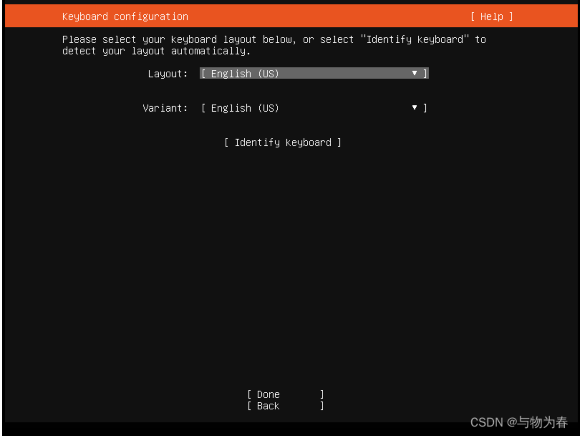
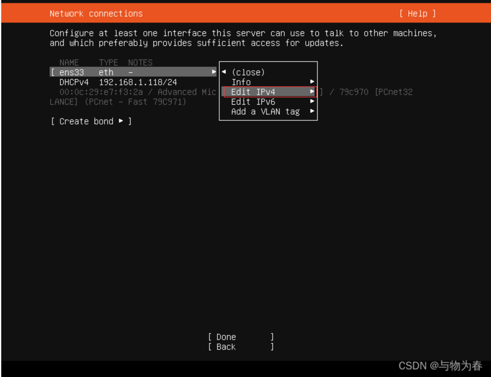
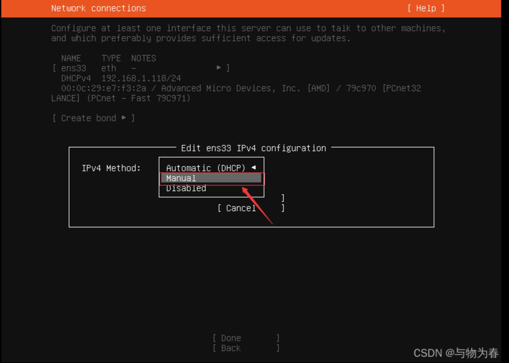
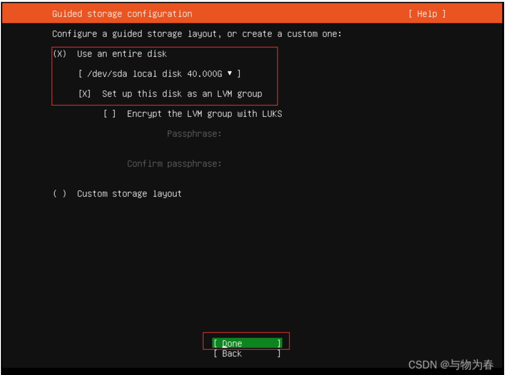

## 安装
1、选择 Install Ubuntu Server

<font style="color:rgb(51, 51, 51);">2、 语言选择，默认英语</font>

<font style="color:rgb(51, 51, 51);">3、键盘布局，可不用修改</font>

<font style="color:rgb(51, 51, 51);">4、选择第二项最小化安装（如果对系统不是熟的可以选择第一项）</font>

  
 

<font style="color:rgb(51, 51, 51);"> 5、网络配置，使用 DHCP 或者 静态IP（建议这里设置好静态IP，如果选择DHCP，则在此界面直接选择 Done 后回车即可)。</font>




<font style="color:rgb(51, 51, 51);">6、Configure proxy配置页面的Proxy address无需配置</font>


<font style="color:rgb(51, 51, 51);">7、设置镜像源地址，这个可以配置阿里云(</font>[http://mirrors.aliyun.com/ubuntu/](http://mirrors.aliyun.com/ubuntu/)<font style="color:rgb(51, 51, 51);">)，下载加速</font>

<font style="color:rgb(51, 51, 51);"> 8、选择安装磁盘，直接回车默认自动分配，需要手动分区的话选择 [custom storage layout]</font>

<font style="color:rgb(51, 51, 51);"> 检查磁盘分区是否符合你的要求，回车继续</font>


<font style="color:rgb(51, 51, 51);">再次确认 Continue 继续 </font>


<font style="color:rgb(51, 51, 51);">9、设置计算机名、用户名及密码</font>


<font style="color:rgb(51, 51, 51);"> 10、按空格键 选择安装 OpenSSH Server 服务 </font><font style="color:rgb(51, 51, 51);">11、选择预置环境，按需选取，不需要则直接选择Done回车继续</font>

<font style="color:rgb(51, 51, 51);">  
</font><font style="color:rgb(51, 51, 51);"> </font>

<font style="color:rgb(51, 51, 51);"> 12、开始安装系统</font><font style="color:rgb(51, 51, 51);"> 13、直接选择 [reboot Now]不安装更新直接重启</font>

<font style="color:rgb(51, 51, 51);">14、输入 账号、密码 后成功登录系统</font>

<font style="color:rgb(51, 51, 51);">到这里就算是简单的安装完成了，可以ping百度官网看看联网是否正常？（CTRL+C退出ping）</font>

<font style="color:rgb(51, 51, 51);">或者安装jdk，配置环境，写代码</font>

<font style="color:rgb(51, 51, 51);">补充设置更新系统</font>

```plain
sudo apt update
sudo apt upgrade
```

## <font style="color:rgb(51, 51, 51);"> 开启root用户登录</font>
```plain
给root账户设置密码
在当前普通用户界面下输入命令:
sudo passwd root
然后按提示两次输入密码即可
修改sshd配置
sudo vim /etc/ssh/sshd_config
按i进入编辑模式，找到#PermitRootLogin prohibit-password，默认是注释掉的。直接在下面添加一行：
PermitRootLogin yes
然后按esc，输入:wq保存并退出。
重启sshd服务
sudo systemctl restart ssh
```

## <font style="color:rgb(51, 51, 51);">修改IP</font>
```plain
1、sudo  vim /etc/netplan/00-installer-config.yaml
备注：编辑yaml 配置文件，注意缩进，否则后面应用就会报错
2、应用配置生效:
sudo netplan apply
```


查看计算机当前名称


```shell
hostname
```


编辑配置文件


终端输入：


```shell
sudo vi /etc/hostname
```


临时修改主机名：


```shell
hostname 临时主机名
```


永久修改主机名：


```shell
hostnamectl set-hostname永久主机名 是对/etc/hostname文件的内容进行修改
```

