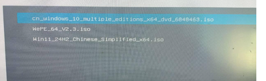

## 格式化U盘
格式化U盘，重新分区，不然有可能检查不到

[https://www.diskgenius.cn/download.php](https://www.diskgenius.cn/download.php)

## 下载ventory
[https://www.ventoy.net/cn/download.html](https://www.ventoy.net/cn/download.html)

点击安装

如下图所示，安装完后，直接把需要的ISO镜像放入这个VentoyG盘即可

进入bios后，选择已有镜像

选择正常启动

