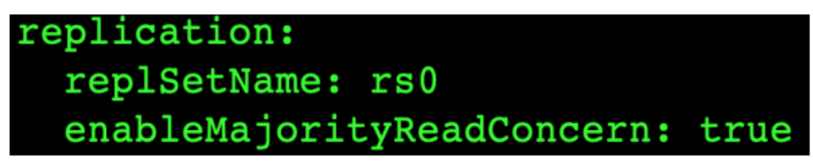

# **<font style="color:rgb(51,51,51);">1.writeConcern </font>**
## **<font style="color:rgb(51,51,51);">1.1 什么是 writeConcern</font>**
```shell
writeConcern 决定一个写操作落到多少个节点上才算成功。类似于MySQL中的半同步复制。主要保证
数据最终一致性
• 0：默认值。发起写操作，不关心是否成功；
• 1: 集群最大数据节点数：写操作需要被复制到指定节点数才算成功；
• majority：写操作需要被复制到大多数节点上才算成功。
```

**<font style="color:rgb(51,51,51);">默认行为</font>**

```shell
3 节点复制集不作任何特别设定（默认值）。
```


**<font style="color:rgb(51,51,51);">w: "majority"</font>**

```shell
大多数节点确认模式,其中包括主节点
```


**<font style="color:rgb(51,51,51);">w: "all"</font>**

```shell
全部节点确认模式。
```


## **<font style="color:rgb(51,51,51);">1.2 journal日志</font>**
```shell
writeConcern 可以决定写操作到达多少个节点才算成功，journal 则定义如何才算成
功。journal日志类似于MySQL中的redo日志。是在WriteConcern基础上对于数据安全的进一步保
证。
取值包括：
• true: 写操作落到journal 文件中才算成功；
• false: 写操作到达内存即算作成功。
```


## **<font style="color:rgb(51,51,51);">1.3 writeConcern 测试 </font>**
```shell
在复制集测试writeConcern参数
db.test.insert( {count: 1}, {writeConcern: {w: "majority"}})
db.test.insert( {count: 1}, {writeConcern: {w: 3 }})
db.test.insert( {count: 1}, {writeConcern: {w: 4 }})
配置延迟节点，模拟网络延迟（复制延迟）
conf=rs.conf()
conf.members[2].slaveDelay = 5
conf.members[2].priority = 0
rs.reconfig(conf)
观察复制延迟下的写入，以及timeout参数
db.test.insert( {count: 1}, {writeConcern: {w: 3})
db.test.insert( {count: 1}, {writeConcern: {w: 3, wtimeout:3000 }})
```

## **<font style="color:rgb(51,51,51);">1.4 注意事项</font>**
<font style="color:rgb(51,51,51);">• </font><font style="color:rgb(51,51,51);">虽然多于半数的 </font><font style="color:rgb(51,51,51);">writeConcern </font><font style="color:rgb(51,51,51);">都是安全的，但通常只会设置 </font><font style="color:rgb(51,51,51);">majority</font><font style="color:rgb(51,51,51);">，因为这是等待写入延迟 </font>

<font style="color:rgb(51,51,51);">时间最短的选择； </font>

<font style="color:rgb(51,51,51);">• </font><font style="color:rgb(51,51,51);">不要设置 </font><font style="color:rgb(51,51,51);">writeConcern </font><font style="color:rgb(51,51,51);">等于总节点数，因为一旦有一个节点故障，所有写操作都将失败； </font>

<font style="color:rgb(51,51,51);">• writeConcern </font><font style="color:rgb(51,51,51);">虽然会增加写操作延迟时间，但并不会显著增加集群压力，因此无论是否等待，写操 </font>

<font style="color:rgb(51,51,51);">作最终都会复制到所有节点上。设置 </font><font style="color:rgb(51,51,51);">writeConcern </font><font style="color:rgb(51,51,51);">只是让写操作等待复制后再返回而已； </font>

<font style="color:rgb(51,51,51);">• 应对重要数据应用 {w: “majority”}，普通数据可以应用 {w: 1} 以确保最佳性能。</font>

# **<font style="color:rgb(51,51,51);">2.readPreference读配置 </font>**
## **<font style="color:rgb(51,51,51);">2.1 介绍</font>**
```shell
readPreference 决定使用哪一个节点来满足正在发起的读请求。
可选值包括：
• primary: 只选择主节点
• primaryPreferred：优先选择主节点，如果不可用则选择从节点
• secondary：只选择从节点
• secondaryPreferred：优先选择从节点，如果从节点不可用则选择主节点
• nearest：选择最近的节点
```


## **<font style="color:rgb(51,51,51);">2.2. readPreference 场景举例</font>**
```shell
• 用户下订单后马上将用户转到订单详情页——primary/primaryPreferred。因为此时从节点可能还
没复制到新订单；
• 用户查询自己下过的订单——secondary/secondaryPreferred。查询历史订单对时效性通常没有太
高要求；
• 生成报表——secondary。报表对时效性要求不高，但资源需求大，可以在从节点单独处理，避免对线
上用户造成影响；
• 将用户上传的图片分发到全世界，让各地用户能够就近读取——nearest。每个地区的应用选择最近的
节点读取数据。
```

## **<font style="color:rgb(51,51,51);">2.3 readPreference 与 Tag</font>**
```shell
readPreference 只能控制使用一类节点。Tag 则可以将节点选择控制到一个或几个节点。
考虑以下场景：
• 一个 5 个节点的复制集
• 3 个节点硬件较好，专用于服务线上客户
• 2 个节点硬件较差，专用于生成报表
可以使用 Tag 来达到这样的控制目的
• 为 3 个较好的节点打上 {purpose: "online"}
• 为 2 个较差的节点打上 {purpose: "analyse"}
• 在线应用读取时指定 online，报表读取时指定reporting
更多信息请参考官方文档：readPreference
```


## **<font style="color:rgb(51,51,51);">2.4 readPreference 配置</font>**
```shell
通过 MongoDB 的连接串参数：
• mongodb://host1:27107,host2:27107,host3:27017/?
replicaSet=rs&readPreference=secondary
通过 MongoDB 驱动程序 API：
• MongoCollection.withReadPreference(ReadPreference readPref)
Mongo Shell：
• db.collection.find({}).readPref( “secondary” )
```

## **<font style="color:rgb(51,51,51);">2.5 readPreference 实验: 从节点读</font>**
```shell
• 主节点写入 {x:1}, 观察该条数据在各个节点均可见
• 在两个从节点分别执行 db.fsyncLock() 来锁定写入（同步）
• 主节点写入 {x:2}
• db.test.find()
• db.test.find().readPref(“secondary”)
• 解除从节点锁定 db.fsyncUnlock()
• db.test.find().readPref(“secondary”)
```

## **<font style="color:rgb(51,51,51);">2.6 注意事项</font>**
```shell
• 指定 readPreference 时也应注意高可用问题。例如将 readPreference 指定 primary，则发
生故障转移不存在 primary 期间将没有节点可读。如果业务允许，则应选择 primaryPreferred；
• 使用 Tag 时也会遇到同样的问题，如果只有一个节点拥有一个特定 Tag，则在这个节点失效时将无
节点可读。这在有时候是期望的结果，有时候不是。例如：
• 如果报表使用的节点失效，即使不生成报表，通常也不希望将报表负载转移到其他节点上，此时只有一
个节点有报表 Tag 是合理的选择；
• 如果线上节点失效，通常希望有替代节点，所以应该保持多个节点有同样的 Tag；
• Tag 有时需要与优先级、选举权综合考虑。例如做报表的节点通常不会希望它成为主节点，则优先级
应为 0。
```

# 3.readConcern读隔离性保证
## **<font style="color:rgb(51,51,51);">3.1 什么是 readConcern？</font>**
```shell
在 readPreference 选择了指定的节点后，readConcern 决定这个节点上的数据哪些是可读的，类
似于关系数据库的隔离级别。可选值包括：
• available：读取所有可用的数据;
• local：读取所有可用且属于当前分片的数据;
• majority：读取在大多数节点上提交完成的数据;
• snapshot：读取最近快照中的数据;
• linearizable：可线性化读取文档;
```

## **<font style="color:rgb(51,51,51);">3.2 readConcern: local 和 available</font>**
```shell
在复制集中 local 和 available 是没有区别的。两者的区别主要体现在分片集上。
考虑以下场景：
• 一个 chunk x 正在从 shard1 向 shard2 迁移；
• 整个迁移过程中 chunk x 中的部分数据会在 shard1 和 shard2 中同时存在，但源分片
shard1仍然是chunk x 的负责方：
• 所有对 chunk x 的读写操作仍然进入 shard1；
• config 中记录的信息 chunk x 仍然属于 shard1；
• 此时如果读 shard2，则会体现出 local 和 available 的区别：
local：只取应该由 shard2 负责的数据（不包括 x）；
available：shard2 上有什么就读什么（包括 x）；
注意事项：
• 虽然看上去总是应该选择 local，但毕竟对结果集进行过滤会造成额外消耗。在一些无关紧要的场
景（例如统计）下，也可以考虑 available；
• MongoDB <=3.6 不支持对从节点使用 {readConcern: "local"}；
• 从主节点读取数据时默认 readConcern 是 local，从从节点读取数据时默认readConcern是
available（向前兼容原因）。
```


## **<font style="color:rgb(51,51,51);">3.3 readConcern: majority</font>**
```shell
只读取大多数据节点上都提交了的数据。考虑如下场景：
● 集合中原有文档 {x: 0}；
● 将x值更新为 1；
```


## **<font style="color:rgb(51,51,51);">3.4 readConcern: majority 的实现方式</font>**
```shell
考虑 t3 时刻的 Secondary1，此时：
• 对于要求 majority 的读操作，它将返回 x=0；
• 对于不要求 majority 的读操作，它将返回 x=1；
如何实现？
节点上维护多个 x 版本，MVCC 机制MongoDB 通过维护多个快照来链接不同的版本：
• 每个被大多数节点确认过的版本都将是一个快照；
• 快照持续到没有人使用为止才被删除；
```


## **<font style="color:rgb(51,51,51);">3.5 实验： readConcern : ”majority” vs “local”</font>**
```shell
安装 3 节点复制集。
• 注意配置文件内 server 参数 enableMajorityReadConcern
• 将复制集中的两个从节点使用 db.fsyncLock() 锁住写入（模拟同步延迟）
```



## **<font style="color:rgb(51,51,51);">3.6 readConcern 验证</font>**
```shell
• db.test.save({“A”:1})
• db.test.find().readConcern(“local”)
• db.test.find().readConcern(“majority”)
• 在从节点上执行 db.fsyncUnlock()
结论：
• 使用 local 参数，则可以直接查询到写入数据
• 使用 majority，只能查询到已经被多数节点确认过的数据
• update 与 remove 与上同理。
```

## **<font style="color:rgb(51,51,51);">3.7 readConcern: majority 与脏读</font>**
```shell
MongoDB 中的回滚：
• 写操作到达大多数节点之前都是不安全的，一旦主节点崩溃，而从节还没复制到该次操作，刚才的写操
作就丢失了；
• 把一次写操作视为一个事务，从事务的角度，可以认为事务被回滚了。所以从分布式系统的角度来看，
事务的提交被提升到了分布式集群的多个节点级别的“提交”，而不再是单个节点上的“提交”。在可能发生
回滚的前提下考虑脏读问题
• 如果在一次写操作到达大多数节点前读取了这个写操作，然后因为系统故障该操作回滚了，则发生了脏
读问题；使用 {readConcern: “majority”} 可以有效避免脏读
```

## **<font style="color:rgb(51,51,51);">3.8 readConcern: 如何实现安全的读写分离</font>**
```shell
考虑如下场景：
向主节点写入一条数据；立即从从节点读取这条数据。如何保证自己能够读到刚刚写入的数据？
下述方式有可能读不到刚写入的订单:
db.orders.insert({ oid: 101, sku: ”kite", q: 1})
db.orders.find({oid:101}).readPref("secondary")
使用 writeConcern + readConcern majority 来解决:
db.orders.insert({ oid: 101, sku: "kiteboar", q: 1}, {writeConcern:{w:
"majority”}})
db.orders.find({oid:101}).readPref(“secondary”).readConcern("majority")
```


**<font style="color:rgb(51,51,51);">读隔离性和MySQL的对比</font>**

```shell
readConcern 主要关注读的隔离性， ACID 中的 Isolation，但是是分布式数据库里特有的概念
readCocnern： majority 对应于MysQL事务中隔离级别中的哪一级？
```


# **<font style="color:rgb(51,51,51);">4.MongoDB的ACID事务支持 </font>**
## **<font style="color:rgb(51,51,51);">4.1 介绍</font>**
```shell
MongoDB 虽然已经在 4.2 开始全面支持了多文档事务，但并不代表大家应该毫无节制地使用它。相
反，对事务的使用原则应该是：能不用尽量不用。
通过合理地设计文档模型，可以规避绝大部分使用事务的必要性
为什么？
事务 = 锁，节点协调，额外开销，性能影响.
```

## **<font style="color:rgb(51,51,51);">4.2 MongoDB ACID 多文档事务支持</font>**


## **<font style="color:rgb(51,51,51);">4.3 使用方法</font>**
```shell
MongoDB 多文档事务的使用方式与关系数据库非常相似：
try (ClientSession clientSession = client.startSession()) {
clientSession.startTransaction();
collection.insertOne(clientSession, docOne);
collection.insertOne(clientSession, docTwo);
clientSession.commitTransaction();
}
```

## **<font style="color:rgb(51,51,51);">4.4 事务的隔离级别</font>**
```shell
● 事务完成前，事务外的操作对该事务所做的修改不可访问
● 如果事务内使用 {readConcern: “snapshot”}，则可以达到可重复读 Repeatable Read
```

## **<font style="color:rgb(51,51,51);">4.5 实验：启用事务后的隔离性</font>**
```shell
db.tx.insertMany([{ x: 1 }, { x: 2 }]);
var session = db.getMongo().startSession();
session.startTransaction();
var coll = session.getDatabase('test').getCollection("tx");
coll.updateOne({x: 1}, {$set: {y: 1}});
coll.findOne({x: 1});
db.tx.findOne({x: 1});
session.abortTransaction();
```


## **<font style="color:rgb(51,51,51);">4.6 实验：可重复读 Repeatable Read</font>**
```shell
var session = db.getMongo().startSession();
session.startTransaction({
readConcern: {level: "snapshot"},
writeConcern: {w: "majority"}});
var coll = session.getDatabase('test').getCollection("tx");
coll.findOne({x: 1}); // 返回：{x: 1}
db.tx.updateOne({x: 1}, {$set: {y: 1}});
db.tx.findOne({x: 1}); // 返回：{x: 1, y: 1}
coll.findOne({x: 1}); // 返回：{x: 1}
session.abortTransaction();
```


## **<font style="color:rgb(51,51,51);">4.7 事务写机制</font>**
```shell
MongoDB 的事务错误处理机制不同于关系数据库：
● 当一个事务开始后，如果事务要修改的文档在事务外部被修改过，则事务修改这个文档时会触发
Abort 错误，因为此时的修改冲突了；
● 这种情况下，只需要简单地重做事务就可以了；
● 如果一个事务已经开始修改一个文档，在事务以外尝试修改同一个文档，则事务以外的修改会等待事务
完成才能继续进行
```

## **<font style="color:rgb(51,51,51);">4.8 实验：写冲突 </font>**
```shell
继续使用上个实验的tx集合 
开两个 mongo shell 均执行下述语句 
var session = db.getMongo().startSession(); 
session.startTransaction({ readConcern: {level: "snapshot"}, 
writeConcern: {w: "majority"}}); 
var coll = session.getDatabase('test').getCollection("tx");
```


```shell
窗口1：第一个事务，正常提交
coll.updateOne({x: 1}, {$set: {y: 1}});
窗口2：另一个事务更新同一条数据，异常
coll.updateOne({x: 1}, {$set: {y: 2}});
窗口3：事务外更新，需等待
db.tx.updateOne({x: 1}, {$set: {y: 3}});
```

## **<font style="color:rgb(51,51,51);">4.9 注意事项 </font>**
```shell
• 可以实现和关系型数据库类似的事务场景
• 必须使用与 MongoDB 4.2 兼容的驱动；
• 事务默认必须在 60 秒（可调）内完成，否则将被取消；
• 涉及事务的分片不能使用仲裁节点；
• 事务会影响 chunk 迁移效率。正在迁移的 chunk也可能造成事务提交失败（重试即可）；
• 多文档事务中的读操作必须使用主节点读；
• readConcern 只应该在事务级别设置，不能设置在每次读写操作上。
• 必须是WT引擎才支持事务。
```


