# Mongodb高级运维笔记
# **<font style="color:rgb(51,51,51);">1.MongoDB常见架构</font>**
# **<font style="color:rgb(51,51,51);">2.分片集群机制及原理</font>**
## **<font style="color:rgb(51,51,51);">2.1 为什么使用分片集群</font>**
```shell
• 数据容量日益增大，访问性能日渐降低，怎么破？
• 新品上线异常火爆，如何支撑更多的并发用户？
• 单库已有 10TB 数据，恢复需要1-2天，如何加速？
• 地理分布数据
```

## **<font style="color:rgb(51,51,51);">2.2 如何解决以上问题 </font>**
**<font style="color:rgb(51,51,51);">原始结构</font>**

```shell
•银行交易单表内10亿笔资料
•超负荷运转
```


**<font style="color:rgb(51,51,51);">把数据分成两半</font>**

**<font style="color:rgb(51,51,51);">把数据分成4部分</font>**


## **<font style="color:rgb(51,51,51);">2.3 分片架构介绍</font>**
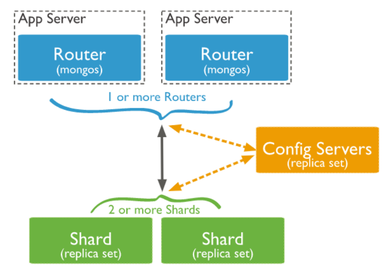

```shell
• Mongos 路由节点
提供集群单一入口
转发应用端请求
选择合适数据节点进行读写
合并多个数据节点的返回
无状态
建议至少2个
• Config Servers配置节点
提供集群元数据存储
分片数据分布的映射
• Shards 数据节点
以复制集为单位
横向扩展
最大1024分片
分片之间数据不重复
所有分片在一起才可
完整工作
```


## **<font style="color:rgb(51,51,51);">2.4 MongoDB 分片集群特点</font>**
```shell
• 应用全透明，无特殊处理
• 数据自动均衡
• 动态扩容，无须下线
• 提供三种分片方式
```

**<font style="color:rgb(51,51,51);"> </font>**

## **<font style="color:rgb(51,51,51);">2.5 分片集群数据分布方式</font>**
```shell
• 基于范围
• 基于 Hash
• 基于 zone / tag
```

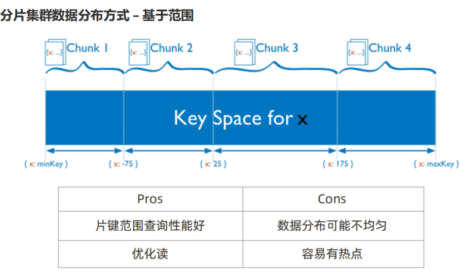

**<font style="color:rgb(51,51,51);">分片集群数据分布方式 – 基于哈希</font>**

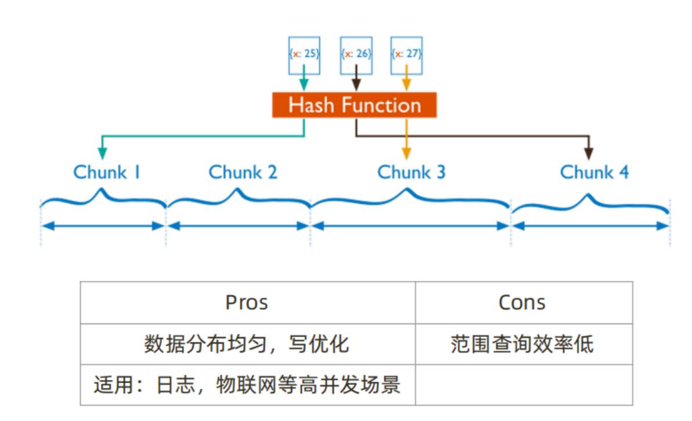

**<font style="color:rgb(51,51,51);">分片集群数据分布方式 – 自定义Zone</font>**


# **<font style="color:rgb(51,51,51);">3. 分片集群搭建及扩容 </font>**
## **<font style="color:rgb(51,51,51);">3.1 分片规划</font>**
```shell
10个实例：38017-38026
(1)configserver:
3台构成的复制集（1主两从，不支持arbiter）38018-38020
(2)shard节点：
sh1：38021-23 （1主两从，其中一个节点为arbiter，复制集名字sh1）
sh2：38024-26 （1主两从，其中一个节点为arbiter，复制集名字sh2）
(3)mongos
38017
```

## **<font style="color:rgb(51,51,51);">3.2 配置过程 </font>**
```shell
a. shard复制集配置：
1. 创建：
mkdir -p /mongodb/38021/conf /mongodb/38021/log /mongodb/38021/data
mkdir -p /mongodb/38022/conf /mongodb/38022/log /mongodb/38022/data
mkdir -p /mongodb/38023/conf /mongodb/38023/log /mongodb/38023/data
mkdir -p /mongodb/38024/conf /mongodb/38024/log /mongodb/38024/data
mkdir -p /mongodb/38025/conf /mongodb/38025/log /mongodb/38025/data
mkdir -p /mongodb/38026/conf /mongodb/38026/log /mongodb/38026/data
2. 配置文件：
sh1:
vi /mongodb/38021/conf/mongodb.conf
===============
根据需求修改相应参数：
systemLog:
logAppend: true
storage:
journal:
enabled: true
dbPath: /mongodb/38021/data
directoryPerDB: true
#engine: wiredTiger
wiredTiger:
engineConfig:
cacheSizeGB: 1
directoryForIndexes: true
collectionConfig:
blockCompressor: zlib
indexConfig:
prefixCompression: true
net:
bindIp: 10.0.0.51,127.0.0.1
port: 38021
replication:
oplogSizeMB: 2048
replSetName: sh1
sharding:
clusterRole: shardsvr
processManagement:
fork: true
===============
cp /mongodb/38021/conf/mongodb.conf /mongodb/38022/conf/
cp /mongodb/38021/conf/mongodb.conf /mongodb/38023/conf/
sed 's#38021#38022#g' /mongodb/38022/conf/mongodb.conf -i
sed 's#38021#38023#g' /mongodb/38023/conf/mongodb.conf -i
sh2:
vi /mongodb/38024/conf/mongodb.conf
========
根据需求修改相应参数：
systemLog:
destination: file
path: /mongodb/38024/log/mongodb.log
logAppend: true
storage:
journal:
enabled: true
dbPath: /mongodb/38024/data
directoryPerDB: true
wiredTiger:
engineConfig:
cacheSizeGB: 1
directoryForIndexes: true
collectionConfig:
blockCompressor: zlib
indexConfig:
prefixCompression: true
net:
bindIp: 10.0.0.51,127.0.0.1
port: 38024
replication:
oplogSizeMB: 2048
replSetName: sh2
sharding:
clusterRole: shardsvr
processManagement:
fork: true
========
cp /mongodb/38024/conf/mongodb.conf /mongodb/38025/conf/
cp /mongodb/38024/conf/mongodb.conf /mongodb/38026/conf/
sed 's#38024#38025#g' /mongodb/38025/conf/mongodb.conf -i
sed 's#38024#38026#g' /mongodb/38026/conf/mongodb.conf -i
3. 所有节点，并搭建复制集：
mongod -f /mongodb/38021/conf/mongodb.conf
mongod -f /mongodb/38022/conf/mongodb.conf
mongod -f /mongodb/38023/conf/mongodb.conf
mongod -f /mongodb/38024/conf/mongodb.conf
mongod -f /mongodb/38025/conf/mongodb.conf
mongod -f /mongodb/38026/conf/mongodb.conf
mongo --port 38021
use admin
config = {_id: 'sh1', members: [
{_id: 0, host: '10.0.0.51:38021'},
{_id: 1, host: '10.0.0.51:38022'},
{_id: 2, host:
'10.0.0.51:38023',"arbiterOnly":true}]
}
rs.initiate(config)
mongo --port 38024
use admin
config = {_id: 'sh2', members: [
{_id: 0, host: '10.0.0.51:38024'},
{_id: 1, host: '10.0.0.51:38025'},
{_id: 2, host:
'10.0.0.51:38026',"arbiterOnly":true}]
}
rs.initiate(config)
=-=----=-=-=-=-=-=-=-=-=-=-=-=-=-=-=-=-=-=-=-=-=-=-
b.config节点配置：
1. 目录创建：
mkdir -p /mongodb/38018/conf /mongodb/38018/log /mongodb/38018/data
mkdir -p /mongodb/38019/conf /mongodb/38019/log /mongodb/38019/data
mkdir -p /mongodb/38020/conf /mongodb/38020/log /mongodb/38020/data
2. 修改配置文件：
[mongod@server1 ~]$ vi /mongodb/38018/conf/mongodb.conf
systemLog:
destination: file
path: /mongodb/38018/log/mongodb.conf
logAppend: true
storage:
journal:
enabled: true
dbPath: /mongodb/38018/data
directoryPerDB: true
#engine: wiredTiger
wiredTiger:
engineConfig:
cacheSizeGB: 1
directoryForIndexes: true
collectionConfig:
blockCompressor: zlib
indexConfig:
prefixCompression: true
net:
bindIp: 10.0.0.51,127.0.0.1
port: 38018
replication:
oplogSizeMB: 2048
replSetName: configReplSet
sharding:
clusterRole: configsvr
processManagement:
fork: true
cp /mongodb/38018/conf/mongodb.conf /mongodb/38019/conf/
cp /mongodb/38018/conf/mongodb.conf /mongodb/38020/conf/
sed 's#38018#38019#g' /mongodb/38019/conf/mongodb.conf -i
sed 's#38018#38020#g' /mongodb/38020/conf/mongodb.conf -i
3. 启动节点，并配置复制集
mongod -f /mongodb/38018/conf/mongodb.conf
mongod -f /mongodb/38019/conf/mongodb.conf
mongod -f /mongodb/38020/conf/mongodb.conf
mongo --port 38018
use admin
config = {_id: 'configReplSet', members: [
{_id: 0, host: '10.0.0.51:38018'},
{_id: 1, host: '10.0.0.51:38019'},
{_id: 2, host: '10.0.0.51:38020'}]
}
rs.initiate(config)
注：configserver 可以是一个节点，官方建议复制集。configserver不能有arbiter。
新版本中，要求必须是复制集。
注：mongodb 3.4之后，虽然要求config server为replica set，但是不支持arbiter
===============================
c. mongos节点配置：
1. 创建目录：
mkdir -p /mongodb/38017/conf /mongodb/38017/log
2配置文件：
vi /mongodb/38017/conf/mongos.conf
systemLog:
destination: file
path: /mongodb/38017/log/mongos.log
logAppend: true
net:
bindIp: 10.0.0.51,127.0.0.1
port: 38017
sharding:
configDB: configReplSet/10.0.0.51:38018,10.0.0.51:38019,10.0.0.51:38020
processManagement:
fork: true
3. 启动mongos
mongos -f /mongodb/38017/conf/mongos.conf
d. 分片集群操作：
连接到其中一个mongos（10.0.0.51），做以下配置
（1）连接到mongs的admin数据库
# su - mongod
$ mongo 10.0.0.51:38017/admin
（2）添加分片
db.runCommand( { addshard :
"sh1/10.0.0.51:38021,10.0.0.51:38022,10.0.0.51:38023",name:"shard1"} )
db.runCommand( { addshard :
"sh2/10.0.0.51:38024,10.0.0.51:38025,10.0.0.51:38026",name:"shard2"} )
（3）列出分片
mongos> db.runCommand( { listshards : 1 } )
（4）整体状态查看
mongos> sh.status();
=================================
e. 使用分片集群
##RANGE分片配置及测试
test库下的vast大表进行手工分片
1、激活数据库分片功能
mongo --port 38017 admin
admin> ( { enablesharding : "数据库名称" } )
eg：
admin> db.runCommand( { enablesharding : "test" } )
2、指定分片建对集合分片
eg：范围片键
--创建索引
use test
> db.vast.ensureIndex( { id: 1 } )
--开启分片
use admin
> db.runCommand( { shardcollection : "test.vast",key : {id: 1} } )
3、集合分片验证
admin> use test
test> for(i=1;i<500000;i++){
db.vast.insert({"id":i,"name":"shenzheng","age":70,"date":new Date()}); }
test> db.vast.stats()
4、分片结果测试
shard1:
mongo --port 38021
db.vast.count();
shard2:
mongo --port 38024
db.vast.count();
----------------------------------------------------
f. Hash分片例子：
对test库下的vast大表进行hash
创建哈希索引
（1）对于test开启分片功能
mongo --port 38017 admin
use admin
admin> db.runCommand( { enablesharding : "test" } )
（2）对于test库下的vast表建立hash索引
use test
test> db.vast.ensureIndex( { id: "hashed" } )
（3）开启分片
use admin
admin > sh.shardCollection( "test.vast", { id: "hashed" } )
（4）录入10w行数据测试
use test
for(i=1;i<100000;i++){
db.vast.insert({"id":i,"name":"shenzheng","age":70,"date":new Date()}); }
（5）hash分片结果测试
mongo --port 38021
use test
db.vast.count();
mongo --port 38024
use test
db.vast.count();
---------------------------
g. 分片的管理
1、判断是否Shard集群
admin> db.runCommand({ isdbgrid : 1})
2、列出所有分片信息
admin> db.runCommand({ listshards : 1})
3、列出开启分片的数据库
admin> use config
config> db.databases.find( { "partitioned": true } )
或者：
config> db.databases.find() //列出所有数据库分片情况
4、查看分片的片键
config> db.collections.find().pretty()
{
"_id" : "test.vast",
"lastmodEpoch" : ObjectId("58a599f19c898bbfb818b63c"),
"lastmod" : ISODate("1970-02-19T17:02:47.296Z"),
"dropped" : false,
"key" : {
"id" : 1
},
"unique" : false
}
5、查看分片的详细信息
admin> db.printShardingStatus()
或
admin> sh.status()
6、删除分片节点（谨慎）
（1）确认blance是否在工作
sh.getBalancerState()
（2）删除shard2节点(谨慎)
mongos> db.runCommand( { removeShard: "shard2" } )
注意：删除操作一定会立即触发blancer。
7、balancer操作
介绍：
mongos的一个重要功能，自动巡查所有shard节点上的chunk的情况，自动做chunk迁移。
什么时候工作？
1、自动运行，会检测系统不繁忙的时候做迁移
2、在做节点删除的时候，立即开始迁移工作
3、balancer只能在预设定的时间窗口内运行
有需要时可以关闭和开启blancer（备份的时候）
mongos> sh.stopBalancer()
mongos> sh.startBalancer()
8、自定义 自动平衡进行的时间段
https://docs.mongodb.com/manual/tutorial/manage-sharded-clusterbalancer/#schedule-the-balancing-window
// connect to mongos
use config
sh.setBalancerState( true )
db.settings.update({ _id : "balancer" }, { $set : { activeWindow : { start
: "3:00", stop : "5:00" } } }, true )
sh.getBalancerWindow()
sh.status()
```

# **<font style="color:rgb(51,51,51);">4. 企业中分片集群设计 </font>**
## **<font style="color:rgb(51,51,51);">4.1分片的基本标准</font>**
```shell
• 关于数据：数据量不超过3TB，尽可能保持在2TB一个片；
• 关于索引：常用索引必须容纳进内存；
• 按照以上标准初步确定分片后，还需要考虑业务压力，随着压力增大，CPU、RAM、磁盘中的任何一项
出现瓶颈时，都可以通过添加更多分片来解决。
```

## **<font style="color:rgb(51,51,51);">4.2 如何粗略判断需要多少分片</font>**
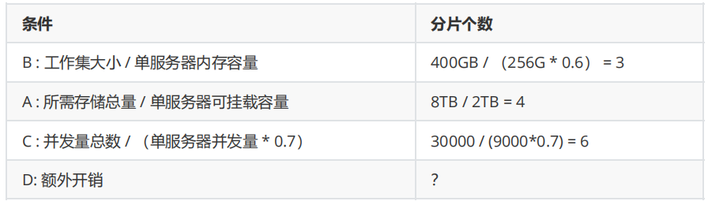

<font style="color:rgb(51,51,51);">分片数量 = max(A, B, C)+D =? </font>

## **<font style="color:rgb(51,51,51);">4.3 额外的考量 </font>**
```shell
考虑分片的分布：
• 是否需要跨机房分布分片？
• 是否需要容灾？
• 高可用的要求如何?
```

## **<font style="color:rgb(51,51,51);">4.4 选择片键的正确姿势</font>**


```shell
影响片键效率的主要因素：
• 取值基数（Cardinality）；
• 取值分布；
• 分散写，集中读；
• 被尽可能多的业务场景用到；
• 避免单调递增或递减的片键；
```

**<font style="color:rgb(51,51,51);">a. 选择基数大的片键</font>**

```shell
对于小基数的片键：
• 因为备选值有限，那么块的总数量就有限；
• 随着数据增多，块的大小会越来越大；
• 水平扩展时移动块会非常困难；
例如：存储一个高中的师生数据，以年龄（假设年龄范围为15~65岁）作为片键，
15<=年龄<=65，且只为整数,所以最多只会有51个 chunk
结论：取值基数要大！
```

**<font style="color:rgb(51,51,51);">b.选择分布均匀的片键</font>**

```shell
对于分布不均匀的片键：
• 造成某些块的数据量急剧增大
• 这些块压力随之增大
• 数据均衡以 chunk 为单位，所以系统无能为力 • 例如：存储一个学校的师生数据，以年龄（假设年
龄范围为15~65岁）作为片键，
那么：
• 15<=年龄<=65，且只为整数
• 大部分人的年龄范围为15~18岁（学生） • 15、16、17、18四个 chunk 的数据量、访问压力远大
于其他 chunk
结论：取值分布应尽可能均匀
```

**<font style="color:rgb(51,51,51);">c. 通过一个例子来看片键选择</font>**

```shell
{
_id: ObjectId(),
user: 123,
time: Date(),
subject: “...”,
recipients: [],
body: “...”,
attachments: []
}
```

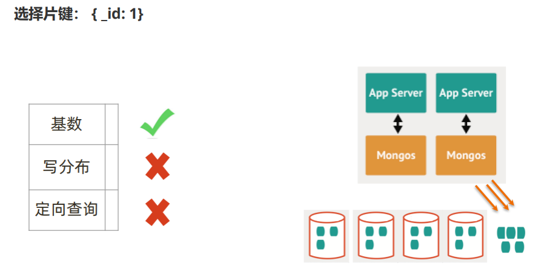

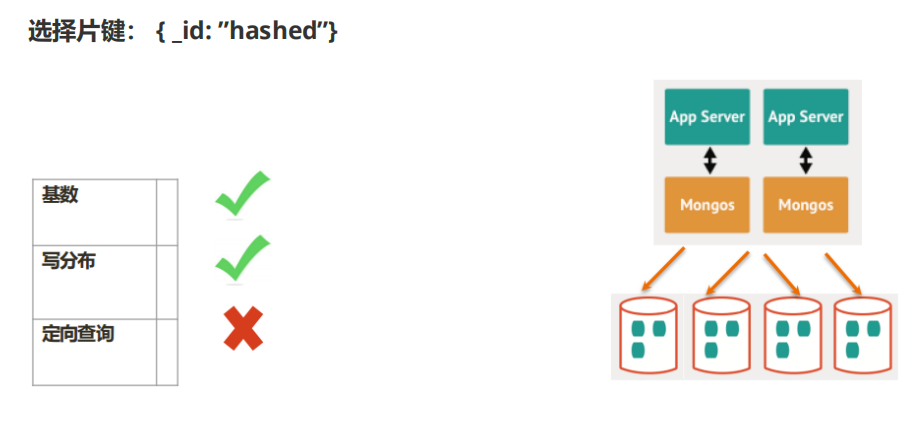

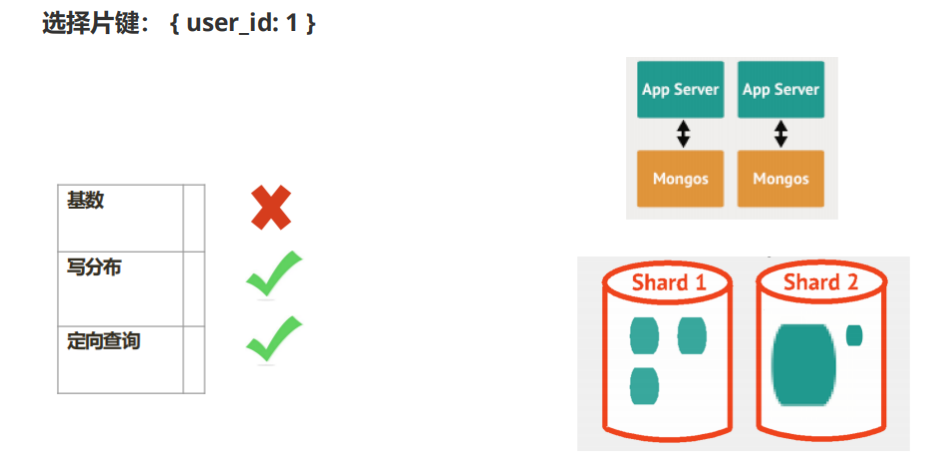

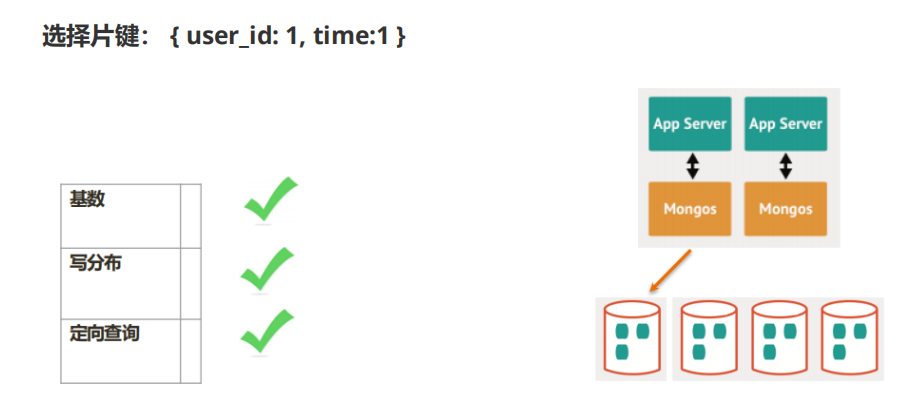

## **<font style="color:rgb(51,51,51);">4.5 如何规划硬件</font>**
```shell
• mongos 与 config 通常消耗很少的资源，可以选择低规格虚拟机；
• 资源的重点在于 shard 服务器：
• 需要足以容纳热数据索引的内存；
• 正确创建索引后 CPU 通常不会成为瓶颈，除非涉及非常多的计算；
• 磁盘尽量选用 SSD；
实际测试是最好的检验，来看你的资源配置是否完备。
另外，即使项目初期已经具备了足够的资源，仍然需要考虑在合适的时候扩展。建议监控
各项资源使用情况，无论哪一项达到60%以上，则开始考虑扩展。
• 扩展需要新的资源，申请新资源需要时间；
• 扩展后数据需要均衡，均衡需要时间。应保证新数据入库速度慢于均衡速度
• 均衡需要资源，如果资源即将或已经耗尽，均衡也是会很低效的。
```

# **<font style="color:rgb(51,51,51);">5. 高级集群设计：两地三中心 </font>**
## **<font style="color:rgb(51,51,51);">5.1 容灾级别</font>**


## **<font style="color:rgb(51,51,51);">5.2 MongoDB 两地三中心集群实现</font>**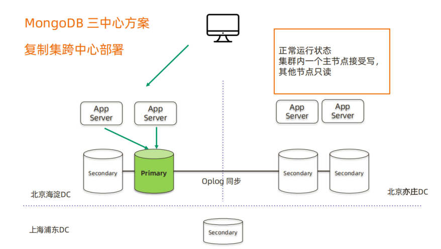
## **<font style="color:rgb(51,51,51);">5.3 两地三中心规划及实施</font>**
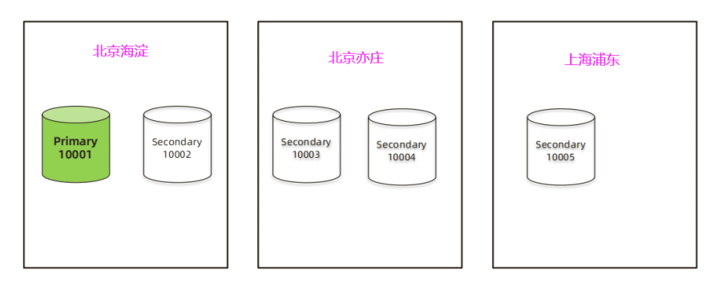

**<font style="color:rgb(51,51,51);">a. 准备虚拟机及数据库实例</font>**

```shell
1. 规划
# 10.0.0.51
primary:10.0.0.51:10001
s1 :10.0.0.51:10002
# 10.0.0.52
s3 :10.0.0.52:10003
s4 :10.0.0.52:10004
# 10.0.53
s5 :10.0.53:10005
2. 准备实例
# 配置文件-db01
su - mongod
mkdir -p /mongodb/10001/conf /mongodb/10001/data /mongodb/10001/log
mkdir -p /mongodb/10002/conf /mongodb/10002/data /mongodb/10002/log
cat > /mongodb/10001/conf/mongod.conf <<EOF
systemLog:
destination: file
path: /mongodb/10001/log/mongodb.log
logAppend: true
storage:
journal:
enabled: true
dbPath: /mongodb/10001/data
directoryPerDB: true
#engine: wiredTiger
wiredTiger:
engineConfig:
cacheSizeGB: 0.5
directoryForIndexes: true
collectionConfig:
blockCompressor: zlib
indexConfig:
prefixCompression: true
processManagement:
fork: true
net:
port: 10001
bindIp: 10.0.0.51,127.0.0.1
replication:
oplogSizeMB: 2048
replSetName: my_repl
EOF
\cp /mongodb/10001/conf/mongod.conf /mongodb/10002/conf/
sed 's#10001#10002#g' /mongodb/10002/conf/mongod.conf -i
mongod -f /mongodb/10001/conf/mongod.conf
mongod -f /mongodb/10002/conf/mongod.conf
# 配置文件-db02
su - mongod
mkdir -p /mongodb/10003/conf /mongodb/10003/data /mongodb/10003/log
mkdir -p /mongodb/10004/conf /mongodb/10004/data /mongodb/10004/log
cat > /mongodb/10003/conf/mongod.conf <<EOF
systemLog:
destination: file
path: /mongodb/10003/log/mongodb.log
logAppend: true
storage:
journal:
enabled: true
dbPath: /mongodb/10003/data
directoryPerDB: true
#engine: wiredTiger
wiredTiger:
engineConfig:
cacheSizeGB: 0.5
directoryForIndexes: true
collectionConfig:
blockCompressor: zlib
indexConfig:
prefixCompression: true
processManagement:
fork: true
net:
port: 10003
bindIp: 10.0.0.52,127.0.0.1
replication:
oplogSizeMB: 2048
replSetName: my_repl
EOF
\cp /mongodb/10003/conf/mongod.conf /mongodb/10004/conf/
sed 's#10003#10004#g' /mongodb/10004/conf/mongod.conf -i
mongod -f /mongodb/10003/conf/mongod.conf
mongod -f /mongodb/10004/conf/mongod.conf
# 配置文件-db03
su - mongod
mkdir -p /mongodb/10005/conf /mongodb/10005/data /mongodb/10005/log
cat > /mongodb/10005/conf/mongod.conf <<EOF
systemLog:
destination: file
path: /mongodb/10005/log/mongodb.log
logAppend: true
storage:
journal:
enabled: true
dbPath: /mongodb/10005/data
directoryPerDB: true
#engine: wiredTiger
wiredTiger:
engineConfig:
cacheSizeGB: 0.5
directoryForIndexes: true
collectionConfig:
blockCompressor: zlib
indexConfig:
prefixCompression: true
processManagement:
fork: true
net:
port: 10005
bindIp: 10.0.53,127.0.0.1
replication:
oplogSizeMB: 2048
replSetName: my_repl
EOF
mongod -f /mongodb/10005/conf/mongod.conf
config = {_id: 'my_repl', members: [
{_id: 0, host: '10.0.0.51:10001'},
{_id: 1, host: '10.0.0.51:10002'},
{_id: 2, host: '10.0.0.52:10003'},
{_id: 3, host: '10.0.0.52:10004'},
{_id: 4, host: '10.0.53:10005'}
]
}
rs.initiate(config)
```

**<font style="color:rgb(51,51,51);">b. 两地三中心定制化配置</font>**

```shell
cfg = rs.conf()
cfg.members[1].priority = 20
cfg.members[2].priority = 10
cfg.members[3].priority = 10
rs.reconfig(cfg)
```

**<font style="color:rgb(51,51,51);">c. 复制集安全加固</font>**

```shell
# db01
openssl rand -base64 756 > /mongodb/10001/conf/keyfile
cp -a /mongodb/10001/conf/keyfile /mongodb/10002/conf
chmod 600 /mongodb/10001/conf/keyfile /mongodb/10002/conf/keyfile
scp /mongodb/10001/conf/keyfile 10.0.0.52:/mongodb/10003/conf
scp /mongodb/10001/conf/keyfile 10.0.0.52:/mongodb/10004/conf
scp /mongodb/10001/conf/keyfile 10.0.53:/mongodb/10005/conf
每个节点开启验证：
cat >> /mongodb/10001/conf/mongod.conf<<EOF
security:
keyFile: /mongodb/10001/conf/keyfile
EOF
cat >>/mongodb/10002/conf/mongod.conf<<EOF
security:
keyFile: /mongodb/10002/conf/keyfile
EOF
cat >> /mongodb/10003/conf/mongod.conf <<EOF
security:
keyFile: /mongodb/10003/conf/keyfile
EOF
cat >> /mongodb/10004/conf/mongod.conf <<EOF
security:
keyFile: /mongodb/10004/conf/keyfile
EOF
cat >> /mongodb/10005/conf/mongod.conf <<EOF
security:
keyFile: /mongodb/10005/conf/keyfile
EOF
use admin
db.shutdownServer()
+++++
Shut down each mongod in the replica set, starting with the secondaries.
Continue until all members of the replica set are offline, including any
arbiters. The primary must be the last member shut down to avoid potential
rollbacks.
+++++
启动所有节点，在主节点添加用户：
use admin
db.createUser(
{
user: "root",
pwd: "root123",
roles: [ { role: "root", db: "admin" } ]
}
)
手工交互式输入密码
db.createUser(
{
user: "root1",
pwd: passwordPrompt(),
roles: [ { role: "root", db: "admin" } ]
}
)
手工交互式验证
my_repl:PRIMARY> use admin
switched to db admin
my_repl:PRIMARY> db.auth("root1",passwordPrompt())
Enter password:
```

# **<font style="color:rgb(51,51,51);">6. 高级集群设计：全球多写</font>**
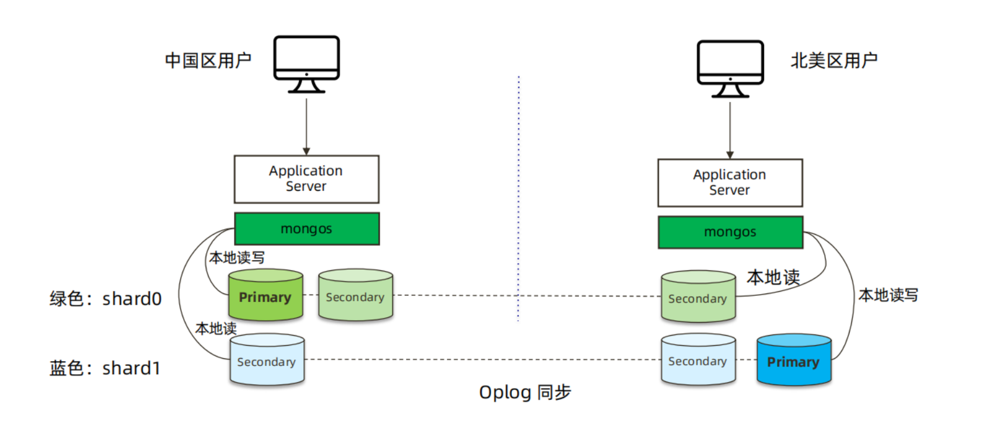

```shell
# db01:
su - mongod
mkdir -p /mongodb/20001/conf /mongodb/20001/data /mongodb/20001/log
mkdir -p /mongodb/20002/conf /mongodb/20002/data /mongodb/20002/log
mkdir -p /mongodb/20003/conf /mongodb/20003/data /mongodb/20003/log
cat > /mongodb/20001/conf/mongod.conf <<EOF
systemLog:
destination: file
path: /mongodb/20001/log/mongodb.log
logAppend: true
storage:
journal:
enabled: true
dbPath: /mongodb/20001/data
directoryPerDB: true
#engine: wiredTiger
wiredTiger:
engineConfig:
cacheSizeGB: 0.5
directoryForIndexes: true
collectionConfig:
blockCompressor: zlib
indexConfig:
prefixCompression: true
processManagement:
fork: true
net:
port: 20001
bindIp: 10.0.0.51,127.0.0.1
replication:
oplogSizeMB: 2048
replSetName: CN_sh
sharding:
clusterRole: shardsvr
EOF
\cp /mongodb/20001/conf/mongod.conf /mongodb/20002/conf/
\cp /mongodb/20001/conf/mongod.conf /mongodb/20003/conf/
sed 's#20001#20002#g' /mongodb/20002/conf/mongod.conf -i
sed 's#20001#20003#g' /mongodb/20003/conf/mongod.conf -i
mongod -f /mongodb/20001/conf/mongod.conf
mongod -f /mongodb/20002/conf/mongod.conf
mongod -f /mongodb/20003/conf/mongod.conf
# db02:
su - mongod
mkdir -p /mongodb/20001/conf /mongodb/20001/data /mongodb/20001/log
mkdir -p /mongodb/20002/conf /mongodb/20002/data /mongodb/20002/log
mkdir -p /mongodb/20003/conf /mongodb/20003/data /mongodb/20003/log
cat > /mongodb/20001/conf/mongod.conf <<EOF
systemLog:
destination: file
path: /mongodb/20001/log/mongodb.log
logAppend: true
storage:
journal:
enabled: true
dbPath: /mongodb/20001/data
directoryPerDB: true
#engine: wiredTiger
wiredTiger:
engineConfig:
cacheSizeGB: 0.5
directoryForIndexes: true
collectionConfig:
blockCompressor: zlib
indexConfig:
prefixCompression: true
processManagement:
fork: true
net:
port: 20001
bindIp: 10.0.0.52,127.0.0.1
replication:
oplogSizeMB: 2048
replSetName: US_sh
sharding:
clusterRole: shardsvr
EOF
\cp /mongodb/20001/conf/mongod.conf /mongodb/20002/conf/
\cp /mongodb/20001/conf/mongod.conf /mongodb/20003/conf/
sed 's#20001#20002#g' /mongodb/20002/conf/mongod.conf -i
sed 's#20001#20003#g' /mongodb/20003/conf/mongod.conf -i
mongod -f /mongodb/20001/conf/mongod.conf
mongod -f /mongodb/20002/conf/mongod.conf
mongod -f /mongodb/20003/conf/mongod.conf
# db01:
mkdir -p /mongodb/20004/conf /mongodb/20004/data /mongodb/20004/log
mkdir -p /mongodb/20005/conf /mongodb/20005/data /mongodb/20005/log
mkdir -p /mongodb/20006/conf /mongodb/20006/data /mongodb/20006/log
cat > /mongodb/20004/conf/mongod.conf <<EOF
systemLog:
destination: file
path: /mongodb/20004/log/mongodb.log
logAppend: true
storage:
journal:
enabled: true
dbPath: /mongodb/20004/data
directoryPerDB: true
#engine: wiredTiger
wiredTiger:
engineConfig:
cacheSizeGB: 0.5
directoryForIndexes: true
collectionConfig:
blockCompressor: zlib
indexConfig:
prefixCompression: true
processManagement:
fork: true
net:
port: 20004
bindIp: 10.0.0.51,127.0.0.1
replication:
oplogSizeMB: 2048
replSetName: config
sharding:
clusterRole: configsvr
EOF
\cp /mongodb/20004/conf/mongod.conf /mongodb/20005/conf/
\cp /mongodb/20004/conf/mongod.conf /mongodb/20006/conf/
sed 's#20004#20005#g' /mongodb/20005/conf/mongod.conf -i
sed 's#20004#20006#g' /mongodb/20006/conf/mongod.conf -i
mongod -f /mongodb/20004/conf/mongod.conf
mongod -f /mongodb/20005/conf/mongod.conf
mongod -f /mongodb/20006/conf/mongod.conf
复制集配置
config = {_id: 'CN_sh', members: [
{_id: 0, host: '10.0.0.51:20001'},
{_id: 1, host: '10.0.0.51:20002'},
{_id: 2, host: '10.0.0.52:20003'}]
}
rs.initiate(config)
config = {_id: 'US_sh', members: [
{_id: 0, host: '10.0.0.52:20001'},
{_id: 1, host: '10.0.0.52:20002'},
{_id: 2, host: '10.0.0.51:20003'}]
}
rs.initiate(config)
config = {_id: 'config', members: [
{_id: 0, host: '10.0.0.51:20004'},
{_id: 1, host: '10.0.0.51:20005'},
{_id: 2, host: '10.0.0.51:20006'}]
}
rs.initiate(config)
# mongos配置
mkdir -p /mongodb/20010/conf /mongodb/20010/log
cat > /mongodb/20010/conf/mongos.conf<<EOF
systemLog:
destination: file
path: /mongodb/20010/log/mongos.log
logAppend: true
net:
bindIp: 10.0.0.51,127.0.0.1
port: 20010
sharding:
configDB: config/10.0.0.51:20004,10.0.0.51:20005,10.0.0.51:20006
processManagement:
fork: true
EOF
mongos -f /mongodb/20010/conf/mongos.conf
mkdir -p /mongodb/20011/conf /mongodb/20011/log
cat> /mongodb/20011/conf/mongos.conf <<EOF
systemLog:
destination: file
path: /mongodb/20011/log/mongos.log
logAppend: true
net:
bindIp: 10.0.0.52,127.0.0.1
port: 20011
sharding:
configDB: config/10.0.0.51:20004,10.0.0.51:20005,10.0.0.51:20006
processManagement:
fork: true
EOF
mongos -f /mongodb/20011/conf/mongos.conf
db.runCommand( { addshard :
"CN_sh/10.0.0.51:20001,10.0.0.51:20002,10.0.0.52:20003",name:"CN_sh"} )
db.runCommand( { addshard :
"US_sh/10.0.0.52:20001,10.0.0.52:20002,10.0.0.51:20003",name:"US_sh"} )
```

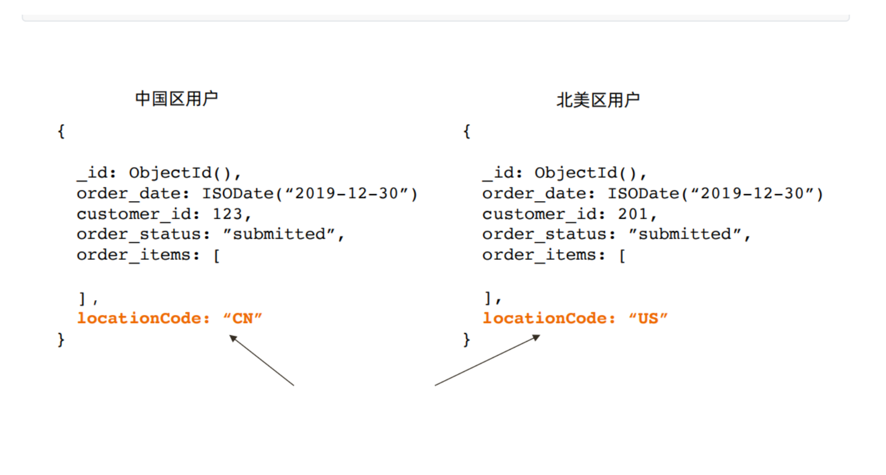

```shell
sh.addShardTag("CN_sh", "ASIA")
sh.addShardTag("US_sh", "AMERICA")
sh.addTagRange( "crm.orders", { "locationCode" : "CN", "order_id" : MinKey
},
{ "locationCode" : "CN", "order_id" : MaxKey } ,
"ASIA" )
sh.addTagRange( "crm.orders",
{ "locationCode" : "US", "order_id" : MinKey },
{ "locationCode" : "US", "order_id" : MaxKey } ,
"AMERICA" )
sh.addTagRange( "crm.orders",
{ "locationCode" : "CA", "order_id" : MinKey },
{ "locationCode" : "CA", "order_id" : MaxKey } ,
"AMERICA" )
```

# **<font style="color:rgb(51,51,51);">7. MongoDB 备份与恢复及迁移 </font>**
## **<font style="color:rgb(51,51,51);">7.1 备份恢复工具介绍：</font>**
```shell
（1）** mongoexport/mongoimport
（2）***** mongodump/mongorestore
```

## **<font style="color:rgb(51,51,51);">7.2 备份工具区别在哪里？</font>**
```shell
mongoexport/mongoimport 导入/导出的是JSON格式或者CSV格式，
mongodump/mongorestore导入/导出的是BSON格式。
应用场景:
mongoexport/mongoimport:json csv
1、异构平台迁移 mysql <---> mongodb
2、同平台，跨大版本：mongodb 2 ----> mongodb 3
mongodump/mongorestore
日常备份恢复时使用.
```

## **<font style="color:rgb(51,51,51);">7.3 导出工具mongoexport</font>**
```shell
Mongodb中的mongoexport工具可以把一个collection导出成JSON格式或CSV格式的文件。
可以通过参数指定导出的数据项，也可以根据指定的条件导出数据。
（1）版本差异较大
（2）异构平台数据迁移
mongoexport具体用法如下所示：
$ mongoexport --help
参数说明：
-h:指明数据库宿主机的IP
-u:指明数据库的用户名
-p:指明数据库的密码
-d:指明数据库的名字
-c:指明collection的名字
-f:指明要导出那些列
-o:指明到要导出的文件名
-q:指明导出数据的过滤条件
--authenticationDatabase admin
1.单表备份至json格式
use test
for(i=0;i<10000;i++){
db.log.insert({"uid":i,"name":"mongodb","age":6,"date":new Date()}); }
mongoexport -uroot -proot123 --port 27017 --authenticationDatabase admin -d
test -c log -o /mongodb/log.json
注：备份文件的名字可以自定义，默认导出了JSON格式的数据。
2. 单表备份至csv格式
如果我们需要导出CSV格式的数据，则需要使用--type=csv参数：
mongoexport -uroot -proot123 --port 27017 --authenticationDatabase admin -
d test -c log --type=csv -f uid,name,age,date -o /mongodb/log.csv
```

## **<font style="color:rgb(51,51,51);">7.4 导入工具mongoimport</font>**
```shell
Mongodb中的mongoimport工具可以把一个特定格式文件中的内容导入到指定的collection中。该
工具可以导入JSON格式数据，也可以导入CSV格式数据。具体使用如下所示：
$ mongoimport --help
参数说明：
-h:指明数据库宿主机的IP
-u:指明数据库的用户名
-p:指明数据库的密码
-d:指明数据库的名字
-c:指明collection的名字
-f:指明要导入那些列
-j, --numInsertionWorkers=<number> number of insert operations to run
concurrently (defaults to
1)
//并行
数据恢复:
1.恢复json格式表数据到log1
mongoimport -uroot -proot123 --port 27017 --authenticationDatabase admin -d
test -c log1 /mongodb/log.json
2.恢复csv格式的文件到log2
上面演示的是导入JSON格式的文件中的内容，如果要导入CSV格式文件中的内容，则需要通过--type
参数指定导入格式，具体如下所示：
错误的恢复
注意：
（1）csv格式的文件头行，有列名字
mongoimport -uroot -proot123 --port 27017 --authenticationDatabase admin
-d test -c log2 --type=csv --headerline --file /mongodb/log.csv
（2）csv格式的文件头行，没有列名字
mongoimport -uroot -proot123 --port 27017 --authenticationDatabase admin
-d test -c log3 -j 4 --type=csv -f id,name,age,date --file
/mongodb/log.csv
--headerline:指明第一行是列名，不需要导入。
3. 异构平台迁移案例
mysql -----> mongodb
world数据库下city表进行导出，导入到mongodb
（1）mysql开启安全路径
vim /etc/my.cnf --->添加以下配置
secure-file-priv=/data/backup/
--重启数据库生效
/etc/init.d/mysqld restart
（2）导出mysql的city表数据
select * from test.t100w into outfile '/tmp/t100w.csv' fields terminated by
',' ENCLOSED BY '"' ;
（3）获取列信息
mysql> select table_name,group_concat(column_name) from
information_schema.columns where table_schema='test' group by table_name
order by null ;
+------------+---------------------------+
| TABLE_NAME | group_concat(column_name) |
+------------+---------------------------+
| t100w | dt,id,k1,k2,num |
+------------+---------------------------+
1 row in set (0.07 sec)
(4)在mongodb中导入备份
mongoimport -uroot -proot123 --port 27017 --authenticationDatabase admin -d
test -c t100w --type=csv -f id,num，k1,k2,,dt --file /tmp/t100w.csv
use world
db.t100w.find({});
4. 彩蛋————如何将MySQL大量表迁移到MongoDB
痛点：
（1） 批量从MySQL导出多张表
mysqldump --fields-terminated-by ',' --fields-enclosed-by '"' world -T
/tmp/
cd /data/backup
rm -rf /data/backup/*.sql
find ./ -name "*.txt" | awk -F "." '{print $2}' | xargs -i -t mv ./{}.txt
./{}.csv
(2) 拼接语句
select concat("mongoimport -uroot -proot123 --port 27017 --
authenticationDatabase admin -d ",table_schema, " -c ",table_name ," --
type=csv "," -f ", group_concat(column_name) ," --file
/data/backup/",table_name ,".csv")
from information_schema.columns where table_schema='world' group by
table_name;
(3) 导入数据
[mongod@db01 backup]$ ll
total 256
-rwxrwxrwx 1 mysql mysql 184355 Jul 22 13:45 city.csv
-rwxrwxrwx 1 mysql mysql 38659 Jul 22 13:45 country.csv
-rwxrwxrwx 1 mysql mysql 26106 Jul 22 13:45 countrylanguage.csv
-rwxrwxrwx 1 mysql mysql 656 Jul 22 13:45 import.sh
[mongod@db01 backup]$ sh import.sh
```

## **<font style="color:rgb(51,51,51);">7.5 mongodump和mongorestore </font>**
**<font style="color:rgb(51,51,51);">a. 介绍</font>**

```shell
mongodump能够在Mongodb运行时进行备份，它的工作原理是对运行的Mongodb做查询，然后将所有查
到的文档写入磁盘。但是存在的问题时使用mongodump产生的备份不一定是数据库的实时快照，如果我
们在备份时对数据库进行了写入操作，则备份出来的文件可能不完全和Mongodb实时数据相等。另外在备
份时可能会对其它客户端性能产生不利的影响。
```

**<font style="color:rgb(51,51,51);">b. mongodump参数</font>**

```shell
$ mongodump --help
参数说明：
-h:指明数据库宿主机的IP
-u:指明数据库的用户名
-p:指明数据库的密码
-d:指明数据库的名字
-c:指明collection的名字
-o:指明到要导出的文件名
-q:指明导出数据的过滤条件
-j, --numParallelCollections= number of collections to dump in parallel (4
by default)
--oplog 备份的同时备份oplog
```

**<font style="color:rgb(51,51,51);">c. mongodump和mongorestore基本使用</font>**

```shell
全库备份
mkdir /mongodb/backup -p
mongodump -uroot -proot123 --port 27017 --authenticationDatabase admin -o
/mongodb/backup
--备份world库
$ mongodump -uroot -proot123 --port 27017 --authenticationDatabase admin
-d test -o /mongodb/backup/
--备份test库下的log集合
$ mongodump -uroot -proot123 --port 27017 --authenticationDatabase admin
-d test -c log -o /mongodb/backup/
--压缩备份
$ mongodump -uroot -proot123 --port 27017 --authenticationDatabase admin
-d abc -o /mongodb/backup/ --gzip
mongodump -uroot -proot123 --port 27017 --authenticationDatabase admin -
o /mongodb/backup/ --gzip
$ mongodump -uroot -proot123 --port 27017 --authenticationDatabase admin
-d app -c vast -o /mongodb/backup/ --gzip
--全备中恢复单库
$ mongorestore -uroot -proot123 --port 27017 --authenticationDatabase
admin -d world1 /mongodb/backup/world
--全备中恢复单表
[mongod@db01 backup]$ mongorestore -uroot -proot123 --port 27017 --
authenticationDatabase admin -d a -c t1 /mongodb/backup/world/t5.bson.gz
--gzip
--drop表示恢复的时候把之前的集合drop掉(危险)
$ mongorestore -uroot -proot123 --port 27017 --authenticationDatabase
admin -d test --drop /mongodb/backup/test
```

**<font style="color:rgb(51,51,51);">d. mongodump和mongorestore高级企业应用（--oplog）</font>**

```shell
注意：这是replica set模式专用
--oplog
use oplog for taking a point-in-time snapshot
# oplog介绍
在replica set中oplog是一个定容集合（capped collection），它的默认大小是磁盘空间的
5%（可以通过--oplogSizeMB参数修改）.
位于local库的db.oplog.rs，有兴趣可以看看里面到底有些什么内容。
其中记录的是整个mongod实例一段时间内数据库的所有变更（插入/更新/删除）操作。
当空间用完时新记录自动覆盖最老的记录。
其覆盖范围被称作oplog时间窗口。需要注意的是，因为oplog是一个定容集合，
所以时间窗口能覆盖的范围会因为你单位时间内的更新次数不同而变化。
想要查看当前的oplog时间窗口预计值，可以使用以下命令：
mongod -f /mongodb/28017/conf/mongod.conf
mongod -f /mongodb/28018/conf/mongod.conf
mongod -f /mongodb/28019/conf/mongod.conf
mongod -f /mongodb/28020/conf/mongod.conf
use local
db.oplog.rs.find().pretty()
"ts" : Timestamp(1553597844, 1),
"op" : "n"
"o" :
"i": insert
"u": update
"d": delete
"c": db cmd
test:PRIMARY> rs.printReplicationInfo()
configured oplog size: 1561.5615234375MB <--集合大小
log length start to end: 423849secs (117.74hrs) <--预计窗口覆盖时间
oplog first event time: Wed Sep 09 2015 17:39:50 GMT+0800 (CST)
oplog last event time: Mon Sep 14 2015 15:23:59 GMT+0800 (CST)
now: Mon Sep 14 2015 16:37:30 GMT+0800 (CST)
# oplog企业级应用
（1）实现热备，在备份时使用--oplog选项
注：为了演示效果我们在备份过程，模拟数据插入
（2）准备测试数据
use test
for(var i = 1 ;i < 100; i++) {
db.foo.insert({a:i});
}
my_repl:PRIMARY> db.oplog.rs.find({"op":"i"}).pretty()
oplog 配合mongodump实现热备
mongodump --port 28017 --oplog -o /mongodb/backup
作用介绍：--oplog 会记录备份过程中的数据变化。会以oplog.bson保存下来
恢复
mongorestore --port 28017 --oplogReplay /mongodb/backup
!!!!!!!!!!oplog高级应用 ==========binlog应用
背景：每天0点全备，oplog恢复窗口为48小时
某天，上午10点world.city 业务表被误删除。
恢复思路：
0、停应用
2、找测试库
3、恢复昨天晚上全备
4、截取全备之后到world.city误删除时间点的oplog，并恢复到测试库
5、将误删除表导出，恢复到生产库l
恢复步骤：
模拟故障环境：
1、全备数据库
模拟原始数据
mongo --port 28017
use wo
for(var i = 1 ;i < 20; i++) {
db.ci.insert({a: i});
}
全备:
rm -rf /mongodb/backup/*
mongodump --port 28017 --oplog -o /mongodb/backup
--oplog功能:在备份同时,将备份过程中产生的日志进行备份
文件必须存放在/mongodb/backup下,自动命令为oplog.bson
再次模拟数据
db.ci1.insert({id:1})
db.ci2.insert({id:2})
2、上午10点：删除wo库下的ci表
10:00时刻,误删除
db.ci.drop()
show tables;
3、备份现有的oplog.rs表
mongodump --port 28017 -d local -c oplog.rs -o /mongodb/backup
4、截取oplog并恢复到drop之前的位置
更合理的方法：登陆到原数据库
[mongod@db03 local]$ mongo --port 28017
my_repl:PRIMARY> use local
db.oplog.rs.find({op:"c"}).pretty();
{
"ts" : Timestamp(1600489082, 1),
"t" : NumberLong(1),
"h" : NumberLong(0),
"v" : 2,
"op" : "c",
"ns" : "wo.$cmd",
"ui" : UUID("875f2a41-57e3-4b6b-b738-469fad032b18"),
"o2" : {
"numRecords" : 19
},
"wall" : ISODate("2020-09-19T04:18:02.717Z"),
"o" : {
"drop" : "ci"
}
}
获取到oplog误删除时间点位置:
1600489082, 1
5、恢复备份+应用oplog
[mongod@db03 backup]$ cd /mongodb/backup/local/
[mongod@db03 local]$ ls
oplog.rs.bson oplog.rs.metadata.json
[mongod@db03 local]$ cp oplog.rs.bson ../oplog.bson
rm -rf /mongodb/backup/local/
mongorestore --port 28017 --oplogReplay --oplogLimit "1600489082:1" --
drop /mongodb/backup/
6. 分片集群的备份思路
6.1 需要备份的数据
shard 、 configserver
6.2 痛点
chunk 迁移 ，关闭或者调整balancer时间窗口
备份出来的数据时间不一致。
6.3
a.使用Ops Manager
b.
balancer 关闭--->
同一时刻config、shard其中一个节点脱离集群--->
开始备份节点数据 --->
把节点恢复到集群
PSS
PSA
```

# **<font style="color:rgb(51,51,51);">9. MongoDB 监控实践 </font>**
## **<font style="color:rgb(51,51,51);">9.1 常用的监控工具及手段</font>**
<font style="color:rgb(51,51,51);">• MongoDB Ops Manager </font>

<font style="color:rgb(51,51,51);">• Percona </font>

<font style="color:rgb(51,51,51);">• </font><font style="color:rgb(51,51,51);">通用监控平台 </font>

<font style="color:rgb(51,51,51);">• 程序脚本</font>

## **<font style="color:rgb(51,51,51);">9.2 如何获取监控数据</font>**
<font style="color:rgb(51,51,51);">监控信息的来源： </font>

<font style="color:rgb(51,51,51);">• db.serverStatus()</font><font style="color:rgb(51,51,51);">（主要） </font>

<font style="color:rgb(51,51,51);">• db.isMaster()</font><font style="color:rgb(51,51,51);">（次要） </font>

<font style="color:rgb(51,51,51);">• mongostats </font><font style="color:rgb(51,51,51);">命令行工具（只有部分信息） </font>

<font style="color:rgb(51,51,51);">说明：db.serverStatus() 包含的监控信息是从上次开机到现在为止的累计数据.</font>

## **<font style="color:rgb(51,51,51);">9.3 serverStatus() Output</font>**
```shell
• host
• version
• process
• pid
• uptime
• uptimeMillis
• uptimeEstimate
• localTime
• asserts
• connections
• electionMetrics
• extra_info
• flowControl
• freeMonitoring
• flowControl
• freeMonitoring
• globalLock
• locks
• network
• opLatencies
• opReadConcernCounters
• opcounters
• opcountersRepl
• oplogTruncation
• repl
• storageEngine
• tcmalloc
• trafficRecording
• transactions
• transportSecurity
• wiredTiger
```

## **<font style="color:rgb(51,51,51);">9.4 serverStatus() 主要信息</font>**
```shell
• connections: 关于连接数的信息；
• locks: 关于 MongoDB 使用的锁情况；
• network: 网络使用情况统计；
• opcounters: CRUD 的执行次数统计；
• repl: 复制集配置信息；
• wiredTiger: 包含大量 WirdTiger 执行情况的信息：
block-manager: WT 数据块的读写情况；
session: session 使用数量；
concurrentTransactions: Ticket 使用情况；
• mem: 内存使用情况；
• metrics: 一系列性能指标统计信息；
```

## **<font style="color:rgb(51,51,51);">9.5 监控报警的考量</font>**
```shell
• 具备一定的容错机制以减少误报的发生；
• 总结应用各指标峰值；
• 适时调整报警阈值；
• 留出足够的处理时间；
```

## **<font style="color:rgb(51,51,51);">9.6 建议监控指标说明</font>**
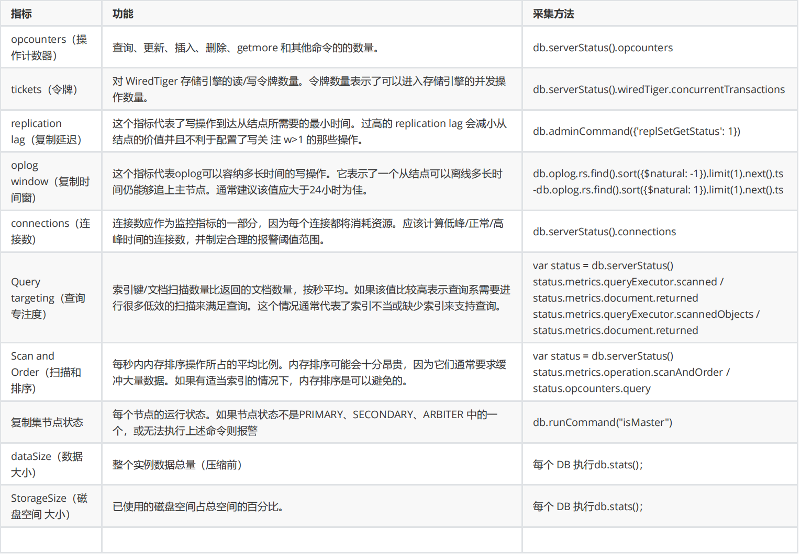

# **<font style="color:rgb(51,51,51);">10.MongoDB 索引管理 </font>**
## **<font style="color:rgb(51,51,51);">10.1 Index/Key/DataPage——索引/键/数据页？</font>**


## **<font style="color:rgb(51,51,51);">10.2 Covered Query</font>**


## **<font style="color:rgb(51,51,51);">10.3 IXSCAN/COLLSCAN</font>**


## **<font style="color:rgb(51,51,51);">10.4 复合索引</font>**
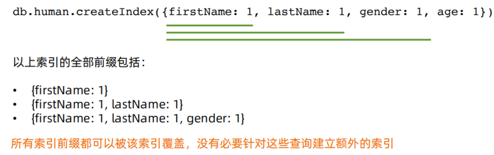

## **<font style="color:rgb(51,51,51);">10.5 Selectivity——过滤性</font>**
```shell
在一个有10000条记录的集合中：
• 满足 gender= F 的记录有4000 条
• 满足 city=LA 的记录有 100 条
• 满足 ln=‘parker’ 的记录有 10 条
查询条件：
ln=10 city=SZ gender=F
条件 ln 能过滤掉最多的数据，city
其次，gender 最弱。
所以 ln 的过滤性（selectivity）> city > gender。

```

## **<font style="color:rgb(51,51,51);">10.6 获取执行计划</font>**


## **<font style="color:rgb(51,51,51);">10.7 优化后的执行计划</font>**
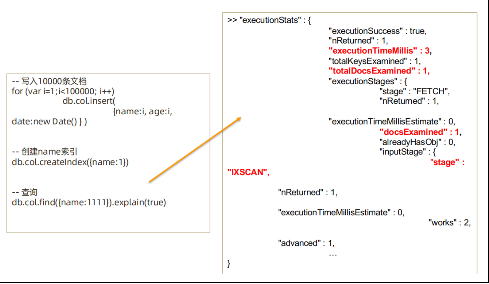

## **<font style="color:rgb(51,51,51);">10.8 组合索引的最佳方式：ESR原则</font>**
```shell
组合索引的最佳方式：ESR原则
• 精确（Equal）匹配的字段放最前面
• 排序（Sort）条件放中间
• 范围（Range）匹配的字段放最后面
同样适用： ES, ER
请看一下查询条件：
db.members.find({ gender: “F”， age: {$gte: 18}}).sort(“join_date:1”)
{ gender: 1, age: 1, join_date: 1 }
{ gender: 1, join_date:1, age: 1 }
{ join_date: 1, gender: 1, age: 1 }
{ join_date: 1, age: 1, gender: 1 }
{ age: 1, join_date: 1, gender: 1}
{ age: 1, gender: 1, join_date: 1}
这么多候选的，用哪一个？
```

## **<font style="color:rgb(51,51,51);">10.9 部分索引</font>**
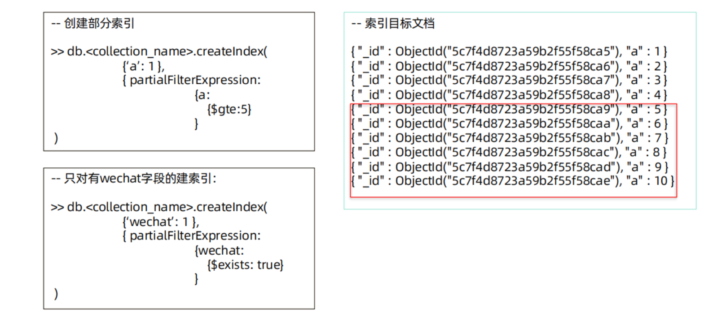

# **<font style="color:rgb(51,51,51);">11.MongoDB 性能诊断 </font>**
## **<font style="color:rgb(51,51,51);">11.1 问题诊断工具 - mongostat</font>**
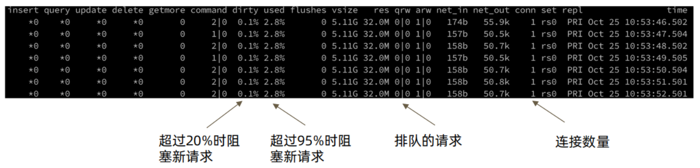

```shell
主要关注点：
dirty：
内存中的脏页数量百分比。默认在5%以下，每分钟在后台刷盘；超过5%后台进程频繁刷盘，超过20%会阻
止新请求。
used：
分配给mongodb的内存使用的百分比。低于80%,不会触发内存回收,超过80%,触发LRU回收内存，默认
超过95%会阻止新请求。
qrw: 排队的请求数量，超过10以上，需要关注下积压的操作是什么（慢查询、锁等）。
```

## **<font style="color:rgb(51,51,51);">11.2 问题诊断工具 - mongotop</font>**
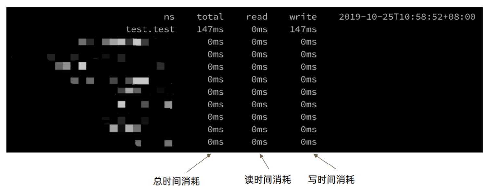

## **<font style="color:rgb(51,51,51);">11.3 问题诊断 – mongod 慢日志</font>**
```shell
配置方法：
方法一：启动命令行
启动MongoDB时加上--profile=级别
方法二：配置文件
operationProfiling:
mode: slowOp
slowOpThresholdMs： 10
方法三：在线配置
db.setProfilingLevel(2);
db.setProfilingLevel( 1 , 10 );
上面profile的级别可以取0，1，2 三个值，他们表示的意义如下：
0 – 不开启
1 – 记录慢命令 (默认为>100ms)
2 – 记录所有命令
查询 Profiling 记录 ：
列出执行时间长于某一限度(100 ms)的 Profile 记录：
db.system.profile.find( { millis : { $gt : 100 } } )
说明： mongod的日志也会记录慢日志信息，会更加详细。如下面例子：
```

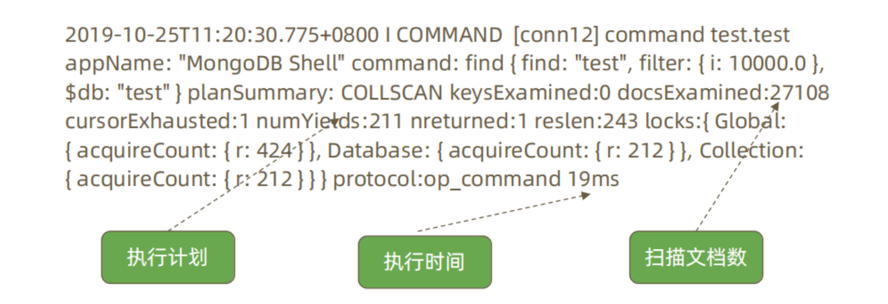

# **<font style="color:rgb(51,51,51);">12. MongoDB的生产上线及版本升级 </font>**
## **<font style="color:rgb(51,51,51);">12.1 上线前：性能测试</font>**
```shell
模拟真实压力，对集群完成充分的性能测试，了解集群概况。
性能测试的输出：
• 压测过程中各项指标表现，例如 CRUD 达到多少，连接数达到多少等。
• 根据正常指标范围配置监控阈值；
• 根据压测结果按需调整硬件资源；
```

## **<font style="color:rgb(51,51,51);">12.2 上线前：环境检查</font>**
```shell
按照最佳实践要求对生产环境所使用的操作系统进行检查和调整。最常见的需要调整的参数包括：
• 禁用 NUMA，否则在某些情况下会引起突发大量swap交换；
• 禁用 Transparent Huge Page，否则会影响数据库效率；
• tcp_keepalive_time 调整为120秒，避免一些网络问题；
• ulimit -n，避免打开文件句柄不足的情况；
• 关闭 atime，提高数据文件访问效率；
```

## **<font style="color:rgb(51,51,51);">12.3 上线后</font>**
```shell
性能监控
为防止突发状况，应对常见性能指标进行监控以及时发现问题。
性能监控请参考前述章节的内容
定期健康检查
● mongod 日志；
● 环境设置是否有变动；
● MongoDB 配置是否有变动；
```

## **<font style="color:rgb(51,51,51);">12.4 MongoDB 版本发布规律</font>**


## **<font style="color:rgb(51,51,51);">12.5 主版本升级流程</font>**
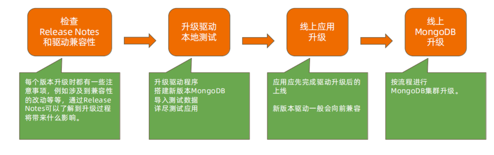

```shell
参考 ： https://docs.mongodb.com/ecosystem/drivers/driver-compatibilityreference/
```

## **<font style="color:rgb(51,51,51);">12.6 MongoDB 单机升级流程</font>**


```shell
# 升级模拟4.0.18升级4.2.8版本
1. 安装高版本软件至/data/app/mongodb
2. 停低版本实例
[mongod@db01 ~]$ /opt/mongodb/bin/mongod -f /data/mongo40/conf/mongo.conf -
-shutdown
killing process with pid: 4860
3. 启动后自动升级
[mongod@node01 ~]$ mongod -f /mongodb/conf/mongo.conf
about to fork child process, waiting until server is ready for connections.
forked process: 6376
child process started successfully, parent exiting
4. 检测版本
> db.version()
4.2.8
5. 切换FCV
> db.adminCommand( { setFeatureCompatibilityVersion: "4.2" } )
{ "ok" : 1 }
> db.adminCommand( { getParameter: 1, featureCompatibilityVersion: 1 } )
{ "featureCompatibilityVersion" : { "version" : "4.2" }, "ok" : 1 }
```

## **<font style="color:rgb(51,51,51);">12.7 MongoDB 复制集升级流程</font>**
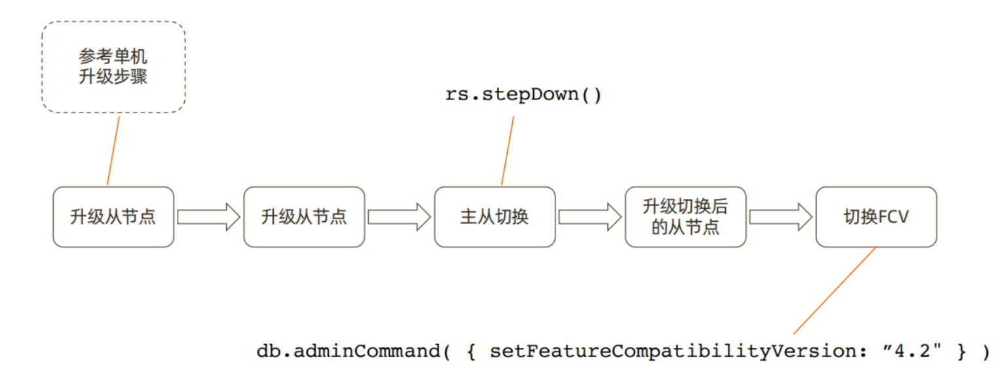

```shell
1、升级从节点
如单机升级步骤。
2、将主节点身份切换并升级
rs.stepdown()
升级步骤如单机升级流程。
3、切换FCV
> db.adminCommand( { getParameter: 1, featureCompatibilityVersion: 1 } )
> db.adminCommand( { setFeatureCompatibilityVersion: "4.4" } )
{ "ok" : 1 }
> db.adminCommand( { getParameter: 1, featureCompatibilityVersion: 1 } )
{ "featureCompatibilityVersion" : { "version" : "4.4" }, "ok" : 1 }
```

## **<font style="color:rgb(51,51,51);">12.8 MongoDB 分片集群升级流程</font>**
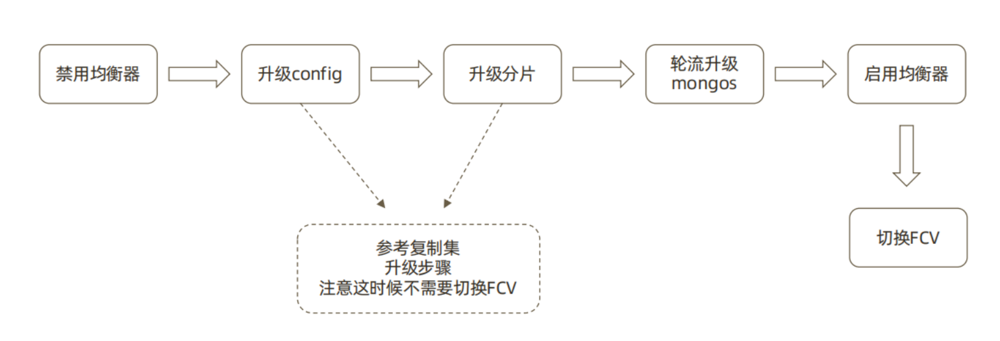

```shell
1、禁用均衡器
sh.stopBalancer()
2、升级config（从-->主）
参考复制集升级过程
3、升级分片
参考复制集升级过程
4、升级mongos(建议多个mongos)
轮流升级
5. 启动均衡器
sh.startBalancer()
```

## **<font style="color:rgb(51,51,51);">12.9 版本升级：在线升级注意</font>**
```shell
MongoDB支持在线升级，即升级过程中不需要间断服务；
升级过程中虽然会发生主从节点切换，存在短时间不可用，但是：
• 3.6版本开始支持自动写重试可以自动恢复主从切换引起的集群暂时不可写；
• 4.2开始支持的自动读重试则提供了包括主从切换在内的读问题的自动恢复；
升级需要逐版本完成，不可以跳版本：
• 正确：3.2->3.4->3.6->4.0->4.2
• 错误：3.2->4.2
原因：
• MongoDB复制集仅仅允许相邻版本共存
• 有一些升级内部数据格式如密码加密字段，需要在升级过程中由mongo进行转换
```

## **<font style="color:rgb(51,51,51);">12.10 降级</font>**
```shell
• 如果升级无论因何种原因失败，则需要降级到原有旧版本。在降级过程中：
• 滚动降级过程中集群可以保持在线，仅在切换节点时会产生一定的不可写时间；
• 降级前应先去除已经用到的新版本特性。例如：用到了 NumberDecimal 则应把所有使用
NumberDecimal 的文档先去除该字段；
• 通过设置 FCV（Feature Compatibility Version）可以在功能上降到与旧版本兼容；
• FCV 设置完成后再滚动替换为旧版本。
```

# **<font style="color:rgb(51,51,51);">13、异构平台在线迁移 </font>**
## **<font style="color:rgb(51,51,51);">13.1 为什么要迁移至MongoDB </font>**
### **<font style="color:rgb(51,51,51);">13.1.1 MongoDB数据库定位</font>**
```shell
● OLTP /OLAP 数据库
● 原则上 Oracle 和 MySQL 能做的事情，MongoDB 都能做（包括 ACID 事务）
● 优点：横向扩展能力，数据量或并发量增加时候架构可以自动扩展
● 优点：灵活模型，适合迭代开发，数据模型多变场景
● 优点：JSON 数据结构，适合微服务/REST API
```

### **<font style="color:rgb(51,51,51);">13.1.2 基于功能选择 MongoDB</font>**


### **<font style="color:rgb(51,51,51);">13.1.3 基于场景选择 MongoDB</font>**


## **<font style="color:rgb(51,51,51);">13.2 迁移痛点</font>**
```shell
关系型到关系型 – 相对简单
• Oracle -> MySQL, Oracle – PostgreSQL
关系型到文档型 – 相对复杂
• Oracle -> MongoDB
需要考虑：
• 总体架构 (从单体式到分布式）
• 模式设计（从关系模型到文档模型）
• SQL 语句 / 存储过程 / JDBC / ORM
• 数据迁移 （如何处理已有数据？）
```

**<font style="color:rgb(51,51,51);">单点到分布式</font>**

**<font style="color:rgb(51,51,51);">模式转换</font>****<font style="color:rgb(51,51,51);">迁移主流程</font>**


```shell
RDBMS:
• 存储过程
• 运维工具、脚本
• 权限设置
• 数据库监控备份及恢复
Storage:
• 典型的关系型数据库部署在 SAN 上
• MongoDB支持 SAN, 但是使用本地存储
• 可以最大化的提高性能
JDBC:
MongoDB 没有原生态 JDBC, 而是采用自带的驱动程序：
• 自带连接池管理
• 事务支持
SQL/RS:
MongoDB 不支持SQL的增删改，结果集也不是 ResultSet
等..
```

## **<font style="color:rgb(51,51,51);">13.3 DBA主要关注--数据迁移 </font>**
**<font style="color:rgb(51,51,51);">迁移方式</font>**

```shell
• 数据库导出+导入
• 批量迁移工具
• 实时同步工具
• 应用主导迁移
```

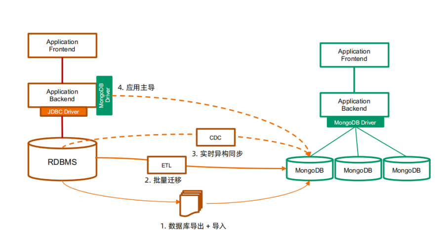

**<font style="color:rgb(51,51,51);">各种迁移方式的特点</font>**

```shell
1. 数据库导出导入
步骤：
- 停止现有的基于 RDBMS 的应用
- 使用 RDBMS 的数据库导出工具，将数据库表导出到 CSV 或者 JSON（如 mysqldump） - 使用
mongoimport 将 CSV 或者 JSON 文件导入 MongoDB 数据库
- 启动新的 MongoDB 应用
备注：
- 适用于一次性数据迁移
- 需要应用/数据库下线，较长的下线时间
2. 批量同步
步骤：
- 安装同步工具（如 Kettle / Talend）
- 创建输入源（关系型数据库）
- 创建输出源（MongoDB） - 编辑数据同步任务
- 执行
备注：
- 适用批量同步，定期更新, 特别是每晚跑批的场景
- 支持基于时间戳的增量同步，需要源表有合适的时间戳支持
- 对源库有较明显的性能影响，不宜频繁查询
- 不支持实时同步
3. 实时同步
步骤：
- 安装实时同步工具（如Informatica / Tapdata）
- 创建输入源（关系型数据库）
- 创建输出源（MongoDB） - 编辑实时数据同步任务
- 执行
备注：
- 基于源库的日志文件解析机制，可以实现秒级数据的同步
- 对源库性能影响较小
- 可以支持应用的无缝迁移
4. 应用主导迁移
步骤：
1. 升级已有应用支持 MongoDB
2. 数据插入请求直接进入 MongoDB
3. 数据查询和更新请求首先定向到 MongoDB
4. 如果记录不存在，从 RDBMS 读出来并写入到 MongoDB
5. 重复步骤3
6. 当步骤4在限定时间段（一星期、一个月）没有被调用，认为迁移完成
备注：
- 需要研发团队配合 ，有一定开发和测试量
- 为保证不遗漏数据，仍然先要执行一次批量同步
```

## **<font style="color:rgb(51,51,51);">13.4 实时同步方案-TPDATA应用</font>**
**<font style="color:rgb(51,51,51);"></font>**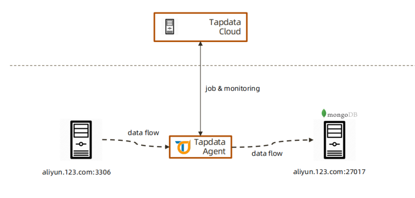

