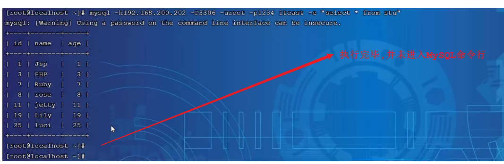

# **<font style="color:rgb(52,73,94);">1. 存储引擎</font>**
## **<font style="color:rgb(52,73,94);">1.1 MySQL体系结构</font>**
   
1). 连接层

最上层是一些客户端和链接服务，包含本地sock 通信和大多数基于客户端/服务端工具实现的类似于

TCP/IP的通信。主要完成一些类似于连接处理、授权认证、及相关的安全方案。在该层上引入了线程

池的概念，为通过认证安全接入的客户端提供线程。同样在该层上可以实现基于SSL的安全链接。服务

器也会为安全接入的每个客户端验证它所具有的操作权限。

2). 服务层

第二层架构主要完成大多数的核心服务功能，如SQL接口，并完成缓存的查询，SQL的分析和优化，部

分内置函数的执行。所有跨存储引擎的功能也在这一层实现，如  过程、函数等。在该层，服务器会解

析查询并创建相应的内部解析树，并对其完成相应的优化如确定表的查询的顺序，是否利用索引等，

最后生成相应的执行操作。如果是select语句，服务器还会查询内部的缓存，如果缓存空间足够大，

这样在解决大量读操作的环境中能够很好的提升系统的性能。

3). 引擎层

存储引擎层，  存储引擎真正的负责了MySQL中数据的存储和提取，服务器通过API和存储引擎进行通

信。不同的存储引擎具有不同的功能，这样我们可以根据自己的需要，来选取合适的存储引擎。数据库

中的索引是在存储引擎层实现的。

4). 存储层

数据存储层，  主要是将数据(如: redolog、undolog、数据、索引、二进制日志、错误日志、查询

日志、慢查询日志等)存储在文件系统之上，并完成与存储引擎的交互。

和其他数据库相比，MySQL有点与众不同，它的架构可以在多种不同场景中应用并发挥良好作用。主要体现在存储引擎上，插件式的存储引擎架构，将查询处理和其他的系统任务以及数据的存储提取分离。

这种架构可以根据业务的需求和实际需要选择合适的存储引擎。

## **<font style="color:rgb(52,73,94);">1.2 存储引擎介绍</font>**


大家可能没有听说过存储引擎，但是一定听过引擎这个词，引擎就是发动机，是一个机器的核心组件。

比如，对于舰载机、直升机、火箭来说，他们都有各自的引擎，是他们最为核心的组件。而我们在选择

引擎的时候，需要在合适的场景，选择合适的存储引擎，就像在直升机上，我们不能选择舰载机的引擎

一样。

而对于存储引擎，也是一样，他是mysql数据库的核心，我们也需要在合适的场景选择合适的存储引

擎。接下来就来介绍一下存储引擎。

存储引擎就是存储数据、建立索引、更新/查询数据等技术的实现方式  。存储引擎是基于表的，而不是

基于库的，所以存储引擎也可被称为表类型。我们可以在创建表的时候，来指定选择的存储引擎，如果

没有指定将自动选择默认的存储引擎。

### 1). 建表时指定存储引擎
```sql
CREATE TABLE  表名(
  字段1  字段1类型    [ COMMENT  字段1注释 ] ,
  ......
  字段n  字段n类型    [COMMENT  字段n注释 ]
) ENGINE = INNODB   [ COMMENT  表注释 ] ;
```

### 2). 查询当前数据库支持的存储引擎
```sql
show engines;
```

**<font style="color:rgb(52,73,94);">示例演示: </font>** <font style="color:rgb(52,73,94);">A. 查询建表语句 --- 默认存储引擎: InnoDB</font> 

```sql
show create table account;
```


我们可以看到，创建表时，即使我们没有指定存储疫情，数据库也会自动选择默认的存储引擎。

B. 查询当前数据库支持的存储引擎

```sql
show engines ;
```

C. 创建表  my_myisam , 并指定MyISAM存储引擎

```sql
create table my_myisam(
id int,
name varchar(10)
) engine = MyISAM ;

```

<font style="color:rgb(52,73,94);">D. 创建表 my_memory , 指定Memory存储引擎</font> 

```sql
create table my_memory(
id int,
name varchar(10)
) engine = Memory ;

```

## **<font style="color:rgb(52,73,94);">1.3 存储引擎特点</font>**
<font style="color:rgb(52,73,94);">上面我们介绍了什么是存储引擎，以及如何在建表时如何指定存储引擎，接下来我们就来介绍下来上面 </font><font style="color:rgb(52,73,94);">重点提到的三种存储引擎 InnoDB、MyISAM、Memory的特点。</font> 

### 1.3.1 InnoDB
#### 1). 介绍
InnoDB是一种兼顾高可靠性和高性能的通用存储引擎，在  MySQL 5.5 之后，InnoDB是默认的

MySQL 存储引擎。

#### 2). 特点
DML操作遵循ACID模型，支持事务；

行级锁，提高并发访问性能；

支持外键FOREIGN KEY约束，保证数据的完整性和正确性；

#### 3). 文件
xxx.ibd：xxx代表的是表名，innoDB引擎的每张表都会对应这样一个表空间文件，存储该表的表结

构（frm-早期的  、sdi-新版的）、数据和索引。

参数：innodb_file_per_table

```sql
show variables like 'innodb_file_per_table';
```


<font style="color:rgb(52,73,94);">如果该参数开启，代表对于InnoDB引擎的表，每一张表都对应一个ibd文件。 我们直接打开MySQL的 </font><font style="color:rgb(52,73,94);">数据存放目录： C:\ProgramData\MySQL\MySQL Server 8.0\Data ， 这个目录下有很多文件 </font><font style="color:rgb(52,73,94);">夹，不同的文件夹代表不同的数据库，我们直接打开itcast文件夹</font>  


可以看到里面有很多的ibd文件，每一个ibd文件就对应一张表，比如：我们有一张表  account，就

有这样的一个account.ibd文件，而在这个ibd文件中不仅存放表结构、数据，还会存放该表对应的

索引信息。  而该文件是基于二进制存储的，不能直接基于记事本打开，我们可以使用mysql提供的一

个指令  ibd2sdi ，通过该指令就可以从ibd文件中提取sdi信息，而sdi数据字典信息中就包含该表

的表结构。


<font style="color:rgb(52,73,94);">4). 逻辑存储结构</font>  


表空间  : InnoDB存储引擎逻辑结构的最高层，ibd文件其实就是表空间文件，在表空间中可以

包含多个Segment段。

段  : 表空间是由各个段组成的，  常见的段有数据段、索引段、回滚段等。InnoDB中对于段的管

理，都是引擎自身完成，不需要人为对其控制，一个段中包含多个区。

区  : 区是表空间的单元结构，每个区的大小为1M。  默认情况下，  InnoDB存储引擎页大小为

16K，  即一个区中一共有64个连续的页。

页  : 页是组成区的最小单元，页也是InnoDB 存储引擎磁盘管理的最小单元，每个页的大小默

认为  16KB。为了保证页的连续性，InnoDB 存储引擎每次从磁盘申请  4-5 个区。

行  : InnoDB 存储引擎是面向行的，也就是说数据是按行进行存放的，在每一行中除了定义表时

所指定的字段以外，还包含两个隐藏字段(后面会详细介绍)。

### **<font style="color:rgb(52,73,94);">1.3.2 MyISAM</font>**
#### 1). 介绍
MyISAM是MySQL早期的默认存储引擎。

#### 2). 特点
不支持事务，不支持外键

支持表锁，不支持行锁

访问速度快

#### 3). 文件
<font style="color:rgb(52,73,94);">xxx.sdi：存储表结构信息 </font><font style="color:rgb(52,73,94);">xxx.MYD: 存储数据 </font><font style="color:rgb(52,73,94);">xxx.MYI: 存储索引</font>  


### **<font style="color:rgb(52,73,94);">1.3.3 Memory</font>**
#### 1). 介绍
<font style="color:rgb(52,73,94);">Memory引擎的表数据时存储在内存中的，由于受到硬件问题、或断电问题的影响，只能将这些表作为 </font><font style="color:rgb(52,73,94);">临时表或缓存使用。</font> 

#### 2). 特点
<font style="color:rgb(52,73,94);">内存存放 </font><font style="color:rgb(52,73,94);">hash索引（默认）</font>   


#### 3). 文件
<font style="color:rgb(52,73,94);">xxx.sdi：存储表结构信息</font> 

### 1.3.4 区别及特点


> 面试题:
>
> InnoDB引擎与MyISAM引擎的区别  ?
>
> ①. InnoDB引擎, 支持事务, 而MyISAM不支持。
>
> ②. InnoDB引擎, 支持行锁和表锁, 而MyISAM仅支持表锁, 不支持行锁。
>
> ③. InnoDB引擎, 支持外键, 而MyISAM是不支持的。
>
> 主要是上述三点区别，当然也可以从索引结构、存储限制等方面，更加深入的回答，具体参
>
> 考如下官方文档：
>
> [https://dev.mysql.com/doc/refman/8.0/en/innodb-introduction.html](https://dev.mysql.com/doc/refman/8.0/en/innodb-introduction.html)
>
> [https://dev.mysql.com/doc/refman/8.0/en/myisam-storage-engine.html](https://dev.mysql.com/doc/refman/8.0/en/myisam-storage-engine.html)
>
> 
>

## **<font style="color:rgb(52,73,94);">1.4 存储引擎选择</font>**
在选择存储引擎时，应该根据应用系统的特点选择合适的存储引擎。对于复杂的应用系统，还可以根据

实际情况选择多种存储引擎进行组合。

> InnoDB: 是Mysql的默认存储引擎，支持事务、外键。如果应用对事务的完整性有比较高的要
>
> 求，在并发条件下要求数据的一致性，数据操作除了插入和查询之外，还包含很多的更新、删除操
>
> 作，那么InnoDB存储引擎是比较合适的选择。
>
> MyISAM ：  如果应用是以读操作和插入操作为主，只有很少的更新和删除操作，并且对事务的完
>
> 整性、并发性要求不是很高，那么选择这个存储引擎是非常合适的。
>
> MEMORY：将所有数据保存在内存中，访问速度快，通常用于临时表及缓存。MEMORY的缺陷就是
>
> 对表的大小有限制，太大的表无法缓存在内存中，而且无法保障数据的安全性。
>

# **<font style="color:rgb(52,73,94);">2. 索引</font>**
## **<font style="color:rgb(52,73,94);">2.1 索引概述</font>**
### **<font style="color:rgb(52,73,94);">2.1.1 介绍</font>**
索引（index）是帮助MySQL高效获取数据的数据结构(有序)。在数据之外，数据库系统还维护着满足

特定查找算法的数据结构，这些数据结构以某种方式引用（指向）数据，  这样就可以在这些数据结构

上实现高级查找算法，这种数据结构就是索引。


<font style="color:rgb(52,73,94);">一提到数据结构，大家都会有所担心，担心自己不能理解，跟不上节奏。不过在这里大家完全不用担 </font><font style="color:rgb(52,73,94);">心，我们后面在讲解时，会详细介绍。</font> 

### **<font style="color:rgb(52,73,94);">2.2.2 演示</font>**
<font style="color:rgb(52,73,94);">表结构及其数据如下：</font>  


<font style="color:rgb(52,73,94);">假如我们要执行的SQL语句为 ： select * from user where age = 45;</font> 

<font style="color:rgb(52,73,94);">1). 无索引情况</font>  


<font style="color:rgb(52,73,94);">在无索引情况下，就需要从第一行开始扫描，一直扫描到最后一行，我们称之为 全表扫描，性能很 </font><font style="color:rgb(52,73,94);">低。</font>  
<font style="color:rgb(52,73,94);">2). 有索引情况</font>

<font style="color:rgb(52,73,94);">如果我们针对于这张表建立了索引，假设索引结构就是二叉树，那么也就意味着，会对age这个字段建 </font><font style="color:rgb(52,73,94);">立一个二叉树的索引结构。</font>  


<font style="color:rgb(52,73,94);">此时我们在进行查询时，只需要扫描三次就可以找到数据了，极大的提高的查询的效率。</font>  
<font style="color:rgb(119,119,119);">备注： 这里我们只是假设索引的结构是二叉树，介绍一下索引的大概原理，只是一个示意图，并 </font><font style="color:rgb(119,119,119);">不是索引的真实结构，索引的真实结构，后面会详细介绍</font>   


### 2.2.3特点
| **优势 ** | **劣势** |
| --- | --- |
| <font style="color:rgb(52,73,94);">提高数据检索的效率，降低数据库   </font><font style="color:rgb(52,73,94);">的</font><font style="color:rgb(52,73,94);">IO</font><font style="color:rgb(52,73,94);">成本</font> | <font style="color:rgb(52,73,94);">索引列也是要占用空间的。</font> |
| <font style="color:rgb(52,73,94);">通过索引列对数据进行排序，降低   </font><font style="color:rgb(52,73,94);">数据排序的成本，降低</font><font style="color:rgb(52,73,94);">CPU</font><font style="color:rgb(52,73,94);">的消   </font><font style="color:rgb(52,73,94);">耗。</font> | <font style="color:rgb(52,73,94);">索引大大提高了查询效率，同时却也降低更新表的速度，   </font><font style="color:rgb(52,73,94);">如对表进行</font><font style="color:rgb(52,73,94);">INSERT</font><font style="color:rgb(52,73,94);">、</font><font style="color:rgb(52,73,94);">UPDATE</font><font style="color:rgb(52,73,94);">、</font><font style="color:rgb(52,73,94);">DELETE</font><font style="color:rgb(52,73,94);">时，效率降低。</font> |


## **<font style="color:rgb(52,73,94);">2.2 索引结构</font>**
### **<font style="color:rgb(52,73,94);">2.2.1 概述</font>**
MySQL的索引是在存储引擎层实现的，不同的存储引擎有不同的索引结构，主要包含以下几种：

| **索引结构 ** | **描述** |
| --- | --- |
| <font style="color:rgb(52,73,94);">B+Tree</font><font style="color:rgb(52,73,94);">索引 </font> | <font style="color:rgb(52,73,94);">最常见的索引类型，大部分引擎都支持 </font><font style="color:rgb(52,73,94);">B+ </font><font style="color:rgb(52,73,94);">树索引</font> |
| <font style="color:rgb(52,73,94);">Hash</font><font style="color:rgb(52,73,94);">索引</font> | <font style="color:rgb(52,73,94);">底层数据结构是用哈希表实现的</font><font style="color:rgb(52,73,94);">, </font><font style="color:rgb(52,73,94);">只有精确匹配索引列的查询才有效</font><font style="color:rgb(52,73,94);">, </font><font style="color:rgb(52,73,94);">不   </font><font style="color:rgb(52,73,94);">支持范围查询</font> |
| <font style="color:rgb(52,73,94);">R-tree(</font><font style="color:rgb(52,73,94);">空间索   </font><font style="color:rgb(52,73,94);">引）</font> | <font style="color:rgb(52,73,94);">空间索引是</font><font style="color:rgb(52,73,94);">MyISAM</font><font style="color:rgb(52,73,94);">引擎的一个特殊索引类型，主要用于地理空间数据类   </font><font style="color:rgb(52,73,94);">型，通常使用较少</font> |
| <font style="color:rgb(52,73,94);">Full-text(</font><font style="color:rgb(52,73,94);">全文   </font><font style="color:rgb(52,73,94);">索引</font><font style="color:rgb(52,73,94);">)</font> | <font style="color:rgb(52,73,94);">是一种通过建立倒排索引</font><font style="color:rgb(52,73,94);">,</font><font style="color:rgb(52,73,94);">快速匹配文档的方式。类似于   </font><font style="color:rgb(52,73,94);">Lucene,Solr,ES</font> |


 <font style="color:rgb(52,73,94);">上述是MySQL中所支持的所有的索引结构，接下来，我们再来看看不同的存储引擎对于索引结构的支持 </font><font style="color:rgb(52,73,94);">情况</font>   


| **索引 ** | **InnoDB ** | **MyISAM ** | **Memory** |
| --- | --- | --- | --- |
| <font style="color:rgb(52,73,94);">B+tree</font><font style="color:rgb(52,73,94);">索引 </font> | <font style="color:rgb(52,73,94);">支持 </font> | <font style="color:rgb(52,73,94);">支持 </font> | <font style="color:rgb(52,73,94);">支持</font> |
| <font style="color:rgb(52,73,94);">Hash </font><font style="color:rgb(52,73,94);">索引 </font> | <font style="color:rgb(52,73,94);">不支持 </font> | <font style="color:rgb(52,73,94);">不支持 </font> | <font style="color:rgb(52,73,94);">支持</font> |
| <font style="color:rgb(52,73,94);">R-tree </font><font style="color:rgb(52,73,94);">索引 </font> | <font style="color:rgb(52,73,94);">不支持 </font> | <font style="color:rgb(52,73,94);">支持 </font> | <font style="color:rgb(52,73,94);">不支持</font> |
| <font style="color:rgb(52,73,94);">Full-text </font> | <font style="color:rgb(52,73,94);">5.6</font><font style="color:rgb(52,73,94);">版本之后支持 </font> | <font style="color:rgb(52,73,94);">支持 </font> | <font style="color:rgb(52,73,94);">不支持</font> |


 <font style="color:rgb(119,119,119);">注意： 我们平常所说的索引，如果没有特别指明，都是指B+树结构组织的索引。</font>

### **<font style="color:rgb(52,73,94);">2.2.2 二叉树</font>**<font style="color:rgb(119,119,119);"> </font>
<font style="color:rgb(52,73,94);">假如说MySQL的索引结构采用二叉树的数据结构，比较理想的结构如下：</font>  


<font style="color:rgb(52,73,94);">如果主键是顺序插入的，则会形成一个单向链表，结构如下：</font>  


所以，如果选择二叉树作为索引结构，会存在以下缺点：

顺序插入时，会形成一个链表，查询性能大大降低。

大数据量情况下，层级较深，检索速度慢

<font style="color:rgb(52,73,94);">此时大家可能会想到，我们可以选择红黑树，红黑树是一颗自平衡二叉树，那这样即使是顺序插入数 </font><font style="color:rgb(52,73,94);">据，最终形成的数据结构也是一颗平衡的二叉树,结构如下:</font>  


<font style="color:rgb(52,73,94);">但是，即使如此，由于红黑树也是一颗二叉树，所以也会存在一个缺点： </font><font style="color:rgb(52,73,94);">大数据量情况下，层级较深，检索速度慢</font>  
<font style="color:rgb(52,73,94);">所以，在MySQL的索引结构中，并没有选择二叉树或者红黑树，而选择的是B+Tree，那么什么是 </font><font style="color:rgb(52,73,94);">B+Tree呢？在详解B+Tree之前，先来介绍一个B-Tree。</font> 

### **<font style="color:rgb(52,73,94);">2.2.3 B-Tree</font>**
<font style="color:rgb(52,73,94);">B-Tree，B树是一种多叉路衡查找树，相对于二叉树，B树每个节点可以有多个分支，即多叉。 </font><font style="color:rgb(52,73,94);">以一颗最大度数（max-degree）为5(5阶)的b-tree为例，那这个B树每个节点最多存储4个key，5 </font><font style="color:rgb(52,73,94);">个指针：</font>  


> <font style="color:rgb(119,119,119);">知识小贴士: 树的度数指的是一个节点的子节点个数。</font>
>


<font style="color:rgb(52,73,94);">我们可以通过一个数据结构可视化的网站来简单演示一下。 </font>

[**<font style="color:rgb(66,185,131);">https://www.cs.usfca.edu/~galles/visualization/BTree.html</font>**](https://www.cs.usfca.edu/~galles/visualization/BTree.html)

<font style="color:rgb(52,73,94);">插入一组数据： 100 65 169 368 900 556 780 35 215 1200 234 888 158 90 1000 88 </font><font style="color:rgb(52,73,94);">120 268 250 。然后观察一些数据插入过程中，节点的变化情况。</font>  


<font style="color:rgb(52,73,94);">特点：</font> 

+ <font style="color:rgb(52,73,94);">5阶的B树，每一个节点最多存储4个key，对应5个指针。</font>
+ <font style="color:rgb(52,73,94);">一旦节点存储的key数量到达5，就会裂变，中间元素向上分裂。</font>
+ <font style="color:rgb(52,73,94);">在B树中，非叶子节点和叶子节点都会存放数据。 </font>

### **<font style="color:rgb(52,73,94);">2.2.4 B+Tree</font>**
<font style="color:rgb(52,73,94);">B+Tree是B-Tree的变种，我们以一颗最大度数（max-degree）为4（4阶）的b+tree为例，来看一 </font><font style="color:rgb(52,73,94);">下其结构示意图：</font>  


<font style="color:rgb(52,73,94);">我们可以看到，两部分：</font> 

+ <font style="color:rgb(52,73,94);">绿色框框起来的部分，是索引部分，仅仅起到索引数据的作用，不存储数据。</font>
+ <font style="color:rgb(52,73,94);">红色框框起来的部分，是数据存储部分，在其叶子节点中要存储具体的数据。</font>

<font style="color:rgb(52,73,94);">我们可以通过一个数据结构可视化的网站来简单演示一下</font>

[**<font style="color:rgb(66,185,131);">https://www.cs.usfca.edu/~galles/visualization/BTree.html</font>**](https://www.cs.usfca.edu/~galles/visualization/BTree.html)

<font style="color:rgb(52,73,94);">插入一组数据： 100 65 169 368 900 556 780 35 215 1200 234 888 158 90 1000 88 </font><font style="color:rgb(52,73,94);">120 268 250 。然后观察一些数据插入过程中，节点的变化情况。</font>**********<font style="color:rgb(66,185,131);"> </font>**

<font style="color:rgb(52,73,94);">最终我们看到，B+Tree 与 B-Tree相比，主要有以下三点区别：</font>

+ <font style="color:rgb(52,73,94);">所有的数据都会出现在叶子节点。</font>
+ <font style="color:rgb(52,73,94);">叶子节点形成一个单向链表。</font>
+ <font style="color:rgb(52,73,94);">非叶子节点仅仅起到索引数据作用，具体的数据都是在叶子节点存放的。 </font>

<font style="color:rgb(52,73,94);">上述我们所看到的结构是标准的B+Tree的数据结构，接下来，我们再来看看MySQL中优化之后的 </font><font style="color:rgb(52,73,94);">B+Tree。</font>  
<font style="color:rgb(52,73,94);">MySQL索引数据结构对经典的B+Tree进行了优化。在原B+Tree的基础上，增加一个指向相邻叶子节点 </font><font style="color:rgb(52,73,94);">的链表指针，就形成了带有顺序指针的B+Tree，提高区间访问的性能，利于排序。</font>  


### **<font style="color:rgb(52,73,94);">2.2.5 Hash</font>**
#### <font style="color:rgb(52,73,94);">1). 结构</font>
<font style="color:rgb(52,73,94);">哈希索引就是采用一定的hash算法，将键值换算成新的hash值，映射到对应的槽位上，然后存储在 </font><font style="color:rgb(52,73,94);">hash表中</font> 

<font style="color:rgb(52,73,94);">如果两个(或多个)键值，映射到一个相同的槽位上，他们就产生了hash冲突（也称为hash碰撞），可 </font><font style="color:rgb(52,73,94);">以通过链表来解决。</font>  


#### <font style="color:rgb(52,73,94);">2). 特点</font>
<font style="color:rgb(52,73,94);">A. Hash索引只能用于对等比较(=，in)，不支持范围查询（between，>，< ，...） </font><font style="color:rgb(52,73,94);">B. 无法利用索引完成排序操作 </font><font style="color:rgb(52,73,94);">C. 查询效率高，通常(不存在hash冲突的情况)只需要一次检索就可以了，效率通常要高于B+tree索 </font><font style="color:rgb(52,73,94);">引</font>   


#### <font style="color:rgb(52,73,94);">3). 存储引擎支持</font>
<font style="color:rgb(52,73,94);">在MySQL中，支持hash索引的是Memory存储引擎。 而InnoDB中具有自适应hash功能，hash索引是 </font><font style="color:rgb(52,73,94);">InnoDB存储引擎根据B+Tree索引在指定条件下自动构建的。</font> 

> <font style="color:rgb(119,119,119);">思考题： 为什么InnoDB存储引擎选择使用B+tree索引结构?</font>  
<font style="color:rgb(119,119,119);">A. 相对于二叉树，层级更少，搜索效率高； </font><font style="color:rgb(119,119,119);">B. 对于B-tree，无论是叶子节点还是非叶子节点，都会保存数据，这样导致一页中存储 </font><font style="color:rgb(119,119,119);">的键值减少，指针跟着减少，要同样保存大量数据，只能增加树的高度，导致性能降低； </font><font style="color:rgb(119,119,119);">C. 相对Hash索引，B+tree支持范围匹配及排序操作；</font> 
>

## **<font style="color:rgb(52,73,94);">2.3 索引分类</font>**
### **<font style="color:rgb(52,73,94);">2.3.1 索引分类</font>**
<font style="color:rgb(52,73,94);">在MySQL数据库，将索引的具体类型主要分为以下几类：主键索引、唯一索引、常规索引、全文索引。</font>   


| **分类 ** | **含义 ** | **特点 ** | **关键字** |
| --- | --- | --- | --- |
| <font style="color:rgb(52,73,94);">主键   </font><font style="color:rgb(52,73,94);">索引</font> | <font style="color:rgb(52,73,94);">针对于表中主键创建的索引</font> | <font style="color:rgb(52,73,94);">默认自动创建</font><font style="color:rgb(52,73,94);">, </font><font style="color:rgb(52,73,94);">只能   </font><font style="color:rgb(52,73,94);">有一个</font> | <font style="color:rgb(52,73,94);">PRIMARY</font> |
| <font style="color:rgb(52,73,94);">唯一   </font><font style="color:rgb(52,73,94);">索引</font> | <font style="color:rgb(52,73,94);">避免同一个表中某数据列中的值重复 </font> | <font style="color:rgb(52,73,94);">可以有多个 </font> | <font style="color:rgb(52,73,94);">UNIQUE</font> |
| <font style="color:rgb(52,73,94);">常规   </font><font style="color:rgb(52,73,94);">索引</font> | <font style="color:rgb(52,73,94);">快速定位特定数据 </font> | <font style="color:rgb(52,73,94);">可以有多个</font> |  |
| <font style="color:rgb(52,73,94);">全文   </font><font style="color:rgb(52,73,94);">索引</font> | <font style="color:rgb(52,73,94);">全文索引查找的是文本中的关键词，而不是比   </font><font style="color:rgb(52,73,94);">较索引中的值</font> | <font style="color:rgb(52,73,94);">可以有多个 </font> | <font style="color:rgb(52,73,94);">FULLTEXT</font> |


### **<font style="color:rgb(52,73,94);">2.3.2 聚集索引&二级索引</font>**
<font style="color:rgb(52,73,94);">而在在InnoDB存储引擎中，根据索引的存储形式，又可以分为以下两种</font>   


| **分类 ** | **含义 ** | **特点** |
| --- | --- | --- |
| <font style="color:rgb(52,73,94);">聚集索引</font><font style="color:rgb(52,73,94);">(Clustered   </font><font style="color:rgb(52,73,94);">Index)</font> | <font style="color:rgb(52,73,94);">将数据存储与索引放到了一块，索引结构的叶子   </font><font style="color:rgb(52,73,94);">节点保存了行数据</font> | <font style="color:rgb(52,73,94);">必须有</font><font style="color:rgb(52,73,94);">,</font><font style="color:rgb(52,73,94);">而且只   </font><font style="color:rgb(52,73,94);">有一个</font> |
| <font style="color:rgb(52,73,94);">二级索引</font><font style="color:rgb(52,73,94);">(Secondary   </font><font style="color:rgb(52,73,94);">Index)</font> | <font style="color:rgb(52,73,94);">将数据与索引分开存储，索引结构的叶子节点关   </font><font style="color:rgb(52,73,94);">联的是对应的主键</font> | <font style="color:rgb(52,73,94);">可以存在多个</font> |


 <font style="color:rgb(52,73,94);">聚集索引选取规则:</font>

+ <font style="color:rgb(52,73,94);">如果存在主键，主键索引就是聚集索引</font> 
+ <font style="color:rgb(52,73,94);">如果不存在主键，将使用第一个唯一（UNIQUE）索引作为聚集索引</font> 
+ <font style="color:rgb(52,73,94);">如果表没有主键，或没有合适的唯一索引，则InnoDB会自动生成一个rowid作为隐藏的聚集索 </font><font style="color:rgb(52,73,94);">引。</font>

<font style="color:rgb(52,73,94);">聚集索引和二级索引的具体结构如下： </font>  


+ 聚集索引的叶子节点下挂的是这一行的数据  。
+ 二级索引的叶子节点下挂的是该字段值对应的主键值。

<font style="color:rgb(52,73,94);">接下来，我们来分析一下，当我们执行如下的SQL语句时，具体的查找过程是什么样子的。</font>  


<font style="color:rgb(52,73,94);">具体过程如下: </font><font style="color:rgb(52,73,94);">①. 由于是根据name字段进行查询，所以先根据name='Arm'到name字段的二级索引中进行匹配查 </font><font style="color:rgb(52,73,94);">找。但是在二级索引中只能查找到 Arm 对应的主键值 10。</font>  
<font style="color:rgb(52,73,94);">②. 由于查询返回的数据是*，所以此时，还需要根据主键值10，到聚集索引中查找10对应的记录，最 </font><font style="color:rgb(52,73,94);">终找到10对应的行row。 </font><font style="color:rgb(52,73,94);">③. 最终拿到这一行的数据，直接返回即可。</font> 

> <font style="color:rgb(119,119,119);">回表查询： 这种先到二级索引中查找数据，找到主键值，然后再到聚集索引中根据主键值，获取 </font><font style="color:rgb(119,119,119);">数据的方式，就称之为回表查询。</font> 
>

> <font style="color:rgb(119,119,119);">思考题： </font><font style="color:rgb(119,119,119);">以下两条SQL语句，那个执行效率高? 为什么? </font><font style="color:rgb(119,119,119);">A. select * from user where id = 10 ; </font><font style="color:rgb(119,119,119);">B. select * from user where name = 'Arm' ; </font><font style="color:rgb(119,119,119);">备注: id为主键，name字段创建的有索引； </font><font style="color:rgb(119,119,119);">解答： </font><font style="color:rgb(119,119,119);">A 语句的执行性能要高于B 语句。 </font><font style="color:rgb(119,119,119);">因为A语句直接走聚集索引，直接返回数据。 而B语句需要先查询name字段的二级索引，然 </font><font style="color:rgb(119,119,119);">后再查询聚集索引，也就是需要进行回表查询。</font>   
>


> <font style="color:rgb(119,119,119);">思考题： </font><font style="color:rgb(119,119,119);">InnoDB主键索引的B+tree高度为多高呢?</font>  

>
> <font style="color:rgb(119,119,119);">假设: </font><font style="color:rgb(119,119,119);">一行数据大小为1k，一页中可以存储16行这样的数据。InnoDB的指针占用6个字节的空 </font><font style="color:rgb(119,119,119);">间，主键即使为bigint，占用字节数为8。 </font><font style="color:rgb(119,119,119);">高度为2： </font><font style="color:rgb(119,119,119);">n * 8 + (n + 1) * 6 = 16</font>_<font style="color:rgb(119,119,119);">1024 , 算出n约为 1170 </font>_<font style="color:rgb(119,119,119);">1171 16 = 18736 </font><font style="color:rgb(119,119,119);">也就是说，如果树的高度为2，则可以存储 18000 多条记录。 </font><font style="color:rgb(119,119,119);">高度为3： </font><font style="color:rgb(119,119,119);">1171 * 1171 * 16 = 21939856 </font><font style="color:rgb(119,119,119);">也就是说，如果树的高度为3，则可以存储 2200w 左右的记录。</font>   
>


## **<font style="color:rgb(52,73,94);">2.4 索引语法</font>**
<font style="color:rgb(52,73,94);">1). 创建索引</font>

```sql
CREATE [ UNIQUE | FULLTEXT ] INDEX index_name ON table_name (
index_col_name,... ) ;
```

<font style="color:rgb(52,73,94);">2). 查看索引 </font>

```sql
SHOW INDEX FROM table_name ;
```

<font style="color:rgb(52,73,94);">3). 删除索引 </font>

```sql
 DROP  INDEX  index_name  ON  table_name ;
```

**<font style="color:rgb(52,73,94);">案例演示:</font>**  
<font style="color:rgb(52,73,94);">先来创建一张表 tb_user，并且查询测试数据。</font>

```sql
create table tb_user(
id int primary key auto_increment comment '主键',
name varchar(50) not null comment '用户名',
phone varchar(11) not null comment '手机号',
email varchar(100) comment '邮箱',
profession varchar(11) comment '专业',
age tinyint unsigned comment '年龄',
gender char(1) comment '性别 , 1: 男, 2: 女',
status char(1) comment '状态',
createtime datetime comment '创建时间'
) comment '系统用户表';
INSERT INTO tb_user (name, phone, email, profession, age, gender, status,
createtime) VALUES ('吕布', '17799990000', 'lvbu666@163.com', '软件工程', 23, '1',
'6', '2001-02-02 00:00:00');
INSERT INTO tb_user (name, phone, email, profession, age, gender, status,
createtime) VALUES ('曹操', '17799990001', 'caocao666@qq.com', '通讯工程', 33,
'1', '0', '2001-03-05 00:00:00');
INSERT INTO tb_user (name, phone, email, profession, age, gender, status,
createtime) VALUES ('赵云', '17799990002', '17799990@139.com', '英语', 34, '1',
'2', '2002-03-02 00:00:00');
INSERT INTO tb_user (name, phone, email, profession, age, gender, status,
createtime) VALUES ('孙悟空', '17799990003', '17799990@sina.com', '工程造价', 54,
'1', '0', '2001-07-02 00:00:00');
INSERT INTO tb_user (name, phone, email, profession, age, gender, status,
createtime) VALUES ('花木兰', '17799990004', '19980729@sina.com', '软件工程', 23,
'2', '1', '2001-04-22 00:00:00');
INSERT INTO tb_user (name, phone, email, profession, age, gender, status,
createtime) VALUES ('大乔', '17799990005', 'daqiao666@sina.com', '舞蹈', 22, '2',
'0', '2001-02-07 00:00:00');
INSERT INTO tb_user (name, phone, email, profession, age, gender, status,
createtime) VALUES ('露娜', '17799990006', 'luna_love@sina.com', '应用数学', 24,
'2', '0', '2001-02-08 00:00:00');
INSERT INTO tb_user (name, phone, email, profession, age, gender, status,
createtime) VALUES ('程咬金', '17799990007', 'chengyaojin@163.com', '化工', 38,
'1', '5', '2001-05-23 00:00:00');
INSERT INTO tb_user (name, phone, email, profession, age, gender, status,
createtime) VALUES ('项羽', '17799990008', 'xiaoyu666@qq.com', '金属材料', 43,
'1', '0', '2001-09-18 00:00:00');
INSERT INTO tb_user (name, phone, email, profession, age, gender, status,
createtime) VALUES ('白起', '17799990009', 'baiqi666@sina.com', '机械工程及其自动
化', 27, '1', '2', '2001-08-16 00:00:00');
INSERT INTO tb_user (name, phone, email, profession, age, gender, status,
createtime) VALUES ('韩信', '17799990010', 'hanxin520@163.com', '无机非金属材料工
程', 27, '1', '0', '2001-06-12 00:00:00');
INSERT INTO tb_user (name, phone, email, profession, age, gender, status,
createtime) VALUES ('荆轲', '17799990011', 'jingke123@163.com', '会计', 29, '1',
'0', '2001-05-11 00:00:00');
INSERT INTO tb_user (name, phone, email, profession, age, gender, status,
createtime) VALUES ('兰陵王', '17799990012', 'lanlinwang666@126.com', '工程造价',
44, '1', '1', '2001-04-09 00:00:00');
INSERT INTO tb_user (name, phone, email, profession, age, gender, status,
createtime) VALUES ('狂铁', '17799990013', 'kuangtie@sina.com', '应用数学', 43,
'1', '2', '2001-04-10 00:00:00');
INSERT INTO tb_user (name, phone, email, profession, age, gender, status,
createtime) VALUES ('貂蝉', '17799990014', '84958948374@qq.com', '软件工程', 40,
'2', '3', '2001-02-12 00:00:00');
INSERT INTO tb_user (name, phone, email, profession, age, gender, status,
createtime) VALUES ('妲己', '17799990015', '2783238293@qq.com', '软件工程', 31,
'2', '0', '2001-01-30 00:00:00');
INSERT INTO tb_user (name, phone, email, profession, age, gender, status,
createtime) VALUES ('芈月', '17799990016', 'xiaomin2001@sina.com', '工业经济', 35,
'2', '0', '2000-05-03 00:00:00');
INSERT INTO tb_user (name, phone, email, profession, age, gender, status,
createtime) VALUES ('嬴政', '17799990017', '8839434342@qq.com', '化工', 38, '1',
'1', '2001-08-08 00:00:00');
INSERT INTO tb_user (name, phone, email, profession, age, gender, status,
createtime) VALUES ('狄仁杰', '17799990018', 'jujiamlm8166@163.com', '国际贸易',
30, '1', '0', '2007-03-12 00:00:00');
INSERT INTO tb_user (name, phone, email, profession, age, gender, status,
createtime) VALUES ('安琪拉', '17799990019', 'jdodm1h@126.com', '城市规划', 51,
'2', '0', '2001-08-15 00:00:00');
INSERT INTO tb_user (name, phone, email, profession, age, gender, status,
createtime) VALUES ('典韦', '17799990020', 'ycaunanjian@163.com', '城市规划', 52,
'1', '2', '2000-04-12 00:00:00');
INSERT INTO tb_user (name, phone, email, profession, age, gender, status,
createtime) VALUES ('廉颇', '17799990021', 'lianpo321@126.com', '土木工程', 19,
'1', '3', '2002-07-18 00:00:00');
INSERT INTO tb_user (name, phone, email, profession, age, gender, status,
createtime) VALUES ('后羿', '17799990022', 'altycj2000@139.com', '城市园林', 20,
'1', '0', '2002-03-10 00:00:00');
INSERT INTO tb_user (name, phone, email, profession, age, gender, status,
createtime) VALUES ('姜子牙', '17799990023', '37483844@qq.com', '工程造价', 29,
'1', '4', '2003-05-26 00:00:00');
```

<font style="color:rgb(52,73,94);">表结构中插入的数据如下： </font>  


<font style="color:rgb(52,73,94);">数据准备好了之后，接下来，我们就来完成如下需求： </font><font style="color:rgb(52,73,94);">A. name字段为姓名字段，该字段的值可能会重复，为该字段创建索引。</font> 

```sql
CREATE INDEX idx_user_name ON tb_user(name);
```

<font style="color:rgb(52,73,94);">B. phone手机号字段的值，是非空，且唯一的，为该字段创建唯一索引。</font> 

```sql
CREATE UNIQUE INDEX idx_user_phone ON tb_user(phone);
```

<font style="color:rgb(52,73,94);">C. 为profession、age、status创建联合索引。</font>

```sql
CREATE INDEX idx_user_pro_age_sta ON tb_user(profession,age,status);
```

<font style="color:rgb(52,73,94);">D. 为email建立合适的索引来提升查询效率。</font>

```sql
CREATE INDEX idx_email ON tb_user(email);
```

<font style="color:rgb(52,73,94);">完成上述的需求之后，我们再查看tb_user表的所有的索引数据。</font>

```sql
show index from tb_user;
```


## **<font style="color:rgb(52,73,94);">2.5 SQL性能分析</font>**
### **<font style="color:rgb(52,73,94);">2.5.1 SQL执行频率</font>**
<font style="color:rgb(52,73,94);">MySQL 客户端连接成功后，通过 show [session|global] status 命令可以提供服务器状态信 </font><font style="color:rgb(52,73,94);">息。通过如下指令，可以查看当前数据库的INSERT、UPDATE、DELETE、SELECT的访问频次：</font> 

```sql
-- session 是查看当前会话 ;
-- global 是查询全局数据 ;
SHOW GLOBAL STATUS LIKE 'Com_______';
```


<font style="color:rgb(52,73,94);">Com_delete: 删除次数 </font> <font style="color:rgb(52,73,94);">Com_insert: 插入次数 </font><font style="color:rgb(52,73,94);">Com_select: 查询次数 </font><font style="color:rgb(52,73,94);">Com_update: 更新次数</font>  
<font style="color:rgb(52,73,94);">我们可以在当前数据库再执行几次查询操作，然后再次查看执行频次，看看 Com_select 参数会不会 </font><font style="color:rgb(52,73,94);">变化。</font>  


> <font style="color:rgb(119,119,119);">通过上述指令，我们可以查看到当前数据库到底是以查询为主，还是以增删改为主，从而为数据 </font><font style="color:rgb(119,119,119);">库优化提供参考依据。 如果是以增删改为主，我们可以考虑不对其进行索引的优化。 如果是以 </font><font style="color:rgb(119,119,119);">查询为主，那么就要考虑对数据库的索引进行优化了。</font> 
>

<font style="color:rgb(52,73,94);">那么通过查询SQL的执行频次，我们就能够知道当前数据库到底是增删改为主，还是查询为主。 那假 </font><font style="color:rgb(52,73,94);">如说是以查询为主，我们又该如何定位针对于那些查询语句进行优化呢？ 次数我们可以借助于慢查询 </font><font style="color:rgb(52,73,94);">日志。 </font><font style="color:rgb(52,73,94);">接下来，我们就来介绍一下MySQL中的慢查询日志。</font> 

### **<font style="color:rgb(52,73,94);">2.5.2 慢查询日志</font>**
<font style="color:rgb(52,73,94);">慢查询日志记录了所有执行时间超过指定参数（long_query_time，单位：秒，默认10秒）的所有 </font><font style="color:rgb(52,73,94);">SQL语句的日志。 </font><font style="color:rgb(52,73,94);">MySQL的慢查询日志默认没有开启，我们可以查看一下系统变量 slow_query_log。</font>  


<font style="color:rgb(52,73,94);">如果要开启慢查询日志，需要在MySQL的配置文件（/etc/my.cnf）中配置如下信息：</font>

```sql
# 开启MySQL慢日志查询开关
slow_query_log=1
# 设置慢日志的时间为2秒，SQL语句执行时间超过2秒，就会视为慢查询，记录慢查询日志
long_query_time=2
```

<font style="color:rgb(52,73,94);">配置完毕之后，通过以下指令重新启动MySQL服务器进行测试，查看慢日志文件中记录的信息 </font><font style="color:rgb(52,73,94);">/var/lib/mysql/localhost-slow.log。</font> 

```sql
systemctl restart mysqld
```

<font style="color:rgb(52,73,94);">然后，再次查看开关情况，慢查询日志就已经打开了。</font>  


**<font style="color:rgb(52,73,94);">测试： </font>**<font style="color:rgb(52,73,94);">A. 执行如下SQL语句 ：</font> 

```sql
select * from tb_user; -- 这条SQL执行效率比较高, 执行耗时 0.00sec
select count(*) from tb_sku; -- 由于tb_sku表中, 预先存入了1000w的记录, count一次,耗时
13.35sec
```


<font style="color:rgb(52,73,94);">B. 检查慢查询日志 ： </font><font style="color:rgb(52,73,94);">最终我们发现，在慢查询日志中，只会记录执行时间超多我们预设时间（2s）的SQL，执行较快的SQL </font><font style="color:rgb(52,73,94);">是不会记录的。</font>  


<font style="color:rgb(52,73,94);">那这样，通过慢查询日志，就可以定位出执行效率比较低的SQL，从而有针对性的进行优化。</font>

### **<font style="color:rgb(52,73,94);">2.5.3 profile详情</font>**
<font style="color:rgb(52,73,94);">show profiles 能够在做SQL优化时帮助我们了解时间都耗费到哪里去了。通过have_profiling </font><font style="color:rgb(52,73,94);">参数，能够看到当前MySQL是否支持profile操作：</font> 

```sql
SELECT @@have_profiling ;
```


<font style="color:rgb(52,73,94);">可以看到，当前MySQL是支持 profile操作的，但是开关是关闭的。可以通过set语句在 </font><font style="color:rgb(52,73,94);">session/global级别开启profiling：</font> 

```sql
SET profiling = 1;
```

<font style="color:rgb(52,73,94);">开关已经打开了，接下来，我们所执行的SQL语句，都会被MySQL记录，并记录执行时间消耗到哪儿去 </font><font style="color:rgb(52,73,94);">了。 我们直接执行如下的SQL语句：</font> 

```sql
select * from tb_user;
select * from tb_user where id = 1;
select * from tb_user where name = '白起';
select count(*) from tb_sku;
```

<font style="color:rgb(52,73,94);">执行一系列的业务SQL的操作，然后通过如下指令查看指令的执行耗时：</font> 

```sql
-- 查看每一条SQL的耗时基本情况
show profiles;
-- 查看指定query_id的SQL语句各个阶段的耗时情况
show profile for query query_id;
-- 查看指定query_id的SQL语句CPU的使用情况
show profile cpu for query query_id;
```

<font style="color:rgb(52,73,94);">查看每一条SQL的耗时情况:</font>  


<font style="color:rgb(52,73,94);">查看指定SQL各个阶段的耗时情况 :</font>


### **<font style="color:rgb(52,73,94);">2.5.4 explain</font>**
<font style="color:rgb(52,73,94);">EXPLAIN 或者 DESC命令获取 MySQL 如何执行 SELECT 语句的信息，包括在 SELECT 语句执行 </font><font style="color:rgb(52,73,94);">过程中表如何连接和连接的顺序。 </font><font style="color:rgb(52,73,94);">语法:</font> 

```sql
-- 直接在select语句之前加上关键字 explain / desc
EXPLAIN SELECT 字段列表 FROM 表名 WHERE 条件 ;
```


<font style="color:rgb(52,73,94);">Explain 执行计划中各个字段的含义: </font> 

| **字段 ** | **含义** |
| --- | --- |
| <font style="color:rgb(52,73,94);">id</font> | <font style="color:rgb(52,73,94);">select</font><font style="color:rgb(52,73,94);">查询的序列号，表示查询中执行</font><font style="color:rgb(52,73,94);">select</font><font style="color:rgb(52,73,94);">子句或者是操作表的顺序   </font><font style="color:rgb(52,73,94);">(id</font><font style="color:rgb(52,73,94);">相同，执行顺序从上到下；</font><font style="color:rgb(52,73,94);">id</font><font style="color:rgb(52,73,94);">不同，值越大，越先执行</font><font style="color:rgb(52,73,94);">)</font><font style="color:rgb(52,73,94);">。</font> |
| <font style="color:rgb(52,73,94);">select_type</font> | <font style="color:rgb(52,73,94);">表示 </font><font style="color:rgb(52,73,94);">SELECT </font><font style="color:rgb(52,73,94);">的类型，常见的取值有 </font><font style="color:rgb(52,73,94);">SIMPLE</font><font style="color:rgb(52,73,94);">（简单表，即不使用表连接   </font><font style="color:rgb(52,73,94);">或者子查询）、</font><font style="color:rgb(52,73,94);">PRIMARY</font><font style="color:rgb(52,73,94);">（主查询，即外层的查询）、   </font><font style="color:rgb(52,73,94);">UNION</font><font style="color:rgb(52,73,94);">（</font><font style="color:rgb(52,73,94);">UNION </font><font style="color:rgb(52,73,94);">中的第二个或者后面的查询语句）、   </font><font style="color:rgb(52,73,94);">SUBQUERY</font><font style="color:rgb(52,73,94);">（</font><font style="color:rgb(52,73,94);">SELECT/WHERE</font><font style="color:rgb(52,73,94);">之后包含了子查询）等</font> |
| <font style="color:rgb(52,73,94);">type</font> | <font style="color:rgb(52,73,94);">表示连接类型，性能由好到差的连接类型为</font><font style="color:rgb(52,73,94);">NULL</font><font style="color:rgb(52,73,94);">、</font><font style="color:rgb(52,73,94);">system</font><font style="color:rgb(52,73,94);">、</font><font style="color:rgb(52,73,94);">const</font><font style="color:rgb(52,73,94);">、   </font><font style="color:rgb(52,73,94);">eq_ref</font><font style="color:rgb(52,73,94);">、</font><font style="color:rgb(52,73,94);">ref</font><font style="color:rgb(52,73,94);">、</font><font style="color:rgb(52,73,94);">range</font><font style="color:rgb(52,73,94);">、 </font><font style="color:rgb(52,73,94);">index</font><font style="color:rgb(52,73,94);">、</font><font style="color:rgb(52,73,94);">all </font><font style="color:rgb(52,73,94);">。</font> |
| <font style="color:rgb(52,73,94);">possible_key </font> | <font style="color:rgb(52,73,94);">显示可能应用在这张表上的索引，一个或多个。</font> |
| <font style="color:rgb(52,73,94);">key </font> | <font style="color:rgb(52,73,94);">实际使用的索引，如果为</font><font style="color:rgb(52,73,94);">NULL</font><font style="color:rgb(52,73,94);">，则没有使用索引。</font> |
| <font style="color:rgb(52,73,94);">key_len</font> | <font style="color:rgb(52,73,94);">表示索引中使用的字节数， 该值为索引字段最大可能长度，并非实际使用长   </font><font style="color:rgb(52,73,94);">度，在不损失精确性的前提下， 长度越短越好 。</font> |
| <font style="color:rgb(52,73,94);">rows</font> | <font style="color:rgb(52,73,94);">MySQL</font><font style="color:rgb(52,73,94);">认为必须要执行查询的行数，在</font><font style="color:rgb(52,73,94);">innodb</font><font style="color:rgb(52,73,94);">引擎的表中，是一个估计值，   </font><font style="color:rgb(52,73,94);">可能并不总是准确的。</font> |
| <font style="color:rgb(52,73,94);">filtered </font> | <font style="color:rgb(52,73,94);">表示返回结果的行数占需读取行数的百分比， </font><font style="color:rgb(52,73,94);">filtered </font><font style="color:rgb(52,73,94);">的值越大越好。</font> |


## **<font style="color:rgb(52,73,94);">2.6 索引使用</font>**
### **<font style="color:rgb(52,73,94);">2.6.1 验证索引效率</font>**
<font style="color:rgb(52,73,94);">在讲解索引的使用原则之前，先通过一个简单的案例，来验证一下索引，看看是否能够通过索引来提升 </font><font style="color:rgb(52,73,94);">数据查询性能。在演示的时候，我们还是使用之前准备的一张表 tb_sku , 在这张表中准备了1000w </font><font style="color:rgb(52,73,94);">的记录。</font>  


<font style="color:rgb(52,73,94);">这张表中id为主键，有主键索引，而其他字段是没有建立索引的。 我们先来查询其中的一条记录，看 </font><font style="color:rgb(52,73,94);">看里面的字段情况，执行如下SQL：</font> 

```sql
select * from tb_sku where id = 1\G;
```


<font style="color:rgb(52,73,94);">可以看到即使有1000w的数据,根据id进行数据查询,性能依然很快，因为主键id是有索引的。 那么接 </font><font style="color:rgb(52,73,94);">下来，我们再来根据 sn 字段进行查询，执行如下SQL：</font>   


```sql
SELECT * FROM tb_sku WHERE sn = '100000003145001';
```


<font style="color:rgb(52,73,94);">我们可以看到根据sn字段进行查询，查询返回了一条数据，结果耗时 20.78sec，就是因为sn没有索 </font><font style="color:rgb(52,73,94);">引，而造成查询效率很低。 </font><font style="color:rgb(52,73,94);">那么我们可以针对于sn字段，建立一个索引，建立了索引之后，我们再次根据sn进行查询，再来看一 </font><font style="color:rgb(52,73,94);">下查询耗时情况。 </font><font style="color:rgb(52,73,94);">创建索引：</font> 

```sql
create index idx_sku_sn on tb_sku(sn) ;
```


<font style="color:rgb(52,73,94);">然后再次执行相同的SQL语句，再次查看SQL的耗时</font> 

```sql
SELECT * FROM tb_sku WHERE sn = '100000003145001';
```


我们明显会看到，sn字段建立了索引之后，查询性能大大提升。建立索引前后，查询耗时都不是一个数

量级的。


### **<font style="color:rgb(52,73,94);">2.6.2 最左前缀法则 </font>**
<font style="color:rgb(52,73,94);">如果索引了多列（联合索引），要遵守最左前缀法则。最左前缀法则指的是查询从索引的最左列开始， </font><font style="color:rgb(52,73,94);">并且不跳过索引中的列。如果跳跃某一列，索引将会部分失效(后面的字段索引失效)。 </font><font style="color:rgb(52,73,94);">以 tb_user 表为例，我们先来查看一下之前 tb_user 表所创建的索引。</font>  


<font style="color:rgb(52,73,94);">在 tb_user 表中，有一个联合索引，这个联合索引涉及到三个字段，顺序分别为：profession， </font><font style="color:rgb(52,73,94);">age，status。</font>  
<font style="color:rgb(52,73,94);">对于最左前缀法则指的是，查询时，最左变的列，也就是profession必须存在，否则索引全部失效。 </font><font style="color:rgb(52,73,94);">而且中间不能跳过某一列，否则该列后面的字段索引将失效。 接下来，我们来演示几组案例，看一下 </font><font style="color:rgb(52,73,94);">具体的执行计划：</font> 

```sql
explain select * from tb_user where profession = '软件工程' and age = 31 and status= '0';
```


```sql
explain select * from tb_user where profession = '软件工程' and age = 31;
```


```sql
explain select * from tb_user where profession = '软件工程';
```


<font style="color:rgb(52,73,94);">以上的这三组测试中，我们发现只要联合索引最左边的字段 profession存在，索引就会生效，只不 </font><font style="color:rgb(52,73,94);">过索引的长度不同。 而且由以上三组测试，我们也可以推测出profession字段索引长度为47、age </font><font style="color:rgb(52,73,94);">字段索引长度为2、status字段索引长度为5。</font> 

```sql
explain select * from tb_user where age = 31 and status = '0';
```


```sql
explain select * from tb_user where status = '0';
```


而通过上面的这两组测试，我们也可以看到索引并未生效，原因是因为不满足最左前缀法则，联合索引 最左边的列profession不存在。

```sql
explain select * from tb_user where profession = '软件工程' and status = '0';
```


<font style="color:rgb(52,73,94);">上述的SQL查询时，存在profession字段，最左边的列是存在的，索引满足最左前缀法则的基本条 </font><font style="color:rgb(52,73,94);">件。但是查询时，跳过了age这个列，所以后面的列索引是不会使用的，也就是索引部分生效，所以索 </font><font style="color:rgb(52,73,94);">引的长度就是47。</font> 

> <font style="color:rgb(119,119,119);">思考题：</font>  
<font style="color:rgb(119,119,119);">当执行SQL语句: explain select * from tb_user where age = 31 and </font><font style="color:rgb(119,119,119);">status = '0' and profession = '软件工程'； 时，是否满足最左前缀法则，走不走 </font><font style="color:rgb(119,119,119);">上述的联合索引，索引长度？</font>
>

> <font style="color:rgb(119,119,119);">可以看到，是完全满足最左前缀法则的，索引长度54，联合索引是生效的。</font>   
>

> <font style="color:rgb(119,119,119);">注意 ： 最左前缀法则中指的最左边的列，是指在查询时，联合索引的最左边的字段(即是 </font><font style="color:rgb(119,119,119);">第一个字段)必须存在，与我们编写SQL时，条件编写的先后顺序无关。</font>   
>


### **<font style="color:rgb(52,73,94);">2.6.3 范围查询 </font>**
<font style="color:rgb(52,73,94);">联合索引中，出现范围查询(>,<)，范围查询右侧的列索引失效</font>   


```sql
explain select * from tb_user where profession = '软件工程' and age > 30 and status
= '0';
```


<font style="color:rgb(52,73,94);">当范围查询使用> 或 < 时，走联合索引了，但是索引的长度为49，就说明范围查询右边的status字 </font><font style="color:rgb(52,73,94);">段是没有走索引的</font> 

```sql
explain select * from tb_user where profession = '软件工程' and age >= 30 and status = '0';
```


<font style="color:rgb(52,73,94);">当范围查询使用>= 或 <= 时，走联合索引了，但是索引的长度为54，就说明所有的字段都是走索引 </font><font style="color:rgb(52,73,94);">的。</font> <font style="color:rgb(52,73,94);">所以，在业务允许的情况下，尽可能的使用类似于 >= 或 <= 这类的范围查询，而避免使用 > 或 < </font><font style="color:rgb(52,73,94);">。</font>   


### **<font style="color:rgb(52,73,94);">2.6.4 索引失效情况 </font>**
#### **<font style="color:rgb(52,73,94);">2.6.4.1 索引列运算</font>**
<font style="color:rgb(52,73,94);">不要在索引列上进行运算操作， 索引将失效。</font> 

<font style="color:rgb(52,73,94);">在tb_user表中，除了前面介绍的联合索引之外，还有一个索引，是phone字段的单列索引。</font>  
  
<font style="color:rgb(52,73,94);">A. 当根据phone字段进行等值匹配查询时, 索引生效。</font>   


```sql
explain select * from tb_user where phone = '17799990015';
```


<font style="color:rgb(52,73,94);">B. 当根据phone字段进行函数运算操作之后，索引失效。</font> 

```sql
explain select * from tb_user where substring(phone,10,2) = '15';
```


#### **<font style="color:rgb(52,73,94);">2.6.4.2 字符串不加引号</font>**
<font style="color:rgb(52,73,94);">字符串类型字段使用时，不加引号，索引将失效。</font>  
<font style="color:rgb(52,73,94);">接下来，我们通过两组示例，来看看对于字符串类型的字段，加单引号与不加单引号的区别：</font> 

```sql
explain select * from tb_user where profession = '软件工程' and age = 31 and status= '0';
explain select * from tb_user where profession = '软件工程' and age = 31 and status= 0;
```


```sql
explain select * from tb_user where phone = '17799990015';
explain select * from tb_user where phone = 17799990015;
```


<font style="color:rgb(52,73,94);">经过上面两组示例，我们会明显的发现，如果字符串不加单引号，对于查询结果，没什么影响，但是数 </font><font style="color:rgb(52,73,94);">据库存在隐式类型转换，索引将失效。</font>   


#### **<font style="color:rgb(52,73,94);">2.6.4.3 模糊查询</font>**
<font style="color:rgb(52,73,94);">如果仅仅是尾部模糊匹配，索引不会失效。如果是头部模糊匹配，索引失效。 </font> <font style="color:rgb(52,73,94);">接下来，我们来看一下这三条SQL语句的执行效果，查看一下其执行计划： </font><font style="color:rgb(52,73,94);">由于下面查询语句中，都是根据profession字段查询，符合最左前缀法则，联合索引是可以生效的， </font><font style="color:rgb(52,73,94);">我们主要看一下，模糊查询时，%加在关键字之前，和加在关键字之后的影响</font>   


```sql
explain select * from tb_user where profession like '软件%';
explain select * from tb_user where profession like '%工程';
explain select * from tb_user where profession like '%工%';
```


<font style="color:rgb(52,73,94);">经过上述的测试，我们发现，在like模糊查询中，在关键字后面加%，索引可以生效。而如果在关键字 </font><font style="color:rgb(52,73,94);">前面加了%，索引将会失效。</font>   


#### **<font style="color:rgb(52,73,94);">2.6.4.4 or连接条件</font>**
<font style="color:rgb(52,73,94);">用or分割开的条件， 如果or前的条件中的列有索引，而后面的列中没有索引，那么涉及的索引都不会 </font><font style="color:rgb(52,73,94);">被用到。</font>   


```sql
explain select * from tb_user where id = 10 or age = 23;
explain select * from tb_user where phone = '17799990017' or age = 23;
```


<font style="color:rgb(52,73,94);">由于age没有索引，所以即使id、phone有索引，索引也会失效。所以需要针对于age也要建立索引。</font>  
<font style="color:rgb(52,73,94);">然后，我们可以对age字段建立索引。</font>

```sql
create index idx_user_age on tb_user(age);
```


<font style="color:rgb(52,73,94);">建立了索引之后，我们再次执行上述的SQL语句，看看前后执行计划的变化。</font>


<font style="color:rgb(52,73,94);">最终，我们发现，当or连接的条件，左右两侧字段都有索引时，索引才会生效。 </font>   


#### **<font style="color:rgb(52,73,94);">2.6.4.5 数据分布影响</font>**
<font style="color:rgb(52,73,94);">如果MySQL评估使用索引比全表更慢，则不使用索引。</font>

```sql
select * from tb_user where phone >= '17799990005';
select * from tb_user where phone >= '17799990015';
```


<font style="color:rgb(52,73,94);">经过测试我们发现，相同的SQL语句，只是传入的字段值不同，最终的执行计划也完全不一样，这是为 </font><font style="color:rgb(52,73,94);">什么呢？ </font><font style="color:rgb(52,73,94);">就是因为MySQL在查询时，会评估使用索引的效率与走全表扫描的效率，如果走全表扫描更快，则放弃 </font><font style="color:rgb(52,73,94);">索引，走全表扫描。 因为索引是用来索引少量数据的，如果通过索引查询返回大批量的数据，则还不 </font><font style="color:rgb(52,73,94);">如走全表扫描来的快，此时索引就会失效。</font>  
<font style="color:rgb(52,73,94);">接下来，我们再来看看 is null 与 is not null 操作是否走索引。 </font><font style="color:rgb(52,73,94);">执行如下两条语句 ：</font> 

```sql
explain select * from tb_user where profession is null;
explain select * from tb_user where profession is not null;
```


<font style="color:rgb(52,73,94);">接下来，我们做一个操作将profession字段值全部更新为null。 </font>  


<font style="color:rgb(52,73,94);">然后，再次执行上述的两条SQL，查看SQL语句的执行计划。 </font>  


<font style="color:rgb(52,73,94);">最终我们看到，一模一样的SQL语句，先后执行了两次，结果查询计划是不一样的，为什么会出现这种 </font><font style="color:rgb(52,73,94);">现象，这是和数据库的数据分布有关系。查询时MySQL会评估，走索引快，还是全表扫描快，如果全表 </font><font style="color:rgb(52,73,94);">扫描更快，则放弃索引走全表扫描。 因此，is null 、is not null是否走索引，得具体情况具体 </font><font style="color:rgb(52,73,94);">分析，并不是固定的。</font>   


### **<font style="color:rgb(52,73,94);">2.6.5 SQL提示</font>**
<font style="color:rgb(52,73,94);">目前tb_user表的数据情况如下:</font>


<font style="color:rgb(52,73,94);">索引情况如下: </font>   


<font style="color:rgb(52,73,94);">把上述的 idx_user_age, idx_email 这两个之前测试使用过的索引直接删除。</font>

```sql
drop index idx_user_age on tb_user;
drop index idx_email on tb_user;
```

<font style="color:rgb(52,73,94);">A. 执行SQL : explain select * from tb_user where profession = '软件工程'; </font>   
<font style="color:rgb(52,73,94);">查询走了联合索引。</font>

<font style="color:rgb(52,73,94);">B. 执行SQL，创建profession的单列索引：create index idx_user_pro on tb_user(profession);</font> 


<font style="color:rgb(52,73,94);">C. 创建单列索引后，再次执行A中的SQL语句，查看执行计划，看看到底走哪个索引。 </font> 


<font style="color:rgb(52,73,94);">测试结果，我们可以看到，possible_keys中 idx_user_pro_age_sta,idx_user_pro 这两个 </font><font style="color:rgb(52,73,94);">索引都可能用到，最终MySQL选择了idx_user_pro_age_sta索引。这是MySQL自动选择的结果。 </font><font style="color:rgb(52,73,94);">那么，我们能不能在查询的时候，自己来指定使用哪个索引呢？ 答案是肯定的，此时就可以借助于 </font><font style="color:rgb(52,73,94);">MySQL的SQL提示来完成。 接下来，介绍一下SQL提示。</font>  
<font style="color:rgb(52,73,94);">SQL提示，是优化数据库的一个重要手段，简单来说，就是在SQL语句中加入一些人为的提示来达到优 </font><font style="color:rgb(52,73,94);">化操作的目的。</font>   


<font style="color:rgb(52,73,94);">1). use index ： 建议MySQL使用哪一个索引完成此次查询（仅仅是建议，mysql内部还会再次进 </font><font style="color:rgb(52,73,94);">行评估）</font> 

```sql
explain select * from tb_user use index(idx_user_pro) where profession = '软件工程';
```

<font style="color:rgb(52,73,94);">2). ignore index ： 忽略指定的索引。</font> 

```sql
explain select * from tb_user ignore index(idx_user_pro) where profession = '软件工程';
```

<font style="color:rgb(52,73,94);">3). force index ： 强制使用索引。</font>

```sql
explain select * from tb_user force index(idx_user_pro) where profession = '软件工程';
```

<font style="color:rgb(52,73,94);">示例演示： </font> <font style="color:rgb(52,73,94);">A. use index</font>

```sql
explain select * from tb_user use index(idx_user_pro) where profession = '软件工程';
```


<font style="color:rgb(52,73,94);">B. ignore index</font>

```sql
explain select * from tb_user ignore index(idx_user_pro) where profession = '软件工程';
```


<font style="color:rgb(52,73,94);">C. force index</font>

```sql
explain select * from tb_user force index(idx_user_pro_age_sta) where profession ='软件工程';
```


### **<font style="color:rgb(52,73,94);">2.6.6 覆盖索引 </font>**
<font style="color:rgb(52,73,94);">尽量使用覆盖索引，减少select *。 那么什么是覆盖索引呢？ 覆盖索引是指 查询使用了索引，并 </font><font style="color:rgb(52,73,94);">且需要返回的列，在该索引中已经全部能够找到 。</font>  
<font style="color:rgb(52,73,94);">接下来，我们来看一组SQL的执行计划，看看执行计划的差别，然后再来具体做一个解析。</font>

```sql
explain select id, profession from tb_user where profession = '软件工程' and age =31 and status = '0' ;
explain select id,profession,age, status from tb_user where profession = '软件工程'and age = 31 and status = '0' ;
explain select id,profession,age, status, name from tb_user where profession = '软 件工程' and age = 31 and status = '0' ;
explain select * from tb_user where profession = '软件工程' and age = 31 and status= '0';

```

<font style="color:rgb(52,73,94);">上述这几条SQL的执行结果为: </font>   
<font style="color:rgb(52,73,94);">从上述的执行计划我们可以看到，这四条SQL语句的执行计划前面所有的指标都是一样的，看不出来差 </font><font style="color:rgb(52,73,94);">异。但是此时，我们主要关注的是后面的Extra，前面两天SQL的结果为 Using where; Using </font><font style="color:rgb(52,73,94);">Index ; 而后面两条SQL的结果为: Using index condition 。</font>   


| **Extra ** | **含义** |
| --- | --- |
| <font style="color:rgb(52,73,94);">Using where; Using   </font><font style="color:rgb(52,73,94);">Index</font> | <font style="color:rgb(52,73,94);">查找使用了索引，但是需要的数据都在索引列中能找到，所以不需   </font><font style="color:rgb(52,73,94);">要回表查询数据</font> |
| <font style="color:rgb(52,73,94);">Using index   </font><font style="color:rgb(52,73,94);">condition</font> | <font style="color:rgb(52,73,94);">查找使用了索引，但是需要回表查询数据</font> |


 <font style="color:rgb(52,73,94);">因为，在tb_user表中有一个联合索引 idx_user_pro_age_sta，该索引关联了三个字段 </font><font style="color:rgb(52,73,94);">profession、age、status，而这个索引也是一个二级索引，所以叶子节点下面挂的是这一行的主 </font><font style="color:rgb(52,73,94);">键id。 所以当我们查询返回的数据在 id、profession、age、status 之中，则直接走二级索引 </font><font style="color:rgb(52,73,94);">直接返回数据了。 如果超出这个范围，就需要拿到主键id，再去扫描聚集索引，再获取额外的数据</font>  
<font style="color:rgb(52,73,94);">了，这个过程就是回表。 而我们如果一直使用select * 查询返回所有字段值，很容易就会造成回表 </font><font style="color:rgb(52,73,94);">查询（除非是根据主键查询，此时只会扫描聚集索引）。 </font><font style="color:rgb(52,73,94);">为了大家更清楚的理解，什么是覆盖索引，什么是回表查询，我们一起再来看下面的这组SQL的执行过 </font><font style="color:rgb(52,73,94);">程。 </font><font style="color:rgb(52,73,94);">A. 表结构及索引示意图:</font>  


<font style="color:rgb(52,73,94);">id是主键，是一个聚集索引。 name字段建立了普通索引，是一个二级索引（辅助索引）。 </font><font style="color:rgb(52,73,94);">B. 执行SQL : select * from tb_user where id = 2; </font> 

<font style="color:rgb(52,73,94);">根据id查询，直接走聚集索引查询，一次索引扫描，直接返回数据，性能高。</font>

<font style="color:rgb(52,73,94);">C. 执行SQL：selet id,name from tb_user where name = 'Arm'; </font>


<font style="color:rgb(52,73,94);">虽然是根据name字段查询，查询二级索引，但是由于查询返回在字段为 id，name，在name的二级索 </font><font style="color:rgb(52,73,94);">引中，这两个值都是可以直接获取到的，因为覆盖索引，所以不需要回表查询，性能高。</font>  
<font style="color:rgb(52,73,94);">D. 执行SQL：selet id,name,gender from tb_user where name = 'Arm'; </font>  


<font style="color:rgb(52,73,94);">由于在name的二级索引中，不包含gender，所以，需要两次索引扫描，也就是需要回表查询，性能相 </font><font style="color:rgb(52,73,94);">对较差一点。</font> 

> <font style="color:rgb(119,119,119);">思考题： </font><font style="color:rgb(119,119,119);">一张表, 有四个字段(id, username, password, status), 由于数据量大, 需要对 </font><font style="color:rgb(119,119,119);">以下SQL语句进行优化, 该如何进行才是最优方案: </font><font style="color:rgb(119,119,119);">select id,username,password from tb_user where username = </font><font style="color:rgb(119,119,119);">'itcast'; </font><font style="color:rgb(119,119,119);">答案: 针对于 username, password建立联合索引, sql为: create index </font><font style="color:rgb(119,119,119);">idx_user_name_pass on tb_user(username,password); </font><font style="color:rgb(119,119,119);">这样可以避免上述的SQL语句，在查询的过程中，出现回表查询。</font>   
>


### **<font style="color:rgb(52,73,94);">2.6.7 前缀索引</font>**
<font style="color:rgb(52,73,94);">当字段类型为字符串（varchar，text，longtext等）时，有时候需要索引很长的字符串，这会让 </font><font style="color:rgb(52,73,94);">索引变得很大，查询时，浪费大量的磁盘IO， 影响查询效率。此时可以只将字符串的一部分前缀，建 </font><font style="color:rgb(52,73,94);">立索引，这样可以大大节约索引空间，从而提高索引效率。</font> 

<font style="color:rgb(52,73,94);">1). 语法</font> 

```sql
create index idx_xxxx on table_name(column(n)) ;
```

<font style="color:rgb(52,73,94);">示例: </font><font style="color:rgb(52,73,94);">为tb_user表的email字段，建立长度为5的前缀索引。</font> 

```sql
create index idx_email_5 on tb_user(email(5));
```


<font style="color:rgb(52,73,94);">2). 前缀长度</font>  
<font style="color:rgb(52,73,94);">可以根据索引的选择性来决定，而选择性是指不重复的索引值（基数）和数据表的记录总数的比值， </font><font style="color:rgb(52,73,94);">索引选择性越高则查询效率越高， 唯一索引的选择性是1，这是最好的索引选择性，性能也是最好的。</font> 

```sql
select count(distinct email) / count(*) from tb_user ;
select count(distinct substring(email,1,5)) / count(*) from tb_user ;
```

<font style="color:rgb(52,73,94);">3). 前缀索引的查询流程</font>


### **<font style="color:rgb(52,73,94);">2.6.8 单列索引与联合索引</font>**
<font style="color:rgb(52,73,94);">单列索引：即一个索引只包含单个列。 </font><font style="color:rgb(52,73,94);">联合索引：即一个索引包含了多个列。</font> 

<font style="color:rgb(52,73,94);">我们先来看看 tb_user 表中目前的索引情况: </font>  


<font style="color:rgb(52,73,94);">在查询出来的索引中，既有单列索引，又有联合索引。 </font> <font style="color:rgb(52,73,94);">接下来，我们来执行一条SQL语句，看看其执行计划：</font>


<font style="color:rgb(52,73,94);">通过上述执行计划我们可以看出来，在and连接的两个字段 phone、name上都是有单列索引的，但是 </font><font style="color:rgb(52,73,94);">最终mysql只会选择一个索引，也就是说，只能走一个字段的索引，此时是会回表查询的。 </font><font style="color:rgb(52,73,94);">紧接着，我们再来创建一个phone和name字段的联合索引来查询一下执行计划。</font> 

```sql
create unique index idx_user_phone_name on tb_user(phone,name);
```


<font style="color:rgb(52,73,94);">此时，查询时，就走了联合索引，而在联合索引中包含 phone、name的信息，在叶子节点下挂的是对 </font><font style="color:rgb(52,73,94);">应的主键id，所以查询是无需回表查询的。</font> 

> <font style="color:rgb(119,119,119);">在业务场景中，如果存在多个查询条件，考虑针对于查询字段建立索引时，建议建立联合索引， </font><font style="color:rgb(119,119,119);">而非单列索引。</font> 
>

<font style="color:rgb(52,73,94);">如果查询使用的是联合索引，具体的结构示意图如下： </font>  


## **<font style="color:rgb(52,73,94);">2.7 </font>************<font style="color:rgb(52,73,94);">索引设计原则</font>**
<font style="color:rgb(52,73,94);">1). 针对于数据量较大，且查询比较频繁的表建立索引。 </font><font style="color:rgb(52,73,94);">2). 针对于常作为查询条件（where）、排序（order by）、分组（group by）操作的字段建立索 </font><font style="color:rgb(52,73,94);">引。 </font><font style="color:rgb(52,73,94);">3). 尽量选择区分度高的列作为索引，尽量建立唯一索引，区分度越高，使用索引的效率越高。 </font><font style="color:rgb(52,73,94);">4). 如果是字符串类型的字段，字段的长度较长，可以针对于字段的特点，建立前缀索引。 </font><font style="color:rgb(52,73,94);">5). 尽量使用联合索引，减少单列索引，查询时，联合索引很多时候可以覆盖索引，节省存储空间， </font><font style="color:rgb(52,73,94);">避免回表，提高查询效率。 </font><font style="color:rgb(52,73,94);">6). 要控制索引的数量，索引并不是多多益善，索引越多，维护索引结构的代价也就越大，会影响增 </font><font style="color:rgb(52,73,94);">删改的效率。</font>  
<font style="color:rgb(52,73,94);">7). 如果索引列不能存储NULL值，请在创建表时使用NOT NULL约束它。当优化器知道每列是否包含 </font><font style="color:rgb(52,73,94);">NULL值时，它可以更好地确定哪个索引最有效地用于查询。</font> 

# **<font style="color:rgb(52,73,94);">3. SQL优化</font>**
## **<font style="color:rgb(52,73,94);">3.1 插入数据</font>**
### **<font style="color:rgb(52,73,94);">3.1.1 insert</font>**
<font style="color:rgb(52,73,94);">如果我们需要一次性往数据库表中插入多条记录，可以从以下三个方面进行优化。</font>

```sql
insert into tb_test values(1,'tom');
insert into tb_test values(2,'cat');
insert into tb_test values(3,'jerry');
.....
```

<font style="color:rgb(52,73,94);">1). 优化方案一 </font> <font style="color:rgb(52,73,94);">批量插入数据</font> 

```sql
Insert into tb_test values(1,'Tom'),(2,'Cat'),(3,'Jerry');
```

<font style="color:rgb(52,73,94);">2). 优化方案二</font>

<font style="color:rgb(52,73,94);">手动控制事务</font>

```sql
start transaction;
insert into tb_test values(1,'Tom'),(2,'Cat'),(3,'Jerry');
insert into tb_test values(4,'Tom'),(5,'Cat'),(6,'Jerry');
insert into tb_test values(7,'Tom'),(8,'Cat'),(9,'Jerry');
commit;
```

<font style="color:rgb(52,73,94);">3). 优化方案三</font>  
主键顺序插入，性能要高于乱序插入。

```sql
1	主键乱序插入 : 8 1 9 21 88 2 4 15 89 5 7 3

2	主键顺序插入 : 1 2 3 4 5 7 8 9 15 21 88 89

```

### <font style="color:#33495d;">大批量插入数据</font>
<font style="color:#33495d;">如果一次性需要插入大批量数据(比如: 几百万的记录)，使用insert语句插入性能较低，此时可以使用MySQL数据库提供的load指令进行插入。操作如下：</font>


<font style="color:#33495d;">可以执行如下指令，将数据脚本文件中的数据加载到表结构中：</font>

```sql
    -- 客户端连接服务端时，加上参数 -–local-infile

    mysql –-local-infile -u root -p  3
    -- 设置全局参数local_infile为1，开启从本地加载文件导入数据的开关

    set global local_infile = 1; 6
    -- 执行load指令将准备好的数据，加载到表结构中
    load data local infile '/root/sql1.log' into table tb_user fields terminated by ',' lines terminated by '\n' ;

```

> <font style="color:#777777;">主键顺序插入性能高于乱序插入</font>
>


<font style="color:#33495d;">示例演示</font><font style="color:#33495d;">:</font>

<font style="color:#33495d;">A.  创建表结构</font>

```sql
CREATE TABLE `tb_user` (
`id` INT(11) NOT NULL AUTO_INCREMENT,
`username` VARCHAR(50) NOT NULL,
`password` VARCHAR(50) NOT NULL,
`name` VARCHAR(20) NOT NULL,
`birthday` DATE DEFAULT NULL,
`sex` CHAR(1) DEFAULT NULL,
PRIMARY KEY (`id`),
UNIQUE KEY `unique_user_username` (`username`)
) ENGINE=INNODB DEFAULT CHARSET=utf8 ;
```

<font style="color:rgb(52,73,94);">B. 设置参数</font>

```sql
-- 客户端连接服务端时，加上参数 -–local-infile
mysql –-local-infile -u root -p
-- 设置全局参数local_infile为1，开启从本地加载文件导入数据的开关
set global local_infile = 1;
```

<font style="color:rgb(52,73,94);">C. load加载数据</font>

```sql
load data local infile '/root/load_user_100w_sort.sql' into table tb_user fields terminated by ',' lines terminated by '\n' ;
```


<font style="color:rgb(52,73,94);">我们看到，插入100w的记录，17s就完成了，性能很好。</font>

> <font style="color:rgb(119,119,119);">在load时，主键顺序插入性能高于乱序插入</font>
>


## **<font style="color:rgb(52,73,94);">3.2 主键优化</font>**
在上一小节，我们提到，主键顺序插入的性能是要高于乱序插入的。  这一小节，就来介绍一下具体的

原因，然后再分析一下主键又该如何设计。

1). 数据组织方式

在InnoDB存储引擎中，表数据都是根据主键顺序组织存放的，这种存储方式的表称为索引组织表

(index organized table IOT)。


<font style="color:rgb(52,73,94);">行数据，都是存储在聚集索引的叶子节点上的。而我们之前也讲解过InnoDB的逻辑结构图：</font>


<font style="color:rgb(52,73,94);">在InnoDB引擎中，数据行是记录在逻辑结构 page 页中的，而每一个页的大小是固定的，默认16K。 </font><font style="color:rgb(52,73,94);">那也就意味着， 一个页中所存储的行也是有限的，如果插入的数据行row在该页存储不小，将会存储 </font><font style="color:rgb(52,73,94);">到下一个页中，页与页之间会通过指针连接。 </font><font style="color:rgb(52,73,94);"> 2). 页分裂 </font><font style="color:rgb(52,73,94);">页可以为空，也可以填充一半，也可以填充100%。每个页包含了2-N行数据(如果一行数据过大，会行 </font><font style="color:rgb(52,73,94);">溢出)，根据主键排列。 </font>

<font style="color:rgb(52,73,94);">A. 主键顺序插入效果 </font><font style="color:rgb(52,73,94);">①. 从磁盘中申请页， 主键顺序插入 </font><font style="color:rgb(52,73,94);"> </font><font style="color:rgb(52,73,94);"> ②. 第一个页没有满，继续往第一页插入 </font><font style="color:rgb(52,73,94);"> </font> <font style="color:rgb(52,73,94);">③. 当第一个也写满之后，再写入第二个页，页与页之间会通过指针连接 </font>  


<font style="color:rgb(52,73,94);">④. 当第二页写满了，再往第三页写入 </font> 

<font style="color:rgb(52,73,94);">B. 主键乱序插入效果 </font> <font style="color:rgb(52,73,94);">①. 加入1#,2#页都已经写满了，存放了如图所示的数据</font>


<font style="color:rgb(52,73,94);">②. 此时再插入id为50的记录，我们来看看会发生什么现象 </font><font style="color:rgb(52,73,94);">会再次开启一个页，写入新的页中吗？</font>  


<font style="color:rgb(52,73,94);">不会。因为，索引结构的叶子节点是有顺序的。按照顺序，应该存储在47之后。 </font> 

<font style="color:rgb(52,73,94);">但是47所在的1#页，已经写满了，存储不了50对应的数据了。 那么此时会开辟一个新的页 3#。 </font>  


<font style="color:rgb(52,73,94);">但是并不会直接将50存入3#页，而是会将1#页后一半的数据，移动到3#页，然后在3#页，插入50。 </font> 

<font style="color:rgb(52,73,94);">移动数据，并插入id为50的数据之后，那么此时，这三个页之间的数据顺序是有问题的。 1#的下一个 </font><font style="color:rgb(52,73,94);">页，应该是3#， 3#的下一个页是2#。 所以，此时，需要重新设置链表指针。</font>  
  
<font style="color:rgb(52,73,94);">上述的这种现象，称之为 "页分裂"，是比较耗费性能的操作。 </font>  
<font style="color:rgb(52,73,94);">3). 页合并 </font><font style="color:rgb(52,73,94);">目前表中已有数据的索引结构(叶子节点)如下</font>  


<font style="color:rgb(52,73,94);">当我们对已有数据进行删除时，具体的效果如下: </font><font style="color:rgb(52,73,94);">当删除一行记录时，实际上记录并没有被物理删除，只是记录被标记（flaged）为删除并且它的空间 </font><font style="color:rgb(52,73,94);">变得允许被其他记录声明使用。</font>  


<font style="color:rgb(52,73,94);">当我们继续删除2#的数据记录 </font>   


<font style="color:rgb(52,73,94);">当页中删除的记录达到 MERGE_THRESHOLD（默认为页的50%），InnoDB会开始寻找最靠近的页（前 </font><font style="color:rgb(52,73,94);">或后）看看是否可以将两个页合并以优化空间使用。</font>  


<font style="color:rgb(52,73,94);">删除数据，并将页合并之后，再次插入新的数据21，则直接插入3#页 </font>  


<font style="color:rgb(52,73,94);">这个里面所发生的合并页的这个现象，就称之为 "页合并"。</font>

> <font style="color:rgb(119,119,119);">知识小贴士： </font><font style="color:rgb(119,119,119);">MERGE_THRESHOLD：合并页的阈值，可以自己设置，在创建表或者创建索引时指定。</font> 
>

<font style="color:rgb(52,73,94);">4). 索引设计原则</font>

+ <font style="color:rgb(52,73,94);">满足业务需求的情况下，尽量降低主键的长度。</font>
+ <font style="color:rgb(52,73,94);">插入数据时，尽量选择顺序插入，选择使用AUTO_INCREMENT自增主键。 </font>
+ <font style="color:rgb(52,73,94);">尽量不要使用UUID做主键或者是其他自然主键，如身份证号。 </font>
+ <font style="color:rgb(52,73,94);">业务操作时，避免对主键的修改。</font>

## **<font style="color:rgb(52,73,94);">3.3 order by优化</font>**
<font style="color:rgb(52,73,94);">MySQL的排序，有两种方式： </font><font style="color:rgb(52,73,94);">Using filesort : 通过表的索引或全表扫描，读取满足条件的数据行，然后在排序缓冲区sort </font><font style="color:rgb(52,73,94);">buffer中完成排序操作，所有不是通过索引直接返回排序结果的排序都叫 FileSort 排序。 </font><font style="color:rgb(52,73,94);">Using index : 通过有序索引顺序扫描直接返回有序数据，这种情况即为 using index，不需要 </font><font style="color:rgb(52,73,94);">额外排序，操作效率高。 </font><font style="color:rgb(52,73,94);">对于以上的两种排序方式，Using index的性能高，而Using filesort的性能低，我们在优化排序 </font><font style="color:rgb(52,73,94);">操作时，尽量要优化为 Using index。 </font><font style="color:rgb(52,73,94);">接下来，我们来做一个测试： </font><font style="color:rgb(52,73,94);">A. 数据准备 </font><font style="color:rgb(52,73,94);">把之前测试时，为tb_user表所建立的部分索引直接删除掉</font> 

```sql
drop index idx_user_phone on tb_user;
drop index idx_user_phone_name on tb_user;
drop index idx_user_name on tb_user;
```


<font style="color:rgb(52,73,94);">B. 执行排序SQL</font>

```sql
explain select id,age,phone from tb_user order by age ;
```


```sql
explain select id,age,phone from tb_user order by age, phone ;
```


<font style="color:rgb(52,73,94);">由于 age, phone 都没有索引，所以此时再排序时，出现Using filesort， 排序性能较低。</font>

<font style="color:rgb(52,73,94);">C. 创建索引</font>

```sql
-- 创建索引
create index idx_user_age_phone_aa on tb_user(age,phone);
```

<font style="color:rgb(52,73,94);">D. 创建索引后，根据age, phone进行升序排序</font>

```sql
explain select id,age,phone from tb_user order by age;
```


```sql
explain select id,age,phone from tb_user order by age , phone;
```


<font style="color:rgb(52,73,94);">建立索引之后，再次进行排序查询，就由原来的Using filesort， 变为了 Using index，性能 </font><font style="color:rgb(52,73,94);">就是比较高的了。</font>  
<font style="color:rgb(52,73,94);">E. 创建索引后，根据age, phone进行降序排序</font>

```sql
explain select id,age,phone from tb_user order by age desc , phone desc ;
```


<font style="color:rgb(52,73,94);">也出现 Using index， 但是此时Extra中出现了 Backward index scan，这个代表反向扫描索 </font><font style="color:rgb(52,73,94);">引，因为在MySQL中我们创建的索引，默认索引的叶子节点是从小到大排序的，而此时我们查询排序 </font><font style="color:rgb(52,73,94);">时，是从大到小，所以，在扫描时，就是反向扫描，就会出现 Backward index scan。 在 </font><font style="color:rgb(52,73,94);">MySQL8版本中，支持降序索引，我们也可以创建降序索引。</font>  
<font style="color:rgb(52,73,94);">F. 根据phone，age进行升序排序，phone在前，age在后。</font>

```sql
explain select id,age,phone from tb_user order by phone , age;
```


<font style="color:rgb(52,73,94);">排序时,也需要满足最左前缀法则,否则也会出现 filesort。因为在创建索引的时候， age是第一个 </font><font style="color:rgb(52,73,94);">字段，phone是第二个字段，所以排序时，也就该按照这个顺序来，否则就会出现 Using </font><font style="color:rgb(52,73,94);">filesort。</font>  
<font style="color:rgb(52,73,94);">F. 根据age, phone进行降序一个升序，一个降序</font>

```sql
explain select id,age,phone from tb_user order by age asc , phone desc ;
```


<font style="color:rgb(52,73,94);">因为创建索引时，如果未指定顺序，默认都是按照升序排序的，而查询时，一个升序，一个降序，此时 </font><font style="color:rgb(52,73,94);">就会出现Using filesort。</font>  


<font style="color:rgb(52,73,94);">为了解决上述的问题，我们可以创建一个索引，这个联合索引中 age 升序排序，phone 倒序排序。 </font> <font style="color:rgb(52,73,94);">G. 创建联合索引(age 升序排序，phone 倒序排序)</font>

```sql
create index idx_user_age_phone_ad on tb_user(age asc ,phone desc);
```


<font style="color:rgb(52,73,94);">H. 然后再次执行如下SQL</font>

```sql
explain select id,age,phone from tb_user order by age asc , phone desc ;
```


<font style="color:rgb(52,73,94);">升序/降序联合索引结构图示:</font>


<font style="color:rgb(52,73,94);">由上述的测试,我们得出order by优化原则: </font><font style="color:rgb(52,73,94);">A. 根据排序字段建立合适的索引，多字段排序时，也遵循最左前缀法则。 </font><font style="color:rgb(52,73,94);">B. 尽量使用覆盖索引。 </font><font style="color:rgb(52,73,94);">C. 多字段排序, 一个升序一个降序，此时需要注意联合索引在创建时的规则（ASC/DESC）。 </font><font style="color:rgb(52,73,94);">D. 如果不可避免的出现filesort，大数据量排序时，可以适当增大排序缓冲区大小 </font><font style="color:rgb(52,73,94);">sort_buffer_size(默认256k)。</font> 

## **<font style="color:rgb(52,73,94);">3.4 group by优化</font>**
<font style="color:rgb(52,73,94);">分组操作，我们主要来看看索引对于分组操作的影响。 </font><font style="color:rgb(52,73,94);">首先我们先将 tb_user 表的索引全部删除掉 。</font>

```sql
drop index idx_user_pro_age_sta on tb_user;
drop index idx_email_5 on tb_user;
drop index idx_user_age_phone_aa on tb_user;
drop index idx_user_age_phone_ad on tb_user;
```


<font style="color:rgb(52,73,94);">接下来，在没有索引的情况下，执行如下SQL，查询执行计划：</font>

```sql
explain select profession , count(*) from tb_user group by profession ;
```


<font style="color:rgb(52,73,94);">然后，我们在针对于 profession ， age， status 创建一个联合索引。</font>

```sql
create index idx_user_pro_age_sta on tb_user(profession , age , status);
```

<font style="color:rgb(52,73,94);">紧接着，再执行前面相同的SQL查看执行计划。</font>

```sql
explain select profession , count(*) from tb_user group by profession ;
```


<font style="color:rgb(52,73,94);">再执行如下的分组查询SQL，查看执行计划：</font>

<font style="color:rgb(52,73,94);">我们发现，如果仅仅根据age分组，就会出现 Using temporary ；而如果是 根据 </font><font style="color:rgb(52,73,94);">profession,age两个字段同时分组，则不会出现 Using temporary。原因是因为对于分组操作， </font><font style="color:rgb(52,73,94);">在联合索引中，也是符合最左前缀法则的。 </font><font style="color:rgb(52,73,94);">所以，在分组操作中，我们需要通过以下两点进行优化，以提升性能： </font><font style="color:rgb(52,73,94);">A. 在分组操作时，可以通过索引来提高效率。 </font><font style="color:rgb(52,73,94);">B. 分组操作时，索引的使用也是满足最左前缀法则的。</font> 

## **<font style="color:rgb(52,73,94);">3.5 limit优化</font>**
<font style="color:rgb(52,73,94);">在数据量比较大时，如果进行limit分页查询，在查询时，越往后，分页查询效率越低。 </font><font style="color:rgb(52,73,94);">我们一起来看看执行limit分页查询耗时对比：</font>


<font style="color:rgb(52,73,94);">通过测试我们会看到，越往后，分页查询效率越低，这就是分页查询的问题所在。 </font><font style="color:rgb(52,73,94);">因为，当在进行分页查询时，如果执行 limit 2000000,10 ，此时需要MySQL排序前2000010 记 </font><font style="color:rgb(52,73,94);">录，仅仅返回 2000000 - 2000010 的记录，其他记录丢弃，查询排序的代价非常大 。</font>

<font style="color:rgb(52,73,94);">优化思路: 一般分页查询时，通过创建 覆盖索引 能够比较好地提高性能，可以通过覆盖索引加子查 </font><font style="color:rgb(52,73,94);">询形式进行优化。</font>

```sql
explain select * from tb_sku t , (select id from tb_sku order by id limit 2000000,10) a where t.id = a.id; 
```

## **<font style="color:rgb(52,73,94);">3.6 count优化</font>**
### **<font style="color:rgb(52,73,94);">3.6.1 概述</font>**
```sql
select count(*) from tb_user ;
```

<font style="color:rgb(52,73,94);">在之前的测试中，我们发现，如果数据量很大，在执行count操作时，是非常耗时的。</font>

<font style="color:rgb(52,73,94);">MyISAM 引擎把一个表的总行数存在了磁盘上，因此执行 count(*) 的时候会直接返回这个 </font><font style="color:rgb(52,73,94);">数，效率很高； 但是如果是带条件的count，MyISAM也慢。 </font><font style="color:rgb(52,73,94);">InnoDB 引擎就麻烦了，它执行 count(*) 的时候，需要把数据一行一行地从引擎里面读出 </font><font style="color:rgb(52,73,94);">来，然后累积计数。</font><font style="color:rgb(52,73,94);">如果说要大幅度提升InnoDB表的count效率，主要的优化思路：自己计数(可以借助于redis这样的数 </font><font style="color:rgb(52,73,94);">据库进行,但是如果是带条件的count又比较麻烦了)。</font>

### **<font style="color:rgb(52,73,94);">3.6.2 count用法</font>**
<font style="color:rgb(52,73,94);">count() 是一个聚合函数，对于返回的结果集，一行行地判断，如果 count 函数的参数不是 </font><font style="color:rgb(52,73,94);">NULL，累计值就加 1，否则不加，最后返回累计值。 </font><font style="color:rgb(52,73,94);">用法：count（*）、count（主键）、count（字段）、count（数字）</font>

| **count****用   ****法** | **含义** |
| --- | --- |
| <font style="color:rgb(52,73,94);">count(</font><font style="color:rgb(52,73,94);">主   </font><font style="color:rgb(52,73,94);">键</font><font style="color:rgb(52,73,94);">)</font> | <font style="color:rgb(52,73,94);">InnoDB </font><font style="color:rgb(52,73,94);">引擎会遍历整张表，把每一行的 主键</font><font style="color:rgb(52,73,94);">id </font><font style="color:rgb(52,73,94);">值都取出来，返回给服务层。   </font><font style="color:rgb(52,73,94);">服务层拿到主键后，直接按行进行累加</font><font style="color:rgb(52,73,94);">(</font><font style="color:rgb(52,73,94);">主键不可能为</font><font style="color:rgb(52,73,94);">null)</font> |
| <font style="color:rgb(52,73,94);">count(</font><font style="color:rgb(52,73,94);">字   </font><font style="color:rgb(52,73,94);">段</font><font style="color:rgb(52,73,94);">)</font> | <font style="color:rgb(52,73,94);">没有</font><font style="color:rgb(52,73,94);">not null </font><font style="color:rgb(52,73,94);">约束 </font><font style="color:rgb(52,73,94);">: InnoDB </font><font style="color:rgb(52,73,94);">引擎会遍历整张表把每一行的字段值都取出   </font><font style="color:rgb(52,73,94);">来，返回给服务层，服务层判断是否为</font><font style="color:rgb(52,73,94);">null</font><font style="color:rgb(52,73,94);">，不为</font><font style="color:rgb(52,73,94);">null</font><font style="color:rgb(52,73,94);">，计数累加。   </font><font style="color:rgb(52,73,94);">有</font><font style="color:rgb(52,73,94);">not null </font><font style="color:rgb(52,73,94);">约束：</font><font style="color:rgb(52,73,94);">InnoDB </font><font style="color:rgb(52,73,94);">引擎会遍历整张表把每一行的字段值都取出来，返   </font><font style="color:rgb(52,73,94);">回给服务层，直接按行进行累加。</font> |
| <font style="color:rgb(52,73,94);">count(</font><font style="color:rgb(52,73,94);">数   </font><font style="color:rgb(52,73,94);">字</font><font style="color:rgb(52,73,94);">)</font> | <font style="color:rgb(52,73,94);">InnoDB </font><font style="color:rgb(52,73,94);">引擎遍历整张表，但不取值。服务层对于返回的每一行，放一个数字</font><font style="color:rgb(52,73,94);">“1”   </font><font style="color:rgb(52,73,94);">进去，直接按行进行累加。</font> |
| <font style="color:rgb(52,73,94);">count(*)</font> | <font style="color:rgb(52,73,94);">InnoDB</font><font style="color:rgb(52,73,94);">引擎并不会把全部字段取出来，而是专门做了优化，不取值，服务层直接   </font><font style="color:rgb(52,73,94);">按行进行累加。</font> |


> <font style="color:rgb(119,119,119);">按照效率排序的话，count(字段) < count(主键 id) < count(1) ≈ count(</font>_<font style="color:rgb(119,119,119);">)，所以尽 </font>_<font style="color:rgb(119,119,119);">量使用 count()。</font> 
>

## **<font style="color:rgb(52,73,94);">3.7 update优化</font>**
<font style="color:rgb(52,73,94);">我们主要需要注意一下update语句执行时的注意事项。</font>

```sql
update course set name = 'javaEE' where id = 1 ;
```

<font style="color:rgb(52,73,94);">当我们在执行删除的SQL语句时，会锁定id为1这一行的数据，然后事务提交之后，行锁释放。 </font><font style="color:rgb(52,73,94);">但是当我们在执行如下SQL时。</font>


```sql
update course set name = 'SpringBoot' where name = 'PHP' ;
```

<font style="color:rgb(52,73,94);">当我们开启多个事务，在执行上述的SQL时，我们发现行锁升级为了表锁。 导致该update语句的性能 </font><font style="color:rgb(52,73,94);">大大降低。</font>

> <font style="color:rgb(119,119,119);">InnoDB的行锁是针对索引加的锁，不是针对记录加的锁 ,并且该索引不能失效，否则会从行锁 </font><font style="color:rgb(119,119,119);">升级为表锁 。</font> 
>

# **<font style="color:rgb(52,73,94);">4. 视图/存储过程/触发器</font>**
## 4.1 视图
### 4.1.1 介绍
视图（View）是一种虚拟存在的表。视图中的数据并不在数据库中实际存在，行和列数据来自定义视

图的查询中使用的表，并且是在使用视图时动态生成的。

通俗的讲，视图只保存了查询的SQL逻辑，不保存查询结果。所以我们在创建视图的时候，主要的工作

就落在创建这条SQL查询语句上。

### **<font style="color:rgb(52,73,94);">4.1.2 语法</font>**
<font style="color:rgb(52,73,94);">1). 创建</font>

```sql
CREATE [OR REPLACE] VIEW 视图名称[(列名列表)] AS SELECT语句 [ WITH [
CASCADED | LOCAL ] CHECK OPTION ]
```

<font style="color:rgb(52,73,94);">2). 查询</font>

```sql
查看创建视图语句：SHOW CREATE VIEW 视图名称;
查看视图数据：SELECT * FROM 视图名称 ...... ;
```

<font style="color:rgb(52,73,94);">3). 修改</font>

```sql
方式一：CREATE [OR REPLACE] VIEW 视图名称[(列名列表)] AS SELECT语句 [ WITH
[ CASCADED | LOCAL ] CHECK OPTION ]

方式二：ALTER VIEW 视图名称[(列名列表)] AS SELECT语句 [ WITH [ CASCADED |
LOCAL ] CHECK OPTION ]
```

<font style="color:rgb(52,73,94);">4). 删除</font>

```sql
DROP VIEW [IF EXISTS] 视图名称 [,视图名称] ... 
```

<font style="color:rgb(52,73,94);">演示示例：</font>

```sql
-- 创建视图
create or replace view stu_v_1 as select id,name from student where id <= 10;
-- 查询视图
show create view stu_v_1;
select * from stu_v_1;
select * from stu_v_1 where id < 3;
-- 修改视图
create or replace view stu_v_1 as select id,name,no from student where id <= 10;
alter view stu_v_1 as select id,name from student where id <= 10;
-- 删除视图
drop view if exists stu_v_1;

```

<font style="color:rgb(52,73,94);">上述我们演示了，视图应该如何创建、查询、修改、删除，那么我们能不能通过视图来插入、更新数据 </font><font style="color:rgb(52,73,94);">呢？ 接下来，做一个测试</font> 

```sql
create or replace view stu_v_1 as select id,name from student where id <= 10 ;
select * from stu_v_1;
insert into stu_v_1 values(6,'Tom');
insert into stu_v_1 values(17,'Tom22');
```

<font style="color:rgb(52,73,94);">执行上述的SQL，我们会发现，id为6和17的数据都是可以成功插入的。 但是我们执行查询，查询出 </font><font style="color:rgb(52,73,94);">来的数据，却没有id为17的记录。</font>  


<font style="color:rgb(52,73,94);">因为我们在创建视图的时候，指定的条件为 id<=10, id为17的数据，是不符合条件的，所以没有查 </font><font style="color:rgb(52,73,94);">询出来，但是这条数据确实是已经成功的插入到了基表中。 </font><font style="color:rgb(52,73,94);">如果我们定义视图时，如果指定了条件，然后我们在插入、修改、删除数据时，是否可以做到必须满足 </font><font style="color:rgb(52,73,94);">条件才能操作，否则不能够操作呢？ 答案是可以的，这就需要借助于视图的检查选项了。</font> 

### **<font style="color:rgb(52,73,94);">4.1.3 检查选项</font>**
<font style="color:rgb(52,73,94);">当使用WITH CHECK OPTION子句创建视图时，MySQL会通过视图检查正在更改的每个行，例如 插 </font><font style="color:rgb(52,73,94);">入，更新，删除，以使其符合视图的定义。 MySQL允许基于另一个视图创建视图，它还会检查依赖视 </font><font style="color:rgb(52,73,94);">图中的规则以保持一致性。为了确定检查的范围，mysql提供了两个选项： CASCADED 和 LOCAL </font><font style="color:rgb(52,73,94);">，默认值为 CASCADED 。</font>  
<font style="color:rgb(52,73,94);">1). CASCADED </font> <font style="color:rgb(52,73,94);">级联。 </font><font style="color:rgb(52,73,94);">比如，v2视图是基于v1视图的，如果在v2视图创建的时候指定了检查选项为 cascaded，但是v1视图 </font><font style="color:rgb(52,73,94);">创建时未指定检查选项。 则在执行检查时，不仅会检查v2，还会级联检查v2的关联视图v1。</font>  


<font style="color:rgb(52,73,94);">2). LOCAL </font> <font style="color:rgb(52,73,94);">本地。 </font><font style="color:rgb(52,73,94);">比如，v2视图是基于v1视图的，如果在v2视图创建的时候指定了检查选项为 local ，但是v1视图创 </font><font style="color:rgb(52,73,94);">建时未指定检查选项。 则在执行检查时，知会检查v2，不会检查v2的关联视图v1。</font>  


### **<font style="color:rgb(52,73,94);">4.1.4 视图的更新</font>**
<font style="color:rgb(52,73,94);">要使视图可更新，视图中的行与基础表中的行之间必须存在一对一的关系。如果视图包含以下任何一 </font><font style="color:rgb(52,73,94);">项，则该视图不可更新： </font><font style="color:rgb(52,73,94);">A. 聚合函数或窗口函数（SUM()、 MIN()、 MAX()、 COUNT()等） </font><font style="color:rgb(52,73,94);">B. DISTINCT </font><font style="color:rgb(52,73,94);">C. GROUP BY </font><font style="color:rgb(52,73,94);">D. HAVING </font><font style="color:rgb(52,73,94);">E. UNION 或者 UNION ALL</font>  
<font style="color:rgb(52,73,94);">示例演示:</font>

```sql
create view stu_v_count as select count(*) from student;
```

<font style="color:rgb(52,73,94);">上述的视图中，就只有一个单行单列的数据，如果我们对这个视图进行更新或插入的，将会报错。</font>

```sql
insert into stu_v_count values(10); 
```


### **<font style="color:rgb(52,73,94);">4.1.5 视图作用</font>**
<font style="color:rgb(52,73,94);">1). 简单 </font><font style="color:rgb(52,73,94);">视图不仅可以简化用户对数据的理解，也可以简化他们的操作。那些被经常使用的查询可以被定义为视 </font><font style="color:rgb(52,73,94);">图，从而使得用户不必为以后的操作每次指定全部的条件。</font>

<font style="color:rgb(52,73,94);">2). 安全 </font><font style="color:rgb(52,73,94);">数据库可以授权，但不能授权到数据库特定行和特定的列上。通过视图用户只能查询和修改他们所能见 </font><font style="color:rgb(52,73,94);">到的数据</font>

<font style="color:rgb(52,73,94);">3). 数据独立 </font><font style="color:rgb(52,73,94);">视图可帮助用户屏蔽真实表结构变化带来的影响。 </font><font style="color:rgb(52,73,94);"> </font>

### **<font style="color:rgb(52,73,94);">4.1.6 案例</font>**
<font style="color:rgb(52,73,94);">1). 为了保证数据库表的安全性，开发人员在操作tb_user表时，只能看到的用户的基本字段，屏蔽 </font><font style="color:rgb(52,73,94);">手机号和邮箱两个字段。</font>

```sql
create view tb_user_view as select id,name,profession,age,gender,status,createtime
from tb_user;
select * from tb_user_view;
```

<font style="color:rgb(52,73,94);">2). 查询每个学生所选修的课程（三张表联查），这个功能在很多的业务中都有使用到，为了简化操 </font><font style="color:rgb(52,73,94);">作，定义一个视图</font>

```sql
create view tb_stu_course_view as select s.name student_name , s.no student_no ,
c.name course_name from student s, student_course sc , course c where s.id =
sc.studentid and sc.courseid = c.id;
select * from tb_stu_course_view;
```

<font style="color:rgb(52,73,94);">3). 数据独立 </font><font style="color:rgb(52,73,94);">视图可帮助用户屏蔽真实表结构变化带来的影响。 </font>

## **<font style="color:rgb(52,73,94);">4.2 存储过程</font>**
### **<font style="color:rgb(52,73,94);">4.2.1 介绍</font>**
<font style="color:rgb(52,73,94);">存储过程是事先经过编译并存储在数据库中的一段 SQL 语句的集合，调用存储过程可以简化应用开发 </font><font style="color:rgb(52,73,94);">人员的很多工作，减少数据在数据库和应用服务器之间的传输，对于提高数据处理的效率是有好处的。 </font><font style="color:rgb(52,73,94);">存储过程思想上很简单，就是数据库 SQL 语言层面的代码封装与重用。</font> 

+ <font style="color:rgb(52,73,94);">封装，复用 -----------------------> 可以把某一业务SQL封装在存储过程中，需要用到 </font><font style="color:rgb(52,73,94);">的时候直接调用即可。</font>
+ 
+ <font style="color:rgb(52,73,94);">减少网络交互，效率提升 -------------> 如果涉及到多条SQL，每执行一次都是一次网络传 </font><font style="color:rgb(52,73,94);">输。 而如果封装在存储过程中，我们只需要网络交互一次可能就可以了。</font>

### **<font style="color:rgb(52,73,94);">4.2.2 基本语法</font>**
<font style="color:rgb(52,73,94);">1). 创建</font> 

```sql
CREATE PROCEDURE 存储过程名称 ([ 参数列表 ])
BEGIN
-- SQL语句
END ;
```

<font style="color:rgb(52,73,94);">2). 调用 </font> 

```sql
CALL 名称 ([ 参数 ]);
```

<font style="color:rgb(52,73,94);">3). 查看 </font><font style="color:rgb(52,73,94);"> </font> 

```sql
SELECT * FROM INFORMATION_SCHEMA.ROUTINES WHERE ROUTINE_SCHEMA = 'xxx'; -- 查询指
定数据库的存储过程及状态信息
SHOW CREATE PROCEDURE 存储过程名称 ; -- 查询某个存储过程的定义
```

4). 删除

```sql

DROP PROCEDURE [ IF EXISTS ] 存储过程名称 ；
```

> <font style="color:rgb(119,119,119);">注意: </font><font style="color:rgb(119,119,119);">在命令行中，执行创建存储过程的SQL时，需要通过关键字 delimiter 指定SQL语句的 </font><font style="color:rgb(119,119,119);">结束符。</font>   
>


<font style="color:rgb(52,73,94);">演示示例:</font> 

```sql

```

### 4.2.3 变量
在MySQL中变量分为三种类型: 系统变量、用户定义变量、局部变量。

#### 4.2.3.1 系统变量
系统变量 是MySQL服务器提供，不是用户定义的，属于服务器层面。分为全局变量（GLOBAL）、会话

变量（SESSION）。

1). 查看系统变量

```sql
SHOW [ SESSION | GLOBAL ] VARIABLES ; -- 查看所有系统变量
SHOW [ SESSION | GLOBAL ] VARIABLES LIKE '......'; -- 可以通过LIKE模糊匹配方
式查找变量
SELECT @@[SESSION | GLOBAL] 系统变量名;
```

2). 设置系统变量

```sql
SET [ SESSION | GLOBAL ] 系统变量名 = 值 ;
SET @@[SESSION | GLOBAL]系统变量名 = 值 ;

```

> <font style="color:rgb(119,119,119);">注意: </font><font style="color:rgb(119,119,119);">如果没有指定SESSION/GLOBAL，默认是SESSION，会话变量。 </font><font style="color:rgb(119,119,119);">A. 全局变量(GLOBAL): 全局变量针对于所有的会话。 </font><font style="color:rgb(119,119,119);">B. 会话变量(SESSION): 会话变量针对于单个会话，在另外一个会话窗口就不生效了。</font>  
<font style="color:rgb(119,119,119);">mysql服务重新启动之后，所设置的全局参数会失效，要想不失效，可以在 /etc/my.cnf 中配置。</font> 
>

演示示例:

```sql

SET [ SESSION | GLOBAL ] 系统变量名 = 值 ;
SET @@[SESSION | GLOBAL]系统变量名 = 值 ;
1 2
1 mysql服务重新启动之后，所设置的全局参数会失效，要想不失效，可以在 /etc/my.cnf 中配置。
-- 查看系统变量
show session variables ;
show session variables like 'auto%';
show global variables like 'auto%';
select @@global.autocommit;
select @@session.autocommit;
-- 设置系统变量
set session autocommit = 1;
insert into course(id, name) VALUES (6, 'ES');
set global autocommit = 0;
select @@global.autocommit;

```

#### 4.2.3.2 用户定义变量
用户定义变量 是用户根据需要自己定义的变量，用户变量不用提前声明，在用的时候直接用 "@变量

名" 使用就可以。其作用域为当前连接。

1). 赋值

方式一:

```sql
SET @var_name = expr [, @var_name = expr] ... ;
SET @var_name := expr [, @var_name := expr] ... ;
```

赋值时，可以使用 = ，也可以使用 := 。

方式二:

```sql
SELECT @var_name := expr [, @var_name := expr] ... ;
SELECT 字段名 INTO @var_name FROM 表名;
```

2). 使用

```sql
SELECT @var_name ;
```

> <font style="color:rgb(119,119,119);">注意: 用户定义的变量无需对其进行声明或初始化，只不过获取到的值为NULL。</font>
>


<font style="color:rgb(52,73,94);">演示示例:</font>

```sql
-- 赋值
set @myname = 'itcast';
set @myage := 10;
set @mygender := '男',@myhobby := 'java';
select @mycolor := 'red';
select count(*) into @mycount from tb_user;
-- 使用
select @myname,@myage,@mygender,@myhobby;
select @mycolor , @mycount;
select @abc;
```

#### 4.2.3.3 局部变量
局部变量 是根据需要定义的在局部生效的变量，访问之前，需要DECLARE声明。可用作存储过程内的

局部变量和输入参数，局部变量的范围是在其内声明的BEGIN ... END块。

1). 声明

```sql
DECLARE 变量名 变量类型 [DEFAULT ... ] ;
```

<font style="color:rgb(52,73,94);">变量类型就是数据库字段类型：INT、BIGINT、CHAR、VARCHAR、DATE、TIME等。 </font><font style="color:rgb(52,73,94);">2). 赋值</font>

```sql
SET  变量名 = 值 ;
SET  变量名 := 值 ;
SELECT  字段名  INTO  变量名  FROM  表名 ... ;

```

<font style="color:rgb(52,73,94);">演示示例:</font>

```sql
-- 声明局部变量 - declare
-- 赋值
create procedure p2()
begin
declare stu_count int default 0;
select count(*) into stu_count from student;
select stu_count;
end;
call p2();


```

### 4.2.4 if
1). 介绍

if 用于做条件判断，具体的语法结构为：

```sql
IF 条件1 THEN
.....
ELSEIF 条件2 THEN -- 可选
.....
ELSE -- 可选
.....
END IF;
```

<font style="color:rgb(52,73,94);">在if条件判断的结构中，ELSE IF 结构可以有多个，也可以没有。 ELSE结构可以有，也可以没有。</font>

<font style="color:rgb(52,73,94);">2). 案例 </font><font style="color:rgb(52,73,94);">根据定义的分数score变量，判定当前分数对应的分数等级。 </font><font style="color:rgb(52,73,94);">score >= 85分，等级为优秀。 </font><font style="color:rgb(52,73,94);">score >= 60分 且 score < 85分，等级为及格。 </font><font style="color:rgb(52,73,94);">score < 60分，等级为不及格。 </font>

```sql
create procedure p3()
begin
declare score int default 58;
declare result varchar(10);
if score >= 85 then
set result := '优秀';
elseif score >= 60 then
set result := '及格';
else
set result := '不及格';
end if;
select result;
end;
call p3();

```

<font style="color:rgb(52,73,94);">上述的需求我们虽然已经实现了，但是也存在一些问题，比如：score 分数我们是在存储过程中定义 </font><font style="color:rgb(52,73,94);">死的，而且最终计算出来的分数等级，我们也仅仅是最终查询展示出来而已。 </font><font style="color:rgb(52,73,94);">那么我们能不能，把score分数动态的传递进来，计算出来的分数等级是否可以作为返回值返回呢？ </font><font style="color:rgb(52,73,94);">答案是肯定的，我们可以通过接下来所讲解的 参数 来解决上述的问题。</font> 

### 4.2.5 参数
1). 介绍

参数的类型，主要分为以下三种：IN、OUT、INOUT。 具体的含义如下：

| **类型 ** | **含义 ** | **备注** |
| --- | --- | --- |
| <font style="color:rgb(52,73,94);">IN </font> | <font style="color:rgb(52,73,94);">该类参数作为输入，也就是需要调用时传入值 </font> | <font style="color:rgb(52,73,94);">默认</font> |
| <font style="color:rgb(52,73,94);">OUT </font> | <font style="color:rgb(52,73,94);">该类参数作为输出，也就是该参数可以作为返回值</font> |  |
| <font style="color:rgb(52,73,94);">INOUT </font> | <font style="color:rgb(52,73,94);">既可以作为输入参数，也可以作为输出参数</font> |  |


<font style="color:rgb(52,73,94);">用法：</font>

```sql
CREATE PROCEDURE 存储过程名称 ([ IN/OUT/INOUT 参数名 参数类型 ])
BEGIN
-- SQL语句
END ;

```

2). 案例一

根据传入参数score，判定当前分数对应的分数等级，并返回。

score >= 85分，等级为优秀。

score >= 60分 且 score < 85分，等级为及格。

score < 60分，等级为不及格。

```sql
create procedure p4(in score int, out result varchar(10))
begin
if score >= 85 then
set result := '优秀';
elseif score >= 60 then
set result := '及格';
else
set result := '不及格';
end if;
end;
-- 定义用户变量 @result来接收返回的数据, 用户变量可以不用声明
call p4(18, @result);
select @result;
```

3). 案例二

将传入的200分制的分数，进行换算，换算成百分制，然后返回。

```sql
create procedure p5(inout score double)
begin
set score := score * 0.5;
end;
set @score = 198;
call p5(@score);
select @score;

```

### **<font style="color:rgb(52,73,94);">4.2.6 case</font>**
1). 介绍

case结构及作用，和我们在基础篇中所讲解的流程控制函数很类似。有两种语法格式：

语法1：

```sql
-- 含义： 当case_value的值为 when_value1时，执行statement_list1，当值为 when_value2时，
执行statement_list2， 否则就执行 statement_list
CASE case_value
WHEN when_value1 THEN statement_list1
[ WHEN when_value2 THEN statement_list2] ...
[ ELSE statement_list ]
END CASE;
```

<font style="color:rgb(52,73,94);">语法2：</font>

```sql
-- 含义： 当条件search_condition1成立时，执行statement_list1，当条件search_condition2成
立时，执行statement_list2， 否则就执行 statement_list
CASE
WHEN search_condition1 THEN statement_list1
[WHEN search_condition2 THEN statement_list2] ...
[ELSE statement_list]
END CASE;
```

<font style="color:rgb(52,73,94);">2). 案例 </font><font style="color:rgb(52,73,94);">根据传入的月份，判定月份所属的季节（要求采用case结构）。 </font><font style="color:rgb(52,73,94);">1-3月份，为第一季度 </font><font style="color:rgb(52,73,94);">4-6月份，为第二季度 </font><font style="color:rgb(52,73,94);">7-9月份，为第三季度 </font><font style="color:rgb(52,73,94);">10-12月份，为第四季度</font> 

```sql
create procedure p6(in month int)
begin
declare result varchar(10);
case
when month >= 1 and month <= 3 then
set result := '第一季度';
when month >= 4 and month <= 6 then
set result := '第二季度';
when month >= 7 and month <= 9 then
set result := '第三季度';
when month >= 10 and month <= 12 then
set result := '第四季度';
else
set result := '非法参数';
end case ;
select concat('您输入的月份为: ',month, ', 所属的季度为: ',result);
end;
call p6(16);

```

> <font style="color:rgb(119,119,119);">注意：如果判定条件有多个，多个条件之间，可以使用 and 或 or 进行连接。</font>
>


### 4.2.7 while
1). 介绍

while 循环是有条件的循环控制语句。满足条件后，再执行循环体中的SQL语句。具体语法为：

```sql
-- 先判定条件，如果条件为true，则执行逻辑，否则，不执行逻辑
WHILE 条件 DO
SQL逻辑...
END WHILE;

```

2). 案例

计算从1累加到n的值，n为传入的参数值。

```sql
-- A. 定义局部变量, 记录累加之后的值;
-- B. 每循环一次, 就会对n进行减1 , 如果n减到0, 则退出循环
create procedure p7(in n int)
begin
declare total int default 0;
while n>0 do
set total := total + n;
set n := n - 1;
end while;
select total;
end;
call p7(100);

```

### **<font style="color:rgb(52,73,94);">4.2.8 repeat</font>**
1). 介绍

repeat是有条件的循环控制语句, 当满足until声明的条件的时候，则退出循环 。具体语法为：

```sql
-- 先执行一次逻辑，然后判定UNTIL条件是否满足，如果满足，则退出。如果不满足，则继续下一次循环
REPEAT
  SQL逻辑...
  UNTIL 条件
END REPEAT;

```

2). 案例

计算从1累加到n的值，n为传入的参数值。(使用repeat实现)

```sql
-- A. 定义局部变量, 记录累加之后的值;
-- B. 每循环一次, 就会对n进行-1 , 如果n减到0, 则退出循环
create procedure p8(in n int)
begin
declare total int default 0;
repeat
set total := total + n;
set n := n - 1;
until n <= 0
end repeat;
select total;
end;
call p8(10);
call p8(100);

```

### 4.2.9 loop
1). 介绍

LOOP 实现简单的循环，如果不在SQL逻辑中增加退出循环的条件，可以用其来实现简单的死循环。

LOOP可以配合一下两个语句使用：

LEAVE ：配合循环使用，退出循环。

ITERATE：必须用在循环中，作用是跳过当前循环剩下的语句，直接进入下一次循环。

```sql
[begin_label:] LOOP
SQL逻辑...
END LOOP [end_label];
LEAVE label; -- 退出指定标记的循环体
ITERATE label; -- 直接进入下一次循环
```

<font style="color:rgb(52,73,94);">上述语法中出现的 begin_label，end_label，label 指的都是我们所自定义的标记。 </font>  
<font style="color:rgb(52,73,94);">2). 案例一 </font><font style="color:rgb(52,73,94);">计算从1累加到n的值，n为传入的参数值。</font> 

```sql
-- A. 定义局部变量, 记录累加之后的值;
-- B. 每循环一次, 就会对n进行-1 , 如果n减到0, 则退出循环 ----> leave xx
create procedure p9(in n int)
begin
declare total int default 0;
sum:loop
if n<=0 then
leave sum;
end if;
set total := total + n;
set n := n - 1;
end loop sum;
select total;
end;
call p9(100);

```

3). 案例二

计算从1到n之间的偶数累加的值，n为传入的参数值

```sql
-- A. 定义局部变量, 记录累加之后的值;
-- B. 每循环一次, 就会对n进行-1 , 如果n减到0, 则退出循环 ----> leave xx
-- C. 如果当次累加的数据是奇数, 则直接进入下一次循环. --------> iterate xx
create procedure p10(in n int)
begin
declare total int default 0;
sum:loop
if n<=0 then
leave sum;
end if;
if n%2 = 1 then
set n := n - 1;
iterate sum;
end if;
set total := total + n;
set n := n - 1;
end loop sum;
select total;
end;
call p10(100);

```

### 4.2.10 游标
1). 介绍

游标（CURSOR）是用来存储查询结果集的数据类型 , 在存储过程和函数中可以使用游标对结果集进

行循环的处理。游标的使用包括游标的声明、OPEN、FETCH 和 CLOSE，其语法分别如下。

A. 声明游标

```sql
DECLARE 游标名称 CURSOR FOR 查询语句 ;

```

B. 打开游标

```sql

OPEN 游标名称 ;

```

C. 获取游标记录

```sql
FETCH 游标名称 INTO 变量 [, 变量 ] ;
```

D. 关闭游标

```sql
CLOSE 游标名称 ;
```

2). 案例

根据传入的参数uage，来查询用户表tb_user中，所有的用户年龄小于等于uage的用户姓名

（name）和专业（profession），并将用户的姓名和专业插入到所创建的一张新表

(id,name,profession)中

```sql
-- 逻辑:
-- A. 声明游标, 存储查询结果集
-- B. 准备: 创建表结构
-- C. 开启游标
-- D. 获取游标中的记录
-- E. 插入数据到新表中
-- F. 关闭游标
create procedure p11(in uage int)
begin
declare uname varchar(100);
declare upro varchar(100);
declare u_cursor cursor for select name,profession from tb_user where age <=
uage;
drop table if exists tb_user_pro;
create table if not exists tb_user_pro(
id int primary key auto_increment,
name varchar(100),
profession varchar(100)
);
open u_cursor;
while true do
fetch u_cursor into uname,upro;
insert into tb_user_pro values (null, uname, upro);
end while;
close u_cursor;
end;
call p11(30);
```

<font style="color:rgb(52,73,94);">上述的存储过程，最终我们在调用的过程中，会报错，之所以报错是因为上面的while循环中，并没有 </font><font style="color:rgb(52,73,94);">退出条件。当游标的数据集获取完毕之后，再次获取数据，就会报错，从而终止了程序的执行。</font> 


<font style="color:rgb(52,73,94);">但是此时，tb_user_pro表结构及其数据都已经插入成功了，我们可以直接刷新表结构，检查表结构 </font><font style="color:rgb(52,73,94);">中的数据</font> 

<font style="color:rgb(52,73,94);">上述的功能，虽然我们实现了，但是逻辑并不完善，而且程序执行完毕，获取不到数据，数据库还报 </font><font style="color:rgb(52,73,94);">错。 接下来，我们就需要来完成这个存储过程，并且解决这个问题。 </font><font style="color:rgb(52,73,94);">要想解决这个问题，就需要通过MySQL中提供的 条件处理程序 Handler 来解决。</font> 

### **<font style="color:rgb(52,73,94);">4.2.11 条件处理程序</font>**
1). 介绍

条件处理程序（Handler）可以用来定义在流程控制结构执行过程中遇到问题时相应的处理步骤。具体

语法为：

```sql
DECLARE handler_action HANDLER FOR condition_value [, condition_value]
... statement ;
handler_action 的取值：
CONTINUE: 继续执行当前程序
EXIT: 终止执行当前程序
condition_value 的取值：
SQLSTATE sqlstate_value: 状态码，如 02000
SQLWARNING: 所有以01开头的SQLSTATE代码的简写
NOT FOUND: 所有以02开头的SQLSTATE代码的简写
SQLEXCEPTION: 所有没有被SQLWARNING 或 NOT FOUND捕获的SQLSTATE代码的简写
```

2). 案例

我们继续来完成在上一小节提出的这个需求，并解决其中的问题。

根据传入的参数uage，来查询用户表tb_user中，所有的用户年龄小于等于uage的用户姓名

（name）和专业（profession），并将用户的姓名和专业插入到所创建的一张新表

(id,name,profession)中。

A. 通过SQLSTATE指定具体的状态码

```sql
-- 逻辑:
-- A. 声明游标, 存储查询结果集
-- B. 准备: 创建表结构
-- C. 开启游标
-- D. 获取游标中的记录
-- E. 插入数据到新表中
-- F. 关闭游标
create procedure p11(in uage int)
begin
declare uname varchar(100);
declare upro varchar(100);
declare u_cursor cursor for select name,profession from tb_user where age <= uage;
-- 声明条件处理程序 ： 当SQL语句执行抛出的状态码为02000时，将关闭游标u_cursor，并退出
declare exit handler for SQLSTATE '02000' close u_cursor;
drop table if exists tb_user_pro;
create table if not exists tb_user_pro(
id int primary key auto_increment,
name varchar(100),
profession varchar(100)
);
open u_cursor;
while true do
fetch u_cursor into uname,upro;
insert into tb_user_pro values (null, uname, upro);
end while;
close u_cursor;
end;
call p11(30);
```

B. 通过SQLSTATE的代码简写方式  NOT FOUND

02 开头的状态码，代码简写为  NOT FOUND

```sql
create procedure p12(in uage int)
begin
declare uname varchar(100);
declare upro varchar(100);
declare u_cursor cursor for select name,profession from tb_user where age <=
uage;
-- 声明条件处理程序 ： 当SQL语句执行抛出的状态码为02开头时，将关闭游标u_cursor，并退出
declare exit handler for not found close u_cursor;
drop table if exists tb_user_pro;
create table if not exists tb_user_pro(
id int primary key auto_increment,
name varchar(100),
profession varchar(100)
);
open u_cursor;
while true do
fetch u_cursor into uname,upro;
insert into tb_user_pro values (null, uname, upro);
end while;
close u_cursor;
end;
call p12(30);
```

具体的错误状态码，可以参考官方文档：

[https://dev.mysql.com/doc/refman/8.0/en/declare-handler.html](https://dev.mysql.com/doc/refman/8.0/en/declare-handler.html)

[https://dev.mysql.com/doc/mysql-errors/8.0/en/server-error-reference.html](https://dev.mysql.com/doc/mysql-errors/8.0/en/server-error-reference.html)

## 4.3 存储函数
1). 介绍

存储函数是有返回值的存储过程，存储函数的参数只能是IN类型的。具体语法如下：

```sql
CREATE  FUNCTION   存储函数名称 ([ 参数列表 ])
RETURNS  type  [characteristic ...]
BEGIN
-- SQL语句
RETURN ...;
END ;

```

characteristic说明：

DETERMINISTIC：相同的输入参数总是产生相同的结果

NO SQL ：不包含  SQL 语句。

READS SQL DATA：包含读取数据的语句，但不包含写入数据的语句。

2). 案例

计算从1累加到n的值，n为传入的参数值

```sql
create function fun1(n int)
returns int deterministic
begin
declare total int default 0;
while n>0 do
set total := total + n;
set n := n - 1;
end while;
return total;
end;
select fun1(50);
```

<font style="color:rgb(52,73,94);">在mysql8.0版本中binlog默认是开启的，一旦开启了，mysql就要求在定义存储过程时，需要指定 </font><font style="color:rgb(52,73,94);">characteristic特性，否则就会报如下错误</font>  


## 4.4 触发器
### 4.4.1 介绍
触发器是与表有关的数据库对象，指在insert/update/delete之前(BEFORE)或之后(AFTER)，触

发并执行触发器中定义的SQL语句集合。触发器的这种特性可以协助应用在数据库端确保数据的完整性

, 日志记录  , 数据校验等操作  。

使用别名OLD和NEW来引用触发器中发生变化的记录内容，这与其他的数据库是相似的。现在触发器还

只支持行级触发，不支持语句级触发。

| **触发器类型 ** | **NEW ****和 ****OLD** |
| --- | --- |
| <font style="color:rgb(52,73,94);">INSERT </font><font style="color:rgb(52,73,94);">型触发器 </font> | <font style="color:rgb(52,73,94);">NEW </font><font style="color:rgb(52,73,94);">表示将要或者已经新增的数据</font> |
| <font style="color:rgb(52,73,94);">UPDATE </font><font style="color:rgb(52,73,94);">型触发器 </font> | <font style="color:rgb(52,73,94);">OLD </font><font style="color:rgb(52,73,94);">表示修改之前的数据 </font><font style="color:rgb(52,73,94);">, NEW </font><font style="color:rgb(52,73,94);">表示将要或已经修改后的数据</font> |
| <font style="color:rgb(52,73,94);">DELETE </font><font style="color:rgb(52,73,94);">型触发器 </font> | <font style="color:rgb(52,73,94);">OLD </font><font style="color:rgb(52,73,94);">表示将要或者已经删除的数据</font> |


### 4.4.2 语法
1). 创建 

```sql
CREATE TRIGGER trigger_name
BEFORE/AFTER INSERT/UPDATE/DELETE
ON tbl_name FOR EACH ROW -- 行级触发器
BEGIN
trigger_stmt ;
END;
```

2). 查看

```sql
SHOW TRIGGERS ;
```


3). 删除

```sql
DROP TRIGGER [schema_name.]trigger_name ; -- 如果没有指定 schema_name，默认为当前数
据库 。
```

### 4.4.3 案例
通过触发器记录  tb_user 表的数据变更日志，将变更日志插入到日志表user_logs中, 包含增加,

修改  , 删除  ;

表结构准备:

```sql
-- 准备工作 : 日志表 user_logs
create table user_logs(
id int(11) not null auto_increment,
operation varchar(20) not null comment '操作类型, insert/update/delete',
operate_time datetime not null comment '操作时间',
operate_id int(11) not null comment '操作的ID',
operate_params varchar(500) comment '操作参数',
primary key(`id`)
)engine=innodb default charset=utf8;
```

<font style="color:rgb(52,73,94);">A. 插入数据触发器</font> 

```sql
create trigger tb_user_insert_trigger
after insert on tb_user for each row
begin
insert into user_logs(id, operation, operate_time, operate_id, operate_params)
VALUES
(null, 'insert', now(), new.id, concat('插入的数据内容为:
id=',new.id,',name=',new.name, ', phone=', NEW.phone, ', email=', NEW.email, ',
profession=', NEW.profession));
end;
```

<font style="color:rgb(52,73,94);">测试:</font> 

```sql
-- 查看
show triggers ;
-- 插入数据到tb_user
insert into tb_user(id, name, phone, email, profession, age, gender, status,
createtime) VALUES (26,'三皇子','18809091212','erhuangzi@163.com','软件工
程',23,'1','1',now());
```

<font style="color:rgb(52,73,94);">测试完毕之后，检查日志表中的数据是否可以正常插入，以及插入数据的正确性。</font> 

<font style="color:rgb(52,73,94);">B. 修改数据触发器</font>

```sql
create trigger tb_user_update_trigger
after update on tb_user for each row
begin
insert into user_logs(id, operation, operate_time, operate_id, operate_params)
VALUES
(null, 'update', now(), new.id,
concat('更新之前的数据: id=',old.id,',name=',old.name, ', phone=',
old.phone, ', email=', old.email, ', profession=', old.profession,
' | 更新之后的数据: id=',new.id,',name=',new.name, ', phone=',
NEW.phone, ', email=', NEW.email, ', profession=', NEW.profession));
end;
```

测试:

```sql
-- 查看
show triggers ;
-- 更新
update tb_user set profession = '会计' where id = 23;
update tb_user set profession = '会计' where id <= 5;
```

<font style="color:rgb(52,73,94);">测试完毕之后，检查日志表中的数据是否可以正常插入，以及插入数据的正确性。</font>

<font style="color:rgb(52,73,94);">C. 删除数据触发器</font>

```sql
create trigger tb_user_delete_trigger
after delete on tb_user for each row
begin
insert into user_logs(id, operation, operate_time, operate_id, operate_params)
VALUES
(null, 'delete', now(), old.id,
concat('删除之前的数据: id=',old.id,',name=',old.name, ', phone=',
old.phone, ', email=', old.email, ', profession=', old.profession));
end;

```

测试

```sql
-- 查看
show triggers ;
-- 删除数据
delete from tb_user where id = 26;
```

测试完毕之后，检查日志表中的数据是否可以正常插入，以及插入数据的正确性。

# **<font style="color:rgb(52,73,94);">5. 锁 </font>**
## **<font style="color:rgb(52,73,94);">5.1 概述 </font>**
<font style="color:rgb(52,73,94);">锁是计算机协调多个进程或线程并发访问某一资源的机制。在数据库中，除传统的计算资源（</font><font style="color:rgb(52,73,94);">CPU</font><font style="color:rgb(52,73,94);">、 </font>

<font style="color:rgb(52,73,94);">RAM</font><font style="color:rgb(52,73,94);">、</font><font style="color:rgb(52,73,94);">I/O</font><font style="color:rgb(52,73,94);">）的争用以外，数据也是一种供许多用户共享的资源。如何保证数据并发访问的一致性、有 </font>

<font style="color:rgb(52,73,94);">效性是所有数据库必须解决的一个问题，锁冲突也是影响数据库并发访问性能的一个重要因素。从这个 </font>

<font style="color:rgb(52,73,94);">角度来说，锁对数据库而言显得尤其重要，也更加复杂。 </font>

<font style="color:rgb(52,73,94);">MySQL</font><font style="color:rgb(52,73,94);">中的锁，按照锁的粒度分，分为以下三类： </font>

<font style="color:rgb(52,73,94);">全局锁：锁定数据库中的所有表。 </font>

<font style="color:rgb(52,73,94);">表级锁：每次操作锁住整张表。 </font>

<font style="color:rgb(52,73,94);">行级锁：每次操作锁住对应的行数据。</font>

## **<font style="color:rgb(52,73,94);">5.2 全局锁 </font>**
### **<font style="color:rgb(52,73,94);">5.2.1 介绍 </font>**
<font style="color:rgb(52,73,94);">全局锁就是对整个数据库实例加锁，加锁后整个实例就处于只读状态，后续的</font><font style="color:rgb(52,73,94);">DML</font><font style="color:rgb(52,73,94);">的写语句，</font><font style="color:rgb(52,73,94);">DDL</font><font style="color:rgb(52,73,94);">语 </font>

<font style="color:rgb(52,73,94);">句，已经更新操作的事务提交语句都将被阻塞。 </font>

<font style="color:rgb(52,73,94);">其典型的使用场景是做全库的逻辑备份，对所有的表进行锁定，从而获取一致性视图，保证数据的完整 </font>

<font style="color:rgb(52,73,94);">性。 </font>

<font style="color:rgb(52,73,94);">为什么全库逻辑备份，就需要加全就锁呢？ </font>

<font style="color:rgb(52,73,94);">A. 我们一起先来分析一下不加全局锁，可能存在的问题。 </font>

<font style="color:rgb(52,73,94);">假设在数据库中存在这样三张表</font><font style="color:rgb(52,73,94);">: tb_stock </font><font style="color:rgb(52,73,94);">库存表，</font><font style="color:rgb(52,73,94);">tb_order </font><font style="color:rgb(52,73,94);">订单表，</font><font style="color:rgb(52,73,94);">tb_orderlog </font><font style="color:rgb(52,73,94);">订单日 </font>

<font style="color:rgb(52,73,94);">志表。</font>

<font style="color:rgb(52,73,94);">在进行数据备份时，先备份了</font><font style="color:rgb(52,73,94);">tb_stock</font><font style="color:rgb(52,73,94);">库存表。 </font>

<font style="color:rgb(52,73,94);">然后接下来，在业务系统中，执行了下单操作，扣减库存，生成订单（更新</font><font style="color:rgb(52,73,94);">tb_stock</font><font style="color:rgb(52,73,94);">表，插入 </font>

<font style="color:rgb(52,73,94);">tb_order</font><font style="color:rgb(52,73,94);">表）。 </font>

<font style="color:rgb(52,73,94);">然后再执行备份</font><font style="color:rgb(52,73,94);"> tb_order</font><font style="color:rgb(52,73,94);">表的逻辑。 </font>

<font style="color:rgb(52,73,94);">业务中执行插入订单日志操作。 </font>

<font style="color:rgb(52,73,94);">最后，又备份了tb_orderlog表。</font>

<font style="color:rgb(52,73,94);">此时备份出来的数据，是存在问题的。因为备份出来的数据，</font><font style="color:rgb(52,73,94);">tb_stock</font><font style="color:rgb(52,73,94);">表与</font><font style="color:rgb(52,73,94);">tb_order</font><font style="color:rgb(52,73,94);">表的数据不一 </font>

<font style="color:rgb(52,73,94);">致</font><font style="color:rgb(52,73,94);">(</font><font style="color:rgb(52,73,94);">有最新操作的订单信息</font><font style="color:rgb(52,73,94);">,</font><font style="color:rgb(52,73,94);">但是库存数没减</font><font style="color:rgb(52,73,94);">)</font><font style="color:rgb(52,73,94);">。 </font>

<font style="color:rgb(52,73,94);">那如何来规避这种问题呢? 此时就可以借助于MySQL的全局锁来解决。</font>

<font style="color:rgb(52,73,94);">B. 再来分析一下加了全局锁后的情况</font>


<font style="color:rgb(52,73,94);">对数据库进行进行逻辑备份之前，先对整个数据库加上全局锁，一旦加了全局锁之后，其他的</font><font style="color:rgb(52,73,94);">DDL</font><font style="color:rgb(52,73,94);">、 </font>

<font style="color:rgb(52,73,94);">DML</font><font style="color:rgb(52,73,94);">全部都处于阻塞状态，但是可以执行</font><font style="color:rgb(52,73,94);">DQL</font><font style="color:rgb(52,73,94);">语句，也就是处于只读状态，而数据备份就是查询操作。 </font>

<font style="color:rgb(52,73,94);">那么数据在进行逻辑备份的过程中，数据库中的数据就是不会发生变化的，这样就保证了数据的一致性 </font>

<font style="color:rgb(52,73,94);">和完整性。</font>

### **<font style="color:rgb(52,73,94);">5.2.2 语法 </font>**
<font style="color:rgb(52,73,94);">1). 加全局锁</font>

```sql
flush tables with read lock ;
```

<font style="color:rgb(52,73,94);">2). </font><font style="color:rgb(52,73,94);">数据备份 </font>

<font style="color:rgb(52,73,94);">数据备份的相关指令</font><font style="color:rgb(52,73,94);">, </font><font style="color:rgb(52,73,94);">在后面</font><font style="color:rgb(52,73,94);">MySQL</font><font style="color:rgb(52,73,94);">管理章节</font><font style="color:rgb(52,73,94);">, </font><font style="color:rgb(52,73,94);">还会详细讲解</font><font style="color:rgb(52,73,94);">. </font>

```sql
mysqldump -uroot –p1234 itcast > itcast.sql 1
```

<font style="color:rgb(52,73,94);">3). 释放锁</font>

```sql
unlock tables ;
```

### **<font style="color:rgb(52,73,94);">5.2.3 特点 </font>**
<font style="color:rgb(52,73,94);">数据库中加全局锁，是一个比较重的操作，存在以下问题： </font>

<font style="color:rgb(52,73,94);">如果在主库上备份，那么在备份期间都不能执行更新，业务基本上就得停摆。 </font>

<font style="color:rgb(52,73,94);">如果在从库上备份，那么在备份期间从库不能执行主库同步过来的二进制日志（</font><font style="color:rgb(52,73,94);">binlog</font><font style="color:rgb(52,73,94);">），会导 </font>

<font style="color:rgb(52,73,94);">致主从延迟。 </font>

<font style="color:rgb(52,73,94);">在</font><font style="color:rgb(52,73,94);">InnoDB</font><font style="color:rgb(52,73,94);">引擎中，我们可以在备份时加上参数 </font><font style="color:rgb(52,73,94);">--single-transaction </font><font style="color:rgb(52,73,94);">参数来完成不加锁的一致 </font>

<font style="color:rgb(52,73,94);">性数据备份</font>

```sql
mysqldump --single-transaction -uroot –p123456 itcast > itcast.sql
```

## **<font style="color:rgb(52,73,94);">5.3 表级锁 </font>**
### **<font style="color:rgb(52,73,94);">5.3.1 介绍 </font>**
<font style="color:rgb(52,73,94);">表级锁，每次操作锁住整张表。锁定粒度大，发生锁冲突的概率最高，并发度最低。应用在</font><font style="color:rgb(52,73,94);">MyISAM</font><font style="color:rgb(52,73,94);">、 </font>

<font style="color:rgb(52,73,94);">InnoDB</font><font style="color:rgb(52,73,94);">、</font><font style="color:rgb(52,73,94);">BDB</font><font style="color:rgb(52,73,94);">等存储引擎中。 </font>

<font style="color:rgb(52,73,94);">对于表级锁，主要分为以下三类： </font>

<font style="color:rgb(52,73,94);">表锁 </font>

<font style="color:rgb(52,73,94);">元数据锁（</font><font style="color:rgb(52,73,94);">meta data lock</font><font style="color:rgb(52,73,94);">，</font><font style="color:rgb(52,73,94);">MDL</font><font style="color:rgb(52,73,94);">） </font>

<font style="color:rgb(52,73,94);">意向锁 </font>

### **<font style="color:rgb(52,73,94);">5.3.2 表锁 </font>**
<font style="color:rgb(52,73,94);">对于表锁，分为两类： </font>

<font style="color:rgb(52,73,94);">表共享读锁（</font><font style="color:rgb(52,73,94);">read lock</font><font style="color:rgb(52,73,94);">） </font>

<font style="color:rgb(52,73,94);">表独占写锁（</font><font style="color:rgb(52,73,94);">write lock</font><font style="color:rgb(52,73,94);">） </font>

<font style="color:rgb(52,73,94);">语法： </font>

<font style="color:rgb(52,73,94);">加锁：</font><font style="color:rgb(52,73,94);">lock tables </font><font style="color:rgb(52,73,94);">表名</font><font style="color:rgb(52,73,94);">... read/write</font><font style="color:rgb(52,73,94);">。 </font>

<font style="color:rgb(52,73,94);">释放锁：</font><font style="color:rgb(52,73,94);">unlock tables / </font><font style="color:rgb(52,73,94);">客户端断开连接 。 </font>

<font style="color:rgb(52,73,94);">特点</font><font style="color:rgb(52,73,94);">: </font>

<font style="color:rgb(52,73,94);">A. 读锁</font>

<font style="color:rgb(52,73,94);">左侧为客户端一，对指定表加了读锁，不会影响右侧客户端二的读，但是会阻塞右侧客户端的写。 </font>

<font style="color:rgb(52,73,94);">测试:</font>

<font style="color:rgb(52,73,94);">B. 写锁</font>

<font style="color:rgb(52,73,94);">左侧为客户端一，对指定表加了写锁，会阻塞右侧客户端的读和写。 </font>

<font style="color:rgb(52,73,94);">测试:</font>

> <font style="color:rgb(119,119,119);">结论</font><font style="color:rgb(119,119,119);">: </font><font style="color:rgb(119,119,119);">读锁不会阻塞其他客户端的读，但是会阻塞写。写锁既会阻塞其他客户端的读，又会阻塞 </font>
>

> <font style="color:rgb(119,119,119);">其他客户端的写。</font>
>


### **<font style="color:rgb(52,73,94);">5.3.3 元数据锁 </font>**
<font style="color:rgb(52,73,94);">meta data lock , </font><font style="color:rgb(52,73,94);">元数据锁，简写</font><font style="color:rgb(52,73,94);">MDL</font><font style="color:rgb(52,73,94);">。 </font>

<font style="color:rgb(52,73,94);">MDL</font><font style="color:rgb(52,73,94);">加锁过程是系统自动控制，无需显式使用，在访问一张表的时候会自动加上。</font><font style="color:rgb(52,73,94);">MDL</font><font style="color:rgb(52,73,94);">锁主要作用是维 </font>

<font style="color:rgb(52,73,94);">护表元数据的数据一致性，在表上有活动事务的时候，不可以对元数据进行写入操作。</font>**<font style="color:rgb(52,73,94);">为了避免</font>****<font style="color:rgb(52,73,94);">DML</font>****<font style="color:rgb(52,73,94);">与 </font>**

**<font style="color:rgb(52,73,94);">DDL</font>************<font style="color:rgb(52,73,94);">冲突，保证读写的正确性。 </font>**

<font style="color:rgb(52,73,94);">这里的元数据，大家可以简单理解为就是一张表的表结构。 也就是说，某一张表涉及到未提交的事务 </font>

<font style="color:rgb(52,73,94);">时，是不能够修改这张表的表结构的。 </font>

<font style="color:rgb(52,73,94);">在</font><font style="color:rgb(52,73,94);">MySQL5.5</font><font style="color:rgb(52,73,94);">中引入了</font><font style="color:rgb(52,73,94);">MDL</font><font style="color:rgb(52,73,94);">，当对一张表进行增删改查的时候，加</font><font style="color:rgb(52,73,94);">MDL</font><font style="color:rgb(52,73,94);">读锁</font><font style="color:rgb(52,73,94);">(</font><font style="color:rgb(52,73,94);">共享</font><font style="color:rgb(52,73,94);">)</font><font style="color:rgb(52,73,94);">；当对表结构进行变 </font>

<font style="color:rgb(52,73,94);">更操作的时候，加</font><font style="color:rgb(52,73,94);">MDL</font><font style="color:rgb(52,73,94);">写锁</font><font style="color:rgb(52,73,94);">(</font><font style="color:rgb(52,73,94);">排他</font><font style="color:rgb(52,73,94);">)</font><font style="color:rgb(52,73,94);">。 </font>

<font style="color:rgb(52,73,94);">常见的SQL操作时，所添加的元数据锁：</font>

| **对应************SQL ** | **锁类型 ** | **说明** |
| --- | --- | --- |
| <font style="color:rgb(52,73,94);">lock tables xxx read /   </font><font style="color:rgb(52,73,94);">write</font> | <font style="color:rgb(52,73,94);">SHARED_READ_ONLY /   </font><font style="color:rgb(52,73,94);">SHARED_NO_READ_WRITE</font> |  |
| <font style="color:rgb(52,73,94);">select </font><font style="color:rgb(52,73,94);">、</font><font style="color:rgb(52,73,94);">select ...   </font><font style="color:rgb(52,73,94);">lock in share mode</font> | <font style="color:rgb(52,73,94);">SHARED_READ</font> | <font style="color:rgb(52,73,94);">与</font><font style="color:rgb(52,73,94);">SHARED_READ</font><font style="color:rgb(52,73,94);">、   </font><font style="color:rgb(52,73,94);">SHARED_WRITE</font><font style="color:rgb(52,73,94);">兼容，与   </font><font style="color:rgb(52,73,94);">EXCLUSIVE</font><font style="color:rgb(52,73,94);">互斥</font> |
| <font style="color:rgb(52,73,94);">insert </font><font style="color:rgb(52,73,94);">、</font><font style="color:rgb(52,73,94);">update</font><font style="color:rgb(52,73,94);">、   </font><font style="color:rgb(52,73,94);">delete</font><font style="color:rgb(52,73,94);">、</font><font style="color:rgb(52,73,94);">select ... for   </font><font style="color:rgb(52,73,94);">update</font> | <font style="color:rgb(52,73,94);">SHARED_WRITE</font> | <font style="color:rgb(52,73,94);">与</font><font style="color:rgb(52,73,94);">SHARED_READ</font><font style="color:rgb(52,73,94);">、   </font><font style="color:rgb(52,73,94);">SHARED_WRITE</font><font style="color:rgb(52,73,94);">兼容，与   </font><font style="color:rgb(52,73,94);">EXCLUSIVE</font><font style="color:rgb(52,73,94);">互斥</font> |
| <font style="color:rgb(52,73,94);">alter table ... </font> | <font style="color:rgb(52,73,94);">EXCLUSIVE </font> | <font style="color:rgb(52,73,94);">与其他的</font><font style="color:rgb(52,73,94);">MDL</font><font style="color:rgb(52,73,94);">都互斥</font> |


<font style="color:rgb(52,73,94);">演示： </font>

<font style="color:rgb(52,73,94);">当执行</font><font style="color:rgb(52,73,94);">SELECT</font><font style="color:rgb(52,73,94);">、</font><font style="color:rgb(52,73,94);">INSERT</font><font style="color:rgb(52,73,94);">、</font><font style="color:rgb(52,73,94);">UPDATE</font><font style="color:rgb(52,73,94);">、</font><font style="color:rgb(52,73,94);">DELETE</font><font style="color:rgb(52,73,94);">等语句时，添加的是元数据共享锁（</font><font style="color:rgb(52,73,94);">SHARED_READ / </font>

<font style="color:rgb(52,73,94);">SHARED_WRITE），之间是兼容的。</font>

<font style="color:rgb(52,73,94);">当执行</font><font style="color:rgb(52,73,94);">SELECT</font><font style="color:rgb(52,73,94);">语句时，添加的是元数据共享锁（</font><font style="color:rgb(52,73,94);">SHARED_READ</font><font style="color:rgb(52,73,94);">），会阻塞元数据排他锁 </font>

<font style="color:rgb(52,73,94);">（EXCLUSIVE），之间是互斥的。</font>

<font style="color:rgb(52,73,94);">我们可以通过下面的SQL，来查看数据库中的元数据锁的情况：</font>

```sql
select object_type,object_schema,object_name,lock_type,lock_duration from
performance_schema.metadata_locks ;
```

<font style="color:rgb(52,73,94);">我们在操作过程中，可以通过上述的SQL语句，来查看元数据锁的加锁情况。</font>

### **<font style="color:rgb(52,73,94);">5.3.4 意向锁 </font>**
<font style="color:rgb(52,73,94);">1). </font><font style="color:rgb(52,73,94);">介绍 </font>

<font style="color:rgb(52,73,94);">为了避免</font><font style="color:rgb(52,73,94);">DML</font><font style="color:rgb(52,73,94);">在执行时，加的行锁与表锁的冲突，在</font><font style="color:rgb(52,73,94);">InnoDB</font><font style="color:rgb(52,73,94);">中引入了意向锁，使得表锁不用检查每行 </font>

<font style="color:rgb(52,73,94);">数据是否加锁，使用意向锁来减少表锁的检查。 </font>

<font style="color:rgb(52,73,94);">假如没有意向锁，客户端一对表加了行锁后，客户端二如何给表加表锁呢，来通过示意图简单分析一 </font>

<font style="color:rgb(52,73,94);">下： </font>

<font style="color:rgb(52,73,94);">首先客户端一，开启一个事务，然后执行DML操作，在执行DML语句时，会对涉及到的行加行锁。</font>

<font style="color:rgb(52,73,94);">当客户端二，想对这张表加表锁时，会检查当前表是否有对应的行锁，如果没有，则添加表锁，此时就 </font>

<font style="color:rgb(52,73,94);">会从第一行数据，检查到最后一行数据，效率较低。</font>

<font style="color:rgb(52,73,94);">有了意向锁之后 </font><font style="color:rgb(52,73,94);">: </font>

<font style="color:rgb(52,73,94);">客户端一，在执行DML操作时，会对涉及的行加行锁，同时也会对该表加上意向锁</font><font style="color:rgb(52,73,94);">而其他客户端，在对这张表加表锁的时候，会根据该表上所加的意向锁来判定是否可以成功加表锁，而 </font>

<font style="color:rgb(52,73,94);">不用逐行判断行锁情况了。</font>

<font style="color:rgb(52,73,94);">2). </font><font style="color:rgb(52,73,94);">分类</font><font style="color:rgb(52,73,94);">意向共享锁</font><font style="color:rgb(52,73,94);">(IS): </font><font style="color:rgb(52,73,94);">由语句</font><font style="color:rgb(52,73,94);">select ... lock in share mode</font><font style="color:rgb(52,73,94);">添加 。 与 表锁共享锁 </font>

<font style="color:rgb(52,73,94);">(read)</font><font style="color:rgb(52,73,94);">兼容，与表锁排他锁</font><font style="color:rgb(52,73,94);">(write)</font><font style="color:rgb(52,73,94);">互斥。 </font>

<font style="color:rgb(52,73,94);">意向排他锁</font><font style="color:rgb(52,73,94);">(IX): </font><font style="color:rgb(52,73,94);">由</font><font style="color:rgb(52,73,94);">insert</font><font style="color:rgb(52,73,94);">、</font><font style="color:rgb(52,73,94);">update</font><font style="color:rgb(52,73,94);">、</font><font style="color:rgb(52,73,94);">delete</font><font style="color:rgb(52,73,94);">、</font><font style="color:rgb(52,73,94);">select...for update</font><font style="color:rgb(52,73,94);">添加 。与表锁共 </font>

<font style="color:rgb(52,73,94);">享锁(read)及排他锁(write)都互斥，意向锁之间不会互斥。</font>

> <font style="color:rgb(119,119,119);">一旦事务提交了，意向共享锁、意向排他锁，都会自动释放。</font>
>


<font style="color:rgb(52,73,94);">可以通过以下SQL，查看意向锁及行锁的加锁情况</font>

```sql
select object_schema,object_name,index_name,lock_type,lock_mode,lock_data from
performance_schema.data_locks;
```

<font style="color:rgb(52,73,94);">演示： </font>

<font style="color:rgb(52,73,94);">A. 意向共享锁与表读锁是兼容的</font>


<font style="color:rgb(52,73,94);">B. 意向排他锁与表读锁、写锁都是互斥的</font>


## **<font style="color:rgb(52,73,94);">5.4 行级锁 </font>**
### **<font style="color:rgb(52,73,94);">5.4.1 介绍</font>**
<font style="color:rgb(52,73,94);">行级锁，每次操作锁住对应的行数据。锁定粒度最小，发生锁冲突的概率最低，并发度最高。应用在 </font>

<font style="color:rgb(52,73,94);">InnoDB</font><font style="color:rgb(52,73,94);">存储引擎中。 </font>

<font style="color:rgb(52,73,94);">InnoDB</font><font style="color:rgb(52,73,94);">的数据是基于索引组织的，行锁是通过对索引上的索引项加锁来实现的，而不是对记录加的 </font>

<font style="color:rgb(52,73,94);">锁。对于行级锁，主要分为以下三类： </font>

<font style="color:rgb(52,73,94);">行锁（</font><font style="color:rgb(52,73,94);">Record Lock</font><font style="color:rgb(52,73,94);">）：锁定单个行记录的锁，防止其他事务对此行进行</font><font style="color:rgb(52,73,94);">update</font><font style="color:rgb(52,73,94);">和</font><font style="color:rgb(52,73,94);">delete</font><font style="color:rgb(52,73,94);">。在 </font>

<font style="color:rgb(52,73,94);">RC、RR隔离级别下都支持。</font>


<font style="color:rgb(52,73,94);">间隙锁（</font><font style="color:rgb(52,73,94);">Gap Lock</font><font style="color:rgb(52,73,94);">）：锁定索引记录间隙（不含该记录），确保索引记录间隙不变，防止其他事 </font>

<font style="color:rgb(52,73,94);">务在这个间隙进行insert，产生幻读。在RR隔离级别下都支持。</font>


<font style="color:rgb(52,73,94);">临键锁（</font><font style="color:rgb(52,73,94);">Next-Key Lock</font><font style="color:rgb(52,73,94);">）：行锁和间隙锁组合，同时锁住数据，并锁住数据前面的间隙</font><font style="color:rgb(52,73,94);">Gap</font><font style="color:rgb(52,73,94);">。 </font>

<font style="color:rgb(52,73,94);">在RR隔离级别下支持。</font>


### **<font style="color:rgb(52,73,94);">5.4.2 行锁 </font>**
<font style="color:rgb(52,73,94);">1). </font><font style="color:rgb(52,73,94);">介绍 </font>

<font style="color:rgb(52,73,94);">InnoDB</font><font style="color:rgb(52,73,94);">实现了以下两种类型的行锁： </font>

<font style="color:rgb(52,73,94);">共享锁（</font><font style="color:rgb(52,73,94);">S</font><font style="color:rgb(52,73,94);">）：允许一个事务去读一行，阻止其他事务获得相同数据集的排它锁。 </font>

<font style="color:rgb(52,73,94);">排他锁（</font><font style="color:rgb(52,73,94);">X</font><font style="color:rgb(52,73,94);">）：允许获取排他锁的事务更新数据，阻止其他事务获得相同数据集的共享锁和排他 </font>

<font style="color:rgb(52,73,94);">锁。 </font>

<font style="color:rgb(52,73,94);">两种行锁的兼容情况如下:</font>


<font style="color:rgb(52,73,94);">常见的SQL语句，在执行时，所加的行锁如下：</font>

| **SQL ** | **行锁类型 ** | **说明** |
| --- | --- | --- |
| <font style="color:rgb(52,73,94);">INSERT ... </font> | <font style="color:rgb(52,73,94);">排他锁 </font> | <font style="color:rgb(52,73,94);">自动加锁</font> |
| <font style="color:rgb(52,73,94);">UPDATE ... </font> | <font style="color:rgb(52,73,94);">排他锁 </font> | <font style="color:rgb(52,73,94);">自动加锁</font> |
| <font style="color:rgb(52,73,94);">DELETE ... </font> | <font style="color:rgb(52,73,94);">排他锁 </font> | <font style="color:rgb(52,73,94);">自动加锁</font> |
| <font style="color:rgb(52,73,94);">SELECT</font><font style="color:rgb(52,73,94);">（正常）</font> | <font style="color:rgb(52,73,94);">不加任何   </font><font style="color:rgb(52,73,94);">锁</font> |  |
| <font style="color:rgb(52,73,94);">SELECT ... LOCK IN SHARE   </font><font style="color:rgb(52,73,94);">MODE</font> | <font style="color:rgb(52,73,94);">共享锁</font> | <font style="color:rgb(52,73,94);">需要手动在</font><font style="color:rgb(52,73,94);">SELECT</font><font style="color:rgb(52,73,94);">之后加</font><font style="color:rgb(52,73,94);">LOCK IN SHARE   </font><font style="color:rgb(52,73,94);">MODE</font> |
| <font style="color:rgb(52,73,94);">SELECT ... FOR UPDATE </font> | <font style="color:rgb(52,73,94);">排他锁 </font> | <font style="color:rgb(52,73,94);">需要手动在</font><font style="color:rgb(52,73,94);">SELECT</font><font style="color:rgb(52,73,94);">之后加</font><font style="color:rgb(52,73,94);">FOR UPDATE</font> |


 <font style="color:rgb(52,73,94);">2). </font><font style="color:rgb(52,73,94);">演示 </font>

<font style="color:rgb(52,73,94);">默认情况下，</font><font style="color:rgb(52,73,94);">InnoDB</font><font style="color:rgb(52,73,94);">在 </font><font style="color:rgb(52,73,94);">REPEATABLE READ</font><font style="color:rgb(52,73,94);">事务隔离级别运行，</font><font style="color:rgb(52,73,94);">InnoDB</font><font style="color:rgb(52,73,94);">使用 </font><font style="color:rgb(52,73,94);">next-key </font><font style="color:rgb(52,73,94);">锁进行搜 </font>

<font style="color:rgb(52,73,94);">索和索引扫描，以防止幻读。 </font>

<font style="color:rgb(52,73,94);">针对唯一索引进行检索时，对已存在的记录进行等值匹配时，将会自动优化为行锁。 </font>

<font style="color:rgb(52,73,94);">InnoDB</font><font style="color:rgb(52,73,94);">的行锁是针对于索引加的锁，不通过索引条件检索数据，那么</font><font style="color:rgb(52,73,94);">InnoDB</font><font style="color:rgb(52,73,94);">将对表中的所有记 </font>

<font style="color:rgb(52,73,94);">录加锁，此时 就会升级为表锁。 </font>

<font style="color:rgb(52,73,94);">可以通过以下SQL，查看意向锁及行锁的加锁情况：</font>

```sql
select object_schema,object_name,index_name,lock_type,lock_mode,lock_data from
performance_schema.data_locks;
```

**<font style="color:rgb(52,73,94);">示例演示 </font>**

<font style="color:rgb(52,73,94);">数据准备:</font>

```sql
CREATE TABLE `stu` (
`id` int NOT NULL PRIMARY KEY AUTO_INCREMENT,
`name` varchar(255) DEFAULT NULL,
`age` int NOT NULL
) ENGINE = InnoDB CHARACTER SET = utf8mb4;
INSERT INTO `stu` VALUES (1, 'tom', 1);
INSERT INTO `stu` VALUES (3, 'cat', 3);
INSERT INTO `stu` VALUES (8, 'rose', 8);
INSERT INTO `stu` VALUES (11, 'jetty', 11);
INSERT INTO `stu` VALUES (19, 'lily', 19);
INSERT INTO `stu` VALUES (25, 'luci', 25);
```

<font style="color:rgb(52,73,94);">演示行锁的时候，我们就通过上面这张表来演示一下。 </font>

<font style="color:rgb(52,73,94);">A. 普通的select语句，执行时，不会加锁</font>

<font style="color:rgb(52,73,94);">B. select...lock in share mode，加共享锁，共享锁与共享锁之间兼容</font>

<font style="color:rgb(52,73,94);">共享锁与排他锁之间互斥。</font>

<font style="color:rgb(52,73,94);">客户端一获取的是</font><font style="color:rgb(52,73,94);">id</font><font style="color:rgb(52,73,94);">为</font><font style="color:rgb(52,73,94);">1</font><font style="color:rgb(52,73,94);">这行的共享锁，客户端二是可以获取</font><font style="color:rgb(52,73,94);">id</font><font style="color:rgb(52,73,94);">为</font><font style="color:rgb(52,73,94);">3</font><font style="color:rgb(52,73,94);">这行的排它锁的，因为不是同一行 </font>

<font style="color:rgb(52,73,94);">数据。 而如果客户端二想获取</font><font style="color:rgb(52,73,94);">id</font><font style="color:rgb(52,73,94);">为</font><font style="color:rgb(52,73,94);">1</font><font style="color:rgb(52,73,94);">这行的排他锁，会处于阻塞状态，以为共享锁与排他锁之间互 </font>

<font style="color:rgb(52,73,94);">斥</font>

<font style="color:rgb(52,73,94);">C. 排它锁与排他锁之间互斥</font>

<font style="color:rgb(52,73,94);">当客户端一，执行</font><font style="color:rgb(52,73,94);">update</font><font style="color:rgb(52,73,94);">语句，会为</font><font style="color:rgb(52,73,94);">id</font><font style="color:rgb(52,73,94);">为</font><font style="color:rgb(52,73,94);">1</font><font style="color:rgb(52,73,94);">的记录加排他锁； 客户端二，如果也执行</font><font style="color:rgb(52,73,94);">update</font><font style="color:rgb(52,73,94);">语句更 </font>

<font style="color:rgb(52,73,94);">新</font><font style="color:rgb(52,73,94);">id</font><font style="color:rgb(52,73,94);">为</font><font style="color:rgb(52,73,94);">1</font><font style="color:rgb(52,73,94);">的数据，也要为</font><font style="color:rgb(52,73,94);">id</font><font style="color:rgb(52,73,94);">为</font><font style="color:rgb(52,73,94);">1</font><font style="color:rgb(52,73,94);">的数据加排他锁，但是客户端二会处于阻塞状态，因为排他锁之间是互 </font>

<font style="color:rgb(52,73,94);">斥的。 直到客户端一，把事务提交了，才会把这一行的行锁释放，此时客户端二，解除阻塞。 </font>

<font style="color:rgb(52,73,94);">D. </font><font style="color:rgb(52,73,94);">无索引行锁升级为表锁 </font>

<font style="color:rgb(52,73,94);">stu表中数据如下:</font>

<font style="color:rgb(52,73,94);">我们在两个客户端中执行如下操作: </font>


<font style="color:rgb(52,73,94);">在客户端一中，开启事务，并执行</font><font style="color:rgb(52,73,94);">update</font><font style="color:rgb(52,73,94);">语句，更新</font><font style="color:rgb(52,73,94);">name</font><font style="color:rgb(52,73,94);">为</font><font style="color:rgb(52,73,94);">Lily</font><font style="color:rgb(52,73,94);">的数据，也就是</font><font style="color:rgb(52,73,94);">id</font><font style="color:rgb(52,73,94);">为</font><font style="color:rgb(52,73,94);">19</font><font style="color:rgb(52,73,94);">的记录 。 </font>

<font style="color:rgb(52,73,94);">然后在客户端二中更新</font><font style="color:rgb(52,73,94);">id</font><font style="color:rgb(52,73,94);">为</font><font style="color:rgb(52,73,94);">3</font><font style="color:rgb(52,73,94);">的记录，却不能直接执行，会处于阻塞状态，为什么呢？ </font>

<font style="color:rgb(52,73,94);">原因就是因为此时，客户端一，根据</font><font style="color:rgb(52,73,94);">name</font><font style="color:rgb(52,73,94);">字段进行更新时，</font><font style="color:rgb(52,73,94);">name</font><font style="color:rgb(52,73,94);">字段是没有索引的，如果没有索引， </font>

<font style="color:rgb(52,73,94);">此时行锁会升级为表锁</font><font style="color:rgb(52,73,94);">(</font><font style="color:rgb(52,73,94);">因为行锁是对索引项加的锁，而</font><font style="color:rgb(52,73,94);">name</font><font style="color:rgb(52,73,94);">没有索引</font><font style="color:rgb(52,73,94);">)</font><font style="color:rgb(52,73,94);">。 </font>

<font style="color:rgb(52,73,94);">接下来，我们再针对name字段建立索引，索引建立之后，再次做一个测试：</font>


<font style="color:rgb(52,73,94);">此时我们可以看到，客户端一，开启事务，然后依然是根据</font><font style="color:rgb(52,73,94);">name</font><font style="color:rgb(52,73,94);">进行更新。而客户端二，在更新</font><font style="color:rgb(52,73,94);">id</font><font style="color:rgb(52,73,94);">为</font><font style="color:rgb(52,73,94);">3 </font>

<font style="color:rgb(52,73,94);">的数据时，更新成功，并未进入阻塞状态。 这样就说明，我们根据索引字段进行更新操作，就可以避 </font>

<font style="color:rgb(52,73,94);">免行锁升级为表锁的情况。</font>

### **<font style="color:rgb(52,73,94);">5.4.3 间隙锁&临键锁 </font>**
<font style="color:rgb(52,73,94);">默认情况下，</font><font style="color:rgb(52,73,94);">InnoDB</font><font style="color:rgb(52,73,94);">在 </font><font style="color:rgb(52,73,94);">REPEATABLE READ</font><font style="color:rgb(52,73,94);">事务隔离级别运行，</font><font style="color:rgb(52,73,94);">InnoDB</font><font style="color:rgb(52,73,94);">使用 </font><font style="color:rgb(52,73,94);">next-key </font><font style="color:rgb(52,73,94);">锁进行搜 </font>

<font style="color:rgb(52,73,94);">索和索引扫描，以防止幻读。 </font>

<font style="color:rgb(52,73,94);">索引上的等值查询</font><font style="color:rgb(52,73,94);">(</font><font style="color:rgb(52,73,94);">唯一索引</font><font style="color:rgb(52,73,94);">)</font><font style="color:rgb(52,73,94);">，给不存在的记录加锁时</font><font style="color:rgb(52,73,94);">, </font><font style="color:rgb(52,73,94);">优化为间隙锁 。 </font>

<font style="color:rgb(52,73,94);">索引上的等值查询</font><font style="color:rgb(52,73,94);">(</font><font style="color:rgb(52,73,94);">非唯一普通索引</font><font style="color:rgb(52,73,94);">)</font><font style="color:rgb(52,73,94);">，向右遍历时最后一个值不满足查询需求时，</font><font style="color:rgb(52,73,94);">next-key </font>

<font style="color:rgb(52,73,94);">lock </font><font style="color:rgb(52,73,94);">退化为间隙锁。 </font>

<font style="color:rgb(52,73,94);">索引上的范围查询(唯一索引)--会访问到不满足条件的第一个值为止。</font>

<font style="color:rgb(119,119,119);">注意：间隙锁唯一目的是防止其他事务插入间隙。间隙锁可以共存，一个事务采用的间隙锁不会 </font>

<font style="color:rgb(119,119,119);">阻止另一个事务在同一间隙上采用间隙锁。</font>

**<font style="color:rgb(52,73,94);">示例演示 </font>**

<font style="color:rgb(52,73,94);">A. 索引上的等值查询(唯一索引)，给不存在的记录加锁时, 优化为间隙锁 </font>

<font style="color:rgb(52,73,94);">B. </font><font style="color:rgb(52,73,94);">索引上的等值查询</font><font style="color:rgb(52,73,94);">(</font><font style="color:rgb(52,73,94);">非唯一普通索引</font><font style="color:rgb(52,73,94);">)</font><font style="color:rgb(52,73,94);">，向右遍历时最后一个值不满足查询需求时，</font><font style="color:rgb(52,73,94);">next-key </font>

<font style="color:rgb(52,73,94);">lock </font><font style="color:rgb(52,73,94);">退化为间隙锁。</font>

<font style="color:rgb(52,73,94);">介绍分析一下： </font>

<font style="color:rgb(52,73,94);">我们知道</font><font style="color:rgb(52,73,94);">InnoDB</font><font style="color:rgb(52,73,94);">的</font><font style="color:rgb(52,73,94);">B+</font><font style="color:rgb(52,73,94);">树索引，叶子节点是有序的双向链表。 假如，我们要根据这个二级索引查询值 </font>

<font style="color:rgb(52,73,94);">为</font><font style="color:rgb(52,73,94);">18</font><font style="color:rgb(52,73,94);">的数据，并加上共享锁，我们是只锁定</font><font style="color:rgb(52,73,94);">18</font><font style="color:rgb(52,73,94);">这一行就可以了吗？ 并不是，因为是非唯一索引，这个 </font>

<font style="color:rgb(52,73,94);">结构中可能有多个</font><font style="color:rgb(52,73,94);">18</font><font style="color:rgb(52,73,94);">的存在，所以，在加锁时会继续往后找，找到一个不满足条件的值（当前案例中也 </font>

<font style="color:rgb(52,73,94);">就是29）。此时会对18加临键锁，并对29之前的间隙加锁。</font>


<font style="color:rgb(52,73,94);">C. 索引上的范围查询(唯一索引)--会访问到不满足条件的第一个值为止</font>

<font style="color:rgb(52,73,94);">查询的条件为id>=19，并添加共享锁。 此时我们可以根据数据库表中现有的数据，将数据分为三个部 </font>

<font style="color:rgb(52,73,94);">分：</font>

<font style="color:rgb(52,73,94);">[19] </font>

<font style="color:rgb(52,73,94);">(19,25] </font>

<font style="color:rgb(52,73,94);">(25,+∞] </font>

<font style="color:rgb(52,73,94);">所以数据库数据在加锁是，就是将</font><font style="color:rgb(52,73,94);">19</font><font style="color:rgb(52,73,94);">加了行锁，</font><font style="color:rgb(52,73,94);">25</font><font style="color:rgb(52,73,94);">的临键锁（包含</font><font style="color:rgb(52,73,94);">25</font><font style="color:rgb(52,73,94);">及</font><font style="color:rgb(52,73,94);">25</font><font style="color:rgb(52,73,94);">之前的间隙），正无穷的临 </font>

<font style="color:rgb(52,73,94);">键锁</font><font style="color:rgb(52,73,94);">(</font><font style="color:rgb(52,73,94);">正无穷及之前的间隙</font><font style="color:rgb(52,73,94);">)</font><font style="color:rgb(52,73,94);">。 </font>

# **<font style="color:rgb(52,73,94);">6. InnoDB引擎 </font>**
## **<font style="color:rgb(52,73,94);">6.1 逻辑存储结构 </font>**
<font style="color:rgb(52,73,94);">InnoDB的逻辑存储结构如下图所示:</font>

<font style="color:rgb(52,73,94);">1). </font><font style="color:rgb(52,73,94);">表空间</font><font style="color:rgb(52,73,94);">表空间是</font><font style="color:rgb(52,73,94);">InnoDB</font><font style="color:rgb(52,73,94);">存储引擎逻辑结构的最高层， 如果用户启用了参数 </font><font style="color:rgb(52,73,94);">innodb_file_per_table(</font><font style="color:rgb(52,73,94);">在 </font>

<font style="color:rgb(52,73,94);">8.0</font><font style="color:rgb(52,73,94);">版本中默认开启</font><font style="color:rgb(52,73,94);">) </font><font style="color:rgb(52,73,94);">，则每张表都会有一个表空间（</font><font style="color:rgb(52,73,94);">xxx.ibd</font><font style="color:rgb(52,73,94);">），一个</font><font style="color:rgb(52,73,94);">mysql</font><font style="color:rgb(52,73,94);">实例可以对应多个表空 </font>

<font style="color:rgb(52,73,94);">间，用于存储记录、索引等数据。 </font>

<font style="color:rgb(52,73,94);">2). </font><font style="color:rgb(52,73,94);">段 </font>

<font style="color:rgb(52,73,94);">段，分为数据段（</font><font style="color:rgb(52,73,94);">Leaf node segment</font><font style="color:rgb(52,73,94);">）、索引段（</font><font style="color:rgb(52,73,94);">Non-leaf node segment</font><font style="color:rgb(52,73,94);">）、回滚段 </font>

<font style="color:rgb(52,73,94);">（</font><font style="color:rgb(52,73,94);">Rollback segment</font><font style="color:rgb(52,73,94);">），</font><font style="color:rgb(52,73,94);">InnoDB</font><font style="color:rgb(52,73,94);">是索引组织表，数据段就是</font><font style="color:rgb(52,73,94);">B+</font><font style="color:rgb(52,73,94);">树的叶子节点， 索引段即为</font><font style="color:rgb(52,73,94);">B+</font><font style="color:rgb(52,73,94);">树的 </font>

<font style="color:rgb(52,73,94);">非叶子节点。段用来管理多个</font><font style="color:rgb(52,73,94);">Extent</font><font style="color:rgb(52,73,94);">（区）。 </font>

<font style="color:rgb(52,73,94);">3). </font><font style="color:rgb(52,73,94);">区 </font>

<font style="color:rgb(52,73,94);">区，表空间的单元结构，每个区的大小为</font><font style="color:rgb(52,73,94);">1M</font><font style="color:rgb(52,73,94);">。 默认情况下， </font><font style="color:rgb(52,73,94);">InnoDB</font><font style="color:rgb(52,73,94);">存储引擎页大小为</font><font style="color:rgb(52,73,94);">16K</font><font style="color:rgb(52,73,94);">， 即一 </font>

<font style="color:rgb(52,73,94);">个区中一共有</font><font style="color:rgb(52,73,94);">64</font><font style="color:rgb(52,73,94);">个连续的页。 </font>

<font style="color:rgb(52,73,94);">4). </font><font style="color:rgb(52,73,94);">页 </font>

<font style="color:rgb(52,73,94);">页，是</font><font style="color:rgb(52,73,94);">InnoDB </font><font style="color:rgb(52,73,94);">存储引擎磁盘管理的最小单元，每个页的大小默认为 </font><font style="color:rgb(52,73,94);">16KB</font><font style="color:rgb(52,73,94);">。为了保证页的连续性， </font>

<font style="color:rgb(52,73,94);">InnoDB </font><font style="color:rgb(52,73,94);">存储引擎每次从磁盘申请 </font><font style="color:rgb(52,73,94);">4-5 </font><font style="color:rgb(52,73,94);">个区。 </font>

<font style="color:rgb(52,73,94);">5). </font><font style="color:rgb(52,73,94);">行 </font>

<font style="color:rgb(52,73,94);">行，</font><font style="color:rgb(52,73,94);">InnoDB </font><font style="color:rgb(52,73,94);">存储引擎数据是按行进行存放的。 </font>

<font style="color:rgb(52,73,94);">在行中，默认有两个隐藏字段： </font>

<font style="color:rgb(52,73,94);">Trx_id</font><font style="color:rgb(52,73,94);">：每次对某条记录进行改动时，都会把对应的事务</font><font style="color:rgb(52,73,94);">id</font><font style="color:rgb(52,73,94);">赋值给</font><font style="color:rgb(52,73,94);">trx_id</font><font style="color:rgb(52,73,94);">隐藏列。 </font>

<font style="color:rgb(52,73,94);">Roll_pointer</font><font style="color:rgb(52,73,94);">：每次对某条引记录进行改动时，都会把旧的版本写入到</font><font style="color:rgb(52,73,94);">undo</font><font style="color:rgb(52,73,94);">日志中，然后这个 </font>

<font style="color:rgb(52,73,94);">隐藏列就相当于一个指针，可以通过它来找到该记录修改前的信息。</font>

## **<font style="color:rgb(52,73,94);">6.2 架构 </font>**
### **<font style="color:rgb(52,73,94);">6.2.1 概述 </font>**
<font style="color:rgb(52,73,94);">MySQL5.5 </font><font style="color:rgb(52,73,94);">版本开始，默认使用</font><font style="color:rgb(52,73,94);">InnoDB</font><font style="color:rgb(52,73,94);">存储引擎，它擅长事务处理，具有崩溃恢复特性，在日常开发 </font>

<font style="color:rgb(52,73,94);">中使用非常广泛。下面是InnoDB架构图，左侧为内存结构，右侧为磁盘结构。</font>


### **<font style="color:rgb(52,73,94);">6.2.2 内存结构</font>**


<font style="color:rgb(52,73,94);">在左侧的内存结构中，主要分为这么四大块儿： </font><font style="color:rgb(52,73,94);">Buffer Pool</font><font style="color:rgb(52,73,94);">、</font><font style="color:rgb(52,73,94);">Change Buffer</font><font style="color:rgb(52,73,94);">、</font><font style="color:rgb(52,73,94);">Adaptive </font>

<font style="color:rgb(52,73,94);">Hash Index、Log Buffer。 接下来介绍一下这四个部分。</font>

<font style="color:rgb(52,73,94);">1). Buffer Pool </font>

<font style="color:rgb(52,73,94);">InnoDB</font><font style="color:rgb(52,73,94);">存储引擎基于磁盘文件存储，访问物理硬盘和在内存中进行访问，速度相差很大，为了尽可能 </font>

<font style="color:rgb(52,73,94);">弥补这两者之间的</font><font style="color:rgb(52,73,94);">I/O</font><font style="color:rgb(52,73,94);">效率的差值，就需要把经常使用的数据加载到缓冲池中，避免每次访问都进行磁 </font>

<font style="color:rgb(52,73,94);">盘</font><font style="color:rgb(52,73,94);">I/O</font><font style="color:rgb(52,73,94);">。 </font>

<font style="color:rgb(52,73,94);">在</font><font style="color:rgb(52,73,94);">InnoDB</font><font style="color:rgb(52,73,94);">的缓冲池中不仅缓存了索引页和数据页，还包含了</font><font style="color:rgb(52,73,94);">undo</font><font style="color:rgb(52,73,94);">页、插入缓存、自适应哈希索引以及 </font>

<font style="color:rgb(52,73,94);">InnoDB</font><font style="color:rgb(52,73,94);">的锁信息等等。 </font>

<font style="color:rgb(52,73,94);">缓冲池 </font><font style="color:rgb(52,73,94);">Buffer Pool</font><font style="color:rgb(52,73,94);">，是主内存中的一个区域，里面可以缓存磁盘上经常操作的真实数据，在执行增 </font>

<font style="color:rgb(52,73,94);">删改查操作时，先操作缓冲池中的数据（若缓冲池没有数据，则从磁盘加载并缓存），然后再以一定频 </font>

<font style="color:rgb(52,73,94);">率刷新到磁盘，从而减少磁盘</font><font style="color:rgb(52,73,94);">IO</font><font style="color:rgb(52,73,94);">，加快处理速度。 </font>

<font style="color:rgb(52,73,94);">缓冲池以</font><font style="color:rgb(52,73,94);">Page</font><font style="color:rgb(52,73,94);">页为单位，底层采用链表数据结构管理</font><font style="color:rgb(52,73,94);">Page</font><font style="color:rgb(52,73,94);">。根据状态，将</font><font style="color:rgb(52,73,94);">Page</font><font style="color:rgb(52,73,94);">分为三种类型： </font>

<font style="color:rgb(52,73,94);">• free page</font><font style="color:rgb(52,73,94);">：空闲</font><font style="color:rgb(52,73,94);">page</font><font style="color:rgb(52,73,94);">，未被使用。 </font>

<font style="color:rgb(52,73,94);">• clean page</font><font style="color:rgb(52,73,94);">：被使用</font><font style="color:rgb(52,73,94);">page</font><font style="color:rgb(52,73,94);">，数据没有被修改过。 </font>

<font style="color:rgb(52,73,94);">• dirty page</font><font style="color:rgb(52,73,94);">：脏页，被使用</font><font style="color:rgb(52,73,94);">page</font><font style="color:rgb(52,73,94);">，数据被修改过，也中数据与磁盘的数据产生了不一致。 </font>

<font style="color:rgb(52,73,94);">在专用服务器上，通常将多达</font><font style="color:rgb(52,73,94);">80</font><font style="color:rgb(52,73,94);">％的物理内存分配给缓冲池 。参数设置： </font><font style="color:rgb(52,73,94);">show variables </font>

<font style="color:rgb(52,73,94);">like 'innodb_buffer_pool_size'; </font>

<font style="color:rgb(52,73,94);">2). Change Buffer </font>

<font style="color:rgb(52,73,94);">Change Buffer</font><font style="color:rgb(52,73,94);">，更改缓冲区（针对于非唯一二级索引页），在执行</font><font style="color:rgb(52,73,94);">DML</font><font style="color:rgb(52,73,94);">语句时，如果这些数据</font><font style="color:rgb(52,73,94);">Page </font>

<font style="color:rgb(52,73,94);">没有在</font><font style="color:rgb(52,73,94);">Buffer Pool</font><font style="color:rgb(52,73,94);">中，不会直接操作磁盘，而会将数据变更存在更改缓冲区 </font><font style="color:rgb(52,73,94);">Change Buffer </font>

<font style="color:rgb(52,73,94);">中，在未来数据被读取时，再将数据合并恢复到</font><font style="color:rgb(52,73,94);">Buffer Pool</font><font style="color:rgb(52,73,94);">中，再将合并后的数据刷新到磁盘中。 </font>

<font style="color:rgb(52,73,94);">Change Buffer</font><font style="color:rgb(52,73,94);">的意义是什么呢</font><font style="color:rgb(52,73,94);">? </font>

<font style="color:rgb(52,73,94);">先来看一幅图，这个是二级索引的结构图：</font>

<font style="color:rgb(52,73,94);">与聚集索引不同，二级索引通常是非唯一的，并且以相对随机的顺序插入二级索引。同样，删除和更新 </font>

<font style="color:rgb(52,73,94);">可能会影响索引树中不相邻的二级索引页，如果每一次都操作磁盘，会造成大量的磁盘</font><font style="color:rgb(52,73,94);">IO</font><font style="color:rgb(52,73,94);">。有了 </font>

<font style="color:rgb(52,73,94);">ChangeBuffer之后，我们可以在缓冲池中进行合并处理，减少磁盘IO。</font>

<font style="color:rgb(52,73,94);">3). Adaptive Hash Index </font>

<font style="color:rgb(52,73,94);">自适应</font><font style="color:rgb(52,73,94);">hash</font><font style="color:rgb(52,73,94);">索引，用于优化对</font><font style="color:rgb(52,73,94);">Buffer Pool</font><font style="color:rgb(52,73,94);">数据的查询。</font><font style="color:rgb(52,73,94);">MySQL</font><font style="color:rgb(52,73,94);">的</font><font style="color:rgb(52,73,94);">innoDB</font><font style="color:rgb(52,73,94);">引擎中虽然没有直接支持 </font>

<font style="color:rgb(52,73,94);">hash</font><font style="color:rgb(52,73,94);">索引，但是给我们提供了一个功能就是这个自适应</font><font style="color:rgb(52,73,94);">hash</font><font style="color:rgb(52,73,94);">索引。因为前面我们讲到过，</font><font style="color:rgb(52,73,94);">hash</font><font style="color:rgb(52,73,94);">索引在 </font>

<font style="color:rgb(52,73,94);">进行等值匹配时，一般性能是要高于</font><font style="color:rgb(52,73,94);">B+</font><font style="color:rgb(52,73,94);">树的，因为</font><font style="color:rgb(52,73,94);">hash</font><font style="color:rgb(52,73,94);">索引一般只需要一次</font><font style="color:rgb(52,73,94);">IO</font><font style="color:rgb(52,73,94);">即可，而</font><font style="color:rgb(52,73,94);">B+</font><font style="color:rgb(52,73,94);">树，可能需 </font>

<font style="color:rgb(52,73,94);">要几次匹配，所以</font><font style="color:rgb(52,73,94);">hash</font><font style="color:rgb(52,73,94);">索引的效率要高，但是</font><font style="color:rgb(52,73,94);">hash</font><font style="color:rgb(52,73,94);">索引又不适合做范围查询、模糊匹配等。 </font>

<font style="color:rgb(52,73,94);">InnoDB</font><font style="color:rgb(52,73,94);">存储引擎会监控对表上各索引页的查询，如果观察到在特定的条件下</font><font style="color:rgb(52,73,94);">hash</font><font style="color:rgb(52,73,94);">索引可以提升速度， </font>

<font style="color:rgb(52,73,94);">则建立</font><font style="color:rgb(52,73,94);">hash</font><font style="color:rgb(52,73,94);">索引，称之为自适应</font><font style="color:rgb(52,73,94);">hash</font><font style="color:rgb(52,73,94);">索引。 </font>

**<font style="color:rgb(52,73,94);">自适应哈希索引，无需人工干预，是系统根据情况自动完成。 </font>**

<font style="color:rgb(52,73,94);">参数： </font><font style="color:rgb(52,73,94);">adaptive_hash_index </font>

<font style="color:rgb(52,73,94);">4). Log Buffer </font>

<font style="color:rgb(52,73,94);">Log Buffer</font><font style="color:rgb(52,73,94);">：日志缓冲区，用来保存要写入到磁盘中的</font><font style="color:rgb(52,73,94);">log</font><font style="color:rgb(52,73,94);">日志数据（</font><font style="color:rgb(52,73,94);">redo log </font><font style="color:rgb(52,73,94);">、</font><font style="color:rgb(52,73,94);">undo log</font><font style="color:rgb(52,73,94);">）， </font>

<font style="color:rgb(52,73,94);">默认大小为 </font><font style="color:rgb(52,73,94);">16MB</font><font style="color:rgb(52,73,94);">，日志缓冲区的日志会定期刷新到磁盘中。如果需要更新、插入或删除许多行的事 </font>

<font style="color:rgb(52,73,94);">务，增加日志缓冲区的大小可以节省磁盘 </font><font style="color:rgb(52,73,94);">I/O</font><font style="color:rgb(52,73,94);">。 </font>

<font style="color:rgb(52,73,94);">参数</font><font style="color:rgb(52,73,94);">: </font>

<font style="color:rgb(52,73,94);">innodb_log_buffer_size</font><font style="color:rgb(52,73,94);">：缓冲区大小 </font>

<font style="color:rgb(52,73,94);">innodb_flush_log_at_trx_commit</font><font style="color:rgb(52,73,94);">：日志刷新到磁盘时机，取值主要包含以下三个： </font>

<font style="color:rgb(52,73,94);">1: </font><font style="color:rgb(52,73,94);">日志在每次事务提交时写入并刷新到磁盘，默认值。 </font>

<font style="color:rgb(52,73,94);">0: 每秒将日志写入并刷新到磁盘一次。2: 日志在每次事务提交后写入，并每秒刷新到磁盘一次。</font>


**<font style="color:rgb(52,73,94);">6.2.3 </font>************<font style="color:rgb(52,73,94);">磁盘结构 </font>**

<font style="color:rgb(52,73,94);">接下来，再来看看InnoDB体系结构的右边部分，也就是磁盘结构：</font>

<font style="color:rgb(52,73,94);">1). System Tablespace </font>

<font style="color:rgb(52,73,94);">系统表空间是更改缓冲区的存储区域。如果表是在系统表空间而不是每个表文件或通用表空间中创建 </font>

<font style="color:rgb(52,73,94);">的，它也可能包含表和索引数据。</font><font style="color:rgb(52,73,94);">(</font><font style="color:rgb(52,73,94);">在</font><font style="color:rgb(52,73,94);">MySQL5.x</font><font style="color:rgb(52,73,94);">版本中还包含</font><font style="color:rgb(52,73,94);">InnoDB</font><font style="color:rgb(52,73,94);">数据字典、</font><font style="color:rgb(52,73,94);">undolog</font><font style="color:rgb(52,73,94);">等</font><font style="color:rgb(52,73,94);">) </font>

<font style="color:rgb(52,73,94);">参数：innodb_data_file_path</font>


<font style="color:rgb(52,73,94);">系统表空间，默认的文件名叫 </font><font style="color:rgb(52,73,94);">ibdata1</font><font style="color:rgb(52,73,94);">。 </font>

<font style="color:rgb(52,73,94);">2). File-Per-Table Tablespaces</font><font style="color:rgb(52,73,94);">如果开启了</font><font style="color:rgb(52,73,94);">innodb_file_per_table</font><font style="color:rgb(52,73,94);">开关 ，则每个表的文件表空间包含单个</font><font style="color:rgb(52,73,94);">InnoDB</font><font style="color:rgb(52,73,94);">表的数据和索 </font>

<font style="color:rgb(52,73,94);">引 ，并存储在文件系统上的单个数据文件中。 </font>

<font style="color:rgb(52,73,94);">开关参数：innodb_file_per_table ，该参数默认开启。</font>

<font style="color:rgb(52,73,94);">那也就是说，我们没创建一个表，都会产生一个表空间文件，如图</font>

<font style="color:rgb(52,73,94);">3). General Tablespaces </font>

<font style="color:rgb(52,73,94);">通用表空间，需要通过 </font><font style="color:rgb(52,73,94);">CREATE TABLESPACE </font><font style="color:rgb(52,73,94);">语法创建通用表空间，在创建表时，可以指定该表空 </font>

<font style="color:rgb(52,73,94);">间。 </font>

<font style="color:rgb(52,73,94);">A. 创建表空间</font>

```javascript
CREATE TABLESPACE ts_name ADD DATAFILE 'file_name' ENGINE = engine_name;
```


<font style="color:rgb(52,73,94);">B. 创建表时指定表空间</font>

```javascript
CREATE TABLE xxx ... TABLESPACE ts_name;
```


<font style="color:rgb(52,73,94);">4). Undo Tablespaces </font>

<font style="color:rgb(52,73,94);">撤销表空间，</font><font style="color:rgb(52,73,94);">MySQL</font><font style="color:rgb(52,73,94);">实例在初始化时会自动创建两个默认的</font><font style="color:rgb(52,73,94);">undo</font><font style="color:rgb(52,73,94);">表空间（初始大小</font><font style="color:rgb(52,73,94);">16M</font><font style="color:rgb(52,73,94);">），用于存储 </font>

<font style="color:rgb(52,73,94);">undo log</font><font style="color:rgb(52,73,94);">日志。 </font>

<font style="color:rgb(52,73,94);">5). Temporary Tablespaces </font>

<font style="color:rgb(52,73,94);">InnoDB </font><font style="color:rgb(52,73,94);">使用会话临时表空间和全局临时表空间。存储用户创建的临时表等数据。 </font>

<font style="color:rgb(52,73,94);">6). Doublewrite Buffer Files </font>

<font style="color:rgb(52,73,94);">双写缓冲区，innoDB引擎将数据页从Buffer Pool刷新到磁盘前，先将数据页写入双写缓冲区文件 </font>

<font style="color:rgb(52,73,94);">中，便于系统异常时恢复数据。</font>

<font style="color:rgb(52,73,94);">.</font>

<font style="color:rgb(52,73,94);">7). Redo Log </font>

<font style="color:rgb(52,73,94);">重做日志，是用来实现事务的持久性。该日志文件由两部分组成：重做日志缓冲（</font><font style="color:rgb(52,73,94);">redo log </font>

<font style="color:rgb(52,73,94);">buffer</font><font style="color:rgb(52,73,94);">）以及重做日志文件（</font><font style="color:rgb(52,73,94);">redo log</font><font style="color:rgb(52,73,94);">）</font><font style="color:rgb(52,73,94);">,</font><font style="color:rgb(52,73,94);">前者是在内存中，后者在磁盘中。当事务提交之后会把所 </font>

<font style="color:rgb(52,73,94);">有修改信息都会存到该日志中</font><font style="color:rgb(52,73,94);">, </font><font style="color:rgb(52,73,94);">用于在刷新脏页到磁盘时</font><font style="color:rgb(52,73,94);">,</font><font style="color:rgb(52,73,94);">发生错误时</font><font style="color:rgb(52,73,94);">, </font><font style="color:rgb(52,73,94);">进行数据恢复使用。 </font>

<font style="color:rgb(52,73,94);">以循环方式写入重做日志文件，涉及两个文件：</font>


<font style="color:rgb(52,73,94);">前面我们介绍了</font><font style="color:rgb(52,73,94);">InnoDB</font><font style="color:rgb(52,73,94);">的内存结构，以及磁盘结构，那么内存中我们所更新的数据，又是如何到磁盘 </font>

<font style="color:rgb(52,73,94);">中的呢？ 此时，就涉及到一组后台线程，接下来，就来介绍一些InnoDB中涉及到的后台线程。</font>

**<font style="color:rgb(52,73,94);">6.2.4 后台线程</font>**

<font style="color:rgb(52,73,94);">在</font><font style="color:rgb(52,73,94);">InnoDB</font><font style="color:rgb(52,73,94);">的后台线程中，分为</font><font style="color:rgb(52,73,94);">4</font><font style="color:rgb(52,73,94);">类，分别是：</font><font style="color:rgb(52,73,94);">Master Thread </font><font style="color:rgb(52,73,94);">、</font><font style="color:rgb(52,73,94);">IO Thread</font><font style="color:rgb(52,73,94);">、</font><font style="color:rgb(52,73,94);">Purge Thread</font><font style="color:rgb(52,73,94);">、 </font>

<font style="color:rgb(52,73,94);">Page Cleaner Thread</font><font style="color:rgb(52,73,94);">。 </font>

<font style="color:rgb(52,73,94);">1). Master Thread </font>

<font style="color:rgb(52,73,94);">核心后台线程，负责调度其他线程，还负责将缓冲池中的数据异步刷新到磁盘中</font><font style="color:rgb(52,73,94);">, </font><font style="color:rgb(52,73,94);">保持数据的一致性， </font>

<font style="color:rgb(52,73,94);">还包括脏页的刷新、合并插入缓存、</font><font style="color:rgb(52,73,94);">undo</font><font style="color:rgb(52,73,94);">页的回收 。 </font>

<font style="color:rgb(52,73,94);">2). IO Thread </font>

<font style="color:rgb(52,73,94);">在</font><font style="color:rgb(52,73,94);">InnoDB</font><font style="color:rgb(52,73,94);">存储引擎中大量使用了</font><font style="color:rgb(52,73,94);">AIO</font><font style="color:rgb(52,73,94);">来处理</font><font style="color:rgb(52,73,94);">IO</font><font style="color:rgb(52,73,94);">请求</font><font style="color:rgb(52,73,94);">, </font><font style="color:rgb(52,73,94);">这样可以极大地提高数据库的性能，而</font><font style="color:rgb(52,73,94);">IO </font>

<font style="color:rgb(52,73,94);">Thread主要负责这些IO请求的回调。</font>

| **线程类型 ** | **默认个数 ** | **职责** |
| --- | --- | --- |
| <font style="color:rgb(52,73,94);">Read thread </font> | <font style="color:rgb(52,73,94);">4 </font> | <font style="color:rgb(52,73,94);">负责读操作</font> |
| <font style="color:rgb(52,73,94);">Write thread </font> | <font style="color:rgb(52,73,94);">4 </font> | <font style="color:rgb(52,73,94);">负责写操作</font> |
| <font style="color:rgb(52,73,94);">Log thread </font> | <font style="color:rgb(52,73,94);">1 </font> | <font style="color:rgb(52,73,94);">负责将日志缓冲区刷新到磁盘</font> |
| <font style="color:rgb(52,73,94);">Insert buffer thread </font> | <font style="color:rgb(52,73,94);">1 </font> | <font style="color:rgb(52,73,94);">负责将写缓冲区内容刷新到磁盘</font> |


<font style="color:rgb(52,73,94);"> 我们可以通过以下的这条指令，查看到InnoDB的状态信息，其中就包含IO Thread信息。</font>

```javascript
show engine innodb status \G; 
```


<font style="color:rgb(52,73,94);">3). Purge Thread </font>

<font style="color:rgb(52,73,94);">主要用于回收事务已经提交了的</font><font style="color:rgb(52,73,94);">undo log</font><font style="color:rgb(52,73,94);">，在事务提交之后，</font><font style="color:rgb(52,73,94);">undo log</font><font style="color:rgb(52,73,94);">可能不用了，就用它来回 </font>

<font style="color:rgb(52,73,94);">收。 </font>

<font style="color:rgb(52,73,94);">4). Page Cleaner Thread </font>

<font style="color:rgb(52,73,94);">协助 </font><font style="color:rgb(52,73,94);">Master Thread </font><font style="color:rgb(52,73,94);">刷新脏页到磁盘的线程，它可以减轻 </font><font style="color:rgb(52,73,94);">Master Thread </font><font style="color:rgb(52,73,94);">的工作压力，减少阻 </font>

<font style="color:rgb(52,73,94);">塞。 </font>

## **<font style="color:rgb(52,73,94);">6.3 事务原理 </font>**
### **<font style="color:rgb(52,73,94);">6.3.1 事务基础 </font>**
<font style="color:rgb(52,73,94);">1). </font><font style="color:rgb(52,73,94);">事务 </font>

<font style="color:rgb(52,73,94);">事务 是一组操作的集合，它是一个不可分割的工作单位，事务会把所有的操作作为一个整体一起向系 </font>

<font style="color:rgb(52,73,94);">统提交或撤销操作请求，即这些操作要么同时成功，要么同时失败。 </font>

<font style="color:rgb(52,73,94);">2). 特性 </font>

<font style="color:rgb(52,73,94);">• 原子性（Atomicity）：事务是不可分割的最小操作单元，要么全部成功，要么全部失败。 </font>

<font style="color:rgb(52,73,94);">• </font><font style="color:rgb(52,73,94);">一致性（</font><font style="color:rgb(52,73,94);">Consistency</font><font style="color:rgb(52,73,94);">）：事务完成时，必须使所有的数据都保持一致状态。 </font>

<font style="color:rgb(52,73,94);">• </font><font style="color:rgb(52,73,94);">隔离性（</font><font style="color:rgb(52,73,94);">Isolation</font><font style="color:rgb(52,73,94);">）：数据库系统提供的隔离机制，保证事务在不受外部并发操作影响的独立环 </font>

<font style="color:rgb(52,73,94);">境下运行。 </font>

<font style="color:rgb(52,73,94);">• </font><font style="color:rgb(52,73,94);">持久性（</font><font style="color:rgb(52,73,94);">Durability</font><font style="color:rgb(52,73,94);">）：事务一旦提交或回滚，它对数据库中的数据的改变就是永久的。 </font>

<font style="color:rgb(52,73,94);">那实际上，我们研究事务的原理，就是研究MySQL的InnoDB引擎是如何保证事务的这四大特性的。</font>


<font style="color:rgb(52,73,94);">而对于这四大特性，实际上分为两个部分。 其中的原子性、一致性、持久化，实际上是由</font><font style="color:rgb(52,73,94);">InnoDB</font><font style="color:rgb(52,73,94);">中的 </font>

<font style="color:rgb(52,73,94);">两份日志来保证的，一份是</font><font style="color:rgb(52,73,94);">redo log</font><font style="color:rgb(52,73,94);">日志，一份是</font><font style="color:rgb(52,73,94);">undo log</font><font style="color:rgb(52,73,94);">日志。 而持久性是通过数据库的锁， </font>

<font style="color:rgb(52,73,94);">加上MVCC来保证的。</font>

<font style="color:rgb(52,73,94);">我们在讲解事务原理的时候，主要就是来研究一下</font><font style="color:rgb(52,73,94);">redolog</font><font style="color:rgb(52,73,94);">，</font><font style="color:rgb(52,73,94);">undolog</font><font style="color:rgb(52,73,94);">以及</font><font style="color:rgb(52,73,94);">MVCC</font><font style="color:rgb(52,73,94);">。 </font>

### **<font style="color:rgb(52,73,94);">6.3.2 redo log </font>**
<font style="color:rgb(52,73,94);">重做日志，记录的是事务提交时数据页的物理修改，是用来实现事务的持久性。 </font>

<font style="color:rgb(52,73,94);">该日志文件由两部分组成：重做日志缓冲（</font><font style="color:rgb(52,73,94);">redo log buffer</font><font style="color:rgb(52,73,94);">）以及重做日志文件（</font><font style="color:rgb(52,73,94);">redo log </font>

<font style="color:rgb(52,73,94);">file</font><font style="color:rgb(52,73,94);">）</font><font style="color:rgb(52,73,94);">,</font><font style="color:rgb(52,73,94);">前者是在内存中，后者在磁盘中。当事务提交之后会把所有修改信息都存到该日志文件中</font><font style="color:rgb(52,73,94);">, </font><font style="color:rgb(52,73,94);">用 </font>

<font style="color:rgb(52,73,94);">于在刷新脏页到磁盘</font><font style="color:rgb(52,73,94);">,</font><font style="color:rgb(52,73,94);">发生错误时</font><font style="color:rgb(52,73,94);">, </font><font style="color:rgb(52,73,94);">进行数据恢复使用。 </font>

<font style="color:rgb(52,73,94);">如果没有</font><font style="color:rgb(52,73,94);">redolog</font><font style="color:rgb(52,73,94);">，可能会存在什么问题的？ 我们一起来分析一下。</font><font style="color:rgb(52,73,94);">我们知道，在</font><font style="color:rgb(52,73,94);">InnoDB</font><font style="color:rgb(52,73,94);">引擎中的内存结构中，主要的内存区域就是缓冲池，在缓冲池中缓存了很多的数 </font>

<font style="color:rgb(52,73,94);">据页。 当我们在一个事务中，执行多个增删改的操作时，</font><font style="color:rgb(52,73,94);">InnoDB</font><font style="color:rgb(52,73,94);">引擎会先操作缓冲池中的数据，如果 </font>

<font style="color:rgb(52,73,94);">缓冲区没有对应的数据，会通过后台线程将磁盘中的数据加载出来，存放在缓冲区中，然后将缓冲池中 </font>

<font style="color:rgb(52,73,94);">的数据修改，修改后的数据页我们称为脏页。 而脏页则会在一定的时机，通过后台线程刷新到磁盘 </font>

<font style="color:rgb(52,73,94);">中，从而保证缓冲区与磁盘的数据一致。 而缓冲区的脏页数据并不是实时刷新的，而是一段时间之后 </font>

<font style="color:rgb(52,73,94);">将缓冲区的数据刷新到磁盘中，假如刷新到磁盘的过程出错了，而提示给用户事务提交成功，而数据却 </font>

<font style="color:rgb(52,73,94);">没有持久化下来，这就出现问题了，没有保证事务的持久性。</font>


<font style="color:rgb(52,73,94);">那么，如何解决上述的问题呢？ 在</font><font style="color:rgb(52,73,94);">InnoDB</font><font style="color:rgb(52,73,94);">中提供了一份日志 </font><font style="color:rgb(52,73,94);">redo log</font><font style="color:rgb(52,73,94);">，接下来我们再来分析一 </font>

<font style="color:rgb(52,73,94);">下，通过redolog如何解决这个问题。</font>

<font style="color:rgb(52,73,94);">有了</font><font style="color:rgb(52,73,94);">redolog</font><font style="color:rgb(52,73,94);">之后，当对缓冲区的数据进行增删改之后，会首先将操作的数据页的变化，记录在</font><font style="color:rgb(52,73,94);">redo </font>

<font style="color:rgb(52,73,94);">log buffer</font><font style="color:rgb(52,73,94);">中。在事务提交时，会将</font><font style="color:rgb(52,73,94);">redo log buffer</font><font style="color:rgb(52,73,94);">中的数据刷新到</font><font style="color:rgb(52,73,94);">redo log</font><font style="color:rgb(52,73,94);">磁盘文件中。 </font>

<font style="color:rgb(52,73,94);">过一段时间之后，如果刷新缓冲区的脏页到磁盘时，发生错误，此时就可以借助于</font><font style="color:rgb(52,73,94);">redo log</font><font style="color:rgb(52,73,94);">进行数据 </font>

<font style="color:rgb(52,73,94);">恢复，这样就保证了事务的持久性。 而如果脏页成功刷新到磁盘 或 或者涉及到的数据已经落盘，此 </font>

<font style="color:rgb(52,73,94);">时</font><font style="color:rgb(52,73,94);">redolog</font><font style="color:rgb(52,73,94);">就没有作用了，就可以删除了，所以存在的两个</font><font style="color:rgb(52,73,94);">redolog</font><font style="color:rgb(52,73,94);">文件是循环写的。</font><font style="color:rgb(52,73,94);">那为什么每一次提交事务，要刷新</font><font style="color:rgb(52,73,94);">redo log </font><font style="color:rgb(52,73,94);">到磁盘中呢，而不是直接将</font><font style="color:rgb(52,73,94);">buffer pool</font><font style="color:rgb(52,73,94);">中的脏页刷新 </font>

<font style="color:rgb(52,73,94);">到磁盘呢 </font><font style="color:rgb(52,73,94);">? </font>

<font style="color:rgb(52,73,94);">因为在业务操作中，我们操作数据一般都是随机读写磁盘的，而不是顺序读写磁盘。 而</font><font style="color:rgb(52,73,94);">redo log</font><font style="color:rgb(52,73,94);">在 </font>

<font style="color:rgb(52,73,94);">往磁盘文件中写入数据，由于是日志文件，所以都是顺序写的。顺序写的效率，要远大于随机写。 这 </font>

<font style="color:rgb(52,73,94);">种先写日志的方式，称之为 </font><font style="color:rgb(52,73,94);">WAL</font><font style="color:rgb(52,73,94);">（</font><font style="color:rgb(52,73,94);">Write-Ahead Logging</font><font style="color:rgb(52,73,94);">）。 </font>

### **<font style="color:rgb(52,73,94);">6.3.3 undo log </font>**
<font style="color:rgb(52,73,94);">回滚日志，用于记录数据被修改前的信息 </font><font style="color:rgb(52,73,94);">, </font><font style="color:rgb(52,73,94);">作用包含两个 </font><font style="color:rgb(52,73,94);">: </font><font style="color:rgb(52,73,94);">提供回滚</font><font style="color:rgb(52,73,94);">(</font><font style="color:rgb(52,73,94);">保证事务的原子性</font><font style="color:rgb(52,73,94);">) </font><font style="color:rgb(52,73,94);">和 </font>

<font style="color:rgb(52,73,94);">MVCC(</font><font style="color:rgb(52,73,94);">多版本并发控制</font><font style="color:rgb(52,73,94);">) </font><font style="color:rgb(52,73,94);">。 </font>

<font style="color:rgb(52,73,94);">undo log</font><font style="color:rgb(52,73,94);">和</font><font style="color:rgb(52,73,94);">redo log</font><font style="color:rgb(52,73,94);">记录物理日志不一样，它是逻辑日志。可以认为当</font><font style="color:rgb(52,73,94);">delete</font><font style="color:rgb(52,73,94);">一条记录时，</font><font style="color:rgb(52,73,94);">undo </font>

<font style="color:rgb(52,73,94);">log</font><font style="color:rgb(52,73,94);">中会记录一条对应的</font><font style="color:rgb(52,73,94);">insert</font><font style="color:rgb(52,73,94);">记录，反之亦然，当</font><font style="color:rgb(52,73,94);">update</font><font style="color:rgb(52,73,94);">一条记录时，它记录一条对应相反的 </font>

<font style="color:rgb(52,73,94);">update</font><font style="color:rgb(52,73,94);">记录。当执行</font><font style="color:rgb(52,73,94);">rollback</font><font style="color:rgb(52,73,94);">时，就可以从</font><font style="color:rgb(52,73,94);">undo log</font><font style="color:rgb(52,73,94);">中的逻辑记录读取到相应的内容并进行回滚。 </font>

<font style="color:rgb(52,73,94);">Undo log</font><font style="color:rgb(52,73,94);">销毁：</font><font style="color:rgb(52,73,94);">undo log</font><font style="color:rgb(52,73,94);">在事务执行时产生，事务提交时，并不会立即删除</font><font style="color:rgb(52,73,94);">undo log</font><font style="color:rgb(52,73,94);">，因为这些 </font>

<font style="color:rgb(52,73,94);">日志可能还用于</font><font style="color:rgb(52,73,94);">MVCC</font><font style="color:rgb(52,73,94);">。 </font>

<font style="color:rgb(52,73,94);">Undo log</font><font style="color:rgb(52,73,94);">存储：</font><font style="color:rgb(52,73,94);">undo log</font><font style="color:rgb(52,73,94);">采用段的方式进行管理和记录，存放在前面介绍的 </font><font style="color:rgb(52,73,94);">rollback segment </font>

<font style="color:rgb(52,73,94);">回滚段中，内部包含</font><font style="color:rgb(52,73,94);">1024</font><font style="color:rgb(52,73,94);">个</font><font style="color:rgb(52,73,94);">undo log segment</font><font style="color:rgb(52,73,94);">。 </font>

## **<font style="color:rgb(52,73,94);">6.4 MVCC </font>**
### **<font style="color:rgb(52,73,94);">6.4.1 基本概念 </font>**
<font style="color:rgb(52,73,94);">1). </font><font style="color:rgb(52,73,94);">当前读 </font>

<font style="color:rgb(52,73,94);">读取的是记录的最新版本，读取时还要保证其他并发事务不能修改当前记录，会对读取的记录进行加 </font>

<font style="color:rgb(52,73,94);">锁。对于我们日常的操作，如：</font><font style="color:rgb(52,73,94);">select ... lock in share mode(</font><font style="color:rgb(52,73,94);">共享锁</font><font style="color:rgb(52,73,94);">)</font><font style="color:rgb(52,73,94);">，</font><font style="color:rgb(52,73,94);">select ... </font>

<font style="color:rgb(52,73,94);">for update</font><font style="color:rgb(52,73,94);">、</font><font style="color:rgb(52,73,94);">update</font><font style="color:rgb(52,73,94);">、</font><font style="color:rgb(52,73,94);">insert</font><font style="color:rgb(52,73,94);">、</font><font style="color:rgb(52,73,94);">delete(</font><font style="color:rgb(52,73,94);">排他锁</font><font style="color:rgb(52,73,94);">)</font><font style="color:rgb(52,73,94);">都是一种当前读。 </font>

<font style="color:rgb(52,73,94);">测试：</font>

<font style="color:rgb(52,73,94);">在测试中我们可以看到，即使是在默认的</font><font style="color:rgb(52,73,94);">RR</font><font style="color:rgb(52,73,94);">隔离级别下，事务</font><font style="color:rgb(52,73,94);">A</font><font style="color:rgb(52,73,94);">中依然可以读取到事务</font><font style="color:rgb(52,73,94);">B</font><font style="color:rgb(52,73,94);">最新提交的内 </font>

<font style="color:rgb(52,73,94);">容，因为在查询语句后面加上了 </font><font style="color:rgb(52,73,94);">lock in share mode </font><font style="color:rgb(52,73,94);">共享锁，此时是当前读操作。当然，当我们 </font>

<font style="color:rgb(52,73,94);">加排他锁的时候，也是当前读操作。 </font>

<font style="color:rgb(52,73,94);">2). </font><font style="color:rgb(52,73,94);">快照读 </font>

<font style="color:rgb(52,73,94);">简单的</font><font style="color:rgb(52,73,94);">select</font><font style="color:rgb(52,73,94);">（不加锁）就是快照读，快照读，读取的是记录数据的可见版本，有可能是历史数据， </font>

<font style="color:rgb(52,73,94);">不加锁，是非阻塞读。 </font>

<font style="color:rgb(52,73,94);">• Read Committed</font><font style="color:rgb(52,73,94);">：每次</font><font style="color:rgb(52,73,94);">select</font><font style="color:rgb(52,73,94);">，都生成一个快照读。 </font>

<font style="color:rgb(52,73,94);">• Repeatable Read</font><font style="color:rgb(52,73,94);">：开启事务后第一个</font><font style="color:rgb(52,73,94);">select</font><font style="color:rgb(52,73,94);">语句才是快照读的地方。 </font>

<font style="color:rgb(52,73,94);">• Serializable</font><font style="color:rgb(52,73,94);">：快照读会退化为当前读。 </font>

<font style="color:rgb(52,73,94);">测试:</font>


<font style="color:rgb(52,73,94);">在测试中</font><font style="color:rgb(52,73,94);">,</font><font style="color:rgb(52,73,94);">我们看到即使事务</font><font style="color:rgb(52,73,94);">B</font><font style="color:rgb(52,73,94);">提交了数据</font><font style="color:rgb(52,73,94);">,</font><font style="color:rgb(52,73,94);">事务</font><font style="color:rgb(52,73,94);">A</font><font style="color:rgb(52,73,94);">中也查询不到。 原因就是因为普通的</font><font style="color:rgb(52,73,94);">select</font><font style="color:rgb(52,73,94);">是快照 </font>

<font style="color:rgb(52,73,94);">读，而在当前默认的</font><font style="color:rgb(52,73,94);">RR</font><font style="color:rgb(52,73,94);">隔离级别下，开启事务后第一个</font><font style="color:rgb(52,73,94);">select</font><font style="color:rgb(52,73,94);">语句才是快照读的地方，后面执行相同 </font>

<font style="color:rgb(52,73,94);">的</font><font style="color:rgb(52,73,94);">select</font><font style="color:rgb(52,73,94);">语句都是从快照中获取数据，可能不是当前的最新数据，这样也就保证了可重复读。 </font>

<font style="color:rgb(52,73,94);">3). MVCC </font>

<font style="color:rgb(52,73,94);">全称 </font><font style="color:rgb(52,73,94);">Multi-Version Concurrency Control</font><font style="color:rgb(52,73,94);">，多版本并发控制。指维护一个数据的多个版本， </font>

<font style="color:rgb(52,73,94);">使得读写操作没有冲突，快照读为</font><font style="color:rgb(52,73,94);">MySQL</font><font style="color:rgb(52,73,94);">实现</font><font style="color:rgb(52,73,94);">MVCC</font><font style="color:rgb(52,73,94);">提供了一个非阻塞读功能。</font><font style="color:rgb(52,73,94);">MVCC</font><font style="color:rgb(52,73,94);">的具体实现，还需 </font>

<font style="color:rgb(52,73,94);">要依赖于数据库记录中的三个隐式字段、</font><font style="color:rgb(52,73,94);">undo log</font><font style="color:rgb(52,73,94);">日志、</font><font style="color:rgb(52,73,94);">readView</font><font style="color:rgb(52,73,94);">。 </font>

<font style="color:rgb(52,73,94);">接下来，我们再来介绍一下</font><font style="color:rgb(52,73,94);">InnoDB</font><font style="color:rgb(52,73,94);">引擎的表中涉及到的隐藏字段 、</font><font style="color:rgb(52,73,94);">undolog </font><font style="color:rgb(52,73,94);">以及 </font><font style="color:rgb(52,73,94);">readview</font><font style="color:rgb(52,73,94);">，从 </font>

<font style="color:rgb(52,73,94);">而来介绍一下MVCC的原理。</font>

### **<font style="color:rgb(52,73,94);">6.4.2 隐藏字段 </font>**
#### **<font style="color:rgb(52,73,94);">6.4.2.1 介绍</font>**


<font style="color:rgb(52,73,94);">当我们创建了上面的这张表，我们在查看表结构的时候，就可以显式的看到这三个字段。 实际上除了 </font>

<font style="color:rgb(52,73,94);">这三个字段以外，InnoDB还会自动的给我们添加三个隐藏字段及其含义分别是：</font>

| **隐藏字段 ** | **含义** |
| --- | --- |
| <font style="color:rgb(52,73,94);">DB_TRX_ID </font> | <font style="color:rgb(52,73,94);">最近修改事务</font><font style="color:rgb(52,73,94);">ID</font><font style="color:rgb(52,73,94);">，记录插入这条记录或最后一次修改该记录的事务</font><font style="color:rgb(52,73,94);">ID</font><font style="color:rgb(52,73,94);">。</font> |
| <font style="color:rgb(52,73,94);">DB_ROLL_PTR</font> | <font style="color:rgb(52,73,94);">回滚指针，指向这条记录的上一个版本，用于配合</font><font style="color:rgb(52,73,94);">undo log</font><font style="color:rgb(52,73,94);">，指向上一个版   </font><font style="color:rgb(52,73,94);">本。</font> |
| <font style="color:rgb(52,73,94);">DB_ROW_ID </font> | <font style="color:rgb(52,73,94);">隐藏主键，如果表结构没有指定主键，将会生成该隐藏字段</font> |


<font style="color:rgb(52,73,94);">而上述的前两个字段是肯定会添加的， 是否添加最后一个字段</font><font style="color:rgb(52,73,94);">DB_ROW_ID</font><font style="color:rgb(52,73,94);">，得看当前表有没有主键， </font>

<font style="color:rgb(52,73,94);">如果有主键，则不会添加该隐藏字段。 </font>

#### **<font style="color:rgb(52,73,94);">6.4.2.2 测试 </font>**
<font style="color:rgb(52,73,94);">1). 查看有主键的表 stu进入服务器中的 /var/lib/mysql/itcast/ , 查看stu的表结构信息, 通过如下指令:</font>

```javascript
ibd2sdi stu.ibd
```

<font style="color:rgb(52,73,94);">查看到的表结构信息中，有一栏 </font><font style="color:rgb(52,73,94);">columns</font><font style="color:rgb(52,73,94);">，在其中我们会看到处理我们建表时指定的字段以外，还有 </font>

<font style="color:rgb(52,73,94);">额外的两个字段 分别是：</font><font style="color:rgb(52,73,94);">DB_TRX_ID </font><font style="color:rgb(52,73,94);">、 </font><font style="color:rgb(52,73,94);">DB_ROLL_PTR </font><font style="color:rgb(52,73,94);">，因为该表有主键，所以没有</font><font style="color:rgb(52,73,94);">DB_ROW_ID </font>

<font style="color:rgb(52,73,94);">隐藏字段。</font>


<font style="color:rgb(52,73,94);">2). </font><font style="color:rgb(52,73,94);">查看没有主键的表 </font><font style="color:rgb(52,73,94);">employee </font>

<font style="color:rgb(52,73,94);">建表语句： </font>

```plsql
create table employee (id int , name varchar(10)); 1
```

<font style="color:rgb(52,73,94);">此时，我们再通过以下指令来查看表结构及其其中的字段信息： </font>

```javascript
ibd2sdi employee.ibd
```

<font style="color:rgb(52,73,94);">查看到的表结构信息中，有一栏 </font><font style="color:rgb(52,73,94);">columns</font><font style="color:rgb(52,73,94);">，在其中我们会看到处理我们建表时指定的字段以外，还有 </font>

<font style="color:rgb(52,73,94);">额外的三个字段 分别是：</font><font style="color:rgb(52,73,94);">DB_TRX_ID </font><font style="color:rgb(52,73,94);">、 </font><font style="color:rgb(52,73,94);">DB_ROLL_PTR </font><font style="color:rgb(52,73,94);">、</font><font style="color:rgb(52,73,94);">DB_ROW_ID</font><font style="color:rgb(52,73,94);">，因为</font><font style="color:rgb(52,73,94);">employee</font><font style="color:rgb(52,73,94);">表是没有 </font>

<font style="color:rgb(52,73,94);">指定主键的。</font>


**<font style="color:rgb(52,73,94);">6.4.3 undolog </font>**

**<font style="color:rgb(52,73,94);">6.4.3.1 </font>************<font style="color:rgb(52,73,94);">介绍 </font>**

<font style="color:rgb(52,73,94);">回滚日志，在</font><font style="color:rgb(52,73,94);">insert</font><font style="color:rgb(52,73,94);">、</font><font style="color:rgb(52,73,94);">update</font><font style="color:rgb(52,73,94);">、</font><font style="color:rgb(52,73,94);">delete</font><font style="color:rgb(52,73,94);">的时候产生的便于数据回滚的日志。 </font>

<font style="color:rgb(52,73,94);">当</font><font style="color:rgb(52,73,94);">insert</font><font style="color:rgb(52,73,94);">的时候，产生的</font><font style="color:rgb(52,73,94);">undo log</font><font style="color:rgb(52,73,94);">日志只在回滚时需要，在事务提交后，可被立即删除。 </font>

<font style="color:rgb(52,73,94);">而</font><font style="color:rgb(52,73,94);">update</font><font style="color:rgb(52,73,94);">、</font><font style="color:rgb(52,73,94);">delete</font><font style="color:rgb(52,73,94);">的时候，产生的</font><font style="color:rgb(52,73,94);">undo log</font><font style="color:rgb(52,73,94);">日志不仅在回滚时需要，在快照读时也需要，不会立即 </font>

<font style="color:rgb(52,73,94);">被删除。 </font>

**<font style="color:rgb(52,73,94);">6.4.3.2 </font>************<font style="color:rgb(52,73,94);">版本链 </font>**

<font style="color:rgb(52,73,94);">有一张表原始数据为</font>


> <font style="color:rgb(119,119,119);">DB_TRX_ID : </font><font style="color:rgb(119,119,119);">代表最近修改事务</font><font style="color:rgb(119,119,119);">ID</font><font style="color:rgb(119,119,119);">，记录插入这条记录或最后一次修改该记录的事务</font><font style="color:rgb(119,119,119);">ID</font><font style="color:rgb(119,119,119);">，是 </font>
>

> <font style="color:rgb(119,119,119);">自增的。 </font>
>

> <font style="color:rgb(119,119,119);">DB_ROLL_PTR ： 由于这条数据是才插入的，没有被更新过，所以该字段值为null。</font>
>


<font style="color:rgb(52,73,94);">然后，有四个并发事务同时在访问这张表。 </font>

<font style="color:rgb(52,73,94);">A. 第一步</font>


<font style="color:rgb(52,73,94);">当事务</font><font style="color:rgb(52,73,94);">2</font><font style="color:rgb(52,73,94);">执行第一条修改语句时，会记录</font><font style="color:rgb(52,73,94);">undo log</font><font style="color:rgb(52,73,94);">日志，记录数据变更之前的样子</font><font style="color:rgb(52,73,94);">; </font><font style="color:rgb(52,73,94);">然后更新记录， </font>

<font style="color:rgb(52,73,94);">并且记录本次操作的事务ID，回滚指针，回滚指针用来指定如果发生回滚，回滚到哪一个版本。</font>

<font style="color:rgb(52,73,94);">B.第二步</font>


<font style="color:rgb(52,73,94);">当事务</font><font style="color:rgb(52,73,94);">3</font><font style="color:rgb(52,73,94);">执行第一条修改语句时，也会记录</font><font style="color:rgb(52,73,94);">undo log</font><font style="color:rgb(52,73,94);">日志，记录数据变更之前的样子</font><font style="color:rgb(52,73,94);">; </font><font style="color:rgb(52,73,94);">然后更新记 </font>

<font style="color:rgb(52,73,94);">录，并且记录本次操作的事务ID，回滚指针，回滚指针用来指定如果发生回滚，回滚到哪一个版本</font>


<font style="color:rgb(52,73,94);">C. 第三步</font>


<font style="color:rgb(52,73,94);">当事务</font><font style="color:rgb(52,73,94);">4</font><font style="color:rgb(52,73,94);">执行第一条修改语句时，也会记录</font><font style="color:rgb(52,73,94);">undo log</font><font style="color:rgb(52,73,94);">日志，记录数据变更之前的样子</font><font style="color:rgb(52,73,94);">; </font><font style="color:rgb(52,73,94);">然后更新记 </font>

<font style="color:rgb(52,73,94);">录，并且记录本次操作的事务ID，回滚指针，回滚指针用来指定如果发生回滚，回滚到哪一个版本。</font>


<font style="color:rgb(119,119,119);">最终我们发现，不同事务或相同事务对同一条记录进行修改，会导致该记录的</font><font style="color:rgb(119,119,119);">undolog</font><font style="color:rgb(119,119,119);">生成一条 </font>

<font style="color:rgb(119,119,119);">记录版本链表，链表的头部是最新的旧记录，链表尾部是最早的旧记录。</font>

### **<font style="color:rgb(52,73,94);">6.4.4 readview</font>**
<font style="color:rgb(52,73,94);">ReadView</font><font style="color:rgb(52,73,94);">（读视图）是 快照读 </font><font style="color:rgb(52,73,94);">SQL</font><font style="color:rgb(52,73,94);">执行时</font><font style="color:rgb(52,73,94);">MVCC</font><font style="color:rgb(52,73,94);">提取数据的依据，记录并维护系统当前活跃的事务 </font>

<font style="color:rgb(52,73,94);">（未提交的）</font><font style="color:rgb(52,73,94);">id</font><font style="color:rgb(52,73,94);">。 </font>

<font style="color:rgb(52,73,94);">ReadView中包含了四个核心字段：</font>

| **字段 ** | **含义** |
| --- | --- |
| <font style="color:rgb(52,73,94);">m_ids </font> | <font style="color:rgb(52,73,94);">当前活跃的事务</font><font style="color:rgb(52,73,94);">ID</font><font style="color:rgb(52,73,94);">集合</font> |
| <font style="color:rgb(52,73,94);">min_trx_id </font> | <font style="color:rgb(52,73,94);">最小活跃事务</font><font style="color:rgb(52,73,94);">ID</font> |
| <font style="color:rgb(52,73,94);">max_trx_id </font> | <font style="color:rgb(52,73,94);">预分配事务</font><font style="color:rgb(52,73,94);">ID</font><font style="color:rgb(52,73,94);">，当前最大事务</font><font style="color:rgb(52,73,94);">ID+1</font><font style="color:rgb(52,73,94);">（因为事务</font><font style="color:rgb(52,73,94);">ID</font><font style="color:rgb(52,73,94);">是自增的）</font> |
| <font style="color:rgb(52,73,94);">creator_trx_id </font> | <font style="color:rgb(52,73,94);">ReadView</font><font style="color:rgb(52,73,94);">创建者的事务</font><font style="color:rgb(52,73,94);">ID</font> |


<font style="color:rgb(52,73,94);">而在</font><font style="color:rgb(52,73,94);">readview</font><font style="color:rgb(52,73,94);">中就规定了版本链数据的访问规则： </font>

<font style="color:rgb(52,73,94);">trx_id 代表当前undolog版本链对应事务ID。</font>

| **条件 ** | **是否可以访问 ** | **说明** |
| --- | --- | --- |
| <font style="color:rgb(52,73,94);">trx_id ==   </font><font style="color:rgb(52,73,94);">creator_trx_id</font> | <font style="color:rgb(52,73,94);">可以访问该版本</font> | <font style="color:rgb(52,73,94);">成立，说明数据是当前这个事   </font><font style="color:rgb(52,73,94);">务更改的。</font> |
| <font style="color:rgb(52,73,94);">trx_id < min_trx_id </font> | <font style="color:rgb(52,73,94);">可以访问该版本 </font> | <font style="color:rgb(52,73,94);">成立，说明数据已经提交了。</font> |
| <font style="color:rgb(52,73,94);">trx_id > max_trx_id </font> | <font style="color:rgb(52,73,94);">不可以访问该版本</font> | <font style="color:rgb(52,73,94);">成立，说明该事务是在   </font><font style="color:rgb(52,73,94);">ReadView</font><font style="color:rgb(52,73,94);">生成后才开启。</font> |
| <font style="color:rgb(52,73,94);">min_trx_id <= trx_id   </font><font style="color:rgb(52,73,94);"><= max_trx_id</font> | <font style="color:rgb(52,73,94);">如果</font><font style="color:rgb(52,73,94);">trx_id</font><font style="color:rgb(52,73,94);">不在</font><font style="color:rgb(52,73,94);">m_ids</font><font style="color:rgb(52,73,94);">中，   </font><font style="color:rgb(52,73,94);">是可以访问该版本的</font> | <font style="color:rgb(52,73,94);">成立，说明数据已经提交。</font> |


<font style="color:rgb(52,73,94);"> 不同的隔离级别，生成ReadView的时机不同： </font>

<font style="color:rgb(52,73,94);">READ COMMITTED </font><font style="color:rgb(52,73,94);">：在事务中每一次执行快照读时生成</font><font style="color:rgb(52,73,94);">ReadView</font><font style="color:rgb(52,73,94);">。 </font>

<font style="color:rgb(52,73,94);">REPEATABLE READ：仅在事务中第一次执行快照读时生成ReadView，后续复用该ReadView。</font>

### **<font style="color:rgb(52,73,94);">6.4.5 原理分析 </font>**
#### **<font style="color:rgb(52,73,94);">6.4.5.1 RC隔离级别 </font>**
<font style="color:rgb(52,73,94);">RC隔离级别下，在事务中每一次执行快照读时生成ReadView</font>

<font style="color:rgb(52,73,94);">我们就来分析事务</font><font style="color:rgb(52,73,94);">5</font><font style="color:rgb(52,73,94);">中，两次快照读读取数据，是如何获取数据的</font><font style="color:rgb(52,73,94);">? </font>

<font style="color:rgb(52,73,94);">在事务</font><font style="color:rgb(52,73,94);">5</font><font style="color:rgb(52,73,94);">中，查询了两次</font><font style="color:rgb(52,73,94);">id</font><font style="color:rgb(52,73,94);">为</font><font style="color:rgb(52,73,94);">30</font><font style="color:rgb(52,73,94);">的记录，由于隔离级别为</font><font style="color:rgb(52,73,94);">Read Committed</font><font style="color:rgb(52,73,94);">，所以每一次进行快照读 </font>

<font style="color:rgb(52,73,94);">都会生成一个ReadView，那么两次生成的ReadView如下。</font>

<font style="color:rgb(52,73,94);">那么这两次快照读在获取数据时，就需要根据所生成的</font><font style="color:rgb(52,73,94);">ReadView</font><font style="color:rgb(52,73,94);">以及</font><font style="color:rgb(52,73,94);">ReadView</font><font style="color:rgb(52,73,94);">的版本链访问规则， </font>

<font style="color:rgb(52,73,94);">到undolog版本链中匹配数据，最终决定此次快照读返回的数据。 </font><font style="color:rgb(52,73,94);"> A. 先来看第一次快照读具体的读取过程：</font>


<font style="color:rgb(52,73,94);">在进行匹配时，会从</font><font style="color:rgb(52,73,94);">undo log</font><font style="color:rgb(52,73,94);">的版本链，从上到下进行挨个匹配： </font>

<font style="color:rgb(52,73,94);">先匹配 </font>

<font style="color:rgb(52,73,94);">这条记录，这条记录对应的 </font>

<font style="color:rgb(52,73,94);">trx_id</font><font style="color:rgb(52,73,94);">为</font><font style="color:rgb(52,73,94);">4</font><font style="color:rgb(52,73,94);">，也就是将</font><font style="color:rgb(52,73,94);">4</font><font style="color:rgb(52,73,94);">带入右侧的匹配规则中。 ①不满足 ②不满足 ③不满足 ④也不满足 ， </font>

<font style="color:rgb(52,73,94);">都不满足，则继续匹配</font><font style="color:rgb(52,73,94);">undo log</font><font style="color:rgb(52,73,94);">版本链的下一条。 </font>

<font style="color:rgb(52,73,94);">再匹配第二条 </font>

<font style="color:rgb(52,73,94);">，这条 </font>

<font style="color:rgb(52,73,94);">记录对应的</font><font style="color:rgb(52,73,94);">trx_id</font><font style="color:rgb(52,73,94);">为</font><font style="color:rgb(52,73,94);">3</font><font style="color:rgb(52,73,94);">，也就是将</font><font style="color:rgb(52,73,94);">3</font><font style="color:rgb(52,73,94);">带入右侧的匹配规则中。①不满足 ②不满足 ③不满足 ④也 </font>

<font style="color:rgb(52,73,94);">不满足 ，都不满足，则继续匹配undo log版本链的下一条。</font>

<font style="color:rgb(52,73,94);">再匹配第三条 </font>

<font style="color:rgb(52,73,94);">，这条记 </font>

<font style="color:rgb(52,73,94);">录对应的</font><font style="color:rgb(52,73,94);">trx_id</font><font style="color:rgb(52,73,94);">为</font><font style="color:rgb(52,73,94);">2</font><font style="color:rgb(52,73,94);">，也就是将</font><font style="color:rgb(52,73,94);">2</font><font style="color:rgb(52,73,94);">带入右侧的匹配规则中。①不满足 ②满足 终止匹配，此次快照 </font>

<font style="color:rgb(52,73,94);">读，返回的数据就是版本链中记录的这条数据</font>

<font style="color:rgb(52,73,94);">B. 再来看第二次快照读具体的读取过程</font>


<font style="color:rgb(52,73,94);">在进行匹配时，会从</font><font style="color:rgb(52,73,94);">undo log</font><font style="color:rgb(52,73,94);">的版本链，从上到下进行挨个匹配： </font>

<font style="color:rgb(52,73,94);">先匹配 </font>

<font style="color:rgb(52,73,94);">这条记录，这条记录对应的 </font>

<font style="color:rgb(52,73,94);">trx_id</font><font style="color:rgb(52,73,94);">为</font><font style="color:rgb(52,73,94);">4</font><font style="color:rgb(52,73,94);">，也就是将</font><font style="color:rgb(52,73,94);">4</font><font style="color:rgb(52,73,94);">带入右侧的匹配规则中。 ①不满足 ②不满足 ③不满足 ④也不满足 ， </font>

<font style="color:rgb(52,73,94);">都不满足，则继续匹配</font><font style="color:rgb(52,73,94);">undo log</font><font style="color:rgb(52,73,94);">版本链的下一条。 </font>

<font style="color:rgb(52,73,94);">再匹配第二条 </font>

<font style="color:rgb(52,73,94);">，这条 </font>

<font style="color:rgb(52,73,94);">记录对应的</font><font style="color:rgb(52,73,94);">trx_id</font><font style="color:rgb(52,73,94);">为</font><font style="color:rgb(52,73,94);">3</font><font style="color:rgb(52,73,94);">，也就是将</font><font style="color:rgb(52,73,94);">3</font><font style="color:rgb(52,73,94);">带入右侧的匹配规则中。①不满足 ②满足 。终止匹配，此次 </font>

<font style="color:rgb(52,73,94);">快照读，返回的数据就是版本链中记录的这条数据。</font>

**<font style="color:rgb(52,73,94);">6.4.5.3 RR</font>************<font style="color:rgb(52,73,94);">隔离级别 </font>**

<font style="color:rgb(52,73,94);">RR</font><font style="color:rgb(52,73,94);">隔离级别下，仅在事务中第一次执行快照读时生成</font><font style="color:rgb(52,73,94);">ReadView</font><font style="color:rgb(52,73,94);">，后续复用该</font><font style="color:rgb(52,73,94);">ReadView</font><font style="color:rgb(52,73,94);">。 而</font><font style="color:rgb(52,73,94);">RR </font><font style="color:rgb(52,73,94);">是可 </font>

<font style="color:rgb(52,73,94);">重复读，在一个事务中，执行两次相同的</font><font style="color:rgb(52,73,94);">select</font><font style="color:rgb(52,73,94);">语句，查询到的结果是一样的。 </font>

<font style="color:rgb(52,73,94);">那</font><font style="color:rgb(52,73,94);">MySQL</font><font style="color:rgb(52,73,94);">是如何做到可重复读的呢</font><font style="color:rgb(52,73,94);">? </font><font style="color:rgb(52,73,94);">我们简单分析一下就知道了</font>

<font style="color:rgb(52,73,94);">我们看到，在RR隔离级别下，只是在事务中第一次快照读时生成ReadView，后续都是复用该 </font>

<font style="color:rgb(52,73,94);">ReadView</font><font style="color:rgb(52,73,94);">，那么既然</font><font style="color:rgb(52,73,94);">ReadView</font><font style="color:rgb(52,73,94);">都一样， </font><font style="color:rgb(52,73,94);">ReadView</font><font style="color:rgb(52,73,94);">的版本链匹配规则也一样， 那么最终快照读返 </font>

<font style="color:rgb(52,73,94);">回的结果也是一样的。 </font>

<font style="color:rgb(52,73,94);">所以呢，</font><font style="color:rgb(52,73,94);">MVCC</font><font style="color:rgb(52,73,94);">的实现原理就是通过 </font><font style="color:rgb(52,73,94);">InnoDB</font><font style="color:rgb(52,73,94);">表的隐藏字段、</font><font style="color:rgb(52,73,94);">UndoLog </font><font style="color:rgb(52,73,94);">版本链、</font><font style="color:rgb(52,73,94);">ReadView</font><font style="color:rgb(52,73,94);">来实现的。 </font>

<font style="color:rgb(52,73,94);">而MVCC + 锁，则实现了事务的隔离性。 而一致性则是由redolog 与 undolog保证。</font>


# **<font style="color:rgb(52,73,94);">7. MySQL管理 </font>**
## **<font style="color:rgb(52,73,94);">7.1 系统数据库 </font>**
<font style="color:rgb(52,73,94);">Mysql数据库安装完成后，自带了一下四个数据库，具体作用如下：</font>

| **数据库 ** | **含义** |
| --- | --- |
| <font style="color:rgb(52,73,94);">mysql</font> | <font style="color:rgb(52,73,94);">存储</font><font style="color:rgb(52,73,94);">MySQL</font><font style="color:rgb(52,73,94);">服务器正常运行所需要的各种信息 （时区、主从、用   </font><font style="color:rgb(52,73,94);">户、权限等）</font> |
| <font style="color:rgb(52,73,94);">information_schema</font> | <font style="color:rgb(52,73,94);">提供了访问数据库元数据的各种表和视图，包含数据库、表、字段类   </font><font style="color:rgb(52,73,94);">型及访问权限等</font> |
| <font style="color:rgb(52,73,94);">performance_schema</font> | <font style="color:rgb(52,73,94);">为</font><font style="color:rgb(52,73,94);">MySQL</font><font style="color:rgb(52,73,94);">服务器运行时状态提供了一个底层监控功能，主要用于收集   </font><font style="color:rgb(52,73,94);">数据库服务器性能参数</font> |
| <font style="color:rgb(52,73,94);">sys</font> | <font style="color:rgb(52,73,94);">包含了一系列方便 </font><font style="color:rgb(52,73,94);">DBA </font><font style="color:rgb(52,73,94);">和开发人员利用 </font><font style="color:rgb(52,73,94);">performance_schema   </font><font style="color:rgb(52,73,94);">性能数据库进行性能调优和诊断的视图</font> |


## **<font style="color:rgb(52,73,94);">7.2 常用工具 </font>**
### **<font style="color:rgb(52,73,94);">7.2.1 mysql </font>**
<font style="color:rgb(52,73,94);">该</font><font style="color:rgb(52,73,94);">mysql</font><font style="color:rgb(52,73,94);">不是指</font><font style="color:rgb(52,73,94);">mysql</font><font style="color:rgb(52,73,94);">服务，而是指</font><font style="color:rgb(52,73,94);">mysql</font><font style="color:rgb(52,73,94);">的客户端工具。 </font>

```plsql
语法 ：
mysql [options] [database]
选项 ：
-u, --user=name #指定用户名
-p, --password[=name] #指定密码
-h, --host=name #指定服务器IP或域名
-P, --port=port #指定连接端口
-e, --execute=name #执行SQL语句并退出
```

<font style="color:rgb(52,73,94);">-e</font><font style="color:rgb(52,73,94);">选项可以在</font><font style="color:rgb(52,73,94);">Mysql</font><font style="color:rgb(52,73,94);">客户端执行</font><font style="color:rgb(52,73,94);">SQL</font><font style="color:rgb(52,73,94);">语句，而不用连接到</font><font style="color:rgb(52,73,94);">MySQL</font><font style="color:rgb(52,73,94);">数据库再执行，对于一些批处理脚本， </font>

<font style="color:rgb(52,73,94);">这种方式尤其方便。 </font>

<font style="color:rgb(52,73,94);">示例：</font>

```plsql
mysql -uroot –p123456 db01 -e "select * from stu"; 
```



### **<font style="color:rgb(52,73,94);">7.2.2 mysqladmin </font>**
<font style="color:rgb(52,73,94);">mysqladmin </font><font style="color:rgb(52,73,94);">是一个执行管理操作的客户端程序。可以用它来检查服务器的配置和当前状态、创建并 </font>

<font style="color:rgb(52,73,94);">删除数据库等。</font>

```plsql
通过帮助文档查看选项：
mysqladmin --help
```


```plsql
语法:
mysqladmin [options] command ...
选项:
-u, --user=name #指定用户名
-p, --password[=name] #指定密码
-h, --host=name #指定服务器IP或域名
-P, --port=port #指定连接端口
```

<font style="color:rgb(52,73,94);">示例：</font>

```plsql
mysqladmin -uroot –p1234 drop 'test01';
mysqladmin -uroot –p1234 version;
```


### **<font style="color:rgb(52,73,94);">7.2.3 mysqlbinlog </font>**
<font style="color:rgb(52,73,94);">由于服务器生成的二进制日志文件以二进制格式保存，所以如果想要检查这些文本的文本格式，就会使 </font>

<font style="color:rgb(52,73,94);">用到mysqlbinlog 日志管理工具。</font>

```plsql
语法 ：
mysqlbinlog [options] log-files1 log-files2 ...
选项 ：
-d, --database=name 指定数据库名称，只列出指定的数据库相关操作。
-o, --offset=# 忽略掉日志中的前n行命令。
-r,--result-file=name 将输出的文本格式日志输出到指定文件。
-s, --short-form 显示简单格式， 省略掉一些信息。
--start-datatime=date1 --stop-datetime=date2 指定日期间隔内的所有日志。
--start-position=pos1 --stop-position=pos2 指定位置间隔内的所有日志。
```

<font style="color:rgb(52,73,94);">示例</font><font style="color:rgb(52,73,94);">: </font>

<font style="color:rgb(52,73,94);">A. 查看 binlog.000008这个二进制文件中的数据信息</font>


<font style="color:rgb(52,73,94);">上述查看到的二进制日志文件数据信息量太多了，不方便查询。 我们可以加上一个参数 </font><font style="color:rgb(52,73,94);">-s </font><font style="color:rgb(52,73,94);">来显示简 </font>

<font style="color:rgb(52,73,94);">单格式。</font>

**<font style="color:rgb(52,73,94);">7.2.4 mysqlshow </font>**

<font style="color:rgb(52,73,94);">mysqlshow </font><font style="color:rgb(52,73,94);">客户端对象查找工具，用来很快地查找存在哪些数据库、数据库中的表、表中的列或者索 </font>

<font style="color:rgb(52,73,94);">引。</font>

```plsql
语法 ：
mysqlshow [options] [db_name [table_name [col_name]]]
选项 ：
--count 显示数据库及表的统计信息（数据库，表 均可以不指定）
-i 显示指定数据库或者指定表的状态信息
示例：
#查询test库中每个表中的字段书，及行数
mysqlshow -uroot -p2143 test --count
#查询test库中book表的详细情况
mysqlshow -uroot -p2143 test book --count
```

<font style="color:rgb(52,73,94);">示例：</font>

<font style="color:rgb(52,73,94);">A. </font><font style="color:rgb(52,73,94);">查询每个数据库的表的数量及表中记录的数量 </font>

<font style="color:rgb(52,73,94);">mysqlshow -uroot -p1234 --count</font>


<font style="color:rgb(52,73,94);">B. </font><font style="color:rgb(52,73,94);">查看数据库</font><font style="color:rgb(52,73,94);">db01</font><font style="color:rgb(52,73,94);">的统计信息 </font>

<font style="color:rgb(52,73,94);">mysqlshow -uroot -p1234 db01 --count </font>


<font style="color:rgb(52,73,94);">C. </font><font style="color:rgb(52,73,94);">查看数据库</font><font style="color:rgb(52,73,94);">db01</font><font style="color:rgb(52,73,94);">中的</font><font style="color:rgb(52,73,94);">course</font><font style="color:rgb(52,73,94);">表的信息 </font>

<font style="color:rgb(52,73,94);">mysqlshow -uroot -p1234 db01 course --count </font>


<font style="color:rgb(52,73,94);">D. </font><font style="color:rgb(52,73,94);">查看数据库</font><font style="color:rgb(52,73,94);">db01</font><font style="color:rgb(52,73,94);">中的</font><font style="color:rgb(52,73,94);">course</font><font style="color:rgb(52,73,94);">表的</font><font style="color:rgb(52,73,94);">id</font><font style="color:rgb(52,73,94);">字段的信息 </font>

<font style="color:rgb(52,73,94);">mysqlshow -uroot -p1234 db01 course id --count </font>


### **<font style="color:rgb(52,73,94);">7.2.5 mysqldump </font>**
<font style="color:rgb(52,73,94);">mysqldump </font><font style="color:rgb(52,73,94);">客户端工具用来备份数据库或在不同数据库之间进行数据迁移。备份内容包含创建表，及 </font>

<font style="color:rgb(52,73,94);">插入表的SQL语句。</font>

```plsql
语法 ：
mysqldump [options] db_name [tables]
mysqldump [options] --database/-B db1 [db2 db3...]
mysqldump [options] --all-databases/-A
连接选项 ：
-u, --user=name 指定用户名
-p, --password[=name] 指定密码
-h, --host=name 指定服务器ip或域名
-P, --port=# 指定连接端口
输出选项：
--add-drop-database 在每个数据库创建语句前加上 drop database 语句
--add-drop-table 在每个表创建语句前加上 drop table 语句 , 默认开启 ; 不
开启 (--skip-add-drop-table)
-n, --no-create-db 不包含数据库的创建语句
-t, --no-create-info 不包含数据表的创建语句
-d --no-data 不包含数据
-T, --tab=name 自动生成两个文件：一个.sql文件，创建表结构的语句；一
个.txt文件，数据文件
```

<font style="color:rgb(52,73,94);">示例</font><font style="color:rgb(52,73,94);">: </font>

<font style="color:rgb(52,73,94);">A. </font><font style="color:rgb(52,73,94);">备份</font><font style="color:rgb(52,73,94);">db01</font><font style="color:rgb(52,73,94);">数据库 </font>

<font style="color:rgb(52,73,94);">mysqldump -uroot -p1234 db01 > db01.sql</font>


<font style="color:rgb(52,73,94);">可以直接打开db01.sql，来查看备份出来的数据到底什么样。</font>


<font style="color:rgb(52,73,94);">备份出来的数据包含： </font>

<font style="color:rgb(52,73,94);">删除表的语句 </font>

<font style="color:rgb(52,73,94);">创建表的语句 </font>

<font style="color:rgb(52,73,94);">数据插入语句 </font>

<font style="color:rgb(52,73,94);">如果我们在数据备份时，不需要创建表，或者不需要备份数据，只需要备份表结构，都可以通过对应的 </font>

<font style="color:rgb(52,73,94);">参数来实现。 </font>

<font style="color:rgb(52,73,94);">B. </font><font style="color:rgb(52,73,94);">备份</font><font style="color:rgb(52,73,94);">db01</font><font style="color:rgb(52,73,94);">数据库中的表数据，不备份表结构</font><font style="color:rgb(52,73,94);">(-t) </font>

<font style="color:rgb(52,73,94);">mysqldump -uroot -p1234 -t db01 > db01.sql</font>

<font style="color:rgb(52,73,94);">打开 db02.sql ，来查看备份的数据，只有insert语句，没有备份表结构。</font>


<font style="color:rgb(52,73,94);">C. </font><font style="color:rgb(52,73,94);">将</font><font style="color:rgb(52,73,94);">db01</font><font style="color:rgb(52,73,94);">数据库的表的表结构与数据分开备份</font><font style="color:rgb(52,73,94);">(-T) </font>

<font style="color:rgb(52,73,94);">mysqldump -uroot -p1234 -T /root db01 score</font>

<font style="color:rgb(52,73,94);">执行上述指令，会出错，数据不能完成备份，原因是因为我们所指定的数据存放目录/root，MySQL认 </font>

<font style="color:rgb(52,73,94);">为是不安全的，需要存储在</font><font style="color:rgb(52,73,94);">MySQL</font><font style="color:rgb(52,73,94);">信任的目录下。那么，哪个目录才是</font><font style="color:rgb(52,73,94);">MySQL</font><font style="color:rgb(52,73,94);">信任的目录呢，可以查看 </font>

<font style="color:rgb(52,73,94);">一下系统变量 </font><font style="color:rgb(52,73,94);">secure_file_priv </font><font style="color:rgb(52,73,94);">。执行结果如下： </font>


<font style="color:rgb(52,73,94);">上述的两个文件 </font><font style="color:rgb(52,73,94);">score.sql </font><font style="color:rgb(52,73,94);">中记录的就是表结构文件，而 </font><font style="color:rgb(52,73,94);">score.txt </font><font style="color:rgb(52,73,94);">就是表数据文件，但是需 </font>

<font style="color:rgb(52,73,94);">要注意表数据文件，并不是记录一条条的</font><font style="color:rgb(52,73,94);">insert</font><font style="color:rgb(52,73,94);">语句，而是按照一定的格式记录表结构中的数据。如 </font>

<font style="color:rgb(52,73,94);">下： </font>


### **<font style="color:rgb(52,73,94);">7.2.6 mysqlimport/source </font>**
<font style="color:rgb(52,73,94);">1). mysqlimport </font>

<font style="color:rgb(52,73,94);">mysqlimport 是客户端数据导入工具，用来导入mysqldump 加 -T 参数后导出的文本文件。</font>

```plsql
语法 ：
mysqlimport [options] db_name textfile1 [textfile2...]
示例 ：
mysqlimport -uroot -p2143 test /tmp/city.txt
```


<font style="color:rgb(52,73,94);">2). source </font>

<font style="color:rgb(52,73,94);">如果需要导入sql文件,可以使用mysql中的source 指令 :</font>

```plsql
语法 ：
source /root/xxxxx.sql
```

