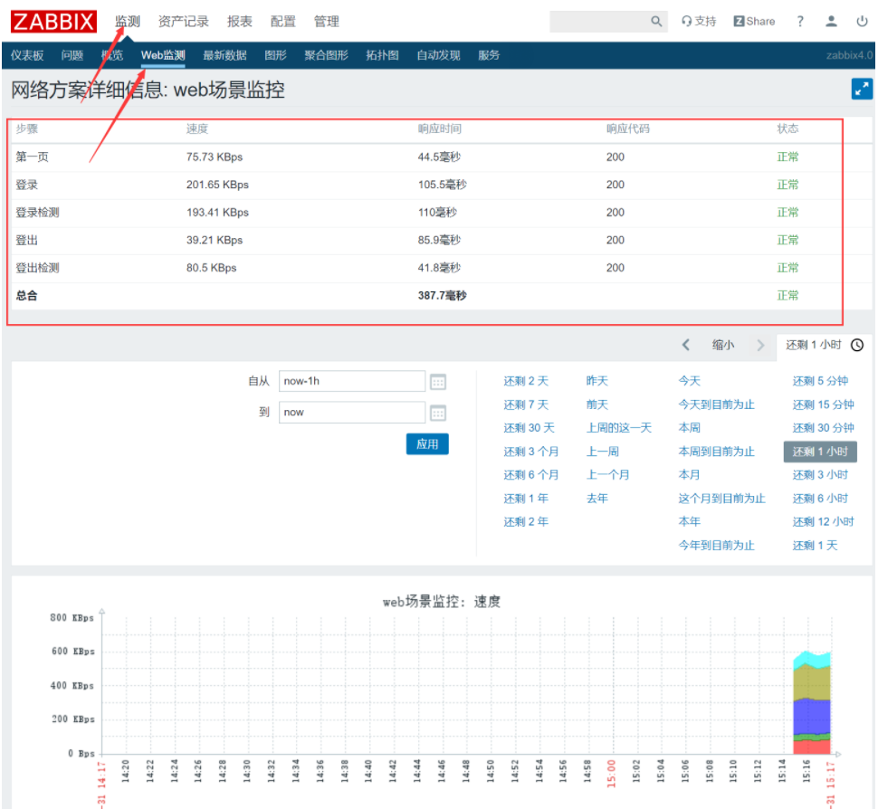

# zabbix监控
## 1.zabbix-server安装
```shell
yum install epel-release -y
getenforce 
sed -i 's/SELINUX=.*/SELINUX=disables/' /etc/selinux/config && setenforce 0
systemctl stop firewalld && systemctl disable firewalld
wget https://repo.zabbix.com/zabbix/4.0/rhel/7/x86_64/zabbix-release-4.0-1.el7.noarch.rpm
rpm -ivh zabbix-release-4.0-1.el7.noarch.rpm
yum install mariadb-server mariadb zabbix-server-mysql zabbix-web-mysql -y
systemctl start mariadb && systemctl enable mariadb
mysql_secure_installation
#全选y password设置为root
mysql -u root -p
create database zabbix character set utf8 collate utf8_bin;
grant all privileges on zabbix.* to zabbix@localhost identified by 'zabbix';
#导入zabbix数据库
zcat /usr/share/doc./zabbix-server-mysql-4.0.47/create.sql.gz | mysql -uzabbix -p zabbix
vi /etc./zabbix./zabbix_server.conf
    DBPassword=zabbix
vi /etc/httpd/conf.d./zabbix.conf
     #第20行
     php_value date.timezone Asia/Shanghai
systemctl start zabbix-server httpd && systemctl enable zabbix-server httpd
```


## 2.zabbix-agent安装
```shell
yum install zabbix-agent -y
systemctl start zabbix-agent && systemctl enable zabbix-agent
```


## 3.中文设置


## 4.中文乱码
```plain
使用windows电脑
win+r输入fonts
复制一个文件到服务器中
```


```shell
#修改为ttf格式
mv simsun.ttc simsun.ttf
mv simsun.ttf /usr/share./zabbix/assets/fonts/simsun.ttf
vim /usr/share./zabbix/include/defines.inc.php
    define('ZBX_GRAPH_FONT_NAME','simsun'); // font file name
#刷新网页
```


## 5.zabbix-agent节点安装
```shell
wget http://repo.zabbix.com./zabbix/4.0/rhel/7/x86_64./zabbix-agent-4.0.47-1.el7.x86_64.rpm
rpm -ivh zabbix-agent-4.0.47-1.el7.x86_64.rpm
sed -i 's/SELINUX=.*/SELINUX=disables/' /etc/selinux/config && setenforce 0
vim /etc/zabbix/zabbix_agentd.conf
    Server=192.168.107.199
    ServerActive=192.168.107.199
    Hostname=Tomcat01
vim /etc/zabbix/zabbix_agentd.conf
    Server=192.168.107.199
    ServerActive=192.168.107.199
    Hostname=Tomcat02
vim /etc/zabbix/zabbix_agentd.conf
    Server=192.168.107.199
    ServerActive=192.168.107.199
    Hostname=lb01
systemctl restart zabbix-agent
```


## 6.监控tomcat
```shell
添加zabbix存储库

rpm -ivh https://repo.zabbix.com/zabbix/4.2/rhel/7/x86_64/zabbix-release-4.2-1.el7.noarch.rpm
安装zabbix-java-getway （如果没有jdk，请先安装jdk）
yum -y install zabbix-java-gateway
修改配置文件（默认端口是10052，可根据服务器情况调整）

vim /etc/zabbix/zabbix_java_gateway.conf
启动zabbix-java-getway

systemctl start zabbix-java-gateway.service
开机启动

systemctl enable zabbix-java-gateway
查看java进程中是否有zabbix-java-getway的端口

netstat -lntp|grep java

vi /etc/zabbix/zabbix_java_gateway.conf 						#将以下内容取消注释并修改为如下
    ...
    LISTEN_IP="0.0.0.0"											#监控地址（默认地址）					
    LISTEN_PORT=10052											#监听端口
    PID_FILE="/var/run/zabbix/zabbix_java.pid"					#进程文件路径
    START_POLLERS=5												#开启的工作进程数
    ...
vi /etc/zabbix/zabbix_server.conf								#将以下内容取消注释并修改为如下(默认的情况下，zabbix server未启用javaPollers)
    ...
    JavaGateway=127.0.0.1										#JavaGateway的地址（本机安装可使用127.0.0.1）
    JavaGatewayPort=10052										#JavaGateway的端口号					
    StartJavaPollers=5											#开启的进程数量（大于客户端的数量）
    ...
systemctl restart zabbix-java-gateway
systemctl restart zabbix-server
```


```shell
vi /app/tomcat/bin/catalina.sh #在开头添加以下配置
CATALINA_OPTS="-Dcom.sun.management.jmxremote -Dcom.sun.management.jmxremote.authenticate=false -Dcom.sun.management.jmxremote.ssl=false -Dcom.sun.management.jmxremote.port=12345 -Djava.rmi.server.hostname=192.168.107.200"
#-Djava.rmi.server.hostname=192.168.107.200 为tomcat所在主机ip
/app/tomcat/bin/shutdown.sh
/app/tomcat/bin/startup.sh
```


### 开启tomcat的gzip功能


```xml
vi /app/tomcat/conf/server.xml

在Connector节点中加上如下属性
compression=“on” 打开压缩功能
compressionMinSize=“50” 启用压缩的输出内容大小，默认为2KB
noCompressionUserAgents=“gozilla, traviata” 对于以下的浏览器，不启用压缩
compressableMimeType=“text/html,text/xml,text/javascript,text/css,text/plain”　哪些资源类型需要压缩


    <Connector port="8080" protocol="HTTP/1.1"
               connectionTimeout="20000"
               redirectPort="8443"
               maxParameterCount="1000"
               compression="on"
               compressionMinSize="2048"
               noCompressionUserAgents="gozilla, traviata"
               compressableMimeType="text/html,text/xml,text/javascript,application/javascript,text/css,text/plain,text/json"
               />


 /app/tomcat/bin/shutdown.sh

 /app/tomcat/bin/startup.sh
```


## 7.监控nginx
### 配置nginx的stub_status模块
```shell
yum安装的nginx添加模块
/usr/local/nginx -V
cp -r /usr/local/nginx /usr/local/nginx_bak
wget http://nginx.org/download/nginx-1.24.0.tar.gz
tar -xzvf nginx-1.24.0.tar.gz -C /usr/local/
./configure --with-http_stub_status_module --prefix=/usr/local/nginx
make
make install
cp -rn /usr/local/nginx /usr/local/nginx_bak#复制新编译的文件到nginx目录下
mv /usr/local/nginx /usr/local/nginx_bak2
mv /usr/local/nginx_bak /usr/local/nginx#重命名nginx
[root@master local]# /usr/local/nginx/sbin/nginx -V
nginx version: nginx/1.24.0
built by gcc 4.8.5 20150623 (Red Hat 4.8.5-44) (GCC)
configure arguments: --with-http_stub_status_module --prefix=/usr/local/nginx

/usr/local/nginx/sbin/nginx


vi /usr/local/nginx/conf/nginx.conf
```


```nginx
    default_type  application/octet-stream;
    sendfile        on;
    keepalive_timeout  65;
    proxy_cache_path /opt/nginx/cache levels=1:2 keys_zone=one:10m;
    upstream tomcat{
        server 192.168.107.200:8080 weight=1;
        server 192.168.107.201:8080 weight=1;
    }
    server {
        listen       80;
        server_name  localhost;
        location / {
            proxy_pass http://tomcat;
            proxy_http_version  1.1;
            proxy_set_header Host $host;
            proxy_set_header X-Real-IP $remote_addr;
        }
        location ~ .*\.(gif|jpg|png|css|js|woff|flv|ico|swf)(.*) {
          proxy_cache one;
          proxy_cache_key $uri;
          proxy_cache_valid 200 302 1h;
          proxy_cache_valid 301 1d;
          proxy_cache_valid any 1m;
          expires 30d;
          add_header     Nginx-Cache   "$upstream_cache_status";
          proxy_pass http://tomcat;
          proxy_set_header Host $host;
          proxy_set_header X-Real-IP $remote_addr;
        }

        location /status {        #加上这个location模块
            stub_status on;
            access_log off;
            allow 127.0.0.1;
            allow 192.168.107.0/24;
            deny all;
        }
    }
    server {
        listen       80;
        server_name  jeesns.liyedong.com;
        location / {
            proxy_http_version  1.1; #使用http1.1版本
            proxy_pass http://tomcat;
            proxy_set_header Host $host; #负载均衡以后继续传递host字段
            proxy_set_header X-Real-IP $remote_addr; #传递真是ip
        }
    }
}
```


```shell
/usr/local/nginx/sbin/nginx -s reload
curl localhost/status
            Active connections: 3
            server accepts handled requests
             10 10 12
            Reading: 0 Writing: 1 Waiting: 2
```


### 配置zabbix监控
```shell
vi /etc/zabbix/zabbix_agentd.d/nginx_status.conf 
UserParameter=Nginx.Active.Connections,/usr/bin/curl -s localhost/status 2>/dev/null |grep 'Active connections:'|awk '{print $NF}'
#在zabbix-server端
yum install zabbix-get -y
[root@master ~]# zabbix_get -s 192.168.107.202 -p 10050 -k "Nginx.Active.Connections"
1 #取值成功
```


```shell
#监控Nginx活动连接数
UserParameter=Nginx.Active.Connections,/usr/bin/curl -s localhost/status 2>/dev/null |grep 'Active connections:'|awk '{print $NF}'
#监控Nginx总共处理的连接数
UserParameter=Nginx.Accepts.Connections,/usr/bin/curl -s localhost/status 2>/dev/null|sed -n '3p'|awk '{print $1}'
#监控Nginx成功创建的握手次数
UserParameter=Nginx.Handled.Connections,/usr/bin/curl -s localhost/status 2>/dev/null|sed -n '3p'|awk '{print $2}'
#监控Nginx总共处理的请求次数
UserParameter=Nginx.requests.Connections,/usr/bin/curl -s  localhost/status 2>/dev/null|sed -n '3p'|awk '{print $3}'
#Nginx读取到客户端的连接数
UserParameter=Nginx.Reading,/usr/bin/curl -s  localhost/status 2>/dev/null|sed -n '4p'|awk '{print $2}'
#Nginx响应数据到客户端的数量
UserParameter=Nginx.Writing,/usr/bin/curl -s localhost/status 2>/dev/null|sed -n '4p'|awk '{print $4}'
#Nginx处理完并等候状态的驻留连接
UserParameter=Nginx.Waiting,/usr/bin/curl -s localhost/status 2>/dev/null|sed -n '4p'|awk '{print $6}'
```


## 8.监控redis
```shell
关闭selinux
sed -i 's/SELINUX=.*/SELINUX=disables/' /etc/selinux/config && setenforce 0
getenforce 
添加zabbix存储库
rpm -ivh http://repo.zabbix.com/zabbix/4.2/rhel/7/x86_64/zabbix-release-4.2-1.el7.noarch.rpm

yum install zabbix-agent -y
vi /etc/zabbix/zabbix_agentd.conf
    Server=192.168.107.199
    ServerActive=192.168.107.199
    Hostname=Redis01   
    #host为主机名，需要和web界面名称一致   server和serveractive的ip都为zabbix-server端
systemctl start zabbix-agent
systemctl enable zabbix-agent
systemctl start redis
systemctl enable redis
```


```shell
vi /etc/zabbix/zabbix_agentd.d/redis.conf

UserParameter=redis[*],redis-cli -h 127.0.0.1 -p 6379 -a redispwd --no-auth-warning info | grep $1":" | cut -d ':' -f 2
UserParameter=redis-ping,redis-cli -h 127.0.0.1 -p 6379 -a redispwd --no-auth-warning ping | grep -c PONG
UserParameter=redis.version, redis-server --version | cut -d " " -f 3 | cut -d "=" -f 2

systemctl restart zabbix-agent
```


[Template App Redis.xml](https://www.yuque.com/attachments/yuque/0/2024/xml/40598547/1709987456807-9dc342ea-8920-4cc2-ac5c-fccccf42f50c.xml)


## 9.监控对应服务进程
### zabbix_get获取数据
zabbix监控可以使用默认自带的键值来监控服务进程存活，本文已时间服务器ntp进程为例，监控进程存活，理论适用于所有进程。


使用的键值proc.num[,,,]


格式说明：


:进程名字，默认为“all processes”  
:运行该进程的用户，默认为“all users”  
:进程状态，默认是all，可以进一步设定比如run,sleep等  
:模糊匹配


请确保监控端已安装agent，请将192.168.x.x替换成你自己的客户端地址


1、在服务端执行


由于ntpd服务是通过nginx用户执行的，所以这里运行该进程的用户就填写nginx,进程名字也可以通过模糊搜索进行匹配


```shell
[root@master ~]# zabbix_get -s 192.168.107.202 -k 'proc.num[,nginx,,nginx]'
2
nginx默认一个工作进程，开启缓存再加一个缓存进程，所以有两个
/usr/local/nginx/sbin/nginx -s stop
[root@master ~]# zabbix_get -s 192.168.107.202 -k 'proc.num[,nginx,,nginx]'
0
```


### 配置触发器


```shell
/usr/local/nginx/sbin/nginx -s stop
```


```shell
/usr/local/nginx/sbin/nginx
```


## 10.主动agent和被动agent
### 被动式agent识别
```plain
IP address / DNS name
```


### 主动式agent识别
```plain
明确设置Hostname
没有设置Hostname时使用HostnameItem
默认为system.hostname
```


### Agent配置
```plain
StartAgents设置为0时，禁用被动式agent
注释掉ServerActive时，禁用主动式agent
同时禁用主动和被动模式的时候，agent会报错：
zabbix-agentd[16208]: ERROR: either active or passive checks must be enabled
```


## 12.触发器
### 什么是触发器
```plain
触发器就是用监控项采集的数据来“评估”该监控项状态的逻辑表达式。
触发器表达式通过定义的阈值，和采集的数据进行比较，超出阀值时触发器会被触发。
例如：
CPU负载太高
主机用ICMP不可达
数据库宕机
应用没有运行... ...
```


```plain
触发器的状态：
    OK-一个正常的触发器状态。触发器表达式计算结果为假（False）
    PROBLEM-发生了某些事情，状态异常，比如处理器的负载较高。触发器表达式计算结果为真（True）
    UNKNOWN–通过表达式无法确定触发器的状态，通常是因为错误的数据造成
触发器的计算
    每次Zabbix server接收到作为表达式一部分的监控项的新值时，都会重新计算触发器状态（表达式）
    如果在表达式中使用基于时间的函数(nodata(), date(), dayofmonth(), dayofweek(),time(), now())，触发器就会由Zabbix history syncer进程每30秒重新计算一次
    如果在表达式中同时使用基于时间和非基于时间的函数，当接收到一个新值和每隔30秒都会重新计算触发器的状态
```


## 13.zabbix设置QQ邮箱告警
### 获取授权码
首先在QQ邮箱中，开启POP3/SMTP服务 来获得授权码，QQ邮箱—>设置—>账户—>开启POP3/SMTP服务,获取授权码


```plain
ssssss
```


### 准备重启脚本
```shell
为zabbix用户分配sudo权限
visudo
zabbix  ALL=(ALL) NOPASSWD: ALL


vi /etc/zabbix/zabbix_agentd.conf
EnableRemoteCommands=1
#Defaults requiretty#这个注释掉
可以更精细化
或者
# visudo 添加：
Defaults:zabbix !requiretty
zabbix ALL=(ALL) NOPASSWD: /usr/bin/systemctl restart nginx


systemctl restart zabbix-agent

zabbix_get -s 192.168.107.202 -k "system.run[sudo /usr/local/nginx/sbin/nginx]"
zabbix_get -s 192.168.107.202 -k "system.run[sudo /usr/local/nginx/sbin/nginx -s stop]"

```


### 选择脚本重启时机


### 测试脚本和邮箱
```plain
 /usr/local/nginx/sbin/nginx -s stop
```


### 测试邮箱成功


### 执行脚本成功，服务恢复


## 14.绘制动态拓补图
### 添加主机


### 选中两台主机相连，并且添加链接指示器，同时使用宏变量来进行对网卡出入口网速的检测


### 停止nginx服务，观察效果
```plain
/usr/local/nginx/sbin/nginx -s stop
```


### 测试成功


### nginx自动重启脚本成功，告警恢复


## 15.低级发现规则


```plain
#server端进行测试
zabbix_get -s 192.168.107.202 -k vfs.fs.discovery
```


### 添加发现规则监控项原型


### 添加触发器原型


### 创建图形原型


### 检测效果


## 16.web场景监控
### 第一页的页面检测
```plain
判断是否具有Zabbix SIA，其他字符串也是可以的
```


### 登录接口
```plain
登录接口的地址为http://192.168.107.199/zabbix/index.php
请求的的数据类型为Formdata
    参数有三个，分别是
    name，password，enter
    Admin，zabbix，Sign in
```


### 登录接口的检测
```plain
登录成功后根据页面上有的字符串进行判断是否成功，这边选择“监测”这两个字
```


### 登出接口
```plain
请求地址为http://192.168.107.199.zabbix/index.php
请求数据有两个，类型也有两个
    第一个为query string parameters
    实际上就是使用？跟着请求地址后面作为参数
    另一个就是formdata与登录接口的数据格式一致
检测登出成功，就是返回首页，可以根据登录页的字符串来进行匹配，可以与第一个页面的检测配置一致，这边选择Username字符串作为监测字符串。
```


### 配置web监测


```plain
配置名称，客户端的请求头，还有变量
```


```plain
配置步骤
```


### 添加步骤1-页面访问
```plain
根据上面的接口分析，来进行监测，并且设置跟随跳转
```


### 添加步骤2-登录
```plain
根据对登录接口进行请求，来进行登录
由上面的接口分析得，请求数据为formdata
封装请求数据
根据请求成功返回的html文本流，匹配正则：regex:name="csrf-token" content="([0-9a-z]{16})"
获得sid，退出时需要使用
```


### 添加步骤3-登录检测
```plain
根据登录成功后跳转的页面上的字符串来进行判断
```


### 添加步骤4-登出
```plain
根据登出接口的请求数据来进行数据的封装
```


### 添加步骤5-登出检测
```plain
根据登出后重定向的界面字符串进行匹配，可以跟第一步的字符串一致，这边选择Username这个字符串
```


### 查看数据



## 17.公司门户系统的检测
### 接口分析
```plain
门户首页地址：http://portal.kehua.com/
登录接口地址：http://login.kehua.com:11502/cas/login，参数根据图分析得出
登录检测url：http://portal.kehua.com/web/guest/index
登出url：http://portal.kehua.com/c/portal/logout
登出检测：http://portal.kehua.com/
```


### 配置


#### 步骤一


#### 步骤二


#### 步骤三


#### 步骤四


#### 步骤五


### 结果查看


## 18.配置zabbix proxy
### zabbix-proxy端
```shell
yum install epel-release -y
getenforce 
sed -i 's/SELINUX=.*/SELINUX=disables/' /etc/selinux/config && setenforce 0
systemctl stop firewalld && systemctl disable firewalld
yum install wget -y
wget --no-check-certificate https://repo.zabbix.com/zabbix/4.0/rhel/7/x86_64/zabbix-release-4.0-1.el7.noarch.rpm
rpm -ivh zabbix-release-4.0-1.el7.noarch.rpm
yum install fping -y
yum install OpenIPMI-libs.x86_64 -y
yum install OpenIPMI-modalias.x86_64 -y
yum install zabbix-proxy-mysql -y
yum install mariadb-server -y
systemctl start mariadb.service
systemctl enable mariadb.service
mysql_secure_installation #安全初始化
mysql
create database zabbix_proxy character set utf8;    #创建zabbix_proxy数据库
grant all on zabbix_proxy.* to zabbix@localhost identified by 'zabbix'; #授予zabbix用户本地密码登录的权限
flush privileges;  #刷新权限
gunzip /usr/share/doc/zabbix-proxy-mysql-4.0.48/schema.sql.gz

mysql -uzabbix -pzabbix zabbix_proxy < /usr/share/doc/zabbix-proxy-mysql-4.0.48/schema.sql
vi /etc/zabbix/zabbix_proxy.conf
```


```shell
Server=192.168.107.199    zabbix服务端的IP
ServerPort=10051       默认配置
Hostname=Zabbix-proxy   代理的名字，服务端的代理名字要和这里保持一致
LogFile=               日志目录默认
LogFileSize=0          指定日志输出级别默认
DBHost=localhost       数据库IP，如果在同一台机器就填localhost可以
DBName=zabbix_proxy    数据库名
DBUser=zabbix          数据库用户名
DBPassword=zabbix             数据库密码
DBSocket=/tmp/mariadb.sock  socket文件
DBPort=3306            数据库连接端口
DataSenderFrequency=5  与zabbix服务端同步数据的时间间隔，这里设置为5秒
```


```shell
#当agent端重启完后，代理端再重启，否则无法识别agent端的主机名
systemctl restart zabbix-proxy
```


### zabbix-agent端
```plain
 vi /etc/zabbix/zabbix_agentd.conf
```


```shell
Server=192.168.107.198         #zabbix-proxy端IP
ServerActive=192.168.107.198         # zabbix-proxy端IP
Hostname=zabbix-proxy                # 主机名，server的主机名要与这里配置一致
```


```shell
systemctl restart zabbix-agent
```


### zabbix-server


