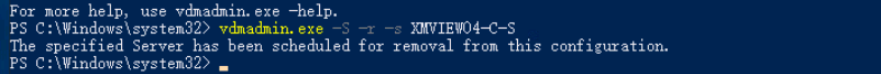
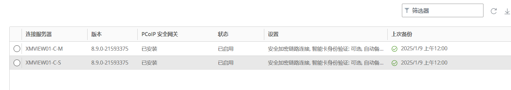

# 问题记录：不小心将第二套horizon的副本服务器加入到第一套之中，如何处理，清理无效连接服务器。
首先先全部卸载组件，然后重新加入正确的连接服务器地址，即可。

在第一套horizon控制台禁止这个连接服务器，然后进入第一套的连接服务器，哪台哦都可以，执行如下命令,需要时view administrators组里的用户才可以。

```plain
vdmadmin.exe -S-r -s XMVIEWO4-C-S
```

执行结果如下



horizon控制台已经没有这个连接服务器了。



# <font style="color:rgb(0, 0, 0);">使用 -S 选项移除连接服务器实例或安全服务器条目</font>
<font style="color:rgb(86, 86, 86);">您可以使用带</font><font style="color:rgb(86, 86, 86);"> </font><font style="color:rgb(86, 86, 86);">-S</font><font style="color:rgb(86, 86, 86);"> </font><font style="color:rgb(86, 86, 86);">选项的</font><font style="color:rgb(86, 86, 86);"> </font><font style="color:rgb(86, 86, 86);background-color:rgb(245, 245, 245);">vdmadmin</font><font style="color:rgb(86, 86, 86);"> </font><font style="color:rgb(86, 86, 86);">命令从</font><font style="color:rgb(86, 86, 86);"> </font><font style="color:rgb(86, 86, 86);">Horizon 7</font><font style="color:rgb(86, 86, 86);"> </font><font style="color:rgb(86, 86, 86);">配置中移除连接服务器实例或安全服务器条目。</font>

## <font style="color:rgb(0, 0, 0);">语法</font>
```plain
vdmadmin  -S [-b authentication_arguments] -r-s server
```

## <font style="color:rgb(0, 0, 0);">用法说明</font>
<font style="color:rgb(86, 86, 86);">为确保高可用性，您可以利用</font><font style="color:rgb(86, 86, 86);"> </font><font style="color:rgb(86, 86, 86);">Horizon 7</font><font style="color:rgb(86, 86, 86);"> </font><font style="color:rgb(86, 86, 86);">在连接服务器组中配置一个或多个副本连接服务器实例。如果您禁用组中的一个连接服务器实例，该服务器条目仍会保留在</font><font style="color:rgb(86, 86, 86);"> </font><font style="color:rgb(86, 86, 86);">Horizon 7</font><font style="color:rgb(86, 86, 86);"> </font><font style="color:rgb(86, 86, 86);">配置中。</font>

<font style="color:rgb(86, 86, 86);">您也可使用带</font><font style="color:rgb(86, 86, 86);"> </font><font style="color:rgb(86, 86, 86);">-S</font><font style="color:rgb(86, 86, 86);"> </font><font style="color:rgb(86, 86, 86);">选项的</font><font style="color:rgb(86, 86, 86);"> </font><font style="color:rgb(86, 86, 86);background-color:rgb(245, 245, 245);">vdmadmin</font><font style="color:rgb(86, 86, 86);"> </font><font style="color:rgb(86, 86, 86);">命令从</font><font style="color:rgb(86, 86, 86);"> </font><font style="color:rgb(86, 86, 86);">Horizon 7</font><font style="color:rgb(86, 86, 86);"> </font><font style="color:rgb(86, 86, 86);">环境中移除安全服务器。如果您想要升级或重新安装安全服务器而非永久移除，则您无需使用此选项。</font>

<font style="color:rgb(86, 86, 86);">要永久移除条目，请执行以下任务：</font>

1. <font style="color:rgb(86, 86, 86);">运行连接服务器安装程序，从 Windows Server 计算机中卸载连接服务器实例或安全服务器。</font>
2. <font style="color:rgb(86, 86, 86);">运行“添加或移除程序”工具，从 Windows Server 计算机中移除 Adam Instance VMwareVDMDS 程序。</font>
3. <font style="color:rgb(86, 86, 86);">在另一个连接服务器实例上，使用</font><font style="color:rgb(86, 86, 86);"> </font><font style="color:rgb(86, 86, 86);background-color:rgb(245, 245, 245);">vdmadmin</font><font style="color:rgb(86, 86, 86);"> </font><font style="color:rgb(86, 86, 86);">命令从配置中移除已卸载的连接服务器实例或安全服务器的条目。</font>

<font style="color:rgb(86, 86, 86);">如果您想在已移除的系统中重新安装</font><font style="color:rgb(86, 86, 86);"> </font><font style="color:rgb(86, 86, 86);">Horizon 7</font><font style="color:rgb(86, 86, 86);">，但并不想复制原始组的</font><font style="color:rgb(86, 86, 86);"> </font><font style="color:rgb(86, 86, 86);">Horizon 7</font><font style="color:rgb(86, 86, 86);"> </font><font style="color:rgb(86, 86, 86);">配置，请在重新安装前重新启动原始组中的所有连接服务器主机。此操作可防止重新安装的连接服务器实例从原始组中接收配置更新。</font>

## <font style="color:rgb(0, 0, 0);">选项</font>
<font style="color:rgb(86, 86, 86);">-s</font><font style="color:rgb(86, 86, 86);"> </font><font style="color:rgb(86, 86, 86);">选项指定了要移除的连接服务器实例或安全服务器的 NetBIOS 名称。</font>

## <font style="color:rgb(0, 0, 0);">示例</font>
<font style="color:rgb(86, 86, 86);">移除连接服务器实例 connsvr3 的条目。</font>

```plain
vdmadmin -S -r -s connsvr3
```


