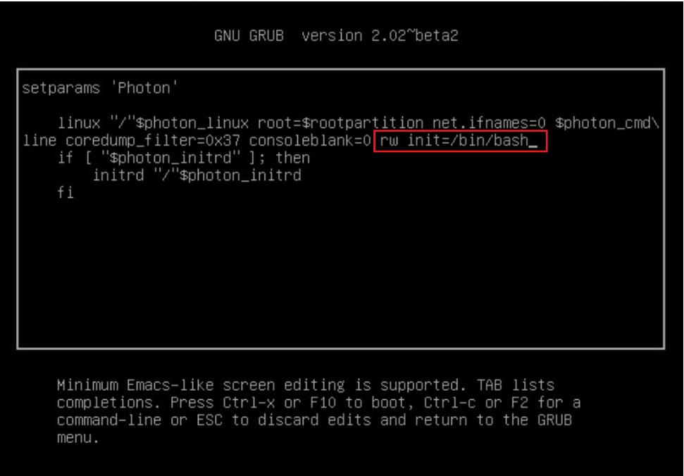

重启vcenter，按e进入安全模式    



<font style="color:rgb(100, 100, 109);">按F10，启动，使用chpasswd或者passwd 命令修改root密码</font>

<font style="color:rgb(100, 100, 109);">推荐使用以下方式修改，避免因为输入法原因无法修改</font>

```shell
echo "root:password" | chpasswd #适合大部分发行版
umount /
reboot -f
```


<font style="color:rgb(100, 100, 109);">为了规避90天之后又出现同样的无法登录问题，登录https://vcsa_fqdn:5480；系统管理，密码过期设置，编辑，密码到期修改为否。</font>


