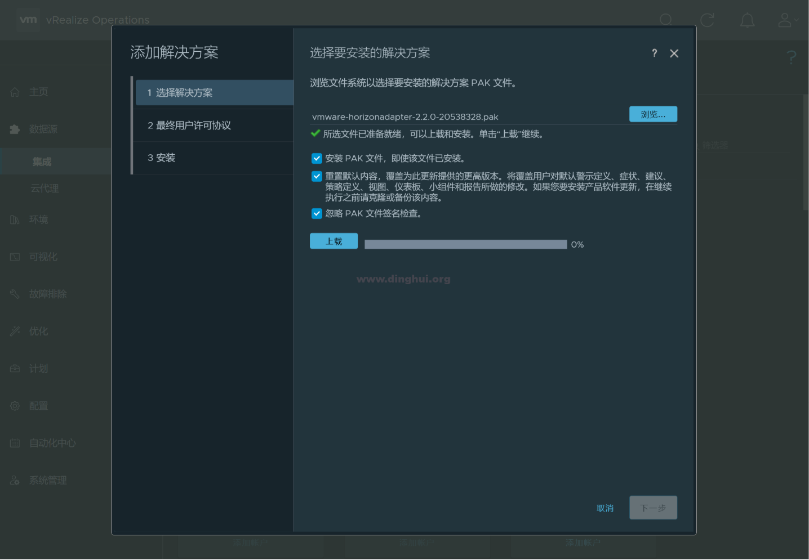
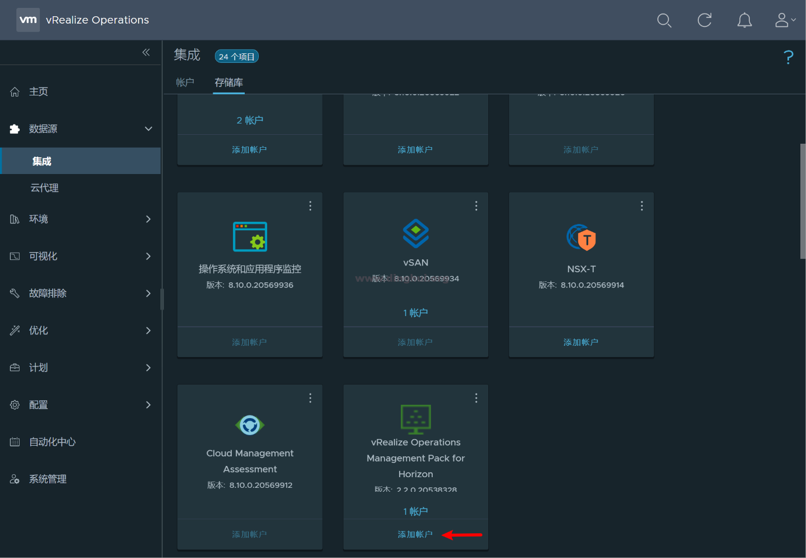
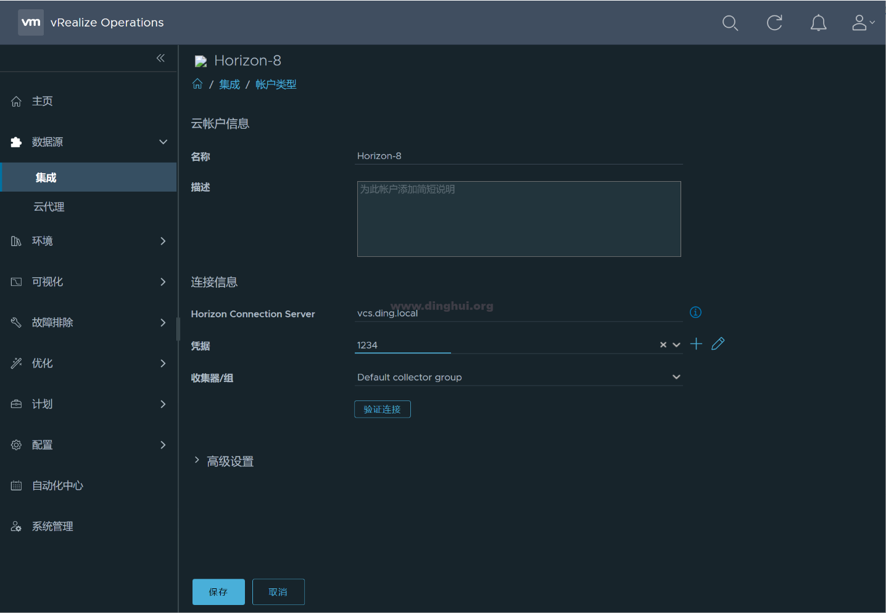
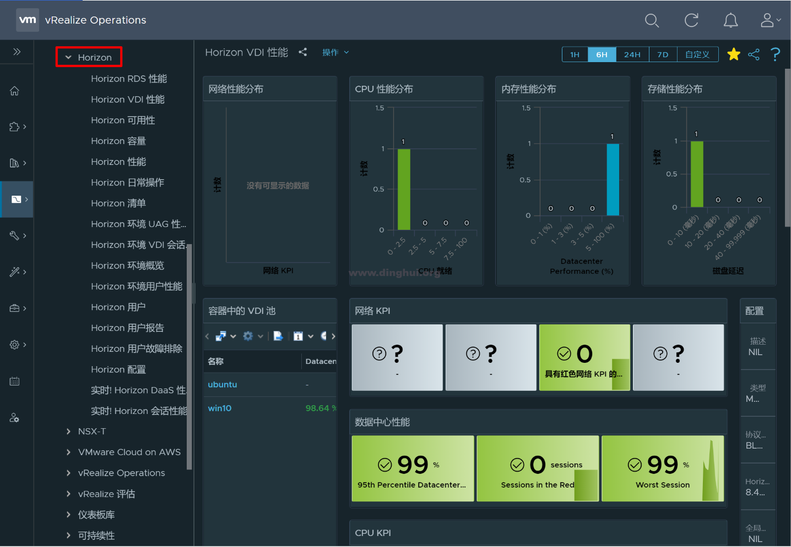
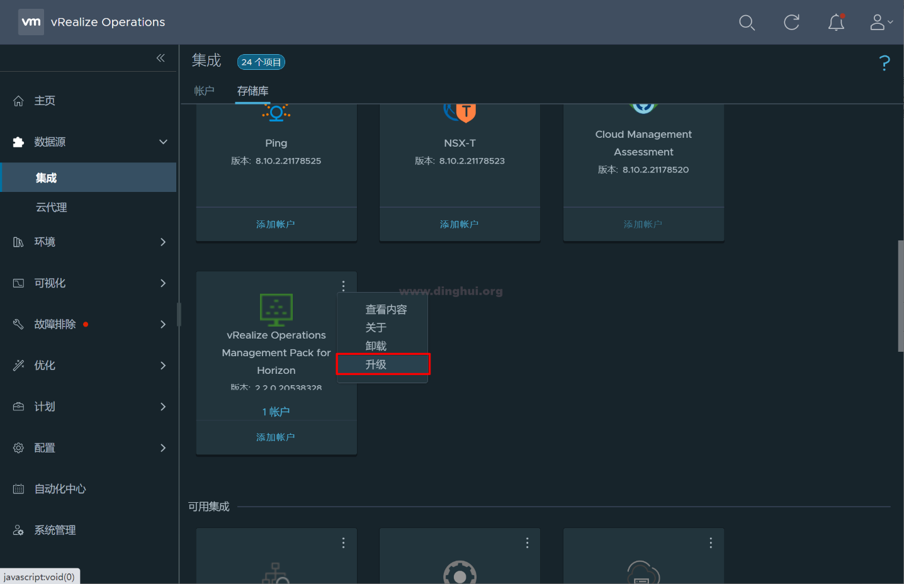
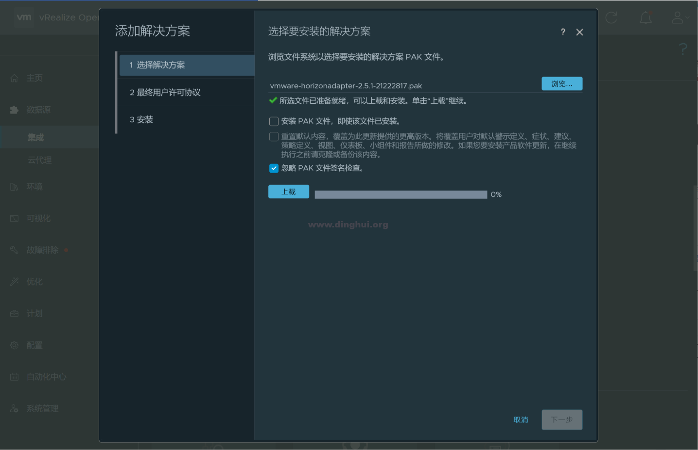
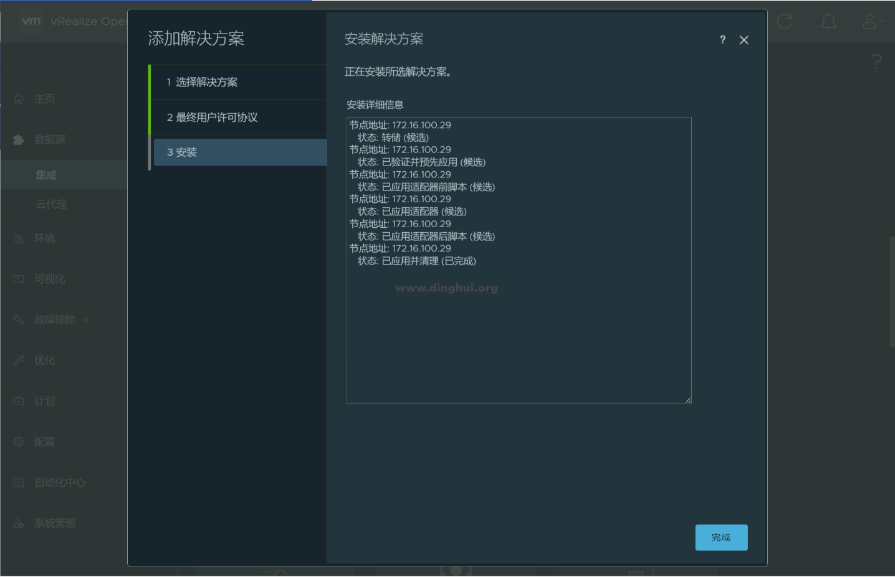
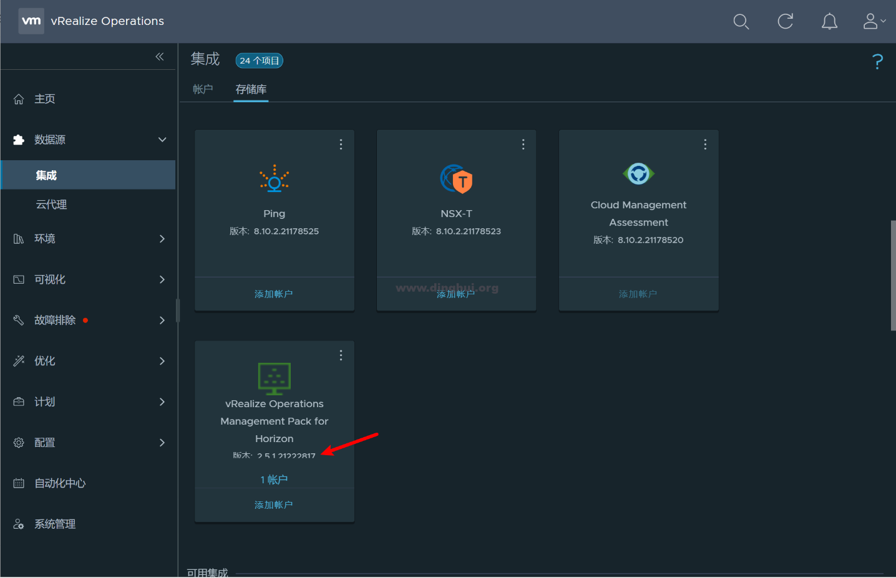
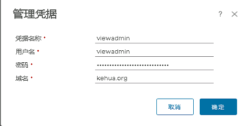

# 上载pak文件
首先上传pak文件



<font style="color:rgb(100, 100, 109);">按照提示下一步，同意协议，直到提示安装成功。</font>

<font style="color:rgb(100, 100, 109);">单击 vRealize Operations Management Pack for Horizon 图标上的添加帐户。</font>

<font style="color:rgb(100, 100, 109);">按照提示，输入连接服务器的FQDN，凭据信息（vdi管理员用户名和密码，域信息）</font>

<font style="color:rgb(100, 100, 109);">验证连接后，提示成功后保存。</font>

<font style="color:rgb(100, 100, 109);">Tips：由于在安装vRealize Operations的时候没有配置DNS，导致提示无法连接，参考下面DNS配置添加DNS后即正常。</font>



<font style="color:rgb(100, 100, 109);">多了一个Horizon目录，慢慢体验吧……</font>

# <font style="color:rgb(100, 100, 109);">升级pak文件</font>
<font style="color:rgb(100, 100, 109);">升级：以2.2升级到2.5.1为例。</font>



<font style="color:rgb(100, 100, 109);">集成，存储库，找到Horizon包，升级。</font>

<font style="color:rgb(100, 100, 109);">浏览，上传最新的Horizon包，上载；</font>

<font style="color:rgb(100, 100, 109);">完成，版本已经升级成功。</font>

# 关于horizon的连接配置问题
因为高版本的horizon中，如果没有dns解析，将无法正常连接horizon，所以需要配置dns

## dns配置教程
```shell
#进入虚拟机
#输入root
root
#输入新密码
Ops#123456
#再次输入新密码
Ops#123456
#进入root用户
vi /etc/resolv.conf 
nameserver DNS_Server_1
nameserver DNS_Server_2
search searchpath
#搜索路径和第二个 DNS 服务器都是可选项，可以跳过。
#运行如下命令确认 DNS 已更改：
resolvectl status
```

## horizon配置数据源后失败
确认dns，FQDN是否正确，如果都正确，则开始进行配置用户，与horizon控制台登录一致即可



