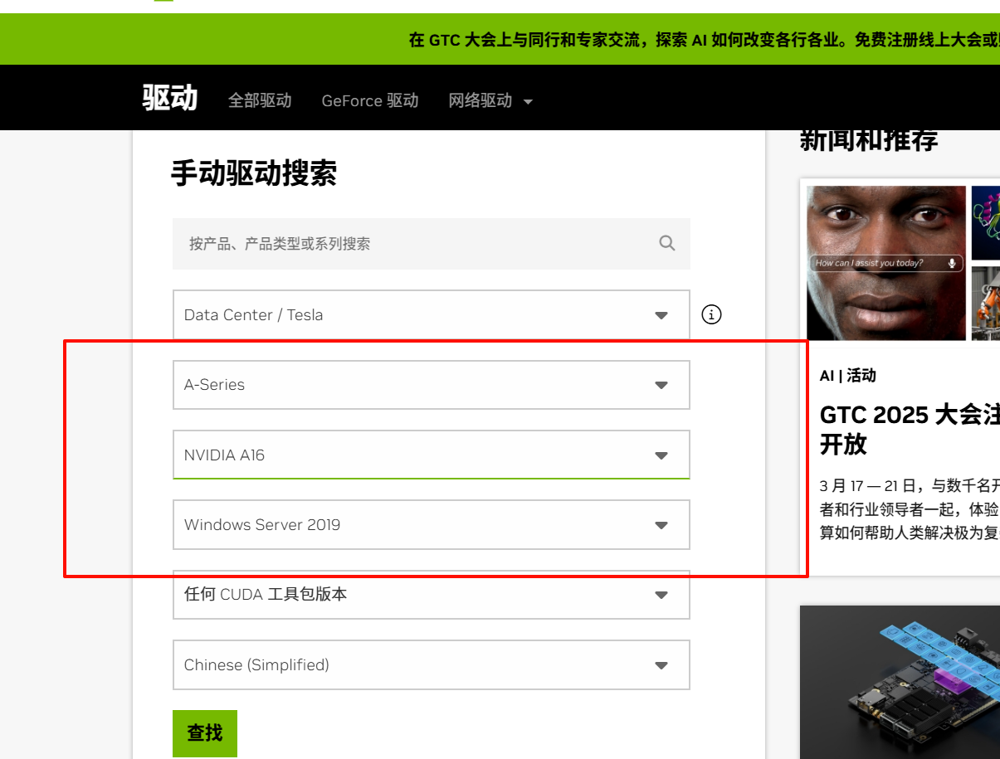
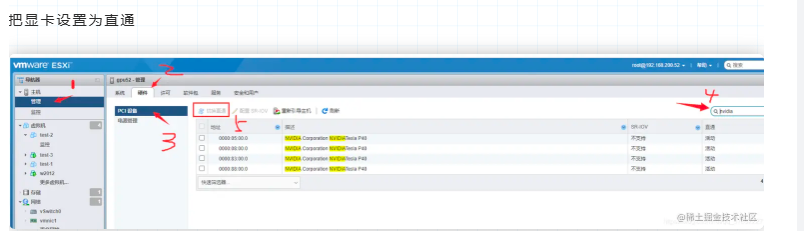
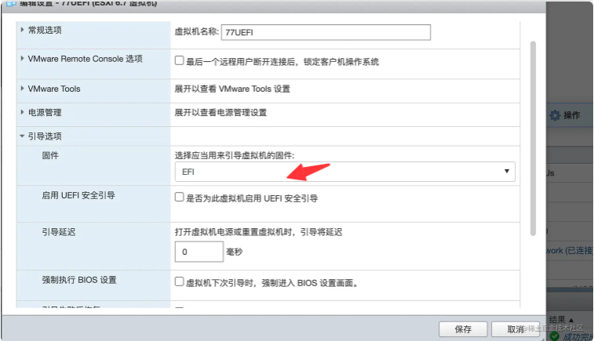
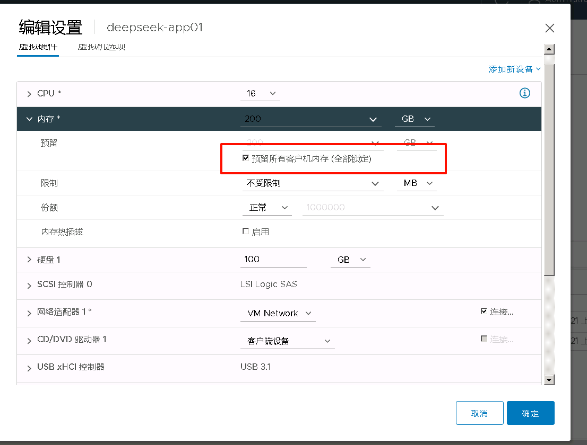
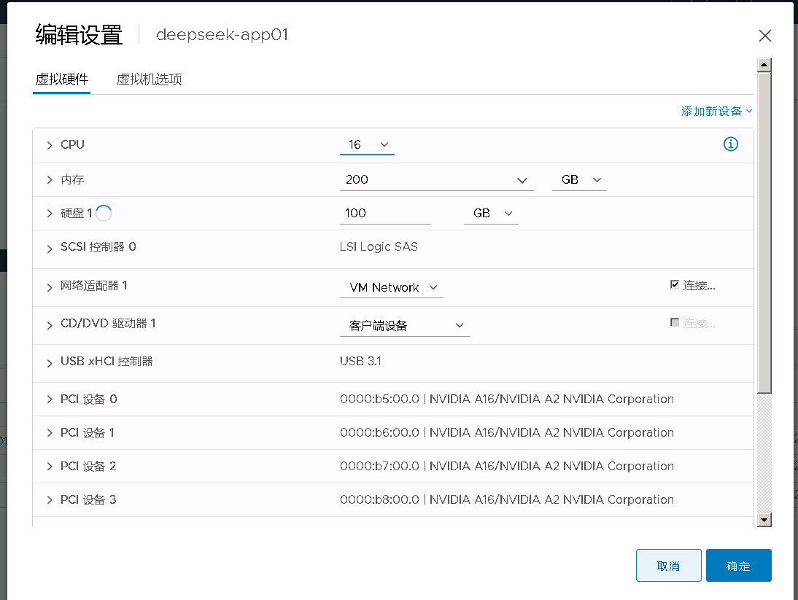
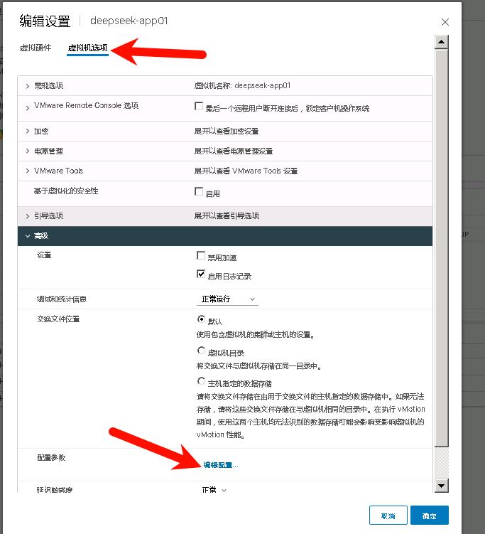
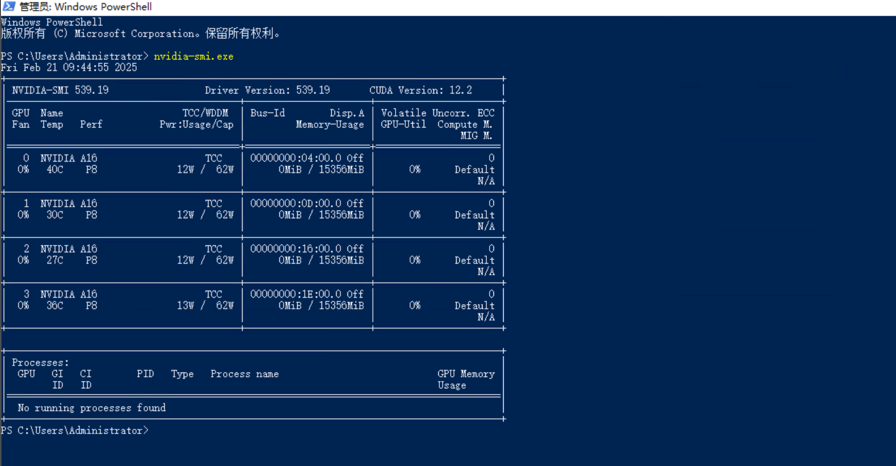

[https://juejin.cn/post/7248072694335799333](https://juejin.cn/post/7248072694335799333)

本次虚拟机使用windows server 2019

根据显卡型号和操作系统型号查找最新驱动，进行下载

[https://www.nvidia.cn/drivers/lookup/](https://www.nvidia.cn/drivers/lookup/)



勾选全部的显卡设备，设置为直通，重新引导服务器，不需要管有没有报错，全选中，设置直通，然后选择重新引导



检查虚拟机是否是uefi引导



预留所有客户机内存



我这里的配置是16核，200G内存，4个A16模块共64GB显存





添加以下参数，128为显存64GB的两倍， MMIO 配置提供了显卡与虚拟机之间的内存映射地址，用于显卡访问其显存并进行数据交换。显卡的显存需要通过 MMIO 地址空间映射到虚拟机中，以确保 GPU 能够正确访问。  内存大小必须大于128GB

```shell
pciPassthru.use64bitMMIO=TRUE

pciPassthru.64bitMMIOSizeGB=128

hypervisor.cpuid.v0= FALSE
```

进入操作系统安装驱动后，直接进入powershell，使用nvidia-smi命令查看显存是否生效，可以看到驱动版本539.19，CUDA版本为12.2，显存4个模块已经全部认到了，本次显卡直通结束。



